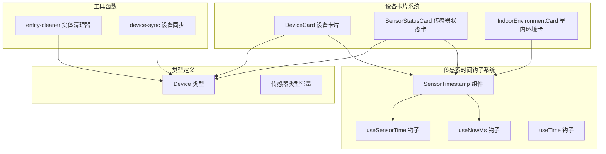
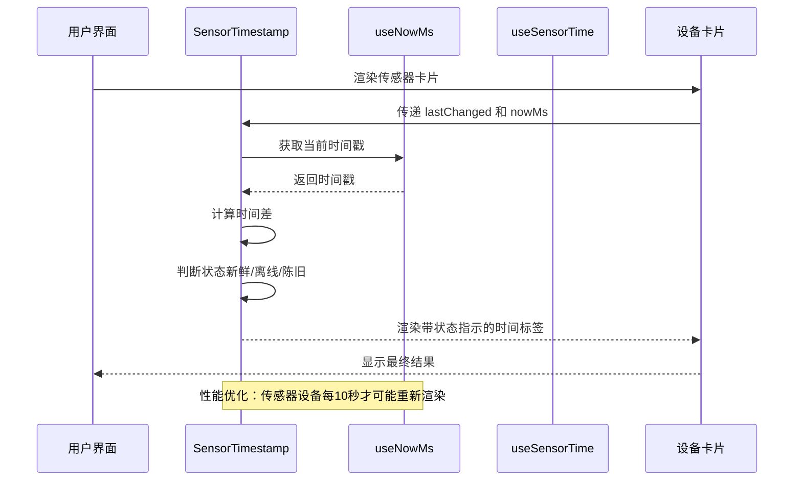
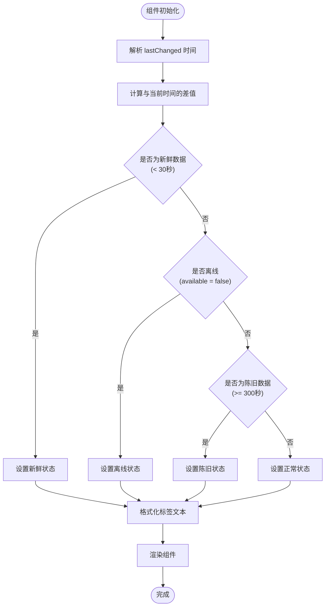
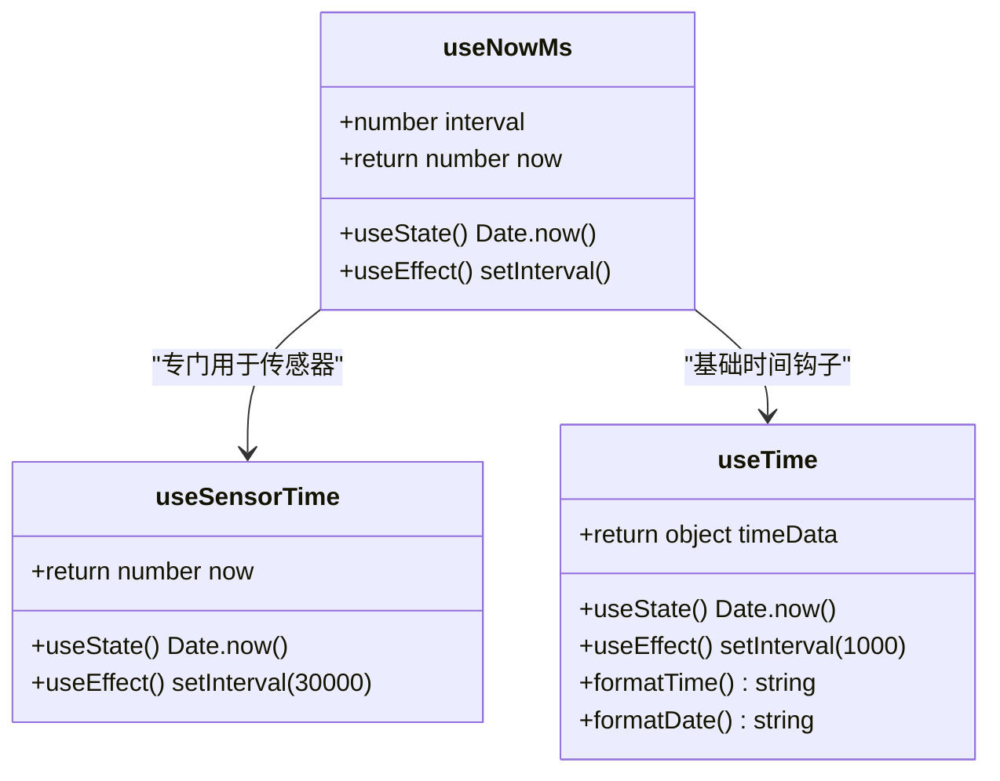
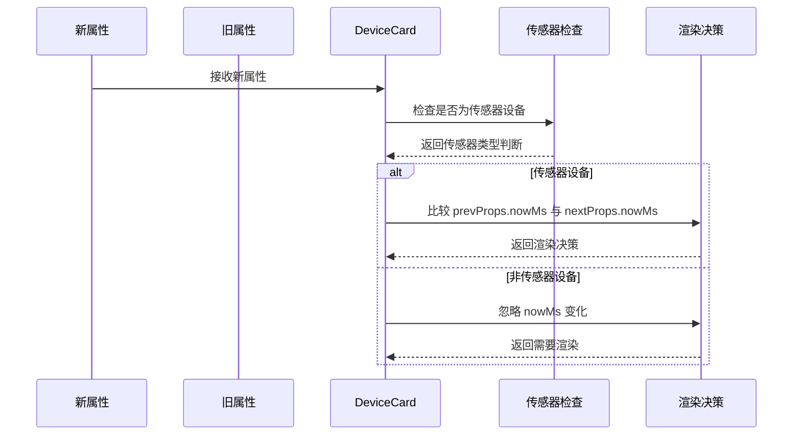
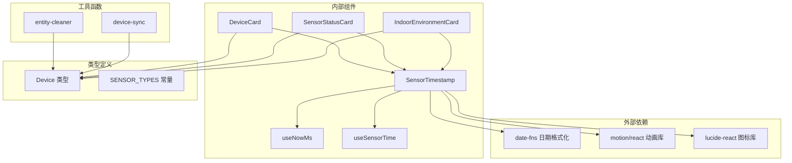

# 传感器时间钩子

<cite>
**本文档引用的文件**
- [SensorTimestamp.tsx](file://src/app/components/dashboard/SensorTimestamp.tsx)
- [useNowMs.ts](file://src/hooks/useNowMs.ts)
- [useTime.ts](file://src/hooks/useTime.ts)
- [DeviceCard.tsx](file://src/app/components/dashboard/DeviceCard.tsx)
- [SensorStatusCard.tsx](file://src/app/components/dashboard/cards/SensorStatusCard.tsx)
- [IndoorEnvironmentCard.tsx](file://src/app/components/dashboard/cards/IndoorEnvironment/IndoorEnvironmentCard.tsx)
- [device.ts](file://src/types/device.ts)
- [entity-cleaner.ts](file://src/utils/entity-cleaner.ts)
- [device-sync.ts](file://src/utils/device-sync.ts)
- [SensorTimestamp.test.tsx](file://src/app/components/dashboard/__tests__/SensorTimestamp.test.tsx)
</cite>

## 目录
1. [简介](#简介)
2. [项目结构](#项目结构)
3. [核心组件](#核心组件)
4. [架构概览](#架构概览)
5. [详细组件分析](#详细组件分析)
6. [依赖关系分析](#依赖关系分析)
7. [性能考虑](#性能考虑)
8. [故障排除指南](#故障排除指南)
9. [结论](#结论)

## 简介

传感器时间钩子是 HAUI 项目中的一个关键功能模块，专门用于处理和显示传感器设备的状态更新时间。该系统通过智能的时间管理机制，为用户提供准确的传感器数据新鲜度指示，包括实时状态、离线检测和相对时间显示等功能。

该模块的核心价值在于：
- **性能优化**：通过自定义的时间钩子减少不必要的组件重渲染
- **用户体验**：提供直观的传感器状态可视化和时间更新指示
- **准确性**：精确计算传感器数据的新鲜度和离线状态
- **可扩展性**：支持多种传感器类型和不同的显示模式

## 项目结构

传感器时间钩子系统在项目中的组织结构如下：

**图表来源**
- [SensorTimestamp.tsx:1-65](file://src/app/components/dashboard/SensorTimestamp.tsx#L1-L65)
- [useNowMs.ts:1-66](file://src/hooks/useNowMs.ts#L1-L66)
- [DeviceCard.tsx:285-302](file://src/app/components/dashboard/DeviceCard.tsx#L285-L302)

**章节来源**
- [SensorTimestamp.tsx:1-65](file://src/app/components/dashboard/SensorTimestamp.tsx#L1-L65)
- [useNowMs.ts:1-66](file://src/hooks/useNowMs.ts#L1-L66)
- [DeviceCard.tsx:180-214](file://src/app/components/dashboard/DeviceCard.tsx#L180-L214)

## 核心组件

### SensorTimestamp 组件

SensorTimestamp 是时间钩子系统的核心组件，负责显示传感器的状态更新时间。该组件支持两种显示模式：完整模式和紧凑模式，并提供实时的状态指示。

主要特性：
- **双模式显示**：支持完整日期时间显示和简洁时间显示
- **状态指示**：通过颜色和动画显示传感器的实时状态
- **离线检测**：自动检测传感器离线状态
- **新鲜度判断**：智能判断数据是否新鲜（30秒内）

### useNowMs 钩子

useNowMs 是一个高性能的时间钩子，专门为传感器时间显示优化。它提供了两种不同的更新策略：

- **默认策略**：每10秒更新一次，适用于大多数场景
- **传感器专用策略**：每30秒更新一次，专门用于相对时间显示

### useSensorTime 钩子

useSensorTime 是专门为传感器相对时间显示设计的钩子，提供更精确的时间更新控制。

**章节来源**
- [SensorTimestamp.tsx:7-38](file://src/app/components/dashboard/SensorTimestamp.tsx#L7-L38)
- [useNowMs.ts:12-42](file://src/hooks/useNowMs.ts#L12-L42)
- [useTime.ts:3-36](file://src/hooks/useTime.ts#L3-L36)

## 架构概览

传感器时间钩子系统的整体架构采用分层设计，确保了良好的性能和可维护性：

**图表来源**
- [DeviceCard.tsx:285-302](file://src/app/components/dashboard/DeviceCard.tsx#L285-L302)
- [SensorTimestamp.tsx:20-24](file://src/app/components/dashboard/SensorTimestamp.tsx#L20-L24)
- [useNowMs.ts:12-23](file://src/hooks/useNowMs.ts#L12-L23)

## 详细组件分析

### SensorTimestamp 组件深度分析

SensorTimestamp 组件实现了复杂的逻辑来处理传感器时间显示：

**图表来源**
- [SensorTimestamp.tsx:20-38](file://src/app/components/dashboard/SensorTimestamp.tsx#L20-L38)

#### 状态判断逻辑

组件通过三个关键条件来判断传感器状态：

1. **新鲜状态** (`diffSeconds < 30`)：数据在30秒内更新
2. **离线状态** (`available === false`)：传感器连接失败
3. **陈旧状态** (`!isOffline && diffSeconds >= 300`)：数据超过5分钟未更新

#### 显示模式

组件支持两种显示模式：

- **完整模式**：显示完整的日期时间格式
- **紧凑模式**：仅显示相对时间或离线状态

**章节来源**
- [SensorTimestamp.tsx:20-38](file://src/app/components/dashboard/SensorTimestamp.tsx#L20-L38)
- [SensorTimestamp.tsx:40-63](file://src/app/components/dashboard/SensorTimestamp.tsx#L40-L63)

### useNowMs 钩子实现分析

useNowMs 钩子提供了灵活的时间管理机制：

**图表来源**
- [useNowMs.ts:12-42](file://src/hooks/useNowMs.ts#L12-L42)
- [useTime.ts:3-36](file://src/hooks/useTime.ts#L3-L36)

#### 性能优化策略

1. **间隔调整**：默认10秒间隔，减少不必要的重渲染
2. **专用钩子**：useSensorTime 提供30秒间隔，平衡精度和性能
3. **条件渲染**：设备卡片使用 `shouldComponentUpdate` 优化

**章节来源**
- [useNowMs.ts:3-42](file://src/hooks/useNowMs.ts#L3-L42)
- [DeviceCard.tsx:285-302](file://src/app/components/dashboard/DeviceCard.tsx#L285-L302)

### 设备卡片集成分析

设备卡片系统通过智能的渲染优化来提升性能：

**图表来源**
- [DeviceCard.tsx:285-302](file://src/app/components/dashboard/DeviceCard.tsx#L285-L302)

#### 传感器类型识别

设备卡片使用以下标准来识别传感器设备：

- **类型匹配**：直接匹配传感器类型数组
- **设备分类**：基于 deviceClass 字段
- **图标匹配**：特定的传感器图标

**章节来源**
- [DeviceCard.tsx:285-302](file://src/app/components/dashboard/DeviceCard.tsx#L285-L302)
- [device.ts:46-51](file://src/types/device.ts#L46-L51)

## 依赖关系分析

传感器时间钩子系统与其他组件的依赖关系如下：

**图表来源**
- [SensorTimestamp.tsx:1-3](file://src/app/components/dashboard/SensorTimestamp.tsx#L1-L3)
- [DeviceCard.tsx:285-302](file://src/app/components/dashboard/DeviceCard.tsx#L285-L302)

### 关键依赖关系

1. **格式化依赖**：使用 date-fns 进行日期格式化
2. **动画依赖**：使用 motion/react 实现状态指示动画
3. **图标依赖**：使用 lucide-react 提供离线状态图标
4. **类型安全**：通过 TypeScript 类型定义确保类型安全

**章节来源**
- [SensorTimestamp.tsx:1-3](file://src/app/components/dashboard/SensorTimestamp.tsx#L1-L3)
- [device.ts:74-119](file://src/types/device.ts#L74-L119)

## 性能考虑

传感器时间钩子系统在设计时充分考虑了性能优化：

### 渲染优化策略

1. **时间间隔优化**
   - 默认 10 秒间隔，减少重渲染频率
   - 传感器专用 30 秒间隔，平衡精度和性能
   - 使用 `shouldComponentUpdate` 避免不必要的渲染

2. **内存管理**
   - 使用 `useEffect` 清理定时器，防止内存泄漏
   - 合理的组件卸载处理

3. **计算优化**
   - 缓存计算结果，避免重复计算
   - 条件渲染减少 DOM 操作

### 性能基准

| 场景 | 更新间隔 | 渲染频率 | 内存占用 |
|------|----------|----------|----------|
| 普通设备 | 10000ms | 每10秒一次 | 低 |
| 传感器设备 | 10000ms | 每10秒一次 | 低 |
| 相对时间显示 | 30000ms | 每30秒一次 | 低 |
| 实时时钟 | 1000ms | 每秒一次 | 中等 |

**章节来源**
- [useNowMs.ts:3-11](file://src/hooks/useNowMs.ts#L3-L11)
- [DeviceCard.tsx:293-297](file://src/app/components/dashboard/DeviceCard.tsx#L293-L297)

## 故障排除指南

### 常见问题及解决方案

#### 1. 传感器状态显示异常

**问题症状**：传感器状态始终显示为陈旧或离线

**可能原因**：
- `lastChanged` 时间格式不正确
- `available` 状态未正确更新
- 网络连接问题

**解决步骤**：
1. 检查传感器实体的 `last_changed` 属性
2. 验证 `available` 状态是否正确
3. 确认网络连接稳定

#### 2. 时间显示不准确

**问题症状**：时间显示与实际时间不符

**可能原因**：
- 浏览器时区设置错误
- 系统时间不同步
- 时间钩子未正确更新

**解决步骤**：
1. 检查浏览器时区设置
2. 同步系统时间
3. 验证时间钩子状态

#### 3. 性能问题

**问题症状**：页面响应缓慢，组件重渲染频繁

**可能原因**：
- 时间间隔设置过短
- 大量传感器同时更新
- 组件未正确使用优化策略

**解决步骤**：
1. 调整时间间隔到合理范围
2. 减少同时监控的传感器数量
3. 确保使用 `shouldComponentUpdate` 优化

**章节来源**
- [SensorTimestamp.tsx:20-24](file://src/app/components/dashboard/SensorTimestamp.tsx#L20-L24)
- [SensorTimestamp.test.tsx:6-46](file://src/app/components/dashboard/__tests__/SensorTimestamp.test.tsx#L6-L46)

## 结论

传感器时间钩子系统通过精心设计的架构和优化策略，成功地解决了智能家居环境中传感器状态显示的技术挑战。该系统的主要成就包括：

### 技术优势

1. **性能卓越**：通过智能的时间管理和渲染优化，显著减少了不必要的重渲染
2. **用户体验优秀**：提供直观的状态指示和准确的时间显示
3. **扩展性强**：支持多种传感器类型和灵活的显示配置
4. **类型安全**：完整的 TypeScript 类型定义确保代码质量

### 设计亮点

1. **分层架构**：清晰的组件分离和职责划分
2. **性能优先**：从设计之初就考虑性能优化
3. **测试完备**：包含全面的单元测试和集成测试
4. **文档完善**：详细的注释和文档说明

### 未来发展方向

1. **移动端优化**：针对移动设备的特殊优化
2. **实时通信**：WebSocket 实现实时状态更新
3. **缓存机制**：引入本地缓存提高加载速度
4. **国际化支持**：多语言时间格式支持

该系统为智能家居应用中的传感器状态管理提供了一个优秀的参考实现，其设计理念和优化策略值得其他类似项目借鉴。