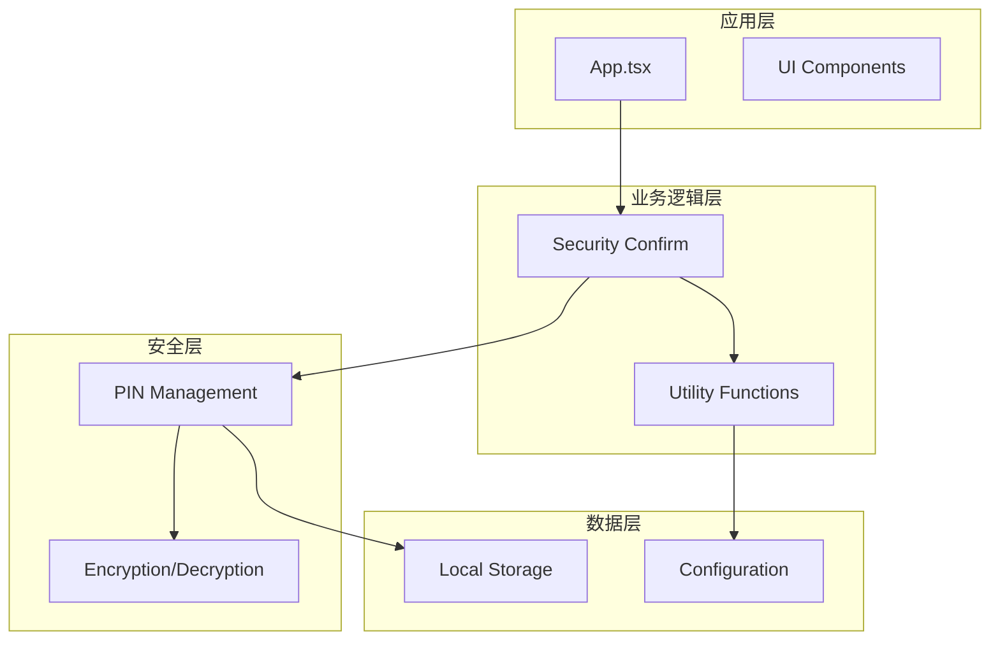
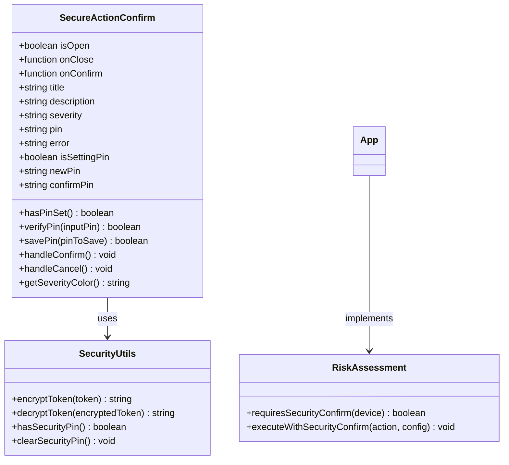
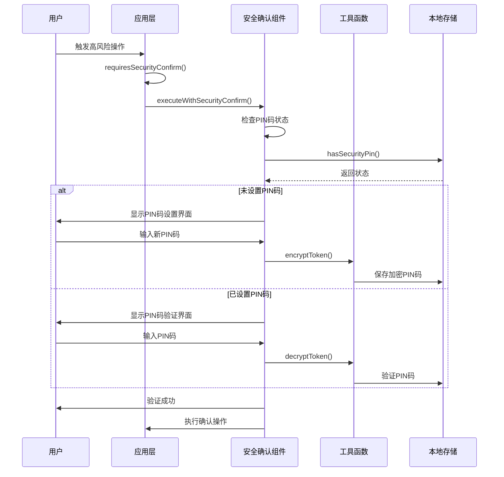
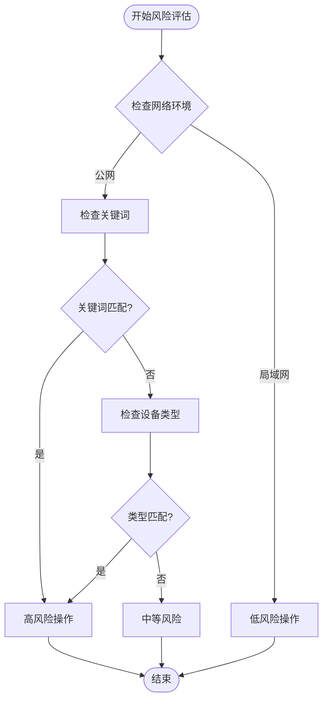
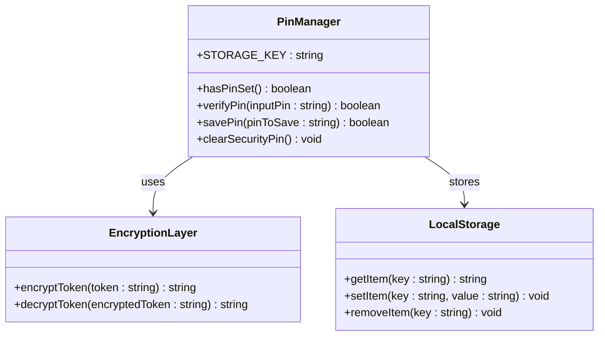
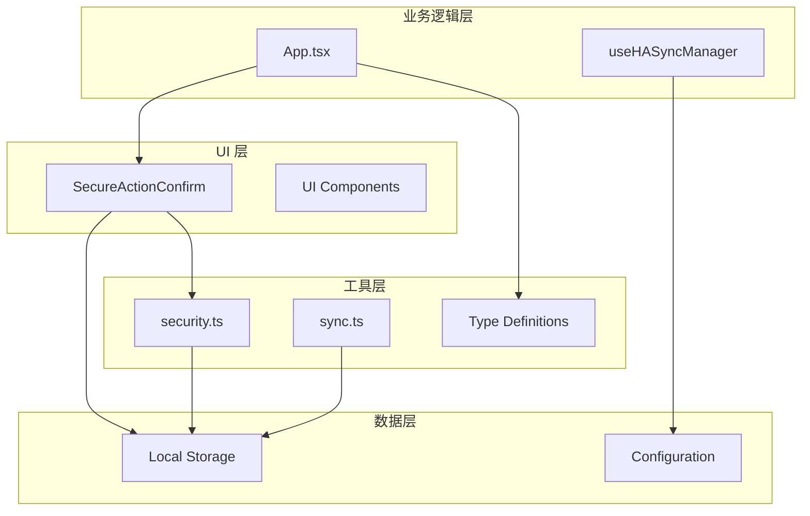

# 安全确认系统

<cite>
**本文档引用的文件**
- [SecureActionConfirm.tsx](file://src/app/components/ui/SecureActionConfirm.tsx)
- [security.ts](file://src/utils/security.ts)
- [App.tsx](file://src/app/App.tsx)
- [useHASyncManager.ts](file://src/hooks/useHASyncManager.ts)
- [home-assistant.ts](file://src/types/home-assistant.ts)
- [device.ts](file://src/types/device.ts)
- [sync.ts](file://src/utils/sync.ts)
- [README.md](file://README.md)
</cite>

## 目录
1. [简介](#简介)
2. [项目结构](#项目结构)
3. [核心组件](#核心组件)
4. [架构概览](#架构概览)
5. [详细组件分析](#详细组件分析)
6. [依赖关系分析](#依赖关系分析)
7. [性能考虑](#性能考虑)
8. [故障排除指南](#故障排除指南)
9. [结论](#结论)

## 简介

安全确认系统是 HAUI Dashboard 中的一个关键安全组件，专门设计用于在公网访问时对高风险操作进行二次确认验证。该系统通过 PIN 码验证机制，为敏感操作提供额外的安全保障，防止未经授权的访问和操作。

系统的核心目标是在不影响用户体验的前提下，为公网环境中的高风险操作提供必要的安全防护。通过智能的风险评估算法和灵活的 PIN 码管理系统，确保只有经过身份验证的用户才能执行可能对家庭安全造成影响的操作。

## 项目结构

HAUI Dashboard 采用现代化的前端架构，安全确认系统作为 UI 组件层的重要组成部分，与应用层、业务逻辑层和数据层紧密集成：

**图表来源**
- [App.tsx:322-356](file://src/app/App.tsx#L322-L356)
- [SecureActionConfirm.tsx:21-49](file://src/app/components/ui/SecureActionConfirm.tsx#L21-L49)

**章节来源**
- [README.md:25-130](file://README.md#L25-L130)

## 核心组件

### 安全确认对话框组件

安全确认对话框是整个安全系统的核心 UI 组件，提供了直观的用户交互界面和完整的 PIN 码验证流程。

#### 主要功能特性

1. **智能风险评估**：自动识别公网环境下的高风险操作
2. **多级安全验证**：支持 PIN 码设置和验证双重机制
3. **危险等级分类**：根据操作风险程度提供不同级别的视觉反馈
4. **本地加密存储**：PIN 码在本地进行 Base64 加密存储

#### 组件架构

**图表来源**
- [SecureActionConfirm.tsx:27-153](file://src/app/components/ui/SecureActionConfirm.tsx#L27-L153)
- [security.ts:1-27](file://src/utils/security.ts#L1-L27)
- [App.tsx:322-356](file://src/app/App.tsx#L322-L356)

**章节来源**
- [SecureActionConfirm.tsx:1-339](file://src/app/components/ui/SecureActionConfirm.tsx#L1-L339)
- [security.ts:1-27](file://src/utils/security.ts#L1-L27)

## 架构概览

安全确认系统采用分层架构设计，确保了良好的可维护性和扩展性：

**图表来源**
- [App.tsx:596-609](file://src/app/App.tsx#L596-L609)
- [SecureActionConfirm.tsx:85-121](file://src/app/components/ui/SecureActionConfirm.tsx#L85-L121)

系统的核心流程包括风险评估、用户交互、PIN 码验证和操作执行四个主要阶段，每个阶段都有相应的错误处理和状态管理机制。

**章节来源**
- [App.tsx:322-609](file://src/app/App.tsx#L322-L609)

## 详细组件分析

### 风险评估引擎

风险评估引擎是安全系统的大脑，负责智能识别哪些操作需要额外的安全确认。

#### 高风险操作识别规则

系统通过多种维度来识别高风险操作：

1. **关键词匹配**：检查设备名称、类型或图标的关键词
2. **设备类型分类**：特定类型的设备默认被视为高风险
3. **网络环境判断**：仅在公网访问时启用安全确认

**图表来源**
- [App.tsx:322-344](file://src/app/App.tsx#L322-L344)

#### 高风险关键词列表

系统预定义了以下高风险关键词：
- lock（门锁）
- door（门）
- security（安全）
- alarm（警报）
- gate（大门）

同时，以下设备类型被直接认定为高风险：
- lock（门锁）
- cover（遮蔽物）
- garage（车库）

**章节来源**
- [App.tsx:322-344](file://src/app/App.tsx#L322-L344)

### PIN 码管理系统

PIN 码管理系统提供了完整的 PIN 码生命周期管理，包括设置、验证、存储和清除功能。

#### PIN 码存储机制

系统采用本地存储机制，通过 Base64 编码对 PIN 码进行混淆处理：

**图表来源**
- [SecureActionConfirm.tsx:42-72](file://src/app/components/ui/SecureActionConfirm.tsx#L42-L72)
- [security.ts:1-27](file://src/utils/security.ts#L1-L27)

#### PIN 码验证流程

验证流程确保了 PIN 码的安全性和正确性：

1. **输入验证**：检查 PIN 码长度和格式
2. **本地解密**：从本地存储中读取并解密 PIN 码
3. **匹配验证**：比较输入的 PIN 码与存储的 PIN 码
4. **状态重置**：验证成功后重置输入状态

**章节来源**
- [SecureActionConfirm.tsx:52-61](file://src/app/components/ui/SecureActionConfirm.tsx#L52-L61)
- [SecureActionConfirm.tsx:85-121](file://src/app/components/ui/SecureActionConfirm.tsx#L85-L121)

### 安全确认对话框

安全确认对话框提供了用户友好的交互界面，支持两种操作模式：PIN 码设置和 PIN 码验证。

#### 界面设计特点

1. **响应式设计**：适配各种屏幕尺寸
2. **动画效果**：使用 Framer Motion 提供流畅的过渡动画
3. **视觉反馈**：根据危险等级提供不同的颜色主题
4. **键盘支持**：支持 Enter 和 Escape 键操作

#### 危险等级系统

系统根据操作风险程度提供三个级别的视觉反馈：

- **高风险（红色）**：涉及安全敏感功能的操作
- **中风险（黄色）**：需要谨慎对待的操作
- **低风险（蓝色）**：一般性的日常操作

**章节来源**
- [SecureActionConfirm.tsx:132-144](file://src/app/components/ui/SecureActionConfirm.tsx#L132-L144)
- [SecureActionConfirm.tsx:155-313](file://src/app/components/ui/SecureActionConfirm.tsx#L155-L313)

## 依赖关系分析

安全确认系统与其他组件之间的依赖关系体现了清晰的分层架构：

**图表来源**
- [App.tsx:35-35](file://src/app/App.tsx#L35-L35)
- [SecureActionConfirm.tsx:4-4](file://src/app/components/ui/SecureActionConfirm.tsx#L4-L4)

### 关键依赖关系

1. **App.tsx 依赖**：应用层通过 App.tsx 实现风险评估和操作执行
2. **安全工具依赖**：使用 security.ts 提供的加密解密功能
3. **类型定义依赖**：依赖 device.ts 和 home-assistant.ts 提供的类型定义
4. **存储依赖**：通过 sync.ts 管理本地存储的同步机制

**章节来源**
- [App.tsx:10-40](file://src/app/App.tsx#L10-L40)
- [useHASyncManager.ts:1-217](file://src/hooks/useHASyncManager.ts#L1-L217)

## 性能考虑

安全确认系统在设计时充分考虑了性能优化，确保在提供安全保障的同时不影响用户体验。

### 性能优化策略

1. **懒加载机制**：安全确认组件按需加载，减少初始包体积
2. **状态缓存**：PIN 码状态在内存中缓存，避免频繁的本地存储访问
3. **防抖处理**：对高频操作进行防抖处理，减少不必要的验证请求
4. **动画优化**：使用硬件加速的 CSS 动画，确保流畅的用户体验

### 内存管理

系统采用了有效的内存管理策略：

- **状态清理**：对话框关闭时自动清理输入状态
- **事件监听**：组件卸载时自动清理事件监听器
- **定时器管理**：及时清理定时器，防止内存泄漏

## 故障排除指南

### 常见问题及解决方案

#### PIN 码设置失败

**问题描述**：用户无法成功设置新的 PIN 码

**可能原因**：
1. PIN 码长度不足（少于 4 位）
2. 两次输入的 PIN 码不一致
3. 本地存储空间不足

**解决步骤**：
1. 确保 PIN 码长度至少为 4 位
2. 重新输入并确认 PIN 码一致性
3. 清理浏览器缓存后重试

#### PIN 码验证失败

**问题描述**：用户输入正确的 PIN 码但验证失败

**可能原因**：
1. 本地存储中的 PIN 码被意外修改
2. 浏览器隐私模式限制本地存储
3. 浏览器缓存问题

**解决步骤**：
1. 重新设置 PIN 码
2. 禁用浏览器隐私模式
3. 清理浏览器缓存和 Cookie

#### 网络环境识别错误

**问题描述**：系统错误地识别网络环境或风险级别

**解决步骤**：
1. 检查网络连接状态
2. 刷新页面重新检测
3. 手动切换网络模式

**章节来源**
- [SecureActionConfirm.tsx:89-104](file://src/app/components/ui/SecureActionConfirm.tsx#L89-L104)
- [SecureActionConfirm.tsx:117-119](file://src/app/components/ui/SecureActionConfirm.tsx#L117-L119)

## 结论

安全确认系统通过智能化的设计和严格的实现，为 HAUI Dashboard 提供了可靠的公网访问安全保障。系统的核心优势包括：

1. **智能风险评估**：能够准确识别高风险操作，避免过度保护
2. **用户友好设计**：简洁直观的界面设计，降低学习成本
3. **安全可靠**：基于本地存储的加密机制，确保 PIN 码安全
4. **性能优化**：高效的实现方式，不影响正常操作体验

该系统不仅满足了现代智能家居应用的安全需求，还为未来的功能扩展奠定了坚实的基础。通过持续的优化和改进，安全确认系统将继续为用户提供更加安全、便捷的智能家居控制体验。