# 异步加载系统

<cite>
**本文档引用的文件**
- [src/main.tsx](file://src/main.tsx)
- [src/utils/sync.ts](file://src/utils/sync.ts)
- [src/app/App.tsx](file://src/app/App.tsx)
- [src/hooks/useHomeAssistant.ts](file://src/hooks/useHomeAssistant.ts)
- [src/store/dataStore.ts](file://src/store/dataStore.ts)
- [src/store/uiStore.ts](file://src/store/uiStore.ts)
- [src/workers/room-inference.worker.ts](file://src/workers/room-inference.worker.ts)
- [addon/server.js](file://addon/server.js)
- [vite.config.ts](file://vite.config.ts)
- [package.json](file://package.json)
</cite>

## 目录
1. [简介](#简介)
2. [项目结构](#项目结构)
3. [核心组件](#核心组件)
4. [架构概览](#架构概览)
5. [详细组件分析](#详细组件分析)
6. [依赖关系分析](#依赖关系分析)
7. [性能考虑](#性能考虑)
8. [故障排除指南](#故障排除指南)
9. [结论](#结论)

## 简介

HAUI 异步加载系统是一个基于 React 18 和现代前端技术栈构建的智能家庭助手仪表板。该系统实现了完整的异步加载机制，确保用户能够快速获得初始界面，同时在后台完成配置同步、组件懒加载和数据预取。

系统的核心特性包括：
- **无阻塞启动**：骨架屏快速显示，后台异步加载
- **跨设备配置同步**：基于 Node.js 后端的云端配置同步
- **智能组件懒加载**：按需加载大型组件和功能模块
- **Web Worker 并行处理**：利用多线程提升性能
- **响应式数据流**：基于 Zustand 的状态管理和实时同步

## 项目结构

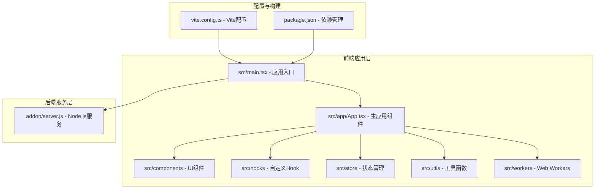

**图表来源**
- [src/main.tsx:1-123](file://src/main.tsx#L1-L123)
- [src/app/App.tsx:1-1054](file://src/app/App.tsx#L1-L1054)
- [addon/server.js:1-521](file://addon/server.js#L1-L521)

**章节来源**
- [src/main.tsx:1-123](file://src/main.tsx#L1-L123)
- [vite.config.ts:1-53](file://vite.config.ts#L1-L53)
- [package.json:1-132](file://package.json#L1-L132)

## 核心组件

### 应用入口与异步加载器

应用入口文件实现了完整的异步加载策略：

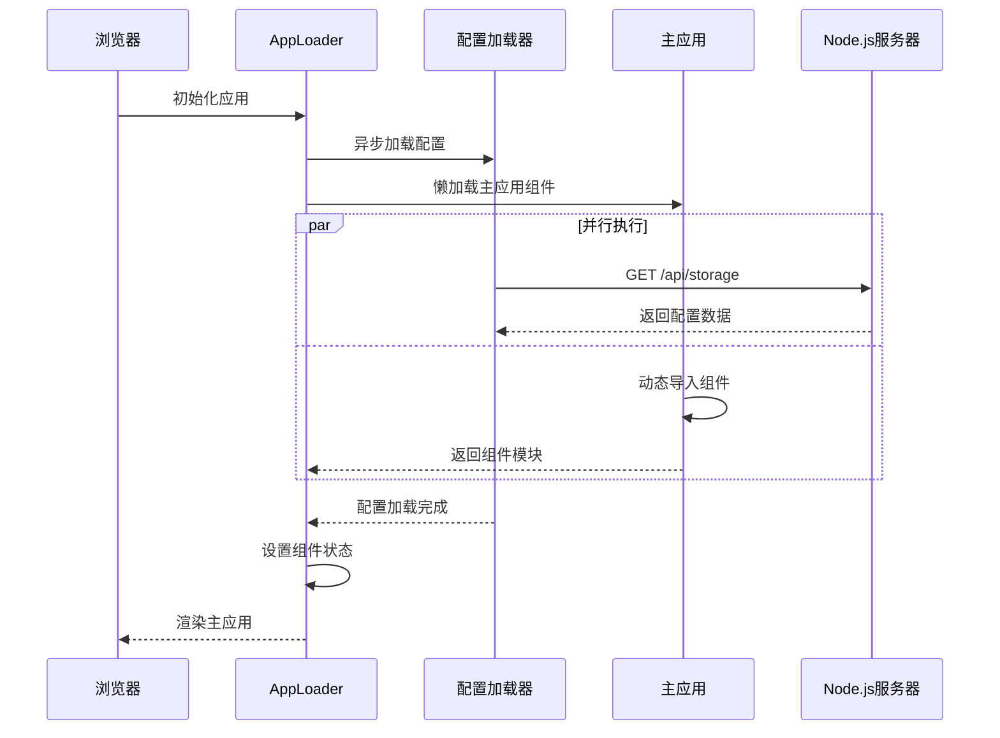

**图表来源**
- [src/main.tsx:88-113](file://src/main.tsx#L88-L113)
- [src/utils/sync.ts:19-70](file://src/utils/sync.ts#L19-L70)

### 配置同步系统

系统实现了双向配置同步机制：

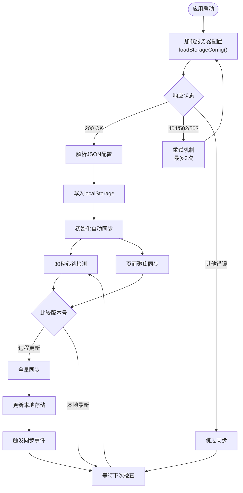

**图表来源**
- [src/main.tsx:19-70](file://src/main.tsx#L19-L70)
- [src/utils/sync.ts:98-150](file://src/utils/sync.ts#L98-L150)

**章节来源**
- [src/main.tsx:19-122](file://src/main.tsx#L19-L122)
- [src/utils/sync.ts:1-161](file://src/utils/sync.ts#L1-L161)

## 架构概览

### 系统架构图

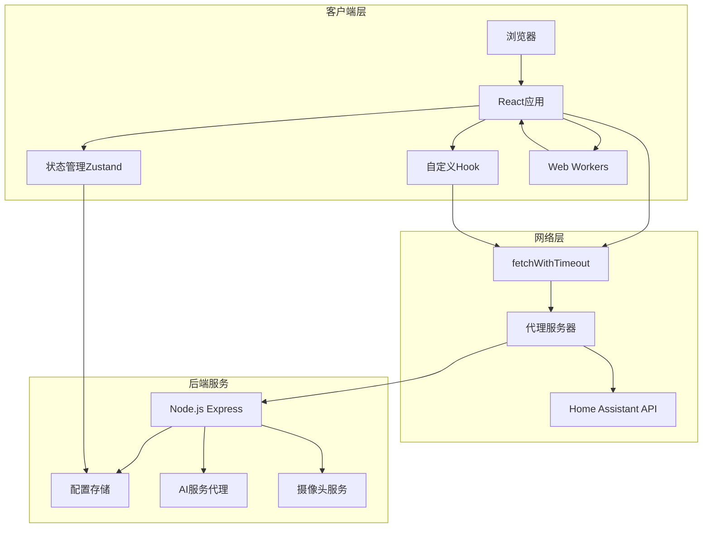

**图表来源**
- [src/app/App.tsx:268-326](file://src/app/App.tsx#L268-L326)
- [addon/server.js:48-94](file://addon/server.js#L48-L94)

### 数据流架构

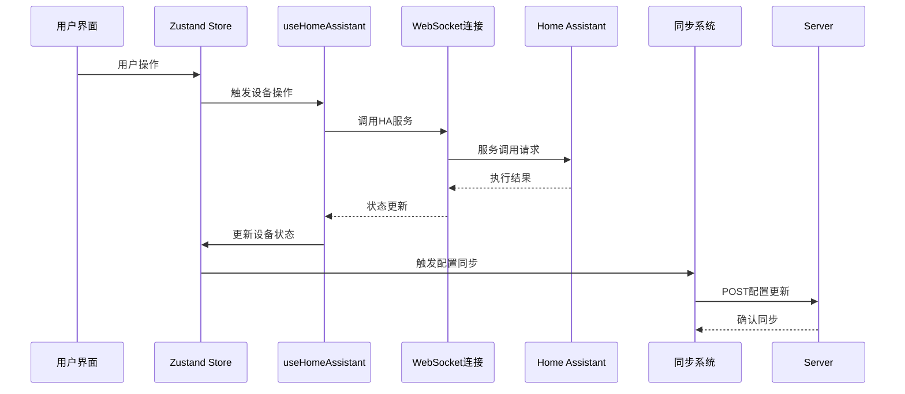

**图表来源**
- [src/hooks/useHomeAssistant.ts:237-248](file://src/hooks/useHomeAssistant.ts#L237-L248)
- [src/store/dataStore.ts:106-117](file://src/store/dataStore.ts#L106-L117)

**章节来源**
- [src/app/App.tsx:268-326](file://src/app/App.tsx#L268-L326)
- [src/hooks/useHomeAssistant.ts:1-329](file://src/hooks/useHomeAssistant.ts#L1-L329)

## 详细组件分析

### 骨架屏与渐进式加载

骨架屏组件提供了优雅的渐进式加载体验：

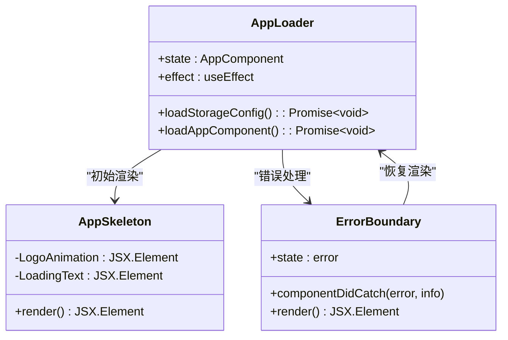

**图表来源**
- [src/main.tsx:72-113](file://src/main.tsx#L72-L113)

### 状态管理系统

系统采用分层状态管理模式：

```mermaid
graph LR
subgraph "数据状态层"
A[devices: Device[]]
B[rooms: Room[]]
C[scenes: Scene[]]
D[users: User[]]
E[logs: Log[]]
end
subgraph "UI状态层"
F[settingsOpen: boolean]
G[dashboardEditing: boolean]
H[selectedRoom: string]
end
subgraph "持久化存储"
I[Zustand持久化中间件]
J[localStorage]
end
A --> I
B --> I
C --> I
D --> I
E --> I
F --> I
G --> I
H --> I
I --> J
```

**图表来源**
- [src/store/dataStore.ts:58-129](file://src/store/dataStore.ts#L58-L129)
- [src/store/uiStore.ts:31-55](file://src/store/uiStore.ts#L31-L55)

### Web Worker 并行处理

房间推理功能通过 Web Worker 实现高性能并行处理：

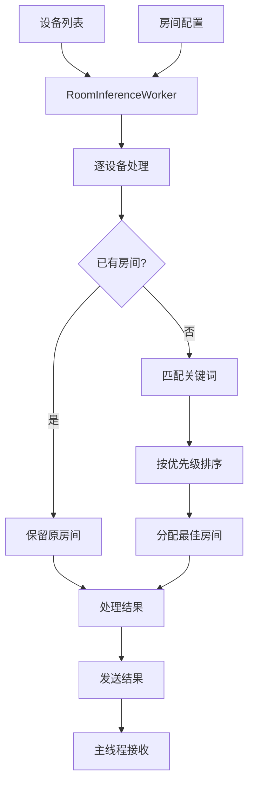

**图表来源**
- [src/workers/room-inference.worker.ts:24-73](file://src/workers/room-inference.worker.ts#L24-L73)

**章节来源**
- [src/main.tsx:72-122](file://src/main.tsx#L72-L122)
- [src/store/dataStore.ts:1-129](file://src/store/dataStore.ts#L1-L129)
- [src/workers/room-inference.worker.ts:1-73](file://src/workers/room-inference.worker.ts#L1-L73)

## 依赖关系分析

### 技术栈依赖图

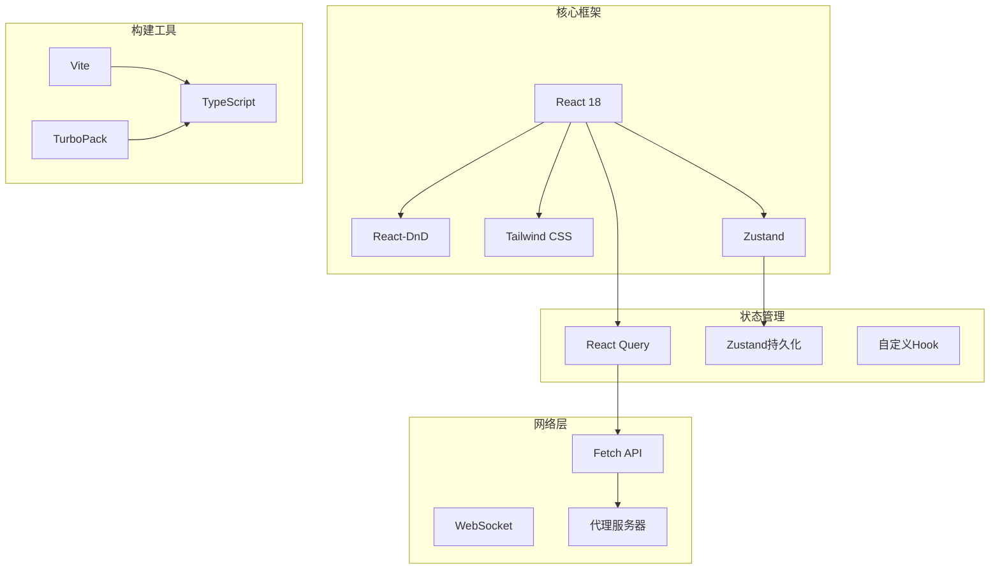

**图表来源**
- [package.json:13-96](file://package.json#L13-L96)
- [vite.config.ts:6-13](file://vite.config.ts#L6-L13)

### 组件依赖关系

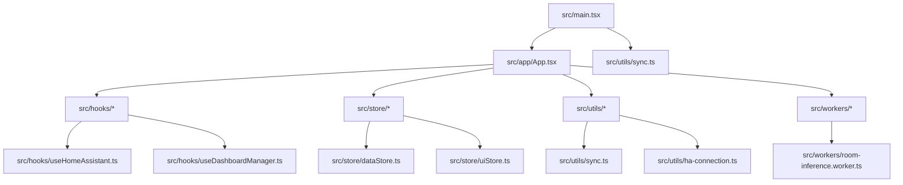

**图表来源**
- [src/main.tsx:1-123](file://src/main.tsx#L1-L123)
- [src/app/App.tsx:1-1054](file://src/app/App.tsx#L1-L1054)

**章节来源**
- [package.json:1-132](file://package.json#L1-L132)
- [vite.config.ts:1-53](file://vite.config.ts#L1-L53)

## 性能考虑

### 异步加载优化策略

系统采用了多层次的性能优化策略：

1. **骨架屏渲染**：提供即时视觉反馈，减少感知延迟
2. **并行异步加载**：配置加载与组件加载并行执行
3. **智能重试机制**：指数退避重试，避免网络波动影响
4. **防抖同步**：批量处理配置变更，减少网络请求
5. **Web Worker 并行**：利用多线程处理计算密集型任务

### 内存管理

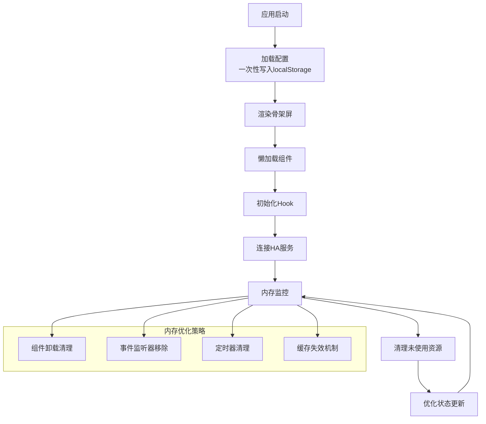

### 网络性能优化

系统实现了多种网络优化技术：

- **超时控制**：统一的请求超时管理
- **代理转发**：统一的API代理层
- **请求去重**：避免重复的网络请求
- **增量同步**：基于版本号的增量更新

## 故障排除指南

### 常见问题诊断

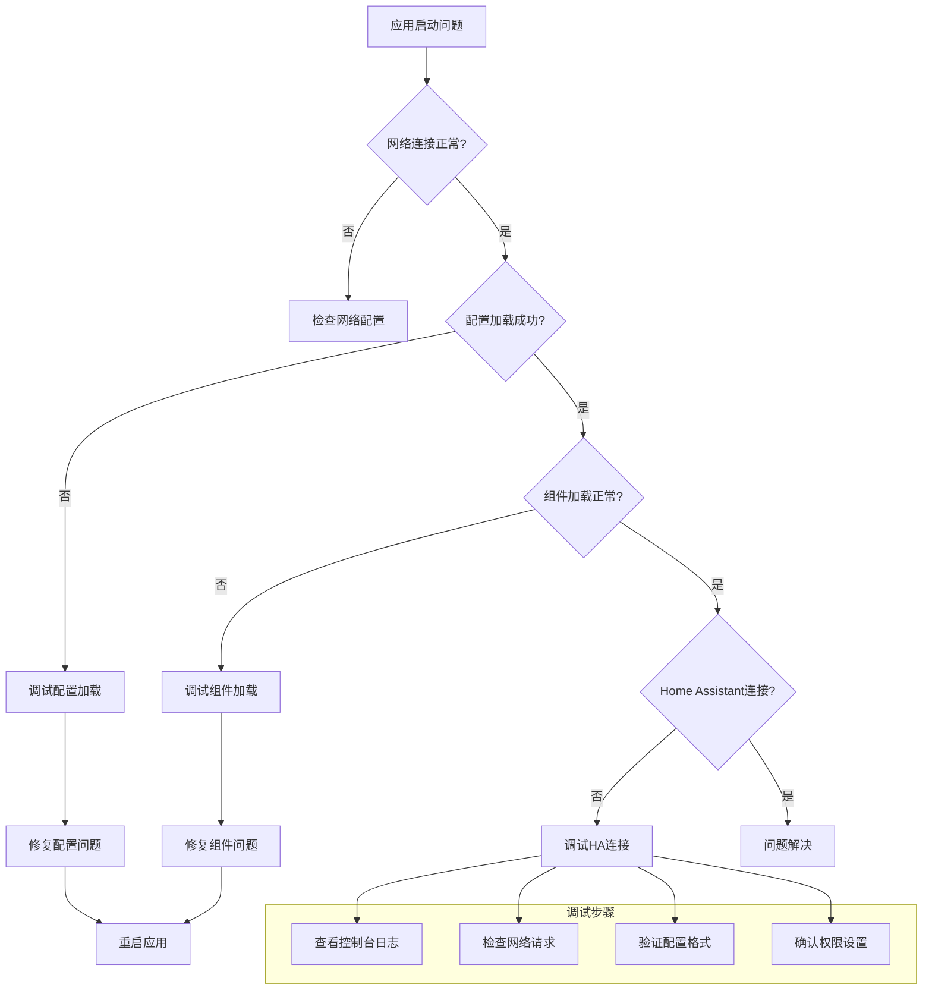

### 错误边界处理

系统实现了完善的错误处理机制：

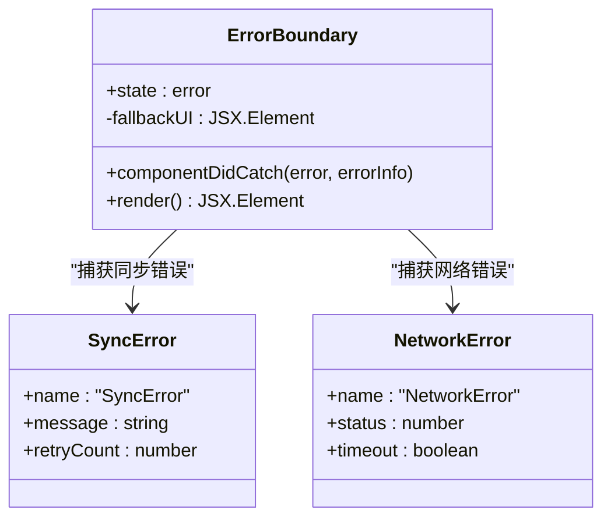

**图表来源**
- [src/main.tsx:7-122](file://src/main.tsx#L7-L122)

**章节来源**
- [src/main.tsx:7-122](file://src/main.tsx#L7-L122)
- [src/utils/sync.ts:98-131](file://src/utils/sync.ts#L98-L131)

## 结论

HAUI 异步加载系统通过精心设计的架构和多项性能优化技术，为用户提供了流畅、可靠的智能家庭助手体验。系统的主要优势包括：

1. **快速启动**：骨架屏配合异步加载，显著减少首屏等待时间
2. **可靠同步**：双向配置同步确保跨设备一致性
3. **高性能**：Web Worker 和并行处理提升整体性能
4. **可维护性**：清晰的架构分层便于长期维护
5. **扩展性**：模块化的组件设计支持功能扩展

该系统为现代前端应用的异步加载提供了优秀的实践范例，特别是在需要处理复杂状态管理和实时数据同步的场景中。通过合理的架构设计和性能优化，系统能够在保证用户体验的同时，维持良好的可扩展性和可维护性。