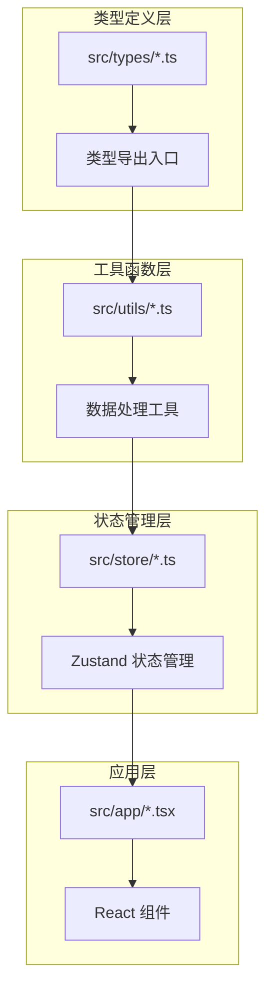
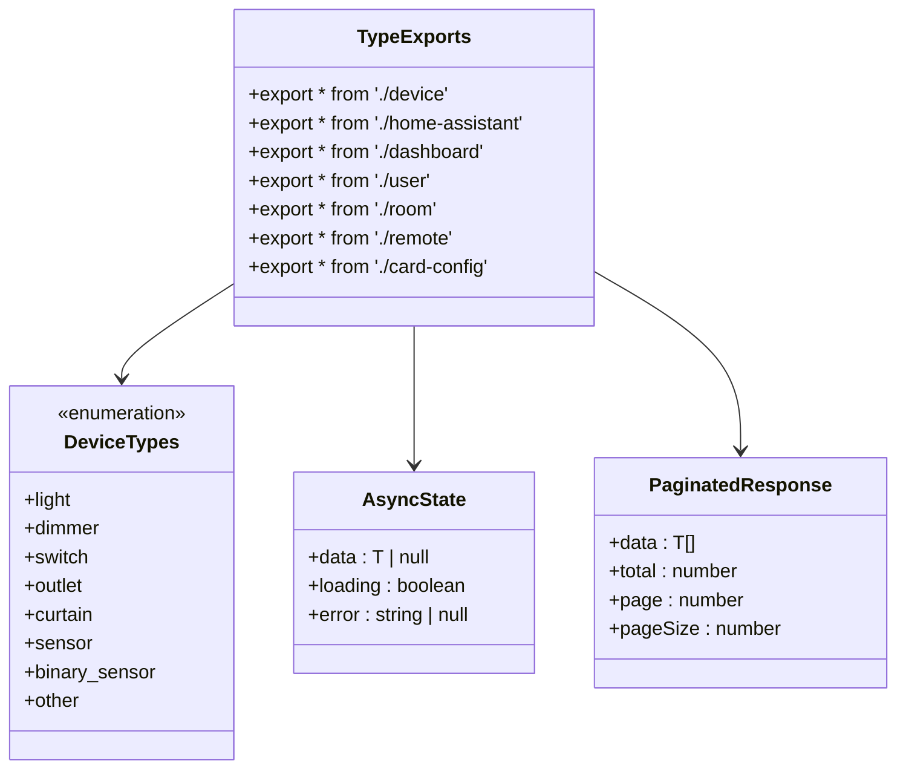
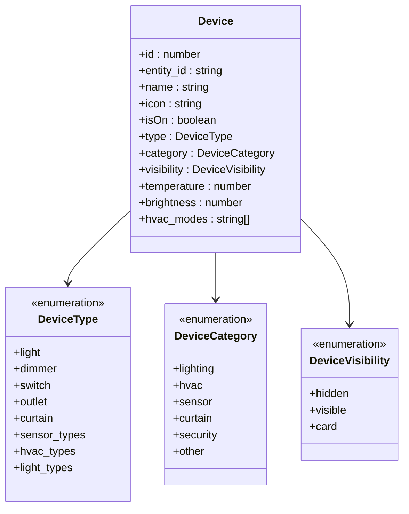
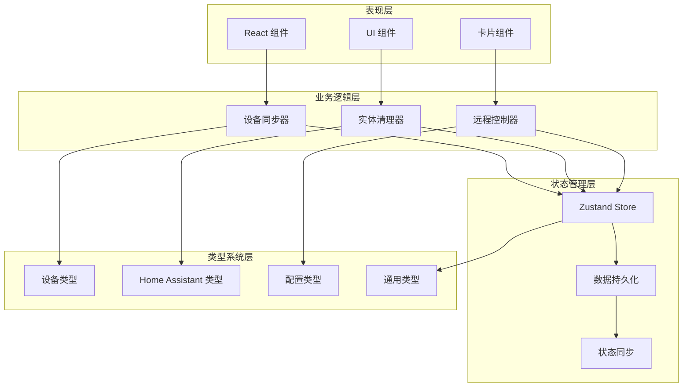
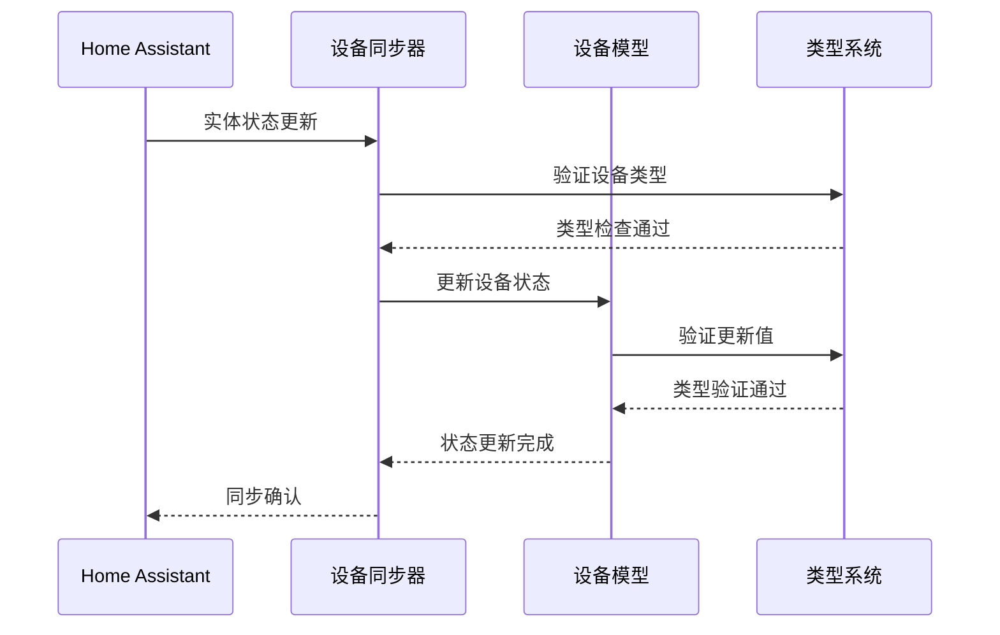
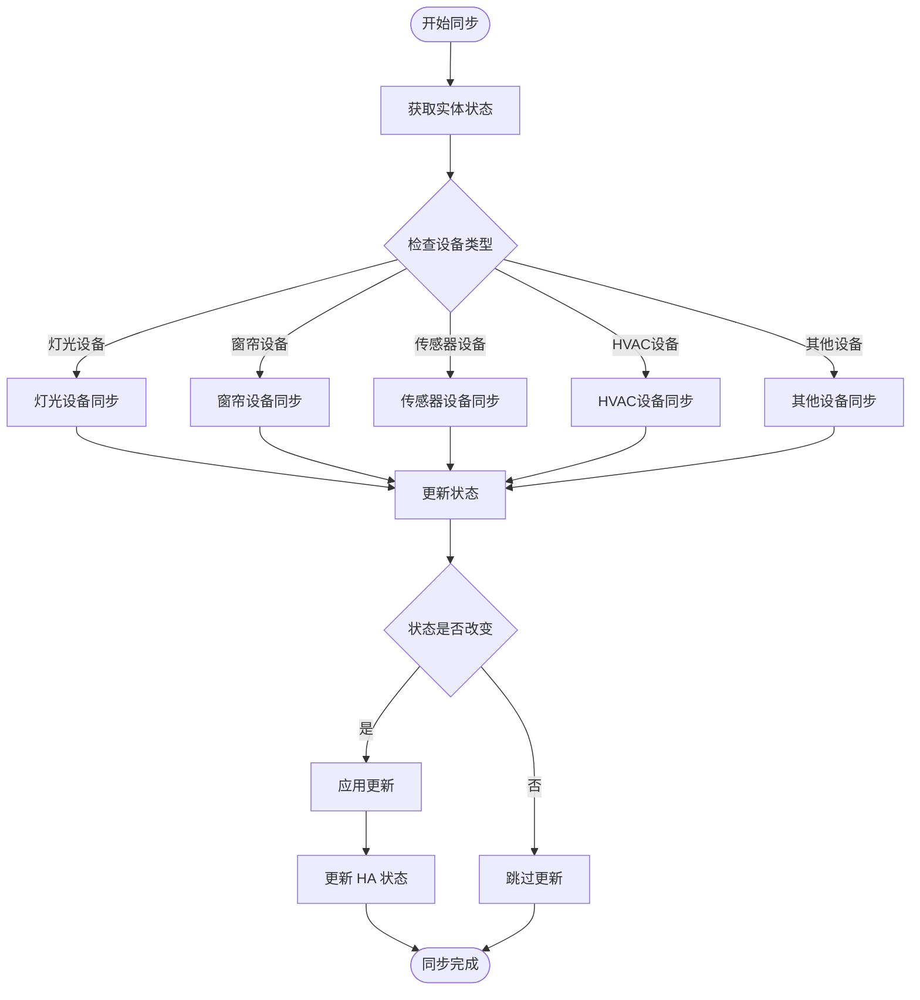
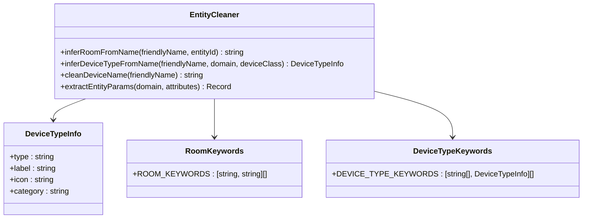
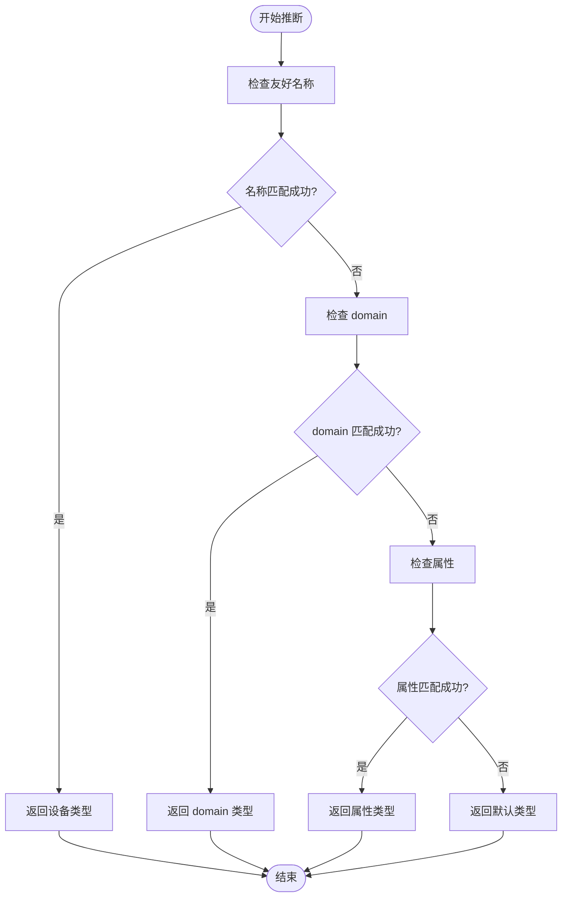
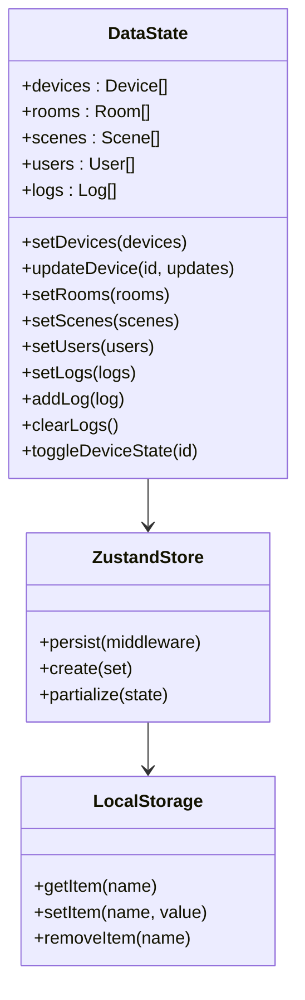
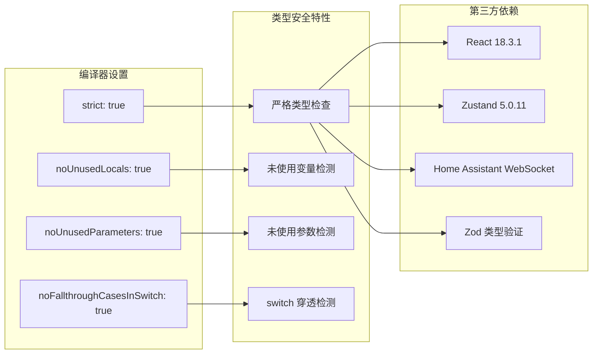

# 类型安全增强

<cite>
**本文档引用的文件**
- [src/types/index.ts](file://src/types/index.ts)
- [src/types/device.ts](file://src/types/device.ts)
- [src/types/home-assistant.ts](file://src/types/home-assistant.ts)
- [src/types/card-config.ts](file://src/types/card-config.ts)
- [src/types/dashboard.ts](file://src/types/dashboard.ts)
- [src/types/room.ts](file://src/types/room.ts)
- [src/types/user.ts](file://src/types/user.ts)
- [src/types/remote.ts](file://src/types/remote.ts)
- [tsconfig.json](file://tsconfig.json)
- [package.json](file://package.json)
- [src/utils/device-sync.ts](file://src/utils/device-sync.ts)
- [src/utils/entity-cleaner.ts](file://src/utils/entity-cleaner.ts)
- [src/store/dataStore.ts](file://src/store/dataStore.ts)
- [.eslintrc.cjs](file://.eslintrc.cjs)
</cite>

## 目录
1. [简介](#简介)
2. [项目结构](#项目结构)
3. [核心组件](#核心组件)
4. [架构概览](#架构概览)
5. [详细组件分析](#详细组件分析)
6. [依赖关系分析](#依赖关系分析)
7. [性能考虑](#性能考虑)
8. [故障排除指南](#故障排除指南)
9. [结论](#结论)

## 简介

本项目是一个基于 TypeScript 的智能家居控制界面，专注于通过严格的类型系统来确保代码质量和运行时安全性。项目采用了全面的类型安全策略，包括：

- **统一的类型导出机制**：通过集中化的类型导出入口，确保类型定义的一致性和可维护性
- **设备类型系统**：为不同类型的智能设备提供精确的类型定义和验证
- **Home Assistant 集成**：完整的 HA 实体状态和连接状态类型定义
- **状态管理模式**：使用 Zustand 结合 TypeScript 实现类型安全的状态管理
- **工具函数类型化**：对数据清洗和设备同步等核心功能进行类型约束

## 项目结构

项目采用模块化的 TypeScript 架构，主要分为以下几个层次：

**图表来源**
- [src/types/index.ts:1-51](file://src/types/index.ts#L1-L51)
- [src/utils/device-sync.ts:1-191](file://src/utils/device-sync.ts#L1-L191)
- [src/store/dataStore.ts:1-129](file://src/store/dataStore.ts#L1-L129)

**章节来源**
- [src/types/index.ts:1-51](file://src/types/index.ts#L1-L51)
- [tsconfig.json:1-30](file://tsconfig.json#L1-L30)

## 核心组件

### 类型导出系统

项目实现了统一的类型导出机制，通过集中化的入口文件管理所有类型定义：

**图表来源**
- [src/types/index.ts:6-12](file://src/types/index.ts#L6-L12)
- [src/types/index.ts:18-32](file://src/types/index.ts#L18-L32)

### 设备类型系统

项目建立了完整的设备类型体系，包含设备分类、可见性控制和传感器类型识别：

**图表来源**
- [src/types/device.ts:74-118](file://src/types/device.ts#L74-L118)
- [src/types/device.ts:10-37](file://src/types/device.ts#L10-L37)

**章节来源**
- [src/types/device.ts:1-119](file://src/types/device.ts#L1-L119)
- [src/types/index.ts:14-50](file://src/types/index.ts#L14-L50)

## 架构概览

项目采用分层架构设计，每层都有明确的职责边界和类型约束：

**图表来源**
- [src/utils/device-sync.ts:4-190](file://src/utils/device-sync.ts#L4-L190)
- [src/utils/entity-cleaner.ts:195-255](file://src/utils/entity-cleaner.ts#L195-L255)
- [src/store/dataStore.ts:58-128](file://src/store/dataStore.ts#L58-L128)

## 详细组件分析

### 设备同步组件

设备同步组件是类型安全的核心实现，负责将 Home Assistant 的实体状态与本地设备模型进行同步：

**图表来源**
- [src/utils/device-sync.ts:4-190](file://src/utils/device-sync.ts#L4-L190)
- [src/types/device.ts:74-118](file://src/types/device.ts#L74-L118)

#### 同步算法流程

设备同步过程包含复杂的条件判断和类型转换：

**图表来源**
- [src/utils/device-sync.ts:22-153](file://src/utils/device-sync.ts#L22-L153)

**章节来源**
- [src/utils/device-sync.ts:1-191](file://src/utils/device-sync.ts#L1-L191)

### 实体清理组件

实体清理器负责从 Home Assistant 的实体名称中提取房间信息、设备类型和设备名称：

**图表来源**
- [src/utils/entity-cleaner.ts:172-255](file://src/utils/entity-cleaner.ts#L172-L255)
- [src/utils/entity-cleaner.ts:62-67](file://src/utils/entity-cleaner.ts#L62-L67)

#### 设备类型推断流程

**图表来源**
- [src/utils/entity-cleaner.ts:196-255](file://src/utils/entity-cleaner.ts#L196-L255)

**章节来源**
- [src/utils/entity-cleaner.ts:1-381](file://src/utils/entity-cleaner.ts#L1-L381)

### 状态管理组件

Zustand 状态管理结合 TypeScript 实现类型安全的数据存储：

**图表来源**
- [src/store/dataStore.ts:9-28](file://src/store/dataStore.ts#L9-L28)
- [src/store/dataStore.ts:58-128](file://src/store/dataStore.ts#L58-L128)

**章节来源**
- [src/store/dataStore.ts:1-129](file://src/store/dataStore.ts#L1-L129)

## 依赖关系分析

项目使用 TypeScript 编译器选项确保编译时类型检查：

**图表来源**
- [tsconfig.json:18-21](file://tsconfig.json#L18-L21)
- [package.json:13-96](file://package.json#L13-L96)

**章节来源**
- [tsconfig.json:1-30](file://tsconfig.json#L1-L30)
- [package.json:1-132](file://package.json#L1-L132)

## 性能考虑

### 类型检查优化

项目通过以下方式优化类型检查性能：

1. **模块化类型定义**：将类型分散到不同的模块中，减少单个文件的复杂度
2. **精确的类型约束**：使用字面量类型和枚举类型减少类型推断时间
3. **条件类型检查**：在设备同步过程中使用条件类型检查避免不必要的转换

### 内存使用优化

1. **选择性持久化**：只持久化必要的状态字段，减少存储开销
2. **状态更新优化**：使用不可变更新模式，避免不必要的重新渲染
3. **类型缓存**：利用 TypeScript 的类型缓存机制提高编译速度

## 故障排除指南

### 常见类型错误

1. **设备类型不匹配**
   - 症状：编译时报错，提示设备类型不兼容
   - 解决方案：确保使用正确的设备类型字面量

2. **状态更新错误**
   - 症状：状态更新时出现类型不匹配
   - 解决方案：使用 `Partial<Device>` 类型进行部分更新

3. **Home Assistant 类型错误**
   - 症状：HA 实体状态类型不正确
   - 解决方案：检查 `HAEntityState` 接口的字段完整性

### 调试技巧

1. **启用严格模式**：确保 `tsconfig.json` 中的严格模式已启用
2. **使用类型断言**：在必要时使用 `as` 关键字进行类型断言
3. **检查接口完整性**：定期验证所有接口的字段定义

**章节来源**
- [.eslintrc.cjs:12-17](file://.eslintrc.cjs#L12-L17)
- [tsconfig.json:18-21](file://tsconfig.json#L18-L21)

## 结论

本项目通过全面的类型安全策略，成功构建了一个健壮的智能家居控制界面。主要成就包括：

1. **完整的类型系统**：从基础类型到复杂对象的全面类型定义
2. **严格的类型检查**：通过编译器选项确保运行时类型安全
3. **高效的工具函数**：类型化的数据处理和设备同步功能
4. **可靠的状态管理**：结合 Zustand 实现类型安全的状态持久化

这些类型安全措施不仅提高了代码质量，还为后续的功能扩展奠定了坚实的基础。建议在未来继续完善类型定义，特别是在复杂的数据转换场景中增加更多的类型约束。