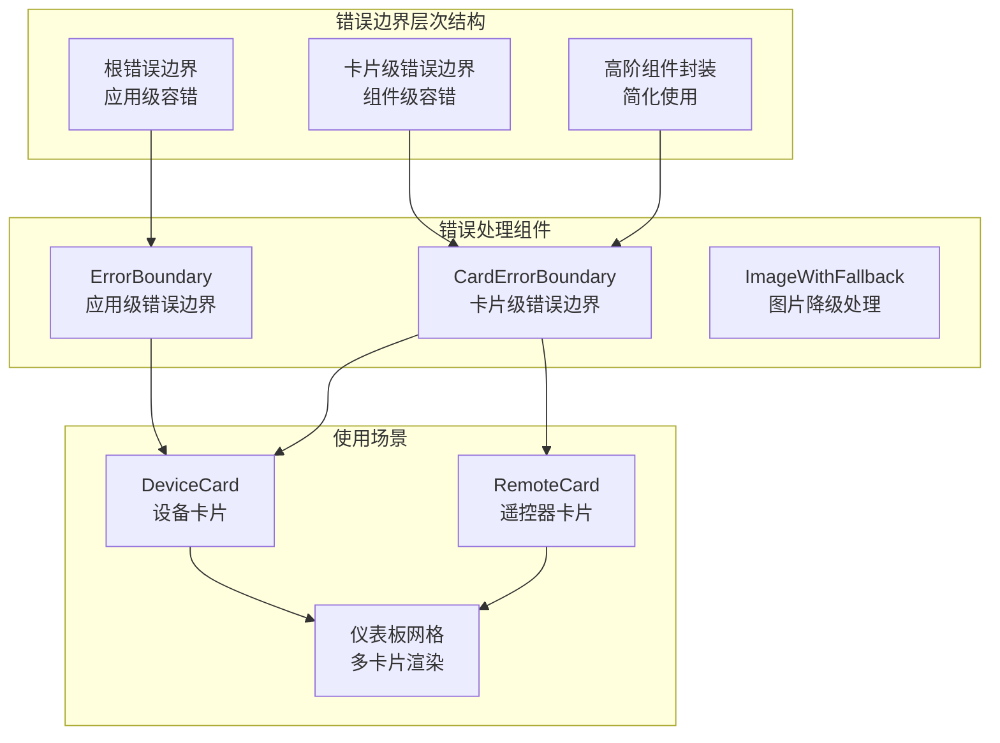
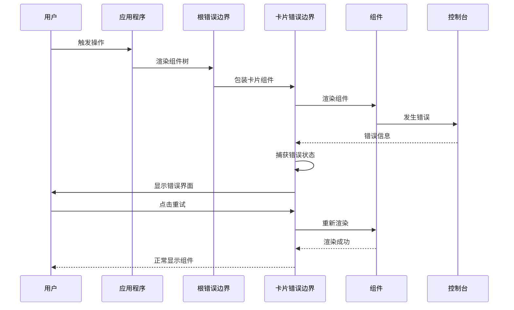
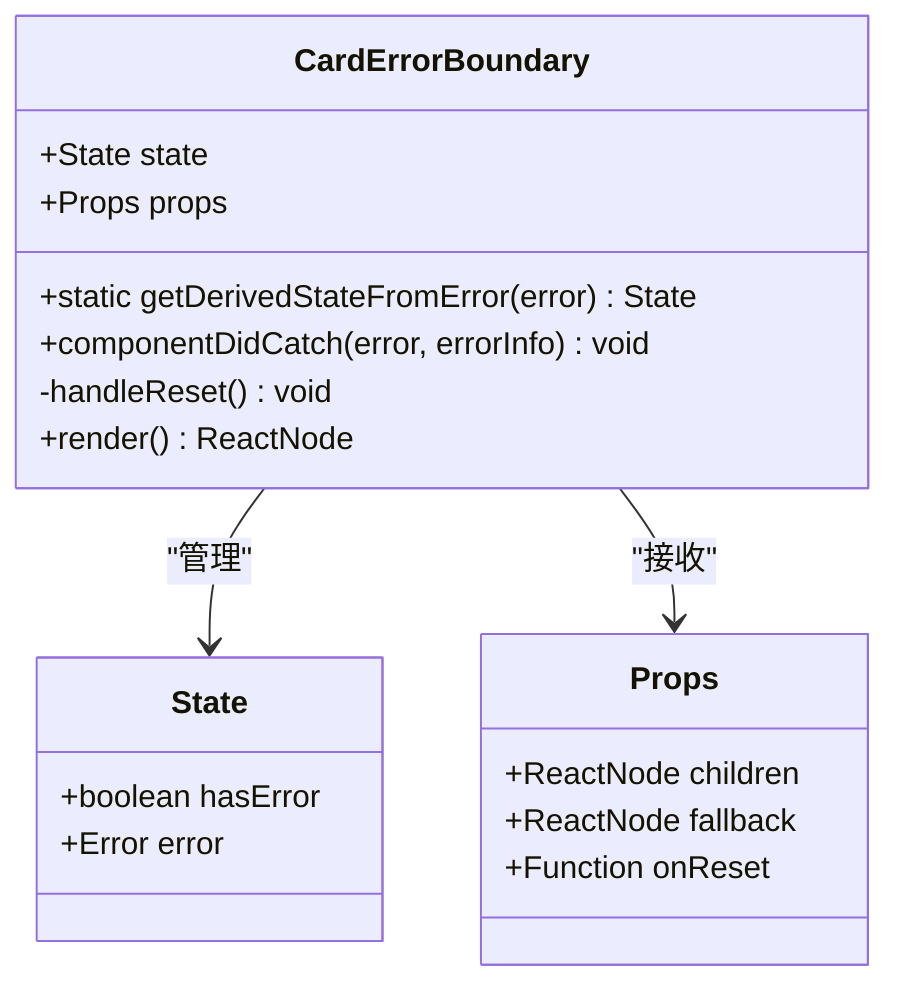
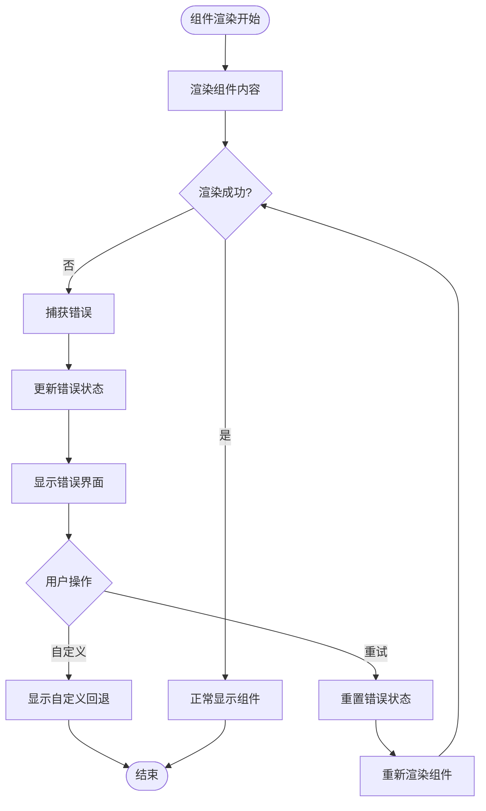
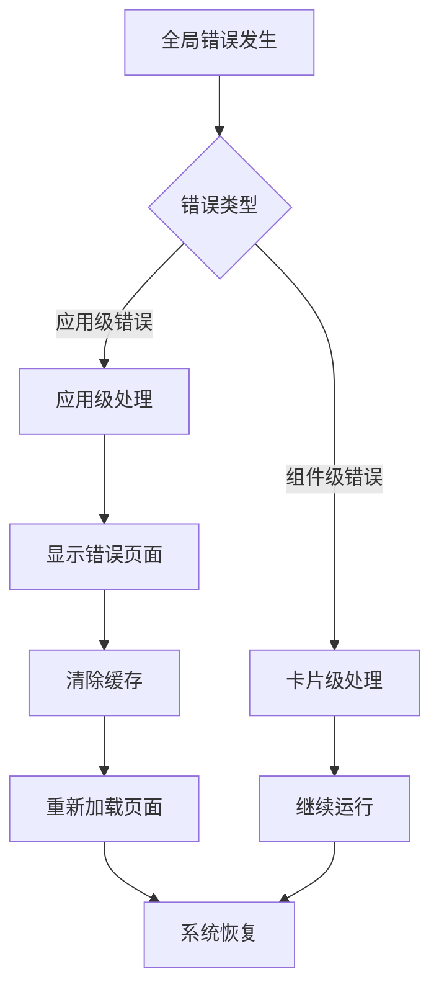
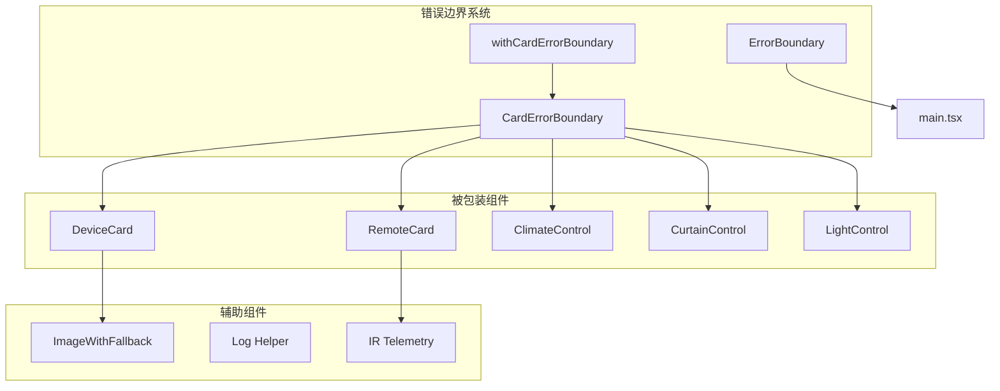
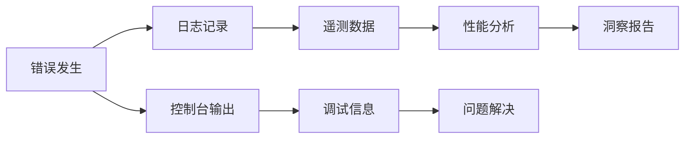

# 错误边界系统

<cite>
**本文档引用的文件**
- [CardErrorBoundary.tsx](file://src/app/components/ui/CardErrorBoundary.tsx)
- [ErrorBoundary.tsx](file://src/app/components/ErrorBoundary.tsx)
- [App.tsx](file://src/app/App.tsx)
- [main.tsx](file://src/main.tsx)
- [DeviceCard.tsx](file://src/app/components/dashboard/DeviceCard.tsx)
- [RemoteCard.tsx](file://src/app/components/remote/RemoteCard.tsx)
- [ImageWithFallback.tsx](file://src/app/components/figma/ImageWithFallback.tsx)
- [log-helper.ts](file://src/utils/log-helper.ts)
- [ir-telemetry.ts](file://src/utils/ir-telemetry.ts)
</cite>

## 目录
1. [简介](#简介)
2. [项目结构](#项目结构)
3. [核心组件](#核心组件)
4. [架构概览](#架构概览)
5. [详细组件分析](#详细组件分析)
6. [依赖关系分析](#依赖关系分析)
7. [性能考虑](#性能考虑)
8. [故障排除指南](#故障排除指南)
9. [结论](#结论)

## 简介

HAUI 错误边界系统是一个多层次的错误处理架构，旨在提供健壮的应用程序稳定性。该系统通过 React 错误边界技术，实现了从应用级到组件级的全面错误捕获和处理机制。

系统的核心设计原则是：
- **隔离性**：单个组件错误不会影响整个应用程序
- **可恢复性**：提供用户友好的错误界面和重试机制
- **可观测性**：完整的错误日志记录和遥测数据收集
- **渐进式降级**：在错误发生时提供基本功能而非完全崩溃

## 项目结构

错误边界系统在项目中的组织结构如下：

**图表来源**
- [CardErrorBoundary.tsx:15-65](file://src/app/components/ui/CardErrorBoundary.tsx#L15-L65)
- [ErrorBoundary.tsx:12-50](file://src/app/components/ErrorBoundary.tsx#L12-L50)
- [App.tsx:1018-1036](file://src/app/App.tsx#L1018-L1036)

**章节来源**
- [CardErrorBoundary.tsx:1-85](file://src/app/components/ui/CardErrorBoundary.tsx#L1-L85)
- [ErrorBoundary.tsx:1-51](file://src/app/components/ErrorBoundary.tsx#L1-L51)
- [main.tsx:115-122](file://src/main.tsx#L115-L122)

## 核心组件

### 应用级错误边界

应用级错误边界负责捕获整个应用程序中的未处理异常，提供全局的错误处理机制。

**主要特性：**
- 捕获顶层未处理的 JavaScript 错误
- 提供友好的错误页面和重载功能
- 支持缓存清理和重新加载
- 记录详细的错误信息用于调试

### 卡片级错误边界

卡片级错误边界专门用于处理单个组件的错误，防止个别组件故障影响整个仪表板。

**主要特性：**
- 针对设备卡片等小组件的错误处理
- 支持自定义回退内容
- 提供重试机制
- 保持其他组件正常运行

### 高阶组件封装

提供简化的错误边界使用方式，通过装饰器模式包装现有组件。

**主要特性：**
- 自动化的错误边界包装
- 保持原组件的属性传递
- 支持显示名称定制

**章节来源**
- [CardErrorBoundary.tsx:15-84](file://src/app/components/ui/CardErrorBoundary.tsx#L15-L84)
- [ErrorBoundary.tsx:12-50](file://src/app/components/ErrorBoundary.tsx#L12-L50)

## 架构概览

错误边界系统的整体架构采用分层设计，确保错误处理的层次性和有效性：

**图表来源**
- [main.tsx:115-122](file://src/main.tsx#L115-L122)
- [App.tsx:1018-1036](file://src/app/App.tsx#L1018-L1036)
- [CardErrorBoundary.tsx:25-31](file://src/app/components/ui/CardErrorBoundary.tsx#L25-L31)

### 错误传播路径

错误在系统中的传播遵循以下路径：

1. **组件内部错误** → 卡片级错误边界
2. **卡片级错误** → 应用级错误边界（如果适用）
3. **应用级错误** → 全局错误页面
4. **日志记录** → 控制台和遥测系统

**章节来源**
- [App.tsx:1018-1036](file://src/app/App.tsx#L1018-L1036)
- [CardErrorBoundary.tsx:25-31](file://src/app/components/ui/CardErrorBoundary.tsx#L25-L31)

## 详细组件分析

### 卡片级错误边界组件

卡片级错误边界是错误边界系统的核心组件，专门设计用于处理单个组件的错误。

#### 类结构分析

**图表来源**
- [CardErrorBoundary.tsx:4-13](file://src/app/components/ui/CardErrorBoundary.tsx#L4-L13)
- [CardErrorBoundary.tsx:19-65](file://src/app/components/ui/CardErrorBoundary.tsx#L19-L65)

#### 错误处理流程

**图表来源**
- [CardErrorBoundary.tsx:25-64](file://src/app/components/ui/CardErrorBoundary.tsx#L25-L64)

#### 关键实现细节

1. **错误状态管理**：使用 `hasError` 和 `error` 状态跟踪错误状态
2. **静态状态更新**：通过 `getDerivedStateFromError` 方法自动更新状态
3. **错误捕获**：在 `componentDidCatch` 中记录详细错误信息
4. **用户交互**：提供重试按钮和自定义回退机制

**章节来源**
- [CardErrorBoundary.tsx:19-65](file://src/app/components/ui/CardErrorBoundary.tsx#L19-L65)

### 应用级错误边界组件

应用级错误边界提供全局的错误处理能力，确保应用程序的整体稳定性。

#### 错误处理策略

应用级错误边界专注于处理更严重的错误情况：

1. **全局错误捕获**：捕获整个应用树中的未处理异常
2. **用户友好界面**：提供清晰的错误信息和解决方案
3. **系统恢复**：支持缓存清理和完整重载
4. **调试支持**：显示详细的错误堆栈信息

#### 错误恢复机制

**图表来源**
- [ErrorBoundary.tsx:18-49](file://src/app/components/ErrorBoundary.tsx#L18-L49)

**章节来源**
- [ErrorBoundary.tsx:12-50](file://src/app/components/ErrorBoundary.tsx#L12-L50)

### 高阶组件封装

高阶组件（HOC）提供了一种简化的错误边界使用方式，通过装饰器模式自动包装组件。

#### 封装策略

1. **透明包装**：自动将目标组件包装在错误边界中
2. **属性透传**：确保所有原组件的属性和事件正确传递
3. **显示名称**：自动设置合适的组件显示名称
4. **类型安全**：保持 TypeScript 类型检查的完整性

**章节来源**
- [CardErrorBoundary.tsx:71-84](file://src/app/components/ui/CardErrorBoundary.tsx#L71-L84)

## 依赖关系分析

错误边界系统与其他组件的依赖关系体现了其作为基础设施的作用：

**图表来源**
- [App.tsx:1018-1036](file://src/app/App.tsx#L1018-L1036)
- [DeviceCard.tsx:59-72](file://src/app/components/dashboard/DeviceCard.tsx#L59-L72)
- [RemoteCard.tsx:40](file://src/app/components/remote/RemoteCard.tsx#L40)

### 组件间交互

错误边界系统与主要组件的交互模式：

1. **设备卡片集成**：在仪表板网格中为每个设备卡片添加错误边界
2. **遥控器卡片支持**：为复杂的遥控器界面提供错误保护
3. **图片资源降级**：结合图片降级组件提供完整的资源错误处理
4. **遥测数据收集**：记录错误相关的遥测信息用于性能监控

**章节来源**
- [App.tsx:1018-1036](file://src/app/App.tsx#L1018-L1036)
- [DeviceCard.tsx:59-72](file://src/app/components/dashboard/DeviceCard.tsx#L59-L72)

## 性能考虑

错误边界系统在设计时充分考虑了性能影响：

### 渲染性能

1. **最小化开销**：错误边界组件本身开销很小，不会显著影响渲染性能
2. **懒加载配合**：与 React.lazy 结合使用，进一步优化初始加载
3. **条件渲染**：只有在错误发生时才显示错误界面

### 内存管理

1. **状态清理**：错误状态在组件卸载时自动清理
2. **事件监听器**：确保错误边界组件卸载时清理相关事件监听器
3. **资源释放**：避免内存泄漏，特别是在频繁重试的情况下

### 用户体验

1. **快速恢复**：错误边界提供快速的错误恢复机制
2. **渐进式降级**：在错误情况下提供基本功能而非完全失效
3. **反馈机制**：及时向用户反馈错误状态和恢复选项

## 故障排除指南

### 常见问题诊断

#### 错误边界不生效

**可能原因：**
1. 组件未正确包装在错误边界中
2. 错误边界组件本身发生错误
3. React 版本兼容性问题

**解决方法：**
1. 检查组件是否在正确的层级包装
2. 验证错误边界组件的导入路径
3. 确认 React 版本兼容性

#### 错误信息不显示

**可能原因：**
1. 错误被捕获但未正确记录
2. 控制台被过滤或禁用
3. 错误边界配置问题

**解决方法：**
1. 检查 `componentDidCatch` 方法的实现
2. 验证浏览器控制台设置
3. 确认错误边界配置参数

#### 重试功能无效

**可能原因：**
1. `onReset` 回调未正确设置
2. 组件状态未正确重置
3. 重新渲染逻辑问题

**解决方法：**
1. 确保 `onReset` 回调正确传递
2. 验证组件状态重置逻辑
3. 检查重新渲染的触发条件

### 调试技巧

#### 错误日志记录

系统提供了多种错误日志记录机制：

1. **控制台输出**：使用 `console.error` 记录详细错误信息
2. **遥测数据**：通过 IR 遥测系统记录错误相关的性能数据
3. **本地存储**：错误信息可以保存到本地存储中便于分析

#### 性能监控

**图表来源**
- [ir-telemetry.ts:10-19](file://src/utils/ir-telemetry.ts#L10-L19)
- [log-helper.ts:1-33](file://src/utils/log-helper.ts#L1-L33)

**章节来源**
- [ir-telemetry.ts:1-21](file://src/utils/ir-telemetry.ts#L1-L21)
- [log-helper.ts:1-33](file://src/utils/log-helper.ts#L1-L33)

## 结论

HAUI 错误边界系统通过多层次的设计实现了全面的应用程序稳定性保障。系统的关键优势包括：

### 设计优势

1. **层次化架构**：从应用级到组件级的多层防护
2. **用户友好**：提供清晰的错误信息和恢复选项
3. **可扩展性**：支持自定义回退内容和行为
4. **性能优化**：最小化错误处理对性能的影响

### 实践价值

1. **提高可靠性**：显著降低应用程序崩溃的概率
2. **改善用户体验**：在错误发生时提供平滑的降级体验
3. **增强可维护性**：完善的错误日志和监控机制
4. **降低支持成本**：自动化的问题诊断和恢复能力

### 未来发展方向

1. **智能化错误预测**：基于机器学习的错误预防机制
2. **分布式错误处理**：支持微服务架构下的错误边界
3. **实时监控集成**：与 APM 工具的深度集成
4. **自动化恢复**：更智能的自动错误恢复机制

通过持续的优化和改进，HAUI 错误边界系统将继续为用户提供稳定可靠的应用体验。