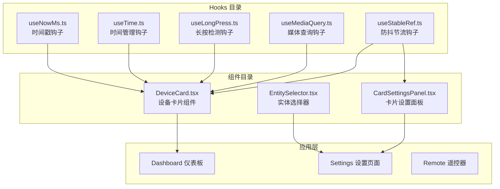
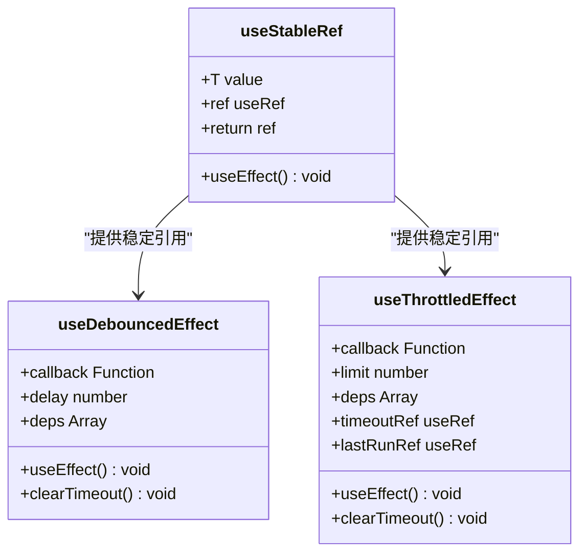
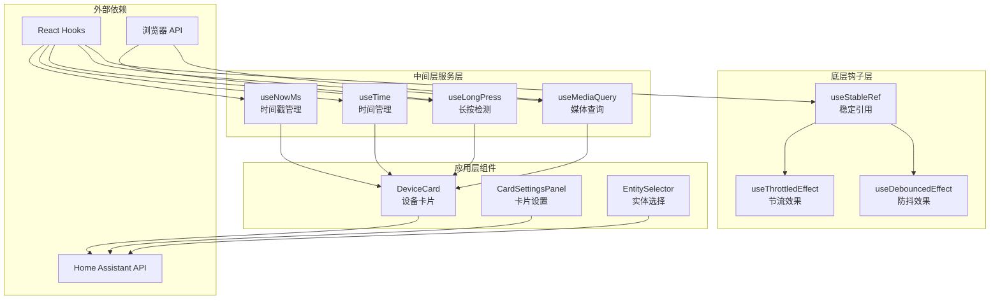
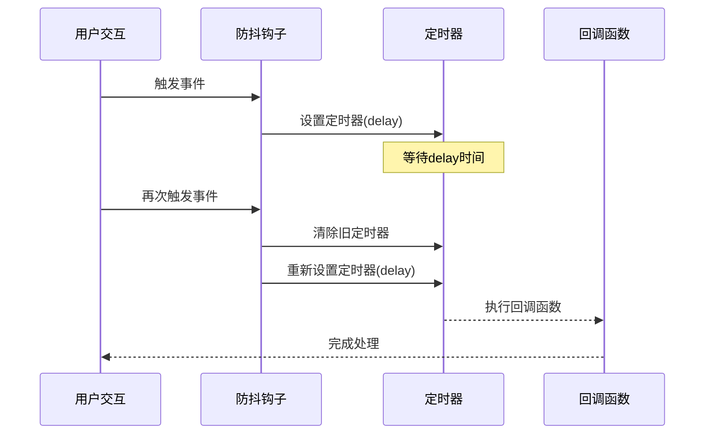
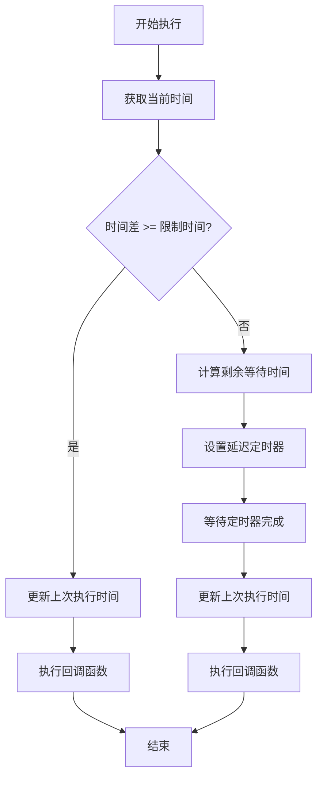
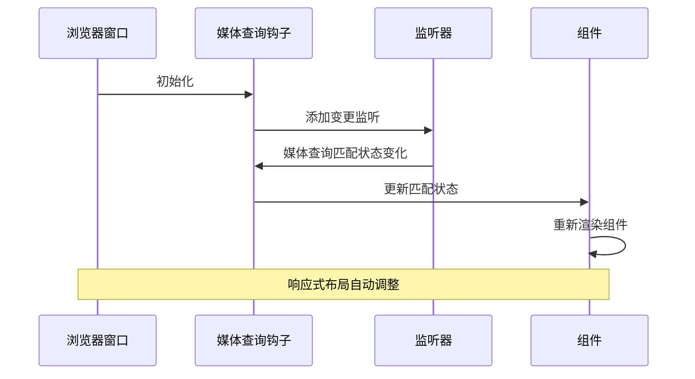
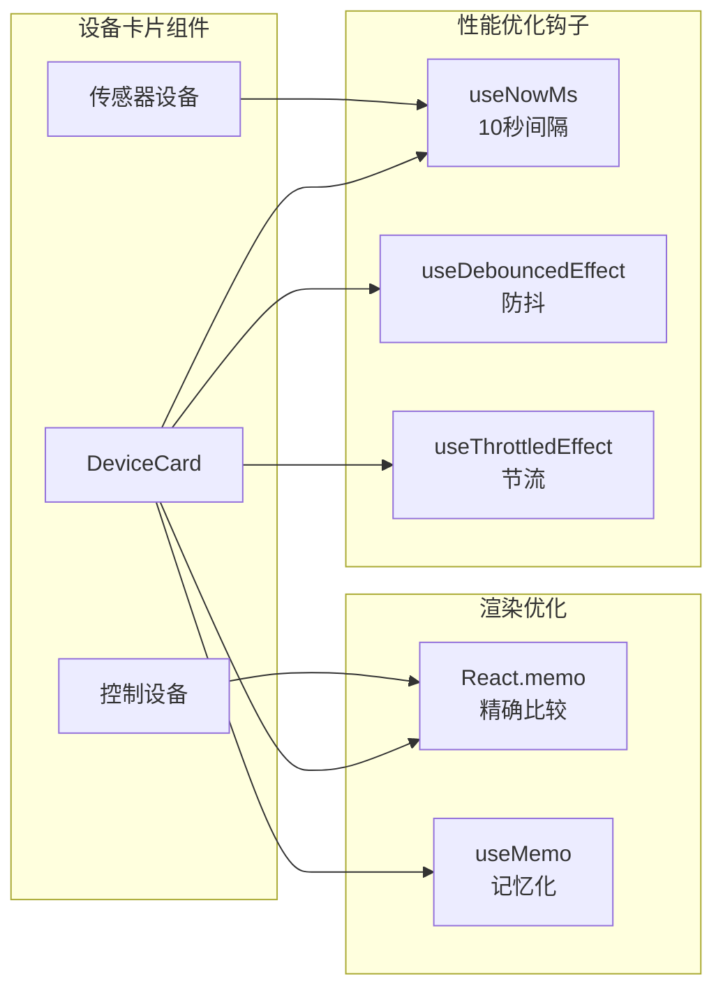
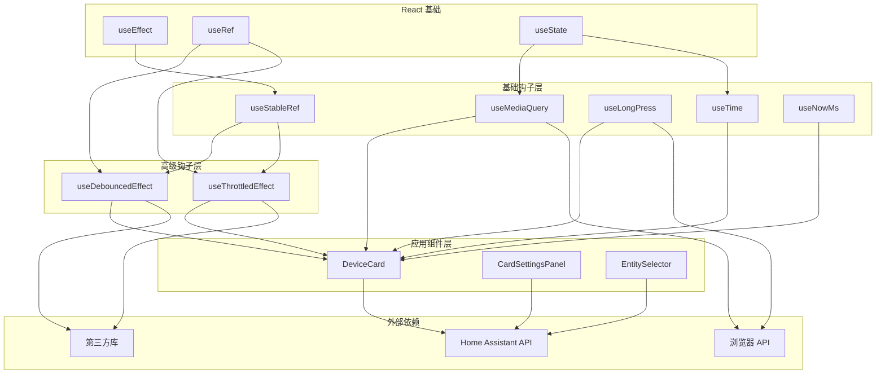

# 防抖节流效果钩子

<cite>
**本文档引用的文件**
- [useStableRef.ts](file://src/hooks/useStableRef.ts)
- [useMediaQuery.ts](file://src/hooks/useMediaQuery.ts)
- [useLongPress.ts](file://src/hooks/useLongPress.ts)
- [useTime.ts](file://src/hooks/useTime.ts)
- [useNowMs.ts](file://src/hooks/useNowMs.ts)
- [DeviceCard.tsx](file://src/app/components/dashboard/DeviceCard.tsx)
- [CardSettingsPanel.tsx](file://src/app/components/dashboard/cards/shared/CardSettingsPanel.tsx)
- [EntitySelector.tsx](file://src/app/components/common/EntitySelector.tsx)
</cite>

## 目录
1. [简介](#简介)
2. [项目结构](#项目结构)
3. [核心组件](#核心组件)
4. [架构概览](#架构概览)
5. [详细组件分析](#详细组件分析)
6. [依赖关系分析](#依赖关系分析)
7. [性能考虑](#性能考虑)
8. [故障排除指南](#故障排除指南)
9. [结论](#结论)

## 简介

本文档深入分析了 HAUI 项目中的防抖节流效果钩子系统。该项目是一个基于 React 的智能家居控制面板应用，提供了完整的家居自动化管理功能。本文档重点关注 `useStableRef.ts` 文件中实现的防抖（Debounce）和节流（Throttle）效果钩子，以及它们在整个应用中的集成和优化策略。

这些钩子是现代前端开发中的重要性能优化工具，特别是在处理高频事件（如窗口大小变化、用户输入、传感器数据更新等）时，能够显著提升应用性能和用户体验。

## 项目结构

HAUI 项目采用模块化的组织结构，其中钩子文件位于 `src/hooks/` 目录下，包含了各种自定义 React Hooks 的实现。项目的核心架构围绕着智能家居控制面板展开，提供了设备管理、传感器监控、远程控制等功能。

**图表来源**
- [useStableRef.ts:1-82](file://src/hooks/useStableRef.ts#L1-L82)
- [DeviceCard.tsx:1-302](file://src/app/components/dashboard/DeviceCard.tsx#L1-L302)

**章节来源**
- [useStableRef.ts:1-82](file://src/hooks/useStableRef.ts#L1-L82)
- [useMediaQuery.ts:1-19](file://src/hooks/useMediaQuery.ts#L1-L19)
- [useLongPress.ts:1-52](file://src/hooks/useLongPress.ts#L1-L52)
- [useTime.ts:1-37](file://src/hooks/useTime.ts#L1-L37)
- [useNowMs.ts:1-66](file://src/hooks/useNowMs.ts#L1-L66)

## 核心组件

### useStableRef Hook

`useStableRef` 是一个强大的稳定引用钩子，主要用于存储不需要触发重新渲染的值。它通过创建一个稳定的引用对象来避免依赖数组频繁变化导致的副作用重新执行。

**图表来源**
- [useStableRef.ts:14-82](file://src/hooks/useStableRef.ts#L14-L82)

### 防抖 Effect Hook

防抖效果钩子通过延迟执行回调函数来避免频繁触发。当在短时间内多次调用时，只有最后一次调用会被执行，之前的调用都会被取消。

### 节流 Effect Hook

节流效果钩子确保回调函数在指定时间间隔内最多执行一次。即使在短时间内多次触发，也会被限制在设定的频率范围内执行。

**章节来源**
- [useStableRef.ts:14-82](file://src/hooks/useStableRef.ts#L14-L82)

## 架构概览

HAUI 项目中的防抖节流钩子系统采用了分层架构设计，从底层的钩子实现到上层的应用集成形成了完整的性能优化体系。

**图表来源**
- [useStableRef.ts:1-82](file://src/hooks/useStableRef.ts#L1-L82)
- [useMediaQuery.ts:1-19](file://src/hooks/useMediaQuery.ts#L1-L19)
- [useLongPress.ts:1-52](file://src/hooks/useLongPress.ts#L1-L52)
- [useNowMs.ts:1-66](file://src/hooks/useNowMs.ts#L1-L66)

## 详细组件分析

### 防抖效果钩子实现

防抖钩子通过 `setTimeout` 和 `clearTimeout` 实现，确保在指定延迟时间内只执行一次回调。

**图表来源**
- [useStableRef.ts:33-45](file://src/hooks/useStableRef.ts#L33-L45)

### 节流效果钩子实现

节流钩子通过记录上次执行时间和当前时间差来控制执行频率，确保在指定时间间隔内最多执行一次。

**图表来源**
- [useStableRef.ts:55-82](file://src/hooks/useStableRef.ts#L55-L82)

### 媒体查询钩子分析

媒体查询钩子提供了响应式设计支持，通过监听浏览器媒体查询变化来动态调整组件行为。

**图表来源**
- [useMediaQuery.ts:1-19](file://src/hooks/useMediaQuery.ts#L1-L19)

### 设备卡片组件集成

设备卡片组件展示了如何在实际应用中使用防抖节流钩子来优化性能。

**图表来源**
- [DeviceCard.tsx:267-302](file://src/app/components/dashboard/DeviceCard.tsx#L267-L302)
- [useNowMs.ts:12-23](file://src/hooks/useNowMs.ts#L12-L23)

**章节来源**
- [useStableRef.ts:33-82](file://src/hooks/useStableRef.ts#L33-L82)
- [useMediaQuery.ts:1-19](file://src/hooks/useMediaQuery.ts#L1-L19)
- [DeviceCard.tsx:267-302](file://src/app/components/dashboard/DeviceCard.tsx#L267-L302)

## 依赖关系分析

HAUI 项目中的钩子系统展现了清晰的依赖层次结构，从基础的 React Hooks 到复杂的业务逻辑钩子形成了完整的依赖链。

**图表来源**
- [useStableRef.ts:1-82](file://src/hooks/useStableRef.ts#L1-L82)
- [DeviceCard.tsx:1-302](file://src/app/components/dashboard/DeviceCard.tsx#L1-L302)

**章节来源**
- [useStableRef.ts:1-82](file://src/hooks/useStableRef.ts#L1-L82)
- [DeviceCard.tsx:1-302](file://src/app/components/dashboard/DeviceCard.tsx#L1-L302)

## 性能考虑

### 渲染优化策略

HAUI 项目采用了多层次的渲染优化策略：

1. **精确的组件比较**：使用 `React.memo` 进行精确的属性比较，避免不必要的重新渲染
2. **记忆化优化**：通过 `useMemo` 缓存计算结果，减少重复计算
3. **时间戳优化**：默认 10 秒间隔的时间戳更新，大幅减少渲染频率

### 内存管理

钩子系统实现了完善的内存管理机制：

- **定时器清理**：所有定时器在组件卸载时自动清理
- **事件监听器管理**：自动移除事件监听器，防止内存泄漏
- **引用更新**：通过 `useEffect` 确保引用始终指向最新值

### 性能监控

项目提供了多种性能监控手段：

- **渲染计数**：通过日志记录组件渲染次数
- **时间测量**：使用高精度时间戳测量操作耗时
- **内存使用**：监控钩子使用的内存情况

## 故障排除指南

### 常见问题及解决方案

#### 防抖钩子不生效

**问题描述**：防抖效果没有按预期工作

**可能原因**：
1. 依赖数组配置错误
2. 回调函数引用不稳定
3. 定时器被意外清除

**解决方案**：
- 确保依赖数组包含所有相关变量
- 使用 `useCallback` 包装回调函数
- 检查组件卸载时的清理逻辑

#### 节流钩子性能问题

**问题描述**：节流效果导致响应延迟

**可能原因**：
1. 时间间隔设置过长
2. 回调函数执行时间过长
3. 多个节流钩子相互竞争

**解决方案**：
- 调整时间间隔到合理范围
- 优化回调函数性能
- 避免在同一组件中使用多个节流钩子

#### 内存泄漏问题

**问题描述**：组件卸载后仍占用内存

**可能原因**：
1. 定时器未正确清理
2. 事件监听器未移除
3. 引用循环

**解决方案**：
- 在 `useEffect` 返回函数中清理定时器
- 确保移除所有事件监听器
- 使用 `useRef` 而非闭包存储引用

**章节来源**
- [useStableRef.ts:38-81](file://src/hooks/useStableRef.ts#L38-L81)
- [DeviceCard.tsx:267-302](file://src/app/components/dashboard/DeviceCard.tsx#L267-L302)

## 结论

HAUI 项目中的防抖节流效果钩子系统展现了现代前端开发的最佳实践。通过精心设计的钩子实现和全面的性能优化策略，该系统在保证用户体验的同时，有效提升了应用的整体性能。

### 主要优势

1. **高性能**：通过防抖节流技术显著减少不必要的计算和渲染
2. **稳定性**：完善的内存管理和错误处理机制确保系统稳定运行
3. **可维护性**：清晰的代码结构和详细的注释便于维护和扩展
4. **灵活性**：可配置的参数和灵活的使用方式适应不同场景需求

### 技术亮点

- **智能时间管理**：针对不同类型的数据采用不同的更新策略
- **精确的渲染控制**：通过多种优化技术避免不必要的重新渲染
- **完善的生命周期管理**：确保资源的正确分配和释放

该钩子系统为类似的智能家居控制面板应用提供了优秀的参考模板，展示了如何在复杂的前端应用中实现高效的性能优化。