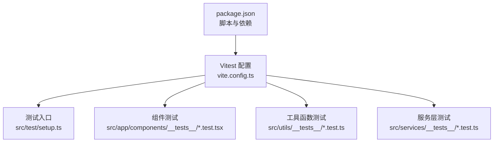
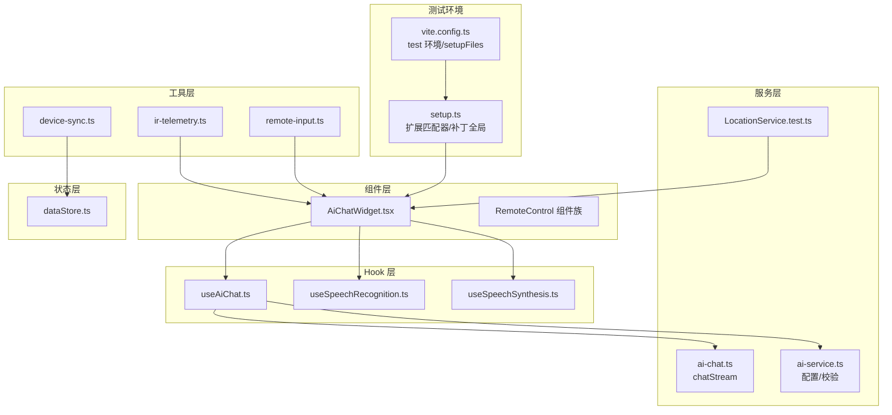
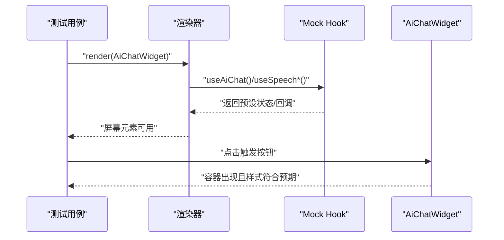
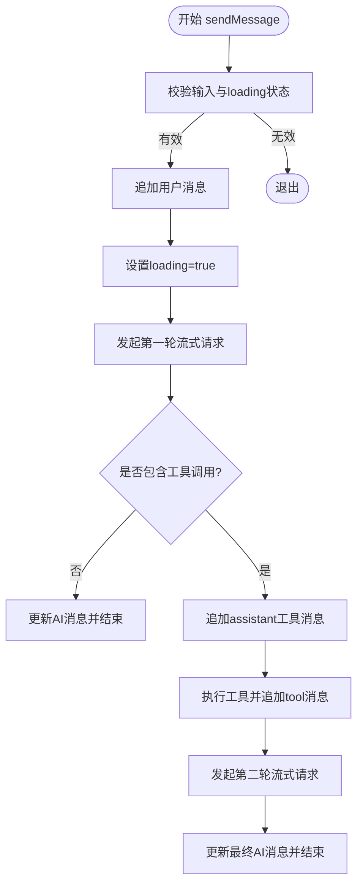
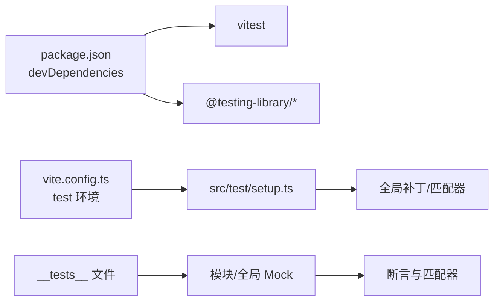

# 单元测试

<cite>
**本文引用的文件**   
- [package.json](file://package.json)
- [vite.config.ts](file://vite.config.ts)
- [src/test/setup.ts](file://src/test/setup.ts)
- [src/app/components/AiChatWidget.tsx](file://src/app/components/AiChatWidget.tsx)
- [src/hooks/useAiChat.ts](file://src/hooks/useAiChat.ts)
- [src/services/ai-chat.ts](file://src/services/ai-chat.ts)
- [src/store/dataStore.ts](file://src/store/dataStore.ts)
- [src/utils/device-sync.ts](file://src/utils/device-sync.ts)
- [src/utils/remote-input.ts](file://src/utils/remote-input.ts)
- [src/utils/ir-telemetry.ts](file://src/utils/ir-telemetry.ts)
- [src/app/components/__tests__/AiChatWidget.test.tsx](file://src/app/components/__tests__/AiChatWidget.test.tsx)
- [src/utils/__tests__/device-sync.light.test.ts](file://src/utils/__tests__/device-sync.light.test.ts)
- [src/services/__tests__/LocationService.test.ts](file://src/services/__tests__/LocationService.test.ts)
</cite>

## 目录
1. [简介](#简介)
2. [项目结构](#项目结构)
3. [核心组件](#核心组件)
4. [架构总览](#架构总览)
5. [详细组件分析](#详细组件分析)
6. [依赖关系分析](#依赖关系分析)
7. [性能考量](#性能考量)
8. [故障排查指南](#故障排查指南)
9. [结论](#结论)
10. [附录](#附录)

## 简介
本文件面向 HAUI 项目的单元测试实践，系统性阐述基于 Vitest 的测试体系，覆盖 React 组件测试、Hook 测试、工具函数测试与状态管理模块测试。文档重点包括：
- Vitest 测试环境配置与 Mock 策略
- 断言方法与测试隔离
- 设备控制组件、AI 聊天组件、状态管理模块与工具函数的测试策略
- 测试用例设计原则、测试数据准备与覆盖率要求
- 异步操作、用户交互与错误处理的测试示例路径
- 测试依赖管理与性能优化技巧

## 项目结构
HAUI 使用 Vite + Vitest 进行单元测试，测试文件广泛分布在各模块目录下的 __tests__ 文件夹中，并通过 vite.config.ts 的 test 字段统一配置测试环境。

图表来源
- [vite.config.ts:46-50](file://vite.config.ts#L46-L50)
- [src/test/setup.ts:1-46](file://src/test/setup.ts#L1-L46)
- [package.json:6-12](file://package.json#L6-L12)

章节来源
- [vite.config.ts:46-50](file://vite.config.ts#L46-L50)
- [src/test/setup.ts:1-46](file://src/test/setup.ts#L1-L46)
- [package.json:6-12](file://package.json#L6-L12)

## 核心组件
本节概述与测试密切相关的模块与职责：
- 组件层：AiChatWidget（AI 聊天小部件）、各类卡片与设置面板组件
- Hook 层：useAiChat（AI 对话核心逻辑）、useSpeechRecognition/useSpeechSynthesis（语音能力）
- 服务层：ai-chat（SSE 流式对话）、ai-service（配置与校验）、LocationService（地理坐标解析）
- 工具层：device-sync（设备状态同步）、remote-input（遥控输入控制器）、ir-telemetry（红外遥测）
- 状态层：dataStore（Zustand + persist，本地持久化）

章节来源
- [src/app/components/AiChatWidget.tsx:1-678](file://src/app/components/AiChatWidget.tsx#L1-L678)
- [src/hooks/useAiChat.ts:1-317](file://src/hooks/useAiChat.ts#L1-L317)
- [src/services/ai-chat.ts:1-153](file://src/services/ai-chat.ts#L1-L153)
- [src/store/dataStore.ts:1-129](file://src/store/dataStore.ts#L1-L129)
- [src/utils/device-sync.ts:1-191](file://src/utils/device-sync.ts#L1-L191)
- [src/utils/remote-input.ts:1-117](file://src/utils/remote-input.ts#L1-L117)
- [src/utils/ir-telemetry.ts:1-21](file://src/utils/ir-telemetry.ts#L1-L21)

## 架构总览
下图展示了测试涉及的关键模块与交互关系，以及测试中常用的 Mock 策略与断言点。

图表来源
- [src/test/setup.ts:1-46](file://src/test/setup.ts#L1-L46)
- [vite.config.ts:46-50](file://vite.config.ts#L46-L50)
- [src/app/components/AiChatWidget.tsx:1-678](file://src/app/components/AiChatWidget.tsx#L1-L678)
- [src/hooks/useAiChat.ts:1-317](file://src/hooks/useAiChat.ts#L1-L317)
- [src/services/ai-chat.ts:1-153](file://src/services/ai-chat.ts#L1-L153)
- [src/store/dataStore.ts:1-129](file://src/store/dataStore.ts#L1-L129)
- [src/utils/device-sync.ts:1-191](file://src/utils/device-sync.ts#L1-L191)
- [src/utils/remote-input.ts:1-117](file://src/utils/remote-input.ts#L1-L117)
- [src/utils/ir-telemetry.ts:1-21](file://src/utils/ir-telemetry.ts#L1-L21)
- [src/services/__tests__/LocationService.test.ts:1-107](file://src/services/__tests__/LocationService.test.ts#L1-L107)

## 详细组件分析

### 组件测试：AiChatWidget
- 测试目标
  - 组件在不同设备尺寸下的布局与样式差异
  - 展开/收起流程与交互元素可见性
  - 与 useAiChat/useSpeechRecognition/useSpeechSynthesis 的集成行为
- 关键断言点
  - 触发按钮存在与点击后容器出现
  - 移动端/桌面端样式类与定位属性
  - 标题栏文案与欢迎消息渲染
- Mock 策略
  - 使用 vitest.spyOn 替换 useIsMobile
  - Mock useAiChat/useSpeechRecognition/useSpeechSynthesis 返回值
  - 为 ResizeObserver 提供全局补丁以适配 Framer Motion
- 示例路径
  - [AiChatWidget.test.tsx:1-131](file://src/app/components/__tests__/AiChatWidget.test.tsx#L1-L131)

图表来源
- [src/app/components/__tests__/AiChatWidget.test.tsx:63-130](file://src/app/components/__tests__/AiChatWidget.test.tsx#L63-L130)
- [src/app/components/AiChatWidget.tsx:335-678](file://src/app/components/AiChatWidget.tsx#L335-L678)

章节来源
- [src/app/components/__tests__/AiChatWidget.test.tsx:1-131](file://src/app/components/__tests__/AiChatWidget.test.tsx#L1-L131)
- [src/app/components/AiChatWidget.tsx:1-678](file://src/app/components/AiChatWidget.tsx#L1-L678)

### Hook 测试：useAiChat
- 测试目标
  - 配置加载与保存（localStorage 与后端）
  - 消息发送流程（含流式事件、工具调用拦截与二次请求）
  - 中断与错误处理
  - 历史清理与状态变更回调
- 关键断言点
  - 首次渲染包含欢迎消息
  - 发送消息时 loading 状态切换
  - 工具调用后追加 tool 消息并触发二次请求
  - 错误分支写入错误消息并回调 onError
- Mock 策略
  - Mock chatStream 的 onEvent 分发，模拟 content/tool_call/error/done
  - Mock localStorage 与 fetch 接口
  - 通过 AbortController 控制请求生命周期
- 示例路径
  - [useAiChat.ts:57-317](file://src/hooks/useAiChat.ts#L57-L317)
  - [ai-chat.ts:25-153](file://src/services/ai-chat.ts#L25-L153)

图表来源
- [src/hooks/useAiChat.ts:132-292](file://src/hooks/useAiChat.ts#L132-L292)
- [src/services/ai-chat.ts:89-151](file://src/services/ai-chat.ts#L89-L151)

章节来源
- [src/hooks/useAiChat.ts:1-317](file://src/hooks/useAiChat.ts#L1-L317)
- [src/services/ai-chat.ts:1-153](file://src/services/ai-chat.ts#L1-L153)

### 工具函数测试：device-sync
- 测试目标
  - 灯光亮度同步：关灯时亮度归零；开灯时从 HA 属性取值
  - 其他设备类型的状态映射与属性同步
- 关键断言点
  - 关灯场景 brightness=0
  - 开灯场景 brightness=属性值
- 示例路径
  - [device-sync.light.test.ts:1-75](file://src/utils/__tests__/device-sync.light.test.ts#L1-L75)
  - [device-sync.ts:4-191](file://src/utils/device-sync.ts#L4-L191)

章节来源
- [src/utils/__tests__/device-sync.light.test.ts:1-75](file://src/utils/__tests__/device-sync.light.test.ts#L1-L75)
- [src/utils/device-sync.ts:1-191](file://src/utils/device-sync.ts#L1-L191)

### 工具函数测试：remote-input 与 ir-telemetry
- 测试目标
  - 遥控输入控制器的去抖与事件发射
  - 遥测事件的自定义事件派发
- 关键断言点
  - 最短间隔控制与 telemetry 接收
  - 自定义事件名称与 payload 结构
- 示例路径
  - [remote-input.ts:31-117](file://src/utils/remote-input.ts#L31-L117)
  - [ir-telemetry.ts:10-21](file://src/utils/ir-telemetry.ts#L10-L21)

章节来源
- [src/utils/remote-input.ts:1-117](file://src/utils/remote-input.ts#L1-L117)
- [src/utils/ir-telemetry.ts:1-21](file://src/utils/ir-telemetry.ts#L1-L21)

### 状态管理测试：dataStore
- 测试目标
  - 设备集合的增删改查与功能型更新
  - 日志队列长度限制与清空
  - 持久化中间件与存储同步触发
- 关键断言点
  - setDevices 支持函数式更新
  - addLog 限制保留最近 N 条
  - storage 回调触发同步
- 示例路径
  - [dataStore.ts:58-129](file://src/store/dataStore.ts#L58-L129)

章节来源
- [src/store/dataStore.ts:1-129](file://src/store/dataStore.ts#L1-L129)

### 服务层测试：LocationService
- 测试目标
  - 地址解析优先级（区 -> 市 -> 省）
  - 缓存命中与响应健壮性
- 关键断言点
  - 不同层级解析返回 resolution
  - 缓存结果一致
- 示例路径
  - [LocationService.test.ts:1-107](file://src/services/__tests__/LocationService.test.ts#L1-L107)

章节来源
- [src/services/__tests__/LocationService.test.ts:1-107](file://src/services/__tests__/LocationService.test.ts#L1-L107)

## 依赖关系分析
- 测试隔离
  - 使用 vitest.resetAllMocks() 与 beforeEach 清理副作用
  - 通过 vitest.spyOn 临时替换模块导出
- Mock 策略
  - 全局补丁：ResizeObserver、Worker、Element.prototype.scrollIntoView
  - 模块级 Mock：useAiChat、useSpeech*、ai-service、ai-context
- 断言方法
  - @testing-library/jest-dom 扩展：toBeInTheDocument、toHaveClass 等
  - Vitest expect API：toEqual、toBe、toHaveBeenCalled 等

图表来源
- [package.json:98-124](file://package.json#L98-L124)
- [vite.config.ts:46-50](file://vite.config.ts#L46-L50)
- [src/test/setup.ts:1-46](file://src/test/setup.ts#L1-L46)

章节来源
- [package.json:98-124](file://package.json#L98-L124)
- [vite.config.ts:46-50](file://vite.config.ts#L46-L50)
- [src/test/setup.ts:1-46](file://src/test/setup.ts#L1-L46)

## 性能考量
- 测试并发与隔离
  - 使用 vitest 并行执行，减少测试总时长
  - 通过 resetAllMocks 与 afterEach 清理，避免跨用例污染
- Mock 策略优化
  - 仅对必要模块进行 Mock，降低真实调用成本
  - 使用函数式 Mock 返回稳定数据，提升可重复性
- DOM 与动画
  - 全局补丁 ResizeObserver 与 Worker，避免真实环境初始化开销
  - 通过 data-testid 选择器精准查询，减少不必要的渲染与查找

## 故障排查指南
- 常见问题
  - 测试中出现 ResizeObserver/Worker 未定义错误：确认 setup.ts 已被加载
  - 组件动画导致断言不稳定：使用 data-testid 或禁用动画
  - 流式请求未触发：检查 chatStream 的 onEvent 分发与 AbortController 状态
- 排查步骤
  - 在测试中打印关键状态（如 messages/inputValue/loading）
  - 使用 vitest.spyOn 追踪函数调用序列
  - 逐步缩小 Mock 范围，验证真实行为

章节来源
- [src/test/setup.ts:1-46](file://src/test/setup.ts#L1-L46)
- [src/hooks/useAiChat.ts:132-292](file://src/hooks/useAiChat.ts#L132-L292)
- [src/services/ai-chat.ts:89-151](file://src/services/ai-chat.ts#L89-L151)

## 结论
HAUI 的单元测试以 Vitest 为核心，结合 @testing-library 与 @testing-library/jest-dom，构建了覆盖组件、Hook、工具函数与状态管理的测试体系。通过合理的 Mock 策略、断言方法与测试隔离机制，能够稳定地验证复杂交互（如流式对话、语音输入、设备同步）与边界条件（错误处理、缓存命中）。建议持续补充边缘场景与异步流程的测试用例，确保高覆盖率与高可靠性。

## 附录
- 测试用例设计原则
  - 单一职责：每个用例聚焦一个行为或边界
  - 可重复性：使用稳定 Mock 数据与固定时间戳
  - 明确断言：使用语义化断言与可读性标签
- 测试数据准备
  - 使用最小化、可预测的数据结构，避免外部依赖
  - 对于异步场景，提供明确的事件序列与超时控制
- 覆盖率要求
  - 建议关键业务路径（如 sendMessage、工具调用、设备同步）达到高覆盖率
  - 对易错分支（错误处理、异常响应）进行专项覆盖