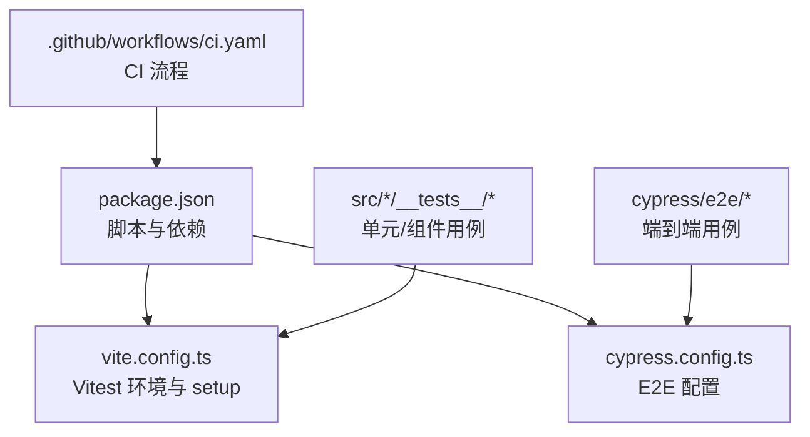
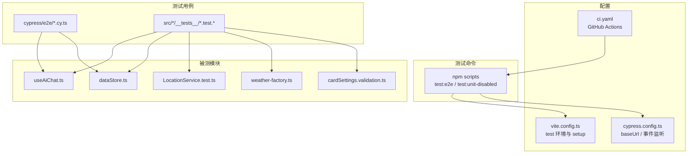
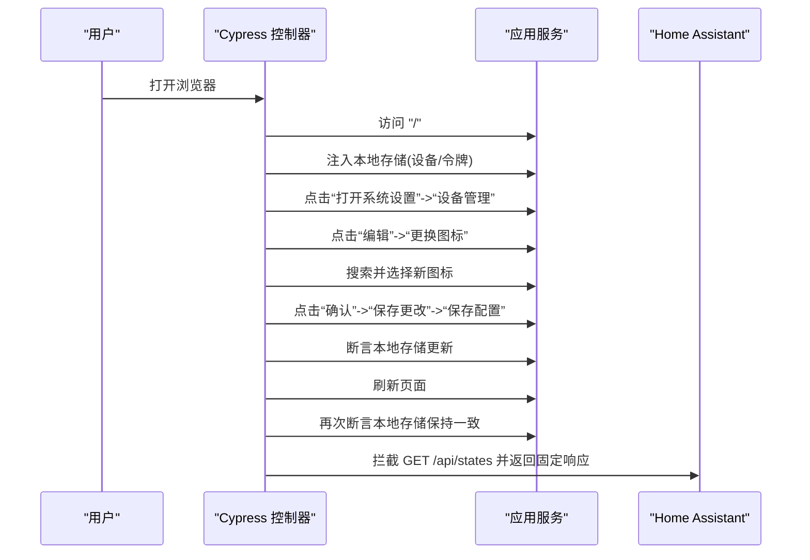
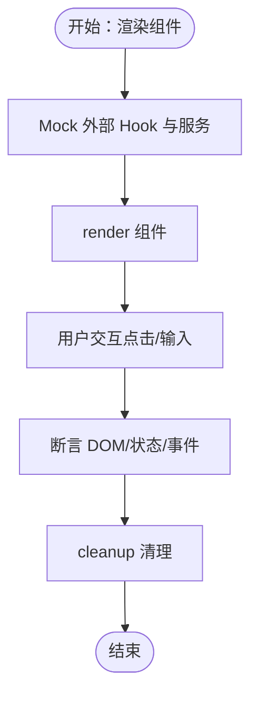
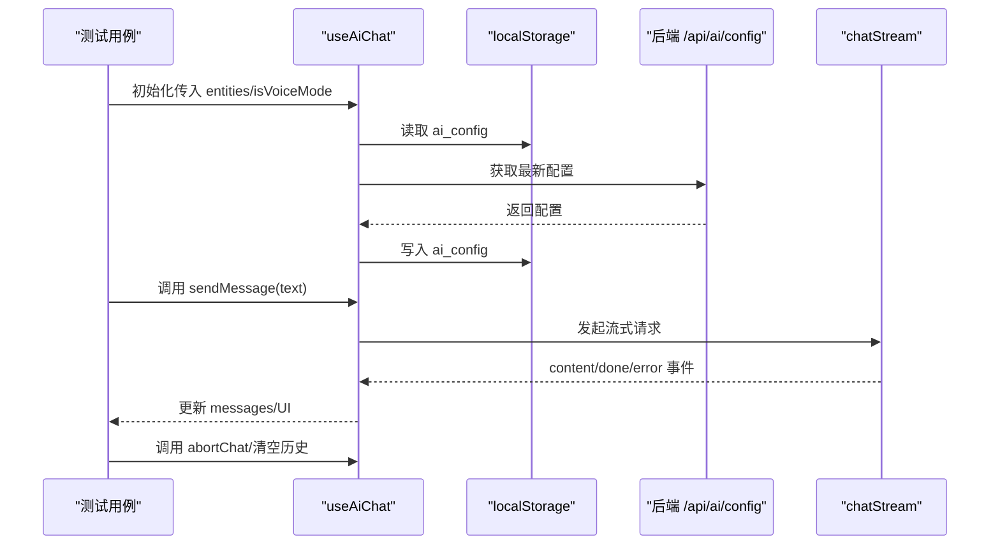
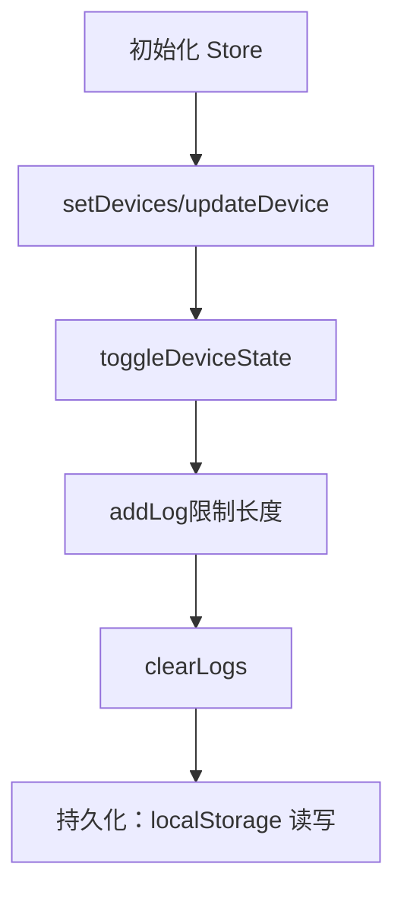
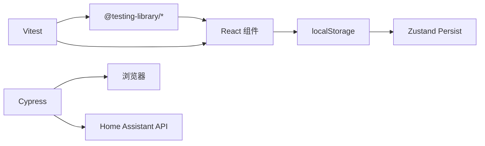

# 测试策略

<cite>
**本文引用的文件**
- [package.json](file://package.json)
- [cypress.config.ts](file://cypress.config.ts)
- [vite.config.ts](file://vite.config.ts)
- [src/test/setup.ts](file://src/test/setup.ts)
- [.github/workflows/ci.yaml](file://.github/workflows/ci.yaml)
- [cypress/e2e/home.cy.ts](file://cypress/e2e/home.cy.ts)
- [cypress/e2e/device-icon-change.cy.ts](file://cypress/e2e/device-icon-change.cy.ts)
- [src/app/components/__tests__/AiChatWidget.test.tsx](file://src/app/components/__tests__/AiChatWidget.test.tsx)
- [src/services/__tests__/LocationService.test.ts](file://src/services/__tests__/LocationService.test.ts)
- [src/utils/__tests__/device-sync.light.test.ts](file://src/utils/__tests__/device-sync.light.test.ts)
- [src/hooks/useAiChat.ts](file://src/hooks/useAiChat.ts)
- [src/hooks/useHomeAssistant.ts](file://src/hooks/useHomeAssistant.ts)
- [src/store/dataStore.ts](file://src/store/dataStore.ts)
- [src/services/weather/weather-factory.ts](file://src/services/weather/weather-factory.ts)
- [src/app/components/dashboard/cards/shared/cardSettings.validation.ts](file://src/app/components/dashboard/cards/shared/cardSettings.validation.ts)
</cite>

## 目录
1. [引言](#引言)
2. [项目结构](#项目结构)
3. [核心组件](#核心组件)
4. [架构总览](#架构总览)
5. [详细组件分析](#详细组件分析)
6. [依赖分析](#依赖分析)
7. [性能考虑](#性能考虑)
8. [故障排查指南](#故障排查指南)
9. [结论](#结论)
10. [附录](#附录)

## 引言
本测试策略文档面向 HAUI 项目，系统化阐述端到端测试（Cypress）、单元测试（Vitest/Testing Library）与组件测试的实施方法与工具选择，并结合现有仓库中的测试样例，给出配置要点、用例设计、Mock 策略、覆盖率目标、测试数据管理、测试环境搭建、CI/CD 集成与测试报告生成的实操建议。同时总结 React 组件测试、Hook 测试与状态管理测试的最佳实践，以及测试用例编写、调试技巧与测试维护的指导原则。

## 项目结构
- 测试工具与脚本
  - 单元测试：Vitest + Testing Library（React），配置于 Vite 配置中，使用 jsdom 环境，全局 setup 文件注入 DOM 补丁与测试辅助。
  - 端到端测试：Cypress，配置基础 URL 指向开发服务器。
  - 脚本：package.json 提供 test:e2e、test:unit-disabled 等命令入口。
- 测试分布
  - Cypress E2E：cypress/e2e 下包含首页加载与设备图标变更等场景。
  - Vitest 单元测试：按功能域分层，如 src/app/components、src/services、src/utils、src/hooks、src/store 等目录下存在 __tests__ 或 *.test.* 文件。
- CI：GitHub Actions 使用 Ubuntu Runner，安装 Node.js 22，执行代码检查与构建。

**图表来源**
- [package.json:1-132](file://package.json#L1-L132)
- [vite.config.ts:1-53](file://vite.config.ts#L1-L53)
- [cypress.config.ts:1-11](file://cypress.config.ts#L1-L11)
- [.github/workflows/ci.yaml:1-29](file://.github/workflows/ci.yaml#L1-L29)

**章节来源**
- [package.json:1-132](file://package.json#L1-L132)
- [vite.config.ts:46-51](file://vite.config.ts#L46-L51)
- [cypress.config.ts:3-10](file://cypress.config.ts#L3-L10)
- [.github/workflows/ci.yaml:1-29](file://.github/workflows/ci.yaml#L1-L29)

## 核心组件
- 单元测试（Vitest + Testing Library）
  - 环境：jsdom；全局 setup 注入 ResizeObserver、Worker、scrollIntoView 等浏览器 API 的最小可用实现，扩展 jest-dom 断言。
  - 用例组织：按功能模块划分目录，覆盖业务逻辑、工具函数、Hook、服务与状态管理。
- 端到端测试（Cypress）
  - 基础 URL：http://localhost:5173；支持拦截 /ha-api 与本地存储注入，验证设备图标变更持久化。
- Hook 测试
  - 以 useAiChat 为例，覆盖配置加载/保存、消息流式处理、工具调用、错误处理与中止逻辑。
- 状态管理测试
  - 以 dataStore（Zustand + persist）为例，验证设备/房间/场景/用户/日志的增删改查与持久化行为。
- 工具与服务测试
  - LocationService：坐标解析与缓存；weather-factory：适配器工厂；cardSettings.validation：卡片标题校验。

**章节来源**
- [src/test/setup.ts:1-46](file://src/test/setup.ts#L1-L46)
- [vite.config.ts:46-51](file://vite.config.ts#L46-L51)
- [cypress/e2e/home.cy.ts:1-10](file://cypress/e2e/home.cy.ts#L1-L10)
- [cypress/e2e/device-icon-change.cy.ts:1-67](file://cypress/e2e/device-icon-change.cy.ts#L1-L67)
- [src/hooks/useAiChat.ts:1-317](file://src/hooks/useAiChat.ts#L1-L317)
- [src/store/dataStore.ts:1-129](file://src/store/dataStore.ts#L1-L129)
- [src/services/__tests__/LocationService.test.ts:1-107](file://src/services/__tests__/LocationService.test.ts#L1-L107)
- [src/services/weather/weather-factory.ts:1-21](file://src/services/weather/weather-factory.ts#L1-L21)
- [src/app/components/dashboard/cards/shared/cardSettings.validation.ts:1-15](file://src/app/components/dashboard/cards/shared/cardSettings.validation.ts#L1-L15)

## 架构总览
下图展示测试栈在项目中的位置与交互关系，包括测试命令、配置文件与被测模块之间的映射。

**图表来源**
- [package.json:6-11](file://package.json#L6-L11)
- [vite.config.ts:46-51](file://vite.config.ts#L46-L51)
- [cypress.config.ts:3-10](file://cypress.config.ts#L3-L10)
- [.github/workflows/ci.yaml:1-29](file://.github/workflows/ci.yaml#L1-L29)
- [src/hooks/useAiChat.ts:1-317](file://src/hooks/useAiChat.ts#L1-L317)
- [src/store/dataStore.ts:1-129](file://src/store/dataStore.ts#L1-L129)
- [src/services/__tests__/LocationService.test.ts:1-107](file://src/services/__tests__/LocationService.test.ts#L1-L107)
- [src/services/weather/weather-factory.ts:1-21](file://src/services/weather/weather-factory.ts#L1-L21)
- [src/app/components/dashboard/cards/shared/cardSettings.validation.ts:1-15](file://src/app/components/dashboard/cards/shared/cardSettings.validation.ts#L1-L15)

## 详细组件分析

### 端到端测试（Cypress）
- 配置要点
  - 基础 URL：指向开发服务器 http://localhost:5173。
  - Node 事件钩子预留扩展点（如截图、视频、自定义 reporter）。
- 场景设计
  - 应用加载：断言根元素存在、标题非空。
  - 设备图标变更：通过拦截 /ha-api/states、注入本地存储、点击操作、断言本地存储更新与重载后一致性。
- 最佳实践
  - 使用别名与数据驱动，减少重复步骤。
  - 通过 cy.intercept 精确模拟后端响应，避免真实网络依赖。
  - 在 before/after 中清理本地存储与数据库，确保用例隔离。

**图表来源**
- [cypress/e2e/device-icon-change.cy.ts:1-67](file://cypress/e2e/device-icon-change.cy.ts#L1-L67)
- [cypress.config.ts:3-10](file://cypress.config.ts#L3-L10)

**章节来源**
- [cypress/e2e/home.cy.ts:1-10](file://cypress/e2e/home.cy.ts#L1-L10)
- [cypress/e2e/device-icon-change.cy.ts:1-67](file://cypress/e2e/device-icon-change.cy.ts#L1-L67)
- [cypress.config.ts:3-10](file://cypress.config.ts#L3-L10)

### 单元测试（Vitest + Testing Library）
- 环境与补丁
  - jsdom 环境；setup.ts 注入 ResizeObserver、Worker、scrollIntoView 等，扩展 jest-dom 断言。
- 用例示例
  - 组件测试：AiChatWidget.test.tsx 展示了对移动端/桌面端布局差异、欢迎消息与标题栏的断言，以及对 useSpeechRecognition/useSpeechSynthesis/useAiChat 等 Hook 的 Mock。
  - 工具函数测试：device-sync.light.test.tsx 验证灯光亮度同步逻辑（关闭时亮度归零、开启时同步亮度）。
  - 服务测试：LocationService.test.ts 验证坐标解析、降级匹配、组合查询与缓存。
- 最佳实践
  - 使用 vi.mock 对外部依赖进行精确 Mock，避免真实网络或 DOM 依赖。
  - 使用 beforeEach/afterEach 重置 Mock 与清理副作用。
  - 对异步流程使用合理的超时与断言，避免竞态。

**图表来源**
- [src/app/components/__tests__/AiChatWidget.test.tsx:1-131](file://src/app/components/__tests__/AiChatWidget.test.tsx#L1-L131)
- [src/utils/__tests__/device-sync.light.test.ts:1-75](file://src/utils/__tests__/device-sync.light.test.ts#L1-L75)
- [src/services/__tests__/LocationService.test.ts:1-107](file://src/services/__tests__/LocationService.test.ts#L1-L107)

**章节来源**
- [src/test/setup.ts:1-46](file://src/test/setup.ts#L1-L46)
- [src/app/components/__tests__/AiChatWidget.test.tsx:1-131](file://src/app/components/__tests__/AiChatWidget.test.tsx#L1-L131)
- [src/utils/__tests__/device-sync.light.test.ts:1-75](file://src/utils/__tests__/device-sync.light.test.ts#L1-L75)
- [src/services/__tests__/LocationService.test.ts:1-107](file://src/services/__tests__/LocationService.test.ts#L1-L107)

### Hook 测试（useAiChat）
- 关键路径
  - 配置加载/保存：从 localStorage 与后端加载配置，保存时同步至本地与后端。
  - 消息流式处理：sendMessage 触发流式事件，动态更新内容；工具调用拦截与二次请求。
  - 错误处理与中止：AbortController 控制请求中止；异常时插入错误消息并回调 onError。
- 测试关注点
  - 不同输入与状态下的消息序列变化。
  - 工具调用前后端交互与 UI 更新。
  - 中止与错误分支的边界条件。
- Mock 策略
  - Mock chatStream、localStorage、fetch、ai-service、ai-tools-executor 等依赖，确保可控输入与输出。

**图表来源**
- [src/hooks/useAiChat.ts:1-317](file://src/hooks/useAiChat.ts#L1-L317)

**章节来源**
- [src/hooks/useAiChat.ts:1-317](file://src/hooks/useAiChat.ts#L1-L317)

### 状态管理测试（dataStore）
- 关注点
  - 设备列表增删改查、切换设备状态、日志增删与容量限制。
  - 持久化中间件：localStorage 存取与同步触发。
  - 功能性更新：支持函数式更新与部分字段更新。
- 测试建议
  - 分别验证 setDevices/updateDevice/toggleDeviceState/addLog/clearLogs 的行为。
  - 断言持久化写入与同步回调是否触发。

**图表来源**
- [src/store/dataStore.ts:1-129](file://src/store/dataStore.ts#L1-L129)

**章节来源**
- [src/store/dataStore.ts:1-129](file://src/store/dataStore.ts#L1-L129)

### 工具与服务测试
- LocationService
  - 解析省市区坐标，支持降级匹配与组合查询，断言分辨率与耗时。
  - 缓存命中一致性验证。
- weather-factory
  - Provider 枚举与适配器选择逻辑。
- cardSettings.validation
  - 标题清洗、合法性校验与实体数量上限判断。

**章节来源**
- [src/services/__tests__/LocationService.test.ts:1-107](file://src/services/__tests__/LocationService.test.ts#L1-L107)
- [src/services/weather/weather-factory.ts:1-21](file://src/services/weather/weather-factory.ts#L1-L21)
- [src/app/components/dashboard/cards/shared/cardSettings.validation.ts:1-15](file://src/app/components/dashboard/cards/shared/cardSettings.validation.ts#L1-L15)

## 依赖分析
- 测试工具链
  - Vitest：单元/组件测试引擎，配合 Testing Library。
  - Cypress：端到端测试框架，基于浏览器。
  - Testing Library：DOM 查询与可访问性断言。
- 外部依赖与集成
  - Home Assistant：WebSocket/REST 接口，通过 useHomeAssistant 管理连接与订阅。
  - 本地存储：Zustand persist 与 localStorage 同步。
  - Mock 与拦截：Cypress intercept 与 Vitest vi.mock。

**图表来源**
- [package.json:100-124](file://package.json#L100-L124)
- [src/hooks/useHomeAssistant.ts:1-313](file://src/hooks/useHomeAssistant.ts#L1-L313)
- [src/store/dataStore.ts:1-129](file://src/store/dataStore.ts#L1-L129)

**章节来源**
- [package.json:100-124](file://package.json#L100-L124)
- [src/hooks/useHomeAssistant.ts:1-313](file://src/hooks/useHomeAssistant.ts#L1-L313)
- [src/store/dataStore.ts:1-129](file://src/store/dataStore.ts#L1-L129)

## 性能考虑
- 测试执行速度
  - 使用 jsdom 与最小化 Mock，避免真实网络与重型依赖。
  - 对高频异步流程采用合理超时与断言，减少不必要的等待。
- 覆盖率与稳定性
  - 优先保证关键路径（配置加载/保存、消息流式处理、工具调用、错误处理）的覆盖率。
  - 对持久化与缓存逻辑进行独立用例验证，确保边界条件正确。
- CI 性能
  - 在 CI 中仅运行必要步骤（lint/build），E2E 可在 PR 上按需触发或分批执行。

## 故障排查指南
- 常见问题
  - 环境缺失：matchMedia/ResizeObserver/Worker 未定义导致组件渲染失败。已在 setup.ts 中补丁化。
  - 真实网络依赖：useHomeAssistant 会尝试 WebSocket/REST，建议在测试中通过代理或 Mock 替代。
  - 本地存储：dataStore 的持久化写入需确保同步回调触发，避免断言过早。
- 调试技巧
  - 使用 vitest 的 --inspect-brk 与浏览器 DevTools 调试。
  - 在 Cypress 中启用截图与视频录制，定位 UI 交互问题。
  - 对异步流程增加日志与断言分段，缩小问题范围。

**章节来源**
- [src/test/setup.ts:1-46](file://src/test/setup.ts#L1-L46)
- [src/hooks/useHomeAssistant.ts:1-313](file://src/hooks/useHomeAssistant.ts#L1-L313)
- [src/store/dataStore.ts:1-129](file://src/store/dataStore.ts#L1-L129)

## 结论
HAUI 的测试体系已具备端到端与单元测试的基础能力：Cypress 负责关键用户旅程验证，Vitest 覆盖组件、Hook、服务与状态管理。建议在现有基础上进一步完善覆盖率指标、引入更细粒度的 Mock 策略与数据驱动用例，并在 CI 中加入单元测试与 E2E 的分层执行，以提升质量与效率。

## 附录
- 测试命令
  - npm run test:e2e：运行 Cypress E2E。
  - npm run test:unit-disabled：当前被禁用，可启用并接入覆盖率统计。
- CI/CD 集成
  - 当前 CI 仅执行 lint 与 build，建议新增单元测试与 E2E 步骤，并配置覆盖率阈值与报告上传。
- 覆盖率与报告
  - 建议在 Vitest 中启用覆盖率统计与阈值，Cypress 可通过插件生成报告并在 CI 中归档。