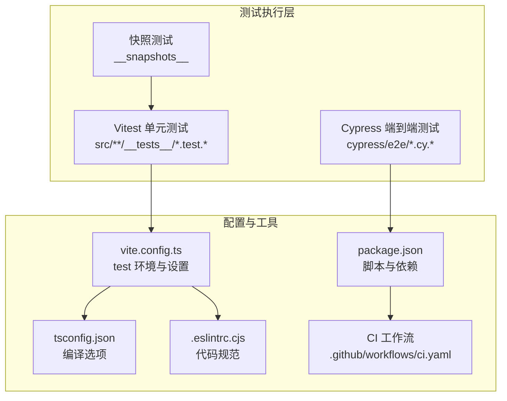
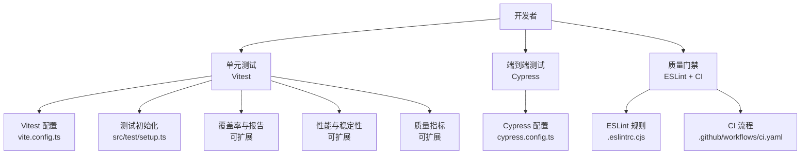
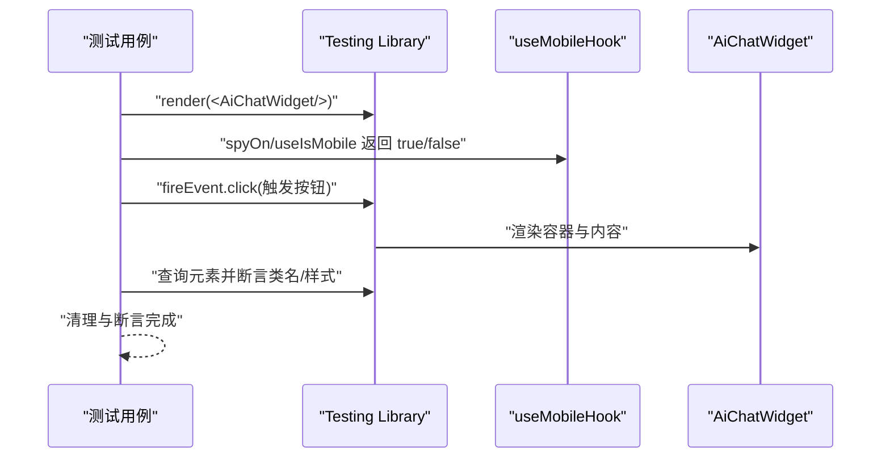
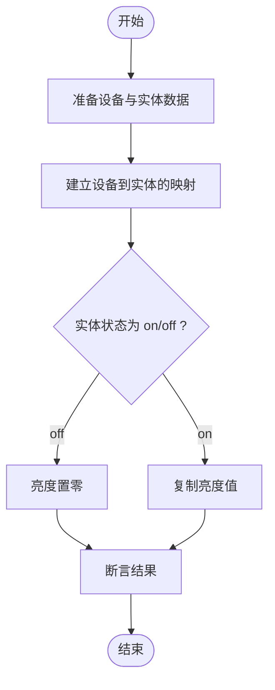
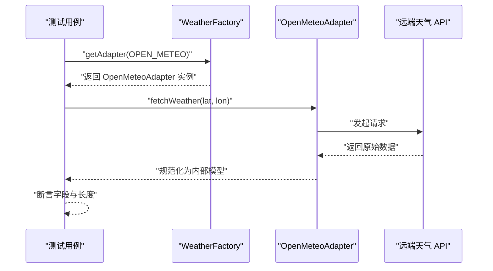
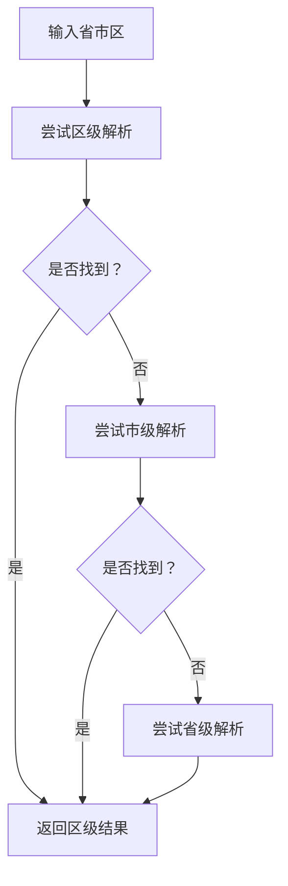
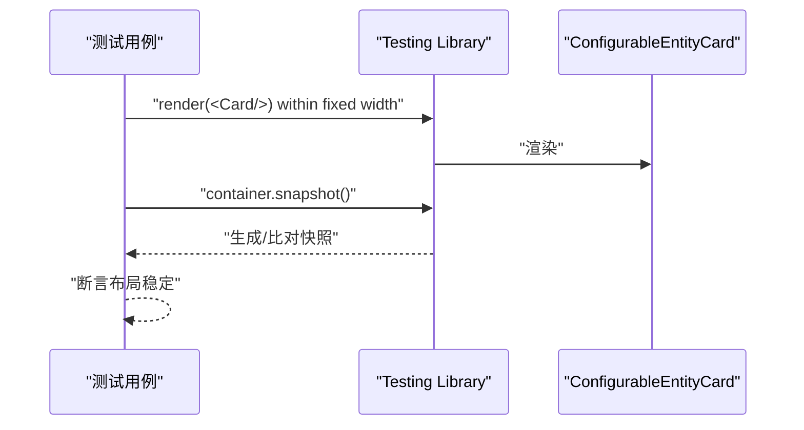
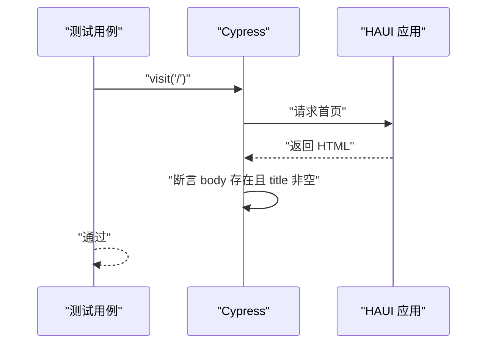
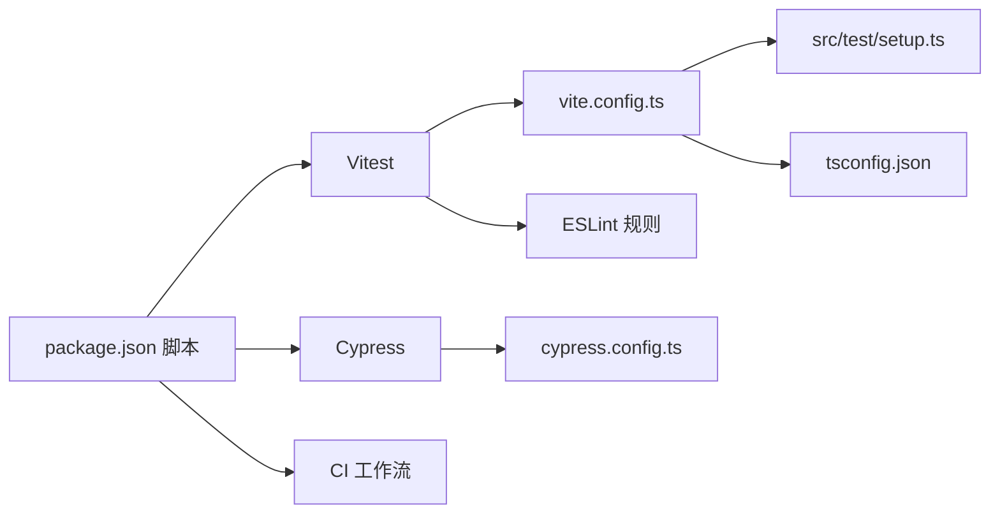

# 测试维护与质量保证

<cite>
**本文引用的文件**
- [package.json](file://package.json)
- [cypress.config.ts](file://cypress.config.ts)
- [vite.config.ts](file://vite.config.ts)
- [src/test/setup.ts](file://src/test/setup.ts)
- [tsconfig.json](file://tsconfig.json)
- [.eslintrc.cjs](file://.eslintrc.cjs)
- [.github/workflows/ci.yaml](file://.github/workflows/ci.yaml)
- [cypress/e2e/home.cy.ts](file://cypress/e2e/home.cy.ts)
- [src/app/components/__tests__/AiChatWidget.test.tsx](file://src/app/components/__tests__/AiChatWidget.test.tsx)
- [src/utils/__tests__/device-sync.light.test.ts](file://src/utils/__tests__/device-sync.light.test.ts)
- [src/services/weather/__tests__/weather-factory.test.ts](file://src/services/weather/__tests__/weather-factory.test.ts)
- [src/services/__tests__/LocationService.test.ts](file://src/services/__tests__/LocationService.test.ts)
- [src/app/components/dashboard/cards/shared/__tests__/ConfigurableEntityCard.snapshot.test.tsx](file://src/app/components/dashboard/cards/shared/__tests__/ConfigurableEntityCard.snapshot.test.tsx)
</cite>

## 目录
1. [简介](#简介)
2. [项目结构](#项目结构)
3. [核心组件](#核心组件)
4. [架构总览](#架构总览)
5. [详细组件分析](#详细组件分析)
6. [依赖关系分析](#依赖关系分析)
7. [性能考量](#性能考量)
8. [故障排查指南](#故障排查指南)
9. [结论](#结论)
10. [附录](#附录)

## 简介
本文件面向 HAUI 项目的测试维护与质量保证，系统梳理测试体系现状、测试用例维护策略、测试数据管理与测试环境维护方法；深入分析测试覆盖率监控、测试性能分析与测试质量评估指标；阐述快照测试的使用方法、测试用例重构策略与测试代码优化技巧；提供测试故障排查、测试环境问题诊断与测试工具升级维护建议；总结测试团队协作规范、测试文档维护与知识分享最佳实践，并提出测试自动化改进、效率提升与成本控制的路径。

## 项目结构
HAUI 的测试体系由以下层次构成：
- 单元测试（Vitest + jsdom）：覆盖业务逻辑、服务层与工具函数，集中于 src 下各模块的 __tests__ 目录。
- 端到端测试（Cypress）：验证应用主流程与关键用户旅程，位于 cypress/e2e。
- 快照测试：用于 UI 组件布局稳定性校验，位于对应组件的 __tests__/__snapshots__。
- 工具链与配置：Vite/Vitest 配置、TypeScript 编译选项、ESLint 规则、GitHub Actions CI。

图表来源
- [vite.config.ts:46-51](file://vite.config.ts#L46-L51)
- [package.json:6-11](file://package.json#L6-L11)
- [tsconfig.json:1-30](file://tsconfig.json#L1-L30)
- [.eslintrc.cjs:1-19](file://.eslintrc.cjs#L1-L19)
- [.github/workflows/ci.yaml:1-29](file://.github/workflows/ci.yaml#L1-L29)

章节来源
- [package.json:6-11](file://package.json#L6-L11)
- [vite.config.ts:46-51](file://vite.config.ts#L46-L51)
- [cypress.config.ts:1-11](file://cypress.config.ts#L1-L11)
- [src/test/setup.ts:1-46](file://src/test/setup.ts#L1-L46)
- [tsconfig.json:1-30](file://tsconfig.json#L1-L30)
- [.eslintrc.cjs:1-19](file://.eslintrc.cjs#L1-L19)
- [.github/workflows/ci.yaml:1-29](file://.github/workflows/ci.yaml#L1-L29)

## 核心组件
- 测试运行器与环境
  - Vitest + jsdom：用于单元测试与快照测试，配置于 vite.config.ts 的 test 字段，全局设置在 src/test/setup.ts。
  - Cypress：用于端到端测试，配置于 cypress.config.ts，当前仅包含基础 baseUrl。
- 覆盖范围
  - 单元测试：服务层（如 LocationService、天气工厂）、工具函数（如设备同步）、组件交互（如 AiChatWidget）。
  - 快照测试：组件布局稳定性（如 ConfigurableEntityCard）。
  - 端到端测试：应用加载与基本页面行为（如 home.cy.ts）。
- 质量保障工具
  - ESLint：统一规则集，避免过度严格导致的维护负担。
  - CI：自动安装依赖、代码检查与构建，确保主干质量。

章节来源
- [vite.config.ts:46-51](file://vite.config.ts#L46-L51)
- [src/test/setup.ts:1-46](file://src/test/setup.ts#L1-L46)
- [cypress.config.ts:1-11](file://cypress.config.ts#L1-L11)
- [package.json:6-11](file://package.json#L6-L11)
- [.eslintrc.cjs:1-19](file://.eslintrc.cjs#L1-L19)
- [.github/workflows/ci.yaml:19-28](file://.github/workflows/ci.yaml#L19-L28)

## 架构总览
下图展示测试体系在项目中的位置与交互关系：

图表来源
- [vite.config.ts:46-51](file://vite.config.ts#L46-L51)
- [src/test/setup.ts:1-46](file://src/test/setup.ts#L1-L46)
- [cypress.config.ts:1-11](file://cypress.config.ts#L1-L11)
- [.eslintrc.cjs:1-19](file://.eslintrc.cjs#L1-L19)
- [.github/workflows/ci.yaml:1-29](file://.github/workflows/ci.yaml#L1-L29)

## 详细组件分析

### 单元测试：AiChatWidget 行为与布局
- 目标：验证移动端与桌面端不同渲染策略、交互触发与状态呈现。
- 关键点：
  - 使用 Testing Library 渲染组件并模拟 useMobileHook 返回值以切换布局。
  - 对话服务与语音能力通过 vi.mock 注入可控依赖，避免真实外部调用。
  - 断言容器存在性、样式类名与定位属性，确保响应式布局稳定。
- 优化建议：
  - 将断言语义化为“期望值”而非“实现细节”，减少脆弱断言。
  - 引入更细粒度的场景拆分，覆盖更多边界条件（如加载态、错误态）。

图表来源
- [src/app/components/__tests__/AiChatWidget.test.tsx:63-130](file://src/app/components/__tests__/AiChatWidget.test.tsx#L63-L130)

章节来源
- [src/app/components/__tests__/AiChatWidget.test.tsx:1-131](file://src/app/components/__tests__/AiChatWidget.test.tsx#L1-L131)

### 单元测试：设备同步逻辑（灯光亮度）
- 目标：验证 HA 实体状态与本地设备状态的一致性，特别是关灯时亮度归零的正确性。
- 关键点：
  - 输入设备数组、实体映射与 Home Assistant 实体状态。
  - 断言开关状态与亮度值随实体状态变化而更新。
- 优化建议：
  - 扩展用例覆盖更多实体类型与属性组合。
  - 引入参数化测试，批量验证多组输入输出。

图表来源
- [src/utils/__tests__/device-sync.light.test.ts:4-75](file://src/utils/__tests__/device-sync.light.test.ts#L4-L75)

章节来源
- [src/utils/__tests__/device-sync.light.test.ts:1-75](file://src/utils/__tests__/device-sync.light.test.ts#L1-L75)

### 单元测试：天气适配器工厂与数据规范化
- 目标：验证工厂根据提供商返回对应适配器；验证适配器从远端拉取并规范化数据。
- 关键点：
  - 工厂选择逻辑与实例类型断言。
  - 适配器 fetch 成功路径与异常路径（网络错误、非 200）。
- 优化建议：
  - 为适配器增加超时与重试策略的测试。
  - 引入契约测试（Contract Test），确保与远端接口约定一致。

图表来源
- [src/services/weather/__tests__/weather-factory.test.ts:1-74](file://src/services/weather/__tests__/weather-factory.test.ts#L1-L74)

章节来源
- [src/services/weather/__tests__/weather-factory.test.ts:1-74](file://src/services/weather/__tests__/weather-factory.test.ts#L1-L74)

### 单元测试：位置服务坐标解析与缓存
- 目标：验证区县坐标解析、行政区匹配回退、组合查询提升与缓存命中。
- 关键点：
  - 多级回退策略（区 → 市/省）。
  - 错误响应健壮性（无 results 字段）。
  - 缓存一致性与精度断言。
- 优化建议：
  - 引入外部依赖注入，便于替换真实 HTTP 客户端。
  - 增加并发访问下的缓存一致性测试。

图表来源
- [src/services/__tests__/LocationService.test.ts:29-76](file://src/services/__tests__/LocationService.test.ts#L29-L76)

章节来源
- [src/services/__tests__/LocationService.test.ts:1-107](file://src/services/__tests__/LocationService.test.ts#L1-L107)

### 快照测试：组件布局稳定性
- 目标：通过快照捕获组件在固定宽度下的渲染结果，防止 UI 回退。
- 关键点：
  - 固定容器宽度与时间戳，确保快照稳定。
  - 断言容器与子元素存在性与层级。
- 优化建议：
  - 在变更设计时及时更新快照，避免历史快照污染。
  - 将快照测试与回归测试结合，对关键布局进行重点保护。

图表来源
- [src/app/components/dashboard/cards/shared/__tests__/ConfigurableEntityCard.snapshot.test.tsx:8-40](file://src/app/components/dashboard/cards/shared/__tests__/ConfigurableEntityCard.snapshot.test.tsx#L8-L40)

章节来源
- [src/app/components/dashboard/cards/shared/__tests__/ConfigurableEntityCard.snapshot.test.tsx:1-42](file://src/app/components/dashboard/cards/shared/__tests__/ConfigurableEntityCard.snapshot.test.tsx#L1-L42)

### 端到端测试：应用加载与标题校验
- 目标：验证应用在本地开发服务器上可正常加载，根元素存在且标题非空。
- 关键点：
  - Cypress 配置 baseUrl 指向本地 Vite 开发服务器。
  - 无需认证即可断言页面基本可用性。
- 优化建议：
  - 扩展更多关键页面与交互场景，逐步完善端到端覆盖。

图表来源
- [cypress/e2e/home.cy.ts:1-10](file://cypress/e2e/home.cy.ts#L1-L10)

章节来源
- [cypress/e2e/home.cy.ts:1-10](file://cypress/e2e/home.cy.ts#L1-L10)

## 依赖关系分析
- 测试运行器与环境
  - Vitest 通过 vite.config.ts 的 test 字段启用 jsdom 环境，并加载 src/test/setup.ts 进行全局垫片。
  - Cypress 通过 cypress.config.ts 设置 baseUrl，指向本地开发服务器。
- 类型与编译
  - tsconfig.json 提供严格的编译选项，确保类型安全与模块解析。
- 代码规范
  - .eslintrc.cjs 采用推荐规则集，适度放宽部分规则以平衡质量与可维护性。
- CI 集成
  - GitHub Actions 自动安装依赖、执行代码检查与构建，作为质量门禁。

图表来源
- [package.json:6-11](file://package.json#L6-L11)
- [vite.config.ts:46-51](file://vite.config.ts#L46-L51)
- [src/test/setup.ts:1-46](file://src/test/setup.ts#L1-L46)
- [cypress.config.ts:1-11](file://cypress.config.ts#L1-L11)
- [tsconfig.json:1-30](file://tsconfig.json#L1-L30)
- [.eslintrc.cjs:1-19](file://.eslintrc.cjs#L1-L19)
- [.github/workflows/ci.yaml:19-28](file://.github/workflows/ci.yaml#L19-L28)

章节来源
- [package.json:6-11](file://package.json#L6-L11)
- [vite.config.ts:46-51](file://vite.config.ts#L46-L51)
- [src/test/setup.ts:1-46](file://src/test/setup.ts#L1-L46)
- [cypress.config.ts:1-11](file://cypress.config.ts#L1-L11)
- [tsconfig.json:1-30](file://tsconfig.json#L1-L30)
- [.eslintrc.cjs:1-19](file://.eslintrc.cjs#L1-L19)
- [.github/workflows/ci.yaml:19-28](file://.github/workflows/ci.yaml#L19-L28)

## 性能考量
- 测试执行性能
  - 使用 jsdom 环境避免真实浏览器开销，适合快速单元测试。
  - 合理拆分测试文件，避免单文件过大导致加载与执行时间过长。
- 端到端测试性能
  - 控制页面数量与交互步骤，优先覆盖关键路径。
  - 使用稳定的本地开发服务器（Vite）减少等待时间。
- 覆盖率与质量
  - 当前未集成覆盖率收集，建议引入覆盖率统计与阈值门禁，确保关键路径被覆盖。
  - 结合性能指标（如平均执行时间、失败率）建立质量看板。

## 故障排查指南
- 常见问题与定位
  - 环境缺失：jsdom 全局对象（如 matchMedia、ResizeObserver、Worker）需在 setup 中补齐。
  - 依赖注入：对外部 API 或第三方库应通过 vi.mock 或自定义适配器注入可控实现。
  - 端到端超时：检查 baseUrl 与代理配置，确认本地服务可达。
- 排查步骤
  - 单元测试：缩小用例范围，逐步注释依赖 mock，定位真实依赖问题。
  - 端到端测试：先在浏览器手动访问，再用 Cypress 逐步复现。
  - CI 失败：优先检查依赖安装与 Node 版本，其次查看构建与检查日志。
- 工具与日志
  - Vitest 支持详细断言与堆栈信息；Cypress 提供截图与命令日志。
  - ESLint 规则可帮助发现潜在问题，必要时临时放宽规则以便快速修复。

章节来源
- [src/test/setup.ts:1-46](file://src/test/setup.ts#L1-L46)
- [cypress.config.ts:4-6](file://cypress.config.ts#L4-L6)
- [.github/workflows/ci.yaml:14-28](file://.github/workflows/ci.yaml#L14-L28)

## 结论
HAUI 的测试体系以 Vitest + jsdom 为核心，辅以 Cypress 端到端验证与快照测试，配合 ESLint 与 CI 形成基础的质量保障闭环。建议后续在覆盖率统计、性能指标、测试数据治理与测试环境隔离方面进一步完善，持续提升测试效率与质量稳定性。

## 附录

### 测试用例维护策略
- 分层维护：按模块划分测试文件，命名清晰、职责单一。
- 变更驱动：UI 设计变更时同步更新快照测试；逻辑变更时补充边界用例。
- 依赖最小化：通过 mock 与依赖注入隔离外部系统，提高稳定性与可重复性。

### 测试数据管理
- 内置测试数据：在测试中构造最小化、可预期的数据集，避免依赖真实后端。
- 外部依赖：通过适配器或桩对象替换真实 API，确保测试可独立运行。
- 数据一致性：对缓存与异步操作进行幂等性与一致性断言。

### 测试环境维护
- 本地环境：确保 Vite 代理与端口配置正确，避免跨域与证书问题。
- CI 环境：锁定 Node 版本与依赖版本，避免环境漂移。
- 端到端环境：在 CI 中使用 headless 浏览器，必要时启用视频录制辅助排障。

### 测试覆盖率监控
- 建议：引入覆盖率统计（如 Istanbul/Vitest 覆盖率插件），设定阈值门禁。
- 指标：语句覆盖率、分支覆盖率、函数覆盖率、行覆盖率。
- 报告：在 CI 中输出报告并与 PR 合并挂钩。

### 测试性能分析
- 指标：单测平均耗时、端到端用例执行时间、失败率趋势。
- 优化：拆分大文件、减少外部依赖、使用更快的断言与更少的 DOM 查询。

### 测试质量评估指标
- 指标：测试通过率、回归率、缺陷密度、修复时间。
- 方法：定期回顾测试有效性，剔除低价值用例，聚焦高风险区域。

### 快照测试使用方法
- 场景：组件布局、弹窗与对话框等视觉稳定性。
- 最佳实践：固定容器尺寸、时间戳与语言环境；变更设计时及时更新快照。

### 测试用例重构策略
- 解耦：将业务逻辑抽取为纯函数，便于单元测试。
- 易读性：使用 BDD 风格描述（Given/When/Then）提升可读性。
- 可维护性：减少重复代码，抽象公共断言与预设。

### 测试代码优化技巧
- 使用 vi.mock 替换真实依赖，避免网络与外部系统波动。
- 在 setup 中集中注入全局垫片，减少重复代码。
- 对异步逻辑使用合理的超时与重试策略，避免 flaky 测试。

### 测试故障排查方法
- 单测：逐步缩小范围，定位具体依赖或断言问题。
- 端到端：先手动验证，再用 Cypress 逐步复现，关注网络与权限问题。
- CI：检查依赖安装、Node 版本与构建日志，定位环境差异。

### 测试环境问题诊断
- 本地：检查 Vite 代理、端口占用与证书；确认 baseUrl 正确。
- CI：核对 Node 版本、依赖安装顺序与缓存策略；查看日志定位失败步骤。

### 测试工具升级维护
- Vitest/Cypress/ESLint：定期评估新版本兼容性，先在 dev 分支验证。
- 依赖锁定：使用 package-lock.json 或 pnpm 锁定版本，避免意外升级。
- 插件与配置：保持配置简洁，按需启用功能，减少维护成本。

### 测试团队协作规范
- 规范：统一命名、目录结构与断言风格；PR 中附带测试说明。
- 文档：记录关键测试策略、快照更新流程与常见问题处理。
- 知识分享：定期组织测试案例评审与工具使用分享会。