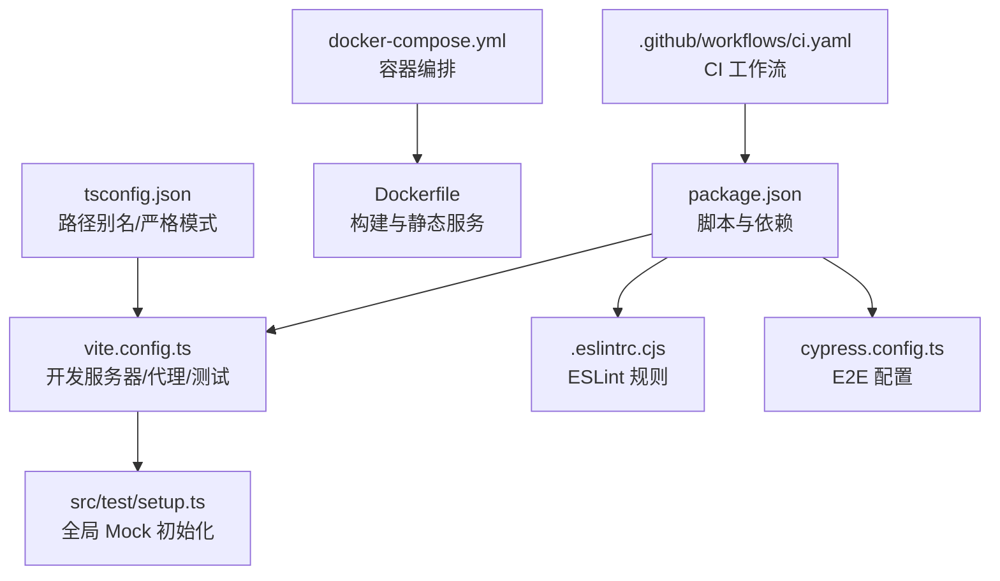
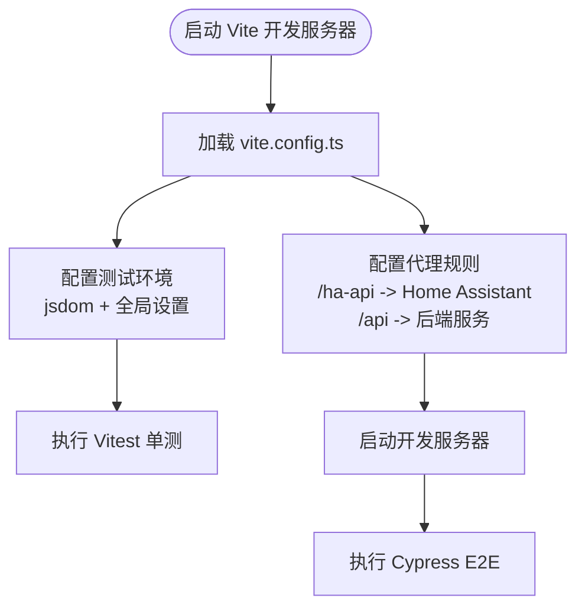
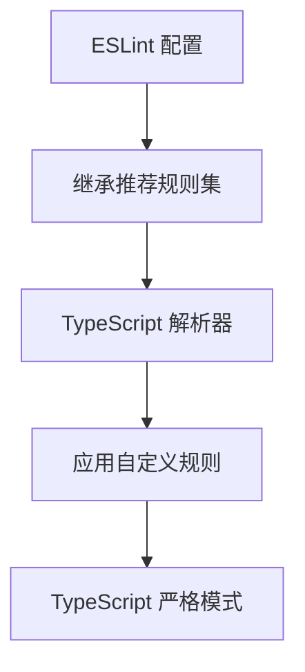
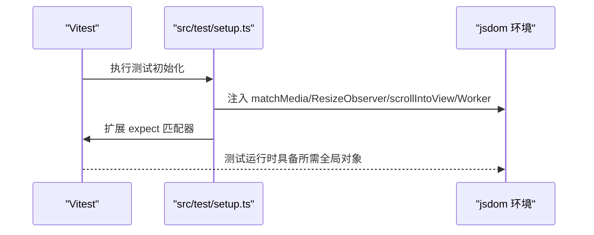
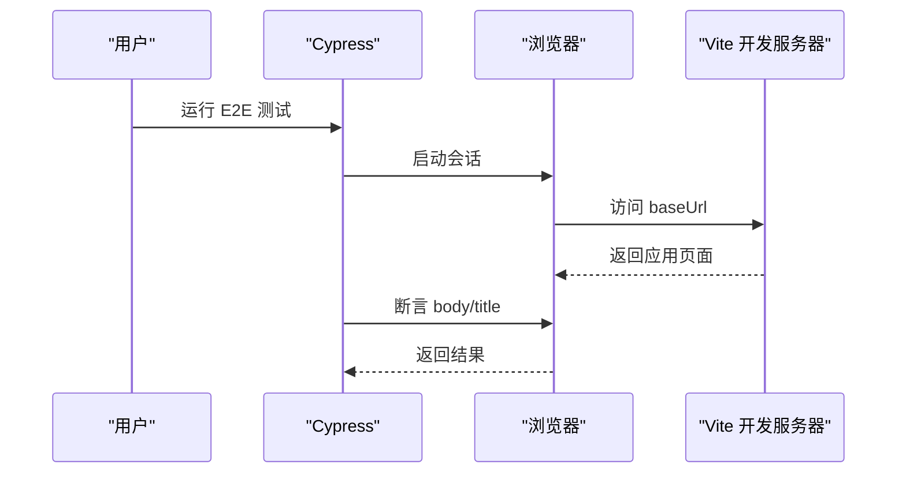
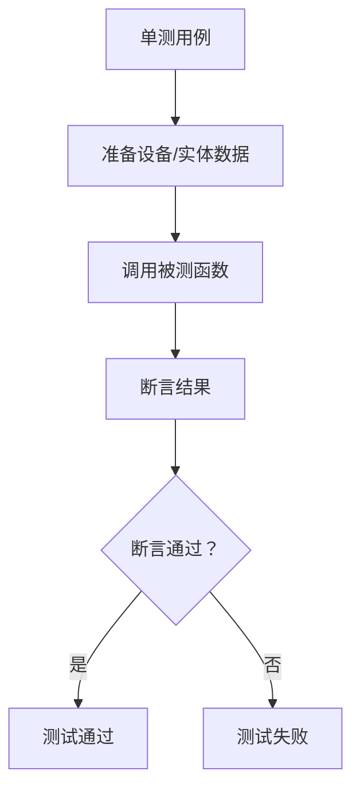
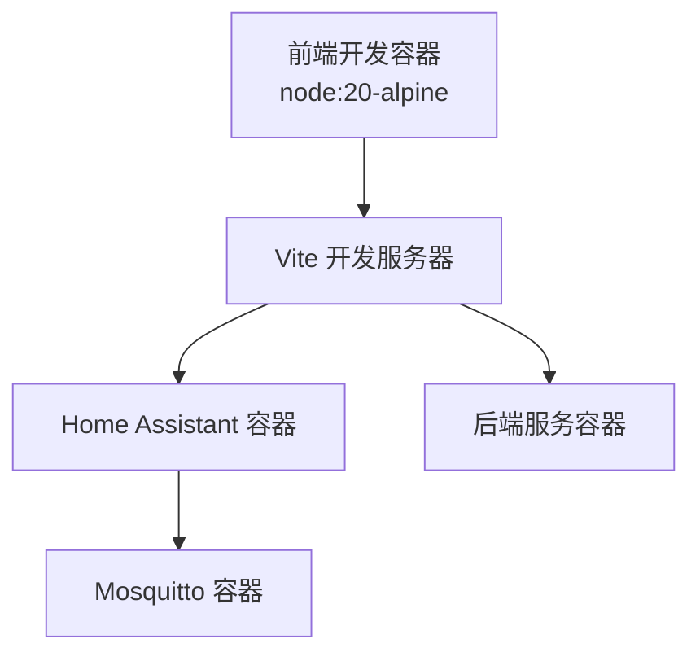
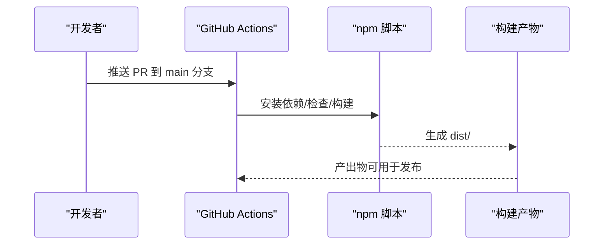
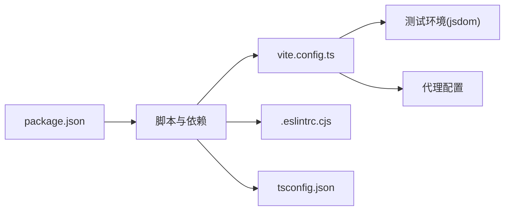

# 测试配置与环境

<cite>
**本文引用的文件**
- [package.json](file://package.json)
- [vite.config.ts](file://vite.config.ts)
- [.eslintrc.cjs](file://.eslintrc.cjs)
- [cypress.config.ts](file://cypress.config.ts)
- [src/test/setup.ts](file://src/test/setup.ts)
- [docker-compose.yml](file://docker-compose.yml)
- [Dockerfile](file://Dockerfile)
- [.github/workflows/ci.yaml](file://.github/workflows/ci.yaml)
- [tsconfig.json](file://tsconfig.json)
- [src/utils/__tests__/device-sync.light.test.ts](file://src/utils/__tests__/device-sync.light.test.ts)
- [cypress/e2e/home.cy.ts](file://cypress/e2e/home.cy.ts)
</cite>

## 目录
1. [简介](#简介)
2. [项目结构](#项目结构)
3. [核心组件](#核心组件)
4. [架构总览](#架构总览)
5. [详细组件分析](#详细组件分析)
6. [依赖分析](#依赖分析)
7. [性能考虑](#性能考虑)
8. [故障排查指南](#故障排查指南)
9. [结论](#结论)
10. [附录](#附录)

## 简介
本文件系统性梳理 HAUI 项目的测试配置与环境，覆盖以下主题：
- 测试工具链：Vitest 单元测试、Cypress E2E、ESLint 规则与类型检查
- 测试环境搭建：开发服务器、代理、容器化 Home Assistant/MQTT、前端本地开发
- Mock 策略：API Mock、组件 Mock、全局环境 Mock 的配置方法
- 覆盖率与报告：当前仓库未启用覆盖率与报告生成，建议的配置路径
- 日志管理：测试日志输出与调试技巧
- 部署与 CI/CD：Docker 构建、Nginx 静态服务、GitHub Actions 工作流
- 多环境配置：开发、测试、生产差异与最佳实践

## 项目结构
围绕测试与环境的关键文件分布如下：
- 包管理与脚本：定义构建、开发、测试、代码检查等命令
- Vite/Vitest 配置：开发服务器、代理、测试环境与全局设置
- ESLint 配置：推荐规则集与自定义规则
- Cypress 配置：E2E 基础地址与事件钩子
- 测试初始化：全局 Mock 与 DOM 补丁
- 容器编排：Home Assistant、Mosquitto、前端开发服务
- CI/CD：GitHub Actions 工作流
- TypeScript 配置：路径别名、严格模式与模块解析



**图表来源**
- [package.json:1-132](file://package.json#L1-L132)
- [vite.config.ts:1-53](file://vite.config.ts#L1-L53)
- [.eslintrc.cjs:1-19](file://.eslintrc.cjs#L1-L19)
- [cypress.config.ts:1-11](file://cypress.config.ts#L1-L11)
- [src/test/setup.ts:1-46](file://src/test/setup.ts#L1-L46)
- [docker-compose.yml:1-42](file://docker-compose.yml#L1-L42)
- [Dockerfile:1-37](file://Dockerfile#L1-L37)
- [.github/workflows/ci.yaml:1-29](file://.github/workflows/ci.yaml#L1-L29)
- [tsconfig.json:1-30](file://tsconfig.json#L1-L30)

**章节来源**
- [package.json:1-132](file://package.json#L1-L132)
- [vite.config.ts:1-53](file://vite.config.ts#L1-L53)
- [.eslintrc.cjs:1-19](file://.eslintrc.cjs#L1-L19)
- [cypress.config.ts:1-11](file://cypress.config.ts#L1-L11)
- [src/test/setup.ts:1-46](file://src/test/setup.ts#L1-L46)
- [docker-compose.yml:1-42](file://docker-compose.yml#L1-L42)
- [Dockerfile:1-37](file://Dockerfile#L1-L37)
- [.github/workflows/ci.yaml:1-29](file://.github/workflows/ci.yaml#L1-L29)
- [tsconfig.json:1-30](file://tsconfig.json#L1-L30)

## 核心组件
- 测试工具链
  - Vitest：单元测试框架，使用 jsdom 环境与全局设置文件
  - Cypress：端到端测试，基础地址指向本地开发服务器
  - ESLint：基于 TypeScript 与 React Hooks 推荐规则
- 开发与代理
  - Vite 开发服务器，支持代理到 Home Assistant 与后端 API
  - 容器化本地 Home Assistant 与 Mosquitto，前端通过环境变量连接
- Mock 与补丁
  - 全局 Mock：matchMedia、ResizeObserver、Element.scrollIntoView、Web Worker
  - 测试初始化脚本集中注入
- 类型与路径
  - TypeScript 路径别名与严格模式，确保测试与源码一致

**章节来源**
- [package.json:6-12](file://package.json#L6-L12)
- [vite.config.ts:31-51](file://vite.config.ts#L31-L51)
- [src/test/setup.ts:1-46](file://src/test/setup.ts#L1-L46)
- [tsconfig.json:23-26](file://tsconfig.json#L23-L26)

## 架构总览
下图展示测试相关组件在开发与 CI 中的交互关系。

```mermaid
graph TB
subgraph "本地开发"
Vite["Vite 开发服务器<br/>vite.config.ts"] --> ProxyHA["代理 /ha-api -> Home Assistant"]
Vite --> ProxyAPI["代理 /api -> 后端服务"]
Tests["Vitest/Cypress<br/>测试脚本"] --> Vite
end
subgraph "容器环境"
HA["Home Assistant 容器"] <- --> Vite
MQTT["Mosquitto 容器"] <- --> HA
end
subgraph "CI/CD"
GH["GitHub Actions<br/>.github/workflows/ci.yaml"] --> NPM["安装依赖/构建/检查"]
NPM --> Dist["构建产物 dist/"]
Dist --> Nginx["Nginx 静态服务<br/>Dockerfile"]
end
```

**图表来源**
- [vite.config.ts:31-45](file://vite.config.ts#L31-L45)
- [docker-compose.yml:3-42](file://docker-compose.yml#L3-L42)
- [.github/workflows/ci.yaml:7-29](file://.github/workflows/ci.yaml#L7-L29)
- [Dockerfile:16-36](file://Dockerfile#L16-L36)

## 详细组件分析

### Vite 测试配置与开发服务器
- 测试环境
  - 使用 jsdom 环境，启用全局断言与测试初始化脚本
  - 初始化脚本负责扩展匹配器与注入全局对象
- 开发服务器与代理
  - /ha-api 代理到 Home Assistant，默认从环境变量读取目标地址
  - /api 代理到本地后端服务，默认地址为 http://localhost:8099
  - 支持 WebSocket 代理与路径重写
- 路径别名与外部依赖
  - @ 指向 src 目录
  - 将 ezuikit-js 设为外部依赖，避免打包



**图表来源**
- [vite.config.ts:6-51](file://vite.config.ts#L6-L51)

**章节来源**
- [vite.config.ts:6-51](file://vite.config.ts#L6-L51)

### ESLint 规则与类型检查
- 规则集
  - 继承 eslint:recommended、TypeScript 推荐规则、React Hooks 推荐规则
  - 自定义忽略模式与解析器
- 关键规则
  - 关闭 react-refresh 仅导出组件限制
  - 关闭 react-hooks/exhaustive-deps
  - 关闭 @typescript-eslint/no-explicit-any 与 @typescript-eslint/no-unused-vars
- 类型检查
  - TypeScript 严格模式开启，路径别名与模块解析采用 bundler



**图表来源**
- [.eslintrc.cjs:1-19](file://.eslintrc.cjs#L1-L19)
- [tsconfig.json:17-26](file://tsconfig.json#L17-L26)

**章节来源**
- [.eslintrc.cjs:1-19](file://.eslintrc.cjs#L1-L19)
- [tsconfig.json:17-26](file://tsconfig.json#L17-L26)

### 测试初始化与全局 Mock
- 注入 jest-dom 匹配器，扩展 expect 断言能力
- 为 window.matchMedia 提供 Mock 实现，避免媒体查询报错
- 注入 ResizeObserver Mock，兼容部分 UI 组件
- 为 Element.prototype.scrollIntoView 提供 Mock
- 为 Web Worker 提供最小化 Mock 类，避免主线程阻塞
- 以上逻辑集中在 src/test/setup.ts，由 vite.test.setupFiles 引用



**图表来源**
- [src/test/setup.ts:1-46](file://src/test/setup.ts#L1-L46)
- [vite.config.ts:49](file://vite.config.ts#L49)

**章节来源**
- [src/test/setup.ts:1-46](file://src/test/setup.ts#L1-L46)
- [vite.config.ts:46-50](file://vite.config.ts#L46-L50)

### Cypress E2E 配置
- 基础地址指向本地开发服务器
- 可在 setupNodeEvents 中扩展 Node 端事件监听器
- 示例测试用例验证页面加载与标题存在性



**图表来源**
- [cypress.config.ts:3-10](file://cypress.config.ts#L3-L10)
- [cypress/e2e/home.cy.ts:1-10](file://cypress/e2e/home.cy.ts#L1-L10)

**章节来源**
- [cypress.config.ts:3-10](file://cypress.config.ts#L3-L10)
- [cypress/e2e/home.cy.ts:1-10](file://cypress/e2e/home.cy.ts#L1-L10)

### 单元测试示例与最佳实践
- 示例测试覆盖设备同步逻辑，验证灯光亮度与开关状态的同步行为
- 建议在单测中使用 Mock 与快照测试，减少对外部依赖的耦合



**图表来源**
- [src/utils/__tests__/device-sync.light.test.ts:1-75](file://src/utils/__tests__/device-sync.light.test.ts#L1-L75)

**章节来源**
- [src/utils/__tests__/device-sync.light.test.ts:1-75](file://src/utils/__tests__/device-sync.light.test.ts#L1-L75)

### 容器化测试环境与代理
- docker-compose 启动 Home Assistant、Mosquitto 与前端开发服务
- 前端开发服务通过环境变量 VITE_HA_URL 指向 Home Assistant 容器
- 开发服务器代理规则与容器内网络互通



**图表来源**
- [docker-compose.yml:27-42](file://docker-compose.yml#L27-L42)
- [vite.config.ts:32-44](file://vite.config.ts#L32-L44)

**章节来源**
- [docker-compose.yml:1-42](file://docker-compose.yml#L1-L42)
- [vite.config.ts:31-45](file://vite.config.ts#L31-L45)

### CI/CD 与构建流程
- GitHub Actions 工作流在 Ubuntu 最新环境中执行
- 步骤：检出代码、安装 Node.js 22、安装依赖、代码检查、构建
- 构建产物用于后续部署或发布



**图表来源**
- [.github/workflows/ci.yaml:7-29](file://.github/workflows/ci.yaml#L7-L29)

**章节来源**
- [.github/workflows/ci.yaml:1-29](file://.github/workflows/ci.yaml#L1-L29)

## 依赖分析
- 包管理与脚本
  - 定义了开发、构建、测试、代码检查等脚本
  - 开发脚本使用 Vite，测试脚本预留 Vitest 与 Cypress
- Vite 配置
  - 插件：React、TailwindCSS
  - 代理：/ha-api、/api
  - 测试：jsdom、全局设置文件
- ESLint 配置
  - 规则集与解析器
- TypeScript 配置
  - 路径别名、严格模式、模块解析



**图表来源**
- [package.json:6-12](file://package.json#L6-L12)
- [vite.config.ts:6-51](file://vite.config.ts#L6-L51)
- [.eslintrc.cjs:1-19](file://.eslintrc.cjs#L1-L19)
- [tsconfig.json:23-26](file://tsconfig.json#L23-L26)

**章节来源**
- [package.json:6-12](file://package.json#L6-L12)
- [vite.config.ts:6-51](file://vite.config.ts#L6-L51)
- [.eslintrc.cjs:1-19](file://.eslintrc.cjs#L1-L19)
- [tsconfig.json:23-26](file://tsconfig.json#L23-L26)

## 性能考虑
- 测试运行性能优化建议
  - 使用更小的测试数据集与精准的 Mock，减少渲染与 IO
  - 在 Vitest 中合理拆分测试文件，利用并发与缓存
  - 对于 E2E 测试，尽量复用登录状态与页面缓存，缩短等待时间
- 开发服务器代理
  - 代理目标应尽量靠近本地网络，减少跨域与证书校验开销
- 容器化测试
  - 使用只读卷与共享网络，避免不必要的文件拷贝与重启

## 故障排查指南
- 常见问题与定位
  - 代理失败：确认 VITE_HA_URL 与 /ha-api 代理目标可达；检查证书与变更源
  - 缺少全局对象：如 matchMedia、ResizeObserver、Worker，检查 src/test/setup.ts 是否正确加载
  - E2E 页面空白：确认 baseUrl 与开发服务器端口一致；检查路由与资源加载
  - ESLint 报错：根据规则集调整代码风格或在文件级别禁用特定规则
- 调试技巧
  - 在测试中打印关键变量与断言前后的状态
  - 使用浏览器开发者工具检查网络请求与控制台错误
  - 在 CI 中增加构建日志与产物上传以便回溯

**章节来源**
- [vite.config.ts:31-45](file://vite.config.ts#L31-L45)
- [src/test/setup.ts:1-46](file://src/test/setup.ts#L1-L46)
- [cypress.config.ts:3-10](file://cypress.config.ts#L3-L10)
- [.eslintrc.cjs:12-17](file://.eslintrc.cjs#L12-L17)

## 结论
本文件对 HAUI 项目的测试配置与环境进行了全面梳理，明确了：
- 测试工具链与配置要点（Vitest、Cypress、ESLint）
- 开发服务器、代理与容器化测试环境的搭建方式
- 全局 Mock 与测试初始化的最佳实践
- 当前仓库未启用测试覆盖率与报告生成，建议按需引入
- CI/CD 流程与多环境配置差异与最佳实践

## 附录

### 测试覆盖率与报告（建议）
- Vitest 覆盖率
  - 在 vite.config.ts 的 test 节点添加 coverage 配置项，选择合适的 reporter（如 lcov、html）
  - 配置忽略目录与文件，聚焦业务代码
- Cypress 报告
  - 在 cypress.config.ts 中配置 reporter 与 reporterOptions
  - 可结合插件生成 HTML 报告并在 CI 中归档
- 日志管理
  - Vitest 输出可通过命令行参数控制；Cypress 默认输出到 cypress/reporters
  - 建议在 CI 中统一收集与归档日志

**章节来源**
- [vite.config.ts:46-50](file://vite.config.ts#L46-L50)
- [cypress.config.ts:3-10](file://cypress.config.ts#L3-L10)

### 多环境配置差异与最佳实践
- 开发环境
  - 使用本地 Home Assistant 与后端服务代理
  - 启用热更新与源码映射，便于调试
- 测试环境
  - 使用 jsdom 与全局 Mock，隔离外部依赖
  - 通过环境变量切换代理目标，适配不同测试场景
- 生产环境
  - 构建产物由 Nginx 提供静态服务，Dockerfile 已内置
  - CI/CD 中完成构建与发布，确保一致性

**章节来源**
- [docker-compose.yml:37-41](file://docker-compose.yml#L37-L41)
- [Dockerfile:16-36](file://Dockerfile#L16-L36)
- [.github/workflows/ci.yaml:14-28](file://.github/workflows/ci.yaml#L14-L28)