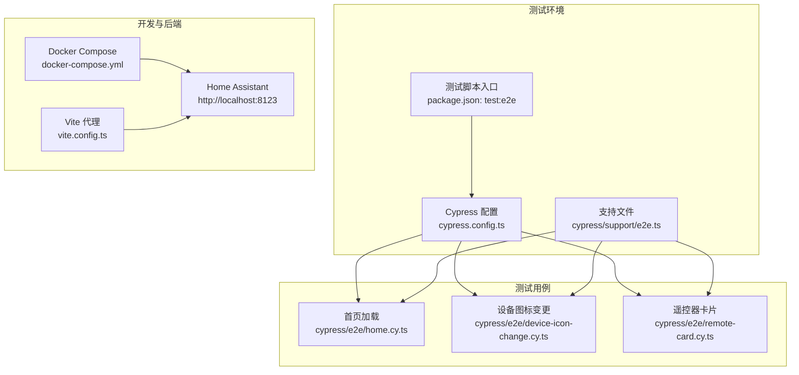
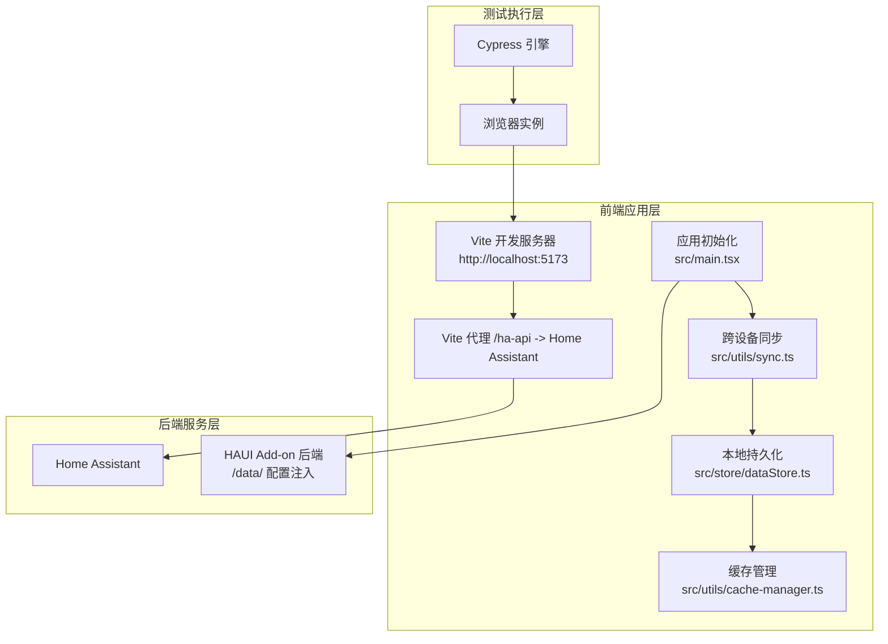
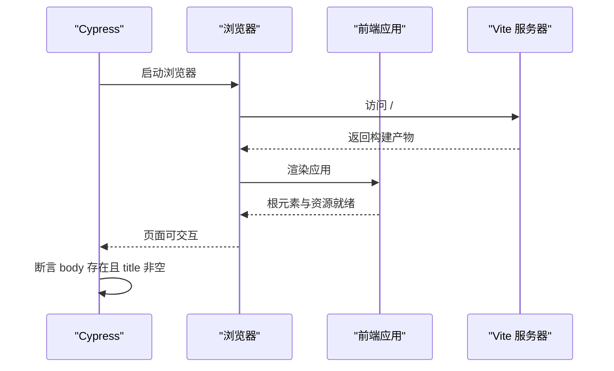
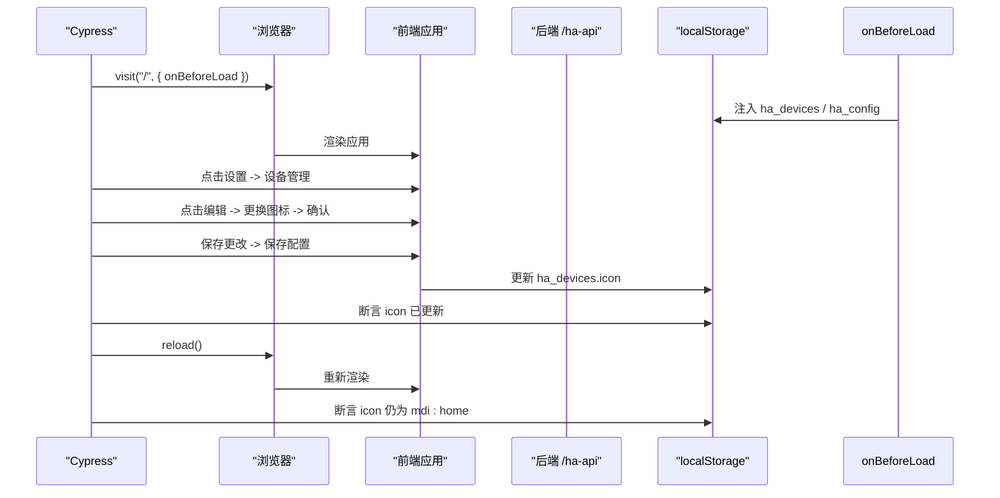
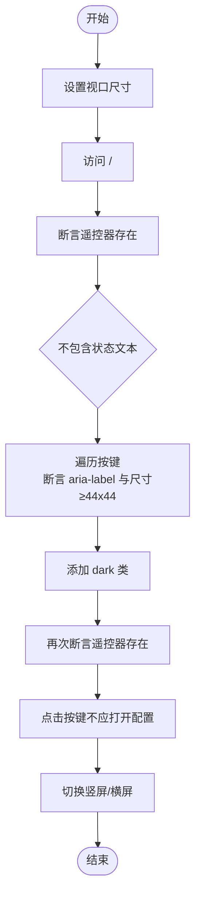
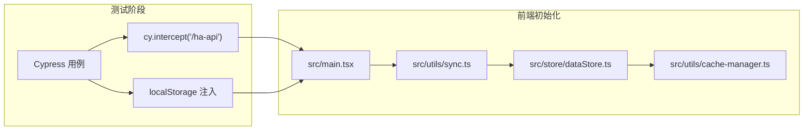

# 端到端测试

<cite>
**本文引用的文件**
- [cypress.config.ts](file://cypress.config.ts)
- [package.json](file://package.json)
- [README.md](file://README.md)
- [docker-compose.yml](file://docker-compose.yml)
- [cypress/e2e/home.cy.ts](file://cypress/e2e/home.cy.ts)
- [cypress/e2e/device-icon-change.cy.ts](file://cypress/e2e/device-icon-change.cy.ts)
- [cypress/e2e/remote-card.cy.ts](file://cypress/e2e/remote-card.cy.ts)
- [cypress/support/e2e.ts](file://cypress/support/e2e.ts)
- [.github/workflows/ci.yaml](file://.github/workflows/ci.yaml)
- [vite.config.ts](file://vite.config.ts)
- [src/main.tsx](file://src/main.tsx)
- [src/utils/sync.ts](file://src/utils/sync.ts)
- [src/store/dataStore.ts](file://src/store/dataStore.ts)
- [src/utils/cache-manager.ts](file://src/utils/cache-manager.ts)
- [src/hooks/useHomeAssistant.ts](file://src/hooks/useHomeAssistant.ts)
- [src/app/components/AiChatWidget.tsx](file://src/app/components/AiChatWidget.tsx)
- [src/app/components/dashboard/cards/CurtainControl.tsx](file://src/app/components/dashboard/cards/CurtainControl.tsx)
- [src/app/components/dashboard/DeviceCard.tsx](file://src/app/components/dashboard/DeviceCard.tsx)
</cite>

## 目录
1. [简介](#简介)
2. [项目结构](#项目结构)
3. [核心组件](#核心组件)
4. [架构总览](#架构总览)
5. [详细组件分析](#详细组件分析)
6. [依赖关系分析](#依赖关系分析)
7. [性能考量](#性能考量)
8. [故障排查指南](#故障排查指南)
9. [结论](#结论)
10. [附录](#附录)

## 简介
本文件面向 HAUI 项目的端到端测试，系统性阐述 Cypress 测试框架的配置、安装与使用方法，并结合现有测试用例，深入分析用户交互流程测试、设备控制流程测试与 AI 助手交互测试的实现策略。文档覆盖测试环境搭建、浏览器配置、网络请求拦截与断言技巧，同时给出页面导航、表单提交、实时数据更新与跨设备同步的测试要点与最佳实践。最后提供 CI/CD 集成建议与自动化执行方案。

## 项目结构
- 测试框架与入口
  - Cypress 配置位于 cypress.config.ts，指定基础 URL 为 http://localhost:5173。
  - 测试脚本通过 package.json 中的 test:e2e 调用 cypress run。
  - 测试支持文件位于 cypress/support/e2e.ts。
- 测试用例
  - cypress/e2e/home.cy.ts：应用加载与标题断言的基础用例。
  - cypress/e2e/device-icon-change.cy.ts：设备图标变更与持久化验证。
  - cypress/e2e/remote-card.cy.ts：遥控器卡片的响应式布局与无障碍契约测试。
- 开发与运行
  - 使用 docker-compose 启动 Home Assistant、Mosquitto 与前端开发服务，默认前端监听 5173 端口。
  - Vite 代理配置将 /ha-api 转发到 Home Assistant，便于测试期间访问真实后端。

图表来源
- [cypress.config.ts:1-11](file://cypress.config.ts#L1-L11)
- [cypress/support/e2e.ts:1-3](file://cypress/support/e2e.ts#L1-L3)
- [package.json:6-11](file://package.json#L6-L11)
- [docker-compose.yml:27-42](file://docker-compose.yml#L27-L42)
- [vite.config.ts:32-44](file://vite.config.ts#L32-L44)

章节来源
- [cypress.config.ts:1-11](file://cypress.config.ts#L1-L11)
- [package.json:6-11](file://package.json#L6-L11)
- [docker-compose.yml:27-42](file://docker-compose.yml#L27-L42)
- [vite.config.ts:32-44](file://vite.config.ts#L32-L44)

## 核心组件
- Cypress 配置与运行
  - 基础 URL 设为 http://localhost:5173，适配本地 Vite 开发服务器。
  - 通过 npm run test:e2e 执行 cypress run，实现无头模式下的自动化测试。
- 测试支持与断言
  - 支持文件为空，但可扩展自定义命令与断言。
  - 现有用例使用基本断言如元素存在、标题非空、本地存储值断言等。
- 测试用例类型
  - 页面加载与导航：home.cy.ts
  - 表单与设置流程：device-icon-change.cy.ts（拦截 /ha-api/api/states，注入 localStorage，断言保存与刷新后持久化）
  - 响应式与无障碍契约：remote-card.cy.ts（多 viewport、触摸目标尺寸、无障碍标签、暗色模式）

章节来源
- [cypress.config.ts:1-11](file://cypress.config.ts#L1-L11)
- [cypress/support/e2e.ts:1-3](file://cypress/support/e2e.ts#L1-L3)
- [cypress/e2e/home.cy.ts:1-10](file://cypress/e2e/home.cy.ts#L1-L10)
- [cypress/e2e/device-icon-change.cy.ts:1-67](file://cypress/e2e/device-icon-change.cy.ts#L1-L67)
- [cypress/e2e/remote-card.cy.ts:1-57](file://cypress/e2e/remote-card.cy.ts#L1-L57)

## 架构总览
下图展示了端到端测试在 HAUI 中的总体架构：Cypress 控制浏览器，访问本地前端（Vite），通过代理转发到 Home Assistant；测试通过 cy.intercept 拦截网络请求，注入本地存储模拟真实场景；跨设备同步由前端初始化时从后端拉取配置并在本地持久化，测试可验证其行为。

图表来源
- [vite.config.ts:32-44](file://vite.config.ts#L32-L44)
- [src/main.tsx:18-67](file://src/main.tsx#L18-L67)
- [src/utils/sync.ts:52-131](file://src/utils/sync.ts#L52-L131)
- [src/store/dataStore.ts:108-128](file://src/store/dataStore.ts#L108-L128)
- [src/utils/cache-manager.ts:1-56](file://src/utils/cache-manager.ts#L1-L56)

## 详细组件分析

### 页面加载与导航测试（home.cy.ts）
- 目标：验证应用可加载、根元素存在且标题非空。
- 关键点：直接访问根路径，断言 body 存在与 title 非空。
- 适用场景：回归测试、健康检查。

图表来源
- [cypress/e2e/home.cy.ts:1-10](file://cypress/e2e/home.cy.ts#L1-L10)

章节来源
- [cypress/e2e/home.cy.ts:1-10](file://cypress/e2e/home.cy.ts#L1-L10)

### 设备图标变更与持久化测试（device-icon-change.cy.ts）
- 目标：验证设备图标选择、保存与刷新后持久化。
- 关键点：
  - 使用 cy.intercept 拦截 /ha-api/api/states，返回测试状态。
  - 在 onBeforeLoad 中向 localStorage 注入设备与配置信息（含 token）。
  - 通过点击“打开系统设置”->“设备管理”->“编辑”->“更换图标”->“确认”，保存配置。
  - 断言本地存储中图标字段更新，并通过 reload 验证刷新后仍保持。
- 适用场景：设置面板、本地存储与持久化验证。

图表来源
- [cypress/e2e/device-icon-change.cy.ts:19-34](file://cypress/e2e/device-icon-change.cy.ts#L19-L34)
- [cypress/e2e/device-icon-change.cy.ts:36-65](file://cypress/e2e/device-icon-change.cy.ts#L36-L65)

章节来源
- [cypress/e2e/device-icon-change.cy.ts:1-67](file://cypress/e2e/device-icon-change.cy.ts#L1-L67)

### 遥控器卡片响应式与无障碍契约（remote-card.cy.ts）
- 目标：验证遥控器卡片在不同视口下的布局、触摸目标尺寸、无障碍标签与暗色模式。
- 关键点：
  - 遍历多种 viewport（wear/phone/tablet/tv），断言遥控器文案存在且不显示状态文本。
  - 断言每个按键具备 aria-label，且尺寸至少 44x44。
  - 切换 html 的 dark 类，验证布局不被破坏。
  - 点击按键不应打开配置模态框。
  - 支持竖屏与横屏布局一致性。

图表来源
- [cypress/e2e/remote-card.cy.ts:9-30](file://cypress/e2e/remote-card.cy.ts#L9-L30)
- [cypress/e2e/remote-card.cy.ts:32-47](file://cypress/e2e/remote-card.cy.ts#L32-L47)
- [cypress/e2e/remote-card.cy.ts:49-55](file://cypress/e2e/remote-card.cy.ts#L49-L55)

章节来源
- [cypress/e2e/remote-card.cy.ts:1-57](file://cypress/e2e/remote-card.cy.ts#L1-L57)

### AI 助手交互测试策略（概念性说明）
- 测试目标：验证 AI 聊天组件在不同设备形态下的 UI 呈现、语音状态指示、消息列表渲染与 TTS 朗读。
- 实施要点（基于源码行为推导）：
  - 使用 useAiChat Hook 获取消息、输入值、加载状态与发送函数；在测试中通过 mock 替换。
  - 使用 useSpeechRecognition 与 useSpeechSynthesis 控制语音输入与输出；在测试中 mock。
  - 通过 data-testid 标注关键元素（触发按钮、容器、设置面板等）进行交互与断言。
  - 验证移动端全屏浮窗与桌面端居中窗口的样式差异。
  - 验证欢迎消息、标题栏与加载指示器的出现时机。
- 适用场景：组件级交互与 UI 契约测试（可参考 AiChatWidget.test.tsx 的思路迁移至 Cypress）。

章节来源
- [src/app/components/AiChatWidget.tsx:1-200](file://src/app/components/AiChatWidget.tsx#L1-L200)

### 设备控制流程测试策略（概念性说明）
- 测试目标：验证灯光、窗帘、空调等设备卡片的控制交互与乐观 UI 更新。
- 实施要点（基于源码行为推导）：
  - 灯光控制：DeviceCard 根据设备类型渲染 LightControl；测试中模拟状态切换与亮度变化。
  - 窗帘控制：CurtainControl 维护本地位置状态与拖拽状态，支持乐观更新与防抖提交。
  - 空调控制：ClimateControl 通过设备属性与更新回调实现温度与模式切换。
- 适用场景：设备卡片的交互与状态一致性测试。

章节来源
- [src/app/components/dashboard/DeviceCard.tsx:74-114](file://src/app/components/dashboard/DeviceCard.tsx#L74-L114)
- [src/app/components/dashboard/cards/CurtainControl.tsx:1-35](file://src/app/components/dashboard/cards/CurtainControl.tsx#L1-L35)

## 依赖关系分析
- 测试与前端应用的耦合
  - 测试通过 cy.intercept 拦截 /ha-api，避免真实 HA 依赖，提升稳定性与可控性。
  - 通过 onBeforeLoad 注入 localStorage，模拟真实用户配置与设备数据。
- 跨设备同步与持久化
  - 应用初始化时从 Add-on 后端拉取配置并写入 localStorage；随后通过 dataStore 的持久化与 sync.ts 的主动/被动同步机制保障跨设备一致。
  - CacheManager 提供 TTL 缓存，减少重复读取。

图表来源
- [src/main.tsx:18-67](file://src/main.tsx#L18-L67)
- [src/utils/sync.ts:52-131](file://src/utils/sync.ts#L52-L131)
- [src/store/dataStore.ts:108-128](file://src/store/dataStore.ts#L108-L128)
- [src/utils/cache-manager.ts:1-56](file://src/utils/cache-manager.ts#L1-L56)

章节来源
- [src/main.tsx:18-67](file://src/main.tsx#L18-L67)
- [src/utils/sync.ts:52-131](file://src/utils/sync.ts#L52-L131)
- [src/store/dataStore.ts:108-128](file://src/store/dataStore.ts#L108-L128)
- [src/utils/cache-manager.ts:1-56](file://src/utils/cache-manager.ts#L1-L56)

## 性能考量
- 测试执行性能
  - 使用 cypress run 无头模式，避免图形界面开销；合理拆分用例，减少不必要的等待。
  - 在 cy.intercept 中返回最小必要数据，缩短请求耗时。
- 应用侧性能
  - Vite 代理与本地开发服务器响应迅速；避免在测试中引入重型计算或阻塞主线程的操作。
  - 跨设备同步采用防抖与增量对齐，测试中可通过控制触发频率验证一致性。

## 故障排查指南
- 测试无法访问本地前端
  - 确认 docker-compose 已启动前端服务并监听 5173 端口；检查 cypress.config.ts 的 baseUrl。
- 无法连接 Home Assistant
  - 确认 Vite 代理 /ha-api 正确指向 HA；检查环境变量 VITE_HA_URL。
- 用例间状态污染
  - 使用 cy.session 或在 before/after 中清理 localStorage；避免共享状态影响。
- 跨设备同步未生效
  - 检查 Add-on 后端是否可用；确认 localStorage 写入后触发 syncToServer；验证同步时间戳更新。
- CI 环境问题
  - 参考 CI 工作流，确保安装 Node.js 22、依赖与构建步骤正确执行。

章节来源
- [docker-compose.yml:27-42](file://docker-compose.yml#L27-L42)
- [vite.config.ts:32-44](file://vite.config.ts#L32-L44)
- [cypress.config.ts:4-6](file://cypress.config.ts#L4-L6)
- [.github/workflows/ci.yaml:14-28](file://.github/workflows/ci.yaml#L14-L28)

## 结论
HAUI 的端到端测试以 Cypress 为核心，结合 Vite 代理与本地存储注入，实现了对页面加载、设置流程与响应式布局的稳定覆盖。通过拦截网络请求与持久化验证，测试能够在可控环境中高效执行。建议在现有基础上扩展 AI 助手与设备控制的交互测试，并完善 CI 中的测试报告与截图归档，以进一步提升质量保障能力。

## 附录

### 测试环境搭建与运行
- 启动后端与前端
  - 使用 docker-compose 启动 Home Assistant、Mosquitto 与前端开发服务。
  - 前端默认监听 5173，Cypress 配置已指向该地址。
- 运行测试
  - 在项目根目录执行 npm run test:e2e，Cypress 将自动启动并执行所有 e2e 用例。

章节来源
- [README.md:29-35](file://README.md#L29-L35)
- [docker-compose.yml:27-42](file://docker-compose.yml#L27-L42)
- [cypress.config.ts:4-6](file://cypress.config.ts#L4-L6)
- [package.json:9-10](file://package.json#L9-L10)

### 浏览器配置与网络请求拦截
- 浏览器
  - Cypress 默认使用 Electron；如需特定浏览器，可在配置中扩展。
- 网络拦截
  - 使用 cy.intercept 拦截 /ha-api/*，注入测试数据；在 device-icon-change 用例中演示了拦截与 onBeforeLoad 注入。
- 代理
  - Vite 代理将 /ha-api 转发到 Home Assistant，便于测试访问真实后端。

章节来源
- [cypress/e2e/device-icon-change.cy.ts:19-34](file://cypress/e2e/device-icon-change.cy.ts#L19-L34)
- [vite.config.ts:32-44](file://vite.config.ts#L32-L44)

### 页面导航、表单提交与实时数据更新
- 页面导航
  - 通过 cy.visit('/') 与点击菜单项进入设置与设备管理页面。
- 表单提交
  - 点击“更换图标”、“确认”、“保存更改”、“保存配置”，断言本地存储更新。
- 实时数据更新
  - 通过 cy.intercept 返回状态数据，验证 UI 即时反映；结合 useHomeAssistant 的心跳与延迟检测，可扩展实时性验证。

章节来源
- [cypress/e2e/device-icon-change.cy.ts:36-49](file://cypress/e2e/device-icon-change.cy.ts#L36-L49)
- [src/hooks/useHomeAssistant.ts:37-79](file://src/hooks/useHomeAssistant.ts#L37-L79)

### 跨设备同步测试
- 初始化同步
  - 应用启动时从 Add-on 后端拉取配置并写入 localStorage。
- 主动同步
  - dataStore 的持久化与 syncToServer 主动上传；syncFromServer 主动拉取并增量对齐。
- 测试要点
  - 断言 localStorage 中的同步时间戳更新；验证刷新后配置一致。

章节来源
- [src/main.tsx:18-67](file://src/main.tsx#L18-L67)
- [src/store/dataStore.ts:108-128](file://src/store/dataStore.ts#L108-L128)
- [src/utils/sync.ts:52-131](file://src/utils/sync.ts#L52-L131)

### CI/CD 集成与自动化执行
- 当前 CI
  - GitHub Actions 工作流包含安装 Node.js、安装依赖、代码检查与构建步骤。
- 建议扩展
  - 在 CI 中加入 npm run test:e2e 步骤，确保测试在无头环境执行。
  - 配置测试报告与截图归档，便于问题定位与回归追踪。

章节来源
- [.github/workflows/ci.yaml:14-28](file://.github/workflows/ci.yaml#L14-L28)