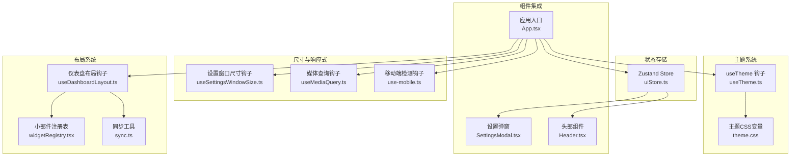
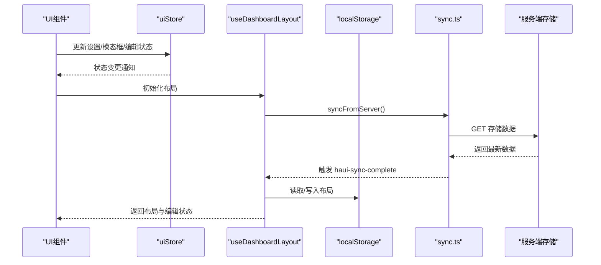
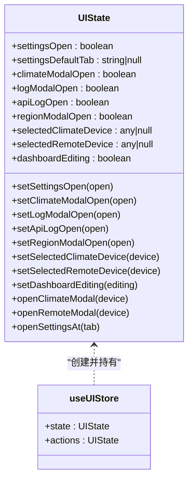
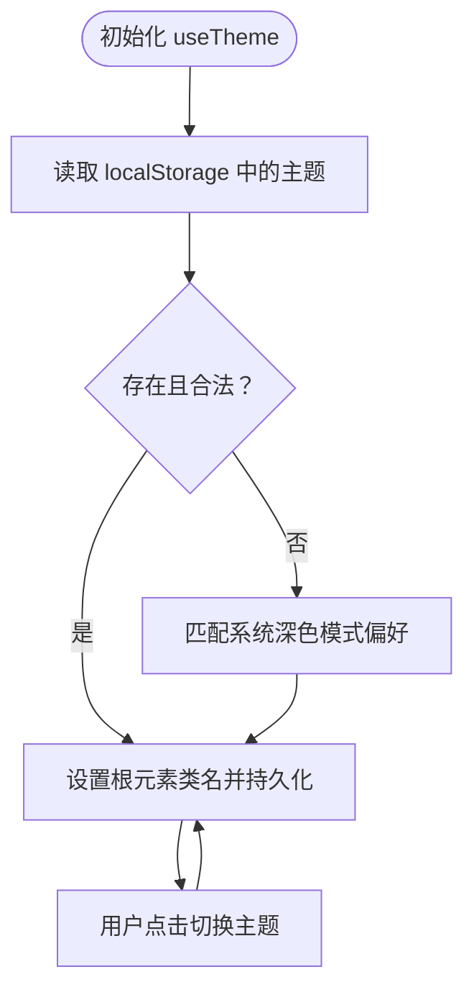
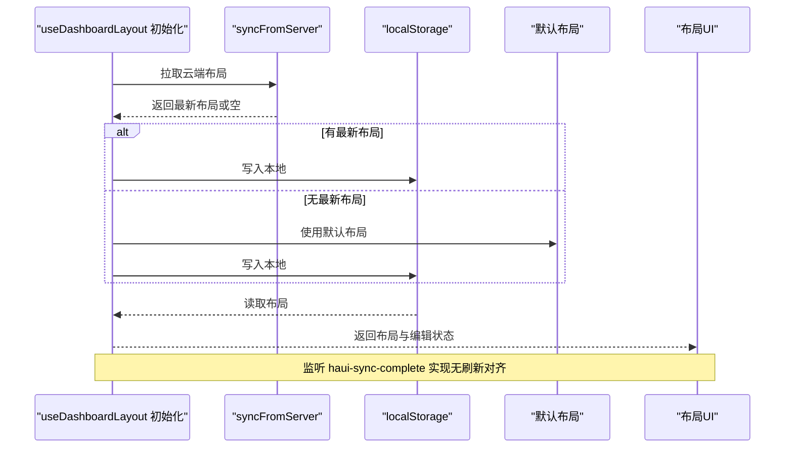
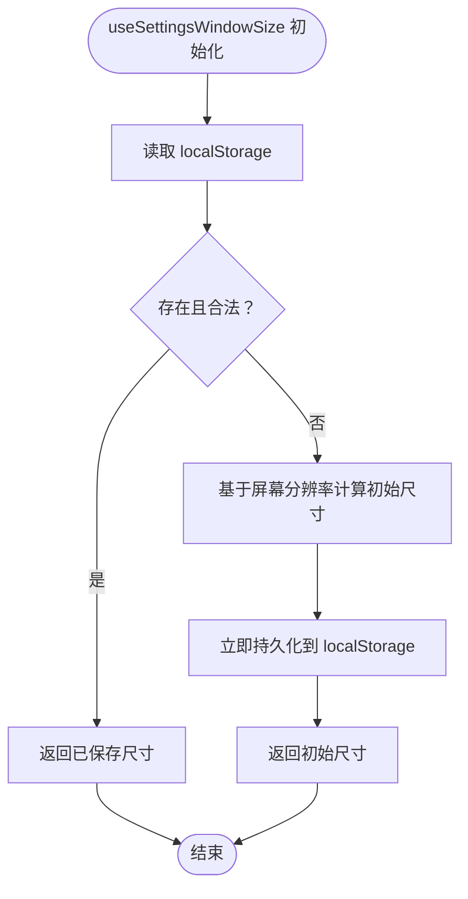
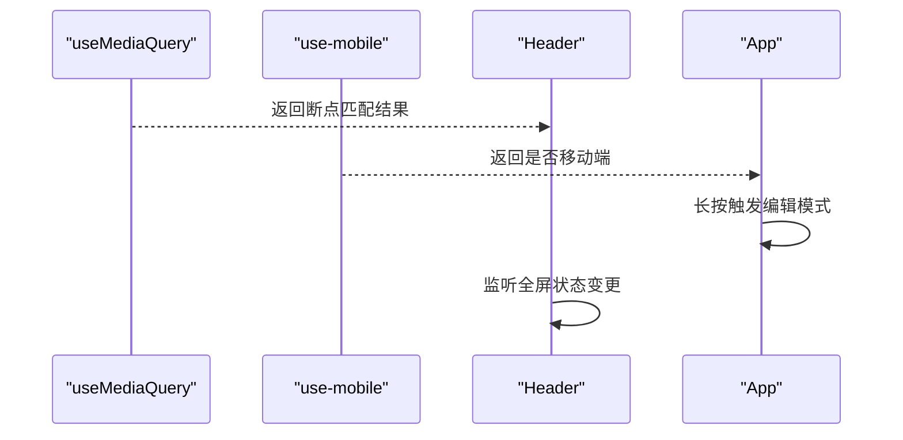
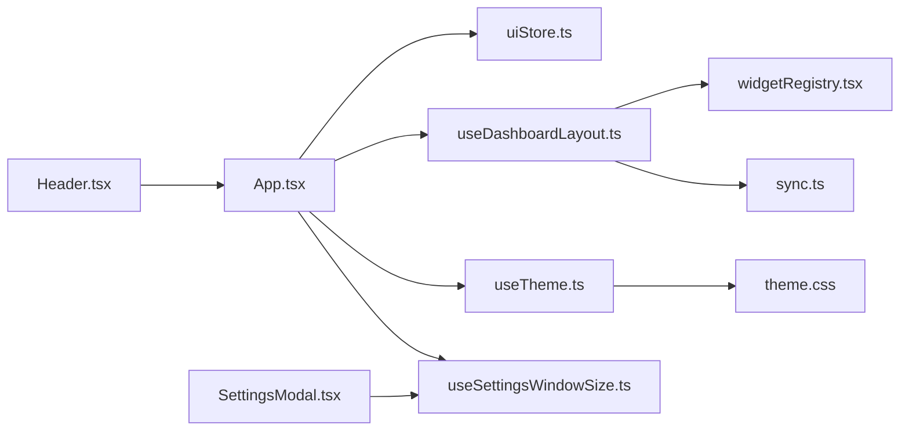

# UI状态管理

<cite>
**本文引用的文件**
- [uiStore.ts](file://src/store/uiStore.ts)
- [useTheme.ts](file://src/hooks/useTheme.ts)
- [useDashboardLayout.ts](file://src/hooks/useDashboardLayout.ts)
- [useSettingsWindowSize.ts](file://src/hooks/useSettingsWindowSize.ts)
- [useMediaQuery.ts](file://src/hooks/useMediaQuery.ts)
- [use-mobile.ts](file://src/app/components/ui/use-mobile.ts)
- [theme.css](file://src/styles/theme.css)
- [widgetRegistry.tsx](file://src/app/components/dashboard/widgetRegistry.tsx)
- [SettingsModal.tsx](file://src/app/components/SettingsModal.tsx)
- [Header.tsx](file://src/app/components/dashboard/Header.tsx)
- [App.tsx](file://src/app/App.tsx)
- [sync.ts](file://src/utils/sync.ts)
- [cn.ts](file://src/app/components/ui/utils.ts)
</cite>

## 目录
1. [简介](#简介)
2. [项目结构](#项目结构)
3. [核心组件](#核心组件)
4. [架构总览](#架构总览)
5. [详细组件分析](#详细组件分析)
6. [依赖关系分析](#依赖关系分析)
7. [性能考量](#性能考量)
8. [故障排查指南](#故障排查指南)
9. [结论](#结论)
10. [附录](#附录)

## 简介
本文件面向HAUI的UI状态管理模块，系统性阐述uiStore的设计理念、状态组织结构与更新机制，覆盖主题切换、布局管理、窗口尺寸控制等UI相关状态，并说明这些状态如何与用户交互（界面显示模式、响应式布局、用户体验优化）相结合。同时，文档涵盖UI状态的持久化配置、主题系统集成、跨组件状态共享机制，以及状态更新触发条件、同步策略与性能影响分析，并提供调试技巧、常见问题排查与扩展开发建议。

## 项目结构
UI状态管理涉及以下关键文件与职责划分：
- 状态存储层：uiStore（Zustand）集中管理弹窗与编辑状态
- 主题系统：useTheme钩子与CSS变量主题文件协同
- 布局系统：useDashboardLayout钩子负责仪表盘布局的读取、保存与同步
- 响应式与尺寸：useMediaQuery、use-mobile、useSettingsWindowSize
- 组件集成：App、SettingsModal、Header等组件消费与驱动UI状态
- 同步机制：sync工具实现localStorage与服务端的双向对齐

图表来源
- [uiStore.ts:1-55](file://src/store/uiStore.ts#L1-L55)
- [useTheme.ts:1-26](file://src/hooks/useTheme.ts#L1-L26)
- [useDashboardLayout.ts:1-125](file://src/hooks/useDashboardLayout.ts#L1-L125)
- [useSettingsWindowSize.ts:1-57](file://src/hooks/useSettingsWindowSize.ts#L1-L57)
- [useMediaQuery.ts:1-19](file://src/hooks/useMediaQuery.ts#L1-L19)
- [use-mobile.ts:1-22](file://src/app/components/ui/use-mobile.ts#L1-L22)
- [theme.css:1-207](file://src/styles/theme.css#L1-L207)
- [widgetRegistry.tsx:1-105](file://src/app/components/dashboard/widgetRegistry.tsx#L1-L105)
- [SettingsModal.tsx:1-200](file://src/app/components/SettingsModal.tsx#L1-L200)
- [Header.tsx:1-157](file://src/app/components/dashboard/Header.tsx#L1-L157)
- [App.tsx:1-200](file://src/app/App.tsx#L1-L200)
- [sync.ts:1-161](file://src/utils/sync.ts#L1-L161)

章节来源
- [uiStore.ts:1-55](file://src/store/uiStore.ts#L1-L55)
- [useTheme.ts:1-26](file://src/hooks/useTheme.ts#L1-L26)
- [useDashboardLayout.ts:1-125](file://src/hooks/useDashboardLayout.ts#L1-L125)
- [useSettingsWindowSize.ts:1-57](file://src/hooks/useSettingsWindowSize.ts#L1-L57)
- [useMediaQuery.ts:1-19](file://src/hooks/useMediaQuery.ts#L1-L19)
- [use-mobile.ts:1-22](file://src/app/components/ui/use-mobile.ts#L1-L22)
- [theme.css:1-207](file://src/styles/theme.css#L1-L207)
- [widgetRegistry.tsx:1-105](file://src/app/components/dashboard/widgetRegistry.tsx#L1-L105)
- [SettingsModal.tsx:1-200](file://src/app/components/SettingsModal.tsx#L1-L200)
- [Header.tsx:1-157](file://src/app/components/dashboard/Header.tsx#L1-L157)
- [App.tsx:1-200](file://src/app/App.tsx#L1-L200)
- [sync.ts:1-161](file://src/utils/sync.ts#L1-L161)

## 核心组件
- uiStore（Zustand）
  - 管理设置弹窗开关、默认打开标签页、各类模态框开关、选中的设备信息、仪表盘编辑状态等
  - 提供便捷的“打开某模态框并附带数据”和“打开设置并跳转到指定Tab”的动作
- 主题系统（useTheme + theme.css）
  - 通过localStorage记忆主题偏好，监听系统深色模式偏好，动态切换根元素类名并持久化
- 布局系统（useDashboardLayout + widgetRegistry + sync）
  - 仪表盘布局的初始化、本地持久化、云端同步对齐、编辑模式切换、小部件增删改移动
- 尺寸与响应式（useSettingsWindowSize + useMediaQuery + use-mobile）
  - 设置弹窗初始尺寸锁定与持久化；媒体查询与移动端断点检测

章节来源
- [uiStore.ts:1-55](file://src/store/uiStore.ts#L1-L55)
- [useTheme.ts:1-26](file://src/hooks/useTheme.ts#L1-L26)
- [useDashboardLayout.ts:1-125](file://src/hooks/useDashboardLayout.ts#L1-L125)
- [useSettingsWindowSize.ts:1-57](file://src/hooks/useSettingsWindowSize.ts#L1-L57)
- [useMediaQuery.ts:1-19](file://src/hooks/useMediaQuery.ts#L1-L19)
- [use-mobile.ts:1-22](file://src/app/components/ui/use-mobile.ts#L1-L22)
- [theme.css:1-207](file://src/styles/theme.css#L1-L207)
- [widgetRegistry.tsx:1-105](file://src/app/components/dashboard/widgetRegistry.tsx#L1-L105)
- [sync.ts:1-161](file://src/utils/sync.ts#L1-L161)

## 架构总览
UI状态管理采用“状态集中 + 钩子解耦 + 组件消费”的分层设计：
- uiStore作为单一真相源，承载UI层面的轻量状态
- useDashboardLayout将布局状态与持久化、云端同步解耦，通过事件驱动实现无刷新对齐
- useTheme将主题偏好与DOM根类名绑定，配合CSS变量实现主题切换
- useSettingsWindowSize为设置弹窗提供稳定初始尺寸，避免频繁resize带来的闪烁与布局抖动
- App作为顶层容器，聚合状态并驱动多个UI组件

图表来源
- [App.tsx:83-114](file://src/app/App.tsx#L83-L114)
- [uiStore.ts:31-54](file://src/store/uiStore.ts#L31-L54)
- [useDashboardLayout.ts:27-74](file://src/hooks/useDashboardLayout.ts#L27-L74)
- [sync.ts:98-131](file://src/utils/sync.ts#L98-L131)

## 详细组件分析

### uiStore：UI状态中心
- 设计理念
  - 聚合UI层面的轻量状态，避免在各组件内分散维护
  - 通过动作函数封装状态更新，统一入口便于调试与追踪
- 状态字段
  - 弹窗与面板：设置弹窗开关、默认Tab、气候/日志/API/区域模态框开关
  - 选中设备：当前选中的空调/遥控设备
  - 编辑模式：仪表盘编辑开关
- 动作函数
  - 单一字段更新与组合更新
  - 便捷动作：打开某模态框并附带数据、打开设置并跳转到指定Tab
- 与组件的集成
  - App中解构使用，长按触发仪表盘编辑模式
  - SettingsModal根据设置弹窗状态与默认Tab进行初始激活

图表来源
- [uiStore.ts:3-29](file://src/store/uiStore.ts#L3-L29)
- [uiStore.ts:31-54](file://src/store/uiStore.ts#L31-L54)

章节来源
- [uiStore.ts:1-55](file://src/store/uiStore.ts#L1-L55)
- [App.tsx:86-97](file://src/app/App.tsx#L86-L97)
- [SettingsModal.tsx:33-90](file://src/app/components/SettingsModal.tsx#L33-L90)

### 主题系统：useTheme与CSS变量
- 主题偏好来源
  - 优先读取localStorage；若不存在则遵循系统深色模式偏好
- DOM与持久化
  - 切换时移除/添加根元素类名，同时写入localStorage
- CSS变量主题
  - theme.css定义大量CSS变量，dark伪变体覆盖明暗差异
  - 通过Tailwind与CSS变量联动，确保组件样式随主题变化

图表来源
- [useTheme.ts:3-24](file://src/hooks/useTheme.ts#L3-L24)
- [theme.css:1-207](file://src/styles/theme.css#L1-L207)

章节来源
- [useTheme.ts:1-26](file://src/hooks/useTheme.ts#L1-L26)
- [theme.css:1-207](file://src/styles/theme.css#L1-L207)

### 布局系统：仪表盘布局与云端同步
- 初始化流程
  - 优先从服务端同步最新布局，再读取本地持久化布局，最后回退到默认布局
- 本地持久化
  - 以localStorage键值存储布局数组，支持增删改移动操作
- 云端同步
  - 通过自定义事件haui-sync-complete实现无刷新对齐
  - sync.ts提供getApiUrl、getStorageUrl、fetchWithTimeout、syncToServer、syncFromServer、initAutoSync等能力
- 小部件注册表
  - widgetRegistry定义小部件元数据与网格类名映射，支撑布局渲染

图表来源
- [useDashboardLayout.ts:27-74](file://src/hooks/useDashboardLayout.ts#L27-L74)
- [sync.ts:98-131](file://src/utils/sync.ts#L98-L131)
- [widgetRegistry.tsx:79-104](file://src/app/components/dashboard/widgetRegistry.tsx#L79-L104)

章节来源
- [useDashboardLayout.ts:1-125](file://src/hooks/useDashboardLayout.ts#L1-L125)
- [sync.ts:1-161](file://src/utils/sync.ts#L1-L161)
- [widgetRegistry.tsx:1-105](file://src/app/components/dashboard/widgetRegistry.tsx#L1-L105)

### 窗口尺寸控制：设置弹窗尺寸策略
- 初始尺寸确定
  - 优先从localStorage读取；若不存在则基于屏幕分辨率计算初始值并立即持久化
- 锁定策略
  - 不监听浏览器resize事件，避免尺寸抖动与布局不稳定
- 组件应用
  - SettingsModal根据useSettingsWindowSize返回的宽度与高度设置容器尺寸

图表来源
- [useSettingsWindowSize.ts:12-49](file://src/hooks/useSettingsWindowSize.ts#L12-L49)
- [SettingsModal.tsx:33-34](file://src/app/components/SettingsModal.tsx#L33-L34)

章节来源
- [useSettingsWindowSize.ts:1-57](file://src/hooks/useSettingsWindowSize.ts#L1-L57)
- [SettingsModal.tsx:1-200](file://src/app/components/SettingsModal.tsx#L1-L200)

### 响应式布局与界面显示模式
- 媒体查询与移动端检测
  - useMediaQuery提供通用媒体查询监听
  - use-mobile提供移动端断点检测
- 界面显示模式
  - Header组件根据全屏状态切换图标与提示
  - App中长按触发仪表盘编辑模式，体现不同显示模式下的交互差异

图表来源
- [useMediaQuery.ts:3-18](file://src/hooks/useMediaQuery.ts#L3-L18)
- [use-mobile.ts:5-20](file://src/app/components/ui/use-mobile.ts#L5-L20)
- [Header.tsx:20-42](file://src/app/components/dashboard/Header.tsx#L20-L42)
- [App.tsx:103-114](file://src/app/App.tsx#L103-L114)

章节来源
- [useMediaQuery.ts:1-19](file://src/hooks/useMediaQuery.ts#L1-L19)
- [use-mobile.ts:1-22](file://src/app/components/ui/use-mobile.ts#L1-L22)
- [Header.tsx:1-157](file://src/app/components/dashboard/Header.tsx#L1-L157)
- [App.tsx:1-200](file://src/app/App.tsx#L1-L200)

## 依赖关系分析
- 组件与状态
  - App依赖uiStore提供的状态与动作，驱动设置弹窗、模态框与编辑模式
  - SettingsModal依赖useSettingsWindowSize控制尺寸
  - Header依赖全屏状态与连接状态
- 布局与同步
  - useDashboardLayout依赖widgetRegistry与sync工具
  - sync工具提供云端存储接口与自动对齐逻辑
- 主题与样式
  - useTheme与theme.css形成主题链路，cn工具用于类名合并

图表来源
- [App.tsx:1-200](file://src/app/App.tsx#L1-L200)
- [uiStore.ts:1-55](file://src/store/uiStore.ts#L1-L55)
- [useDashboardLayout.ts:1-125](file://src/hooks/useDashboardLayout.ts#L1-L125)
- [useTheme.ts:1-26](file://src/hooks/useTheme.ts#L1-L26)
- [useSettingsWindowSize.ts:1-57](file://src/hooks/useSettingsWindowSize.ts#L1-L57)
- [widgetRegistry.tsx:1-105](file://src/app/components/dashboard/widgetRegistry.tsx#L1-L105)
- [sync.ts:1-161](file://src/utils/sync.ts#L1-L161)
- [theme.css:1-207](file://src/styles/theme.css#L1-L207)
- [SettingsModal.tsx:1-200](file://src/app/components/SettingsModal.tsx#L1-L200)
- [Header.tsx:1-157](file://src/app/components/dashboard/Header.tsx#L1-L157)

章节来源
- [App.tsx:1-200](file://src/app/App.tsx#L1-L200)
- [uiStore.ts:1-55](file://src/store/uiStore.ts#L1-L55)
- [useDashboardLayout.ts:1-125](file://src/hooks/useDashboardLayout.ts#L1-L125)
- [useTheme.ts:1-26](file://src/hooks/useTheme.ts#L1-L26)
- [useSettingsWindowSize.ts:1-57](file://src/hooks/useSettingsWindowSize.ts#L1-L57)
- [widgetRegistry.tsx:1-105](file://src/app/components/dashboard/widgetRegistry.tsx#L1-L105)
- [sync.ts:1-161](file://src/utils/sync.ts#L1-L161)
- [theme.css:1-207](file://src/styles/theme.css#L1-L207)
- [SettingsModal.tsx:1-200](file://src/app/components/SettingsModal.tsx#L1-L200)
- [Header.tsx:1-157](file://src/app/components/dashboard/Header.tsx#L1-L157)

## 性能考量
- 状态粒度与更新频率
  - uiStore状态轻量且集中，减少不必要的组件重渲染
  - 布局更新通过批量写入localStorage并在事件触发后统一重载，避免频繁重绘
- 响应式与尺寸
  - 设置弹窗尺寸初始化后锁定，避免resize事件导致的布局抖动与重排
- 同步策略
  - syncToServer采用防抖与延迟触发，降低网络压力
  - 自动对齐周期为30秒，页面聚焦时即时对齐，兼顾实时性与性能
- 样式与主题
  - CSS变量与根类名切换成本低，主题切换无复杂动画开销

[本节为通用性能讨论，不直接分析具体文件]

## 故障排查指南
- 主题切换异常
  - 检查localStorage中是否存在非法主题值；确认根元素类名是否正确切换
  - 参考：[useTheme.ts:13-24](file://src/hooks/useTheme.ts#L13-L24)
- 布局不同步或丢失
  - 检查localStorage中布局键是否存在且格式正确；确认云端同步事件是否触发
  - 参考：[useDashboardLayout.ts:41-59](file://src/hooks/useDashboardLayout.ts#L41-L59)、[sync.ts:119-120](file://src/utils/sync.ts#L119-L120)
- 设置弹窗尺寸不生效
  - 检查localStorage中尺寸键是否正确；确认初始化逻辑是否执行
  - 参考：[useSettingsWindowSize.ts:13-49](file://src/hooks/useSettingsWindowSize.ts#L13-L49)
- 响应式断点不准确
  - 检查useMediaQuery与use-mobile的断点配置；确认媒体查询监听是否正常
  - 参考：[useMediaQuery.ts:6-16](file://src/hooks/useMediaQuery.ts#L6-L16)、[use-mobile.ts:10-18](file://src/app/components/ui/use-mobile.ts#L10-L18)
- 全屏功能异常
  - 检查浏览器全屏API支持与权限；确认事件监听与清理
  - 参考：[Header.tsx:22-29](file://src/app/components/dashboard/Header.tsx#L22-L29)

章节来源
- [useTheme.ts:1-26](file://src/hooks/useTheme.ts#L1-L26)
- [useDashboardLayout.ts:1-125](file://src/hooks/useDashboardLayout.ts#L1-L125)
- [useSettingsWindowSize.ts:1-57](file://src/hooks/useSettingsWindowSize.ts#L1-L57)
- [useMediaQuery.ts:1-19](file://src/hooks/useMediaQuery.ts#L1-L19)
- [use-mobile.ts:1-22](file://src/app/components/ui/use-mobile.ts#L1-L22)
- [Header.tsx:1-157](file://src/app/components/dashboard/Header.tsx#L1-L157)
- [sync.ts:1-161](file://src/utils/sync.ts#L1-L161)

## 结论
HAUI的UI状态管理以uiStore为核心，结合useDashboardLayout、useTheme、useSettingsWindowSize等钩子与组件，实现了主题切换、布局管理、窗口尺寸控制与响应式布局的统一治理。通过localStorage与云端同步机制，保证了跨设备与会话的一致性；通过事件驱动与防抖策略，平衡了实时性与性能。整体方案具备良好的可维护性与扩展性，适合在多组件协作的复杂前端应用中推广使用。

[本节为总结性内容，不直接分析具体文件]

## 附录
- 调试技巧
  - 在浏览器开发者工具中观察localStorage键值变化，定位布局与尺寸问题
  - 使用React DevTools查看uiStore状态变化，确认动作调用链
  - 在Header中切换全屏，观察事件监听是否生效
- 扩展开发建议
  - 新增UI状态时，优先考虑在uiStore中集中管理，保持状态单一真相源
  - 布局与配置类状态尽量通过hook封装，复用同步与持久化逻辑
  - 主题扩展时，遵循CSS变量命名规范，确保与现有主题体系兼容

[本节为通用指导内容，不直接分析具体文件]