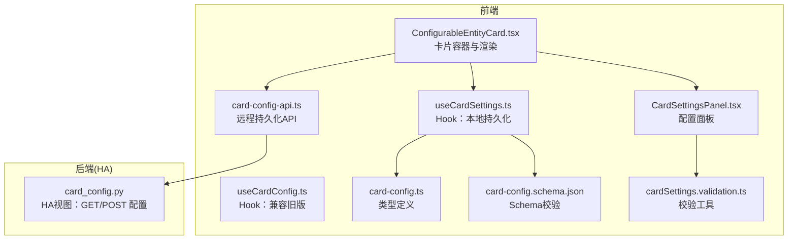
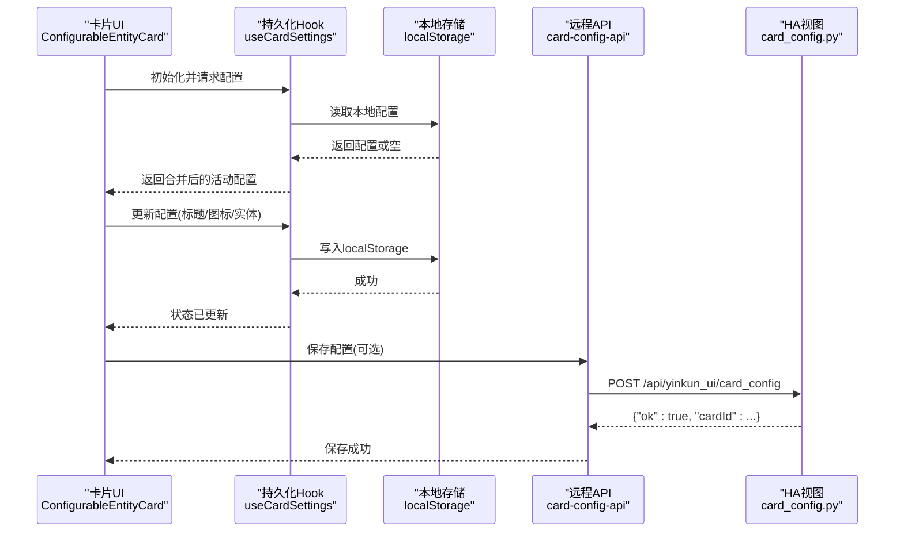
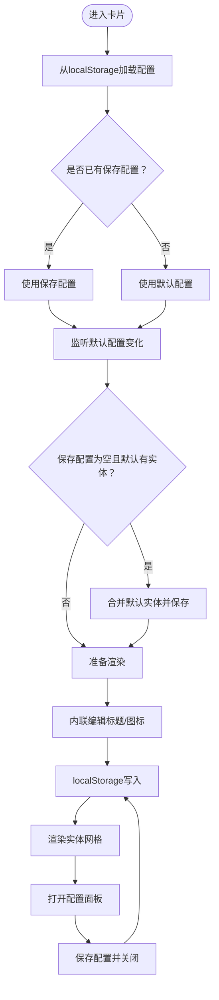
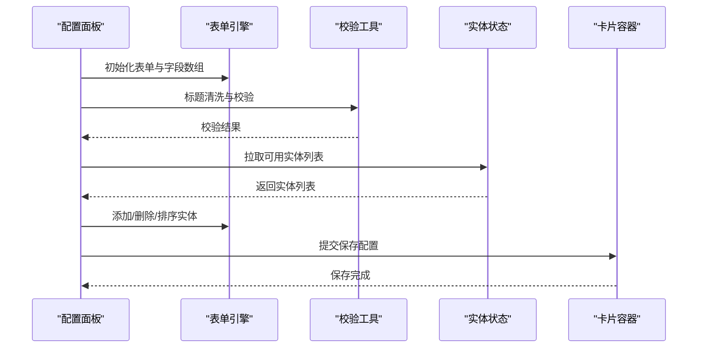
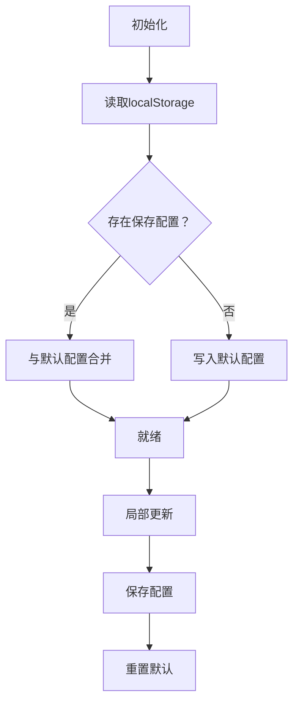
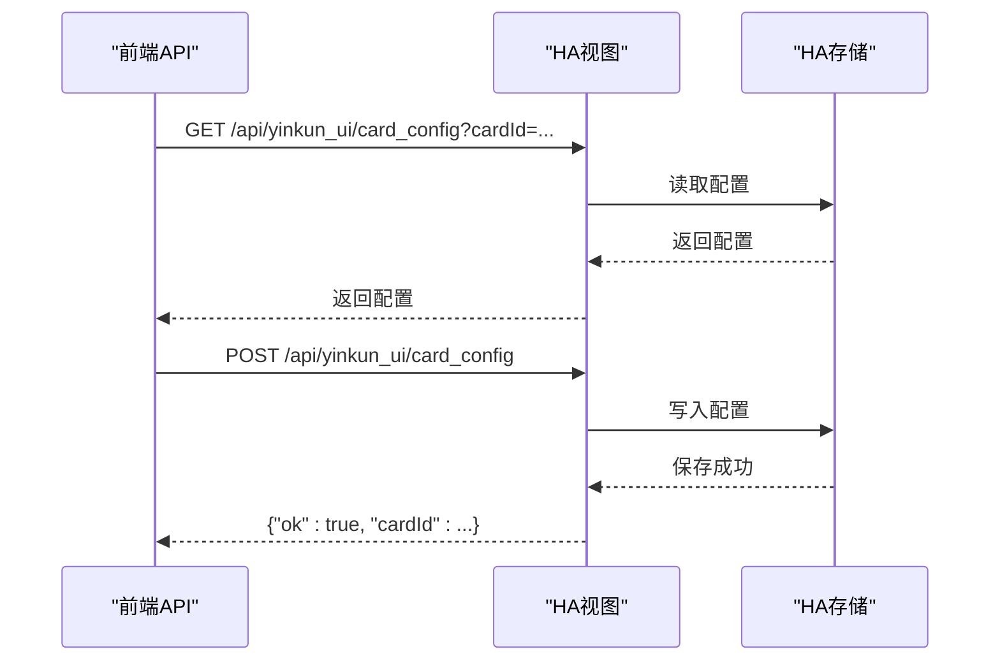
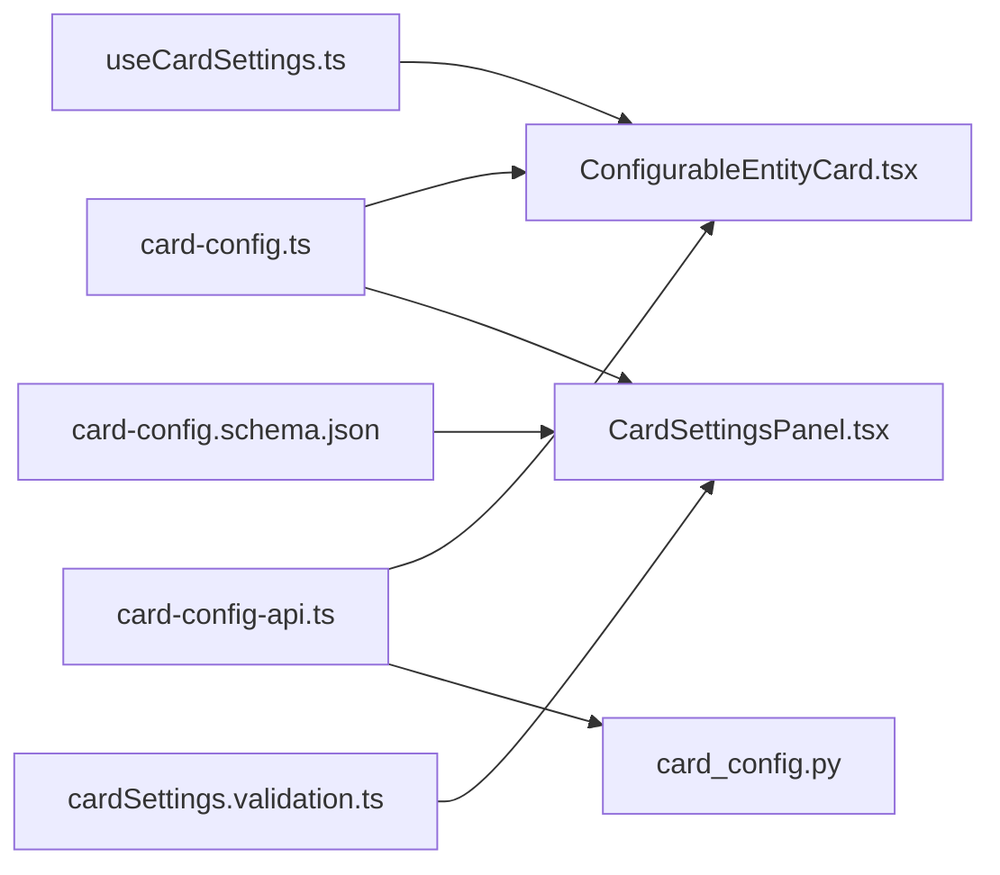

# 卡片配置状态

<cite>
**本文引用的文件**
- [card-config-api.ts](file://src/services/card-config-api.ts)
- [useCardConfig.ts](file://src/hooks/useCardConfig.ts)
- [useCardSettings.ts](file://src/hooks/useCardSettings.ts)
- [card-config.schema.json](file://src/schemas/card-config.schema.json)
- [cardSettings.validation.ts](file://src/app/components/dashboard/cards/shared/cardSettings.validation.ts)
- [CardSettingsPanel.tsx](file://src/app/components/dashboard/cards/shared/CardSettingsPanel.tsx)
- [ConfigurableEntityCard.tsx](file://src/app/components/dashboard/cards/shared/ConfigurableEntityCard.tsx)
- [card-config.ts](file://src/types/card-config.ts)
- [card_config.py](file://custom_components/yinkun_ui/card_config.py)
</cite>

## 目录
1. [简介](#简介)
2. [项目结构](#项目结构)
3. [核心组件](#核心组件)
4. [架构总览](#架构总览)
5. [详细组件分析](#详细组件分析)
6. [依赖分析](#依赖分析)
7. [性能考虑](#性能考虑)
8. [故障排查指南](#故障排查指南)
9. [结论](#结论)
10. [附录](#附录)

## 简介
本文件面向HAUI的“卡片配置状态管理”，系统性阐述设备卡片、统计卡片等各类卡片的配置设计与实现，覆盖以下主题：
- 配置模型与验证规则
- 前端本地持久化与远程持久化
- 动态加载与实时更新机制
- 配置变更的响应与UI绑定
- API使用方法、配置模板与扩展开发建议

## 项目结构
围绕卡片配置状态的关键代码分布在前端React组件、Hooks、类型定义与后端Home Assistant视图中，形成“前端本地持久化 + 后端共享存储”的双层持久化架构。

图表来源
- [ConfigurableEntityCard.tsx:54-309](file://src/app/components/dashboard/cards/shared/ConfigurableEntityCard.tsx#L54-L309)
- [CardSettingsPanel.tsx:86-369](file://src/app/components/dashboard/cards/shared/CardSettingsPanel.tsx#L86-L369)
- [useCardSettings.ts:6-42](file://src/hooks/useCardSettings.ts#L6-L42)
- [useCardConfig.ts:9-31](file://src/hooks/useCardConfig.ts#L9-L31)
- [card-config.schema.json:1-37](file://src/schemas/card-config.schema.json#L1-L37)
- [cardSettings.validation.ts:1-15](file://src/app/components/dashboard/cards/shared/cardSettings.validation.ts#L1-L15)
- [card-config.ts:1-14](file://src/types/card-config.ts#L1-L14)
- [card-config-api.ts:3-30](file://src/services/card-config-api.ts#L3-L30)
- [card_config.py:47-74](file://custom_components/yinkun_ui/card_config.py#L47-L74)

章节来源
- [ConfigurableEntityCard.tsx:54-309](file://src/app/components/dashboard/cards/shared/ConfigurableEntityCard.tsx#L54-L309)
- [CardSettingsPanel.tsx:86-369](file://src/app/components/dashboard/cards/shared/CardSettingsPanel.tsx#L86-L369)
- [useCardSettings.ts:6-42](file://src/hooks/useCardSettings.ts#L6-L42)
- [useCardConfig.ts:9-31](file://src/hooks/useCardConfig.ts#L9-L31)
- [card-config.schema.json:1-37](file://src/schemas/card-config.schema.json#L1-L37)
- [cardSettings.validation.ts:1-15](file://src/app/components/dashboard/cards/shared/cardSettings.validation.ts#L1-L15)
- [card-config.ts:1-14](file://src/types/card-config.ts#L1-L14)
- [card-config-api.ts:3-30](file://src/services/card-config-api.ts#L3-L30)
- [card_config.py:47-74](file://custom_components/yinkun_ui/card_config.py#L47-L74)

## 核心组件
- 类型与模型
  - 卡片配置模型定义于类型文件，包含标题、图标与实体数组字段；实体项包含实体ID、友好名、显示名、图标与可见性等。
- 前端持久化
  - useCardSettings：以localStorage为唯一持久化源，提供读取、更新、保存、重置默认等能力。
  - useCardConfig：兼容旧版Hook，行为与useCardSettings一致，仅键空间不同。
  - ConfigurableEntityCard：卡片容器，负责加载本地配置、合并默认配置、处理标题/图标/实体列表渲染、高度自适应与刷新。
  - CardSettingsPanel：配置面板，支持实体增删排序、标题清洗与校验、图标选择、搜索可用实体等。
- 校验与Schema
  - card-config.schema.json：定义标题长度、字符集、实体数量上限等约束。
  - cardSettings.validation.ts：提供标题清洗、合法性校验与实体数量限制工具。
- 远程持久化
  - card-config-api.ts：封装读取/保存卡片配置的HTTP接口。
  - card_config.py：HA后端视图，提供GET/POST卡片配置，基于Home Assistant存储模块进行持久化。

章节来源
- [card-config.ts:1-14](file://src/types/card-config.ts#L1-L14)
- [useCardSettings.ts:6-42](file://src/hooks/useCardSettings.ts#L6-L42)
- [useCardConfig.ts:9-31](file://src/hooks/useCardConfig.ts#L9-L31)
- [ConfigurableEntityCard.tsx:54-309](file://src/app/components/dashboard/cards/shared/ConfigurableEntityCard.tsx#L54-L309)
- [CardSettingsPanel.tsx:86-369](file://src/app/components/dashboard/cards/shared/CardSettingsPanel.tsx#L86-L369)
- [card-config.schema.json:1-37](file://src/schemas/card-config.schema.json#L1-L37)
- [cardSettings.validation.ts:1-15](file://src/app/components/dashboard/cards/shared/cardSettings.validation.ts#L1-L15)
- [card-config-api.ts:3-30](file://src/services/card-config-api.ts#L3-L30)
- [card_config.py:47-74](file://custom_components/yinkun_ui/card_config.py#L47-L74)

## 架构总览
卡片配置状态采用“前端本地优先 + 后端共享存储”的双层持久化策略：
- 前端本地：localStorage作为用户侧配置的主存储，保证离线可用与快速响应。
- 后端共享：通过HA视图接口实现跨浏览器/设备的配置共享，便于多端同步与备份。

图表来源
- [ConfigurableEntityCard.tsx:59-118](file://src/app/components/dashboard/cards/shared/ConfigurableEntityCard.tsx#L59-L118)
- [useCardSettings.ts:6-42](file://src/hooks/useCardSettings.ts#L6-L42)
- [card-config-api.ts:16-30](file://src/services/card-config-api.ts#L16-L30)
- [card_config.py:60-73](file://custom_components/yinkun_ui/card_config.py#L60-L73)

## 详细组件分析

### 组件A：ConfigurableEntityCard 卡片容器
职责与流程
- 加载与合并配置：优先从localStorage读取卡片配置，若无则使用默认配置；当默认配置变化时，自动合并新增实体。
- 标题与图标交互：支持内联编辑标题与图标更换，变更即时落盘。
- 实体展示：按可见性过滤并限制最多6个实体，网格布局自适应高度。
- 刷新与错误提示：调用外部刷新函数拉取最新状态，并展示错误信息。
- 配置面板：打开滑动面板进行实体增删、排序、图标选择与保存。

图表来源
- [ConfigurableEntityCard.tsx:59-137](file://src/app/components/dashboard/cards/shared/ConfigurableEntityCard.tsx#L59-L137)

章节来源
- [ConfigurableEntityCard.tsx:54-309](file://src/app/components/dashboard/cards/shared/ConfigurableEntityCard.tsx#L54-L309)

### 组件B：CardSettingsPanel 配置面板
职责与流程
- 表单与字段数组：基于react-hook-form与useFieldArray管理标题与实体数组。
- 实体搜索与加载：支持搜索可用实体并加载列表，带加载状态与错误提示。
- 排序与增删：拖拽排序实体，限制最多6个。
- 标题清洗与校验：自动清洗非法字符并限制长度，实时反馈校验结果。
- 保存与重置：提交时调用保存回调，支持重置为默认配置。

图表来源
- [CardSettingsPanel.tsx:86-155](file://src/app/components/dashboard/cards/shared/CardSettingsPanel.tsx#L86-L155)
- [cardSettings.validation.ts:1-15](file://src/app/components/dashboard/cards/shared/cardSettings.validation.ts#L1-L15)

章节来源
- [CardSettingsPanel.tsx:86-369](file://src/app/components/dashboard/cards/shared/CardSettingsPanel.tsx#L86-L369)
- [cardSettings.validation.ts:1-15](file://src/app/components/dashboard/cards/shared/cardSettings.validation.ts#L1-L15)

### 组件C：useCardSettings Hook
职责与流程
- 初始化：首次加载时从localStorage读取，若不存在则写入默认配置。
- 更新：局部更新配置并立即写入localStorage。
- 保存：直接替换为新配置并写入localStorage。
- 重置：恢复默认配置并写入localStorage。

图表来源
- [useCardSettings.ts:6-42](file://src/hooks/useCardSettings.ts#L6-L42)

章节来源
- [useCardSettings.ts:6-42](file://src/hooks/useCardSettings.ts#L6-L42)

### 组件D：远程持久化与后端集成
职责与流程
- 前端API：提供读取与保存卡片配置的异步函数，携带认证头与JSON负载。
- 后端视图：GET返回指定cardId的配置或全部配置；POST接收cardId与config并持久化至HA存储。

图表来源
- [card-config-api.ts:3-30](file://src/services/card-config-api.ts#L3-L30)
- [card_config.py:52-73](file://custom_components/yinkun_ui/card_config.py#L52-L73)

章节来源
- [card-config-api.ts:3-30](file://src/services/card-config-api.ts#L3-L30)
- [card_config.py:47-74](file://custom_components/yinkun_ui/card_config.py#L47-L74)

## 依赖分析
- 类型依赖
  - 卡片配置类型定义被卡片容器与面板共同引用，确保前后端一致。
- 校验依赖
  - Schema与校验工具共同保障配置合法性和用户体验。
- 存储依赖
  - 前端依赖localStorage；后端依赖HA存储模块，二者通过API互通。
- 组件耦合
  - 卡片容器与面板强耦合（面板作为卡片子组件滑入）；Hook与容器弱耦合（通过props注入）。

图表来源
- [card-config.ts:1-14](file://src/types/card-config.ts#L1-L14)
- [ConfigurableEntityCard.tsx:54-309](file://src/app/components/dashboard/cards/shared/ConfigurableEntityCard.tsx#L54-L309)
- [CardSettingsPanel.tsx:86-369](file://src/app/components/dashboard/cards/shared/CardSettingsPanel.tsx#L86-L369)
- [card-config.schema.json:1-37](file://src/schemas/card-config.schema.json#L1-L37)
- [cardSettings.validation.ts:1-15](file://src/app/components/dashboard/cards/shared/cardSettings.validation.ts#L1-L15)
- [useCardSettings.ts:6-42](file://src/hooks/useCardSettings.ts#L6-L42)
- [card-config-api.ts:3-30](file://src/services/card-config-api.ts#L3-L30)
- [card_config.py:47-74](file://custom_components/yinkun_ui/card_config.py#L47-L74)

章节来源
- [card-config.ts:1-14](file://src/types/card-config.ts#L1-L14)
- [card-config.schema.json:1-37](file://src/schemas/card-config.schema.json#L1-L37)
- [cardSettings.validation.ts:1-15](file://src/app/components/dashboard/cards/shared/cardSettings.validation.ts#L1-L15)
- [useCardSettings.ts:6-42](file://src/hooks/useCardSettings.ts#L6-L42)
- [card-config-api.ts:3-30](file://src/services/card-config-api.ts#L3-L30)
- [card_config.py:47-74](file://custom_components/yinkun_ui/card_config.py#L47-L74)

## 性能考虑
- 本地存储优化
  - 使用localStorage进行即时读写，避免频繁网络请求；对配置对象进行最小化更新，减少序列化成本。
- 渲染优化
  - 实体列表按可见性过滤并限制数量，降低DOM节点数；网格布局按实体数量动态计算行高，避免多余重排。
- 表单与校验
  - 标题清洗与校验在输入过程中执行，避免无效提交；字段数组按需更新，减少不必要的重渲染。
- 网络请求
  - 远程保存仅在用户显式操作时触发，避免高频写入；GET请求用于一次性读取，避免轮询。

## 故障排查指南
- 配置无法加载
  - 检查localStorage中是否存在对应键；确认默认配置是否正确传入；查看控制台是否有解析异常日志。
- 配置保存失败
  - 确认网络请求返回状态码；检查后端视图是否正确接收cardId与config；验证HA存储是否可写。
- 校验不通过
  - 标题长度超过限制或包含非法字符；实体数量超过上限；核对Schema与校验工具逻辑。
- 面板无法打开或实体不可选
  - 确认面板的open状态与事件绑定；检查实体列表加载函数是否返回有效数据；关注加载与错误状态。

章节来源
- [useCardSettings.ts:9-22](file://src/hooks/useCardSettings.ts#L9-L22)
- [card-config-api.ts:10-13](file://src/services/card-config-api.ts#L10-L13)
- [card_config.py:65-68](file://custom_components/yinkun_ui/card_config.py#L65-L68)
- [card-config.schema.json:9-14](file://src/schemas/card-config.schema.json#L9-L14)
- [cardSettings.validation.ts:6-10](file://src/app/components/dashboard/cards/shared/cardSettings.validation.ts#L6-L10)

## 结论
HAUI的卡片配置状态管理通过“前端本地持久化 + 后端共享存储”实现了高可用、易扩展的配置体系。类型与Schema确保配置一致性，Hooks与面板提供直观的交互体验，API与后端视图支撑跨设备同步。整体架构清晰、边界明确，适合进一步扩展更多卡片类型与配置模板。

## 附录

### 配置模型与默认值
- 模型字段
  - 标题：字符串，长度1~20，允许中文、英文字母与数字及空格。
  - 图标：字符串（可选）。
  - 实体数组：最多6项，每项至少包含实体ID，其余为可选属性。
- 默认值处理
  - 若未保存配置，使用默认配置作为基底；当默认配置新增实体时，自动合并到已保存配置中。

章节来源
- [card-config.ts:1-14](file://src/types/card-config.ts#L1-L14)
- [card-config.schema.json:7-34](file://src/schemas/card-config.schema.json#L7-L34)
- [ConfigurableEntityCard.tsx:64-72](file://src/app/components/dashboard/cards/shared/ConfigurableEntityCard.tsx#L64-L72)

### 验证规则与迁移策略
- 验证规则
  - 标题清洗：移除非法字符并截断至20字符。
  - 标题校验：非空、长度不超过20、字符集符合要求。
  - 实体数量：最多6个。
- 迁移策略
  - 旧版Hook键空间与新版保持一致，避免重复键冲突；默认配置变化时自动合并，无需手动迁移。

章节来源
- [cardSettings.validation.ts:1-15](file://src/app/components/dashboard/cards/shared/cardSettings.validation.ts#L1-L15)
- [useCardConfig.ts:9-31](file://src/hooks/useCardConfig.ts#L9-L31)
- [useCardSettings.ts:6-42](file://src/hooks/useCardSettings.ts#L6-L42)

### API使用方法
- 读取配置
  - 方法：GET /api/yinkun_ui/card_config?cardId=...（需认证）
  - 返回：包含cardId与config的对象
- 保存配置
  - 方法：POST /api/yinkun_ui/card_config（需认证）
  - 负载：{ cardId, config }
  - 返回：{"ok": true, "cardId": ...}

章节来源
- [card-config-api.ts:3-30](file://src/services/card-config-api.ts#L3-L30)
- [card_config.py:52-73](file://custom_components/yinkun_ui/card_config.py#L52-L73)

### 配置模板系统与扩展开发
- 模板系统
  - 建议以默认配置为模板基底，结合Schema约束生成标准化模板；在新增卡片类型时复用现有Hook与面板组件。
- 扩展开发
  - 新增卡片类型时，遵循相同的数据流：定义类型 → 编写Hook → 组合面板 → 适配Schema与校验 → 通过API与后端视图对接。
  - 对于复杂实体交互，可在面板中引入拖拽排序、搜索过滤与图标选择器等通用组件。

章节来源
- [card-config.ts:1-14](file://src/types/card-config.ts#L1-L14)
- [card-config.schema.json:1-37](file://src/schemas/card-config.schema.json#L1-L37)
- [CardSettingsPanel.tsx:86-369](file://src/app/components/dashboard/cards/shared/CardSettingsPanel.tsx#L86-L369)
- [ConfigurableEntityCard.tsx:54-309](file://src/app/components/dashboard/cards/shared/ConfigurableEntityCard.tsx#L54-L309)