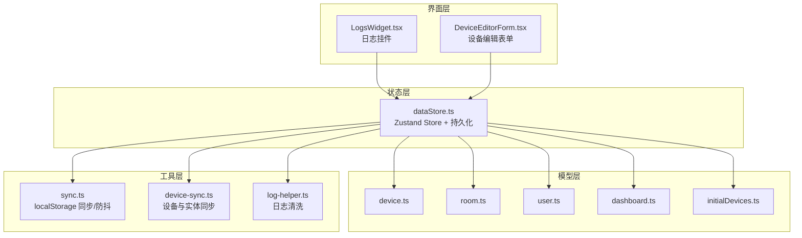
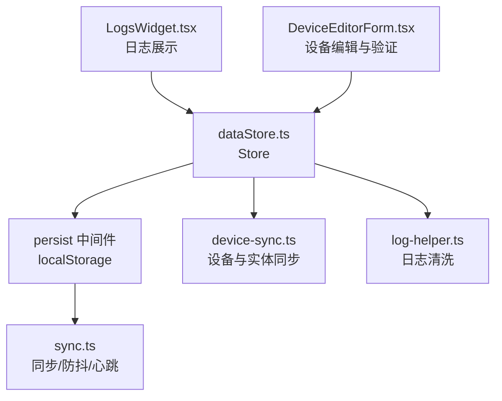
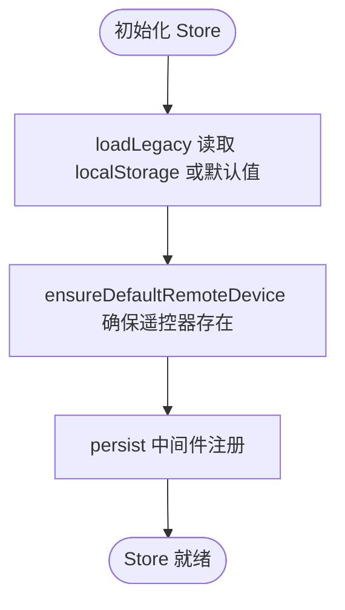
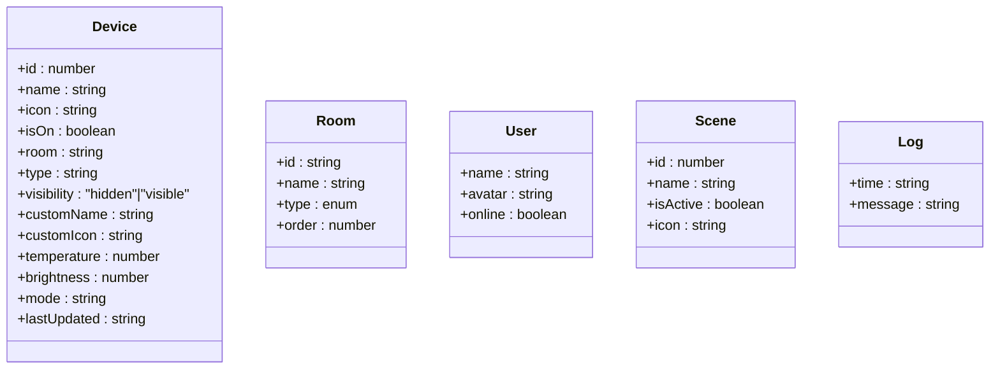
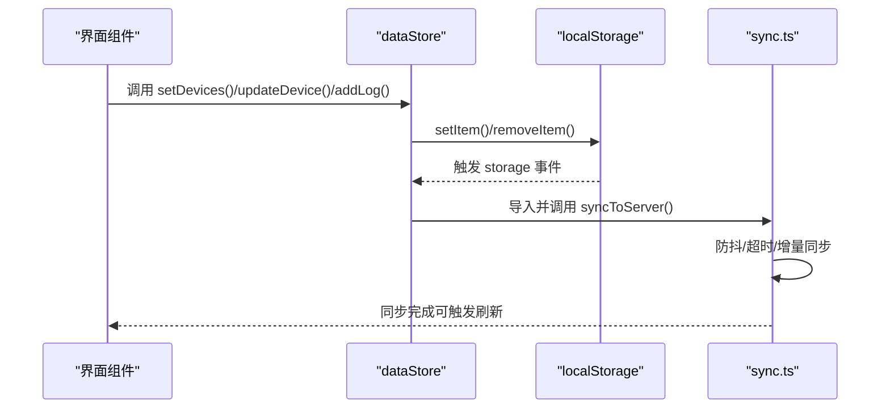
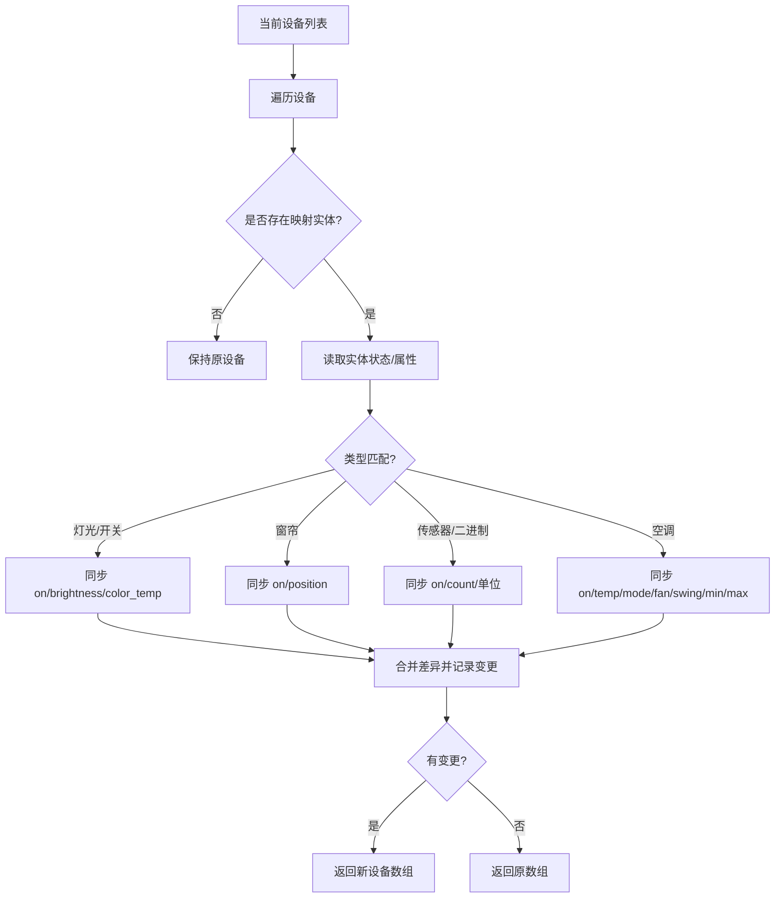
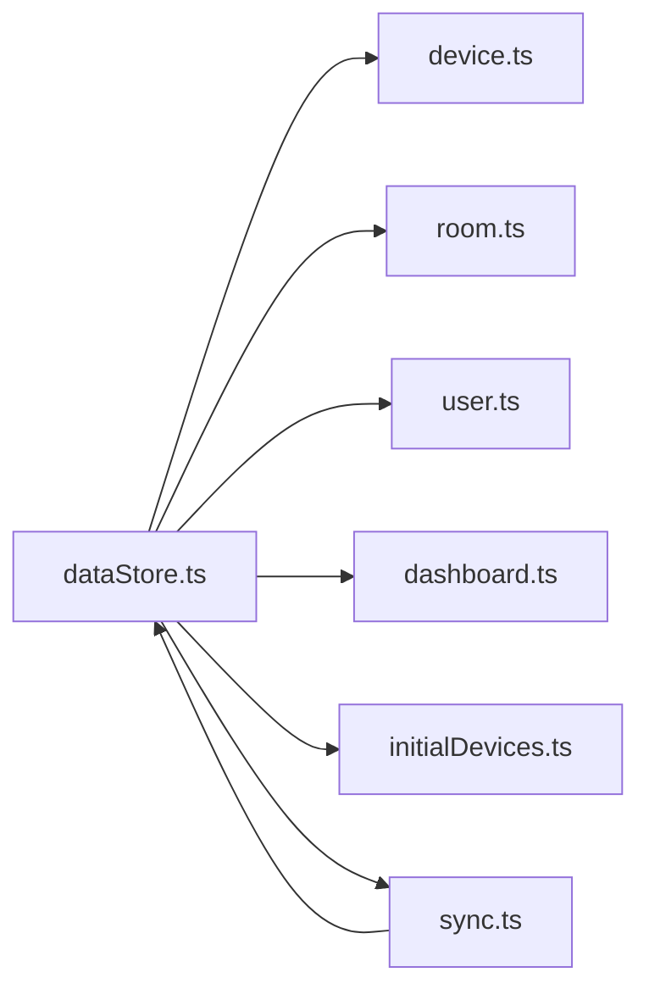

# 数据状态管理

<cite>
**本文引用的文件**
- [dataStore.ts](file://src/store/dataStore.ts)
- [device.ts](file://src/types/device.ts)
- [room.ts](file://src/types/room.ts)
- [user.ts](file://src/types/user.ts)
- [dashboard.ts](file://src/types/dashboard.ts)
- [initialDevices.ts](file://src/config/initialDevices.ts)
- [sync.ts](file://src/utils/sync.ts)
- [device-sync.ts](file://src/utils/device-sync.ts)
- [log-helper.ts](file://src/utils/log-helper.ts)
- [LogsWidget.tsx](file://src/app/components/dashboard/widgets/LogsWidget.tsx)
- [DeviceEditorForm.tsx](file://src/app/components/settings/DeviceEditorForm.tsx)
</cite>

## 目录
1. [简介](#简介)
2. [项目结构](#项目结构)
3. [核心组件](#核心组件)
4. [架构总览](#架构总览)
5. [详细组件分析](#详细组件分析)
6. [依赖关系分析](#依赖关系分析)
7. [性能考量](#性能考量)
8. [故障排查指南](#故障排查指南)
9. [结论](#结论)
10. [附录](#附录)

## 简介
本文件面向HAUI的数据状态管理模块，系统性解析dataStore的设计与实现，涵盖设备、房间、场景、用户、日志等核心数据模型；详解Zustand store的创建流程、状态初始化与持久化配置；阐述数据操作API的设计模式（批量更新、条件更新、函数式更新）；分析默认数据加载、遗留数据兼容与数据验证规则；并给出状态变更监听、副作用处理与性能优化策略，最后提供数据模型扩展指南与最佳实践。

## 项目结构
围绕数据状态管理的关键文件组织如下：
- 状态定义与持久化：src/store/dataStore.ts
- 数据模型定义：src/types/device.ts、src/types/room.ts、src/types/user.ts、src/types/dashboard.ts
- 默认初始数据：src/config/initialDevices.ts
- 同步与持久化副作用：src/utils/sync.ts
- 设备与实体同步：src/utils/device-sync.ts
- 日志清洗与展示：src/utils/log-helper.ts、src/app/components/dashboard/widgets/LogsWidget.tsx
- 表单与验证示例：src/app/components/settings/DeviceEditorForm.tsx

图表来源
- [dataStore.ts:58-129](file://src/store/dataStore.ts#L58-L129)
- [device.ts:1-46](file://src/types/device.ts#L1-L46)
- [room.ts:1-33](file://src/types/room.ts#L1-L33)
- [user.ts:1-7](file://src/types/user.ts#L1-L7)
- [dashboard.ts:1-12](file://src/types/dashboard.ts#L1-L12)
- [initialDevices.ts:1-68](file://src/config/initialDevices.ts#L1-L68)
- [sync.ts:52-161](file://src/utils/sync.ts#L52-L161)
- [device-sync.ts:1-191](file://src/utils/device-sync.ts#L1-L191)
- [log-helper.ts:1-33](file://src/utils/log-helper.ts#L1-L33)
- [LogsWidget.tsx:1-67](file://src/app/components/dashboard/widgets/LogsWidget.tsx#L1-L67)
- [DeviceEditorForm.tsx:1-200](file://src/app/components/settings/DeviceEditorForm.tsx#L1-L200)

章节来源
- [dataStore.ts:58-129](file://src/store/dataStore.ts#L58-L129)
- [device.ts:1-46](file://src/types/device.ts#L1-L46)
- [room.ts:1-33](file://src/types/room.ts#L1-L33)
- [user.ts:1-7](file://src/types/user.ts#L1-L7)
- [dashboard.ts:1-12](file://src/types/dashboard.ts#L1-L12)
- [initialDevices.ts:1-68](file://src/config/initialDevices.ts#L1-L68)
- [sync.ts:52-161](file://src/utils/sync.ts#L52-L161)
- [device-sync.ts:1-191](file://src/utils/device-sync.ts#L1-L191)
- [log-helper.ts:1-33](file://src/utils/log-helper.ts#L1-L33)
- [LogsWidget.tsx:1-67](file://src/app/components/dashboard/widgets/LogsWidget.tsx#L1-L67)
- [DeviceEditorForm.tsx:1-200](file://src/app/components/settings/DeviceEditorForm.tsx#L1-L200)

## 核心组件
- Zustand Store（dataStore）
  - 状态字段：devices、rooms、scenes、users、logs
  - 动作接口：setDevices、updateDevice、setRooms、setScenes、setUsers、setLogs、addLog、clearLogs、toggleDeviceState
  - 初始化策略：loadLegacy读取localStorage或回退默认值；ensureDefaultRemoteDevice确保遥控器默认项存在
  - 持久化策略：persist中间件，JSON序列化存储于localStorage，自定义storage触发同步
- 数据模型
  - Device：设备属性、可见性、自定义显示、温度/亮度/模式等
  - Room：房间标识、类型、排序
  - User：用户信息与在线状态
  - Scene/Log：场景与日志条目
- 默认数据
  - INITIAL_DEVICES提供初始设备集合，含空调、灯具、窗帘、传感器、遥控器等
- 同步与副作用
  - localStorage写入/删除后，通过动态导入触发同步到服务端
  - 防抖与节流：同步防抖、自动同步心跳与页面聚焦对齐
- 设备与实体同步
  - device-sync根据实体状态与属性，按设备类型进行状态/属性映射与差异检测
- 日志与展示
  - 日志清洗：数值精度与英文术语本地化
  - 日志挂件：展示最近日志、清空日志、打开历史弹窗

章节来源
- [dataStore.ts:9-28](file://src/store/dataStore.ts#L9-L28)
- [dataStore.ts:58-129](file://src/store/dataStore.ts#L58-L129)
- [device.ts:1-46](file://src/types/device.ts#L1-L46)
- [room.ts:1-33](file://src/types/room.ts#L1-L33)
- [user.ts:1-7](file://src/types/user.ts#L1-L7)
- [dashboard.ts:1-12](file://src/types/dashboard.ts#L1-L12)
- [initialDevices.ts:1-68](file://src/config/initialDevices.ts#L1-L68)
- [sync.ts:52-161](file://src/utils/sync.ts#L52-L161)
- [device-sync.ts:1-191](file://src/utils/device-sync.ts#L1-L191)
- [log-helper.ts:1-33](file://src/utils/log-helper.ts#L1-L33)
- [LogsWidget.tsx:1-67](file://src/app/components/dashboard/widgets/LogsWidget.tsx#L1-L67)

## 架构总览
下图展示了Zustand Store与外部模块的交互关系，包括持久化、同步、设备实体映射与日志处理。

图表来源
- [dataStore.ts:58-129](file://src/store/dataStore.ts#L58-L129)
- [sync.ts:52-161](file://src/utils/sync.ts#L52-L161)
- [device-sync.ts:1-191](file://src/utils/device-sync.ts#L1-L191)
- [log-helper.ts:1-33](file://src/utils/log-helper.ts#L1-L33)
- [LogsWidget.tsx:1-67](file://src/app/components/dashboard/widgets/LogsWidget.tsx#L1-L67)
- [DeviceEditorForm.tsx:1-200](file://src/app/components/settings/DeviceEditorForm.tsx#L1-L200)

## 详细组件分析

### Zustand Store 设计与持久化
- 创建与中间件
  - 使用create创建store，persist包裹以启用localStorage持久化
  - 自定义JSONStorage实现setItem/removeItem时触发同步
- 状态初始化
  - loadLegacy统一从localStorage读取，异常或缺失则回退默认值
  - ensureDefaultRemoteDevice在设备列表中缺失遥控器类型时追加默认遥控器
  - rooms、scenes、users、logs均采用相同策略
- 动作设计
  - 函数式更新：setDevices/setRooms/setScenes/setUsers/setLogs支持传入函数以基于旧状态计算新状态
  - 条件更新：updateDevice按id映射更新部分字段
  - 特定设备操作：toggleDeviceState切换isOn
  - 日志管理：addLog限制长度并保持最新在前，clearLogs清空
- 持久化选择
  - partialize仅持久化关键字段，避免冗余

图表来源
- [dataStore.ts:49-66](file://src/store/dataStore.ts#L49-L66)
- [dataStore.ts:58-129](file://src/store/dataStore.ts#L58-L129)

章节来源
- [dataStore.ts:9-28](file://src/store/dataStore.ts#L9-L28)
- [dataStore.ts:58-129](file://src/store/dataStore.ts#L58-L129)

### 数据模型与验证规则
- Device模型
  - 字段覆盖设备状态、属性、可见性与自定义显示
  - 支持温度/湿度/风速/摆风/亮度/色温等多维属性
- Room模型
  - 类型枚举与默认房间集
- User模型
  - 用户名、头像、在线状态
- Scene/Log模型
  - 场景标识与激活状态；日志时间与消息
- 表单验证示例
  - DeviceEditorForm对名称、房间、类型、实体ID、分类、图标进行校验，并提示重复名称、实体占用等问题

图表来源
- [device.ts:1-46](file://src/types/device.ts#L1-L46)
- [room.ts:1-33](file://src/types/room.ts#L1-L33)
- [user.ts:1-7](file://src/types/user.ts#L1-L7)
- [dashboard.ts:1-12](file://src/types/dashboard.ts#L1-L12)
- [DeviceEditorForm.tsx:130-188](file://src/app/components/settings/DeviceEditorForm.tsx#L130-L188)

章节来源
- [device.ts:1-46](file://src/types/device.ts#L1-L46)
- [room.ts:1-33](file://src/types/room.ts#L1-L33)
- [user.ts:1-7](file://src/types/user.ts#L1-L7)
- [dashboard.ts:1-12](file://src/types/dashboard.ts#L1-L12)
- [DeviceEditorForm.tsx:130-188](file://src/app/components/settings/DeviceEditorForm.tsx#L130-L188)

### 数据操作API设计模式
- 批量更新
  - setDevices/setRooms/setScenes/setUsers/setLogs支持直接数组替换或函数式更新
- 条件更新
  - updateDevice按id匹配并合并更新字段
- 函数式更新
  - 通过传入函数以旧状态为基础计算新状态，避免竞态与不一致
- 日志管理
  - addLog插入新日志并限制数量；clearLogs清空

图表来源
- [dataStore.ts:75-93](file://src/store/dataStore.ts#L75-L93)
- [dataStore.ts:104-127](file://src/store/dataStore.ts#L104-L127)
- [sync.ts:52-93](file://src/utils/sync.ts#L52-L93)

章节来源
- [dataStore.ts:67-102](file://src/store/dataStore.ts#L67-L102)
- [sync.ts:52-93](file://src/utils/sync.ts#L52-L93)

### 默认数据加载与遗留数据兼容
- 默认数据
  - INITIAL_DEVICES提供初始设备集合，包含常见家电与遥控器
- 遗留数据兼容
  - loadLegacy统一从localStorage读取，异常或解析失败回退默认值
  - ensureDefaultRemoteDevice保证遥控器默认项始终存在
- 房间默认值
  - DEFAULT_ROOMS提供常用房间类型与顺序

章节来源
- [initialDevices.ts:1-68](file://src/config/initialDevices.ts#L1-L68)
- [room.ts:21-32](file://src/types/room.ts#L21-L32)
- [dataStore.ts:49-66](file://src/store/dataStore.ts#L49-L66)

### 设备与实体同步
- 同步策略
  - 根据设备类型与实体状态/属性进行映射，检测差异并生成更新
  - 支持灯光/开关/窗帘/传感器/二进制传感器/空调等多种类型
- 属性覆盖
  - 状态、温度、风速、摆风、亮度、色温、可用性、设备类、时间戳等
- 性能注意
  - 仅在有变化时返回新数组，避免不必要的重渲染

图表来源
- [device-sync.ts:4-191](file://src/utils/device-sync.ts#L4-L191)

章节来源
- [device-sync.ts:1-191](file://src/utils/device-sync.ts#L1-L191)

### 日志清洗与展示
- 清洗规则
  - 数值保留两位小数
  - 英文术语本地化（如on/off/open/closed等）
- 展示组件
  - LogsWidget提供“查看全部/清空”入口，滚动展示最近日志

章节来源
- [log-helper.ts:1-33](file://src/utils/log-helper.ts#L1-L33)
- [LogsWidget.tsx:1-67](file://src/app/components/dashboard/widgets/LogsWidget.tsx#L1-L67)

## 依赖关系分析
- 组件耦合
  - dataStore依赖各类型定义与默认数据，动作通过函数式更新降低耦合
  - 同步模块通过动态导入避免循环依赖
- 外部依赖
  - localStorage作为持久化介质
  - Home Assistant 存储API用于云端同步
- 可能的循环依赖
  - 通过动态导入sync避免直接依赖导致的循环

图表来源
- [dataStore.ts:1-8](file://src/store/dataStore.ts#L1-L8)
- [sync.ts:52-93](file://src/utils/sync.ts#L52-L93)

章节来源
- [dataStore.ts:1-8](file://src/store/dataStore.ts#L1-L8)
- [sync.ts:52-93](file://src/utils/sync.ts#L52-L93)

## 性能考量
- 更新粒度
  - updateDevice按id映射更新，避免全量替换
  - 函数式更新减少竞态与重复渲染
- 持久化与同步
  - 自定义storage在setItem/removeItem时触发同步，结合防抖降低频繁网络请求
  - 自动同步心跳与页面聚焦对齐，避免频繁轮询
- 数据裁剪
  - persist的partialize仅持久化必要字段，减少存储与传输开销
- 渲染优化
  - 日志列表限制数量，避免长列表渲染压力

章节来源
- [dataStore.ts:71-73](file://src/store/dataStore.ts#L71-L73)
- [dataStore.ts:104-127](file://src/store/dataStore.ts#L104-L127)
- [sync.ts:52-93](file://src/utils/sync.ts#L52-L93)

## 故障排查指南
- 同步失败
  - 现象：本地修改未同步到服务端
  - 排查：检查localStorage写入是否触发storage事件；确认防抖定时器是否被清理；验证fetchWithTimeout超时与错误处理
- 本地数据损坏
  - 现象：读取localStorage报错或数据为空
  - 排查：loadLegacy会回退默认值；确认键名一致性与JSON格式正确
- 设备状态不同步
  - 现象：界面状态与实体状态不一致
  - 排查：device-sync按类型映射差异；确认设备类型与实体ID映射正确
- 日志显示异常
  - 现象：日志内容未本地化或数值精度异常
  - 排查：log-helper清洗规则；LogsWidget展示逻辑

章节来源
- [sync.ts:52-131](file://src/utils/sync.ts#L52-L131)
- [dataStore.ts:49-56](file://src/store/dataStore.ts#L49-L56)
- [device-sync.ts:1-191](file://src/utils/device-sync.ts#L1-L191)
- [log-helper.ts:1-33](file://src/utils/log-helper.ts#L1-L33)
- [LogsWidget.tsx:1-67](file://src/app/components/dashboard/widgets/LogsWidget.tsx#L1-L67)

## 结论
dataStore以Zustand为核心，结合persist中间件实现轻量、可维护的状态管理；通过函数式更新与条件更新保障并发安全与性能；配合自定义storage与防抖同步，兼顾本地与云端一致性。设备与实体同步模块提供强类型映射与差异检测，日志清洗与展示提升可观测性。整体架构清晰、扩展性强，适合在复杂IoT场景中演进。

## 附录

### 数据模型扩展指南
- 新增字段
  - 在对应类型定义中添加字段，并在INITIAL_DEVICES与默认房间中补充示例
- 新增模型
  - 定义接口并在dataStore中新增状态字段与动作
  - 在persist的partialize中加入新字段，避免持久化冗余
- 同步策略
  - 如需与实体同步，参考device-sync的类型分支与差异检测模式
- 验证规则
  - 在表单组件中增加校验逻辑，确保数据一致性

章节来源
- [device.ts:1-46](file://src/types/device.ts#L1-L46)
- [room.ts:1-33](file://src/types/room.ts#L1-L33)
- [initialDevices.ts:1-68](file://src/config/initialDevices.ts#L1-L68)
- [device-sync.ts:1-191](file://src/utils/device-sync.ts#L1-L191)
- [DeviceEditorForm.tsx:130-188](file://src/app/components/settings/DeviceEditorForm.tsx#L130-L188)