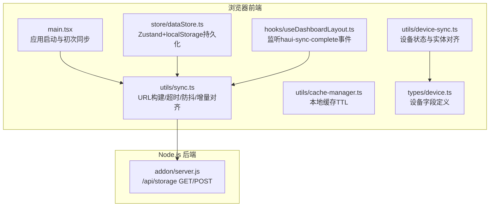
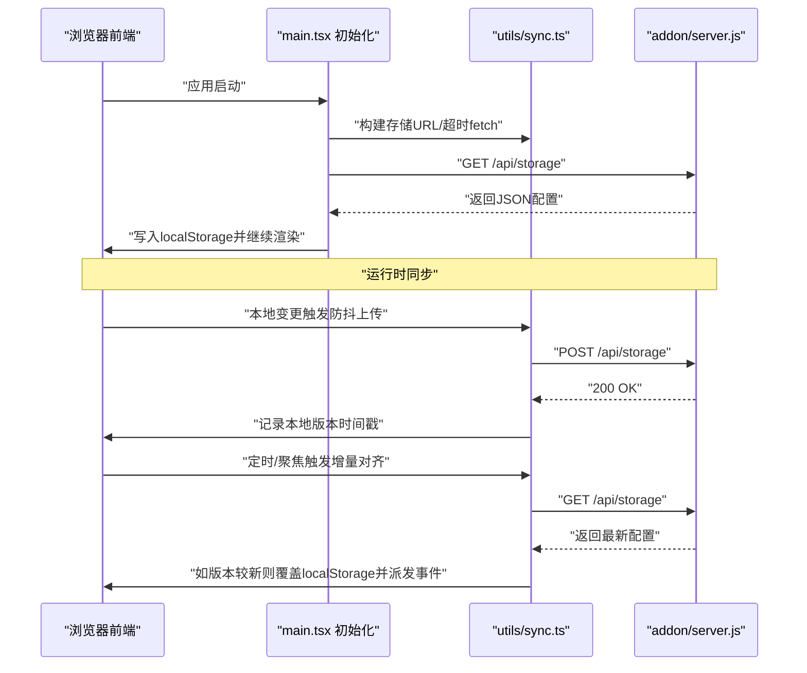
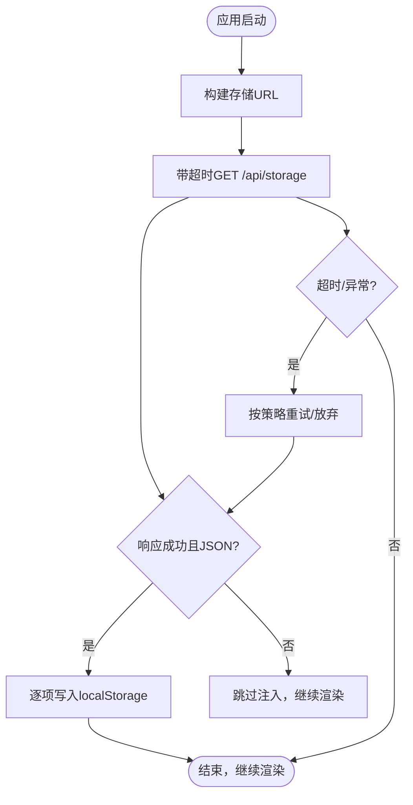
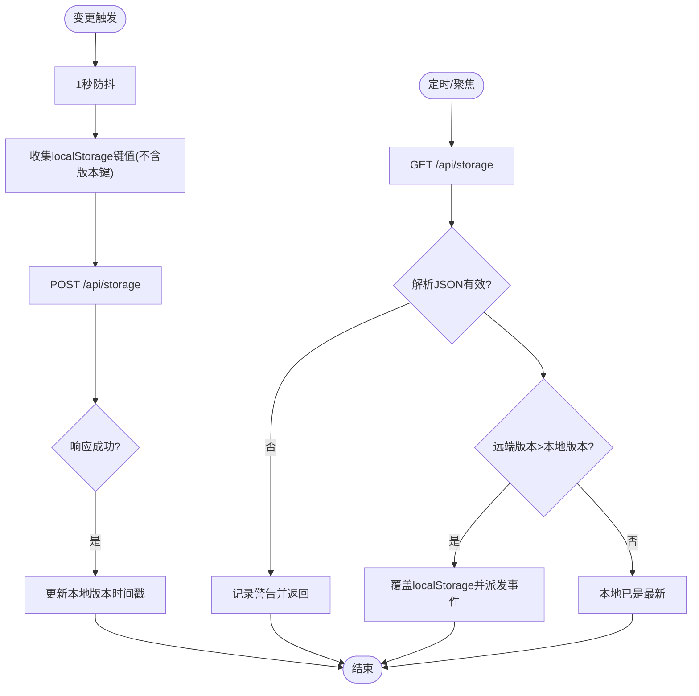
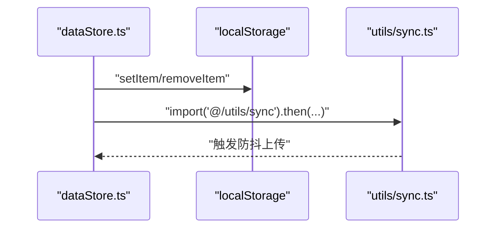
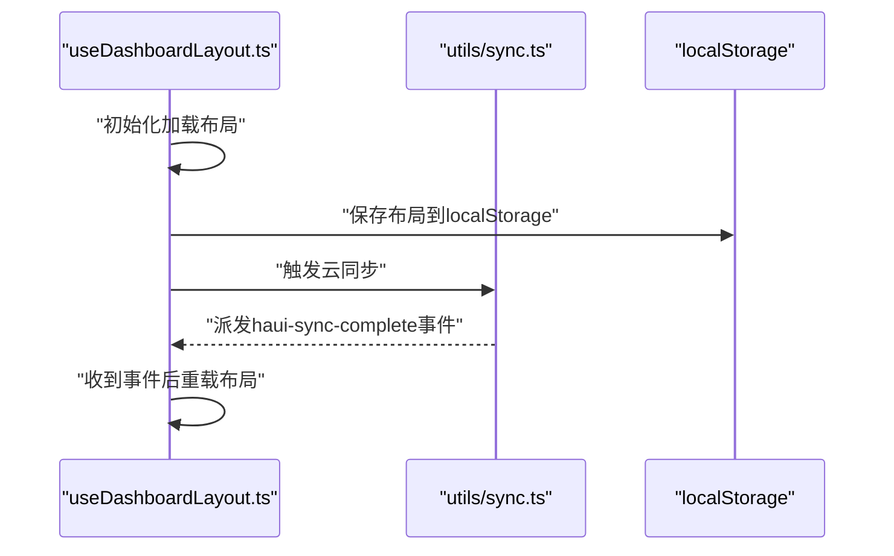
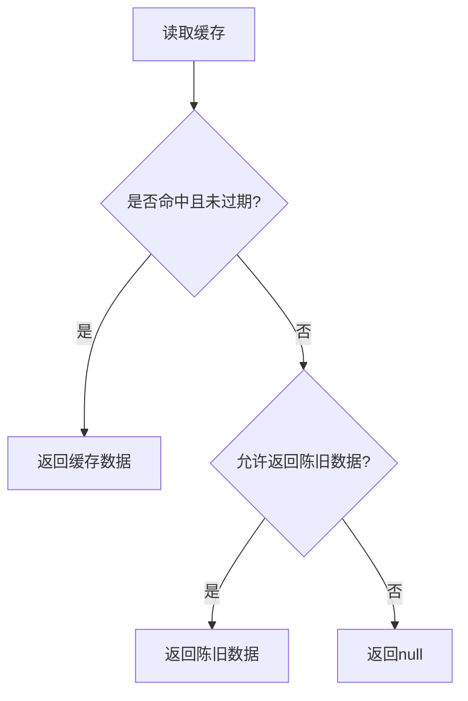
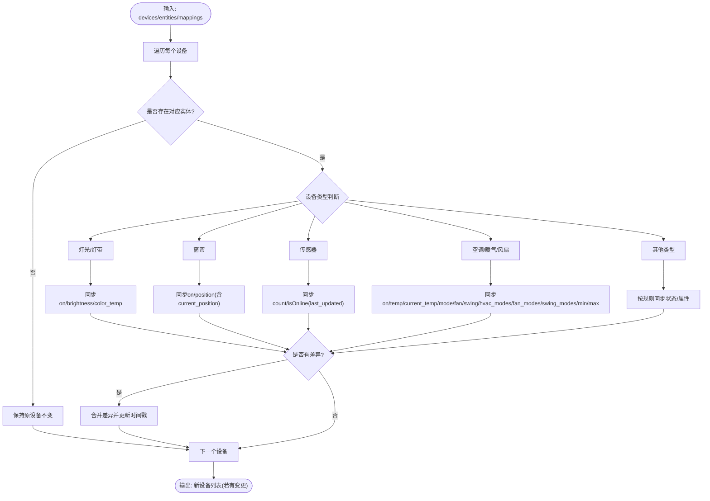
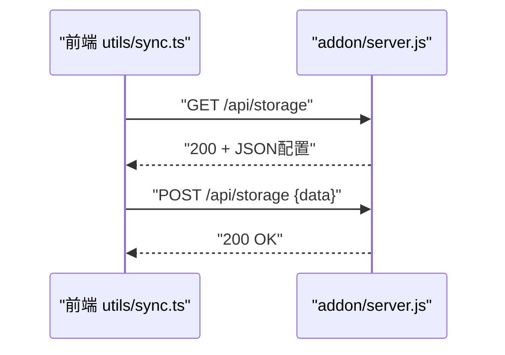
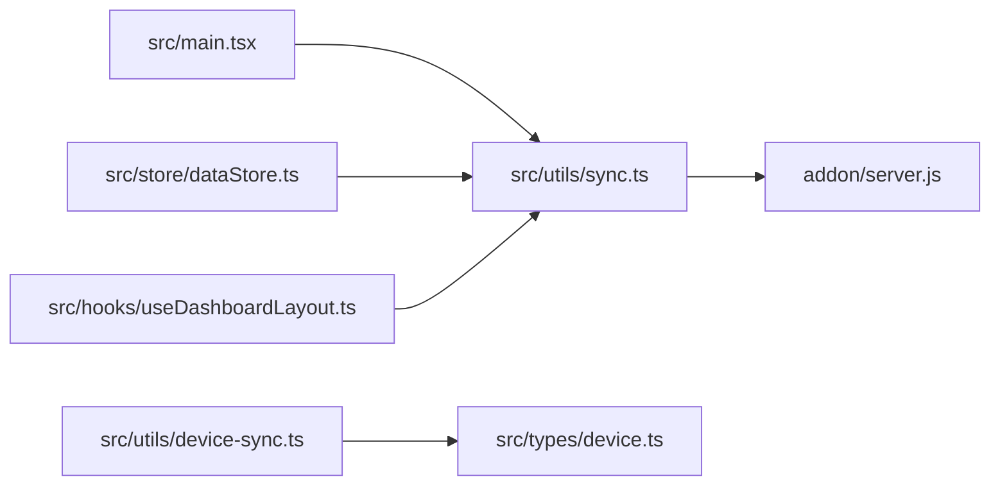

# 状态同步机制

<cite>
**本文引用的文件**
- [src/main.tsx](file://src/main.tsx)
- [src/utils/sync.ts](file://src/utils/sync.ts)
- [src/store/dataStore.ts](file://src/store/dataStore.ts)
- [src/hooks/useDashboardLayout.ts](file://src/hooks/useDashboardLayout.ts)
- [src/utils/cache-manager.ts](file://src/utils/cache-manager.ts)
- [src/utils/device-sync.ts](file://src/utils/device-sync.ts)
- [src/types/device.ts](file://src/types/device.ts)
- [addon/server.js](file://addon/server.js)
</cite>

## 目录
1. [简介](#简介)
2. [项目结构](#项目结构)
3. [核心组件](#核心组件)
4. [架构总览](#架构总览)
5. [详细组件分析](#详细组件分析)
6. [依赖关系分析](#依赖关系分析)
7. [性能考量](#性能考量)
8. [故障排除指南](#故障排除指南)
9. [结论](#结论)
10. [附录](#附录)

## 简介
本文件系统性阐述 HAUI 的跨设备状态同步机制，覆盖本地存储与 Node.js 后端之间的数据同步流程、同步触发机制、版本控制与增量对齐、缓存策略、设备状态同步、网络异常与断线重连、监控与调试手段，以及扩展与自定义同步策略的实现方法。目标是帮助开发者与运维人员快速理解并高效维护该同步体系。

## 项目结构
围绕“状态同步”的关键文件分布如下：
- 前端初始化与同步入口：src/main.tsx
- 本地存储与云端同步工具：src/utils/sync.ts
- 数据持久化与变更触发：src/store/dataStore.ts
- 布局与同步事件监听：src/hooks/useDashboardLayout.ts
- 缓存管理：src/utils/cache-manager.ts
- 设备状态与 Home Assistant 实体对齐：src/utils/device-sync.ts
- 设备类型定义：src/types/device.ts
- Node.js 后端存储接口：addon/server.js

**图表来源**
- [src/main.tsx:18-67](file://src/main.tsx#L18-L67)
- [src/utils/sync.ts:4-24](file://src/utils/sync.ts#L4-L24)
- [src/store/dataStore.ts:104-127](file://src/store/dataStore.ts#L104-L127)
- [src/hooks/useDashboardLayout.ts:64-73](file://src/hooks/useDashboardLayout.ts#L64-L73)
- [src/utils/cache-manager.ts:6-56](file://src/utils/cache-manager.ts#L6-L56)
- [src/utils/device-sync.ts:1-191](file://src/utils/device-sync.ts#L1-L191)
- [src/types/device.ts:1-46](file://src/types/device.ts#L1-L46)
- [addon/server.js:96-121](file://addon/server.js#L96-L121)

**章节来源**
- [src/main.tsx:18-67](file://src/main.tsx#L18-L67)
- [src/utils/sync.ts:4-24](file://src/utils/sync.ts#L4-L24)
- [src/store/dataStore.ts:104-127](file://src/store/dataStore.ts#L104-L127)
- [src/hooks/useDashboardLayout.ts:64-73](file://src/hooks/useDashboardLayout.ts#L64-L73)
- [src/utils/cache-manager.ts:6-56](file://src/utils/cache-manager.ts#L6-L56)
- [src/utils/device-sync.ts:1-191](file://src/utils/device-sync.ts#L1-L191)
- [src/types/device.ts:1-46](file://src/types/device.ts#L1-L46)
- [addon/server.js:96-121](file://addon/server.js#L96-L121)

## 核心组件
- 同步工具模块（URL 构建、超时、防抖、增量对齐、自动心跳与聚焦对齐）
- 前端初始化同步（Add-on 环境下从后端拉取配置注入 localStorage）
- 数据持久化与变更触发（Zustand 持久化中间件拦截 localStorage 写入并触发同步）
- 布局与同步事件联动（监听 haui-sync-complete 自动重载布局）
- 缓存管理（TTL 过期与“陈旧即用”策略）
- 设备状态与 Home Assistant 实体对齐（按设备类型同步状态与属性）

**章节来源**
- [src/utils/sync.ts:49-160](file://src/utils/sync.ts#L49-L160)
- [src/main.tsx:18-67](file://src/main.tsx#L18-L67)
- [src/store/dataStore.ts:104-127](file://src/store/dataStore.ts#L104-L127)
- [src/hooks/useDashboardLayout.ts:64-81](file://src/hooks/useDashboardLayout.ts#L64-L81)
- [src/utils/cache-manager.ts:6-56](file://src/utils/cache-manager.ts#L6-L56)
- [src/utils/device-sync.ts:4-191](file://src/utils/device-sync.ts#L4-L191)

## 架构总览
整体同步链路分为“启动时拉取”和“运行时增量对齐”两条主线，并辅以“变更触发上传”和“事件驱动刷新”。

**图表来源**
- [src/main.tsx:18-67](file://src/main.tsx#L18-L67)
- [src/utils/sync.ts:52-131](file://src/utils/sync.ts#L52-L131)
- [addon/server.js:96-121](file://addon/server.js#L96-L121)

## 详细组件分析

### 组件A：前端初始化与首次同步（Add-on 环境）
- 目标：在 Add-on 环境下，应用启动时从 Node.js 后端拉取持久化配置并注入 localStorage，保证多设备首屏一致。
- 关键点：
  - 使用带超时的 fetch，最多重试若干次，避免阻塞首屏渲染。
  - 仅在返回内容类型为 JSON 时才进行注入，非 Add-on 环境直接跳过。
  - 成功注入后继续渲染应用，确保不会出现“空白页根因”。

**图表来源**
- [src/main.tsx:18-67](file://src/main.tsx#L18-L67)

**章节来源**
- [src/main.tsx:18-67](file://src/main.tsx#L18-L67)

### 组件B：本地存储与云端同步工具（防抖、增量对齐、版本控制）
- 版本控制键：haui_last_sync_ts（记录最后一次同步的时间戳）。
- 上传策略：
  - 防抖：对 localStorage 的写入进行 1 秒防抖，合并多次变更。
  - 上传：将除版本键外的所有键值对打包发送至后端。
  - 成功后更新本地版本时间戳。
- 下载策略：
  - 增量对齐：比较远端与本地版本，仅在远端较新或显式强制时覆盖本地。
  - 成功后派发自定义事件 haui-sync-complete，通知上层刷新。
- 自动同步：
  - 每 30 秒定时对齐。
  - 页面聚焦时对齐。
- 超时与安全：
  - GET/POST 均使用带超时的 fetch。
  - 异常吞掉，避免影响 UI。

**图表来源**
- [src/utils/sync.ts:52-131](file://src/utils/sync.ts#L52-L131)

**章节来源**
- [src/utils/sync.ts:49-160](file://src/utils/sync.ts#L49-L160)

### 组件C：数据持久化与变更触发（Zustand 持久化中间件）
- 作用：拦截 localStorage 的写入与删除，自动触发同步，避免手动分散处理。
- 选择性持久化：仅持久化 devices、rooms、scenes、users、logs 等关键字段。
- 与同步工具解耦：通过动态 import 触发同步，避免循环依赖。

**图表来源**
- [src/store/dataStore.ts:104-127](file://src/store/dataStore.ts#L104-L127)
- [src/utils/sync.ts:52-93](file://src/utils/sync.ts#L52-L93)

**章节来源**
- [src/store/dataStore.ts:104-127](file://src/store/dataStore.ts#L104-L127)

### 组件D：布局与同步事件联动（无刷新对齐）
- 监听 haui-sync-complete 事件，在云端布局更新后自动重载本地布局，实现无刷新对齐。
- 布局变更时同样触发云同步，避免刷新被服务端旧配置覆盖。

**图表来源**
- [src/hooks/useDashboardLayout.ts:64-81](file://src/hooks/useDashboardLayout.ts#L64-L81)
- [src/utils/sync.ts:119](file://src/utils/sync.ts#L119)

**章节来源**
- [src/hooks/useDashboardLayout.ts:64-81](file://src/hooks/useDashboardLayout.ts#L64-L81)

### 组件E：缓存管理（TTL 与陈旧即用）
- TTL：默认 30 分钟，过期则丢弃。
- 提供 getStale：即使过期也返回旧数据，便于离线或弱网场景。
- 适用于非同步类数据（如天气）的缓存策略，可借鉴到同步流程中以增强弱网体验。

**图表来源**
- [src/utils/cache-manager.ts:6-56](file://src/utils/cache-manager.ts#L6-L56)

**章节来源**
- [src/utils/cache-manager.ts:6-56](file://src/utils/cache-manager.ts#L6-L56)

### 组件F：设备状态与 Home Assistant 实体对齐
- 输入：当前设备列表、实体状态集合、设备到实体的映射。
- 输出：根据设备类型与实体属性，生成差异更新并返回新设备列表。
- 关键同步点：
  - 开关状态：按实体 state 判断 on/off。
  - 灯光亮度：开机时同步亮度，关机时亮度清零。
  - 窗帘位置：优先使用 current_position，否则根据 isOpen 推断 100/0。
  - 传感器：拼装单位后的数值字符串与在线状态。
  - 空调：同步开关、设定温度、当前温度、模式、风速、扫风、可用模式列表与温度上下限。
  - 时间戳：last_updated/last_changed 更新。
- 性能：遍历设备列表，逐项比对并最小化变更，hasChanges 控制返回原列表或新列表。

**图表来源**
- [src/utils/device-sync.ts:4-191](file://src/utils/device-sync.ts#L4-L191)

**章节来源**
- [src/utils/device-sync.ts:4-191](file://src/utils/device-sync.ts#L4-L191)
- [src/types/device.ts:1-46](file://src/types/device.ts#L1-46)

### 组件G：Node.js 后端存储接口
- GET /api/storage：读取持久化配置文件（Add-on 环境下位于 /data/，本地开发时位于 .data/）。
- POST /api/storage：写入配置文件。
- 兼容性：支持 Home Assistant Ingress 动态基础路径的 URL 解析。
- 错误处理：捕获异常并返回 5xx，前端据此进行重试或降级。

**图表来源**
- [addon/server.js:96-121](file://addon/server.js#L96-L121)
- [src/utils/sync.ts:22-24](file://src/utils/sync.ts#L22-L24)

**章节来源**
- [addon/server.js:96-121](file://addon/server.js#L96-L121)

## 依赖关系分析
- 启动同步依赖同步工具的 URL 构建与超时 fetch。
- 数据持久化依赖同步工具的版本控制与增量对齐。
- 布局同步依赖自定义事件 haui-sync-complete。
- 设备状态同步依赖设备类型定义与实体属性。
- 后端存储接口为前端提供统一的 GET/POST 能力。

**图表来源**
- [src/main.tsx:18-67](file://src/main.tsx#L18-L67)
- [src/utils/sync.ts:49-160](file://src/utils/sync.ts#L49-L160)
- [src/store/dataStore.ts:104-127](file://src/store/dataStore.ts#L104-L127)
- [src/hooks/useDashboardLayout.ts:64-81](file://src/hooks/useDashboardLayout.ts#L64-L81)
- [src/utils/device-sync.ts:1-191](file://src/utils/device-sync.ts#L1-L191)
- [src/types/device.ts:1-46](file://src/types/device.ts#L1-L46)
- [addon/server.js:96-121](file://addon/server.js#L96-L121)

**章节来源**
- [src/main.tsx:18-67](file://src/main.tsx#L18-L67)
- [src/utils/sync.ts:49-160](file://src/utils/sync.ts#L49-L160)
- [src/store/dataStore.ts:104-127](file://src/store/dataStore.ts#L104-L127)
- [src/hooks/useDashboardLayout.ts:64-81](file://src/hooks/useDashboardLayout.ts#L64-L81)
- [src/utils/device-sync.ts:1-191](file://src/utils/device-sync.ts#L1-L191)
- [src/types/device.ts:1-46](file://src/types/device.ts#L1-L46)
- [addon/server.js:96-121](file://addon/server.js#L96-L121)

## 性能考量
- 防抖上传：减少频繁写入，合并变更，降低网络压力。
- 增量对齐：仅在版本更新时覆盖本地，避免不必要的写入与重绘。
- 自动心跳：固定周期对齐，兼顾实时性与资源消耗。
- 超时与重试：前端与后端均设置超时，避免长时间挂起。
- 缓存策略：TTL 与陈旧即用可提升弱网体验，建议在同步流程中借鉴（如对齐前先读取陈旧缓存）。
- 设备对齐：按类型分支处理，避免对无关设备进行无效计算。

[本节为通用性能讨论，无需具体文件分析]

## 故障排除指南
- 现象：首屏空白或加载缓慢
  - 排查：确认 Add-on 环境下 /api/storage 是否返回 JSON；检查超时与重试逻辑。
  - 参考：[src/main.tsx:18-67](file://src/main.tsx#L18-L67)
- 现象：多设备配置不同步
  - 排查：检查本地版本时间戳是否更新；确认 haui-sync-complete 事件是否派发与监听。
  - 参考：[src/utils/sync.ts:119](file://src/utils/sync.ts#L119), [src/hooks/useDashboardLayout.ts:64-73](file://src/hooks/useDashboardLayout.ts#L64-L73)
- 现象：变更未触发上传
  - 排查：确认持久化中间件是否拦截 localStorage 写入；检查动态 import 是否成功。
  - 参考：[src/store/dataStore.ts:104-127](file://src/store/dataStore.ts#L104-L127)
- 现象：网络异常导致同步失败
  - 排查：检查带超时 fetch 的异常处理；观察后端 5xx 错误日志。
  - 参考：[src/utils/sync.ts:29-41](file://src/utils/sync.ts#L29-L41), [addon/server.js:96-121](file://addon/server.js#L96-L121)
- 现象：设备状态不同步
  - 排查：核对设备类型分支与实体属性映射；关注 last_updated/last_changed 的更新。
  - 参考：[src/utils/device-sync.ts:4-191](file://src/utils/device-sync.ts#L4-L191), [src/types/device.ts:1-46](file://src/types/device.ts#L1-L46)

**章节来源**
- [src/main.tsx:18-67](file://src/main.tsx#L18-L67)
- [src/utils/sync.ts:29-41](file://src/utils/sync.ts#L29-L41)
- [src/store/dataStore.ts:104-127](file://src/store/dataStore.ts#L104-L127)
- [src/hooks/useDashboardLayout.ts:64-73](file://src/hooks/useDashboardLayout.ts#L64-L73)
- [src/utils/device-sync.ts:4-191](file://src/utils/device-sync.ts#L4-L191)
- [src/types/device.ts:1-46](file://src/types/device.ts#L1-L46)
- [addon/server.js:96-121](file://addon/server.js#L96-L121)

## 结论
HAUI 的状态同步以 localStorage 为核心，结合前端初始化拉取、Zustand 持久化中间件触发、防抖上传与增量对齐、自定义事件驱动刷新，形成稳定可靠的跨设备一致性保障。后端通过 /api/storage 提供统一的读写接口，配合超时与错误处理，满足生产环境的可用性要求。设备状态同步模块针对多种设备类型提供细粒度对齐策略，确保 UI 与 Home Assistant 实体保持一致。

[本节为总结，无需具体文件分析]

## 附录

### 同步状态监控与调试
- 浏览器控制台日志
  - 同步成功/失败、版本对齐、事件派发等均有日志输出，便于定位问题。
  - 参考：[src/utils/sync.ts:87-88](file://src/utils/sync.ts#L87-L88), [src/utils/sync.ts:118-124](file://src/utils/sync.ts#L118-L124), [src/utils/sync.ts:119](file://src/utils/sync.ts#L119)
- 事件监听
  - 布局模块监听 haui-sync-complete 并自动重载，验证云端更新是否生效。
  - 参考：[src/hooks/useDashboardLayout.ts:64-73](file://src/hooks/useDashboardLayout.ts#L64-L73)
- 后端日志
  - Node.js 服务端对读写失败、代理转发异常等进行错误记录，便于排查。
  - 参考：[addon/server.js:96-121](file://addon/server.js#L96-L121), [addon/server.js:90-94](file://addon/server.js#L90-L94)

**章节来源**
- [src/utils/sync.ts:87-88](file://src/utils/sync.ts#L87-L88)
- [src/utils/sync.ts:118-124](file://src/utils/sync.ts#L118-L124)
- [src/utils/sync.ts:119](file://src/utils/sync.ts#L119)
- [src/hooks/useDashboardLayout.ts:64-73](file://src/hooks/useDashboardLayout.ts#L64-L73)
- [addon/server.js:96-121](file://addon/server.js#L96-L121)
- [addon/server.js:90-94](file://addon/server.js#L90-L94)

### 扩展与自定义同步策略
- 自定义版本键
  - 若需区分不同业务域的数据版本，可在同步工具中引入新的版本键并调整增量对齐逻辑。
  - 参考：[src/utils/sync.ts:47](file://src/utils/sync.ts#L47), [src/utils/sync.ts:110-111](file://src/utils/sync.ts#L110-L111)
- 增量同步优化
  - 当前为全量覆盖，可考虑仅传输差异键值，减少带宽与后端 IO。
  - 参考：[src/utils/sync.ts:62-72](file://src/utils/sync.ts#L62-L72)
- 冲突检测与解决
  - 当前采用“远端较新即覆盖”的简单策略。可扩展为“时间戳+操作向量”或“最后写者获胜”，并在 UI 层提示用户。
  - 参考：[src/utils/sync.ts:114-125](file://src/utils/sync.ts#L114-L125)
- 断线重连与指数退避
  - 前端已具备超时与重试，可进一步引入指数退避与最大重试次数上限。
  - 参考：[src/main.tsx:22-66](file://src/main.tsx#L22-L66)
- 缓存策略增强
  - 在同步对齐前先读取陈旧缓存，提升弱网体验；成功后再写入新缓存。
  - 参考：[src/utils/cache-manager.ts:45-55](file://src/utils/cache-manager.ts#L45-L55)

**章节来源**
- [src/utils/sync.ts:47](file://src/utils/sync.ts#L47)
- [src/utils/sync.ts:62-72](file://src/utils/sync.ts#L62-L72)
- [src/utils/sync.ts:114-125](file://src/utils/sync.ts#L114-L125)
- [src/main.tsx:22-66](file://src/main.tsx#L22-L66)
- [src/utils/cache-manager.ts:45-55](file://src/utils/cache-manager.ts#L45-L55)