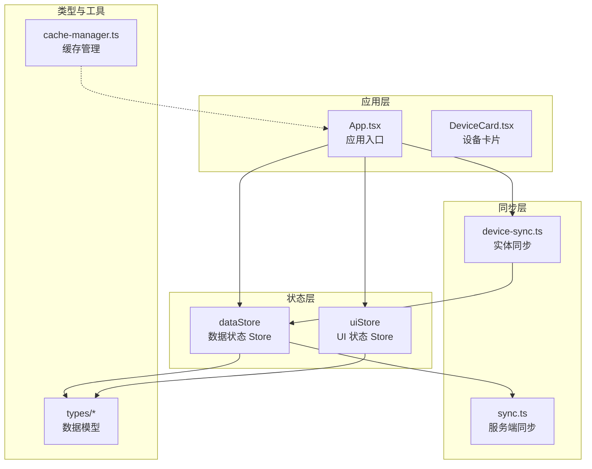
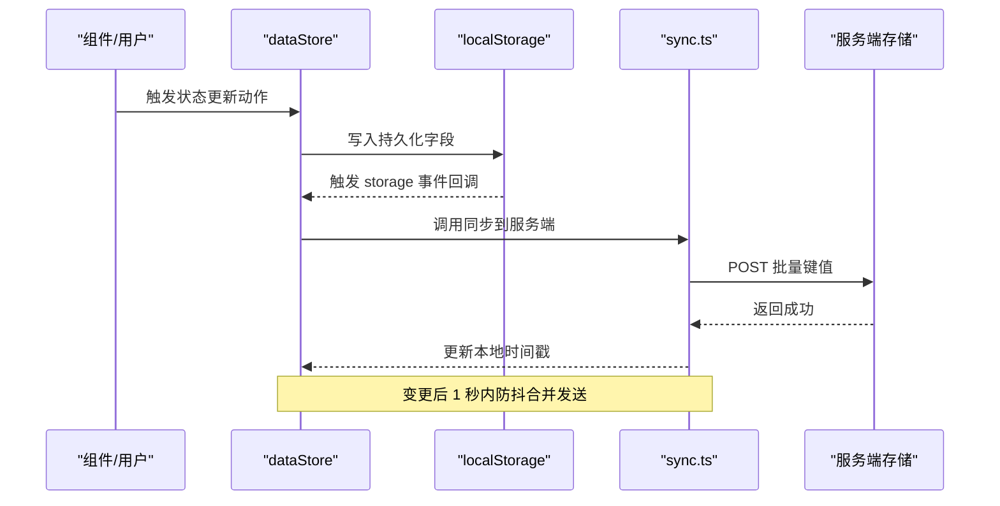
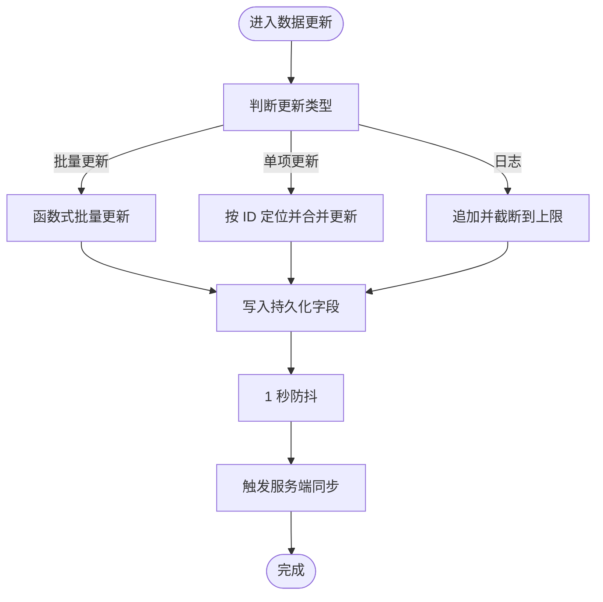
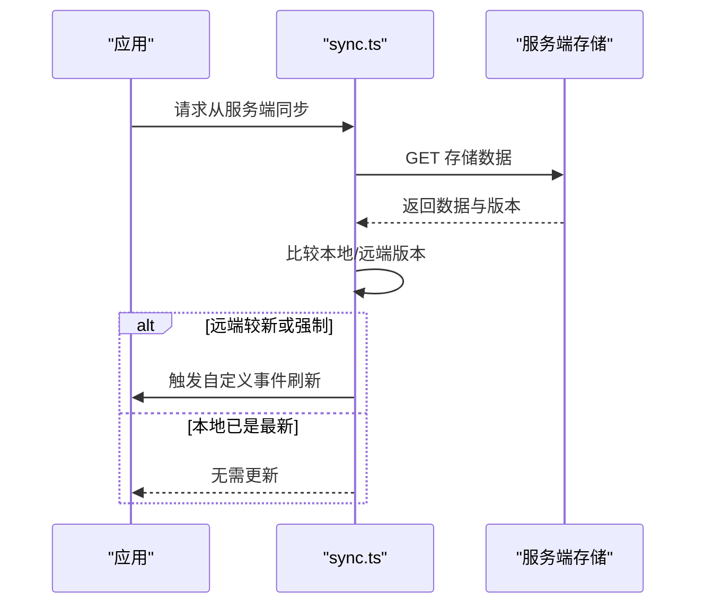
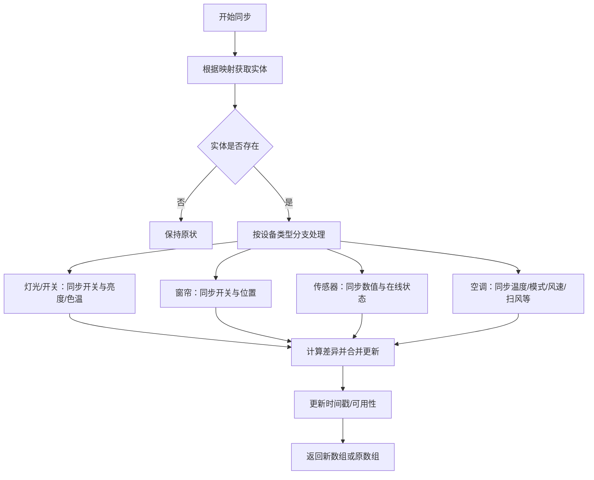
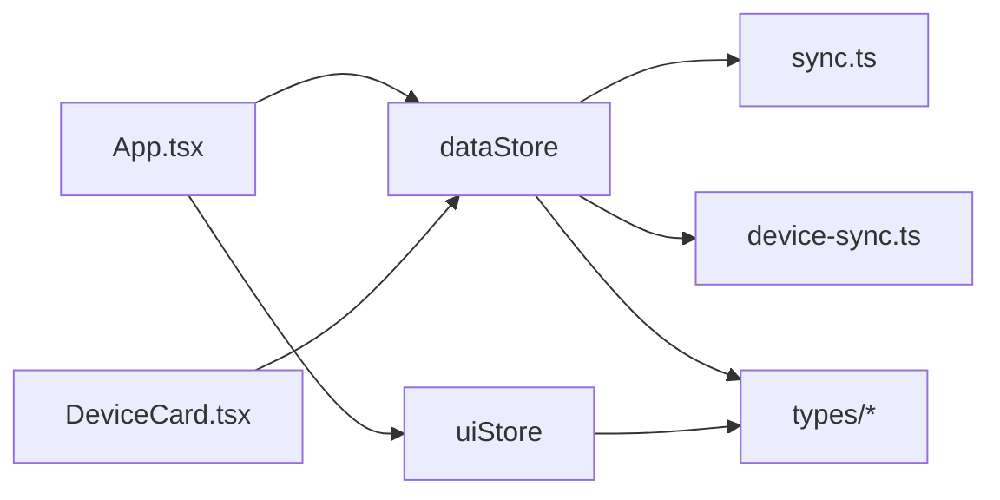

# 状态管理

<cite>
**本文引用的文件**
- [src/store/dataStore.ts](file://src/store/dataStore.ts)
- [src/store/uiStore.ts](file://src/store/uiStore.ts)
- [src/utils/sync.ts](file://src/utils/sync.ts)
- [src/utils/device-sync.ts](file://src/utils/device-sync.ts)
- [src/hooks/useHomeAssistant.ts](file://src/hooks/useHomeAssistant.ts)
- [src/app/App.tsx](file://src/app/App.tsx)
- [src/timeseries/cache-manager.ts](file://src/utils/cache-manager.ts)
- [src/types/device.ts](file://src/types/device.ts)
- [src/types/room.ts](file://src/types/room.ts)
- [src/types/dashboard.ts](file://src/types/dashboard.ts)
- [src/app/components/dashboard/DeviceCard.tsx](file://src/app/components/dashboard/DeviceCard.tsx)
</cite>

## 目录
1. [简介](#简介)
2. [项目结构](#项目结构)
3. [核心组件](#核心组件)
4. [架构总览](#架构总览)
5. [详细组件分析](#详细组件分析)
6. [依赖关系分析](#依赖关系分析)
7. [性能考量](#性能考量)
8. [故障排除指南](#故障排除指南)
9. [结论](#结论)
10. [附录](#附录)

## 简介
本文件系统性梳理 HAUI 的状态管理体系，围绕 Zustand 状态库的应用展开，重点覆盖两类 Store 的设计与职责：数据状态 Store（dataStore）与 UI 状态 Store（uiStore）。文档将深入解释状态组织结构、数据模型定义、状态更新机制、跨设备同步的一致性保障与冲突解决策略、异步状态更新与副作用处理、持久化与缓存管理、内存优化以及调试与排障方法。

## 项目结构
HAUI 的状态管理采用分层模块化组织：
- 数据状态 Store：负责设备、房间、场景、用户、日志等实体数据的集中管理，并通过持久化中间件实现本地存储与服务端同步。
- UI 状态 Store：负责界面交互状态（如模态框开关、编辑模式、选中设备等），不涉及持久化。
- 同步工具：封装了与服务端存储的同步逻辑，包括主动推送、被动拉取、心跳与聚焦对齐。
- 设备状态同步：将 Home Assistant 实体状态映射回本地设备模型，确保视图与实际设备状态一致。
- 类型定义：统一的数据模型接口，明确字段语义与可选扩展，支撑强类型开发与运行时校验。

图表来源
- [src/store/dataStore.ts:58-128](file://src/store/dataStore.ts#L58-L128)
- [src/store/uiStore.ts:31-55](file://src/store/uiStore.ts#L31-L55)
- [src/utils/sync.ts:49-161](file://src/utils/sync.ts#L49-L161)
- [src/utils/device-sync.ts:4-191](file://src/utils/device-sync.ts#L4-L191)
- [src/app/App.tsx:116-123](file://src/app/App.tsx#L116-L123)
- [src/app/components/dashboard/DeviceCard.tsx:26-200](file://src/app/components/dashboard/DeviceCard.tsx#L26-L200)

章节来源
- [src/store/dataStore.ts:1-129](file://src/store/dataStore.ts#L1-L129)
- [src/store/uiStore.ts:1-55](file://src/store/uiStore.ts#L1-L55)
- [src/utils/sync.ts:1-161](file://src/utils/sync.ts#L1-L161)
- [src/utils/device-sync.ts:1-191](file://src/utils/device-sync.ts#L1-L191)
- [src/app/App.tsx:1-200](file://src/app/App.tsx#L1-L200)
- [src/app/components/dashboard/DeviceCard.tsx:1-200](file://src/app/components/dashboard/DeviceCard.tsx#L1-L200)

## 核心组件
- 数据状态 Store（dataStore）
  - 职责：维护设备、房间、场景、用户、日志等实体集合；提供批量更新、单项更新、日志追加与清理等动作；通过持久化中间件将关键字段写入本地存储，并在变更时触发服务端同步。
  - 关键点：默认遥控器设备注入、遗留数据迁移、部分字段持久化、日志上限截断。
- UI 状态 Store（uiStore）
  - 职责：管理界面交互状态（设置面板、气候/遥控模态框、区域选择、仪表盘编辑模式等）；提供便捷的打开/关闭与带数据的打开方法。
  - 关键点：非持久化状态，轻量级动作函数，便于组件快速读写。

章节来源
- [src/store/dataStore.ts:9-28](file://src/store/dataStore.ts#L9-L28)
- [src/store/dataStore.ts:58-128](file://src/store/dataStore.ts#L58-L128)
- [src/store/uiStore.ts:3-29](file://src/store/uiStore.ts#L3-L29)
- [src/store/uiStore.ts:31-55](file://src/store/uiStore.ts#L31-L55)

## 架构总览
下图展示从用户操作到状态更新、持久化与跨设备同步的端到端流程。

图表来源
- [src/store/dataStore.ts:106-127](file://src/store/dataStore.ts#L106-L127)
- [src/utils/sync.ts:52-93](file://src/utils/sync.ts#L52-L93)

## 详细组件分析

### 数据状态 Store（dataStore）
- 数据模型与字段
  - 设备：包含标识、名称、图标、开关状态、房间归属、类型、可见性、亮度/色温、温度参数、最后更新时间等。
  - 房间：包含标识、名称、类型、排序等。
  - 场景与日志：场景用于场景切换，日志用于记录关键事件。
- 状态更新机制
  - 批量更新：支持函数式更新，避免重复渲染与竞态。
  - 单项更新：针对特定设备属性进行局部更新。
  - 日志管理：追加新日志并限制长度，保证内存占用可控。
- 持久化与跨设备同步
  - 仅持久化关键字段，减少存储体积。
  - 在 storage 事件回调中触发服务端同步，实现本地变更的跨设备传播。
  - 服务端同步采用防抖策略，合并短时间内多次变更。
- 默认设备注入与兼容性
  - 若无遥控器设备则自动注入一条默认遥控器设备，确保遥控功能可用。
  - 支持从 localStorage 迁移旧键名，提升兼容性。

图表来源
- [src/store/dataStore.ts:67-102](file://src/store/dataStore.ts#L67-L102)
- [src/store/dataStore.ts:106-127](file://src/store/dataStore.ts#L106-L127)
- [src/utils/sync.ts:52-93](file://src/utils/sync.ts#L52-L93)

章节来源
- [src/store/dataStore.ts:9-28](file://src/store/dataStore.ts#L9-L28)
- [src/store/dataStore.ts:30-47](file://src/store/dataStore.ts#L30-L47)
- [src/store/dataStore.ts:49-56](file://src/store/dataStore.ts#L49-L56)
- [src/store/dataStore.ts:67-102](file://src/store/dataStore.ts#L67-L102)
- [src/store/dataStore.ts:106-127](file://src/store/dataStore.ts#L106-L127)
- [src/types/device.ts:1-46](file://src/types/device.ts#L1-L46)
- [src/types/room.ts:1-33](file://src/types/room.ts#L1-L33)
- [src/types/dashboard.ts:1-12](file://src/types/dashboard.ts#L1-L12)

### UI 状态 Store（uiStore）
- 管理的 UI 状态包括：设置面板开关与默认标签页、气候/遥控模态框、区域选择模态框、仪表盘编辑模式、选中的设备等。
- 提供便捷的动作函数，如打开特定模态框并附带数据，或直接切换编辑模式。
- 该 Store 不参与持久化，确保 UI 行为与业务数据解耦。

章节来源
- [src/store/uiStore.ts:3-29](file://src/store/uiStore.ts#L3-L29)
- [src/store/uiStore.ts:31-55](file://src/store/uiStore.ts#L31-L55)

### 跨设备同步与一致性
- 版本控制与增量对齐
  - 使用时间戳作为版本号，仅在远端版本较新或强制同步时才覆盖本地。
  - 拉取完成后触发自定义事件，通知应用刷新状态。
- 自动同步策略
  - 心跳：每 30 秒检查一次远端版本。
  - 聚焦对齐：页面获得焦点时触发一次对齐。
- 冲突解决
  - 以远端为准的单向对齐策略，避免双向冲突。
  - 本地变更通过防抖合并后统一推送，降低并发写入风险。

图表来源
- [src/utils/sync.ts:98-131](file://src/utils/sync.ts#L98-L131)
- [src/utils/sync.ts:136-150](file://src/utils/sync.ts#L136-L150)

章节来源
- [src/utils/sync.ts:46-161](file://src/utils/sync.ts#L46-L161)

### 设备状态同步（HA 实体到本地模型）
- 同步范围与策略
  - 针对灯光、开关、窗帘、传感器、二进制传感器、空调等多种设备类型分别处理状态与属性映射。
  - 仅在状态或属性发生实质性变化时才更新本地模型，避免不必要的重渲染。
- 时间戳与可用性
  - 同步实体的 last_updated/last_changed，确保 UI 显示最新时间信息。
  - 将 unavailable/unknown 状态映射为本地不可用标记。
- 设备映射
  - 通过设备映射表将本地设备 ID 与 Home Assistant 实体 ID 对应，保证一对一同步。

图表来源
- [src/utils/device-sync.ts:4-191](file://src/utils/device-sync.ts#L4-L191)

章节来源
- [src/utils/device-sync.ts:1-191](file://src/utils/device-sync.ts#L1-L191)

### 异步状态更新与副作用处理
- WebSocket 与 REST 回退
  - 优先使用 WebSocket 获取实体与事件，失败时回退到 REST 接口。
  - 心跳检测与延迟评估，确保连接健康。
- 应用入口的自动扫描与同步
  - 连接建立后自动扫描设备并发现新增实体，随后初始化服务端同步的心跳与聚焦对齐。
- 日志与错误处理
  - 组件侧对异常进行降级处理（如自动扫描失败时重试一次），避免影响用户体验。

章节来源
- [src/hooks/useHomeAssistant.ts:250-312](file://src/hooks/useHomeAssistant.ts#L250-L312)
- [src/hooks/useHomeAssistant.ts:37-164](file://src/hooks/useHomeAssistant.ts#L37-L164)
- [src/app/App.tsx:289-325](file://src/app/App.tsx#L289-L325)

### 订阅机制与组件联动
- 组件订阅 Store
  - 应用入口同时订阅数据与 UI Store，实现设备列表、房间、场景、用户、日志与界面交互状态的统一管理。
  - 设备卡片根据设备类型动态渲染不同控件，响应状态变化。
- 事件驱动刷新
  - 服务端同步完成后通过自定义事件驱动 Store 刷新，确保多设备间状态一致。

章节来源
- [src/app/App.tsx:86-123](file://src/app/App.tsx#L86-L123)
- [src/app/components/dashboard/DeviceCard.tsx:26-200](file://src/app/components/dashboard/DeviceCard.tsx#L26-L200)
- [src/utils/sync.ts:119-121](file://src/utils/sync.ts#L119-L121)

### 缓存管理与内存优化
- 本地缓存
  - CacheManager 提供基于 localStorage 的简单缓存，支持 TTL 过期与静默读取。
- 内存优化建议
  - 仅持久化必要字段，避免冗余数据膨胀。
  - 日志列表截断，防止无限增长。
  - 防抖合并频繁写入，降低同步频率与内存抖动。

章节来源
- [src/utils/cache-manager.ts:1-56](file://src/utils/cache-manager.ts#L1-L56)
- [src/store/dataStore.ts:89-91](file://src/store/dataStore.ts#L89-L91)
- [src/store/dataStore.ts:118-125](file://src/store/dataStore.ts#L118-L125)

## 依赖关系分析
- 组件与 Store
  - App.tsx 同时消费 dataStore 与 uiStore，形成数据与 UI 的双通道。
  - DeviceCard 根据设备类型渲染不同子组件，间接依赖 dataStore 中的设备状态。
- Store 与工具
  - dataStore 依赖 sync.ts 实现持久化后的服务端同步。
  - 设备状态同步依赖 device-sync.ts 与 Home Assistant 实体数据。
- 类型定义
  - types/* 为所有 Store 与组件提供强类型约束，确保字段语义清晰。

图表来源
- [src/app/App.tsx:86-123](file://src/app/App.tsx#L86-L123)
- [src/store/dataStore.ts:58-128](file://src/store/dataStore.ts#L58-L128)
- [src/store/uiStore.ts:31-55](file://src/store/uiStore.ts#L31-L55)
- [src/utils/sync.ts:49-161](file://src/utils/sync.ts#L49-L161)
- [src/utils/device-sync.ts:4-191](file://src/utils/device-sync.ts#L4-L191)
- [src/app/components/dashboard/DeviceCard.tsx:26-200](file://src/app/components/dashboard/DeviceCard.tsx#L26-L200)

## 性能考量
- 防抖与批处理
  - 本地变更触发的同步采用 1 秒防抖，合并短时间内多次写入，降低网络与 CPU 开销。
- 选择性持久化
  - 仅持久化关键字段，减少存储体积与序列化成本。
- 渐进式更新
  - 设备状态同步仅在状态或属性变化时更新，避免无效渲染。
- 连接健康监控
  - WebSocket 心跳与延迟评估，及时发现并恢复连接问题。

## 故障排除指南
- 服务端同步失败
  - 现象：同步接口报错或无响应。
  - 处理：检查网络连通性与凭据；确认服务端存储接口可达；查看浏览器控制台日志。
  - 参考
    - [src/utils/sync.ts:74-92](file://src/utils/sync.ts#L74-L92)
- 本地数据未对齐
  - 现象：多设备间状态不一致。
  - 处理：手动触发一次从服务端同步；确认版本时间戳是否更新；检查页面聚焦与心跳是否生效。
  - 参考
    - [src/utils/sync.ts:98-131](file://src/utils/sync.ts#L98-L131)
    - [src/utils/sync.ts:136-150](file://src/utils/sync.ts#L136-L150)
- 设备状态不同步
  - 现象：设备开关/数值与 Home Assistant 实体不一致。
  - 处理：确认设备映射表正确；检查实体是否存在且状态非 unavailable/unknown；查看设备类型分支是否覆盖目标设备。
  - 参考
    - [src/utils/device-sync.ts:4-191](file://src/utils/device-sync.ts#L4-L191)
- 自动扫描失败
  - 现象：启动后未能自动发现设备。
  - 处理：等待一次重试；检查 HA 连接与凭据；确认 REST/WebSocket 接口可用。
  - 参考
    - [src/app/App.tsx:289-325](file://src/app/App.tsx#L289-L325)
    - [src/hooks/useHomeAssistant.ts:250-312](file://src/hooks/useHomeAssistant.ts#L250-L312)

## 结论
HAUI 的状态管理以 Zustand 为核心，将数据与 UI 分离，配合本地持久化与服务端同步，实现了跨设备的一致性与良好的用户体验。通过类型约束、选择性持久化、防抖与增量对齐等策略，系统在性能与可靠性之间取得平衡。未来可在以下方面持续优化：引入更细粒度的订阅与选择器、增强冲突检测与回滚能力、完善调试面板与可观测性工具。

## 附录
- 状态调试建议
  - 使用浏览器开发者工具的 Redux DevTools 或 Zustand 自带调试插件观察状态变化。
  - 在服务端同步失败时，检查请求头与响应体，定位网络或权限问题。
  - 对设备状态异常，打印设备映射与实体属性，验证同步分支逻辑。
- 最佳实践清单
  - 仅持久化必要字段，避免冗余。
  - 使用函数式更新与局部更新，减少重渲染。
  - 对频繁写入进行防抖合并。
  - 严格区分数据状态与 UI 状态，避免 UI 状态污染持久化。
  - 为关键流程添加日志与错误边界，便于排障。