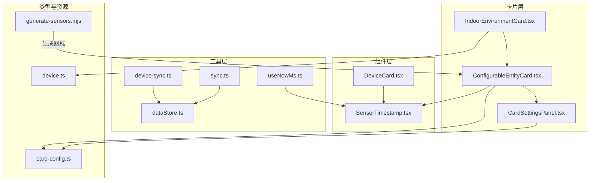
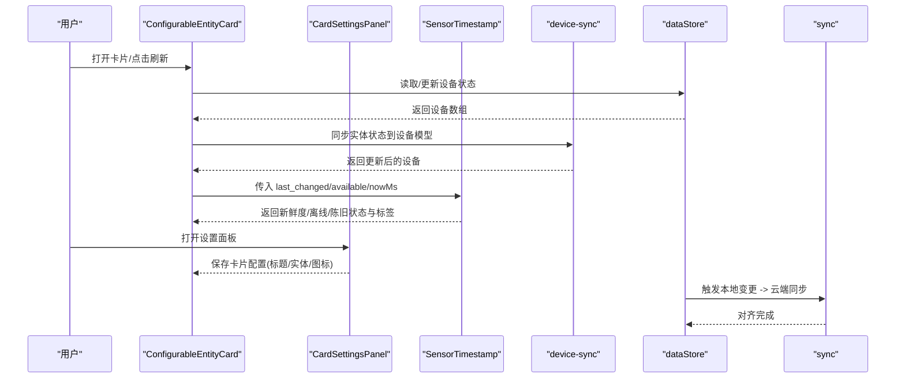
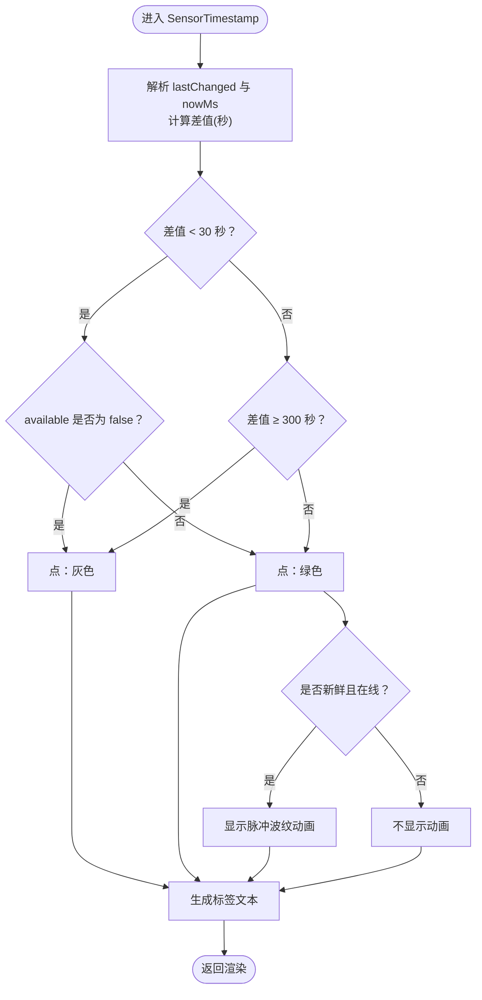
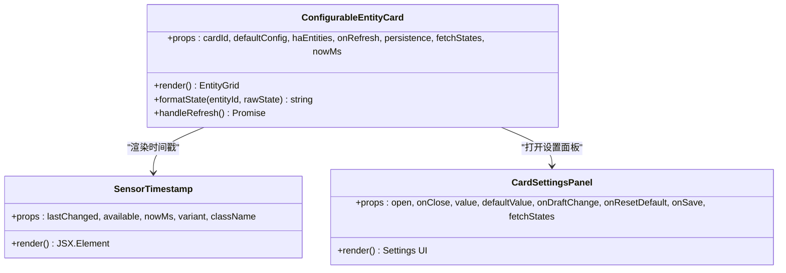
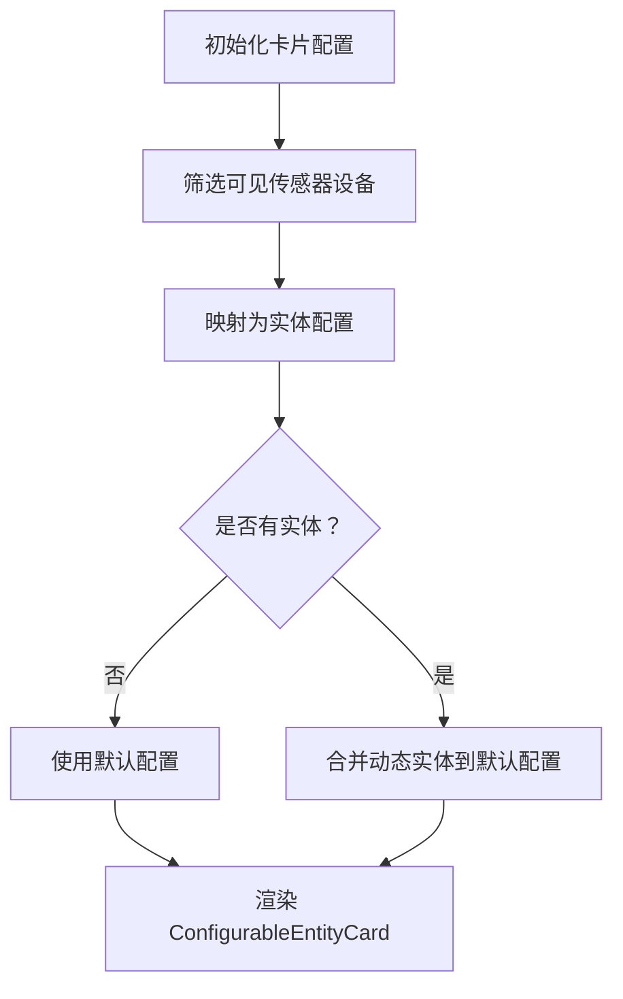
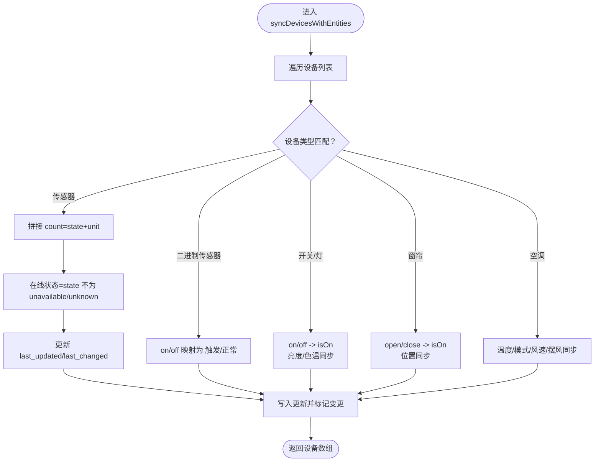
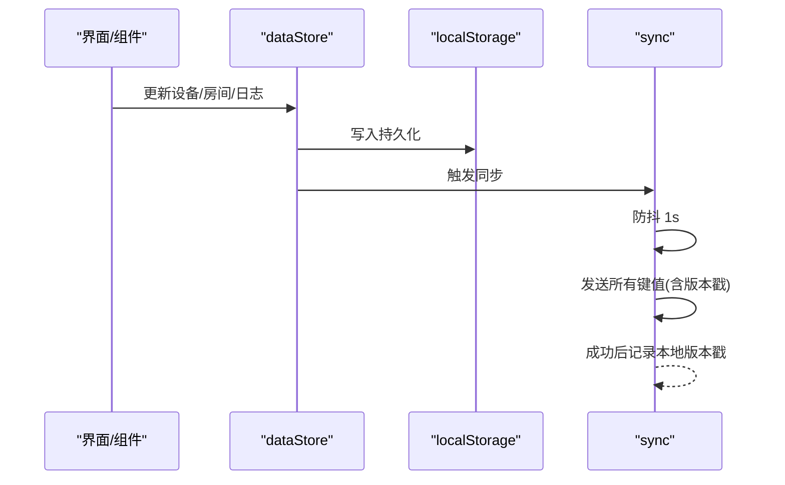
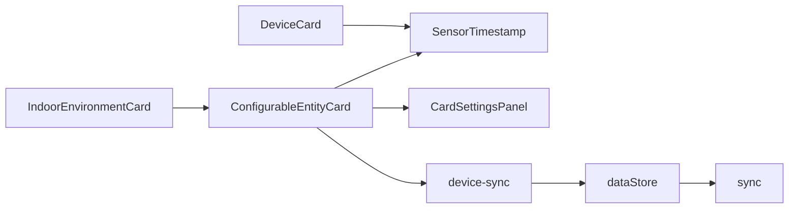

# 传感器监控系统

<cite>
**本文引用的文件**
- [SensorTimestamp.tsx](file://src/app/components/dashboard/SensorTimestamp.tsx)
- [IndoorEnvironmentCard.tsx](file://src/app/components/dashboard/cards/IndoorEnvironment/IndoorEnvironmentCard.tsx)
- [ConfigurableEntityCard.tsx](file://src/app/components/dashboard/cards/shared/ConfigurableEntityCard.tsx)
- [CardSettingsPanel.tsx](file://src/app/components/dashboard/cards/shared/CardSettingsPanel.tsx)
- [device.ts](file://src/types/device.ts)
- [device-sync.ts](file://src/utils/device-sync.ts)
- [useNowMs.ts](file://src/hooks/useNowMs.ts)
- [dataStore.ts](file://src/store/dataStore.ts)
- [sync.ts](file://src/utils/sync.ts)
- [card-config.ts](file://src/types/card-config.ts)
- [generate-sensors.mjs](file://scripts/generate-sensors.mjs)
- [DeviceCard.tsx](file://src/app/components/dashboard/DeviceCard.tsx)
</cite>

## 目录
1. [简介](#简介)
2. [项目结构](#项目结构)
3. [核心组件](#核心组件)
4. [架构总览](#架构总览)
5. [详细组件分析](#详细组件分析)
6. [依赖关系分析](#依赖关系分析)
7. [性能考量](#性能考量)
8. [故障排查指南](#故障排查指南)
9. [结论](#结论)
10. [附录](#附录)

## 简介
本文件面向“传感器监控系统”的技术实现，围绕传感器设备的状态显示逻辑、触发状态判断、时间戳处理、不同传感器类型的特殊处理与状态文本生成、激活动画与颜色编码、视觉反馈机制、实时更新与离线检测、状态同步、阈值与报警机制以及历史数据展示进行系统性梳理，并提供配置与数据分析实践建议。

## 项目结构
本系统以 Home Assistant 生态为核心，前端通过卡片组件聚合传感器实体，结合时间戳组件、设备同步工具与状态存储，形成“配置-渲染-同步-反馈”的闭环。关键模块包括：
- 卡片层：室内环境卡片、可配置实体卡片、设置面板
- 组件层：传感器时间戳、设备卡片动画
- 工具层：设备状态同步、本地存储与云端同步
- 类型层：设备与卡片配置类型定义
- 资源层：传感器图标生成脚本

图表来源
- [IndoorEnvironmentCard.tsx:30-76](file://src/app/components/dashboard/cards/IndoorEnvironment/IndoorEnvironmentCard.tsx#L30-L76)
- [ConfigurableEntityCard.tsx:54-309](file://src/app/components/dashboard/cards/shared/ConfigurableEntityCard.tsx#L54-L309)
- [CardSettingsPanel.tsx:86-369](file://src/app/components/dashboard/cards/shared/CardSettingsPanel.tsx#L86-L369)
- [SensorTimestamp.tsx:7-64](file://src/app/components/dashboard/SensorTimestamp.tsx#L7-L64)
- [device-sync.ts:4-190](file://src/utils/device-sync.ts#L4-L190)
- [dataStore.ts:58-128](file://src/store/dataStore.ts#L58-L128)
- [sync.ts:49-161](file://src/utils/sync.ts#L49-L161)
- [useNowMs.ts:3-14](file://src/hooks/useNowMs.ts#L3-L14)
- [device.ts:1-46](file://src/types/device.ts#L1-L46)
- [card-config.ts:1-14](file://src/types/card-config.ts#L1-L14)
- [generate-sensors.mjs:19-29](file://scripts/generate-sensors.mjs#L19-L29)

章节来源
- [IndoorEnvironmentCard.tsx:1-77](file://src/app/components/dashboard/cards/IndoorEnvironment/IndoorEnvironmentCard.tsx#L1-L77)
- [ConfigurableEntityCard.tsx:1-310](file://src/app/components/dashboard/cards/shared/ConfigurableEntityCard.tsx#L1-L310)
- [CardSettingsPanel.tsx:1-374](file://src/app/components/dashboard/cards/shared/CardSettingsPanel.tsx#L1-L374)
- [SensorTimestamp.tsx:1-65](file://src/app/components/dashboard/SensorTimestamp.tsx#L1-L65)
- [device-sync.ts:1-191](file://src/utils/device-sync.ts#L1-L191)
- [dataStore.ts:1-129](file://src/store/dataStore.ts#L1-L129)
- [sync.ts:1-161](file://src/utils/sync.ts#L1-L161)
- [useNowMs.ts:1-15](file://src/hooks/useNowMs.ts#L1-L15)
- [device.ts:1-46](file://src/types/device.ts#L1-L46)
- [card-config.ts:1-14](file://src/types/card-config.ts#L1-L14)
- [generate-sensors.mjs:19-29](file://scripts/generate-sensors.mjs#L19-L29)

## 核心组件
- 室内环境卡片：动态聚合传感器设备，按类别（温度、湿度、CO2、PM2.5）生成实体列表，支持右上角“舒适”徽章提示。
- 可配置实体卡片：通用卡片容器，负责实体网格渲染、状态格式化、刷新与设置面板交互。
- 传感器时间戳：基于 last_changed 与当前时间计算新鲜度、离线与陈旧状态，提供全量与紧凑两种标签样式。
- 设备同步：将 Home Assistant 实体状态映射到本地设备模型，处理传感器计数文本、在线状态、单位等。
- 状态存储与同步：Zustand 存储设备与房间等数据；localStorage 与服务端双向同步，支持增量对齐与防抖提交。
- 设备卡片动画：安全传感器激活时的旋转波纹动画，配合视觉反馈。

章节来源
- [IndoorEnvironmentCard.tsx:30-76](file://src/app/components/dashboard/cards/IndoorEnvironment/IndoorEnvironmentCard.tsx#L30-L76)
- [ConfigurableEntityCard.tsx:54-309](file://src/app/components/dashboard/cards/shared/ConfigurableEntityCard.tsx#L54-L309)
- [SensorTimestamp.tsx:7-64](file://src/app/components/dashboard/SensorTimestamp.tsx#L7-L64)
- [device-sync.ts:4-190](file://src/utils/device-sync.ts#L4-L190)
- [dataStore.ts:58-128](file://src/store/dataStore.ts#L58-L128)
- [sync.ts:49-161](file://src/utils/sync.ts#L49-L161)
- [DeviceCard.tsx:138-171](file://src/app/components/dashboard/DeviceCard.tsx#L138-L171)

## 架构总览
系统采用“卡片-实体-时间戳-同步-存储”的分层架构：
- 卡片层负责布局与配置持久化
- 实体层负责状态格式化与渲染
- 时间戳层负责新鲜度与离线判定
- 同步层负责与 Home Assistant 的状态对齐与本地/云端一致性
- 存储层负责设备与房间等数据的本地持久化与增量同步

图表来源
- [ConfigurableEntityCard.tsx:142-153](file://src/app/components/dashboard/cards/shared/ConfigurableEntityCard.tsx#L142-L153)
- [CardSettingsPanel.tsx:152-155](file://src/app/components/dashboard/cards/shared/CardSettingsPanel.tsx#L152-L155)
- [SensorTimestamp.tsx:20-38](file://src/app/components/dashboard/SensorTimestamp.tsx#L20-L38)
- [device-sync.ts:4-190](file://src/utils/device-sync.ts#L4-L190)
- [dataStore.ts:58-128](file://src/store/dataStore.ts#L58-L128)
- [sync.ts:49-161](file://src/utils/sync.ts#L49-L161)

## 详细组件分析

### 传感器时间戳组件（SensorTimestamp）
- 输入参数：lastChanged（字符串）、available（布尔）、nowMs（毫秒）、variant（full/compact）、className
- 新鲜度判定：若 lastChanged 存在且与 nowMs 差值小于 30 秒则为“新鲜”
- 离线判定：available 显式为 false
- 陈旧判定：非离线且差值 ≥ 5 分钟
- 视觉反馈：
  - 绿色实心点表示在线且新鲜
  - 灰色实心点表示离线或陈旧
  - 离线时叠加 Wi-Fi 离线图标
  - 新鲜状态下显示脉冲波纹动画
- 文本标签：
  - full 模式：显示完整时间
  - compact 模式：离线显示“离线”，否则显示“更新于 HH:mm:ss”

图表来源
- [SensorTimestamp.tsx:20-38](file://src/app/components/dashboard/SensorTimestamp.tsx#L20-L38)

章节来源
- [SensorTimestamp.tsx:7-64](file://src/app/components/dashboard/SensorTimestamp.tsx#L7-L64)

### 可配置实体卡片（ConfigurableEntityCard）
- 配置持久化：使用 localStorage 存储卡片配置，支持默认配置回退与合并
- 实体渲染：最多展示 6 个实体，两列网格布局，动态计算卡片高度
- 状态格式化：针对二进制传感器与普通实体输出中文状态文本（如“触发/正常”、“开启/关闭”、“离线”等）
- 刷新机制：调用外部 onRefresh 获取最新实体状态
- 设置面板：拖拽排序、搜索添加、图标选择、标题校验与保存

图表来源
- [ConfigurableEntityCard.tsx:54-309](file://src/app/components/dashboard/cards/shared/ConfigurableEntityCard.tsx#L54-L309)
- [SensorTimestamp.tsx:7-64](file://src/app/components/dashboard/SensorTimestamp.tsx#L7-L64)
- [CardSettingsPanel.tsx:86-369](file://src/app/components/dashboard/cards/shared/CardSettingsPanel.tsx#L86-L369)

章节来源
- [ConfigurableEntityCard.tsx:39-52](file://src/app/components/dashboard/cards/shared/ConfigurableEntityCard.tsx#L39-L52)
- [ConfigurableEntityCard.tsx:121-137](file://src/app/components/dashboard/cards/shared/ConfigurableEntityCard.tsx#L121-L137)
- [ConfigurableEntityCard.tsx:247-285](file://src/app/components/dashboard/cards/shared/ConfigurableEntityCard.tsx#L247-L285)
- [ConfigurableEntityCard.tsx:39-52](file://src/app/components/dashboard/cards/shared/ConfigurableEntityCard.tsx#L39-L52)

### 室内环境卡片（IndoorEnvironmentCard）
- 默认配置：包含温度、湿度、CO2、PM2.5 四类实体
- 动态配置：根据设备列表筛选传感器类型（温度、湿度、CO2、PM2.5），并支持自定义名称与图标
- 右侧徽章：显示“舒适”状态提示，配合脉动感

图表来源
- [IndoorEnvironmentCard.tsx:32-56](file://src/app/components/dashboard/cards/IndoorEnvironment/IndoorEnvironmentCard.tsx#L32-L56)

章节来源
- [IndoorEnvironmentCard.tsx:30-76](file://src/app/components/dashboard/cards/IndoorEnvironment/IndoorEnvironmentCard.tsx#L30-L76)

### 设备同步（device-sync）
- 适用设备类型：传感器（含温湿度、光照、PM2.5、CO2、功率、电量等）、二进制传感器、开关/灯、窗帘、空调等
- 同步字段：
  - 传感器：count（值+单位）、在线状态、设备类别、last_updated、last_changed
  - 二进制传感器：根据状态映射为“触发/正常”
  - 开关/灯：on/off、亮度、色温
  - 窗帘：open/close 与当前位置
  - 空调：目标温度、当前温度、模式、风速、摆风等
- 状态映射规则：
  - rawState 为空或 unknown/unavailable → “离线”
  - binary_sensor.*：on → “触发”，off → “正常”
  - 其他：on → “开启”，off → “关闭”

图表来源
- [device-sync.ts:4-190](file://src/utils/device-sync.ts#L4-L190)

章节来源
- [device-sync.ts:60-71](file://src/utils/device-sync.ts#L60-L71)
- [device-sync.ts:72-77](file://src/utils/device-sync.ts#L72-L77)
- [device-sync.ts:22-42](file://src/utils/device-sync.ts#L22-L42)
- [device-sync.ts:43-59](file://src/utils/device-sync.ts#L43-L59)
- [device-sync.ts:78-153](file://src/utils/device-sync.ts#L78-L153)

### 状态存储与云端同步（dataStore + sync）
- Zustand 存储：设备、房间、场景、用户、日志等，支持持久化与部分字段选择
- 本地变更：写入 localStorage 后触发云端同步
- 云端同步：
  - 自动同步：每 30 秒检查远端版本，页面聚焦时对齐
  - 手动同步：本地变更后 1 秒内防抖提交
  - 版本控制：以时间戳作为版本号，仅在远端更新时覆盖本地

图表来源
- [dataStore.ts:106-117](file://src/store/dataStore.ts#L106-L117)
- [sync.ts:52-93](file://src/utils/sync.ts#L52-L93)
- [sync.ts:98-131](file://src/utils/sync.ts#L98-L131)
- [sync.ts:136-150](file://src/utils/sync.ts#L136-L150)

章节来源
- [dataStore.ts:58-128](file://src/store/dataStore.ts#L58-L128)
- [sync.ts:49-161](file://src/utils/sync.ts#L49-L161)

### 设备卡片动画（DeviceCard）
- 安全传感器激活时，显示旋转波纹背景，增强视觉反馈
- 动画参数：持续旋转、透明度渐变、重复无限

章节来源
- [DeviceCard.tsx:138-171](file://src/app/components/dashboard/DeviceCard.tsx#L138-L171)

### 类型与配置
- 设备类型：包含设备类别、可见性、自定义名称与图标、状态与时间戳等字段
- 卡片配置：标题、图标、实体列表（实体 ID、显示名、图标、可见性）

章节来源
- [device.ts:1-46](file://src/types/device.ts#L1-L46)
- [card-config.ts:1-14](file://src/types/card-config.ts#L1-L14)

### 传感器图标生成
- 通过脚本生成多种传感器图标的 SVG，便于在卡片中使用
- 示例：PM2.5、光照、噪声、水浸、门磁、烟雾、气体泄漏、电池、WiFi、告警等

章节来源
- [generate-sensors.mjs:19-29](file://scripts/generate-sensors.mjs#L19-L29)

## 依赖关系分析
- 组件耦合：
  - IndoorEnvironmentCard 依赖 ConfigurableEntityCard 与设备类型过滤
  - ConfigurableEntityCard 依赖 SensorTimestamp 与 CardSettingsPanel
  - DeviceCard 依赖 SensorTimestamp 进行动画联动
- 外部依赖：
  - Home Assistant 实体状态与属性
  - 浏览器 localStorage 与网络请求
  - motion/react 用于动画
- 循环依赖：未发现直接循环导入

图表来源
- [IndoorEnvironmentCard.tsx:58-74](file://src/app/components/dashboard/cards/IndoorEnvironment/IndoorEnvironmentCard.tsx#L58-L74)
- [ConfigurableEntityCard.tsx:54-309](file://src/app/components/dashboard/cards/shared/ConfigurableEntityCard.tsx#L54-L309)
- [SensorTimestamp.tsx:7-64](file://src/app/components/dashboard/SensorTimestamp.tsx#L7-L64)
- [CardSettingsPanel.tsx:86-369](file://src/app/components/dashboard/cards/shared/CardSettingsPanel.tsx#L86-L369)
- [device-sync.ts:4-190](file://src/utils/device-sync.ts#L4-L190)
- [dataStore.ts:58-128](file://src/store/dataStore.ts#L58-L128)
- [sync.ts:49-161](file://src/utils/sync.ts#L49-L161)
- [DeviceCard.tsx:138-171](file://src/app/components/dashboard/DeviceCard.tsx#L138-L171)

## 性能考量
- 渲染优化：
  - ConfigurableEntityCard 使用 useMemo 控制实体列表长度与网格高度，避免频繁重排
  - SensorTimestamp 仅在时间戳或可用性变化时重新计算
- 状态同步：
  - 同步防抖：本地变更后延迟 1 秒提交，减少网络压力
  - 增量对齐：仅在远端版本更新时覆盖本地，降低冲突概率
- 实时性：
  - useNowMs 提供 1 秒级时间源，确保时间戳组件高频刷新但不阻塞主线程

章节来源
- [ConfigurableEntityCard.tsx:121-137](file://src/app/components/dashboard/cards/shared/ConfigurableEntityCard.tsx#L121-L137)
- [SensorTimestamp.tsx:20-38](file://src/app/components/dashboard/SensorTimestamp.tsx#L20-L38)
- [sync.ts:52-93](file://src/utils/sync.ts#L52-L93)
- [sync.ts:98-131](file://src/utils/sync.ts#L98-L131)
- [useNowMs.ts:3-14](file://src/hooks/useNowMs.ts#L3-L14)

## 故障排查指南
- 离线与陈旧显示异常
  - 检查 last_changed 是否正确传递给 SensorTimestamp
  - 确认 nowMs 来源与浏览器时间一致
- 实体状态不更新
  - 确认 onRefresh 是否被调用，fetchStates 是否返回最新实体列表
  - 检查 device-sync 是否正确映射状态与单位
- 配置无法保存
  - 检查 localStorage 写入权限与容量
  - 确认 sync.ts 的同步流程是否成功返回
- 动画不生效
  - 确认 isSensorActive 状态与 DeviceCard 的动画条件一致

章节来源
- [SensorTimestamp.tsx:20-38](file://src/app/components/dashboard/SensorTimestamp.tsx#L20-L38)
- [ConfigurableEntityCard.tsx:142-153](file://src/app/components/dashboard/cards/shared/ConfigurableEntityCard.tsx#L142-L153)
- [device-sync.ts:155-186](file://src/utils/device-sync.ts#L155-L186)
- [sync.ts:74-93](file://src/utils/sync.ts#L74-L93)
- [DeviceCard.tsx:138-171](file://src/app/components/dashboard/DeviceCard.tsx#L138-L171)

## 结论
该传感器监控系统通过卡片化聚合、时间戳新鲜度判定、设备状态同步与云端对齐，实现了对温度、湿度、光照、空气质量与安全传感器的统一可视化与实时反馈。系统具备良好的扩展性与可配置性，适合在 Home Assistant 生态下部署与维护。

## 附录

### 传感器类型与状态文本映射
- 二进制传感器（binary_sensor.*）：on → “触发”，off → “正常”
- 普通实体：on → “开启”，off → “关闭”
- 离线状态：rawState 为 unavailable 或 unknown 时显示“离线”
- 未知状态：rawState 为空时显示“--”

章节来源
- [ConfigurableEntityCard.tsx:39-52](file://src/app/components/dashboard/cards/shared/ConfigurableEntityCard.tsx#L39-L52)

### 时间戳判定阈值
- 新鲜：last_changed 与 nowMs 差值 < 30 秒
- 陈旧：last_changed 与 nowMs 差值 ≥ 300 秒
- 离线：available 显式为 false

章节来源
- [SensorTimestamp.tsx:20-24](file://src/app/components/dashboard/SensorTimestamp.tsx#L20-L24)

### 配置实用指南
- 卡片标题与图标：通过设置面板自定义，支持搜索与拖拽排序
- 实体选择：最多 6 个，支持自定义显示名与图标
- 默认配置：当无设备匹配时自动回退到默认模板

章节来源
- [CardSettingsPanel.tsx:220-292](file://src/app/components/dashboard/cards/shared/CardSettingsPanel.tsx#L220-L292)
- [IndoorEnvironmentCard.tsx:32-56](file://src/app/components/dashboard/cards/IndoorEnvironment/IndoorEnvironmentCard.tsx#L32-L56)

### 数据分析方法
- 新鲜度分析：统计各实体“新鲜/陈旧/离线”占比，识别离线热点
- 趋势分析：结合 last_updated/last_changed 与单位，绘制数值趋势图
- 报警阈值：在业务层为不同传感器设定阈值，结合二进制状态生成报警事件（需在上层业务逻辑中实现）

章节来源
- [device-sync.ts:167-170](file://src/utils/device-sync.ts#L167-L170)
- [SensorTimestamp.tsx:29-30](file://src/app/components/dashboard/SensorTimestamp.tsx#L29-L30)