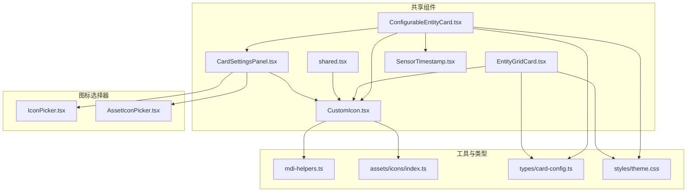
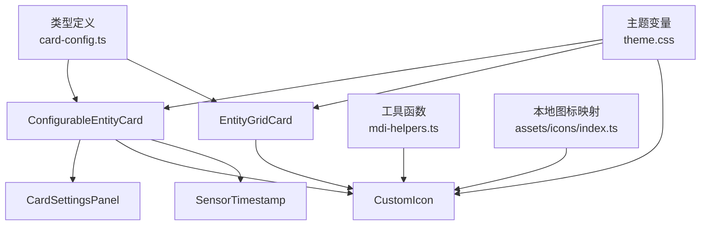
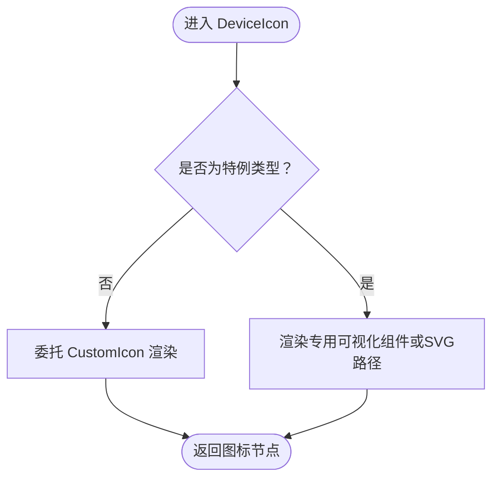
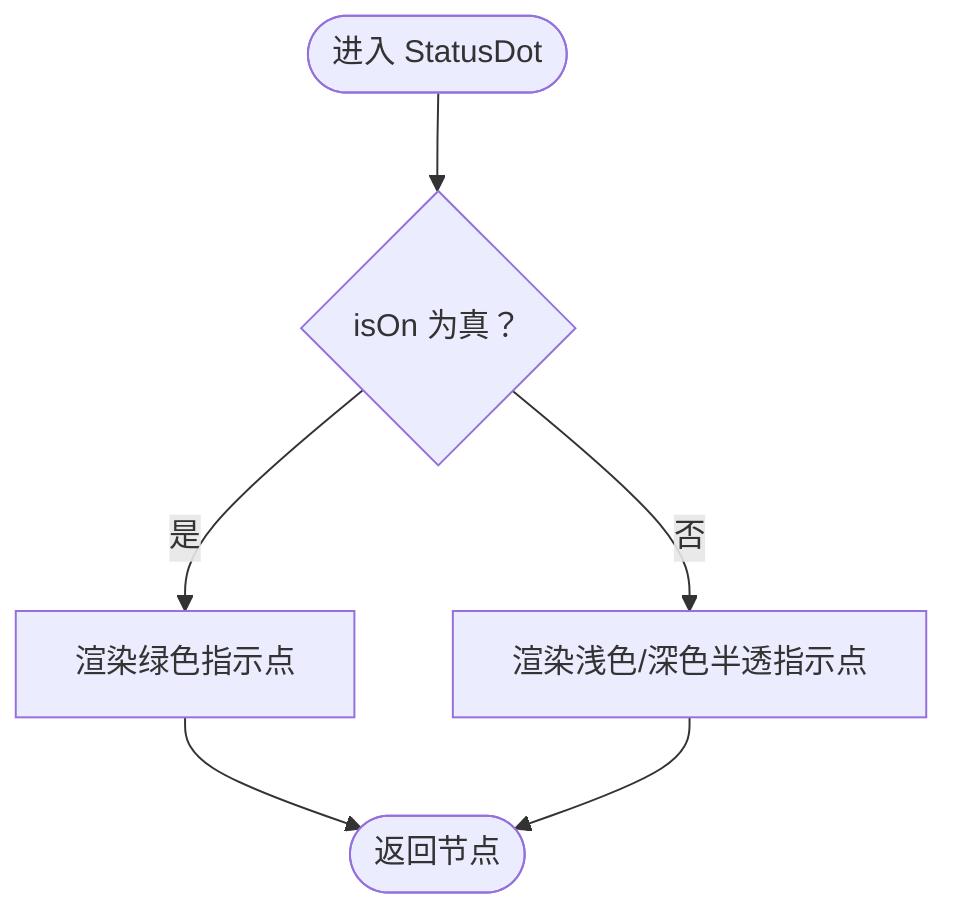
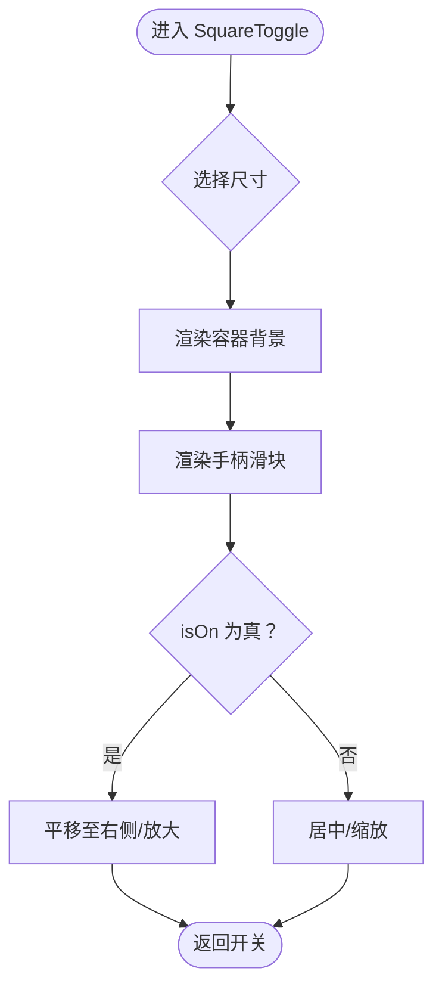
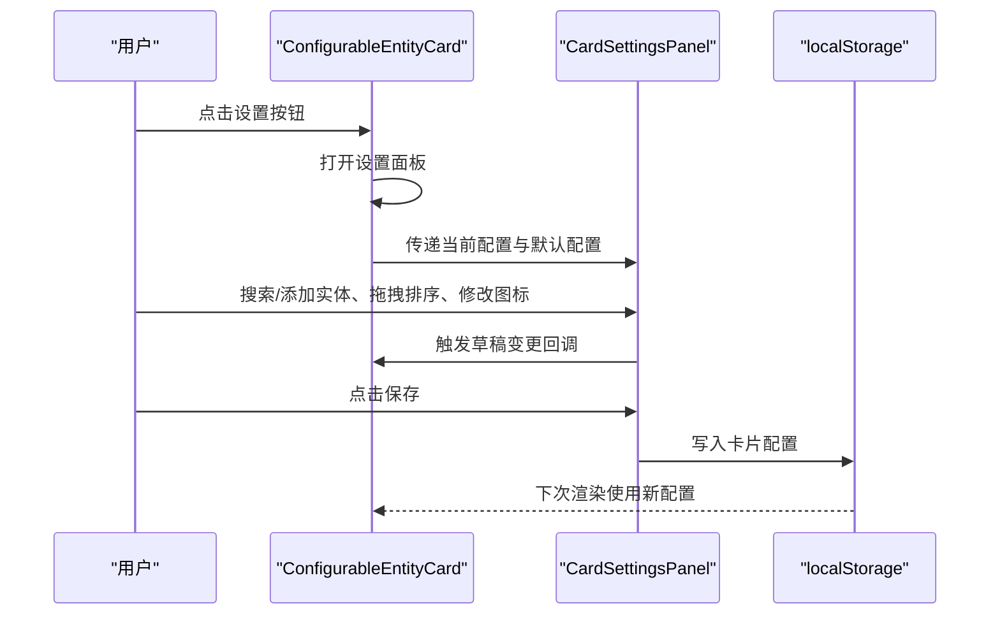
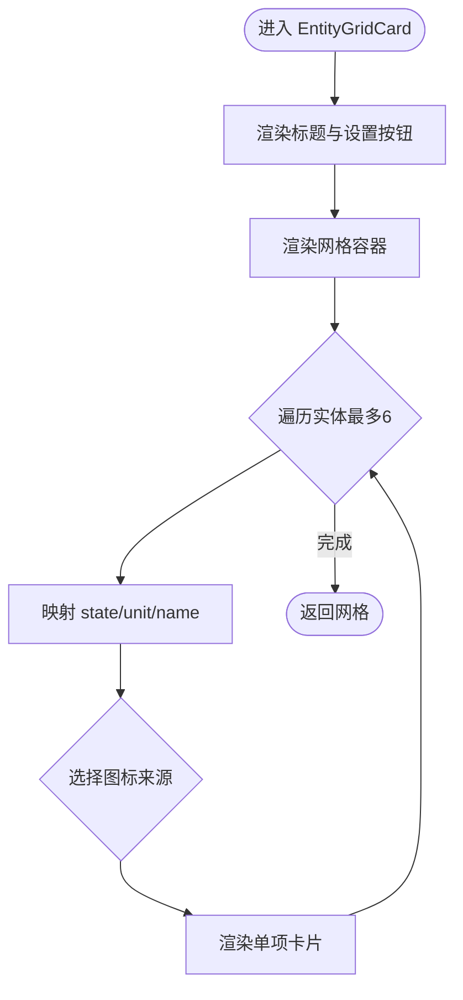
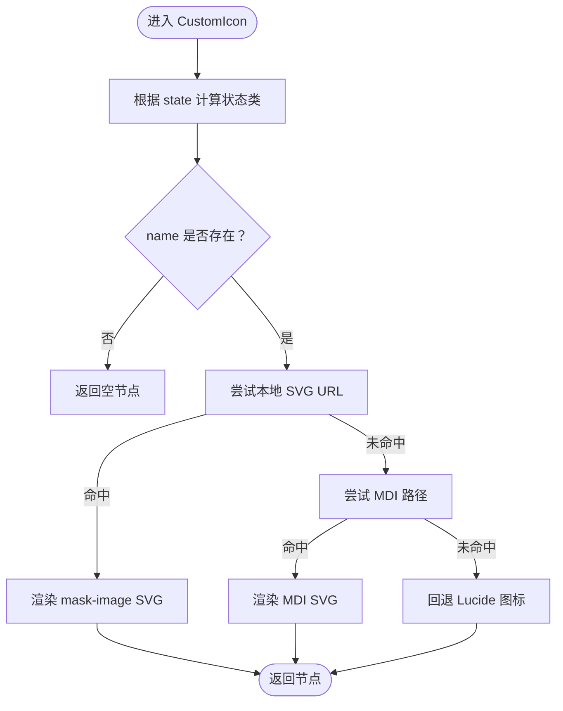
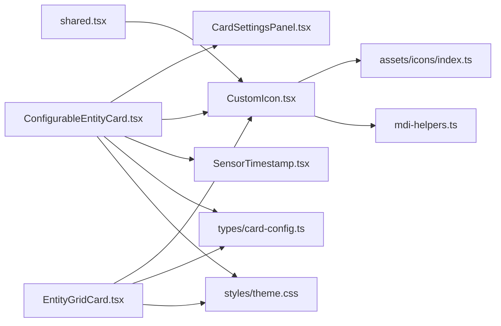

# 共享组件库

<cite>
**本文引用的文件**
- [ConfigurableEntityCard.tsx](file://src/app/components/dashboard/cards/shared/ConfigurableEntityCard.tsx)
- [EntityGridCard.tsx](file://src/app/components/dashboard/cards/shared/EntityGridCard.tsx)
- [CustomIcon.tsx](file://src/app/components/dashboard/cards/shared/CustomIcon.tsx)
- [CardSettingsPanel.tsx](file://src/app/components/dashboard/cards/shared/CardSettingsPanel.tsx)
- [cardSettings.validation.ts](file://src/app/components/dashboard/cards/shared/cardSettings.validation.ts)
- [shared.tsx](file://src/app/components/dashboard/cards/shared.tsx)
- [SensorTimestamp.tsx](file://src/app/components/dashboard/SensorTimestamp.tsx)
- [IconPicker.tsx](file://src/app/components/dashboard/IconPicker.tsx)
- [AssetIconPicker.tsx](file://src/app/components/dashboard/AssetIconPicker.tsx)
- [mdi-helpers.ts](file://src/utils/mdi-helpers.ts)
- [index.ts](file://src/assets/icons/index.ts)
- [card-config.ts](file://src/types/card-config.ts)
- [theme.css](file://src/styles/theme.css)
- [device-icon-change.cy.ts](file://cypress/e2e/device-icon-change.cy.ts)
</cite>

## 目录
1. [简介](#简介)
2. [项目结构](#项目结构)
3. [核心组件](#核心组件)
4. [架构总览](#架构总览)
5. [组件详解](#组件详解)
6. [依赖关系分析](#依赖关系分析)
7. [性能考量](#性能考量)
8. [故障排查指南](#故障排查指南)
9. [结论](#结论)
10. [附录](#附录)

## 简介
本文件面向设备控制场景下的共享组件库，系统化梳理通用组件的设计模式、复用策略与接口规范，重点覆盖以下内容：
- 设备图标组件 DeviceIcon 的多源图标支持与状态渲染
- 状态指示器 StatusDot 的视觉语义与主题适配
- 切换按钮 SquareToggle 的交互与尺寸策略
- 配置实体卡片 ConfigurableEntityCard 的通用逻辑与扩展机制
- 实体网格卡片 EntityGridCard 的布局算法与响应式设计
- 统一图标系统 CustomIcon 的多源适配与可定制性
- 样式系统、主题变量与容器查询的适配策略
- 最佳实践与性能优化建议

## 项目结构
共享组件主要位于 dashboard 的 shared 子目录，配合工具层的图标与类型定义，形成“组件 + 工具 + 类型”的分层组织。

图表来源
- [ConfigurableEntityCard.tsx:1-310](file://src/app/components/dashboard/cards/shared/ConfigurableEntityCard.tsx#L1-L310)
- [EntityGridCard.tsx:1-58](file://src/app/components/dashboard/cards/shared/EntityGridCard.tsx#L1-L58)
- [CustomIcon.tsx:1-74](file://src/app/components/dashboard/cards/shared/CustomIcon.tsx#L1-L74)
- [CardSettingsPanel.tsx:1-374](file://src/app/components/dashboard/cards/shared/CardSettingsPanel.tsx#L1-L374)
- [shared.tsx:1-250](file://src/app/components/dashboard/cards/shared.tsx#L1-L250)
- [mdi-helpers.ts:1-155](file://src/utils/mdi-helpers.ts#L1-L155)
- [index.ts:1-234](file://src/assets/icons/index.ts#L1-L234)
- [card-config.ts:1-14](file://src/types/card-config.ts#L1-L14)
- [theme.css:1-207](file://src/styles/theme.css#L1-L207)

章节来源
- [ConfigurableEntityCard.tsx:1-310](file://src/app/components/dashboard/cards/shared/ConfigurableEntityCard.tsx#L1-L310)
- [EntityGridCard.tsx:1-58](file://src/app/components/dashboard/cards/shared/EntityGridCard.tsx#L1-L58)
- [CustomIcon.tsx:1-74](file://src/app/components/dashboard/cards/shared/CustomIcon.tsx#L1-L74)
- [CardSettingsPanel.tsx:1-374](file://src/app/components/dashboard/cards/shared/CardSettingsPanel.tsx#L1-L374)
- [shared.tsx:1-250](file://src/app/components/dashboard/cards/shared.tsx#L1-L250)
- [mdi-helpers.ts:1-155](file://src/utils/mdi-helpers.ts#L1-L155)
- [index.ts:1-234](file://src/assets/icons/index.ts#L1-L234)
- [card-config.ts:1-14](file://src/types/card-config.ts#L1-L14)
- [theme.css:1-207](file://src/styles/theme.css#L1-L207)

## 核心组件
- 设备图标组件 DeviceIcon：基于统一图标系统，支持本地 SVG、MDI 与 Lucide 回退；按设备状态动态着色。
- 状态指示器 StatusDot：以点状颜色表达在线/离线状态，兼容明暗主题。
- 切换按钮 SquareToggle：方形开关，支持 normal/small 尺寸，内置过渡动画。
- 配置实体卡片 ConfigurableEntityCard：卡片级配置持久化、内联标题编辑、系统图标选择器、实体网格展示、刷新与设置面板。
- 实体网格卡片 EntityGridCard：简洁实体网格布局，支持最多6项、可见性过滤与单位显示。
- 统一图标 CustomIcon：优先本地 SVG，其次 MDI，最后 Lucide，支持状态态样式叠加。
- 图标选择器 IconPicker/AssetIconPicker：提供搜索、分类与拖拽排序的实体图标选择体验。
- 时间戳组件 SensorTimestamp：结合在线/离线与新鲜度状态，提供微动效与紧凑标签。

章节来源
- [shared.tsx:32-178](file://src/app/components/dashboard/cards/shared.tsx#L32-L178)
- [ConfigurableEntityCard.tsx:54-309](file://src/app/components/dashboard/cards/shared/ConfigurableEntityCard.tsx#L54-L309)
- [EntityGridCard.tsx:15-57](file://src/app/components/dashboard/cards/shared/EntityGridCard.tsx#L15-L57)
- [CustomIcon.tsx:13-73](file://src/app/components/dashboard/cards/shared/CustomIcon.tsx#L13-L73)
- [IconPicker.tsx:1-55](file://src/app/components/dashboard/IconPicker.tsx#L1-L55)
- [AssetIconPicker.tsx:1-145](file://src/app/components/dashboard/AssetIconPicker.tsx#L1-L145)
- [SensorTimestamp.tsx:40-64](file://src/app/components/dashboard/SensorTimestamp.tsx#L40-L64)

## 架构总览
共享组件通过“类型定义 + 工具函数 + 组件实现”的方式解耦数据与视图，形成高内聚、低耦合的复用单元。配置实体卡片作为上层容器，组合多个共享组件与工具能力，实现“可配置、可扩展、可持久化”的卡片体系。

图表来源
- [card-config.ts:1-14](file://src/types/card-config.ts#L1-L14)
- [mdi-helpers.ts:1-155](file://src/utils/mdi-helpers.ts#L1-L155)
- [index.ts:1-234](file://src/assets/icons/index.ts#L1-L234)
- [ConfigurableEntityCard.tsx:1-310](file://src/app/components/dashboard/cards/shared/ConfigurableEntityCard.tsx#L1-L310)
- [EntityGridCard.tsx:1-58](file://src/app/components/dashboard/cards/shared/EntityGridCard.tsx#L1-L58)
- [CustomIcon.tsx:1-74](file://src/app/components/dashboard/cards/shared/CustomIcon.tsx#L1-L74)
- [SensorTimestamp.tsx:40-64](file://src/app/components/dashboard/SensorTimestamp.tsx#L40-L64)
- [theme.css:1-207](file://src/styles/theme.css#L1-L207)

## 组件详解

### 设备图标组件 DeviceIcon
- 设计要点
  - 多源图标支持：优先本地 SVG（assets/icons），其次 MDI（@mdi/js），最后 Lucide 回退。
  - 状态态样式：根据 isOn 状态应用不同文本色（如开启态绿色）。
  - 设备特例：窗帘、门、水、运动等设备使用专用可视化组件或 SVG 路径。
- 接口规范
  - 输入：icon（字符串）、isOn（布尔）、type（设备类型）、value（部分设备需要的数值）。
  - 输出：符合容器宽高的图标元素，避免拉伸与变形。
- 可定制性
  - 通过统一图标系统扩展本地 SVG 或 MDI 名称。
  - 支持传入 className 进一步覆盖样式。

图表来源
- [shared.tsx:109-149](file://src/app/components/dashboard/cards/shared.tsx#L109-L149)
- [CustomIcon.tsx:13-73](file://src/app/components/dashboard/cards/shared/CustomIcon.tsx#L13-L73)

章节来源
- [shared.tsx:109-149](file://src/app/components/dashboard/cards/shared.tsx#L109-L149)
- [CustomIcon.tsx:13-73](file://src/app/components/dashboard/cards/shared/CustomIcon.tsx#L13-L73)

### 状态指示器 StatusDot
- 设计要点
  - 使用小圆点表达在线/离线状态，开启态采用品牌色，关闭态采用半透明背景。
  - 兼容明暗主题，确保对比度与可读性。
- 接口规范
  - 输入：isOn（布尔）。
  - 输出：固定尺寸的圆形指示器。

图表来源
- [shared.tsx:32-36](file://src/app/components/dashboard/cards/shared.tsx#L32-L36)

章节来源
- [shared.tsx:32-36](file://src/app/components/dashboard/cards/shared.tsx#L32-L36)

### 切换按钮 SquareToggle
- 设计要点
  - 容器与手柄分离：容器代表开关背景，手柄代表滑块，通过平移/缩放实现状态过渡。
  - 尺寸策略：normal 与 small 两种尺寸，保证在不同卡片密度下的协调。
- 接口规范
  - 输入：isOn（布尔）、size（'normal' | 'small'）。
  - 输出：方形开关元素，支持 hover/active 状态。

图表来源
- [shared.tsx:38-55](file://src/app/components/dashboard/cards/shared.tsx#L38-L55)

章节来源
- [shared.tsx:38-55](file://src/app/components/dashboard/cards/shared.tsx#L38-L55)

### 配置实体卡片 ConfigurableEntityCard
- 设计要点
  - 配置持久化：localStorage 读写卡片配置，支持默认配置回退与合并。
  - 内联编辑：点击标题进入输入框，支持 Enter/Escape 快捷键。
  - 图标更换：系统图标选择器，统一入口与对齐策略。
  - 实体网格：最多6项，两列布局，动态计算卡片高度（行跨度）。
  - 刷新与错误处理：调用外部 onRefresh，捕获异常并提示。
  - 设置面板：滑入式配置面板，支持实体搜索、拖拽排序、图标选择与保存。
- 接口规范
  - Props：cardId、defaultConfig、haEntities、onRefresh、persistence、fetchStates、rightBadge、nowMs、onHeightChange。
  - 内部状态：刷新中、错误信息、设置面板开关、标题草稿、活动配置。
- 扩展机制
  - 通过 CardSettingsPanel 的表单与字段数组扩展实体字段。
  - 通过 IconPickerPopover 与 CustomIcon 组合实现图标扩展。
  - 通过 localStorage 键前缀实现多卡片隔离。

图表来源
- [ConfigurableEntityCard.tsx:54-309](file://src/app/components/dashboard/cards/shared/ConfigurableEntityCard.tsx#L54-L309)
- [CardSettingsPanel.tsx:86-374](file://src/app/components/dashboard/cards/shared/CardSettingsPanel.tsx#L86-L374)

章节来源
- [ConfigurableEntityCard.tsx:54-309](file://src/app/components/dashboard/cards/shared/ConfigurableEntityCard.tsx#L54-L309)
- [CardSettingsPanel.tsx:86-374](file://src/app/components/dashboard/cards/shared/CardSettingsPanel.tsx#L86-L374)
- [cardSettings.validation.ts:1-15](file://src/app/components/dashboard/cards/shared/cardSettings.validation.ts#L1-L15)

### 实体网格卡片 EntityGridCard
- 设计要点
  - 布局：两列到三列自适应（sm:grid-cols-3），最大6项。
  - 数据映射：从 data 映射 state/unit/name，图标优先使用配置，其次实体属性，最后回退。
  - 交互：设置按钮触发 onSettingsClick。
- 接口规范
  - Props：title、icon、entities、data、onSettingsClick、className。
  - 渲染：网格容器 + 单项卡片（图标+单位+状态值+名称）。

图表来源
- [EntityGridCard.tsx:15-57](file://src/app/components/dashboard/cards/shared/EntityGridCard.tsx#L15-L57)

章节来源
- [EntityGridCard.tsx:15-57](file://src/app/components/dashboard/cards/shared/EntityGridCard.tsx#L15-L57)

### 统一图标 CustomIcon
- 设计要点
  - 优先级：本地 SVG URL → MDI 路径 → Lucide 回退。
  - 状态态：default/active/alarm 三种状态，分别绑定不同文本色。
  - 样式拼接：将 stateClass 与传入 className 合并，保证可定制性。
- 接口规范
  - Props：name（字符串）、className（字符串）、state（'default' | 'active' | 'alarm'）。
  - 返回：SVG 或 span 元素，具备可访问性属性。

图表来源
- [CustomIcon.tsx:13-73](file://src/app/components/dashboard/cards/shared/CustomIcon.tsx#L13-L73)
- [index.ts:230-234](file://src/assets/icons/index.ts#L230-L234)
- [mdi-helpers.ts:99-107](file://src/utils/mdi-helpers.ts#L99-L107)

章节来源
- [CustomIcon.tsx:13-73](file://src/app/components/dashboard/cards/shared/CustomIcon.tsx#L13-L73)
- [index.ts:230-234](file://src/assets/icons/index.ts#L230-L234)
- [mdi-helpers.ts:99-107](file://src/utils/mdi-helpers.ts#L99-L107)

### 图标选择器与搜索
- IconPicker：默认展示常用 MDI 图标，支持英文/中文搜索，输入框清空与高亮。
- AssetIconPicker：按分类展示图标，支持搜索与底部选中提示，使用 MDI 元数据与关键词映射。
- 与配置实体卡片集成：通过 IconPickerPopover 包裹，统一触发与对齐。

章节来源
- [IconPicker.tsx:1-55](file://src/app/components/dashboard/IconPicker.tsx#L1-L55)
- [AssetIconPicker.tsx:1-145](file://src/app/components/dashboard/AssetIconPicker.tsx#L1-L145)
- [mdi-helpers.ts:109-149](file://src/utils/mdi-helpers.ts#L109-L149)

### 时间戳组件 SensorTimestamp
- 设计要点
  - 在线/离线状态：离线时显示 Wi-Fi 图标。
  - 新鲜度动画：在线且新鲜时显示脉冲波纹效果。
  - 紧凑标签：时间标签使用等宽数字与紧凑字号。
- 接口规范
  - Props：lastChanged、available、nowMs、variant、className。
  - 返回：包含点状指示器、可选 Wi-Fi 图标与时间标签的紧凑容器。

章节来源
- [SensorTimestamp.tsx:40-64](file://src/app/components/dashboard/SensorTimestamp.tsx#L40-L64)

## 依赖关系分析

图表来源
- [ConfigurableEntityCard.tsx:1-310](file://src/app/components/dashboard/cards/shared/ConfigurableEntityCard.tsx#L1-L310)
- [EntityGridCard.tsx:1-58](file://src/app/components/dashboard/cards/shared/EntityGridCard.tsx#L1-L58)
- [CustomIcon.tsx:1-74](file://src/app/components/dashboard/cards/shared/CustomIcon.tsx#L1-L74)
- [shared.tsx:1-250](file://src/app/components/dashboard/cards/shared.tsx#L1-L250)
- [index.ts:1-234](file://src/assets/icons/index.ts#L1-L234)
- [mdi-helpers.ts:1-155](file://src/utils/mdi-helpers.ts#L1-L155)
- [card-config.ts:1-14](file://src/types/card-config.ts#L1-L14)
- [theme.css:1-207](file://src/styles/theme.css#L1-L207)

章节来源
- [ConfigurableEntityCard.tsx:1-310](file://src/app/components/dashboard/cards/shared/ConfigurableEntityCard.tsx#L1-L310)
- [EntityGridCard.tsx:1-58](file://src/app/components/dashboard/cards/shared/EntityGridCard.tsx#L1-L58)
- [CustomIcon.tsx:1-74](file://src/app/components/dashboard/cards/shared/CustomIcon.tsx#L1-L74)
- [shared.tsx:1-250](file://src/app/components/dashboard/cards/shared.tsx#L1-L250)
- [index.ts:1-234](file://src/assets/icons/index.ts#L1-L234)
- [mdi-helpers.ts:1-155](file://src/utils/mdi-helpers.ts#L1-L155)
- [card-config.ts:1-14](file://src/types/card-config.ts#L1-L14)
- [theme.css:1-207](file://src/styles/theme.css#L1-L207)

## 性能考量
- 渲染优化
  - ConfigurableEntityCard 使用 useMemo 缓存 entitiesToShow，减少网格重渲染。
  - EntityGridCard 对实体进行可见性过滤与切片（最多6项），降低 DOM 数量。
  - CustomIcon 优先使用本地 SVG 与 MDI 路径，避免不必要的组件实例化。
- 交互优化
  - 设置面板使用受控表单与草稿回调，避免频繁写入存储。
  - 刷新流程限制并发，防止重复请求。
- 主题与容器查询
  - theme.css 中的主题变量与容器查询用于按屏幕宽度缩放实体卡片内的图标与文字，提升在不同设备上的可读性与一致性。

章节来源
- [ConfigurableEntityCard.tsx:121-137](file://src/app/components/dashboard/cards/shared/ConfigurableEntityCard.tsx#L121-L137)
- [EntityGridCard.tsx:30-54](file://src/app/components/dashboard/cards/shared/EntityGridCard.tsx#L30-L54)
- [CustomIcon.tsx:13-73](file://src/app/components/dashboard/cards/shared/CustomIcon.tsx#L13-L73)
- [theme.css:183-207](file://src/styles/theme.css#L183-L207)

## 故障排查指南
- 图标不显示或回退异常
  - 检查 name 是否存在于本地图标映射或 MDI 元数据中。
  - 确认 getIconUrl 与 getMdiIconPath 的返回值。
- 图标选择器无法搜索
  - 确认搜索关键词是否能映射到英文关键词，检查搜索评分与 limit。
- 配置保存失败
  - 检查 localStorage 写入权限与容量限制。
  - 确认 CardSettingsPanel 的保存回调与 ConfigurableEntityCard 的写入逻辑。
- 时间戳动画异常
  - 检查 lastChanged、available 与 nowMs 的传入值，确保 fresh 条件成立。
- E2E 测试参考
  - 设备图标变更与持久化可通过端到端测试验证。

章节来源
- [index.ts:230-234](file://src/assets/icons/index.ts#L230-L234)
- [mdi-helpers.ts:109-149](file://src/utils/mdi-helpers.ts#L109-L149)
- [CardSettingsPanel.tsx:152-155](file://src/app/components/dashboard/cards/shared/CardSettingsPanel.tsx#L152-L155)
- [ConfigurableEntityCard.tsx:32-37](file://src/app/components/dashboard/cards/shared/ConfigurableEntityCard.tsx#L32-L37)
- [SensorTimestamp.tsx:40-64](file://src/app/components/dashboard/SensorTimestamp.tsx#L40-L64)
- [device-icon-change.cy.ts:1-45](file://cypress/e2e/device-icon-change.cy.ts#L1-L45)

## 结论
该共享组件库围绕“统一图标系统 + 可配置卡片 + 主题适配”的目标，构建了高复用、强扩展的设备控制组件体系。通过明确的接口规范、清晰的数据流与完善的工具链，既满足快速迭代需求，又兼顾性能与可维护性。建议在后续版本中进一步完善组件的无障碍属性与国际化支持，并持续优化图标搜索与缓存策略。

## 附录
- 最佳实践
  - 使用统一图标系统，避免混用多套图标库。
  - 在卡片容器中使用 onHeightChange 控制网格高度，保持布局稳定。
  - 配置面板尽量使用受控表单与草稿回调，减少存储压力。
  - 主题变量集中管理，容器查询与响应式断点统一规划。
- 性能优化建议
  - 对长列表使用虚拟滚动或分页。
  - 图标资源预加载与缓存策略优化。
  - 减少不必要的 re-render，合理使用 memo 与 key。
  - 使用 CSS 变量与容器查询替代复杂 JS 计算。