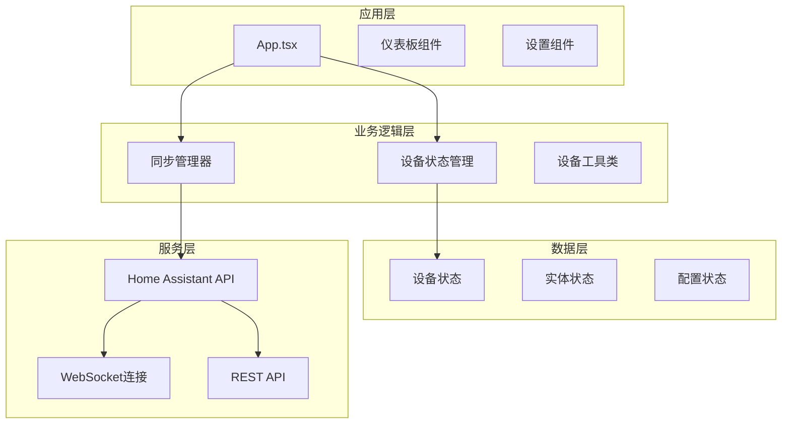
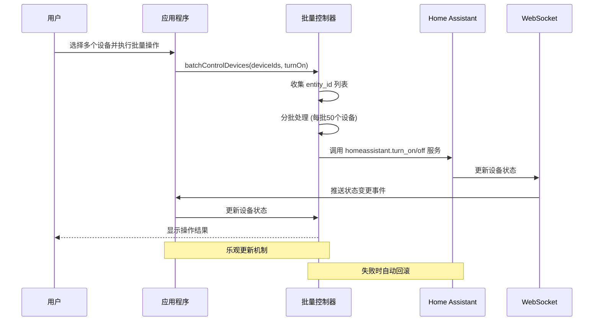
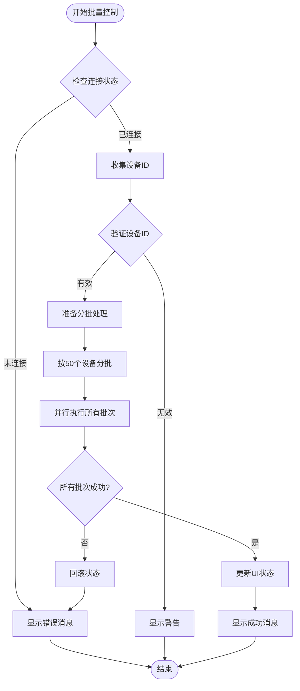
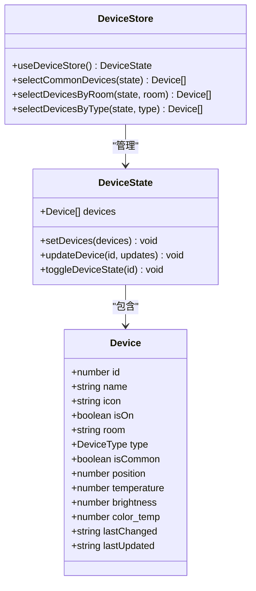
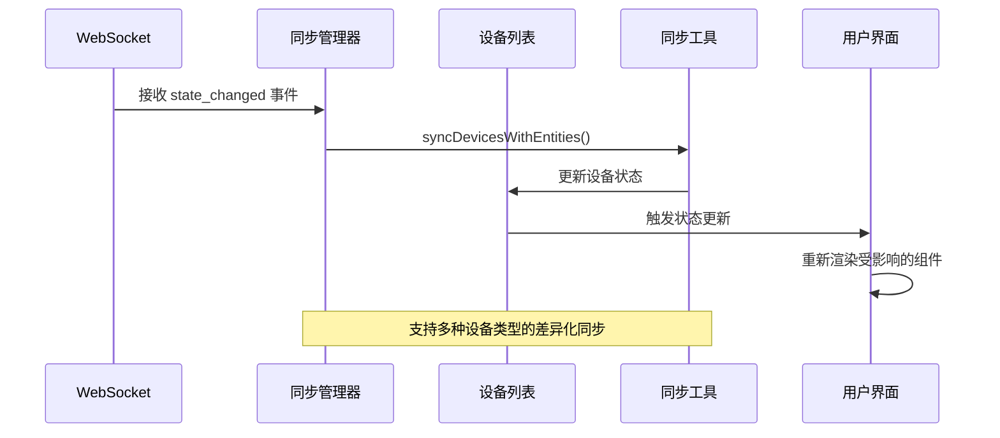
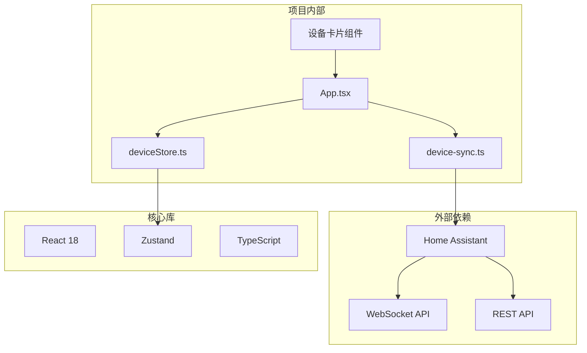

# 批量设备控制

<cite>
**本文档引用的文件**
- [README.md](file://README.md)
- [App.tsx](file://src/app/App.tsx)
- [deviceStore.ts](file://src/store/deviceStore.ts)
- [device.ts](file://src/types/device.ts)
- [device-sync.ts](file://src/utils/device-sync.ts)
- [useHASyncManager.ts](file://src/hooks/useHASyncManager.ts)
- [DeviceDiscoveryPanel.tsx](file://src/app/components/settings/DeviceDiscoveryPanel.tsx)
- [LightControl.tsx](file://src/app/components/dashboard/cards/LightControl.tsx)
- [CurtainControl.tsx](file://src/app/components/dashboard/cards/CurtainControl.tsx)
- [ClimateControl.tsx](file://src/app/components/dashboard/cards/ClimateControl.tsx)
- [DeviceCard.tsx](file://src/app/components/dashboard/DeviceCard.tsx)
- [shared.tsx](file://src/app/components/dashboard/cards/shared.tsx)
- [ConfigurableEntityCard.tsx](file://src/app/components/dashboard/cards/shared/ConfigurableEntityCard.tsx)
</cite>

## 目录
1. [简介](#简介)
2. [项目结构](#项目结构)
3. [核心组件](#核心组件)
4. [架构概览](#架构概览)
5. [详细组件分析](#详细组件分析)
6. [依赖关系分析](#依赖关系分析)
7. [性能考虑](#性能考虑)
8. [故障排除指南](#故障排除指南)
9. [结论](#结论)

## 简介

HAUI Dashboard 是一个专为 Home Assistant 打造的高性能现代化前端控制面板，其中的批量设备控制功能是其核心特性之一。该功能允许用户同时控制多个设备，通过减少 WebSocket 请求开销来提升用户体验。

根据项目 README 的功能特性描述，批量控制功能具有以下特点：
- 一键开关，实时状态同步
- 多设备同时控制，减少请求
- 乐观更新机制
- 失败回滚机制
- 分批处理大量设备

## 项目结构

该项目采用现代化的 React 18 + TypeScript 技术栈，使用 Vite 6.3.5 进行构建，Tailwind CSS 4 进行样式设计。项目结构清晰，采用功能模块化的组织方式。

**图表来源**
- [App.tsx:710-778](file://src/app/App.tsx#L710-L778)
- [deviceStore.ts:50-78](file://src/store/deviceStore.ts#L50-L78)

**章节来源**
- [README.md:39-77](file://README.md#L39-L77)

## 核心组件

批量设备控制功能的核心组件包括：

### 1. 批量控制主函数
在 App.tsx 中实现了 `batchControlDevices` 函数，这是批量控制功能的核心实现。

### 2. 设备状态管理
使用 Zustand 状态管理库，提供高效的设备状态存储和更新机制。

### 3. 设备类型定义
通过 TypeScript 接口定义了完整的设备类型系统，支持多种设备类型。

### 4. 同步机制
实现了设备状态与 Home Assistant 实体的双向同步机制。

**章节来源**
- [App.tsx:710-778](file://src/app/App.tsx#L710-L778)
- [deviceStore.ts:15-20](file://src/store/deviceStore.ts#L15-L20)
- [device.ts:74-118](file://src/types/device.ts#L74-L118)

## 架构概览

批量设备控制功能采用分层架构设计，确保了良好的可维护性和扩展性。

**图表来源**
- [App.tsx:713-778](file://src/app/App.tsx#L713-L778)

## 详细组件分析

### 批量控制实现

#### 主要功能流程

**图表来源**
- [App.tsx:713-778](file://src/app/App.tsx#L713-L778)

#### 关键实现细节

1. **设备ID收集**: 通过 `haConfig.deviceMappings` 将设备ID转换为 Home Assistant 实体ID
2. **分批处理**: 每批最多50个设备，符合 Home Assistant 的服务调用限制
3. **并行执行**: 使用 `Promise.all()` 并行处理所有批次，提升性能
4. **乐观更新**: 立即更新本地状态，提供即时反馈
5. **错误处理**: 失败时自动回滚状态，确保数据一致性

**章节来源**
- [App.tsx:713-778](file://src/app/App.tsx#L713-L778)

### 设备状态管理

#### 状态存储结构

**图表来源**
- [deviceStore.ts:15-20](file://src/store/deviceStore.ts#L15-L20)
- [device.ts:74-118](file://src/types/device.ts#L74-L118)

#### 状态更新机制

设备状态管理采用乐观更新策略，确保用户界面的即时响应：

1. **立即更新**: 批量操作时立即更新本地设备状态
2. **同步校验**: 通过 WebSocket 事件监听器验证实际状态
3. **自动修正**: 状态不一致时自动修正到正确状态
4. **超时回滚**: 超时未收到确认时回滚到原始状态

**章节来源**
- [deviceStore.ts:50-78](file://src/store/deviceStore.ts#L50-L78)
- [device-sync.ts:4-190](file://src/utils/device-sync.ts#L4-L190)

### 设备类型系统

项目支持多种设备类型的批量控制：

| 设备类型 | 支持的批量操作 | 特殊属性 |
|---------|---------------|----------|
| light/dimmer | 开启/关闭, 调节亮度, 调节色温 | brightness, color_temp |
| curtain | 开启/关闭, 调节位置 | position |
| ac/climate/heater/fan | 开启/关闭, 调节温度, 选择模式 | temperature, mode, fan_mode |
| switch/outlet | 开启/关闭 | 无特殊属性 |
| sensor/binary_sensor | 仅显示状态 | count, unit_of_measurement |

**章节来源**
- [device.ts:9-37](file://src/types/device.ts#L9-L37)
- [device.ts:74-118](file://src/types/device.ts#L74-L118)

### 同步机制实现

#### 设备状态同步流程

**图表来源**
- [useHASyncManager.ts:42-49](file://src/hooks/useHASyncManager.ts#L42-L49)
- [device-sync.ts:4-190](file://src/utils/device-sync.ts#L4-L190)

**章节来源**
- [useHASyncManager.ts:28-216](file://src/hooks/useHASyncManager.ts#L28-L216)
- [device-sync.ts:4-190](file://src/utils/device-sync.ts#L4-L190)

## 依赖关系分析

批量设备控制功能涉及多个层次的依赖关系：

**图表来源**
- [App.tsx:710-778](file://src/app/App.tsx#L710-L778)
- [deviceStore.ts:1-2](file://src/store/deviceStore.ts#L1-L2)
- [device-sync.ts:1-2](file://src/utils/device-sync.ts#L1-L2)

### 关键依赖关系

1. **Zustand 状态管理**: 提供轻量级的状态管理解决方案
2. **Home Assistant API**: 通过 WebSocket 和 REST API 与 Home Assistant 通信
3. **TypeScript 类型系统**: 确保设备类型的安全性和完整性
4. **React Hooks**: 实现组件状态管理和生命周期管理

**章节来源**
- [README.md:39-49](file://README.md#L39-L49)

## 性能考虑

批量设备控制功能在设计时充分考虑了性能优化：

### 1. 分批处理策略
- 每批最多50个设备，符合 Home Assistant 服务调用限制
- 使用 `Promise.all()` 并行执行所有批次，最大化并发性能

### 2. 乐观更新机制
- 立即更新本地状态，提供即时用户反馈
- 通过 WebSocket 事件验证实际状态，确保最终一致性

### 3. 状态缓存和去重
- 使用 `useMemo` 和 `React.memo` 避免不必要的重新渲染
- 设备状态缓存减少重复的 API 调用

### 4. 错误恢复机制
- 失败时自动回滚状态，确保数据一致性
- 超时检测和重试机制提升可靠性

## 故障排除指南

### 常见问题及解决方案

#### 1. 批量控制失败
**症状**: 批量操作后设备状态未更新
**原因**: 网络连接问题或 Home Assistant 服务调用失败
**解决方案**: 
- 检查 Home Assistant 连接状态
- 查看浏览器开发者工具中的网络请求
- 确认设备实体ID映射正确

#### 2. 部分设备未响应
**症状**: 部分设备在批量操作中未响应
**原因**: 设备离线或实体ID映射错误
**解决方案**:
- 检查设备在线状态
- 验证 `deviceMappings` 配置
- 重新扫描设备列表

#### 3. 状态不同步
**症状**: UI 显示状态与实际设备状态不一致
**原因**: WebSocket 事件丢失或同步延迟
**解决方案**:
- 检查 WebSocket 连接状态
- 触发手动刷新操作
- 等待系统自动同步

**章节来源**
- [App.tsx:764-777](file://src/app/App.tsx#L764-L777)

### 调试技巧

1. **启用详细日志**: 在开发者工具中查看批量操作的日志输出
2. **检查网络请求**: 确认 `homeassistant.turn_on/off` 服务调用成功
3. **验证设备映射**: 确认 `deviceMappings` 配置正确无误
4. **监控状态更新**: 观察设备状态的变化过程

## 结论

批量设备控制功能是 HAUI Dashboard 的核心特性之一，它通过精心设计的架构和优化策略，为用户提供了高效、可靠的设备批量控制体验。

### 主要优势

1. **高性能**: 通过分批处理和并行执行，最大化批量操作效率
2. **用户体验**: 乐观更新机制提供即时反馈，增强用户满意度
3. **可靠性**: 完善的错误处理和回滚机制确保系统稳定性
4. **可扩展性**: 模块化设计便于功能扩展和维护

### 技术亮点

- **分层架构**: 清晰的职责分离和依赖管理
- **状态管理**: 基于 Zustand 的高效状态管理
- **类型安全**: 完整的 TypeScript 类型定义
- **性能优化**: 多种优化策略确保最佳性能表现

该功能不仅满足了基本的批量控制需求，还为未来的功能扩展奠定了坚实的技术基础。通过持续的优化和改进，HAUI Dashboard 的批量设备控制功能将继续为用户提供卓越的智能家居控制体验。