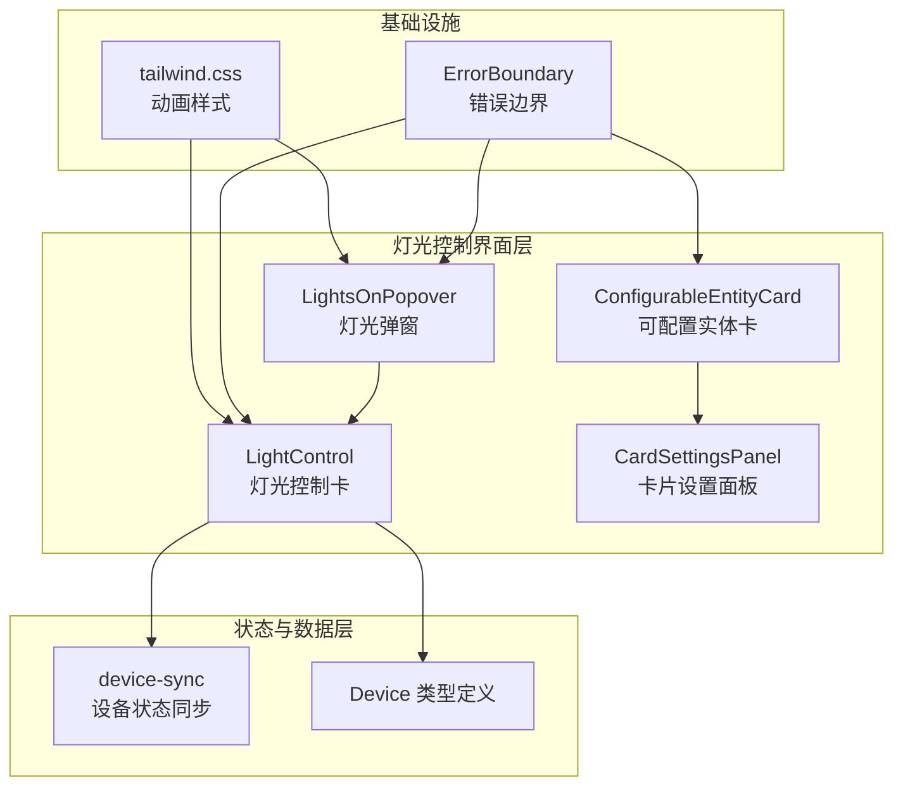
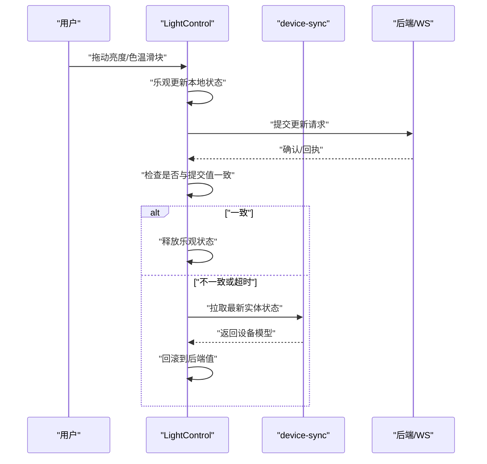
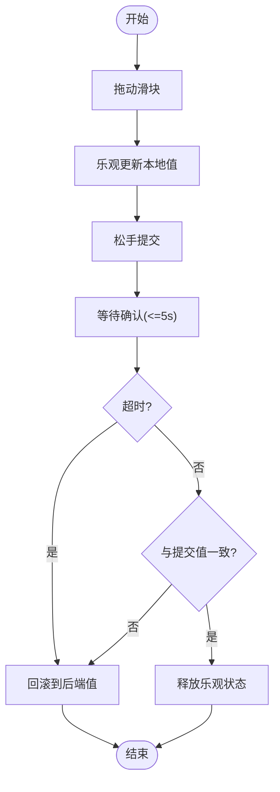
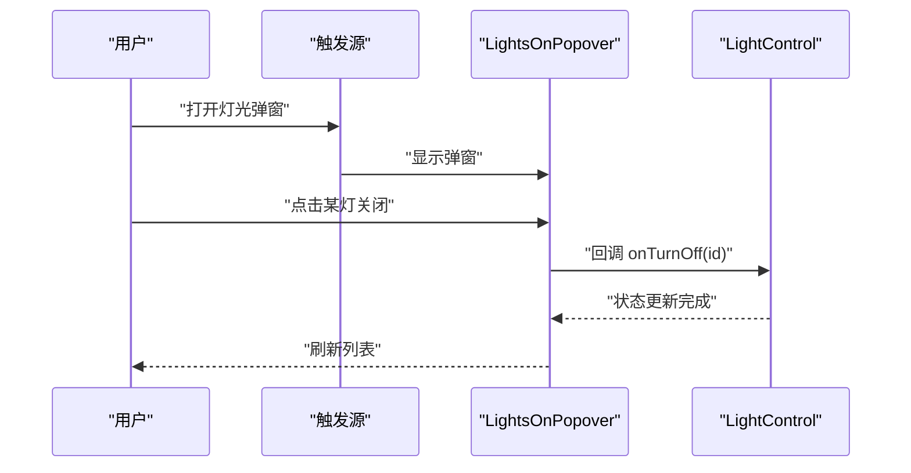
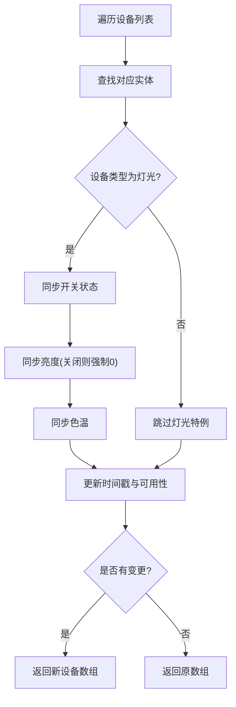
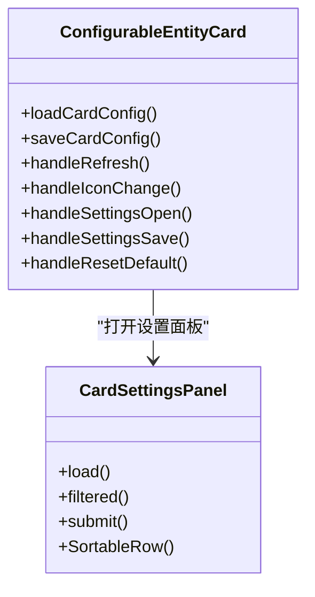
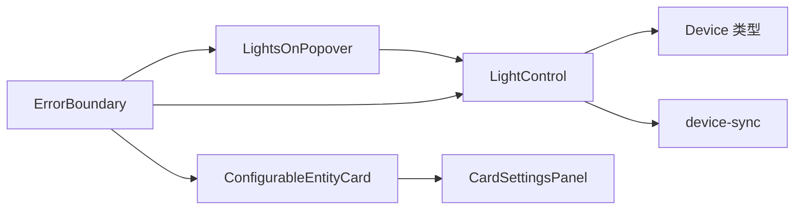

# 灯光控制系统

<cite>
**本文引用的文件**
- [LightControl.tsx](file://src/app/components/dashboard/cards/LightControl.tsx)
- [LightsOnPopover.tsx](file://src/app/components/dashboard/cards/shared/LightsOnPopover.tsx)
- [device-sync.ts](file://src/utils/device-sync.ts)
- [device.ts](file://src/types/device.ts)
- [device-sync.light.test.ts](file://src/utils/__tests__/device-sync.light.test.ts)
- [ConfigurableEntityCard.tsx](file://src/app/components/dashboard/cards/shared/ConfigurableEntityCard.tsx)
- [CardSettingsPanel.tsx](file://src/app/components/dashboard/cards/shared/CardSettingsPanel.tsx)
- [cardSettings.validation.ts](file://src/app/components/dashboard/cards/shared/cardSettings.validation.ts)
- [ErrorBoundary.tsx](file://src/app/components/ErrorBoundary.tsx)
- [tailwind.css](file://src/styles/tailwind.css)
</cite>

## 目录
1. [简介](#简介)
2. [项目结构](#项目结构)
3. [核心组件](#核心组件)
4. [架构总览](#架构总览)
5. [详细组件分析](#详细组件分析)
6. [依赖关系分析](#依赖关系分析)
7. [性能考虑](#性能考虑)
8. [故障排除指南](#故障排除指南)
9. [结论](#结论)
10. [附录](#附录)

## 简介
本文件面向灯光控制系统的开发者与维护者，系统性梳理灯光设备的控制逻辑、亮度与色温调节机制、状态同步策略、交互设计与动画体验，并给出性能优化、错误处理与可访问性建议。文档同时覆盖灯光控制面板的配置能力、滑块组件使用与数值校验、以及灯光设备的特殊处理（如灯泡、调光器等）。

## 项目结构
灯光控制功能主要由以下模块构成：
- 控制卡组件：负责渲染灯光卡片、滑块交互与乐观更新
- 状态同步工具：将 Home Assistant 实体状态映射到本地设备模型
- 弹窗控制：集中关闭多个开启中的灯光
- 配置卡片：支持动态配置实体与标题、图标等
- 错误边界：兜底错误展示与缓存清理
- 样式与动画：Tailwind 动画类用于微交互

图表来源
- [LightControl.tsx:1-246](file://src/app/components/dashboard/cards/LightControl.tsx#L1-L246)
- [LightsOnPopover.tsx:1-124](file://src/app/components/dashboard/cards/shared/LightsOnPopover.tsx#L1-L124)
- [device-sync.ts:1-191](file://src/utils/device-sync.ts#L1-L191)
- [device.ts:1-46](file://src/types/device.ts#L1-L46)
- [ConfigurableEntityCard.tsx:1-310](file://src/app/components/dashboard/cards/shared/ConfigurableEntityCard.tsx#L1-L310)
- [CardSettingsPanel.tsx:1-374](file://src/app/components/dashboard/cards/shared/CardSettingsPanel.tsx#L1-L374)
- [ErrorBoundary.tsx:1-51](file://src/app/components/ErrorBoundary.tsx#L1-L51)
- [tailwind.css:1-13](file://src/styles/tailwind.css#L1-L13)

章节来源
- [LightControl.tsx:1-246](file://src/app/components/dashboard/cards/LightControl.tsx#L1-L246)
- [LightsOnPopover.tsx:1-124](file://src/app/components/dashboard/cards/shared/LightsOnPopover.tsx#L1-L124)
- [device-sync.ts:1-191](file://src/utils/device-sync.ts#L1-L191)
- [device.ts:1-46](file://src/types/device.ts#L1-L46)
- [ConfigurableEntityCard.tsx:1-310](file://src/app/components/dashboard/cards/shared/ConfigurableEntityCard.tsx#L1-L310)
- [CardSettingsPanel.tsx:1-374](file://src/app/components/dashboard/cards/shared/CardSettingsPanel.tsx#L1-L374)
- [ErrorBoundary.tsx:1-51](file://src/app/components/ErrorBoundary.tsx#L1-L51)
- [tailwind.css:1-13](file://src/styles/tailwind.css#L1-L13)

## 核心组件
- 灯光控制卡（LightControl）
  - 提供亮度与色温双滑块，支持拖动过程中的乐观更新与超时回滚
  - 支持灯光开关的乐观切换（关灯即时反馈为亮度0）
  - 基于设备属性实时计算百分比与色温描述
- 灯光弹窗（LightsOnPopover）
  - 展示所有开启中的灯光，支持逐个关闭与“全部关闭”
- 设备状态同步（device-sync）
  - 将 Home Assistant 实体状态映射到本地设备模型，确保亮度与色温正确同步
- 可配置实体卡（ConfigurableEntityCard）与设置面板（CardSettingsPanel）
  - 支持标题、图标、实体列表的可视化配置与排序
- 错误边界（ErrorBoundary）
  - 兜底渲染异常，提供缓存清理与页面重载
- 动画与样式（tailwind.css）
  - 提供微动画类，增强交互反馈

章节来源
- [LightControl.tsx:17-246](file://src/app/components/dashboard/cards/LightControl.tsx#L17-L246)
- [LightsOnPopover.tsx:14-124](file://src/app/components/dashboard/cards/shared/LightsOnPopover.tsx#L14-L124)
- [device-sync.ts:4-191](file://src/utils/device-sync.ts#L4-L191)
- [ConfigurableEntityCard.tsx:54-310](file://src/app/components/dashboard/cards/shared/ConfigurableEntityCard.tsx#L54-L310)
- [CardSettingsPanel.tsx:86-374](file://src/app/components/dashboard/cards/shared/CardSettingsPanel.tsx#L86-L374)
- [ErrorBoundary.tsx:12-51](file://src/app/components/ErrorBoundary.tsx#L12-L51)
- [tailwind.css:6-13](file://src/styles/tailwind.css#L6-L13)

## 架构总览
灯光控制的端到端流程如下：
- 用户在灯光卡上拖动滑块调整亮度或色温
- 组件执行乐观更新：本地立即反映新值，同时启动超时回滚计时
- 发送更新请求至后端；若收到确认（状态与提交值一致），释放乐观状态
- 若超时未收到确认，回滚到后端最新值
- Home Assistant 实体状态通过同步工具映射到本地设备模型，驱动 UI 重新渲染

图表来源
- [LightControl.tsx:82-119](file://src/app/components/dashboard/cards/LightControl.tsx#L82-L119)
- [device-sync.ts:4-191](file://src/utils/device-sync.ts#L4-L191)

## 详细组件分析

### 灯光控制卡（LightControl）
- 乐观更新与超时回滚
  - 使用引用变量记录等待确认类型与最后提交值，避免“跳变”与“回弹”
  - 超时（默认5秒）自动回滚，同时最多重试2次（间隔300ms）
- 拖动过程与提交
  - 拖动过程中仅更新本地值；松手时触发提交并清除引用状态
- 灯光开关的乐观切换
  - 关灯时立即设置亮度为0，提升即时反馈；开灯时等待后端恢复亮度
- 数值与描述
  - 亮度百分比按 0-255 映射；色温按 mireds 分级为“冷色/暖色/自然”

图表来源
- [LightControl.tsx:36-119](file://src/app/components/dashboard/cards/LightControl.tsx#L36-L119)

章节来源
- [LightControl.tsx:26-142](file://src/app/components/dashboard/cards/LightControl.tsx#L26-L142)
- [LightControl.tsx:121-138](file://src/app/components/dashboard/cards/LightControl.tsx#L121-L138)

### 灯光弹窗（LightsOnPopover）
- 展示所有开启中的灯光设备，支持逐个关闭与“全部关闭”
- 列表项包含设备名称、房间与当前亮度（当大于0时）

图表来源
- [LightsOnPopover.tsx:18-124](file://src/app/components/dashboard/cards/shared/LightsOnPopover.tsx#L18-L124)

章节来源
- [LightsOnPopover.tsx:18-124](file://src/app/components/dashboard/cards/shared/LightsOnPopover.tsx#L18-L124)

### 设备状态同步（device-sync）
- 针对灯光设备，同步开关状态、亮度与色温
- 当设备关闭时，强制亮度为0，即使实体属性仍保留旧值
- 对其他设备类型（窗帘、传感器等）也提供相应同步逻辑

图表来源
- [device-sync.ts:4-191](file://src/utils/device-sync.ts#L4-L191)

章节来源
- [device-sync.ts:22-42](file://src/utils/device-sync.ts#L22-L42)
- [device-sync.ts:29-41](file://src/utils/device-sync.ts#L29-L41)
- [device-sync.light.test.ts:5-73](file://src/utils/__tests__/device-sync.light.test.ts#L5-L73)

### 可配置实体卡与设置面板（ConfigurableEntityCard / CardSettingsPanel）
- 支持标题、图标、实体列表的可视化配置
- 设置面板提供实体搜索、排序、图标选择与保存
- 标题长度与字符集校验，防止非法输入

图表来源
- [ConfigurableEntityCard.tsx:54-310](file://src/app/components/dashboard/cards/shared/ConfigurableEntityCard.tsx#L54-L310)
- [CardSettingsPanel.tsx:86-374](file://src/app/components/dashboard/cards/shared/CardSettingsPanel.tsx#L86-L374)

章节来源
- [ConfigurableEntityCard.tsx:24-37](file://src/app/components/dashboard/cards/shared/ConfigurableEntityCard.tsx#L24-L37)
- [CardSettingsPanel.tsx:104-155](file://src/app/components/dashboard/cards/shared/CardSettingsPanel.tsx#L104-L155)
- [cardSettings.validation.ts:1-15](file://src/app/components/dashboard/cards/shared/cardSettings.validation.ts#L1-L15)

### 错误边界（ErrorBoundary）
- 捕获子树未处理异常，展示错误信息与“清空缓存并重载”按钮
- 便于在灯光控制异常时快速恢复

章节来源
- [ErrorBoundary.tsx:12-51](file://src/app/components/ErrorBoundary.tsx#L12-L51)

### 动画与交互（tailwind.css）
- 提供微动画类，用于按钮抖动、淡入等轻量反馈
- 灯光卡与弹窗的出现/隐藏采用动画过渡，提升体验

章节来源
- [tailwind.css:6-13](file://src/styles/tailwind.css#L6-L13)

## 依赖关系分析
- LightControl 依赖 Device 类型与滑块组件，负责乐观更新与状态回滚
- device-sync 依赖 Home Assistant 实体集合，负责设备模型与实体的映射
- LightsOnPopover 依赖 LightControl 的关闭回调，形成“弹窗-卡片”的联动
- ConfigurableEntityCard 与 CardSettingsPanel 负责卡片配置能力
- ErrorBoundary 作为全局兜底组件，保障异常场景下的可用性

图表来源
- [LightControl.tsx:4-5](file://src/app/components/dashboard/cards/LightControl.tsx#L4-L5)
- [device-sync.ts:1-3](file://src/utils/device-sync.ts#L1-L3)
- [device.ts:1-46](file://src/types/device.ts#L1-L46)
- [LightsOnPopover.tsx:1-4](file://src/app/components/dashboard/cards/shared/LightsOnPopover.tsx#L1-L4)
- [ConfigurableEntityCard.tsx:1-10](file://src/app/components/dashboard/cards/shared/ConfigurableEntityCard.tsx#L1-L10)
- [CardSettingsPanel.tsx:1-11](file://src/app/components/dashboard/cards/shared/CardSettingsPanel.tsx#L1-L11)
- [ErrorBoundary.tsx:1-10](file://src/app/components/ErrorBoundary.tsx#L1-L10)

章节来源
- [LightControl.tsx:17-25](file://src/app/components/dashboard/cards/LightControl.tsx#L17-L25)
- [device-sync.ts:4-191](file://src/utils/device-sync.ts#L4-L191)
- [LightsOnPopover.tsx:18-124](file://src/app/components/dashboard/cards/shared/LightsOnPopover.tsx#L18-L124)
- [ConfigurableEntityCard.tsx:54-310](file://src/app/components/dashboard/cards/shared/ConfigurableEntityCard.tsx#L54-L310)
- [CardSettingsPanel.tsx:86-374](file://src/app/components/dashboard/cards/shared/CardSettingsPanel.tsx#L86-L374)
- [ErrorBoundary.tsx:12-51](file://src/app/components/ErrorBoundary.tsx#L12-L51)

## 性能考虑
- 乐观更新与超时回滚
  - 通过本地状态即时响应，减少感知延迟；超时回滚避免长时间不一致
  - 重试机制降低弱网或后端延迟导致的误判
- 状态同步策略
  - 对灯光设备在关闭时强制亮度为0，避免无效属性干扰
  - 仅在实体状态变化时才更新设备模型，减少不必要的重渲染
- 交互反馈
  - 使用 Tailwind 动画类提供轻量过渡，避免复杂动画带来的性能负担
- 配置面板
  - 搜索与过滤在客户端完成，减少网络请求；排序使用拖拽库，保证流畅性

章节来源
- [LightControl.tsx:82-119](file://src/app/components/dashboard/cards/LightControl.tsx#L82-L119)
- [device-sync.ts:29-41](file://src/utils/device-sync.ts#L29-L41)
- [tailwind.css:6-13](file://src/styles/tailwind.css#L6-L13)

## 故障排除指南
- 灯光卡滑块拖动后数值不回落
  - 检查乐观更新是否被正确提交；确认后端是否返回与提交值一致的状态
  - 若超时仍未确认，组件会自动回滚到后端值
- 灯光关闭后亮度未归零
  - device-sync 在设备关闭时会强制亮度为0；检查实体状态是否正确
- 多个灯光弹窗无法批量关闭
  - 确认 LightsOnPopover 的设备列表是否包含目标灯光；逐个关闭与“全部关闭”按钮均有效
- 配置面板标题或实体不可用
  - 标题需满足字符集与长度限制；实体列表上限为6；检查网络状态与实体 ID 正确性
- 页面崩溃或异常
  - ErrorBoundary 会捕获异常并提供“清空缓存并重载”入口

章节来源
- [LightControl.tsx:91-99](file://src/app/components/dashboard/cards/LightControl.tsx#L91-L99)
- [device-sync.ts:30-35](file://src/utils/device-sync.ts#L30-L35)
- [LightsOnPopover.tsx:107-117](file://src/app/components/dashboard/cards/shared/LightsOnPopover.tsx#L107-L117)
- [cardSettings.validation.ts:6-10](file://src/app/components/dashboard/cards/shared/cardSettings.validation.ts#L6-L10)
- [ErrorBoundary.tsx:26-51](file://src/app/components/ErrorBoundary.tsx#L26-L51)

## 结论
灯光控制系统通过“乐观更新 + 超时回滚”的交互策略，在保证即时反馈的同时兼顾一致性与可靠性；device-sync 将 Home Assistant 实体状态精准映射到本地设备模型，确保 UI 与真实设备状态保持同步。配合可配置卡片与弹窗控制，系统在易用性与可扩展性方面表现良好。建议持续关注网络稳定性与后端响应延迟，以进一步优化用户体验。

## 附录
- 最佳实践
  - 亮度与色温滑块应保持 0-255 与合理范围（如 153-500 mireds）的一致性
  - 开关切换时优先采用乐观反馈，避免用户感知延迟
  - 对灯光设备关闭时强制亮度为0，避免属性残留误导
- 可访问性建议
  - 为滑块提供键盘可达性与屏幕阅读器友好的标签
  - 为按钮与弹窗提供明确的焦点顺序与 ARIA 属性
- 故障排除清单
  - 检查后端服务连通性与实体状态
  - 确认 device-sync 是否正确映射实体属性
  - 使用 ErrorBoundary 的“清空缓存并重载”快速恢复