# 空调控制系统

<cite>
**本文档引用的文件**
- [ClimateControl.tsx](file://src/app/components/dashboard/cards/ClimateControl.tsx)
- [ClimateControlModal.tsx](file://src/app/components/ClimateControlModal.tsx)
- [RemoteCard.tsx](file://src/app/components/remote/RemoteCard.tsx)
- [device-sync.ts](file://src/utils/device-sync.ts)
- [device.ts](file://src/types/device.ts)
- [App.tsx](file://src/app/App.tsx)
- [useAiChat.ts](file://src/hooks/useAiChat.ts)
- [ai-service.ts](file://src/services/ai-service.ts)
- [ha-connection.ts](file://src/utils/ha-connection.ts)
- [remote-input.ts](file://src/utils/remote-input.ts)
</cite>

## 目录
1. [项目概述](#项目概述)
2. [系统架构](#系统架构)
3. [核心组件](#核心组件)
4. [空调控制机制详解](#空调控制机制详解)
5. [用户界面设计](#用户界面设计)
6. [智能联动功能](#智能联动功能)
7. [性能优化策略](#性能优化策略)
8. [安全与故障诊断](#安全与故障诊断)
9. [配置与维护指南](#配置与维护指南)
10. [总结](#总结)

## 项目概述

本项目是一个基于Home Assistant的智能空调控制系统，提供了完整的空调设备控制解决方案。系统支持多种控制方式，包括直观的触摸面板控制、精确的温度旋钮调节、智能模式切换以及扫风控制等功能。

该系统采用现代化的React技术栈构建，具有良好的用户体验和强大的扩展性。通过与Home Assistant的深度集成，实现了对各种品牌和型号空调设备的统一控制管理。

## 系统架构

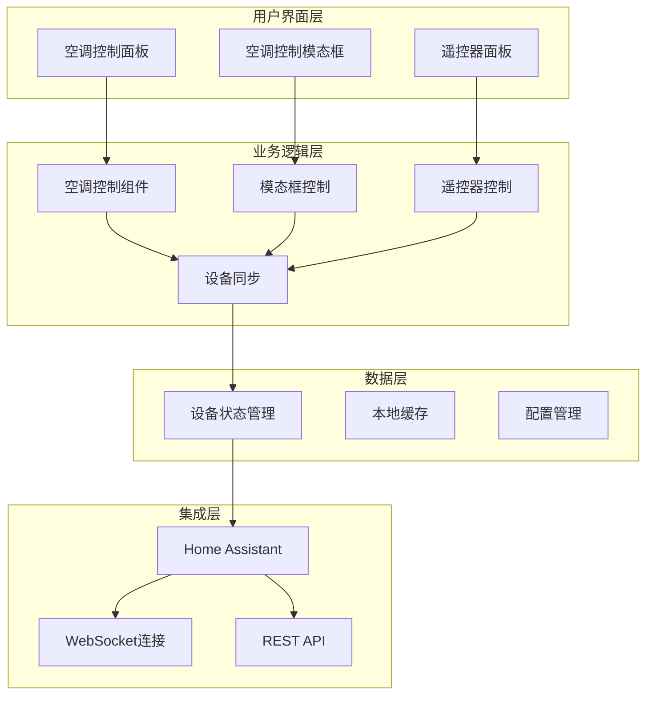

**架构图来源**
- [ClimateControl.tsx:1-261](file://src/app/components/dashboard/cards/ClimateControl.tsx#L1-L261)
- [ClimateControlModal.tsx:1-444](file://src/app/components/ClimateControlModal.tsx#L1-L444)
- [device-sync.ts:1-191](file://src/utils/device-sync.ts#L1-L191)

## 核心组件

### 空调控制面板组件

空调控制面板是系统的核心界面组件，提供了直观的温度调节、模式切换和风速控制功能。

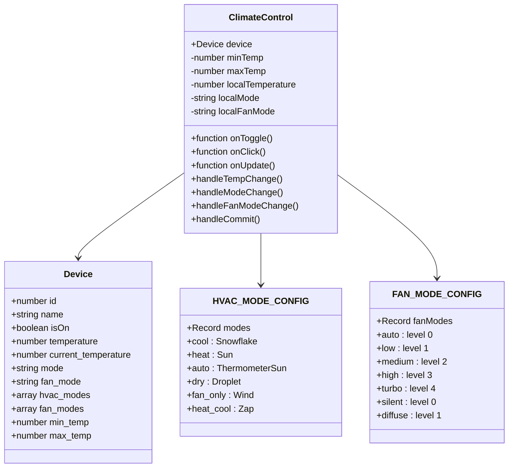

**类图来源**
- [ClimateControl.tsx:6-14](file://src/app/components/dashboard/cards/ClimateControl.tsx#L6-L14)
- [device.ts:1-46](file://src/types/device.ts#L1-L46)

### 模态框控制组件

模态框提供了更详细的空调控制界面，支持温度旋钮调节、扫风控制和精确的参数设置。

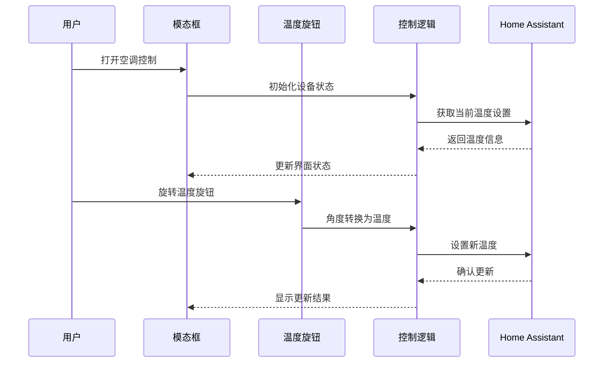

**序列图来源**
- [ClimateControlModal.tsx:149-203](file://src/app/components/ClimateControlModal.tsx#L149-L203)
- [App.tsx:637-674](file://src/app/App.tsx#L637-L674)

**组件来源**
- [ClimateControl.tsx:40-261](file://src/app/components/dashboard/cards/ClimateControl.tsx#L40-L261)
- [ClimateControlModal.tsx:61-444](file://src/app/components/ClimateControlModal.tsx#L61-L444)

## 空调控制机制详解

### 温度控制机制

系统实现了精确的温度控制机制，支持连续温度调节和离散温度设置。

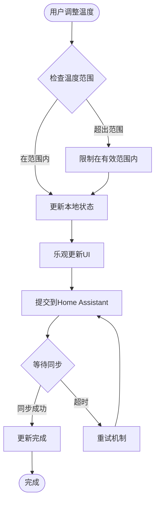

**流程图来源**
- [ClimateControl.tsx:107-135](file://src/app/components/dashboard/cards/ClimateControl.tsx#L107-L135)
- [device-sync.ts:86-100](file://src/utils/device-sync.ts#L86-L100)

### 模式切换机制

系统支持多种空调运行模式，每种模式都有特定的功能和适用场景：

| 模式类型 | 图标 | 功能描述 | 适用场景 |
|---------|------|----------|----------|
| 制冷 (Cool) | ❄️ | 降低室内温度 | 夏季高温天气 |
| 制热 (Heat) | ☀️ | 提升室内温度 | 冬季低温天气 |
| 除湿 (Dry) | 💧 | 降低湿度同时轻微降温 | 潮湿梅雨季节 |
| 送风 (Fan Only) | 🌬️ | 空气循环但不改变温度 | 通风换气 |
| 自动 (Auto) | 🌡️ | 系统自动判断需求 | 智能环境调节 |
| 冷暖 (Heat Cool) | ⚡ | 同时具备制冷制热功能 | 双模式需求 |

**模式配置来源**
- [ClimateControl.tsx:17-24](file://src/app/components/dashboard/cards/ClimateControl.tsx#L17-L24)
- [ClimateControlModal.tsx:28-36](file://src/app/components/ClimateControlModal.tsx#L28-L36)

### 风速调节机制

系统提供多层次的风速控制，满足不同场景下的舒适度需求：

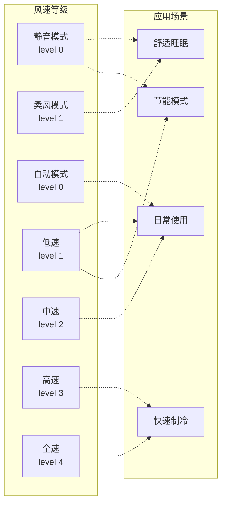

**风速配置来源**
- [ClimateControl.tsx:26-35](file://src/app/components/dashboard/cards/ClimateControl.tsx#L26-L35)
- [ClimateControlModal.tsx:38-47](file://src/app/components/ClimateControlModal.tsx#L38-L47)

### 扫风控制机制

扫风功能提供了空调出风口的动态调节，改善空气分布均匀性：

| 扫风模式 | 描述 | 效果 |
|---------|------|------|
| 关 (Off) | 出风口固定在当前位置 | 节能省电 |
| 上下 (Vertical) | 垂直方向摆动 | 垂直空间均匀送风 |
| 左右 (Horizontal) | 水平方向摆动 | 水平空间均匀送风 |
| 全向 (Both) | 同时进行上下左右摆动 | 最佳空气分布 |

**扫风控制来源**
- [ClimateControlModal.tsx:50-56](file://src/app/components/ClimateControlModal.tsx#L50-L56)

## 用户界面设计

### 仪表板控制面板

空调控制面板采用简洁直观的设计理念，提供以下核心功能：

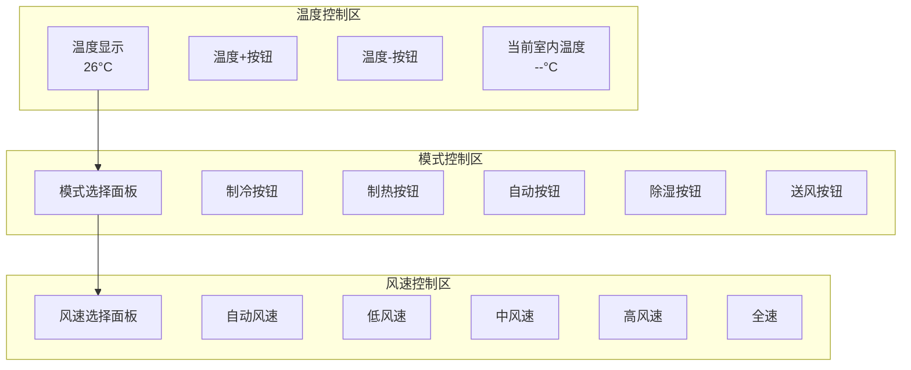

**界面设计来源**
- [ClimateControl.tsx:176-257](file://src/app/components/dashboard/cards/ClimateControl.tsx#L176-L257)

### 模态框详细控制

模态框提供了更精细的控制选项和视觉反馈：

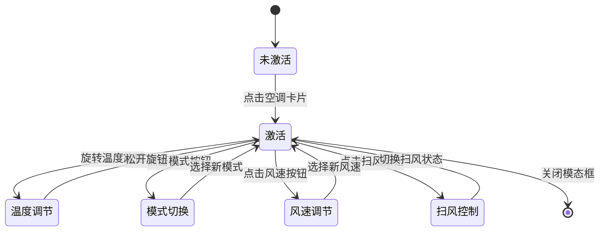

**状态图来源**
- [ClimateControlModal.tsx:95-103](file://src/app/components/ClimateControlModal.tsx#L95-L103)

## 智能联动功能

### AI智能助手集成

系统集成了AI智能助手，提供语音控制和智能建议功能：

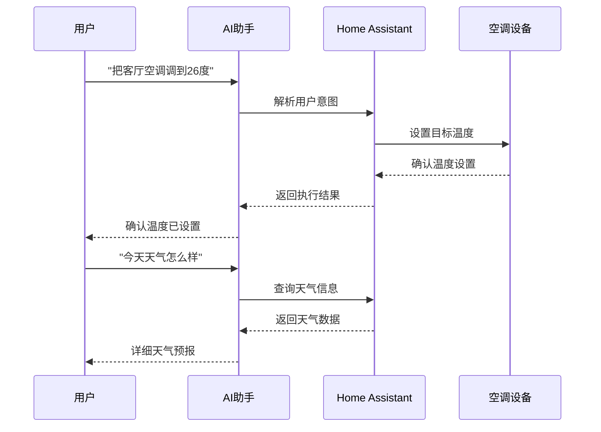

**AI集成来源**
- [useAiChat.ts:132-292](file://src/hooks/useAiChat.ts#L132-L292)
- [ai-service.ts:160-201](file://src/services/ai-service.ts#L160-L201)

### 场景模式支持

系统支持预设场景模式，一键控制多个设备：

| 场景名称 | 功能描述 | 空调设置 |
|---------|----------|----------|
| 无人模式 | 所有设备关闭 | 空调关闭 |
| 睡眠模式 | 节能运行 | 26°C制冷，低风速 |
| 离家模式 | 安全防护 | 空调关闭，门窗传感器监控 |
| 会客模式 | 舒适环境 | 24°C制冷，自动模式 |

**场景控制来源**
- [App.tsx:676-695](file://src/app/App.tsx#L676-L695)

## 性能优化策略

### 乐观更新机制

系统采用乐观更新策略，提升用户交互体验：

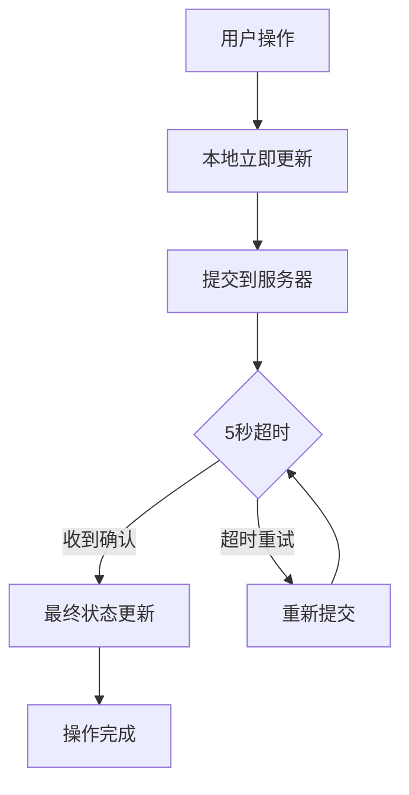

**性能优化来源**
- [ClimateControl.tsx:74-135](file://src/app/components/dashboard/cards/ClimateControl.tsx#L74-L135)

### 数据同步优化

设备状态同步采用增量更新策略，减少不必要的网络传输：

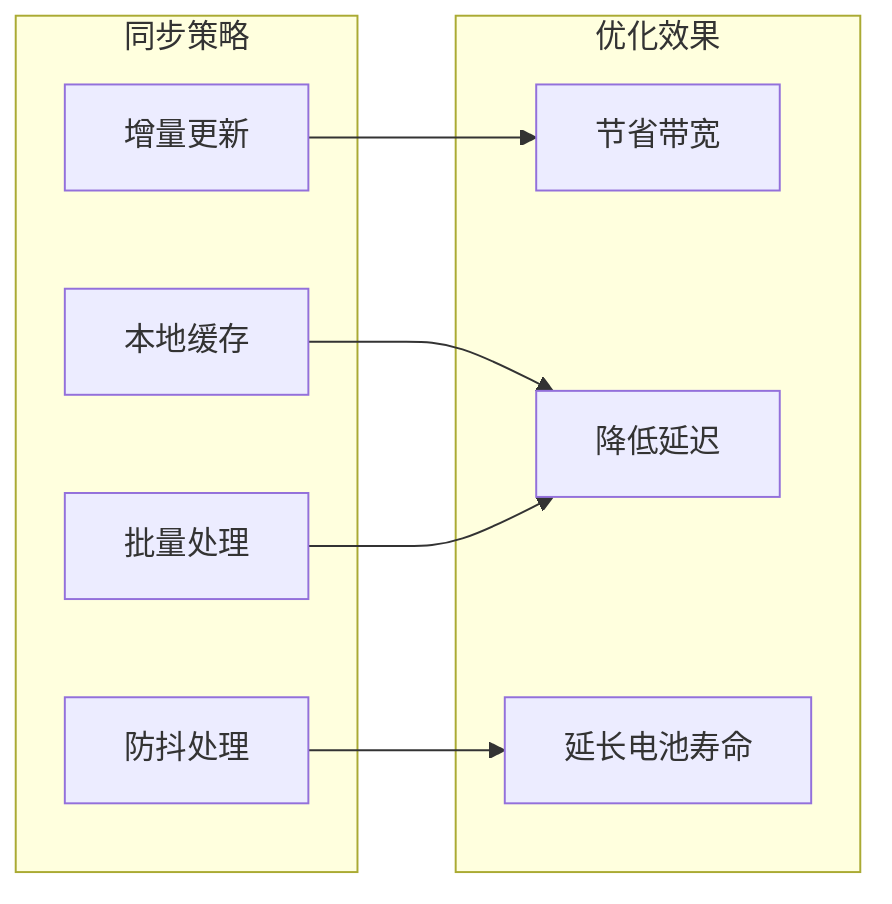

**同步优化来源**
- [device-sync.ts:1-191](file://src/utils/device-sync.ts#L1-L191)

## 安全与故障诊断

### 连接安全机制

系统实现了多重安全保护措施：

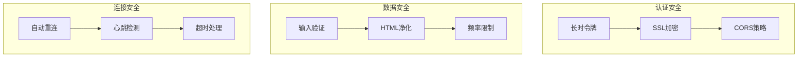

**安全机制来源**
- [ha-connection.ts:47-105](file://src/utils/ha-connection.ts#L47-L105)
- [ai-service.ts:55-62](file://src/services/ai-service.ts#L55-L62)

### 故障诊断功能

系统提供完善的故障诊断和错误处理机制：

| 错误类型 | 诊断方法 | 处理方案 |
|---------|----------|----------|
| 连接失败 | 检查URL和Token | 重新配置连接参数 |
| 设备离线 | 网络状态检查 | 等待设备恢复在线 |
| 服务超时 | 重试机制 | 用户手动重试操作 |
| 权限不足 | 认证状态检查 | 更新用户权限 |

**故障诊断来源**
- [ha-connection.ts:93-104](file://src/utils/ha-connection.ts#L93-L104)
- [useAiChat.ts:272-291](file://src/hooks/useAiChat.ts#L272-L291)

## 配置与维护指南

### 系统配置

#### Home Assistant集成配置

1. **基础连接配置**
   - 设置VITE_HA_URL环境变量
   - 配置VITE_HA_TOKEN访问令牌
   - 验证连接可用性

2. **设备映射配置**
   ```json
   {
     "deviceMappings": {
       "1": "climate.living_room_ac",
       "2": "climate.bedroom_ac"
     }
   }
   ```

3. **场景配置**
   ```yaml
   scene:
     - name: 睡眠模式
       entities:
         climate.living_room_ac:
           temperature: 26
           hvac_mode: cool
           fan_mode: low
   ```

#### 用户界面配置

1. **主题定制**
   - 支持深色/浅色主题切换
   - 自定义颜色方案
   - 响应式布局适配

2. **功能开关**
   - 可启用/禁用特定功能
   - 用户偏好设置保存
   - 个性化界面定制

### 维护建议

#### 日常维护

1. **软件更新**
   - 定期检查新版本发布
   - 备份配置文件
   - 测试更新兼容性

2. **性能监控**
   ```bash
   # 监控系统资源使用
   npm run build -- --stats
   
   # 分析包大小
   npm run analyze
   ```

3. **安全检查**
   - 定期轮换访问令牌
   - 检查API密钥安全性
   - 更新依赖包版本

#### 故障排除

1. **常见问题解决**
   - 空调不响应：检查设备状态和网络连接
   - 温度显示异常：重启设备或刷新页面
   - 模式切换失败：验证设备支持的模式列表

2. **性能优化**
   - 清理浏览器缓存
   - 关闭不必要的标签页
   - 使用高性能设备

**配置指南来源**
- [ha-connection.ts:12-53](file://src/utils/ha-connection.ts#L12-L53)
- [device-sync.ts:1-191](file://src/utils/device-sync.ts#L1-L191)

## 总结

本空调控制系统通过模块化设计和智能化集成，为用户提供了全面而便捷的空调控制解决方案。系统的主要优势包括：

### 技术优势
- **多层架构设计**：清晰的组件分离和职责划分
- **智能优化**：乐观更新、防抖处理等性能优化策略
- **安全可靠**：多重认证和错误处理机制
- **扩展性强**：模块化设计支持功能扩展

### 用户体验
- **直观界面**：简洁明了的操作界面
- **响应迅速**：即时反馈和状态同步
- **个性化定制**：支持用户偏好设置
- **智能联动**：AI助手和场景模式集成

### 应用价值
- **节能环保**：智能调节和定时功能
- **舒适便利**：多种控制方式和模式选择
- **成本效益**：降低人工操作成本
- **未来兼容**：支持新技术和标准

该系统为智能家居环境中的空调控制提供了一个完整、可靠的解决方案，既满足了当前需求，又为未来发展预留了充足的空间。