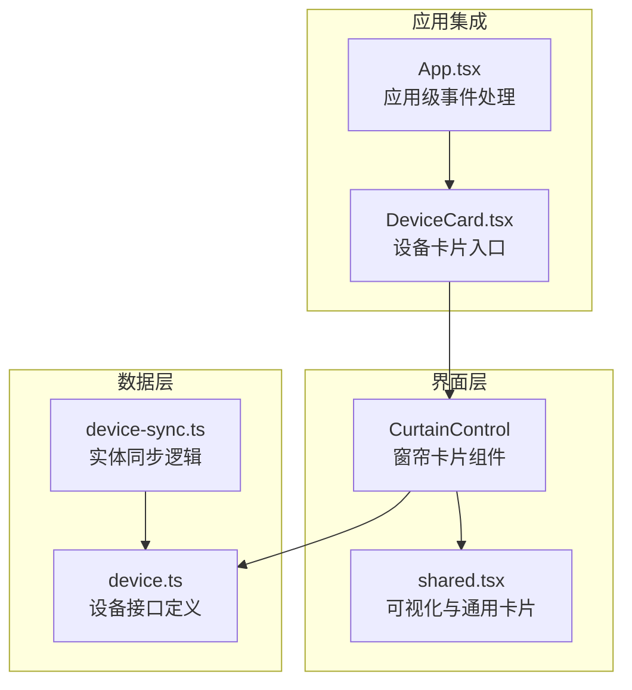
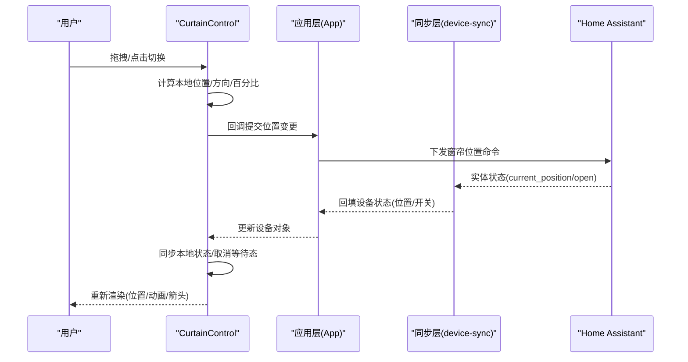
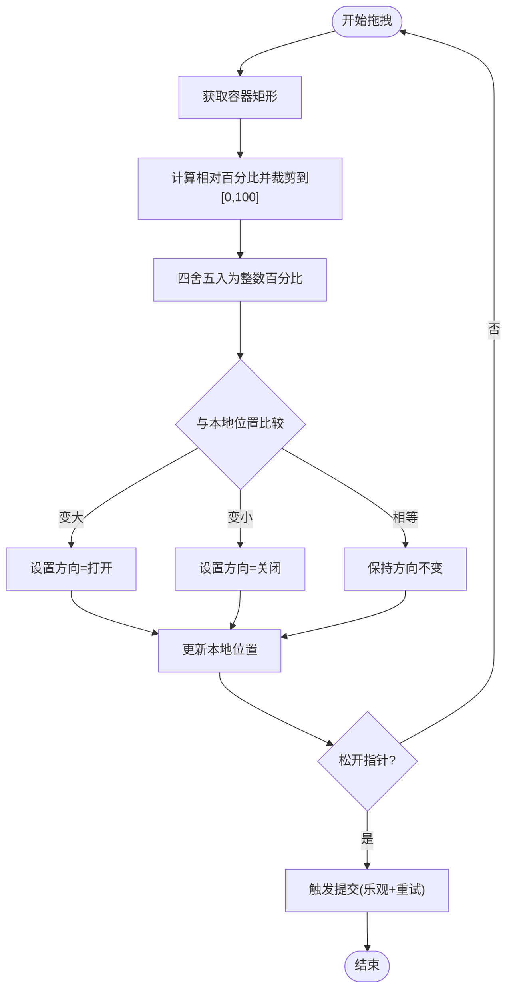
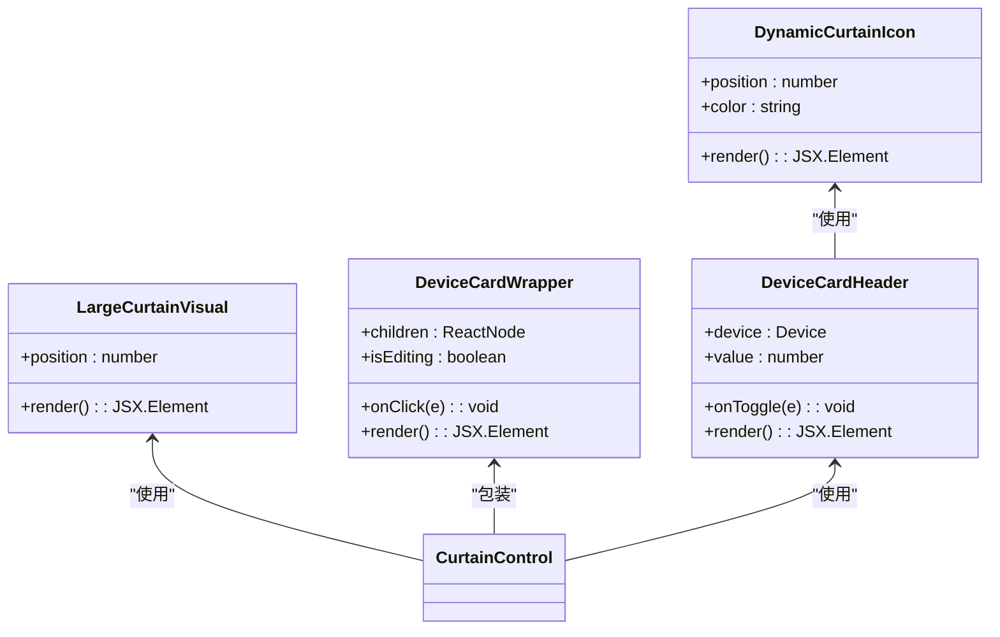
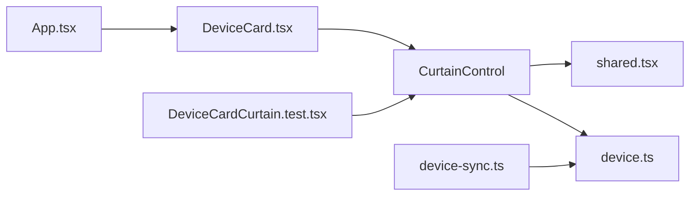

# 窗帘控制系统

<cite>
**本文引用的文件**
- [CurtainControl.tsx](file://src/app/components/dashboard/cards/CurtainControl.tsx)
- [shared.tsx](file://src/app/components/dashboard/cards/shared.tsx)
- [device.ts](file://src/types/device.ts)
- [device-sync.ts](file://src/utils/device-sync.ts)
- [DeviceCard.tsx](file://src/app/components/dashboard/DeviceCard.tsx)
- [App.tsx](file://src/app/App.tsx)
- [DeviceCardCurtain.test.tsx](file://src/app/components/dashboard/__tests__/DeviceCardCurtain.test.tsx)
</cite>

## 目录
1. [引言](#引言)
2. [项目结构](#项目结构)
3. [核心组件](#核心组件)
4. [架构总览](#架构总览)
5. [详细组件分析](#详细组件分析)
6. [依赖关系分析](#依赖关系分析)
7. [性能考量](#性能考量)
8. [故障排查指南](#故障排查指南)
9. [结论](#结论)
10. [附录](#附录)

## 引言
本技术文档围绕窗帘控制系统的前端实现进行深入解析，重点覆盖以下方面：
- 窗帘设备的位置控制机制与开合程度调节
- 控制面板滑块交互、百分比显示与位置同步
- 特殊窗帘类型（如双开帘、百叶窗等）的处理思路与扩展点
- 多位置控制与动画效果、响应式设计及用户体验优化
- 精度控制、安全保护与异常处理机制
- 窗帘设备配置的实用技巧与常见问题解决方案

## 项目结构
窗帘控制功能由“卡片组件 + 可视化组件 + 设备模型 + 同步逻辑”四部分协同完成：
- 卡片层：负责用户交互与事件分发（拖拽、点击、切换）
- 可视化层：负责动态视觉反馈（百分比、箭头方向、布帘宽度）
- 设备模型：统一描述窗帘状态（开关、位置、名称、图标等）
- 同步层：从 Home Assistant 实体属性中提取窗帘状态并回填到本地设备

图表来源
- [CurtainControl.tsx:1-234](file://src/app/components/dashboard/cards/CurtainControl.tsx#L1-L234)
- [shared.tsx:142-178](file://src/app/components/dashboard/cards/shared.tsx#L142-L178)
- [device.ts:1-46](file://src/types/device.ts#L1-L46)
- [device-sync.ts:43-59](file://src/utils/device-sync.ts#L43-L59)
- [DeviceCard.tsx:7-90](file://src/app/components/dashboard/DeviceCard.tsx#L7-L90)
- [App.tsx:465-621](file://src/app/App.tsx#L465-L621)

章节来源
- [CurtainControl.tsx:1-234](file://src/app/components/dashboard/cards/CurtainControl.tsx#L1-L234)
- [shared.tsx:142-178](file://src/app/components/dashboard/cards/shared.tsx#L142-L178)
- [device.ts:1-46](file://src/types/device.ts#L1-L46)
- [device-sync.ts:43-59](file://src/utils/device-sync.ts#L43-L59)
- [DeviceCard.tsx:7-90](file://src/app/components/dashboard/DeviceCard.tsx#L7-L90)
- [App.tsx:465-621](file://src/app/App.tsx#L465-L621)

## 核心组件
- 窗帘卡片组件（CurtainControl）：提供拖拽交互、百分比显示、箭头方向指示、乐观更新与重试机制，并通过回调向父层提交位置变更。
- 可视化组件（shared.tsx）：包含大型窗帘背景图（左右两片窗帘面板随位置变化而收缩/张开）、动态窗帘图标、通用卡片包装器与头部。
- 设备模型（device.ts）：统一描述窗帘的 id、名称、图标、开关状态、位置、可见性等字段。
- 实体同步（device-sync.ts）：从 Home Assistant 实体属性中读取窗帘状态（open/closed 或 current_position），并回填到本地设备对象。

章节来源
- [CurtainControl.tsx:16-146](file://src/app/components/dashboard/cards/CurtainControl.tsx#L16-L146)
- [shared.tsx:142-178](file://src/app/components/dashboard/cards/shared.tsx#L142-L178)
- [device.ts:1-46](file://src/types/device.ts#L1-L46)
- [device-sync.ts:43-59](file://src/utils/device-sync.ts#L43-L59)

## 架构总览
窗帘控制的端到端流程如下：
- 用户在窗帘卡片上进行拖拽或点击切换
- 组件内部维护本地位置状态与拖拽状态
- 触发乐观更新与定时重试，同时调用外部回调提交位置
- 应用层接收位置变更并进行持久化或下发至后端
- Home Assistant 实体状态变化后，同步层将最新状态回填到本地设备
- 界面根据最新设备状态重新渲染，完成闭环

图表来源
- [CurtainControl.tsx:57-146](file://src/app/components/dashboard/cards/CurtainControl.tsx#L57-L146)
- [device-sync.ts:43-59](file://src/utils/device-sync.ts#L43-L59)
- [App.tsx:465-621](file://src/app/App.tsx#L465-L621)

## 详细组件分析

### 窗帘卡片组件（CurtainControl）
- 交互机制
  - 拖拽：基于容器边界计算鼠标相对百分比，四舍五入为整数百分比；根据前后位置判断方向以决定箭头内外方向。
  - 切换：点击切换按钮时，若当前打开则关闭至 0%，否则打开至 100%。
  - 提交：触发乐观更新，设置等待标志与超时重置；最多重试两次，间隔 300ms。
- 状态管理
  - 本地状态：localPosition、isDragging、dragDirection
  - 乐观更新：isWaitingForUpdate、waitingForType、lastCommittedValue、updateTimeoutRef
  - 同步策略：非拖拽状态下，若处于等待提交且数值接近上次提交值（容差 1%），则认为已同步并清除等待态。
- 视觉反馈
  - 百分比显示在顶部中央
  - 左右箭头跟随窗帘边缘移动，拖拽时根据方向切换内外朝向，空闲时根据位置偏向一侧
  - 大型窗帘背景随位置变化自动调整左右面板宽度

图表来源
- [CurtainControl.tsx:57-146](file://src/app/components/dashboard/cards/CurtainControl.tsx#L57-L146)

章节来源
- [CurtainControl.tsx:16-146](file://src/app/components/dashboard/cards/CurtainControl.tsx#L16-L146)

### 可视化组件（shared.tsx）
- LargeCurtainVisual：根据位置计算左右面板宽度百分比，范围从完全张开（各 10%）到完全闭合（各 50%），形成自然的视觉缩放。
- DynamicCurtainIcon：根据位置绘制左右两片窗帘板，用于图标展示。
- DeviceCardWrapper/DeviceCardHeader：统一卡片外观、背景图案、编辑覆盖层与设备头部信息。

图表来源
- [shared.tsx:142-178](file://src/app/components/dashboard/cards/shared.tsx#L142-L178)
- [shared.tsx:57-73](file://src/app/components/dashboard/cards/shared.tsx#L57-L73)
- [shared.tsx:184-250](file://src/app/components/dashboard/cards/shared.tsx#L184-L250)

章节来源
- [shared.tsx:142-178](file://src/app/components/dashboard/cards/shared.tsx#L142-L178)
- [shared.tsx:57-73](file://src/app/components/dashboard/cards/shared.tsx#L57-L73)
- [shared.tsx:184-250](file://src/app/components/dashboard/cards/shared.tsx#L184-L250)

### 设备模型（device.ts）
- 关键字段：id、name、icon、isOn、type、position、visibility、customName/customIcon 等
- 窗帘类型：通过 type='curtain' 标识，支持 position 字段用于表示开合程度（0~100）

章节来源
- [device.ts:1-46](file://src/types/device.ts#L1-L46)

### 实体同步（device-sync.ts）
- 窗帘同步规则：
  - 若存在 current_position 属性，则直接使用该值作为 position
  - 否则根据 state 是否为 open 来推断 position（open→100，closed→0）
  - 同步 isOn 与 position，确保 UI 与实体一致

章节来源
- [device-sync.ts:43-59](file://src/utils/device-sync.ts#L43-L59)

### 应用集成（DeviceCard/App）
- DeviceCard：根据设备类型选择渲染 CurtainControl 或其他卡片
- App：处理设备点击、切换与窗帘位置同步逻辑（例如点击卡片区域不执行默认动作，仅处理窗帘切换）

章节来源
- [DeviceCard.tsx:7-90](file://src/app/components/dashboard/DeviceCard.tsx#L7-L90)
- [App.tsx:465-621](file://src/app/App.tsx#L465-L621)

## 依赖关系分析
- 组件耦合
  - CurtainControl 依赖 shared.tsx 的 LargeCurtainVisual 与 DeviceCardHeader
  - 设备对象来自上层传入，通过回调 onPositionChange 与 onToggle 与应用层通信
  - 同步层 device-sync.ts 与设备对象解耦，通过映射表与实体集合进行状态回填
- 外部依赖
  - Home Assistant 实体状态与属性（state、attributes.current_position）
  - 测试用例验证拖拽行为与百分比变化

图表来源
- [CurtainControl.tsx:1-234](file://src/app/components/dashboard/cards/CurtainControl.tsx#L1-L234)
- [shared.tsx:142-178](file://src/app/components/dashboard/cards/shared.tsx#L142-L178)
- [device.ts:1-46](file://src/types/device.ts#L1-L46)
- [device-sync.ts:43-59](file://src/utils/device-sync.ts#L43-L59)
- [DeviceCard.tsx:7-90](file://src/app/components/dashboard/DeviceCard.tsx#L7-L90)
- [App.tsx:465-621](file://src/app/App.tsx#L465-L621)
- [DeviceCardCurtain.test.tsx:49-130](file://src/app/components/dashboard/__tests__/DeviceCardCurtain.test.tsx#L49-L130)

章节来源
- [DeviceCardCurtain.test.tsx:49-130](file://src/app/components/dashboard/__tests__/DeviceCardCurtain.test.tsx#L49-L130)

## 性能考量
- 乐观更新与重试
  - 在网络延迟或设备未及时响应时，先以本地状态呈现，避免卡顿
  - 超时与重试机制防止长时间等待导致的界面假死
- 动画与渲染
  - 窗帘面板宽度与箭头位置采用过渡动画，提升触控反馈
  - 百分比文本与背景图按需重绘，避免不必要的重排
- 响应式设计
  - 容器尺寸变化时，百分比计算与面板宽度自适应
  - 悬停显示箭头，减少视觉干扰

## 故障排查指南
- 拖拽无效或跳变
  - 检查是否正确捕获/释放指针，确认 isDragging 状态切换
  - 确认本地位置更新逻辑与容器边界计算
- 百分比显示异常
  - 核对容器宽度与 clientX 计算，确保裁剪到 [0,100]
  - 检查同步逻辑中的容差判断（1%）是否导致提前取消等待
- 状态不同步
  - 确认 onPositionChange 回调是否被调用
  - 检查应用层是否正确接收并下发命令
  - 核对 device-sync.ts 中的 current_position 读取与 fallback 推断
- 箭头方向错误
  - 拖拽时根据前后位置判断方向；空闲时根据位置偏向决定内外朝向
- 测试验证
  - 使用测试用例验证拖拽起止点与最终百分比一致性

章节来源
- [CurtainControl.tsx:37-55](file://src/app/components/dashboard/cards/CurtainControl.tsx#L37-L55)
- [CurtainControl.tsx:57-146](file://src/app/components/dashboard/cards/CurtainControl.tsx#L57-L146)
- [device-sync.ts:43-59](file://src/utils/device-sync.ts#L43-L59)
- [DeviceCardCurtain.test.tsx:107-112](file://src/app/components/dashboard/__tests__/DeviceCardCurtain.test.tsx#L107-L112)

## 结论
窗帘控制系统通过“交互组件 + 可视化组件 + 设备模型 + 同步逻辑”的清晰分层，实现了流畅的拖拽交互、精确的位置反馈与稳定的乐观更新机制。结合动画与响应式设计，显著提升了用户体验。针对不同窗帘类型（如双开帘、百叶窗），可在现有基础上扩展属性与渲染逻辑，保持一致的交互体验与状态同步策略。

## 附录

### 特殊窗帘类型的处理建议
- 双开帘
  - 建议引入数组型位置字段（如 [left, right]），分别控制两侧开合程度
  - 视觉层分别渲染左右面板并独立计算宽度
- 百叶窗
  - 引入角度属性（tilt），配合面板宽度共同决定遮光效果
  - 视觉层增加导轨与叶片样式，根据角度与位置组合渲染

### 多位置控制与精度控制
- 精度：当前实现以整数百分比（0~100）控制，满足大多数场景
- 进一步精度：可考虑支持小数位（如 0.5%），并在 UI 上提供更细粒度的滑动反馈
- 安全保护：限制最小/最大位置、防夹手区间、异常抖动过滤（如容差 1% 的智能同步）

### 配置实用技巧与常见问题
- 配置技巧
  - 在 Home Assistant 中确保窗帘实体具备 current_position 属性，以便精确同步
  - 对于无 position 的实体，优先使用 open/closed 状态，系统会自动推断为 100/0
- 常见问题
  - 实体不可用或未知：检查 HA 连接与实体可用性
  - UI 不更新：确认 onPositionChange 回调链路与应用层下发逻辑
  - 拖拽卡顿：检查 Pointer 事件处理与重绘频率