# 设备控制模块

<cite>
**本文档引用的文件**
- [src/types/device.ts](file://src/types/device.ts)
- [src/app/components/dashboard/DeviceCard.tsx](file://src/app/components/dashboard/DeviceCard.tsx)
- [src/app/components/dashboard/cards/LightControl.tsx](file://src/app/components/dashboard/cards/LightControl.tsx)
- [src/app/components/dashboard/cards/CurtainControl.tsx](file://src/app/components/dashboard/cards/CurtainControl.tsx)
- [src/app/components/dashboard/cards/ClimateControl.tsx](file://src/app/components/dashboard/cards/ClimateControl.tsx)
- [src/app/components/dashboard/cards/shared.tsx](file://src/app/components/dashboard/cards/shared.tsx)
- [src/utils/device-sync.ts](file://src/utils/device-sync.ts)
- [src/utils/device-discovery.ts](file://src/utils/device-discovery.ts)
- [src/utils/ha-discovery.ts](file://src/utils/ha-discovery.ts)
- [src/utils/entity-cleaner.ts](file://src/utils/entity-cleaner.ts)
- [src/app/components/settings/DeviceDiscoveryPanel.tsx](file://src/app/components/settings/DeviceDiscoveryPanel.tsx)
- [src/app/components/settings/DeviceEditorForm.tsx](file://src/app/components/settings/DeviceEditorForm.tsx)
- [src/store/dataStore.ts](file://src/store/dataStore.ts)
- [src/config/initialDevices.ts](file://src/config/initialDevices.ts)
- [src/hooks/useDashboardManager.ts](file://src/hooks/useDashboardManager.ts)
- [src/app/App.tsx](file://src/app/App.tsx)
- [src/store/uiStore.ts](file://src/store/uiStore.ts)
- [src/hooks/useHomeAssistant.ts](file://src/hooks/useHomeAssistant.ts)
</cite>

## 更新摘要
**变更内容**
- 新增useDashboardManager钩子，将复杂的仪表盘业务逻辑从App.tsx中提取出来
- 更新设备状态同步机制，优化了用户同步和设备过滤逻辑
- 改进了乐观UI更新和重试机制
- 增强了错误处理和日志记录功能

## 目录
1. [简介](#简介)
2. [项目结构](#项目结构)
3. [核心组件](#核心组件)
4. [架构总览](#架构总览)
5. [详细组件分析](#详细组件分析)
6. [依赖关系分析](#依赖关系分析)
7. [性能考量](#性能考量)
8. [故障排除指南](#故障排除指南)
9. [结论](#结论)
10. [附录](#附录)

## 简介
本文件系统化梳理设备控制模块的设计与实现，涵盖设备类型定义、设备卡片组件架构、控制逻辑、状态同步机制、命令发送流程、错误处理策略，以及设备发现、配置管理与批量操作。文档同时提供灯光、窗帘、空调、传感器等设备类型的特殊处理说明，并给出性能优化、用户体验设计与可扩展性的建议，最后提供设备类型扩展的开发指南与最佳实践。

**更新** 新增useDashboardManager钩子，提供更清晰的仪表盘业务逻辑分离，优化了设备状态同步和用户管理功能。

## 项目结构
设备控制模块主要由以下层次构成：
- 类型与配置层：设备类型定义、初始设备配置
- 视图层：设备卡片与各功能卡片（灯光、窗帘、空调、传感器状态）
- 工具层：设备发现、实体清洗、状态同步
- 存储层：本地持久化与全局状态管理
- 设置层：设备发现面板与设备编辑表单
- 钩子层：useDashboardManager提供仪表盘业务逻辑封装

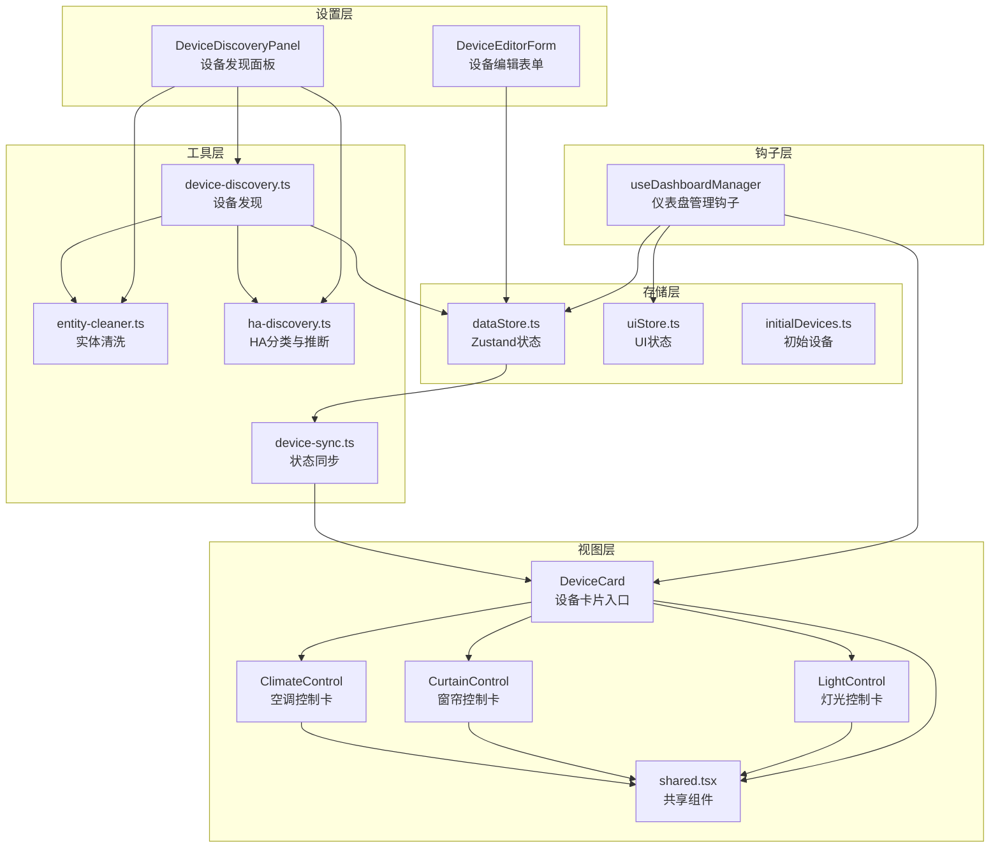

**图表来源**
- [src/app/components/dashboard/DeviceCard.tsx:26-265](file://src/app/components/dashboard/DeviceCard.tsx#L26-L265)
- [src/app/components/dashboard/cards/LightControl.tsx:17-245](file://src/app/components/dashboard/cards/LightControl.tsx#L17-L245)
- [src/app/components/dashboard/cards/CurtainControl.tsx:16-233](file://src/app/components/dashboard/cards/CurtainControl.tsx#L16-L233)
- [src/app/components/dashboard/cards/ClimateControl.tsx:40-260](file://src/app/components/dashboard/cards/ClimateControl.tsx#L40-L260)
- [src/app/components/dashboard/cards/shared.tsx:12-250](file://src/app/components/dashboard/cards/shared.tsx#L12-L250)
- [src/hooks/useDashboardManager.ts:25-319](file://src/hooks/useDashboardManager.ts#L25-L319)
- [src/utils/device-discovery.ts:12-160](file://src/utils/device-discovery.ts#L12-L160)
- [src/utils/entity-cleaner.ts:195-380](file://src/utils/entity-cleaner.ts#L195-L380)
- [src/utils/device-sync.ts:4-190](file://src/utils/device-sync.ts#L4-L190)
- [src/utils/ha-discovery.ts:18-166](file://src/utils/ha-discovery.ts#L18-L166)
- [src/store/dataStore.ts:58-128](file://src/store/dataStore.ts#L58-L128)
- [src/store/uiStore.ts:31-55](file://src/store/uiStore.ts#L31-L55)
- [src/app/components/settings/DeviceDiscoveryPanel.tsx:34-514](file://src/app/components/settings/DeviceDiscoveryPanel.tsx#L34-L514)
- [src/app/components/settings/DeviceEditorForm.tsx:96-573](file://src/app/components/settings/DeviceEditorForm.tsx#L96-L573)

**章节来源**
- [src/app/components/dashboard/DeviceCard.tsx:26-265](file://src/app/components/dashboard/DeviceCard.tsx#L26-L265)
- [src/app/components/dashboard/cards/shared.tsx:12-250](file://src/app/components/dashboard/cards/shared.tsx#L12-L250)
- [src/utils/device-discovery.ts:12-160](file://src/utils/device-discovery.ts#L12-L160)
- [src/utils/device-sync.ts:4-190](file://src/utils/device-sync.ts#L4-L190)
- [src/store/dataStore.ts:58-128](file://src/store/dataStore.ts#L58-L128)
- [src/hooks/useDashboardManager.ts:25-319](file://src/hooks/useDashboardManager.ts#L25-L319)

## 核心组件
- 设备类型定义：统一的设备接口，包含状态、属性、可见性与自定义显示字段，覆盖灯光、窗帘、空调、传感器等类型的关键属性。
- 设备卡片入口：根据设备类型路由到对应的功能卡片，支持编辑态与通用设备标记。
- 功能卡片：灯光控制（亮度与色温）、窗帘控制（拖拽定位）、空调控制（温度、模式、风速）与传感器状态展示。
- 状态同步：基于 Home Assistant 实体状态进行双向同步，处理在线离线、数值更新与属性变更。
- 发现与配置：自动发现设备、清洗实体、推断类型与房间、批量绑定与编辑。
- 存储与持久化：Zustand 管理设备、房间、场景、用户与日志，支持本地持久化与变更同步。
- **新增** 仪表盘管理钩子：useDashboardManager封装复杂的仪表盘业务逻辑，包括设备过滤、用户同步、设备操作等功能。

**章节来源**
- [src/types/device.ts:1-46](file://src/types/device.ts#L1-L46)
- [src/app/components/dashboard/DeviceCard.tsx:26-265](file://src/app/components/dashboard/DeviceCard.tsx#L26-L265)
- [src/app/components/dashboard/cards/LightControl.tsx:17-245](file://src/app/components/dashboard/cards/LightControl.tsx#L17-L245)
- [src/app/components/dashboard/cards/CurtainControl.tsx:16-233](file://src/app/components/dashboard/cards/CurtainControl.tsx#L16-L233)
- [src/app/components/dashboard/cards/ClimateControl.tsx:40-260](file://src/app/components/dashboard/cards/ClimateControl.tsx#L40-L260)
- [src/utils/device-sync.ts:4-190](file://src/utils/device-sync.ts#L4-L190)
- [src/utils/device-discovery.ts:12-160](file://src/utils/device-discovery.ts#L12-L160)
- [src/store/dataStore.ts:58-128](file://src/store/dataStore.ts#L58-L128)
- [src/hooks/useDashboardManager.ts:25-319](file://src/hooks/useDashboardManager.ts#L25-L319)

## 架构总览
设备控制模块采用"视图-钩子-工具-存储"分层架构：
- 视图层负责渲染与交互，按设备类型选择对应卡片组件。
- **新增** 钩子层提供业务逻辑封装，useDashboardManager集中管理仪表盘相关逻辑。
- 工具层提供设备发现、实体清洗、状态同步与分类推断。
- 存储层通过 Zustand 管理设备与房间等状态，并持久化到本地存储。

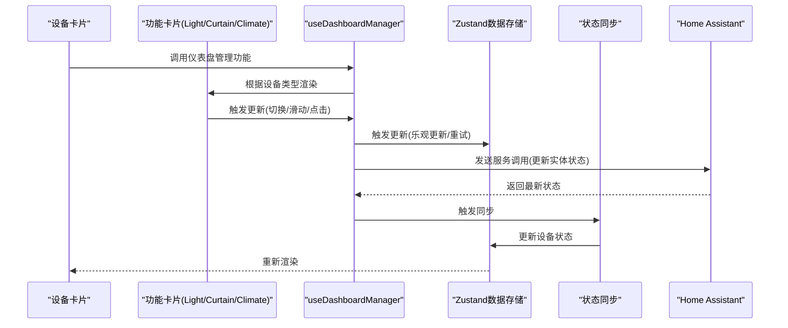

**图表来源**
- [src/app/components/dashboard/DeviceCard.tsx:26-265](file://src/app/components/dashboard/DeviceCard.tsx#L26-L265)
- [src/hooks/useDashboardManager.ts:25-319](file://src/hooks/useDashboardManager.ts#L25-L319)
- [src/app/components/dashboard/cards/LightControl.tsx:82-119](file://src/app/components/dashboard/cards/LightControl.tsx#L82-L119)
- [src/app/components/dashboard/cards/CurtainControl.tsx:101-134](file://src/app/components/dashboard/cards/CurtainControl.tsx#L101-L134)
- [src/app/components/dashboard/cards/ClimateControl.tsx:107-135](file://src/app/components/dashboard/cards/ClimateControl.tsx#L107-L135)
- [src/utils/device-sync.ts:4-190](file://src/utils/device-sync.ts#L4-L190)
- [src/store/dataStore.ts:58-128](file://src/store/dataStore.ts#L58-L128)

## 详细组件分析

### 设备类型定义与分类
- 设备接口包含基础字段（id、name、icon、room、type、category、subType）与设备特有属性（如亮度、色温、温度、模式、风速、摆风、位置等），并支持可见性与自定义显示。
- 设备分类通过 HA 原生 domain 与 device_class 推断，兼容中文名与领域映射，确保自动发现时的准确性。

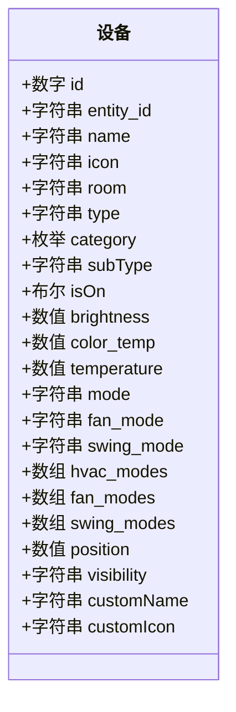

**图表来源**
- [src/types/device.ts:1-46](file://src/types/device.ts#L1-L46)

**章节来源**
- [src/types/device.ts:1-46](file://src/types/device.ts#L1-L46)
- [src/utils/ha-discovery.ts:89-166](file://src/utils/ha-discovery.ts#L89-L166)
- [src/utils/entity-cleaner.ts:195-380](file://src/utils/entity-cleaner.ts#L195-L380)

### 设备卡片组件架构
- DeviceCard 根据设备类型判断渲染灯光、窗帘、空调或传感器卡片，并在编辑态提供通用设备标记与切换。
- 共享组件提供统一的卡片包装、头部、状态点与图标渲染，保证视觉一致性与交互体验。

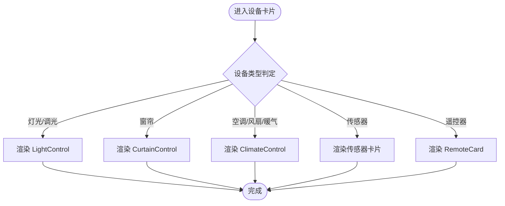

**图表来源**
- [src/app/components/dashboard/DeviceCard.tsx:26-265](file://src/app/components/dashboard/DeviceCard.tsx#L26-L265)
- [src/app/components/dashboard/cards/shared.tsx:184-250](file://src/app/components/dashboard/cards/shared.tsx#L184-L250)

**章节来源**
- [src/app/components/dashboard/DeviceCard.tsx:26-265](file://src/app/components/dashboard/DeviceCard.tsx#L26-L265)
- [src/app/components/dashboard/cards/shared.tsx:184-250](file://src/app/components/dashboard/cards/shared.tsx#L184-L250)

### 灯光控制（亮度与色温）
- 乐观 UI：在滑动过程中即时更新本地状态，提交后等待 HA 响应；若超时或未同步则回滚。
- 重试机制：最多两次重试，间隔 300ms，确保网络抖动下的可靠性。
- 同步策略：当 HA 状态到达时，以容差范围判断是否已同步，避免"跳变"。

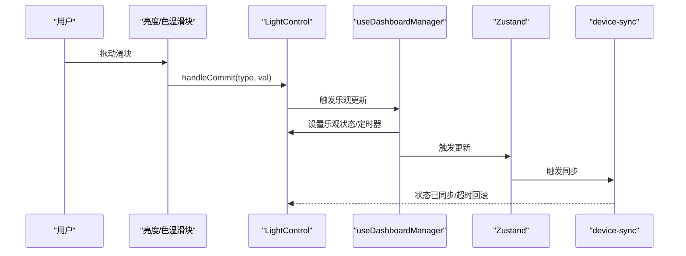

**图表来源**
- [src/app/components/dashboard/cards/LightControl.tsx:82-119](file://src/app/components/dashboard/cards/LightControl.tsx#L82-L119)
- [src/hooks/useDashboardManager.ts:25-319](file://src/hooks/useDashboardManager.ts#L25-L319)
- [src/utils/device-sync.ts:4-190](file://src/utils/device-sync.ts#L4-L190)

**章节来源**
- [src/app/components/dashboard/cards/LightControl.tsx:17-245](file://src/app/components/dashboard/cards/LightControl.tsx#L17-L245)
- [src/hooks/useDashboardManager.ts:25-319](file://src/hooks/useDashboardManager.ts#L25-L319)
- [src/utils/device-sync.ts:4-190](file://src/utils/device-sync.ts#L4-L190)

### 窗帘控制（位置拖拽）
- 拖拽交互：通过指针事件计算百分比位置，实时更新本地状态。
- 方向指示：根据拖拽方向与当前位置动态显示内外箭头，提升可视化反馈。
- 乐观提交：提交后等待 HA 响应，超时回滚，重试逻辑同灯光控制。

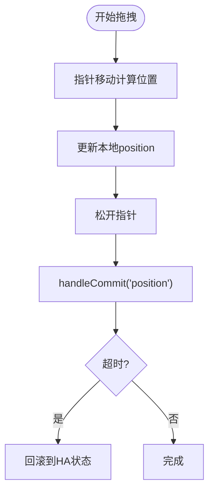

**图表来源**
- [src/app/components/dashboard/cards/CurtainControl.tsx:57-134](file://src/app/components/dashboard/cards/CurtainControl.tsx#L57-L134)

**章节来源**
- [src/app/components/dashboard/cards/CurtainControl.tsx:16-233](file://src/app/components/dashboard/cards/CurtainControl.tsx#L16-L233)

### 空调控制（温度、模式、风速）
- 模式与风速：基于 HA 属性 hvac_modes/fan_modes/swing_modes 动态生成可用选项。
- 乐观更新：温度、模式、风速变更均采用乐观 UI 与重试机制。
- 容差同步：温度变更容差为 0.5，避免微小波动导致的反复渲染。

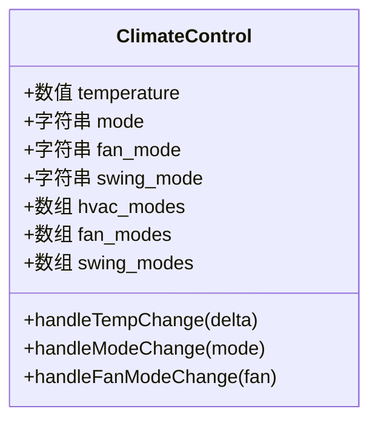

**图表来源**
- [src/app/components/dashboard/cards/ClimateControl.tsx:40-260](file://src/app/components/dashboard/cards/ClimateControl.tsx#L40-L260)

**章节来源**
- [src/app/components/dashboard/cards/ClimateControl.tsx:40-260](file://src/app/components/dashboard/cards/ClimateControl.tsx#L40-L260)

### 传感器监控
- 传感器状态卡聚合二进制与普通传感器，动态构建实体列表，支持"开启的灯光"弹出提示。
- 状态文本根据 device_class 或图标智能转换，如"有人/无人"、"门开/门关"、"漏水/正常"等。

**章节来源**
- [src/app/components/dashboard/cards/SensorStatusCard.tsx:34-110](file://src/app/components/dashboard/cards/SensorStatusCard.tsx#L34-L110)

### 设备发现与配置管理
- 自动发现：遍历 HA states，过滤允许域，结合注册表与中文名推断房间与类型。
- 实体清洗：从 friendly_name 与 entity_id 提取房间与设备类型关键词，提供默认图标映射。
- 批量操作：支持批量勾选与绑定，自动去重与覆盖"幽灵设备"（未分配房间）。
- 编辑表单：实体选择、类型与分类推荐、图标选择与名称校验。

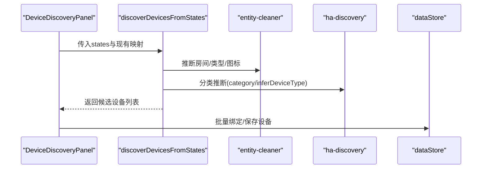

**图表来源**
- [src/app/components/settings/DeviceDiscoveryPanel.tsx:86-121](file://src/app/components/settings/DeviceDiscoveryPanel.tsx#L86-L121)
- [src/utils/device-discovery.ts:12-160](file://src/utils/device-discovery.ts#L12-L160)
- [src/utils/entity-cleaner.ts:195-380](file://src/utils/entity-cleaner.ts#L195-L380)
- [src/utils/ha-discovery.ts:18-166](file://src/utils/ha-discovery.ts#L18-L166)

**章节来源**
- [src/app/components/settings/DeviceDiscoveryPanel.tsx:34-514](file://src/app/components/settings/DeviceDiscoveryPanel.tsx#L34-L514)
- [src/app/components/settings/DeviceEditorForm.tsx:96-573](file://src/app/components/settings/DeviceEditorForm.tsx#L96-L573)
- [src/utils/device-discovery.ts:12-160](file://src/utils/device-discovery.ts#L12-L160)
- [src/utils/entity-cleaner.ts:195-380](file://src/utils/entity-cleaner.ts#L195-L380)
- [src/utils/ha-discovery.ts:18-166](file://src/utils/ha-discovery.ts#L18-L166)

### 状态同步机制
- 双向同步：从 HA states 读取状态与属性，写入本地设备对象；同时监听 last_changed/last_updated 更新时间戳。
- 类型特化：灯光同步亮度与色温；窗帘同步 isOpen 与 position；传感器同步 count 与在线状态；空调同步温度、模式、风速与摆风。
- 可见性与自定义：支持 visibility 控制仪表盘可见性，customName/customIcon 支持个性化显示。
- **新增** 用户同步：自动发现和同步人员状态，支持头像更新和在线状态检测。

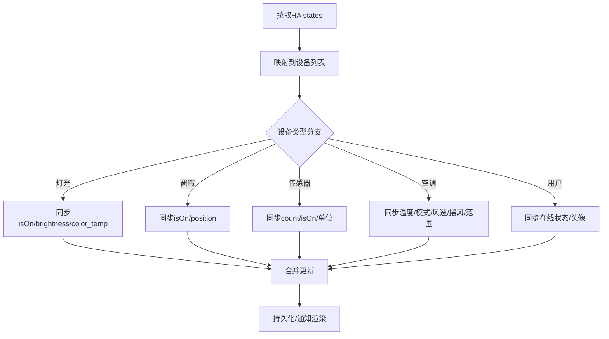

**图表来源**
- [src/utils/device-sync.ts:4-190](file://src/utils/device-sync.ts#L4-L190)
- [src/hooks/useDashboardManager.ts:77-141](file://src/hooks/useDashboardManager.ts#L77-L141)

**章节来源**
- [src/utils/device-sync.ts:4-190](file://src/utils/device-sync.ts#L4-L190)
- [src/hooks/useDashboardManager.ts:77-141](file://src/hooks/useDashboardManager.ts#L77-L141)

### 错误处理策略
- 乐观 UI 回滚：所有可交互控件在提交后设置等待状态与超时回滚，避免假死。
- 重试机制：提交后短间隔重试，确保弱网环境下的可靠性。
- 输入校验：设备编辑表单对名称、实体 ID、房间、类型、分类与图标进行前端校验与错误提示。
- 连接降级：设备发现面板在 WebSocket 未就绪时自动降级到 REST 请求，并提示错误。
- **新增** IR遥控错误处理：发送红外命令时的完整错误捕获和遥测记录。

**章节来源**
- [src/app/components/dashboard/cards/LightControl.tsx:82-119](file://src/app/components/dashboard/cards/LightControl.tsx#L82-L119)
- [src/app/components/dashboard/cards/CurtainControl.tsx:101-134](file://src/app/components/dashboard/cards/CurtainControl.tsx#L101-L134)
- [src/app/components/dashboard/cards/ClimateControl.tsx:107-135](file://src/app/components/dashboard/cards/ClimateControl.tsx#L107-L135)
- [src/app/components/settings/DeviceEditorForm.tsx:130-188](file://src/app/components/settings/DeviceEditorForm.tsx#L130-L188)
- [src/app/components/settings/DeviceDiscoveryPanel.tsx:86-121](file://src/app/components/settings/DeviceDiscoveryPanel.tsx#L86-L121)
- [src/hooks/useDashboardManager.ts:258-281](file://src/hooks/useDashboardManager.ts#L258-L281)

### useDashboardManager钩子详解
**新增** useDashboardManager钩子提供了完整的仪表盘业务逻辑封装：

- **状态管理**：集中管理设备、用户、日志和UI状态
- **设备过滤**：智能过滤常用设备和房间设备，支持编辑模式切换
- **用户同步**：自动发现人员实体，同步在线状态和头像信息
- **设备操作**：统一的设备开关、位置调整、亮度调节和IR控制
- **乐观更新**：完整的乐观UI更新和超时回滚机制
- **日志记录**：详细的设备操作日志和遥测信息

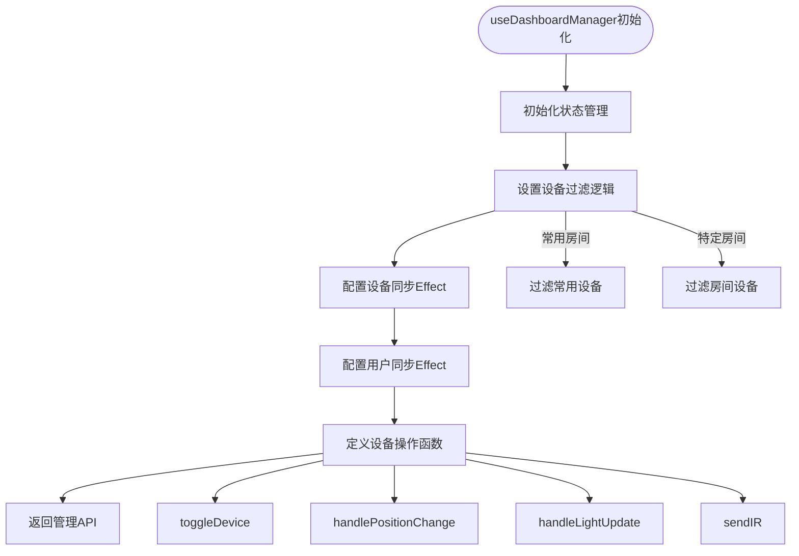

**图表来源**
- [src/hooks/useDashboardManager.ts:25-319](file://src/hooks/useDashboardManager.ts#L25-L319)

**章节来源**
- [src/hooks/useDashboardManager.ts:25-319](file://src/hooks/useDashboardManager.ts#L25-L319)

## 依赖关系分析

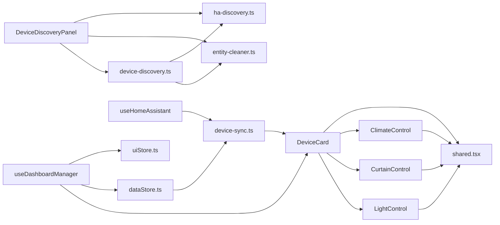

**图表来源**
- [src/app/components/dashboard/DeviceCard.tsx:26-265](file://src/app/components/dashboard/DeviceCard.tsx#L26-L265)
- [src/app/components/dashboard/cards/shared.tsx:184-250](file://src/app/components/dashboard/cards/shared.tsx#L184-L250)
- [src/app/components/settings/DeviceDiscoveryPanel.tsx:34-514](file://src/app/components/settings/DeviceDiscoveryPanel.tsx#L34-L514)
- [src/hooks/useDashboardManager.ts:25-319](file://src/hooks/useDashboardManager.ts#L25-L319)
- [src/hooks/useHomeAssistant.ts:29-329](file://src/hooks/useHomeAssistant.ts#L29-L329)
- [src/utils/device-discovery.ts:12-160](file://src/utils/device-discovery.ts#L12-L160)
- [src/utils/entity-cleaner.ts:195-380](file://src/utils/entity-cleaner.ts#L195-L380)
- [src/utils/ha-discovery.ts:18-166](file://src/utils/ha-discovery.ts#L18-L166)
- [src/utils/device-sync.ts:4-190](file://src/utils/device-sync.ts#L4-L190)
- [src/store/dataStore.ts:58-128](file://src/store/dataStore.ts#L58-L128)
- [src/store/uiStore.ts:31-55](file://src/store/uiStore.ts#L31-L55)

**章节来源**
- [src/app/components/dashboard/DeviceCard.tsx:26-265](file://src/app/components/dashboard/DeviceCard.tsx#L26-L265)
- [src/app/components/settings/DeviceDiscoveryPanel.tsx:34-514](file://src/app/components/settings/DeviceDiscoveryPanel.tsx#L34-L514)
- [src/hooks/useDashboardManager.ts:25-319](file://src/hooks/useDashboardManager.ts#L25-L319)
- [src/hooks/useHomeAssistant.ts:29-329](file://src/hooks/useHomeAssistant.ts#L29-L329)
- [src/utils/device-discovery.ts:12-160](file://src/utils/device-discovery.ts#L12-L160)
- [src/utils/device-sync.ts:4-190](file://src/utils/device-sync.ts#L4-L190)
- [src/store/dataStore.ts:58-128](file://src/store/dataStore.ts#L58-L128)
- [src/store/uiStore.ts:31-55](file://src/store/uiStore.ts#L31-L55)

## 性能考量
- 渲染优化：DeviceCard 对传感器类型使用 nowMs 作为时间依赖，其他类型忽略时间变化，减少不必要重渲染。
- 乐观更新：滑块与拖拽交互采用乐观 UI，配合超时回滚与重试，降低等待感知延迟。
- 批量操作：设备发现面板支持批量勾选与绑定，减少多次交互成本。
- 数据持久化：Zustand 结合 localStorage，仅持久化必要字段，避免大对象频繁序列化。
- **新增** 钩子缓存：useDashboardManager使用useCallback缓存处理函数，避免不必要的重新渲染。
- **新增** 引用优化：使用useRef保持配置和回调函数的最新引用，避免闭包问题。

**章节来源**
- [src/app/components/dashboard/DeviceCard.tsx:267-292](file://src/app/components/dashboard/DeviceCard.tsx#L267-L292)
- [src/app/components/dashboard/cards/LightControl.tsx:82-119](file://src/app/components/dashboard/cards/LightControl.tsx#L82-L119)
- [src/app/components/dashboard/cards/CurtainControl.tsx:101-134](file://src/app/components/dashboard/cards/CurtainControl.tsx#L101-L134)
- [src/store/dataStore.ts:104-128](file://src/store/dataStore.ts#L104-L128)
- [src/hooks/useDashboardManager.ts:47-57](file://src/hooks/useDashboardManager.ts#L47-L57)

## 故障排除指南
- 设备未出现在仪表盘：检查 visibility 与 category 是否正确；确认 entity_id 已绑定且房间非"未分配"。
- 控制无响应：确认 HA 连接状态；查看设备状态是否为 unavailable/unknown；检查网络与令牌配置。
- 亮度/色温不生效：检查灯光实体是否支持亮度与色温；确认属性同步是否成功；查看乐观回滚日志。
- 窗帘位置异常：确认实体支持 current_position；检查拖拽方向与百分比计算；查看 HA 返回值。
- 空调模式不可选：确认 hvac_modes/fan_modes/swing_modes 属性是否存在；检查设备是否处于 off 状态。
- **新增** 用户头像不更新：检查person实体是否正确配置；确认头像URL格式；验证权限设置。
- **新增** IR遥控失败：检查遥控器实体ID映射；查看遥测日志；确认Home Assistant中遥控器配置。

**章节来源**
- [src/utils/device-sync.ts:4-190](file://src/utils/device-sync.ts#L4-L190)
- [src/app/components/settings/DeviceDiscoveryPanel.tsx:86-121](file://src/app/components/settings/DeviceDiscoveryPanel.tsx#L86-L121)
- [src/hooks/useDashboardManager.ts:258-281](file://src/hooks/useDashboardManager.ts#L258-L281)

## 结论
设备控制模块通过清晰的类型定义、统一的卡片架构与完善的工具链，实现了灯光、窗帘、空调与传感器等多类设备的高效控制与状态同步。其乐观 UI、重试与容差同步策略显著提升了交互体验与鲁棒性；自动发现与批量配置简化了设备接入流程。**新增的useDashboardManager钩子**进一步优化了架构设计，将复杂的业务逻辑集中管理，提高了代码的可维护性和可扩展性。未来可在设备类型扩展、跨域联动与能耗统计等方面进一步增强。

## 附录

### 设备类型扩展开发指南
- 新增类型步骤
  1) 在设备类型定义中添加新 type 与属性字段。
  2) 在 DeviceCard 中新增类型分支并渲染对应卡片。
  3) 编写卡片组件，实现交互与乐观更新逻辑。
  4) 在 device-sync.ts 中补充状态同步分支。
  5) 在 device-discovery.ts 与 entity-cleaner.ts 中完善推断规则。
  6) 在设置面板中完善设备编辑表单与校验。
- 最佳实践
  - 保持乐观 UI 与重试机制一致，确保用户体验一致。
  - 使用容差同步避免微小波动引发的闪烁。
  - 为新类型提供默认图标与分类，便于自动发现。
  - 严格输入校验与错误提示，降低配置成本。
  - **新增** 使用useDashboardManager钩子封装新类型的业务逻辑。

**章节来源**
- [src/types/device.ts:1-46](file://src/types/device.ts#L1-L46)
- [src/app/components/dashboard/DeviceCard.tsx:26-265](file://src/app/components/dashboard/DeviceCard.tsx#L26-L265)
- [src/utils/device-sync.ts:4-190](file://src/utils/device-sync.ts#L4-L190)
- [src/utils/device-discovery.ts:12-160](file://src/utils/device-discovery.ts#L12-L160)
- [src/utils/entity-cleaner.ts:195-380](file://src/utils/entity-cleaner.ts#L195-L380)
- [src/app/components/settings/DeviceEditorForm.tsx:96-573](file://src/app/components/settings/DeviceEditorForm.tsx#L96-L573)
- [src/hooks/useDashboardManager.ts:25-319](file://src/hooks/useDashboardManager.ts#L25-L319)