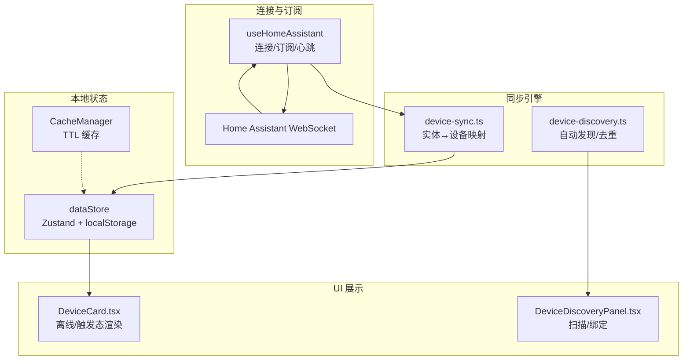
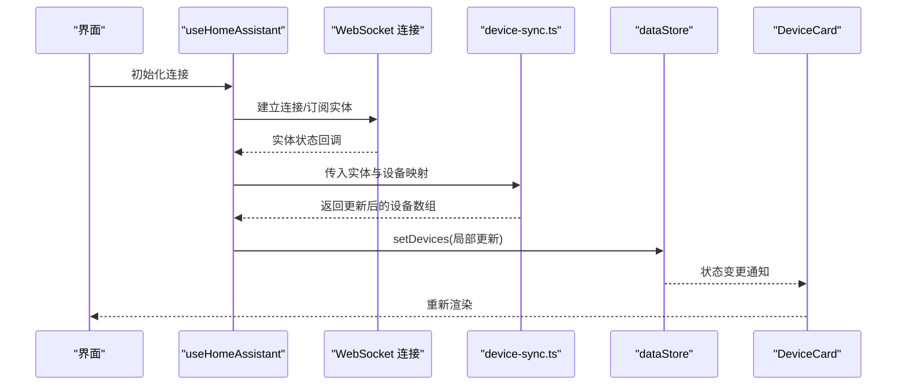
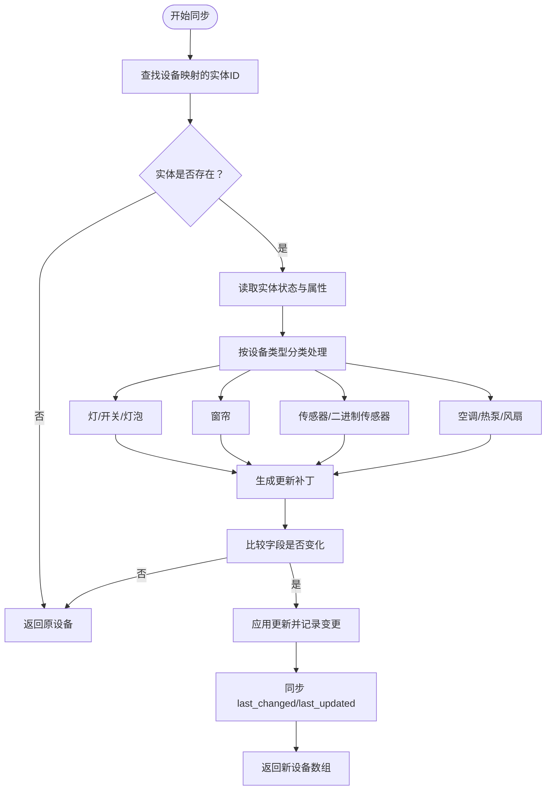
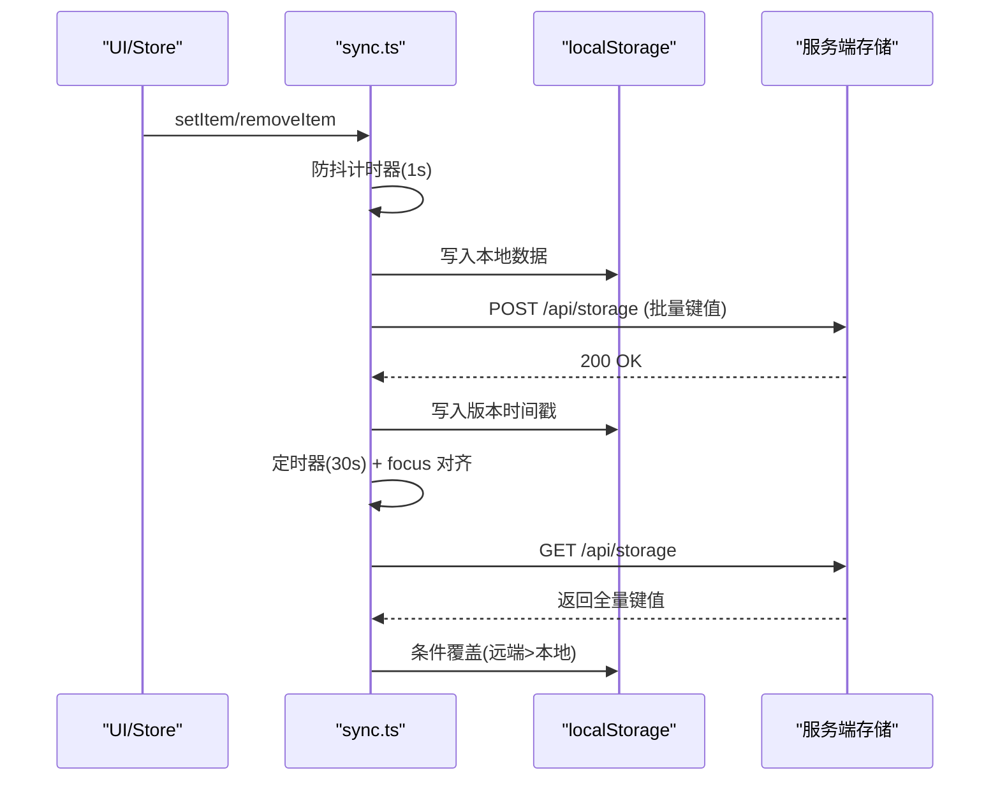
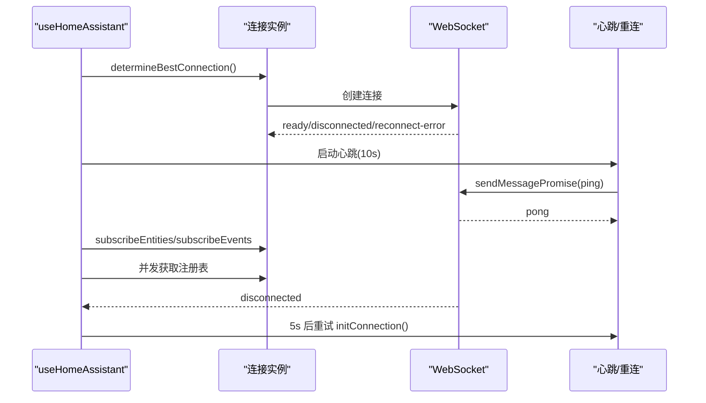
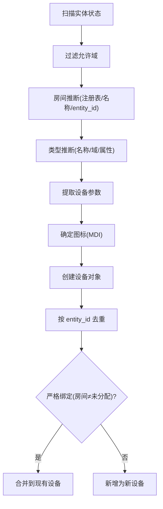
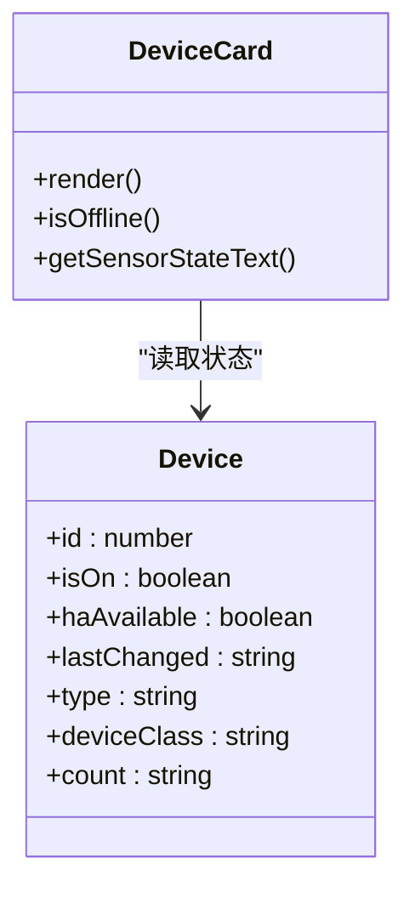
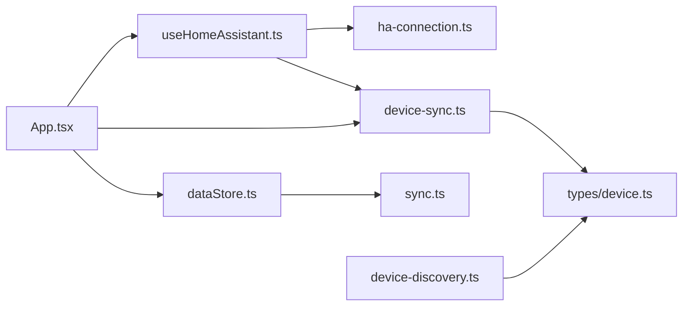

# 设备状态同步

<cite>
**本文引用的文件**
- [src/utils/device-sync.ts](file://src/utils/device-sync.ts)
- [src/utils/sync.ts](file://src/utils/sync.ts)
- [src/types/device.ts](file://src/types/device.ts)
- [src/store/dataStore.ts](file://src/store/dataStore.ts)
- [src/utils/ha-connection.ts](file://src/utils/ha-connection.ts)
- [src/hooks/useHomeAssistant.ts](file://src/hooks/useHomeAssistant.ts)
- [src/app/App.tsx](file://src/app/App.tsx)
- [src/utils/device-discovery.ts](file://src/utils/device-discovery.ts)
- [src/utils/cache-manager.ts](file://src/utils/cache-manager.ts)
- [src/utils/log-helper.ts](file://src/utils/log-helper.ts)
- [src/app/components/settings/DeviceDiscoveryPanel.tsx](file://src/app/components/settings/DeviceDiscoveryPanel.tsx)
- [src/app/components/dashboard/DeviceCard.tsx](file://src/app/components/dashboard/DeviceCard.tsx)
- [src/utils/__tests__/device-sync.light.test.ts](file://src/utils/__tests__/device-sync.light.test.ts)
</cite>

## 目录
1. [简介](#简介)
2. [项目结构](#项目结构)
3. [核心组件](#核心组件)
4. [架构总览](#架构总览)
5. [详细组件分析](#详细组件分析)
6. [依赖关系分析](#依赖关系分析)
7. [性能考量](#性能考量)
8. [故障排查指南](#故障排查指南)
9. [结论](#结论)
10. [附录](#附录)

## 简介
本文件系统性阐述设备状态同步机制的技术实现，涵盖双向同步原理、冲突解决策略、一致性保障、触发机制、批量处理与延迟优化、离线检测与重连、缓存策略、性能优化、内存管理、错误恢复、调试工具、日志与监控指标，以及配置选项与故障排除。

## 项目结构
围绕设备状态同步的关键模块包括：
- 实体订阅与连接层：通过 WebSocket 订阅 Home Assistant 实体状态变更事件，提供心跳、可用性检测与自动重连。
- 本地状态与持久化：基于 Zustand + localStorage 的本地状态管理，支持增量同步与版本控制。
- 同步引擎：将 HA 实体状态映射到本地设备对象，按设备类型进行差异计算与更新。
- 发现与绑定：自动发现 HA 实体并推断房间、类型与图标，支持手动绑定与去重。
- 缓存与日志：本地 TTL 缓存与日志清洗，辅助调试与性能优化。
- UI 层：设备卡根据同步后的状态渲染，离线与触发态可视化。

**图表来源**
- [src/hooks/useHomeAssistant.ts:1-200](file://src/hooks/useHomeAssistant.ts#L1-L200)
- [src/utils/ha-connection.ts:1-317](file://src/utils/ha-connection.ts#L1-L317)
- [src/utils/device-sync.ts:1-191](file://src/utils/device-sync.ts#L1-L191)
- [src/store/dataStore.ts:1-129](file://src/store/dataStore.ts#L1-L129)
- [src/utils/cache-manager.ts:1-57](file://src/utils/cache-manager.ts#L1-L57)
- [src/app/components/dashboard/DeviceCard.tsx:1-200](file://src/app/components/dashboard/DeviceCard.tsx#L1-L200)
- [src/app/components/settings/DeviceDiscoveryPanel.tsx:1-200](file://src/app/components/settings/DeviceDiscoveryPanel.tsx#L1-L200)

**章节来源**
- [src/hooks/useHomeAssistant.ts:1-200](file://src/hooks/useHomeAssistant.ts#L1-L200)
- [src/utils/ha-connection.ts:1-317](file://src/utils/ha-connection.ts#L1-L317)
- [src/utils/device-sync.ts:1-191](file://src/utils/device-sync.ts#L1-L191)
- [src/store/dataStore.ts:1-129](file://src/store/dataStore.ts#L1-L129)
- [src/utils/cache-manager.ts:1-57](file://src/utils/cache-manager.ts#L1-L57)
- [src/app/components/dashboard/DeviceCard.tsx:1-200](file://src/app/components/dashboard/DeviceCard.tsx#L1-L200)
- [src/app/components/settings/DeviceDiscoveryPanel.tsx:1-200](file://src/app/components/settings/DeviceDiscoveryPanel.tsx#L1-L200)

## 核心组件
- 设备类型与字段：定义设备对象的结构，包含状态、属性、可用性、时间戳等，支撑双向同步。
- 实体到设备映射：根据设备类型与实体属性，计算差异并生成更新补丁。
- 本地持久化与增量同步：以 localStorage 为载体，携带版本时间戳，支持防抖与定时对齐。
- 连接与订阅：WebSocket 订阅实体状态变更事件，心跳检测与断线重连。
- 发现与绑定：自动扫描 HA 实体，推断房间与类型，避免重复与幽灵设备。
- UI 展示：根据同步后的状态渲染离线与触发态，提供交互反馈。

**章节来源**
- [src/types/device.ts:1-46](file://src/types/device.ts#L1-L46)
- [src/utils/device-sync.ts:1-191](file://src/utils/device-sync.ts#L1-L191)
- [src/utils/sync.ts:1-161](file://src/utils/sync.ts#L1-L161)
- [src/hooks/useHomeAssistant.ts:1-200](file://src/hooks/useHomeAssistant.ts#L1-L200)
- [src/utils/device-discovery.ts:1-161](file://src/utils/device-discovery.ts#L1-L161)
- [src/app/components/dashboard/DeviceCard.tsx:1-200](file://src/app/components/dashboard/DeviceCard.tsx#L1-L200)

## 架构总览
设备状态同步采用“连接层 → 同步引擎 → 本地状态 → UI 展示”的分层设计。连接层负责与 HA 建立长连接并订阅实体状态；同步引擎将实体状态映射到本地设备对象；本地状态通过持久化与增量同步保证一致性；UI 层实时反映设备状态并提供交互入口。

**图表来源**
- [src/hooks/useHomeAssistant.ts:150-164](file://src/hooks/useHomeAssistant.ts#L150-L164)
- [src/utils/device-sync.ts:4-190](file://src/utils/device-sync.ts#L4-L190)
- [src/store/dataStore.ts:67-73](file://src/store/dataStore.ts#L67-L73)
- [src/app/components/dashboard/DeviceCard.tsx:1-200](file://src/app/components/dashboard/DeviceCard.tsx#L1-L200)

## 详细组件分析

### 同步引擎：实体到设备映射
- 映射规则
  - 灯/开关/灯泡：同步开关状态与亮度；当设备关闭时，亮度归零，颜色温度按属性同步。
  - 窗帘：同步开关（开/关）与位置，若无显式位置则依据开关状态推断 100/0。
  - 传感器类：拼接数值与单位作为显示值，同步在线状态；二进制传感器同步触发态。
  - 空调/热泵/风扇：同步运行状态、目标温度、当前温度、模式、风速、扫风等；仅在属性变化时更新。
  - 通用字段：同步 HA 状态、可用性、设备分类、最后更新/变更时间戳。
- 冲突与一致性
  - 仅在字段实际变化时生成更新补丁，避免不必要的重渲染。
  - 对于 last_changed 更新，即使业务状态未变也触发更新，确保时间戳一致。
- 性能与复杂度
  - 时间复杂度 O(N)，N 为设备数量；空间复杂度 O(N) 用于生成新设备数组。
  - 通过映射表快速定位实体，避免全量遍历。

**图表来源**
- [src/utils/device-sync.ts:4-190](file://src/utils/device-sync.ts#L4-L190)

**章节来源**
- [src/utils/device-sync.ts:1-191](file://src/utils/device-sync.ts#L1-L191)
- [src/utils/__tests__/device-sync.light.test.ts:1-73](file://src/utils/__tests__/device-sync.light.test.ts#L1-L73)

### 本地持久化与增量同步
- 版本控制
  - 使用 localStorage 存储键值对，其中包含一个时间戳键用于版本比对。
- 增量同步
  - 防抖：对本地存储写入进行 1 秒防抖，合并多次变更。
  - 主动上行：将非版本键的全部条目打包发送至服务端存储接口。
  - 主动下行：周期性轮询服务端，对比版本戳，远端更新则覆盖本地。
- 自动对齐
  - 页面获得焦点与定时器触发，定期执行下行对齐，保证跨标签页一致性。

**图表来源**
- [src/utils/sync.ts:44-161](file://src/utils/sync.ts#L44-L161)

**章节来源**
- [src/utils/sync.ts:1-161](file://src/utils/sync.ts#L1-L161)
- [src/store/dataStore.ts:106-117](file://src/store/dataStore.ts#L106-L117)

### 连接、心跳与重连
- 连接建立
  - 支持本地/公网双地址探测，选择可达地址；失败时尝试代理回退。
- 心跳与延迟
  - 定时发送 ping，计算往返延迟；异常时清空延迟值。
- 断线与重连
  - 监听断开事件，延迟重试重建连接；重连成功后重新订阅实体与事件。
- 注册表获取
  - 成功连接后并发拉取区域、设备与实体注册表，用于发现与推断。

**图表来源**
- [src/hooks/useHomeAssistant.ts:61-197](file://src/hooks/useHomeAssistant.ts#L61-L197)
- [src/utils/ha-connection.ts:47-105](file://src/utils/ha-connection.ts#L47-L105)

**章节来源**
- [src/hooks/useHomeAssistant.ts:1-200](file://src/hooks/useHomeAssistant.ts#L1-L200)
- [src/utils/ha-connection.ts:1-317](file://src/utils/ha-connection.ts#L1-L317)

### 设备发现与绑定
- 自动发现
  - 从实体状态扫描，过滤允许域，推断房间与类型，提取设备参数与图标。
  - 结合注册表优先级：实体注册表 → 设备注册表 → 名称关键词 → entity_id。
- 绑定与去重
  - 将发现的设备与现有设备进行实体 ID 去重；严格绑定要求房间非“未分配”。
  - 支持编辑现有设备或新增设备，自动分配 ID 与默认房间。
- 房间推断与类型推断
  - 使用工作线程异步处理，降低主线程阻塞。

**图表来源**
- [src/utils/device-discovery.ts:12-161](file://src/utils/device-discovery.ts#L12-L161)
- [src/app/components/settings/DeviceDiscoveryPanel.tsx:123-174](file://src/app/components/settings/DeviceDiscoveryPanel.tsx#L123-L174)

**章节来源**
- [src/utils/device-discovery.ts:1-161](file://src/utils/device-discovery.ts#L1-L161)
- [src/app/components/settings/DeviceDiscoveryPanel.tsx:1-200](file://src/app/components/settings/DeviceDiscoveryPanel.tsx#L1-L200)

### UI 展示与离线检测
- 离线检测
  - 依据 HA 状态判断设备可用性；传感器触发态与离线态叠加呈现。
- 触发态渲染
  - 根据设备类别与图标映射不同状态文案，动画指示活动状态。
- 事件日志
  - 订阅 state_changed 事件，清洗日志消息并写入本地日志队列。

**图表来源**
- [src/types/device.ts:1-46](file://src/types/device.ts#L1-L46)
- [src/app/components/dashboard/DeviceCard.tsx:36-57](file://src/app/components/dashboard/DeviceCard.tsx#L36-L57)

**章节来源**
- [src/app/components/dashboard/DeviceCard.tsx:1-200](file://src/app/components/dashboard/DeviceCard.tsx#L1-L200)
- [src/app/App.tsx:339-387](file://src/app/App.tsx#L339-L387)

## 依赖关系分析
- 组件耦合
  - useHomeAssistant 与 HA 连接模块紧密耦合，负责生命周期与重连。
  - device-sync 依赖设备类型定义与 HA 实体结构，保持低耦合。
  - dataStore 通过中间件拦截存储写入，触发同步，形成弱耦合。
- 外部依赖
  - home-assistant-js-websocket：WebSocket 连接与订阅。
  - localStorage：持久化与增量同步。
  - 浏览器事件：focus、自定义事件用于对齐。

**图表来源**
- [src/hooks/useHomeAssistant.ts:1-200](file://src/hooks/useHomeAssistant.ts#L1-L200)
- [src/utils/ha-connection.ts:1-317](file://src/utils/ha-connection.ts#L1-L317)
- [src/utils/device-sync.ts:1-191](file://src/utils/device-sync.ts#L1-L191)
- [src/types/device.ts:1-46](file://src/types/device.ts#L1-L46)
- [src/store/dataStore.ts:1-129](file://src/store/dataStore.ts#L1-L129)
- [src/utils/sync.ts:1-161](file://src/utils/sync.ts#L1-L161)
- [src/utils/device-discovery.ts:1-161](file://src/utils/device-discovery.ts#L1-L161)
- [src/app/App.tsx:382-387](file://src/app/App.tsx#L382-L387)

**章节来源**
- [src/hooks/useHomeAssistant.ts:1-200](file://src/hooks/useHomeAssistant.ts#L1-L200)
- [src/utils/device-sync.ts:1-191](file://src/utils/device-sync.ts#L1-L191)
- [src/store/dataStore.ts:1-129](file://src/store/dataStore.ts#L1-L129)
- [src/utils/sync.ts:1-161](file://src/utils/sync.ts#L1-L161)
- [src/utils/device-discovery.ts:1-161](file://src/utils/device-discovery.ts#L1-L161)
- [src/app/App.tsx:382-387](file://src/app/App.tsx#L382-L387)

## 性能考量
- 同步频率与批量
  - 实体订阅为高频事件，同步引擎按需触发，避免每帧渲染。
  - localStorage 写入防抖 1 秒，减少网络与 IO 压力。
- 内存管理
  - 仅在字段变化时生成新对象，避免浅拷贝污染。
  - 注册表与实体集合在连接成功后一次性拉取，后续通过订阅增量更新。
- 缓存策略
  - 本地 TTL 缓存用于短期数据复用，避免频繁读取 localStorage。
- UI 渲染
  - 设备卡按类型分支渲染，传感器触发态使用动画，避免全量重绘。

[本节为通用性能讨论，无需具体文件分析]

## 故障排查指南
- 连接问题
  - 检查环境变量与配置项，确认 Token 有效且长度足够。
  - 若默认连接失败，尝试代理回退；观察断线事件与重连间隔。
- 同步不生效
  - 确认设备映射表存在对应实体 ID；检查实体是否在允许域内。
  - 查看本地版本戳与服务端版本戳，确认下行对齐是否执行。
- 状态不一致
  - 关注 last_changed 更新是否触发；检查实体状态是否为 unavailable/unknown。
  - 对灯光设备，确认关闭时亮度被置零。
- 日志与调试
  - 订阅 state_changed 事件，清洗日志消息，定位异常状态变更。
  - 使用浏览器开发者工具 Network 面板观察 /api/storage 请求与响应。
- 常见症状与定位
  - 界面不更新：检查 useHomeAssistant 是否已连接与订阅。
  - 绑定冲突：严格绑定要求房间非“未分配”，否则视为新增设备。

**章节来源**
- [src/hooks/useHomeAssistant.ts:182-200](file://src/hooks/useHomeAssistant.ts#L182-L200)
- [src/utils/ha-connection.ts:51-104](file://src/utils/ha-connection.ts#L51-L104)
- [src/utils/device-sync.ts:172-186](file://src/utils/device-sync.ts#L172-L186)
- [src/utils/sync.ts:98-131](file://src/utils/sync.ts#L98-L131)
- [src/app/App.tsx:339-387](file://src/app/App.tsx#L339-L387)

## 结论
该同步机制通过“连接层 + 同步引擎 + 持久化 + UI 展示”的清晰分层，实现了设备状态的高效、可靠与一致的双向同步。其特性包括：
- 基于实体订阅的实时同步与心跳检测；
- 防抖与版本戳驱动的增量同步；
- 针对多种设备类型的差异化映射与一致性保障；
- 自动发现与严格绑定策略，降低幽灵设备风险；
- 本地 TTL 缓存与日志清洗，提升性能与可观测性。

## 附录
- 配置选项
  - 连接：本地/公网 URL、Token；支持代理回退。
  - 同步：版本戳键名、防抖时长、自动对齐周期。
  - 发现：允许域集合、房间关键词、类型推断规则。
- 监控指标
  - 连接状态、延迟、断线次数、重连耗时、实体订阅回调频率、同步补丁大小、日志条数。

[本节为概览性内容，无需具体文件分析]