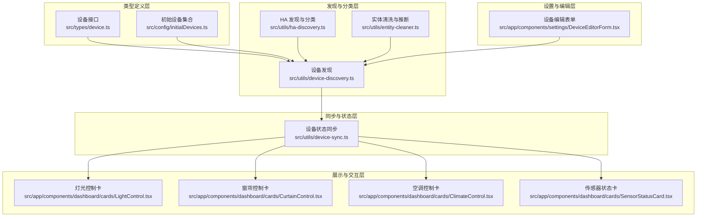
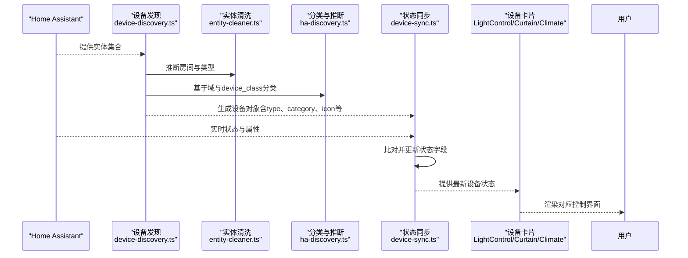
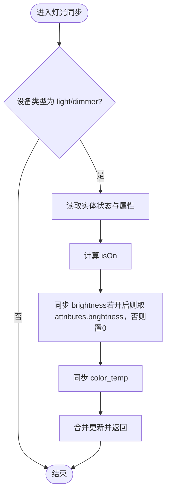
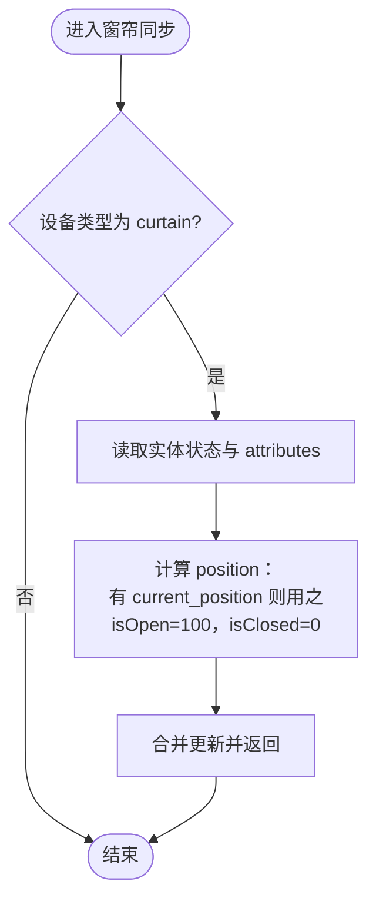
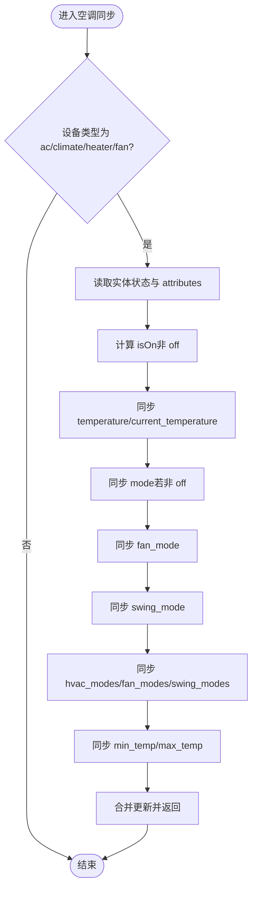
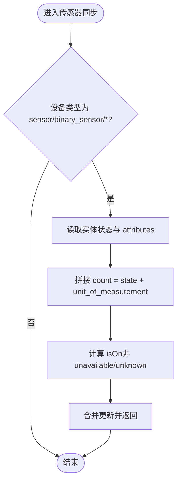
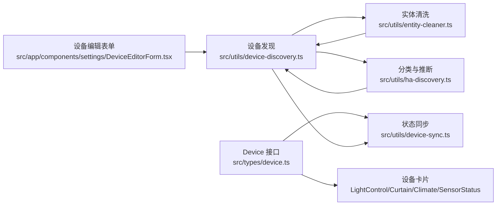

# 设备类型定义

<cite>
**本文档引用的文件**
- [src/types/device.ts](file://src/types/device.ts)
- [src/config/initialDevices.ts](file://src/config/initialDevices.ts)
- [src/utils/device-sync.ts](file://src/utils/device-sync.ts)
- [src/utils/device-discovery.ts](file://src/utils/device-discovery.ts)
- [src/utils/ha-discovery.ts](file://src/utils/ha-discovery.ts)
- [src/utils/entity-cleaner.ts](file://src/utils/entity-cleaner.ts)
- [src/app/components/dashboard/cards/LightControl.tsx](file://src/app/components/dashboard/cards/LightControl.tsx)
- [src/app/components/dashboard/cards/CurtainControl.tsx](file://src/app/components/dashboard/cards/CurtainControl.tsx)
- [src/app/components/dashboard/cards/ClimateControl.tsx](file://src/app/components/dashboard/cards/ClimateControl.tsx)
- [src/app/components/dashboard/cards/SensorStatusCard.tsx](file://src/app/components/dashboard/cards/SensorStatusCard.tsx)
- [src/app/components/settings/DeviceEditorForm.tsx](file://src/app/components/settings/DeviceEditorForm.tsx)
</cite>

## 目录
1. [简介](#简介)
2. [项目结构](#项目结构)
3. [核心组件](#核心组件)
4. [架构总览](#架构总览)
5. [详细组件分析](#详细组件分析)
6. [依赖关系分析](#依赖关系分析)
7. [性能考量](#性能考量)
8. [故障排查指南](#故障排查指南)
9. [结论](#结论)
10. [附录](#附录)

## 简介
本文件系统化梳理了本项目的设备类型定义体系，涵盖设备类型枚举、设备接口定义、设备状态模型，以及灯光、窗帘、空调、传感器等设备类型的类型标识与属性定义。同时阐明设备类别（deviceClass）的作用与分类规则，解析设备可用性状态（haAvailable）、最后变更时间（lastChanged）等关键字段的含义与用途，并提供设备类型扩展的开发指南与向后兼容性建议。

## 项目结构
设备类型系统由以下层次构成：
- 类型定义层：统一的设备接口与初始设备集合
- 发现与分类层：基于 Home Assistant 实体的自动发现、分类与类型推断
- 同步与状态层：与 Home Assistant 实时状态同步，维护设备状态模型
- 展示与交互层：按设备类型渲染卡片与控制界面
- 设置与编辑层：设备类型与类别的手动配置入口

**图表来源**
- [src/types/device.ts:1-46](file://src/types/device.ts#L1-L46)
- [src/config/initialDevices.ts:1-68](file://src/config/initialDevices.ts#L1-L68)
- [src/utils/device-discovery.ts:1-161](file://src/utils/device-discovery.ts#L1-L161)
- [src/utils/ha-discovery.ts:1-167](file://src/utils/ha-discovery.ts#L1-L167)
- [src/utils/entity-cleaner.ts:1-381](file://src/utils/entity-cleaner.ts#L1-L381)
- [src/utils/device-sync.ts:1-191](file://src/utils/device-sync.ts#L1-L191)
- [src/app/components/dashboard/cards/LightControl.tsx:1-246](file://src/app/components/dashboard/cards/LightControl.tsx#L1-L246)
- [src/app/components/dashboard/cards/CurtainControl.tsx:1-234](file://src/app/components/dashboard/cards/CurtainControl.tsx#L1-L234)
- [src/app/components/dashboard/cards/ClimateControl.tsx:1-261](file://src/app/components/dashboard/cards/ClimateControl.tsx#L1-L261)
- [src/app/components/dashboard/cards/SensorStatusCard.tsx:1-111](file://src/app/components/dashboard/cards/SensorStatusCard.tsx#L1-L111)
- [src/app/components/settings/DeviceEditorForm.tsx:1-574](file://src/app/components/settings/DeviceEditorForm.tsx#L1-L574)

**章节来源**
- [src/types/device.ts:1-46](file://src/types/device.ts#L1-L46)
- [src/config/initialDevices.ts:1-68](file://src/config/initialDevices.ts#L1-L68)
- [src/utils/device-discovery.ts:1-161](file://src/utils/device-discovery.ts#L1-L161)
- [src/utils/ha-discovery.ts:1-167](file://src/utils/ha-discovery.ts#L1-L167)
- [src/utils/entity-cleaner.ts:1-381](file://src/utils/entity-cleaner.ts#L1-L381)
- [src/utils/device-sync.ts:1-191](file://src/utils/device-sync.ts#L1-L191)

## 核心组件
本系统围绕统一的设备接口进行设计，关键字段包括：
- 基础标识与可见性：id、entity_id、name、icon、room、type、category、subType、visibility
- 显示与自定义：customName、customIcon、position、lastChanged、lastUpdated
- 状态与数值：isOn、count、power、temperature、current_temperature、mode、fan_mode、swing_mode
- 空调专用：hvac_modes、fan_modes、swing_modes、min_temp、max_temp、supported_features
- 灯具专用：brightness、color_temp、supported_features
- 通用属性：deviceClass、haAvailable、haState、unit_of_measurement、state

这些字段在不同设备类型中以不同的语义出现，例如：
- 灯具：通过 isOn、brightness、color_temp 表征状态；通过 supported_features 判断是否为调光设备
- 窗帘：通过 isOn、position 表征状态与位置
- 空调：通过 mode、temperature、fan_mode、swing_mode、hvac_modes、fan_modes、swing_modes 等表征运行参数
- 传感器：通过 count（值+单位）、unit_of_measurement、isOn（在线状态）等表征

**章节来源**
- [src/types/device.ts:1-46](file://src/types/device.ts#L1-L46)

## 架构总览
设备类型系统的关键流程如下：
- 自动发现：从 Home Assistant 实体集合中提取设备，结合友好名称、域（domain）、设备类别（device_class）与属性，推断出设备类型与图标
- 分类与映射：根据域与设备类别进行粗分类（如照明、开关、空调、窗帘、传感器、安防），并进一步细化到具体类型（如调光灯、普通灯、窗帘、空调等）
- 状态同步：将 Home Assistant 的实时状态与本地设备对象进行比对与更新，维护 lastChanged、lastUpdated、haAvailable 等关键字段
- 展示与交互：根据设备类型渲染对应的卡片与控制界面，提供直观的操作体验

**图表来源**
- [src/utils/device-discovery.ts:12-161](file://src/utils/device-discovery.ts#L12-L161)
- [src/utils/entity-cleaner.ts:195-255](file://src/utils/entity-cleaner.ts#L195-L255)
- [src/utils/ha-discovery.ts:89-166](file://src/utils/ha-discovery.ts#L89-L166)
- [src/utils/device-sync.ts:4-191](file://src/utils/device-sync.ts#L4-L191)
- [src/app/components/dashboard/cards/LightControl.tsx:17-246](file://src/app/components/dashboard/cards/LightControl.tsx#L17-L246)
- [src/app/components/dashboard/cards/CurtainControl.tsx:16-234](file://src/app/components/dashboard/cards/CurtainControl.tsx#L16-L234)
- [src/app/components/dashboard/cards/ClimateControl.tsx:40-261](file://src/app/components/dashboard/cards/ClimateControl.tsx#L40-L261)

## 详细组件分析

### 设备接口与状态模型
- 设备接口定义了统一的状态模型，覆盖基础标识、显示配置、可见性、状态与数值、空调/灯具专用字段、通用属性等
- 关键字段说明：
  - deviceClass：来自 Home Assistant attributes 的设备类别，用于辅助分类与显示
  - haAvailable：根据实体状态是否为 unavailable 或 unknown 判定
  - lastChanged：实体最后一次状态变更的时间戳
  - lastUpdated：实体最后一次属性更新的时间戳
  - state/haState：实体状态与 HA 状态的存储

**章节来源**
- [src/types/device.ts:1-46](file://src/types/device.ts#L1-L46)

### 设备类型与分类规则
- 设备类型（type）与类别（category）的确定分为两层：
  - 自动推断：基于友好名称关键词、域（domain）、设备类别（device_class）与属性进行综合判断
  - 分类（category）：基于域与设备类别进行粗分类，如照明、开关、空调、窗帘、传感器、安防等
- 类型映射示例：
  - 灯具：light（标准灯）、dimmer（调光灯，依据 supported_features 位判断）
  - 窗帘：curtain（cover 域）
  - 空调：ac（climate 域统一为 ac）
  - 传感器：sensor（sensor 域）、binary_sensor（binary_sensor 域）
  - 其他：media（media_player）、remote（remote）、lock（lock）、vacuum（vacuum）、alarm（alarm_control_panel）

**章节来源**
- [src/utils/entity-cleaner.ts:69-139](file://src/utils/entity-cleaner.ts#L69-L139)
- [src/utils/entity-cleaner.ts:195-255](file://src/utils/entity-cleaner.ts#L195-L255)
- [src/utils/ha-discovery.ts:75-166](file://src/utils/ha-discovery.ts#L75-L166)

### 灯光设备（light/dimmer）
- 类型标识：light（标准灯）、dimmer（调光灯）
- 属性定义：
  - 状态：isOn
  - 数值：brightness（亮度）、color_temp（色温，单位通常为 mireds）
  - 特性：supported_features（用于区分 dimmer 与 light）
- 状态同步与交互：
  - 同步逻辑：根据实体状态与 attributes 更新 isOn、brightness、color_temp
  - 交互界面：提供亮度滑杆与色温滑杆，支持乐观更新与重试机制

**图表来源**
- [src/utils/device-sync.ts:22-42](file://src/utils/device-sync.ts#L22-L42)

**章节来源**
- [src/utils/device-sync.ts:22-42](file://src/utils/device-sync.ts#L22-L42)
- [src/app/components/dashboard/cards/LightControl.tsx:17-246](file://src/app/components/dashboard/cards/LightControl.tsx#L17-L246)

### 窗帘设备（curtain）
- 类型标识：curtain
- 属性定义：
  - 状态：isOn（open/closed）
  - 数值：position（百分比位置）
- 状态同步与交互：
  - 同步逻辑：根据实体状态与 attributes.current_position 计算 position；若无 attributes，则根据状态推断 100/0
  - 交互界面：支持拖拽与点击切换，提供乐观更新与重试机制

**图表来源**
- [src/utils/device-sync.ts:43-59](file://src/utils/device-sync.ts#L43-L59)

**章节来源**
- [src/utils/device-sync.ts:43-59](file://src/utils/device-sync.ts#L43-L59)
- [src/app/components/dashboard/cards/CurtainControl.tsx:16-234](file://src/app/components/dashboard/cards/CurtainControl.tsx#L16-L234)

### 空调设备（ac/climate/heater/fan）
- 类型标识：ac（统一为 ac，覆盖 climate、fan、humidifier）
- 属性定义：
  - 运行状态：isOn（非 off 即视为开启）
  - 目标与当前温度：temperature、current_temperature
  - 模式：mode（cool/heat/auto/dry/fan_only 等）
  - 风速：fan_mode（auto/low/medium/high/turbo/silent 等）
  - 扫风：swing_mode（off/vertical/horizontal/both）
  - 可用模式：hvac_modes、fan_modes、swing_modes
  - 温度范围：min_temp、max_temp
- 状态同步与交互：
  - 同步逻辑：根据 attributes.temperature/current_temperature/state/fan_mode/swing_mode 等更新
  - 交互界面：提供温度调节、模式与风速选择，支持乐观更新与重试机制

**图表来源**
- [src/utils/device-sync.ts:78-153](file://src/utils/device-sync.ts#L78-L153)

**章节来源**
- [src/utils/device-sync.ts:78-153](file://src/utils/device-sync.ts#L78-L153)
- [src/app/components/dashboard/cards/ClimateControl.tsx:40-261](file://src/app/components/dashboard/cards/ClimateControl.tsx#L40-L261)

### 传感器设备（sensor/binary_sensor/temp_sensor 等）
- 类型标识：sensor、binary_sensor、temp_sensor、humidity_sensor、light_sensor、pm25_sensor、co2_sensor、power_sensor、energy_sensor、battery_sensor
- 属性定义：
  - 在线状态：isOn（由实体状态是否为 unavailable/unknown 判断）
  - 数值显示：count（拼接 state 与 unit_of_measurement）
  - 单位：unit_of_measurement
- 状态同步与交互：
  - 同步逻辑：根据 unit_of_measurement 与 state 组合 count；根据状态更新 isOn
  - 交互界面：传感器状态卡聚合多种二进制与普通传感器状态

**图表来源**
- [src/utils/device-sync.ts:60-78](file://src/utils/device-sync.ts#L60-L78)

**章节来源**
- [src/utils/device-sync.ts:60-78](file://src/utils/device-sync.ts#L60-L78)
- [src/app/components/dashboard/cards/SensorStatusCard.tsx:34-111](file://src/app/components/dashboard/cards/SensorStatusCard.tsx#L34-L111)

### 设备可用性状态与时间戳
- haAvailable：当实体状态不是 unavailable 或 unknown 时为 true，用于指示设备在线状态
- lastChanged：实体最后一次状态变更的时间戳，用于驱动 UI 的乐观更新与回滚
- lastUpdated：实体最后一次属性更新的时间戳，用于刷新显示

**章节来源**
- [src/utils/device-sync.ts:155-186](file://src/utils/device-sync.ts#L155-L186)

### 设备类（deviceClass）的作用与分类规则
- deviceClass 来源于 Home Assistant attributes，用于辅助分类与类型推断
- 分类规则：
  - 安防类：lock、alarm_control_panel，以及 binary_sensor 下的 door、garage_door、lock、opening、safety、smoke、window、tamper
  - 照明类：light
  - 开关类：switch、input_boolean
  - 空调类：climate、fan、humidifier、air_quality
  - 窗帘类：cover
  - 传感器类：sensor、binary_sensor（特定 device_class 如 motion/occupancy/presence 归为 sensor）
- 类别映射与默认图标来源于实体清洗模块与 HA 发现模块

**章节来源**
- [src/utils/ha-discovery.ts:89-129](file://src/utils/ha-discovery.ts#L89-L129)
- [src/utils/entity-cleaner.ts:195-255](file://src/utils/entity-cleaner.ts#L195-L255)

### 初始设备与演示
- 初始设备集合展示了典型设备类型与属性，便于快速上手与验证
  - 空调：ac，包含温度、风速、扫风等属性
  - 灯具：light，包含亮度与色温
  - 窗帘：curtain，包含位置
  - 传感器：sensor，包含在线状态
  - 遥控器：remote

**章节来源**
- [src/config/initialDevices.ts:3-68](file://src/config/initialDevices.ts#L3-L68)

### 设备编辑与类型选择
- 设备编辑表单提供设备类型与类别的选择入口，支持从实体 ID 推断类型与图标，并校验必填项
- 类型选项与推荐类别：
  - light、dimmer、switch、outlet、ac、curtain、sensor
- 推荐类别：根据实体域与设备类别自动推断，确保一致性

**章节来源**
- [src/app/components/settings/DeviceEditorForm.tsx:46-94](file://src/app/components/settings/DeviceEditorForm.tsx#L46-L94)
- [src/app/components/settings/DeviceEditorForm.tsx:220-251](file://src/app/components/settings/DeviceEditorForm.tsx#L220-L251)

## 依赖关系分析
- 设备接口（Device）被所有设备卡片与同步逻辑所依赖
- 设备发现与实体清洗模块共同决定设备类型与图标
- 分类模块为设备发现提供粗分类依据
- 状态同步模块负责与 Home Assistant 实时状态保持一致
- 编辑表单依赖分类与清洗模块以提供推荐类型与图标

**图表来源**
- [src/types/device.ts:1-46](file://src/types/device.ts#L1-L46)
- [src/utils/device-discovery.ts:12-161](file://src/utils/device-discovery.ts#L12-L161)
- [src/utils/entity-cleaner.ts:195-255](file://src/utils/entity-cleaner.ts#L195-L255)
- [src/utils/ha-discovery.ts:89-166](file://src/utils/ha-discovery.ts#L89-L166)
- [src/utils/device-sync.ts:4-191](file://src/utils/device-sync.ts#L4-L191)
- [src/app/components/settings/DeviceEditorForm.tsx:1-574](file://src/app/components/settings/DeviceEditorForm.tsx#L1-L574)

**章节来源**
- [src/types/device.ts:1-46](file://src/types/device.ts#L1-L46)
- [src/utils/device-discovery.ts:12-161](file://src/utils/device-discovery.ts#L12-L161)
- [src/utils/entity-cleaner.ts:195-255](file://src/utils/entity-cleaner.ts#L195-L255)
- [src/utils/ha-discovery.ts:89-166](file://src/utils/ha-discovery.ts#L89-L166)
- [src/utils/device-sync.ts:4-191](file://src/utils/device-sync.ts#L4-L191)
- [src/app/components/settings/DeviceEditorForm.tsx:1-574](file://src/app/components/settings/DeviceEditorForm.tsx#L1-L574)

## 性能考量
- 批量处理：设备发现与同步采用遍历实体集合的方式，注意在大规模实体场景下的性能优化
- 乐观更新：卡片交互采用乐观更新与超时回滚策略，减少等待时间并提升用户体验
- 字段更新判定：仅在状态或属性发生变化时才触发更新，降低不必要的重渲染
- 本地缓存：设备映射与实体 ID 集合使用 Set 与 Map 结构，提高查找效率

[本节为通用指导，不直接分析具体文件]

## 故障排查指南
- 设备不在线：检查 haAvailable 字段，确认实体状态是否为 unavailable 或 unknown
- 状态不同步：核对 lastChanged 与 lastUpdated 是否更新，确认实体属性是否变化
- 类型识别错误：检查 friendly_name 关键词、domain 与 device_class，必要时在实体清洗模块中补充关键词映射
- 交互异常：查看卡片中的乐观更新与重试逻辑，确认超时与回滚是否按预期执行

**章节来源**
- [src/utils/device-sync.ts:155-186](file://src/utils/device-sync.ts#L155-L186)
- [src/app/components/dashboard/cards/LightControl.tsx:72-135](file://src/app/components/dashboard/cards/LightControl.tsx#L72-L135)
- [src/app/components/dashboard/cards/CurtainControl.tsx:101-134](file://src/app/components/dashboard/cards/CurtainControl.tsx#L101-L134)
- [src/app/components/dashboard/cards/ClimateControl.tsx:107-135](file://src/app/components/dashboard/cards/ClimateControl.tsx#L107-L135)

## 结论
本设备类型定义体系以统一的设备接口为核心，结合自动发现、分类与状态同步机制，实现了对灯光、窗帘、空调、传感器等设备类型的完整覆盖。通过 deviceClass 辅助分类、haAvailable 与时间戳保障状态一致性，并以卡片与编辑表单提供直观的交互体验。扩展新设备类型时，应遵循现有映射规则与向后兼容原则，确保类型与类别的稳定性与一致性。

[本节为总结性内容，不直接分析具体文件]

## 附录

### 设备类型扩展开发指南
- 新增类型映射：
  - 在实体清洗模块中添加友好名称关键词与类型映射
  - 在分类模块中完善域与设备类别的映射规则
- 新增卡片交互：
  - 在 dashboard/cards 下新增对应卡片组件，遵循乐观更新与重试机制
  - 在设备编辑表单中增加类型选项与推荐类别
- 向后兼容性：
  - 保持现有 type 与 category 的稳定性，避免破坏既有设备配置
  - 对新增类型提供默认图标与房间推断策略
  - 在状态同步逻辑中增加条件判断，避免对未知类型产生副作用

**章节来源**
- [src/utils/entity-cleaner.ts:69-139](file://src/utils/entity-cleaner.ts#L69-L139)
- [src/utils/ha-discovery.ts:89-166](file://src/utils/ha-discovery.ts#L89-L166)
- [src/app/components/settings/DeviceEditorForm.tsx:46-94](file://src/app/components/settings/DeviceEditorForm.tsx#L46-L94)