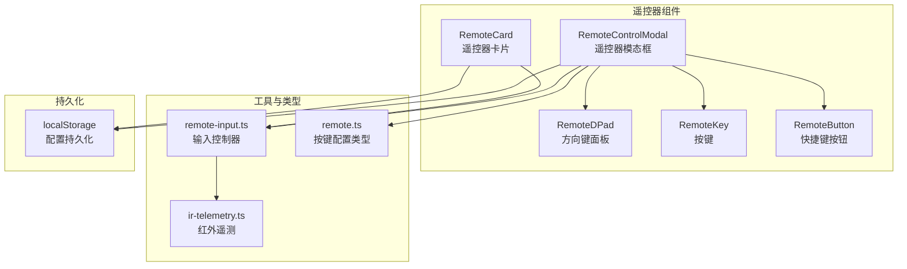
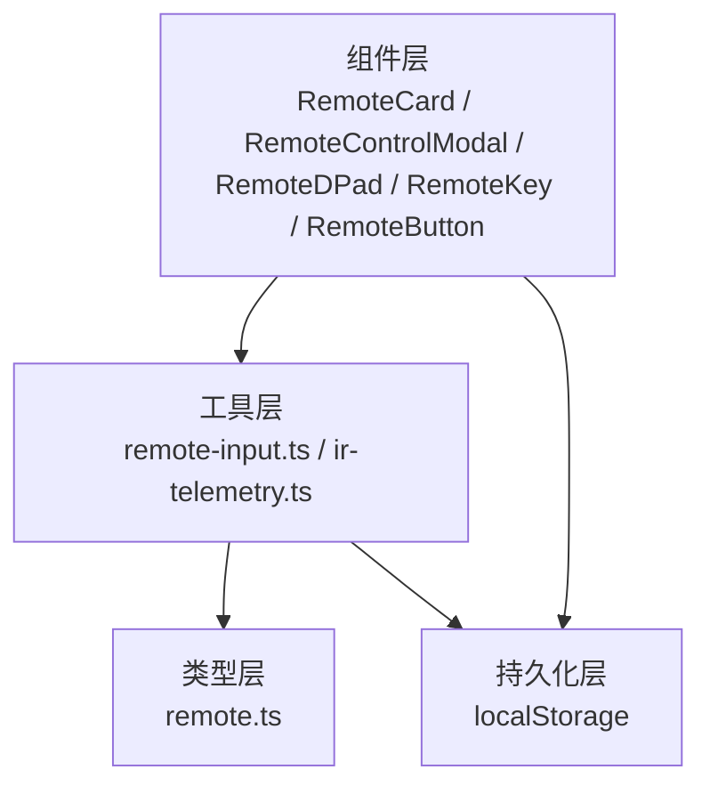
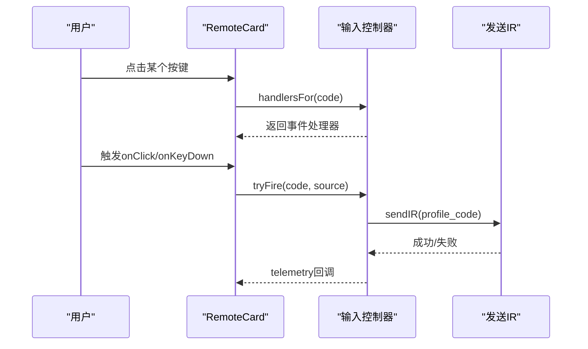
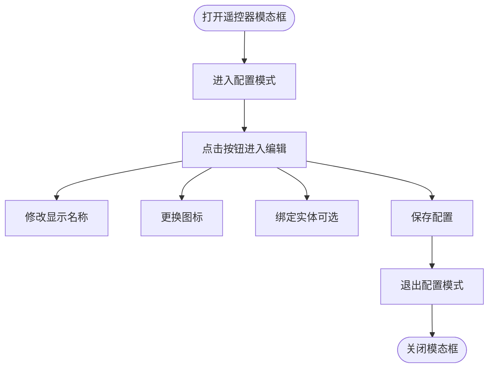
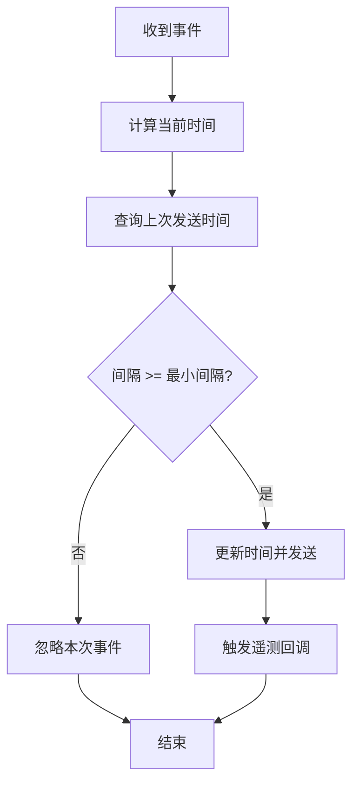
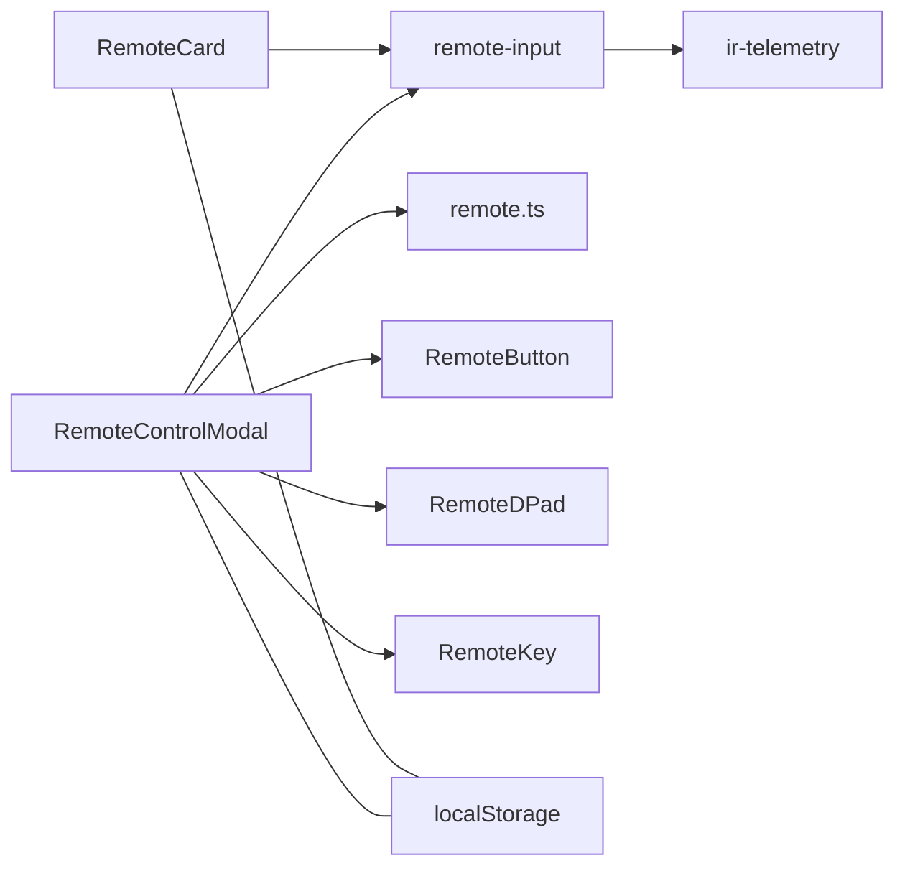

# 遥控器控制系统

<cite>
**本文引用的文件**
- [RemoteCard.tsx](file://src/app/components/remote/RemoteCard.tsx)
- [RemoteControlModal.tsx](file://src/app/components/remote/RemoteControlModal.tsx)
- [RemoteDPad.tsx](file://src/app/components/remote/RemoteDPad.tsx)
- [RemoteKey.tsx](file://src/app/components/remote/RemoteKey.tsx)
- [RemoteButton.tsx](file://src/app/components/remote/RemoteButton.tsx)
- [remote.ts](file://src/types/remote.ts)
- [remote-input.ts](file://src/utils/remote-input.ts)
- [ir-telemetry.ts](file://src/utils/ir-telemetry.ts)
- [RemoteCardQuickKeys.test.tsx](file://src/app/components/remote/__tests__/RemoteCardQuickKeys.test.tsx)
- [RemoteControlModal.test.tsx](file://src/app/components/remote/__tests__/RemoteControlModal.test.tsx)
- [remote-input.test.ts](file://src/utils/__tests__/remote-input.test.ts)
- [ir-telemetry.test.ts](file://src/utils/__tests__/ir-telemetry.test.ts)
- [RemoteCard.css](file://src/app/components/remote/RemoteCard.css)
- [DeviceDiscoveryPanel.tsx](file://src/app/components/settings/DeviceDiscoveryPanel.tsx)
</cite>

## 目录
1. [简介](#简介)
2. [项目结构](#项目结构)
3. [核心组件](#核心组件)
4. [架构总览](#架构总览)
5. [详细组件分析](#详细组件分析)
6. [依赖关系分析](#依赖关系分析)
7. [性能考量](#性能考量)
8. [故障排除指南](#故障排除指南)
9. [结论](#结论)
10. [附录](#附录)

## 简介
本技术文档面向“遥控器控制系统”，围绕以下目标展开：深入解释遥控器设备的红外信号发送、按键映射与快捷键配置；详细说明遥控器卡片的布局设计、按钮交互与模态框控制；阐述遥控器的特殊处理（数字键、方向键、功能键）与自定义按键设置；分析遥控器的信号编码、发送机制与成功率优化；包含遥控器的设备绑定、学习模式与故障排除；提供遥控器配置的详细步骤与兼容性检查方法。

## 项目结构
遥控器系统由前端组件与工具模块组成，核心位于 src/app/components/remote 与 src/utils。整体采用组件化设计，通过本地存储持久化用户配置，并通过 Home Assistant 的服务接口实现设备控制。

**图表来源**
- [RemoteCard.tsx:1-310](file://src/app/components/remote/RemoteCard.tsx#L1-L310)
- [RemoteControlModal.tsx:1-778](file://src/app/components/remote/RemoteControlModal.tsx#L1-L778)
- [RemoteDPad.tsx:1-114](file://src/app/components/remote/RemoteDPad.tsx#L1-L114)
- [RemoteKey.tsx:1-81](file://src/app/components/remote/RemoteKey.tsx#L1-L81)
- [RemoteButton.tsx:1-120](file://src/app/components/remote/RemoteButton.tsx#L1-L120)
- [remote-input.ts:1-117](file://src/utils/remote-input.ts#L1-L117)
- [remote.ts:1-45](file://src/types/remote.ts#L1-L45)
- [ir-telemetry.ts:1-21](file://src/utils/ir-telemetry.ts#L1-L21)

**章节来源**
- [RemoteCard.tsx:1-310](file://src/app/components/remote/RemoteCard.tsx#L1-L310)
- [RemoteControlModal.tsx:1-778](file://src/app/components/remote/RemoteControlModal.tsx#L1-L778)
- [remote.ts:1-45](file://src/types/remote.ts#L1-L45)

## 核心组件
- 遥控器卡片（RemoteCard）
  - 负责展示遥控器界面、管理配置文件（TV/机顶盒/音响）、加载映射与全局配置、调用输入控制器进行按键事件处理。
  - 支持编辑模式与通用按钮切换，使用本地存储持久化当前配置文件与映射。
- 遥控器模态框（RemoteControlModal）
  - 提供完整的配置界面，支持进入/退出配置模式、编辑按钮名称与图标、选择实体、拖拽排序快捷键、删除自定义按钮等。
  - 内置全局映射（profile_*）与设备配置文件映射（按 profile 分类），统一触发服务调用。
- 方向键面板（RemoteDPad）
  - 呈现 D-Pad 按键区域，支持上下左右与中心 OK 键，适配编辑模式下的交互限制。
- 按键组件（RemoteKey）
  - 封装单个按键的渲染与交互，支持不同尺寸与变体（默认/电源/柔和），在编辑模式下可显示删除按钮。
- 快捷键按钮（RemoteButton）
  - 支持拖拽排序与编辑/删除操作，用于快速访问常用功能。
- 输入控制器（remote-input）
  - 统一处理鼠标/键盘事件，内置去抖与节流，确保按键发送频率可控，避免误触与过度发送。
- 类型定义（remote.ts）
  - 定义遥控器按钮配置结构与默认按钮集合，涵盖电源、音量、频道、方向、数字键等。
- 红外遥测（ir-telemetry）
  - 发送自定义事件以记录红外发送结果，便于监控与诊断。

**章节来源**
- [RemoteCard.tsx:40-310](file://src/app/components/remote/RemoteCard.tsx#L40-L310)
- [RemoteControlModal.tsx:49-778](file://src/app/components/remote/RemoteControlModal.tsx#L49-L778)
- [RemoteDPad.tsx:11-114](file://src/app/components/remote/RemoteDPad.tsx#L11-L114)
- [RemoteKey.tsx:21-81](file://src/app/components/remote/RemoteKey.tsx#L21-L81)
- [RemoteButton.tsx:17-120](file://src/app/components/remote/RemoteButton.tsx#L17-L120)
- [remote-input.ts:31-117](file://src/utils/remote-input.ts#L31-L117)
- [remote.ts:16-45](file://src/types/remote.ts#L16-L45)
- [ir-telemetry.ts:10-21](file://src/utils/ir-telemetry.ts#L10-L21)

## 架构总览
遥控器系统采用“组件-工具-持久化”分层架构：
- 组件层：负责 UI 呈现与用户交互（RemoteCard、RemoteControlModal、RemoteDPad、RemoteKey、RemoteButton）。
- 工具层：提供输入控制与遥测能力（remote-input、ir-telemetry）。
- 类型层：约束配置数据结构（remote.ts）。
- 持久化层：使用 localStorage 存储配置（配置文件、全局映射、按钮布局）。

**图表来源**
- [RemoteCard.tsx:1-310](file://src/app/components/remote/RemoteCard.tsx#L1-L310)
- [RemoteControlModal.tsx:1-778](file://src/app/components/remote/RemoteControlModal.tsx#L1-L778)
- [remote-input.ts:1-117](file://src/utils/remote-input.ts#L1-L117)
- [ir-telemetry.ts:1-21](file://src/utils/ir-telemetry.ts#L1-L21)
- [remote.ts:1-45](file://src/types/remote.ts#L1-L45)

## 详细组件分析

### 遥控器卡片（RemoteCard）
- 布局与交互
  - 顶部包含电源状态指示与标题，右侧为配置文件切换（TV/机顶盒/音响），支持图标与显示文本自定义。
  - 中央为 D-Pad 区域，包含上下左右与中心 OK 键；两侧分别为音量与导航键。
  - 使用输入控制器生成按键处理器，统一处理点击与键盘事件。
- 配置与映射
  - 通过本地存储加载当前配置文件与映射；支持全局映射（profile_*）与设备配置文件映射。
  - 在编辑模式下，右上角显示“通用/非通用”切换按钮，便于快速共享或隔离配置。
- 触摸优化
  - 设置触摸行为与高亮颜色，提升移动端体验。

**图表来源**
- [RemoteCard.tsx:114-127](file://src/app/components/remote/RemoteCard.tsx#L114-L127)
- [remote-input.ts:46-56](file://src/utils/remote-input.ts#L46-L56)

**章节来源**
- [RemoteCard.tsx:40-310](file://src/app/components/remote/RemoteCard.tsx#L40-L310)
- [RemoteCard.css:1-12](file://src/app/components/remote/RemoteCard.css#L1-L12)

### 遥控器模态框（RemoteControlModal）
- 配置模式
  - 进入配置模式后，所有按钮变为可编辑状态，支持重命名、更换图标、选择实体、拖拽排序、删除按钮。
  - 全局映射（profile_*）支持直接在标签页内修改显示文本与图标。
- 按钮布局
  - 顶部行：电源开/关、菜单、主页。
  - 中部：左侧播放/暂停，右侧音量，中央 D-Pad。
  - 底部：快捷键区域，支持拖拽排序与批量删除。
- 实体选择
  - 支持按实体 ID 或友好名称搜索，限定可选实体域（switch、button、input_button、script、scene）。
- 事件处理
  - 点击按钮时播放点击音效与震动反馈，随后调用 Home Assistant 服务执行对应动作。

**图表来源**
- [RemoteControlModal.tsx:49-778](file://src/app/components/remote/RemoteControlModal.tsx#L49-L778)

**章节来源**
- [RemoteControlModal.tsx:49-778](file://src/app/components/remote/RemoteControlModal.tsx#L49-L778)

### 方向键面板（RemoteDPad）
- 结构
  - 四向导航与中心 OK 键，采用裁剪路径实现三角形区域，提升触控精度。
  - 编辑模式下禁用交互，仅显示视觉效果。
- 交互
  - 点击对应按钮触发服务调用，支持自定义标签与图标。

**章节来源**
- [RemoteDPad.tsx:11-114](file://src/app/components/remote/RemoteDPad.tsx#L11-L114)

### 按键组件（RemoteKey）
- 外观与交互
  - 支持多种尺寸与变体（默认/电源/柔和），在激活时提供缩放与边框高亮。
  - 编辑模式下显示删除按钮，便于移除自定义按钮。
- 可访问性
  - 提供 aria-label 与 title 属性，增强可访问性。

**章节来源**
- [RemoteKey.tsx:21-81](file://src/app/components/remote/RemoteKey.tsx#L21-L81)

### 快捷键按钮（RemoteButton）
- 拖拽排序
  - 使用 react-dnd 实现拖拽排序，仅在编辑模式启用。
- 编辑与删除
  - 点击进入编辑，支持重命名与删除；删除前会提示确认。

**章节来源**
- [RemoteButton.tsx:17-120](file://src/app/components/remote/RemoteButton.tsx#L17-L120)

### 输入控制器（remote-input）
- 功能
  - 统一处理 pointer 与 keyboard 事件，内置最小间隔节流（默认 15ms），防止高频触发。
  - 记录遥测事件（含时间戳、是否被接受），便于调试与统计。
- 关键点
  - tryFire 判断当前时间与上次发送时间差，决定是否允许发送。
  - onTelemetry 回调可用于上报遥测数据。

**图表来源**
- [remote-input.ts:46-56](file://src/utils/remote-input.ts#L46-L56)

**章节来源**
- [remote-input.ts:31-117](file://src/utils/remote-input.ts#L31-L117)
- [remote-input.test.ts:5-28](file://src/utils/__tests__/remote-input.test.ts#L5-L28)

### 红外遥测（ir-telemetry）
- 作用
  - 将红外发送事件封装为自定义事件，包含设备 ID、实体 ID、命令码、时间戳与成功标志。
- 使用
  - 在发送流程完成后调用，便于外部监听与统计。

**章节来源**
- [ir-telemetry.ts:10-21](file://src/utils/ir-telemetry.ts#L10-L21)
- [ir-telemetry.test.ts:5-32](file://src/utils/__tests__/ir-telemetry.test.ts#L5-L32)

## 依赖关系分析
- 组件间依赖
  - RemoteCard 依赖 remote-input 生成按键处理器，并通过 props 接收 sendIR 回调。
  - RemoteControlModal 依赖 RemoteDPad、RemoteKey、RemoteButton 组合布局，并维护全局映射与按钮列表。
- 工具与类型
  - remote-input 依赖 remote.ts 中的 RemoteKeyCode 类型，确保事件码一致。
  - ir-telemetry 作为独立工具，不依赖其他模块，便于扩展。
- 持久化
  - 所有配置通过 localStorage 同步，RemoteCard 与 RemoteControlModal 通过事件与存储监听保持同步。

**图表来源**
- [RemoteCard.tsx:9-123](file://src/app/components/remote/RemoteCard.tsx#L9-L123)
- [RemoteControlModal.tsx:6-11](file://src/app/components/remote/RemoteControlModal.tsx#L6-L11)
- [remote-input.ts:1-14](file://src/utils/remote-input.ts#L1-L14)
- [remote.ts:1-9](file://src/types/remote.ts#L1-L9)
- [ir-telemetry.ts:1-8](file://src/utils/ir-telemetry.ts#L1-L8)

**章节来源**
- [RemoteCard.tsx:1-310](file://src/app/components/remote/RemoteCard.tsx#L1-L310)
- [RemoteControlModal.tsx:1-778](file://src/app/components/remote/RemoteControlModal.tsx#L1-L778)

## 性能考量
- 去抖与节流
  - 输入控制器默认最小间隔为 15ms，有效降低重复触发概率，提高发送成功率与系统响应性。
- 事件捕获与释放
  - 在指针按下时捕获指针，抬起时释放，避免跨元素误触发。
- 渲染优化
  - 使用 useMemo 缓存输入控制器实例，减少不必要的重新创建。
  - RemoteCard 与 RemoteControlModal 在配置变更时通过事件通知其他组件，避免全量刷新。
- 移动端体验
  - 设置 touch-action 与高亮颜色，减少误触与提升点击反馈。

**章节来源**
- [remote-input.ts:37-103](file://src/utils/remote-input.ts#L37-L103)
- [RemoteCard.tsx:114-127](file://src/app/components/remote/RemoteCard.tsx#L114-L127)
- [RemoteCard.css:1-12](file://src/app/components/remote/RemoteCard.css#L1-L12)

## 故障排除指南
- 按键无响应
  - 检查是否处于编辑模式（编辑模式下交互受限）。
  - 确认最小间隔导致的事件被忽略（默认 15ms）。
  - 查看遥测事件是否正常触发（监听 ir:send 自定义事件）。
- 配置未生效
  - 确认已保存配置（配置模式下点击保存）。
  - 检查 localStorage 中是否存在对应键值（如 remote_profile_deviceId、remote_map_deviceId_profile）。
- 实体绑定问题
  - 确认实体域在允许列表（switch、button、input_button、script、scene）。
  - 搜索实体时注意大小写与友好名称匹配。
- 设备绑定与学习模式
  - 在设备发现面板中进行设备绑定与解绑操作，确保实体 ID 正确映射。
  - 如需学习模式，请参考 Home Assistant 对应集成的红外学习流程（本系统通过服务调用实现控制）。

**章节来源**
- [ir-telemetry.test.ts:5-32](file://src/utils/__tests__/ir-telemetry.test.ts#L5-L32)
- [RemoteControlModal.test.tsx:103-193](file://src/app/components/remote/__tests__/RemoteControlModal.test.tsx#L103-L193)
- [DeviceDiscoveryPanel.tsx:186-260](file://src/app/components/settings/DeviceDiscoveryPanel.tsx#L186-L260)

## 结论
遥控器控制系统通过清晰的组件划分与工具抽象，实现了从 UI 布局到输入控制、从配置持久化到遥测上报的完整闭环。其设计兼顾易用性与可扩展性，既满足日常遥控需求，也为高级用户提供了丰富的自定义能力。建议在实际部署中结合设备特性与使用场景，合理设置最小间隔与图标/文本，以获得最佳体验。

## 附录

### 遥控器配置步骤（概览）
- 打开遥控器卡片，点击“进入配置模式”。
- 修改按钮名称与图标，必要时绑定实体。
- 拖拽快捷键调整顺序，删除不需要的按钮。
- 点击“保存”完成配置，退出配置模式。

**章节来源**
- [RemoteControlModal.tsx:428-427](file://src/app/components/remote/RemoteControlModal.tsx#L428-L427)
- [RemoteControlModal.tsx:566-573](file://src/app/components/remote/RemoteControlModal.tsx#L566-L573)

### 兼容性检查清单
- 浏览器支持：确保支持 Pointer Events、CustomEvent、localStorage。
- Home Assistant 服务：确认 remote.send_command、media_player.*、switch.* 等服务可用。
- 移动端：验证 touch-action 与点击反馈在各机型表现一致。

**章节来源**
- [RemoteCard.css:1-12](file://src/app/components/remote/RemoteCard.css#L1-L12)
- [RemoteControlModal.tsx:211-221](file://src/app/components/remote/RemoteControlModal.tsx#L211-L221)