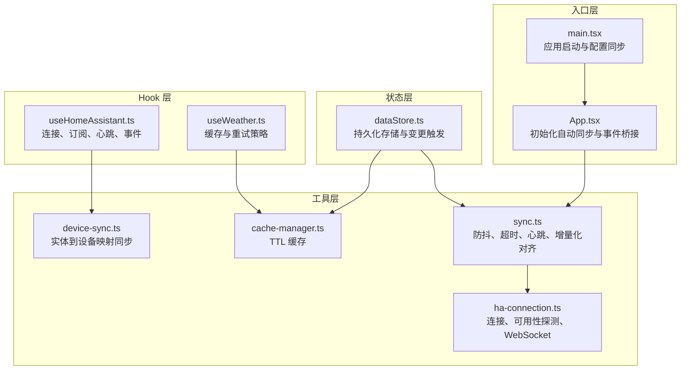
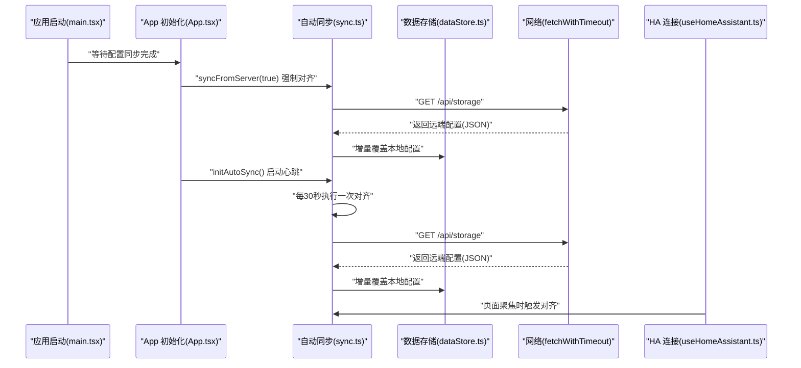
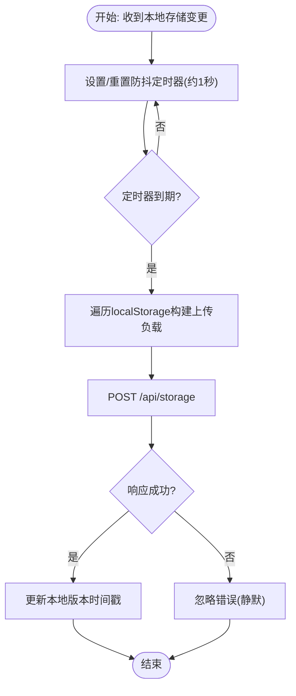
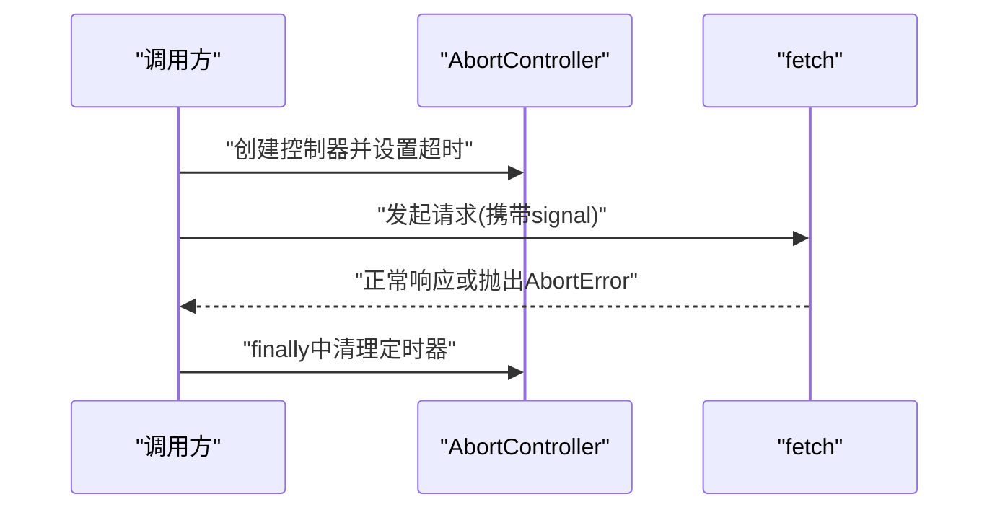
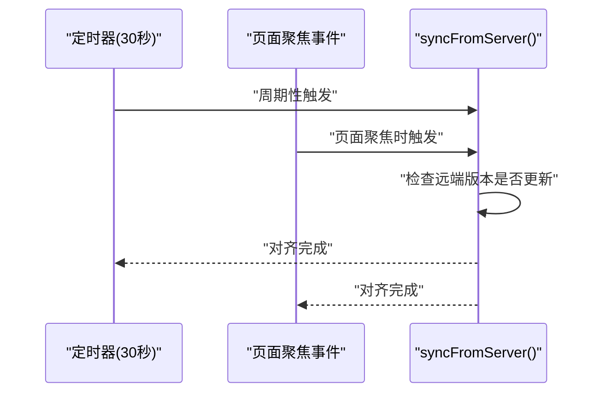
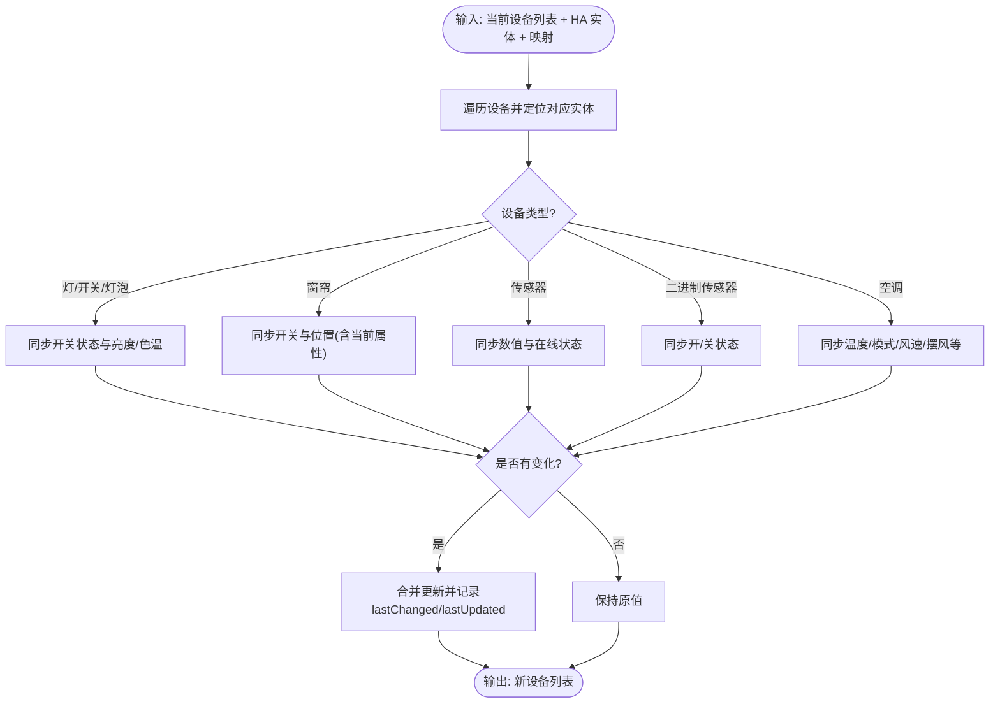
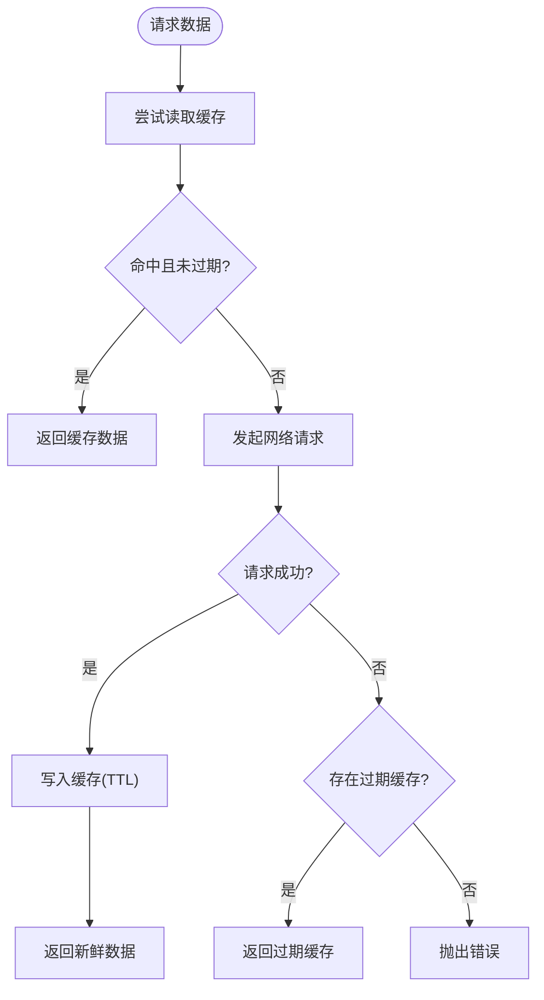
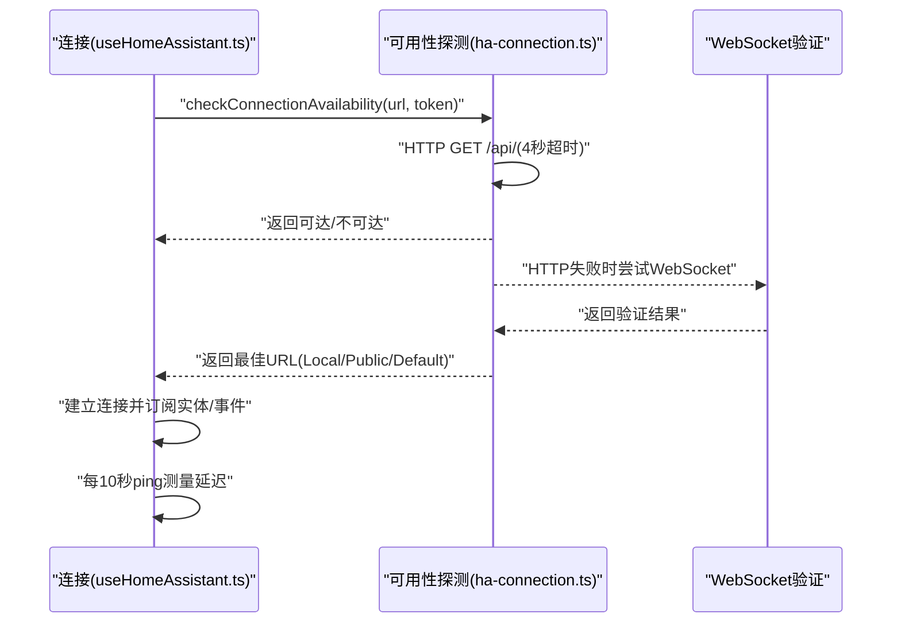
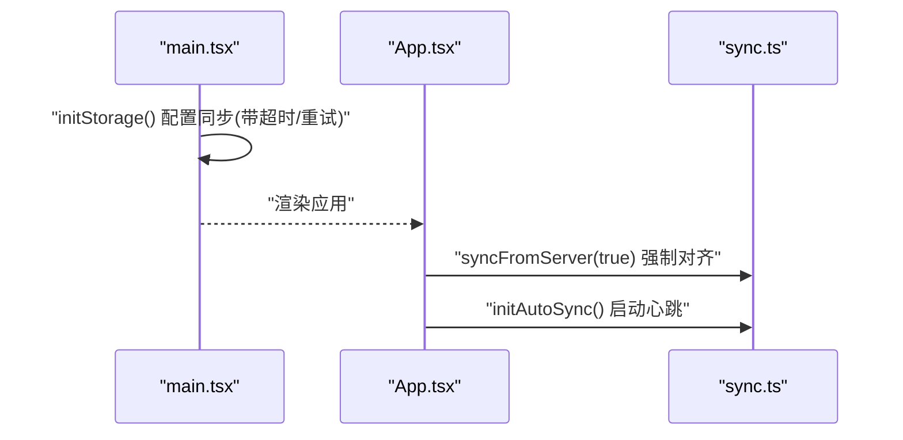
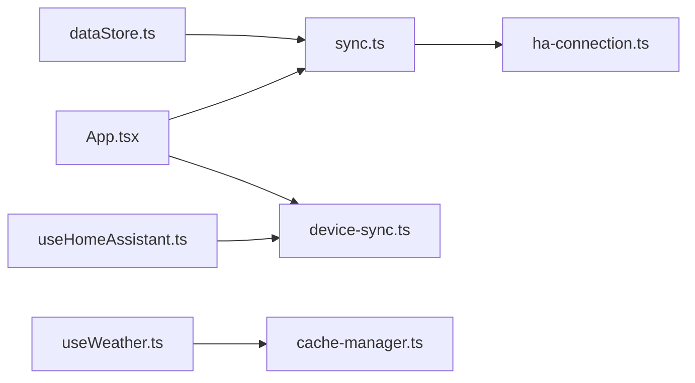

# 同步性能优化

<cite>
**本文引用的文件**
- [src/utils/sync.ts](file://src/utils/sync.ts)
- [src/utils/cache-manager.ts](file://src/utils/cache-manager.ts)
- [src/utils/ha-connection.ts](file://src/utils/ha-connection.ts)
- [src/hooks/useHomeAssistant.ts](file://src/hooks/useHomeAssistant.ts)
- [src/store/dataStore.ts](file://src/store/dataStore.ts)
- [src/app/App.tsx](file://src/app/App.tsx)
- [src/utils/device-sync.ts](file://src/utils/device-sync.ts)
- [src/hooks/useWeather.ts](file://src/hooks/useWeather.ts)
- [src/utils/icon-telemetry.ts](file://src/utils/icon-telemetry.ts)
- [src/main.tsx](file://src/main.tsx)
</cite>

## 目录
1. [简介](#简介)
2. [项目结构](#项目结构)
3. [核心组件](#核心组件)
4. [架构总览](#架构总览)
5. [详细组件分析](#详细组件分析)
6. [依赖关系分析](#依赖关系分析)
7. [性能考量](#性能考量)
8. [故障排查指南](#故障排查指南)
9. [结论](#结论)
10. [附录](#附录)

## 简介
本文件围绕“同步性能优化”主题，系统梳理并深入解析以下关键技术点：
- 防抖机制与延迟触发策略：如何通过防抖合并频繁变更、降低网络与CPU开销。
- fetchWithTimeout 超时控制：AbortController 与超时策略，避免长时间挂起。
- 自动同步心跳机制、页面可见性检测与资源使用优化：周期性对齐与焦点触发。
- 同步频率调优、批量更新策略与内存泄漏防护：定时器清理、事件解绑与状态去抖。
- 网络异常处理、离线模式支持与数据缓存策略：降级与回退路径。
- 性能监控指标、基准测试方法与优化建议：可落地的观测与改进方向。

## 项目结构
本项目采用前端单页应用架构，核心同步能力分布在工具层（utils）、状态层（store）、Hook 层（hooks）与入口层（main/App）。关键模块职责如下：
- 工具层：提供通用网络、缓存、设备状态同步与连接管理能力。
- Hook 层：封装 Home Assistant 连接、实体订阅、事件监听与心跳检测。
- 状态层：基于持久化存储的本地状态管理，并在变更时触发同步。
- 入口层：应用启动时进行配置同步，初始化自动同步与事件监听。

**图表来源**
- [src/main.tsx:69-81](file://src/main.tsx#L69-L81)
- [src/app/App.tsx:315-325](file://src/app/App.tsx#L315-L325)
- [src/store/dataStore.ts:104-127](file://src/store/dataStore.ts#L104-L127)
- [src/hooks/useHomeAssistant.ts:37-59](file://src/hooks/useHomeAssistant.ts#L37-L59)
- [src/hooks/useWeather.ts:32-126](file://src/hooks/useWeather.ts#L32-L126)
- [src/utils/sync.ts:26-41](file://src/utils/sync.ts#L26-L41)
- [src/utils/cache-manager.ts:6-56](file://src/utils/cache-manager.ts#L6-L56)
- [src/utils/device-sync.ts:4-191](file://src/utils/device-sync.ts#L4-L191)
- [src/utils/ha-connection.ts:193-238](file://src/utils/ha-connection.ts#L193-L238)

**章节来源**
- [src/main.tsx:69-81](file://src/main.tsx#L69-L81)
- [src/app/App.tsx:315-325](file://src/app/App.tsx#L315-L325)
- [src/store/dataStore.ts:104-127](file://src/store/dataStore.ts#L104-L127)
- [src/hooks/useHomeAssistant.ts:37-59](file://src/hooks/useHomeAssistant.ts#L37-L59)
- [src/hooks/useWeather.ts:32-126](file://src/hooks/useWeather.ts#L32-L126)
- [src/utils/sync.ts:26-41](file://src/utils/sync.ts#L26-L41)
- [src/utils/cache-manager.ts:6-56](file://src/utils/cache-manager.ts#L6-L56)
- [src/utils/device-sync.ts:4-191](file://src/utils/device-sync.ts#L4-L191)
- [src/utils/ha-connection.ts:193-238](file://src/utils/ha-connection.ts#L193-L238)

## 核心组件
- 防抖与延迟触发：通过全局定时器在短时间内合并多次变更，减少网络请求与渲染压力。
- fetchWithTimeout：统一的超时控制，避免阻塞与资源浪费。
- 自动同步心跳与可见性：定时对齐与页面聚焦触发，保证一致性。
- 实体到设备映射同步：按设备类型差异性同步状态与属性，减少无效更新。
- 缓存与离线回退：TTL 缓存与过期策略，网络异常时使用缓存数据。
- 连接可用性探测：HTTP 与 WebSocket 双通道探测，提升可达性判断准确性。

**章节来源**
- [src/utils/sync.ts:43-93](file://src/utils/sync.ts#L43-L93)
- [src/utils/sync.ts:133-150](file://src/utils/sync.ts#L133-L150)
- [src/utils/sync.ts:26-41](file://src/utils/sync.ts#L26-L41)
- [src/utils/device-sync.ts:4-191](file://src/utils/device-sync.ts#L4-L191)
- [src/utils/cache-manager.ts:6-56](file://src/utils/cache-manager.ts#L6-L56)
- [src/utils/ha-connection.ts:244-296](file://src/utils/ha-connection.ts#L244-L296)
- [src/utils/ha-connection.ts:298-316](file://src/utils/ha-connection.ts#L298-L316)

## 架构总览
整体流程包括：应用启动时先进行配置同步，随后初始化自动同步心跳；用户操作或状态变更触发本地持久化存储更新，存储中间件拦截写入并触发防抖同步；同时，HA 连接层负责实体订阅与事件监听，设备同步模块将实体状态映射到设备模型；网络层提供超时与可用性探测，缓存层提供离线回退。

**图表来源**
- [src/main.tsx:69-81](file://src/main.tsx#L69-L81)
- [src/app/App.tsx:315-325](file://src/app/App.tsx#L315-L325)
- [src/utils/sync.ts:98-131](file://src/utils/sync.ts#L98-L131)
- [src/utils/sync.ts:133-150](file://src/utils/sync.ts#L133-L150)
- [src/store/dataStore.ts:104-127](file://src/store/dataStore.ts#L104-L127)

## 详细组件分析

### 防抖与延迟触发（sync.ts）
- 设计要点
  - 使用全局定时器在每次变更后延时触发，若期间再次变更则重置定时器，从而合并高频更新。
  - 同步前遍历本地存储，构建待上传对象，排除版本时间戳键以避免循环同步。
  - 成功后更新本地版本时间戳，便于后续增量对齐。
- 性能影响
  - 显著降低网络请求频率，减少 CPU 与内存抖动。
  - 合理的延迟窗口（当前为毫秒级）平衡即时性与吞吐。
- 风险与防护
  - 需确保在组件卸载或上下文销毁时清理定时器，避免悬挂回调。
  - 对异常进行静默处理，防止影响主线程稳定性。

**图表来源**
- [src/utils/sync.ts:52-93](file://src/utils/sync.ts#L52-L93)
- [src/utils/sync.ts:62-82](file://src/utils/sync.ts#L62-L82)

**章节来源**
- [src/utils/sync.ts:43-93](file://src/utils/sync.ts#L43-L93)
- [src/utils/sync.ts:62-82](file://src/utils/sync.ts#L62-L82)

### fetchWithTimeout 超时控制
- 设计要点
  - 使用 AbortController 在指定超时后中断请求，避免 fetch 长时间挂起。
  - finally 中清理定时器，确保资源释放。
- 适用场景
  - 配置同步、天气数据、HA REST 接口等网络请求。
- 注意事项
  - 超时并非错误，需区分 AbortError 并进行重试或降级处理。

**图表来源**
- [src/utils/sync.ts:26-41](file://src/utils/sync.ts#L26-L41)
- [src/utils/ha-connection.ts:244-296](file://src/utils/ha-connection.ts#L244-L296)

**章节来源**
- [src/utils/sync.ts:26-41](file://src/utils/sync.ts#L26-L41)
- [src/utils/ha-connection.ts:244-296](file://src/utils/ha-connection.ts#L244-L296)

### 自动同步心跳与页面可见性
- 心跳机制
  - 定时器每 30 秒触发一次对齐，确保本地与远端配置一致。
- 可见性检测
  - 页面聚焦时立即对齐，提升用户体验。
- 清理策略
  - 返回清理函数，在组件卸载时移除定时器与事件监听，防止内存泄漏。

**图表来源**
- [src/utils/sync.ts:133-150](file://src/utils/sync.ts#L133-L150)

**章节来源**
- [src/utils/sync.ts:133-150](file://src/utils/sync.ts#L133-L150)

### 实体到设备映射同步（device-sync.ts）
- 设计要点
  - 针对不同设备类型（灯、窗帘、传感器、空调等）分别处理状态与属性同步。
  - 仅在实际变化时更新设备模型，减少不必要的渲染与存储写入。
  - 维护 HA 状态、可用性、设备类、时间戳等字段，确保 UI 与后端一致。
- 性能影响
  - 通过条件判断与最小化更新，显著降低计算与渲染成本。
  - 对于频繁更新的属性（如 last_changed），仅在确有变化时才更新。

**图表来源**
- [src/utils/device-sync.ts:4-191](file://src/utils/device-sync.ts#L4-L191)

**章节来源**
- [src/utils/device-sync.ts:4-191](file://src/utils/device-sync.ts#L4-L191)

### 缓存与离线回退（cache-manager.ts 与 useWeather.ts）
- TTL 缓存
  - 以时间戳为依据的严格过期策略，过期即丢弃，避免脏数据。
  - 提供 getStale 获取过期但可读的数据，用于离线回退。
- 天气 Hook 的重试与回退
  - 多次重试与指数退避，主源失败时切换备用源。
  - 网络异常时使用缓存数据，保证界面可用性。

**图表来源**
- [src/utils/cache-manager.ts:6-56](file://src/utils/cache-manager.ts#L6-L56)
- [src/hooks/useWeather.ts:32-126](file://src/hooks/useWeather.ts#L32-L126)

**章节来源**
- [src/utils/cache-manager.ts:6-56](file://src/utils/cache-manager.ts#L6-L56)
- [src/hooks/useWeather.ts:32-126](file://src/hooks/useWeather.ts#L32-L126)

### 连接可用性探测与心跳（useHomeAssistant.ts 与 ha-connection.ts）
- 双通道探测
  - HTTP GET /api/ + 超时控制，兼容跨域限制。
  - WebSocket 验证作为回退，确保局域网直连场景可用。
- 心跳与延迟测量
  - 定期发送 ping 并记录往返时延，异常时清空延迟值。
- 连接生命周期
  - 断线自动重连，重连失败时重新评估网络并提示错误。

**图表来源**
- [src/utils/ha-connection.ts:193-238](file://src/utils/ha-connection.ts#L193-L238)
- [src/utils/ha-connection.ts:244-296](file://src/utils/ha-connection.ts#L244-L296)
- [src/utils/ha-connection.ts:298-316](file://src/utils/ha-connection.ts#L298-L316)
- [src/hooks/useHomeAssistant.ts:37-59](file://src/hooks/useHomeAssistant.ts#L37-L59)

**章节来源**
- [src/utils/ha-connection.ts:193-238](file://src/utils/ha-connection.ts#L193-L238)
- [src/utils/ha-connection.ts:244-296](file://src/utils/ha-connection.ts#L244-L296)
- [src/utils/ha-connection.ts:298-316](file://src/utils/ha-connection.ts#L298-L316)
- [src/hooks/useHomeAssistant.ts:37-59](file://src/hooks/useHomeAssistant.ts#L37-L59)

### 应用启动与配置同步（main.tsx 与 App.tsx）
- 启动阶段
  - 在渲染前完成配置同步，确保首屏具备完整配置。
  - 对异常与超时进行兜底，避免长时间挂起导致白屏。
- 运行阶段
  - 初始化自动同步心跳与聚焦触发，保证长期一致性。
  - 将 HA 事件映射到日志面板，便于运维与调试。

**图表来源**
- [src/main.tsx:69-81](file://src/main.tsx#L69-L81)
- [src/app/App.tsx:315-325](file://src/app/App.tsx#L315-L325)

**章节来源**
- [src/main.tsx:69-81](file://src/main.tsx#L69-L81)
- [src/app/App.tsx:315-325](file://src/app/App.tsx#L315-L325)

## 依赖关系分析
- 组件耦合
  - dataStore 通过持久化存储拦截写入，间接依赖 sync.ts 触发同步。
  - useHomeAssistant 依赖 HA 连接与实体订阅，为设备同步提供数据源。
  - App.tsx 作为协调者，初始化自动同步并桥接事件。
- 外部依赖
  - home-assistant-js-websocket：WebSocket 连接与订阅。
  - 浏览器 API：AbortController、localStorage、CustomEvent、performance 等。

**图表来源**
- [src/store/dataStore.ts:104-127](file://src/store/dataStore.ts#L104-L127)
- [src/utils/sync.ts:110-120](file://src/utils/sync.ts#L110-L120)
- [src/app/App.tsx:382-387](file://src/app/App.tsx#L382-L387)
- [src/utils/device-sync.ts:4-191](file://src/utils/device-sync.ts#L4-L191)
- [src/hooks/useHomeAssistant.ts:150-164](file://src/hooks/useHomeAssistant.ts#L150-L164)
- [src/utils/ha-connection.ts:125-130](file://src/utils/ha-connection.ts#L125-L130)
- [src/hooks/useWeather.ts:32-126](file://src/hooks/useWeather.ts#L32-L126)
- [src/utils/cache-manager.ts:6-56](file://src/utils/cache-manager.ts#L6-L56)

**章节来源**
- [src/store/dataStore.ts:104-127](file://src/store/dataStore.ts#L104-L127)
- [src/utils/sync.ts:110-120](file://src/utils/sync.ts#L110-L120)
- [src/app/App.tsx:382-387](file://src/app/App.tsx#L382-L387)
- [src/utils/device-sync.ts:4-191](file://src/utils/device-sync.ts#L4-L191)
- [src/hooks/useHomeAssistant.ts:150-164](file://src/hooks/useHomeAssistant.ts#L150-L164)
- [src/utils/ha-connection.ts:125-130](file://src/utils/ha-connection.ts#L125-L130)
- [src/hooks/useWeather.ts:32-126](file://src/hooks/useWeather.ts#L32-L126)
- [src/utils/cache-manager.ts:6-56](file://src/utils/cache-manager.ts#L6-L56)

## 性能考量
- 防抖与批处理
  - 合并高频变更，减少网络与渲染压力；建议根据业务场景调整延迟阈值。
- 超时与重试
  - fetchWithTimeout 与指数退避相结合，提升在网络波动下的稳定性。
- 心跳与资源使用
  - 10 秒心跳测量与 30 秒自动对齐在保证一致性的同时兼顾资源占用。
- 缓存策略
  - TTL 严格过期与过期缓存回退，避免脏数据传播。
- 内存泄漏防护
  - 定时器与事件监听必须在清理函数中移除；确保组件卸载路径正确。
- 监控与可观测性
  - 建议引入图标加载性能与错误遥测（参考 icon-telemetry），记录耗时与去重事件。

**章节来源**
- [src/utils/sync.ts:43-93](file://src/utils/sync.ts#L43-L93)
- [src/hooks/useHomeAssistant.ts:37-59](file://src/hooks/useHomeAssistant.ts#L37-L59)
- [src/hooks/useWeather.ts:32-126](file://src/hooks/useWeather.ts#L32-L126)
- [src/utils/cache-manager.ts:6-56](file://src/utils/cache-manager.ts#L6-L56)
- [src/utils/icon-telemetry.ts:1-57](file://src/utils/icon-telemetry.ts#L1-L57)

## 故障排查指南
- 配置同步失败
  - 检查 /api/storage 是否可达，确认超时与重试逻辑是否生效。
  - 关注静默失败处理，必要时增加日志或告警。
- 网络异常与离线
  - 使用缓存回退策略，确认 getStale 是否被正确调用。
  - 若主天气源不可用，检查备用源切换逻辑。
- 连接问题
  - 使用可用性探测（HTTP + WebSocket）定位网络与跨域问题。
  - 断线后自动重连，观察重连间隔与错误提示。
- 心跳与延迟
  - 心跳失败时延迟值清空，检查网络质量与服务端响应。
- 内存泄漏
  - 确认 initAutoSync 返回的清理函数是否在组件卸载时调用。
  - 检查 dataStore 存储拦截器是否正确移除。

**章节来源**
- [src/utils/sync.ts:127-131](file://src/utils/sync.ts#L127-L131)
- [src/hooks/useWeather.ts:94-112](file://src/hooks/useWeather.ts#L94-L112)
- [src/utils/ha-connection.ts:244-296](file://src/utils/ha-connection.ts#L244-L296)
- [src/hooks/useHomeAssistant.ts:140-148](file://src/hooks/useHomeAssistant.ts#L140-L148)
- [src/utils/sync.ts:146-149](file://src/utils/sync.ts#L146-L149)
- [src/store/dataStore.ts:110-116](file://src/store/dataStore.ts#L110-L116)

## 结论
本项目通过“防抖延迟触发 + 超时控制 + 自动心跳 + 可见性对齐 + 实体映射同步 + 缓存与离线回退 + 连接可用性探测”的组合拳，实现了稳定、低开销且具备良好用户体验的同步体系。建议在生产环境中持续关注监控指标与基准测试，结合业务特征动态调优同步频率与批处理策略，进一步降低资源消耗并提升可靠性。

## 附录
- 性能监控指标建议
  - 同步延迟（从变更到完成）、同步失败率、平均响应时间、缓存命中率、心跳成功率。
- 基准测试方法
  - 批量写入本地存储并统计总耗时与网络请求数；模拟弱网环境测试超时与重试表现。
- 优化建议
  - 将频繁变更的设备属性分组提交，减少单次同步数据量。
  - 引入更细粒度的版本控制与增量更新，避免全量覆盖。
  - 对热点实体进行本地缓存与去抖，降低 WebSocket 订阅压力。