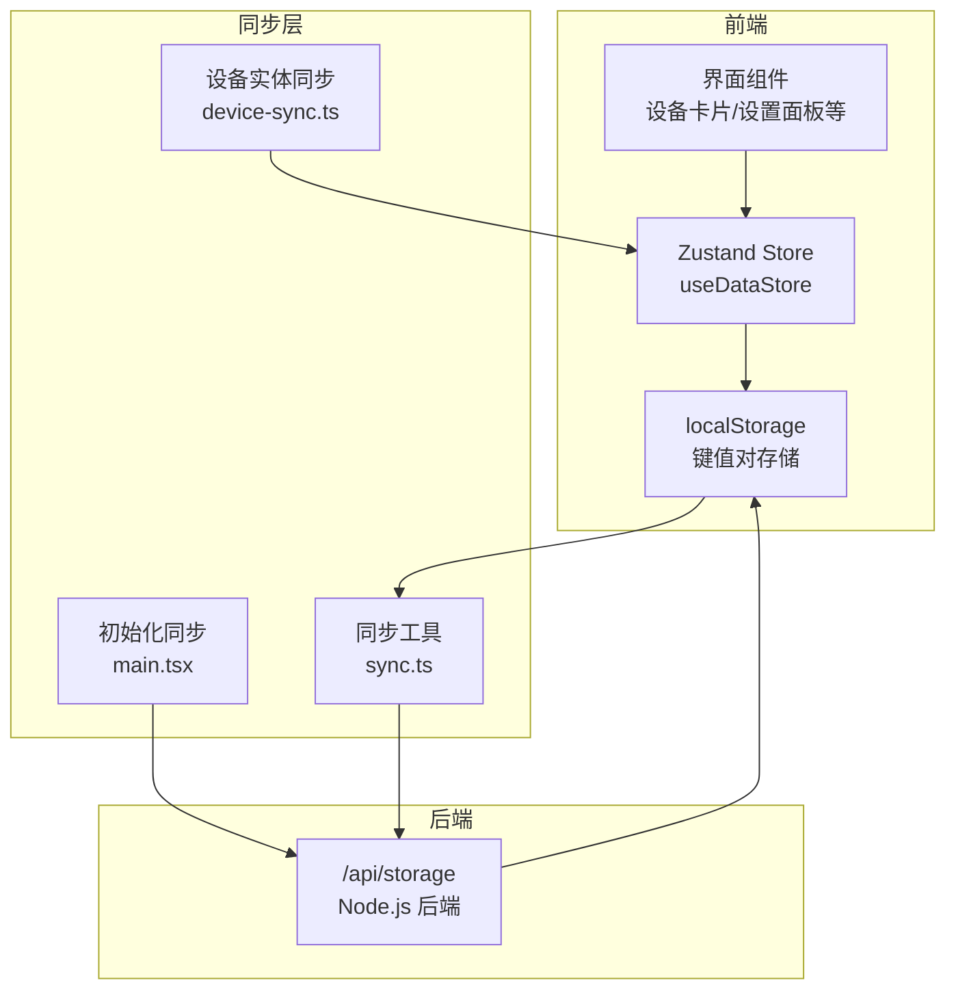
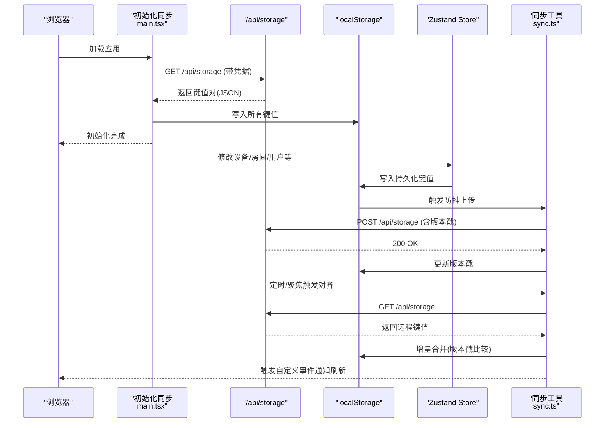
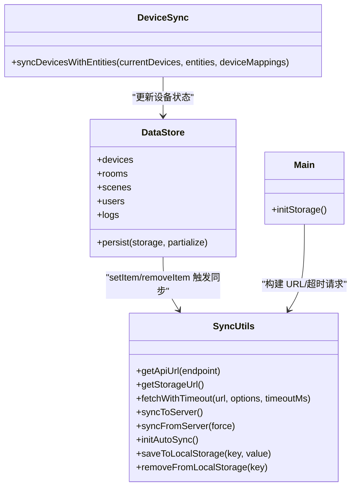
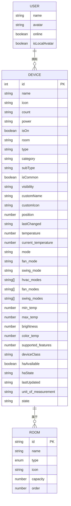

# 同步数据模型

<cite>
**本文引用的文件**
- [src/main.tsx](file://src/main.tsx)
- [src/utils/sync.ts](file://src/utils/sync.ts)
- [src/store/dataStore.ts](file://src/store/dataStore.ts)
- [src/utils/device-sync.ts](file://src/utils/device-sync.ts)
- [src/types/device.ts](file://src/types/device.ts)
- [src/types/room.ts](file://src/types/room.ts)
- [src/types/user.ts](file://src/types/user.ts)
- [src/config/initialDevices.ts](file://src/config/initialDevices.ts)
- [src/app/components/ErrorBoundary.tsx](file://src/app/components/ErrorBoundary.tsx)
- [src/utils/__tests__/device-sync.light.test.ts](file://src/utils/__tests__/device-sync.light.test.ts)
</cite>

## 目录
1. [简介](#简介)
2. [项目结构](#项目结构)
3. [核心组件](#核心组件)
4. [架构总览](#架构总览)
5. [详细组件分析](#详细组件分析)
6. [依赖关系分析](#依赖关系分析)
7. [性能考量](#性能考量)
8. [故障排查指南](#故障排查指南)
9. [结论](#结论)
10. [附录](#附录)

## 简介
本文件系统化阐述 HAUI 的跨设备同步数据模型，重点包括：
- localStorage 数据结构设计与键值对存储策略
- 数据序列化与持久化机制
- 版本控制字段 SYNC_TS_KEY 的作用与时间戳同步逻辑
- 增量更新算法、差异检测与数据合并策略
- 数据完整性校验、错误恢复与数据迁移机制
- 设备配置数据、房间布局数据与用户偏好数据的同步规则
- 备份策略、恢复机制与版本兼容性处理

## 项目结构
本项目采用“前端状态 + 本地持久化 + 云端同步”的三层架构：
- 前端状态层：使用 Zustand 管理应用状态，并通过持久化中间件选择性持久化到 localStorage
- 本地持久化层：以键值对形式存储在 localStorage 中，键名即为数据标识，值为 JSON 字符串
- 云端同步层：通过 /api/storage 接口进行双向同步，包含版本控制与增量对齐

图表来源
- [src/main.tsx:18-67](file://src/main.tsx#L18-L67)
- [src/utils/sync.ts:46-160](file://src/utils/sync.ts#L46-L160)
- [src/store/dataStore.ts:58-128](file://src/store/dataStore.ts#L58-L128)
- [src/utils/device-sync.ts:4-190](file://src/utils/device-sync.ts#L4-L190)

章节来源
- [src/main.tsx:18-67](file://src/main.tsx#L18-L67)
- [src/utils/sync.ts:46-160](file://src/utils/sync.ts#L46-L160)
- [src/store/dataStore.ts:58-128](file://src/store/dataStore.ts#L58-L128)

## 核心组件
- 同步工具模块：负责构建 API URL、超时请求、防抖上传、版本比对与增量对齐、自动心跳与聚焦对齐
- 初始化同步：应用启动时从后端拉取配置注入 localStorage，并在 Add-on 环境下具备重试与超时兜底
- 数据存储模块：Zustand + persist 中间件，选择性持久化设备、房间、场景、用户、日志等数据
- 设备实体同步：将 Home Assistant 实体状态映射到本地设备对象，执行差异检测与合并

章节来源
- [src/utils/sync.ts:46-160](file://src/utils/sync.ts#L46-L160)
- [src/main.tsx:18-67](file://src/main.tsx#L18-L67)
- [src/store/dataStore.ts:58-128](file://src/store/dataStore.ts#L58-L128)
- [src/utils/device-sync.ts:4-190](file://src/utils/device-sync.ts#L4-L190)

## 架构总览
下面的时序图展示了“启动时拉取 + 变更时上传 + 定时对齐”的完整流程。

图表来源
- [src/main.tsx:18-67](file://src/main.tsx#L18-L67)
- [src/utils/sync.ts:52-131](file://src/utils/sync.ts#L52-L131)
- [src/store/dataStore.ts:108-117](file://src/store/dataStore.ts#L108-L117)

## 详细组件分析

### localStorage 数据结构设计与键值对存储策略
- 键命名规范
  - 版本控制键：haui_last_sync_ts（整数时间戳）
  - 数据键：ha_devices、ha_rooms、ha_scenes、ha_users、ha_logs（对应业务域）
- 值序列化
  - 所有值均为字符串，由后端统一接收与存储
  - 前端在写入前通过 JSON 序列化，读取时通过 JSON 反序列化
- 存储范围
  - 仅持久化 Store 中 selected 字段：devices、rooms、scenes、users、logs
  - 其他 UI 状态不参与持久化，避免冗余与冲突

章节来源
- [src/utils/sync.ts:46-47](file://src/utils/sync.ts#L46-L47)
- [src/store/dataStore.ts:118-125](file://src/store/dataStore.ts#L118-L125)

### 数据序列化机制与完整性校验
- 序列化策略
  - 写入：Zustand persist 中间件在 setItem/removeItem 时触发，将对象 JSON 序列化为字符串
  - 读取：Store 初始化时从 localStorage 读取字符串并 JSON 反序列化
- 完整性校验
  - 初始化阶段：检查响应内容类型是否为 application/json，非 JSON 则跳过同步（Add-on 环境外）
  - 同步阶段：对齐前比较版本戳，仅在远程较新或强制对齐时才覆盖本地
  - 错误恢复：初始化与同步均包含超时与重试逻辑，失败不阻塞应用启动

章节来源
- [src/main.tsx:28-44](file://src/main.tsx#L28-L44)
- [src/utils/sync.ts:107-130](file://src/utils/sync.ts#L107-L130)
- [src/store/dataStore.ts:49-56](file://src/store/dataStore.ts#L49-L56)

### SYNC_TS_KEY 版本控制字段与时间戳同步逻辑
- 版本控制键
  - 键名：haui_last_sync_ts
  - 类型：字符串化的整数时间戳（毫秒）
- 同步时机
  - 写入 localStorage 后触发防抖上传，携带当前时间戳作为版本号
  - 对齐时比较远程与本地版本戳，仅在远程较新时覆盖本地
- 作用
  - 防止并发写入导致的数据覆盖
  - 支持增量对齐与冲突仲裁

章节来源
- [src/utils/sync.ts:46-47](file://src/utils/sync.ts#L46-L47)
- [src/utils/sync.ts:61-87](file://src/utils/sync.ts#L61-L87)
- [src/utils/sync.ts:110-124](file://src/utils/sync.ts#L110-L124)

### 增量更新算法、差异检测与数据合并策略
- 增量上传
  - 遍历 localStorage，除版本戳外的所有键值组成上传负载
  - 防抖延迟 1 秒，避免频繁网络请求
- 增量对齐
  - 从后端获取完整键值集合，解析远程版本戳
  - 与本地版本戳比较，远程较新则全量覆盖本地
  - 成功对齐后触发自定义事件通知 Store 刷新
- 自动对齐
  - 每 30 秒一次心跳对齐
  - 页面聚焦时触发对齐，提升用户体验

章节来源
- [src/utils/sync.ts:66-72](file://src/utils/sync.ts#L66-L72)
- [src/utils/sync.ts:114-121](file://src/utils/sync.ts#L114-L121)
- [src/utils/sync.ts:139-149](file://src/utils/sync.ts#L139-L149)

### 设备配置数据同步规则
- 数据模型
  - 设备接口包含状态、属性、时间戳等字段，用于与 Home Assistant 实体对齐
- 同步规则
  - 根据设备类型与实体状态进行差异检测与合并
  - 灯具亮度：当设备关闭时强制置零，开启时同步亮度与色温
  - 窗帘：根据状态与位置属性同步开合与当前位置
  - 传感器：同步数值与单位、在线状态
  - 空调：同步开关、目标温度、当前温度、模式、风速、扫风等
- 默认设备
  - 若无默认遥控器，初始化时自动注入一条默认遥控器记录

章节来源
- [src/types/device.ts:1-46](file://src/types/device.ts#L1-L46)
- [src/utils/device-sync.ts:21-153](file://src/utils/device-sync.ts#L21-L153)
- [src/config/initialDevices.ts:3-67](file://src/config/initialDevices.ts#L3-L67)

### 房间布局数据同步规则
- 数据模型
  - 房间接口包含类型、图标、容量、排序等字段
- 默认房间
  - 提供一组默认房间列表，初始化时注入 localStorage
- 同步规则
  - 房间列表作为独立键值存储，与设备列表分开管理
  - 对齐时按键值全量替换，保持房间结构一致性

章节来源
- [src/types/room.ts:1-33](file://src/types/room.ts#L1-L33)
- [src/store/dataStore.ts:62](file://src/store/dataStore.ts#L62)

### 用户偏好数据同步规则
- 数据模型
  - 用户接口包含名称、头像、在线状态等字段
- 同步规则
  - 用户列表作为独立键值存储，与设备/房间列表分开管理
  - 对齐时按键值全量替换，保持用户配置一致性

章节来源
- [src/types/user.ts:1-7](file://src/types/user.ts#L1-L7)
- [src/store/dataStore.ts:64](file://src/store/dataStore.ts#L64)

### 数据备份策略、恢复机制与版本兼容性
- 备份策略
  - 云端 /api/storage 即为最终备份源，localStorage 为本地缓存
  - 任意设备均可从云端拉取完整配置，实现跨设备备份
- 恢复机制
  - 清空缓存后重新初始化：ErrorBoundary 提供一键清空缓存并刷新页面
  - 初始化阶段具备重试与超时兜底，避免网络异常导致启动失败
- 版本兼容性
  - 通过版本戳进行冲突仲裁，远程较新则覆盖本地
  - 对齐时全量替换，避免部分字段缺失导致的不一致

章节来源
- [src/app/components/ErrorBoundary.tsx:35-43](file://src/app/components/ErrorBoundary.tsx#L35-L43)
- [src/main.tsx:25-66](file://src/main.tsx#L25-L66)
- [src/utils/sync.ts:114-121](file://src/utils/sync.ts#L114-L121)

## 依赖关系分析

图表来源
- [src/utils/sync.ts:46-160](file://src/utils/sync.ts#L46-L160)
- [src/store/dataStore.ts:58-128](file://src/store/dataStore.ts#L58-L128)
- [src/utils/device-sync.ts:4-190](file://src/utils/device-sync.ts#L4-L190)
- [src/main.tsx:18-67](file://src/main.tsx#L18-L67)

章节来源
- [src/utils/sync.ts:46-160](file://src/utils/sync.ts#L46-L160)
- [src/store/dataStore.ts:58-128](file://src/store/dataStore.ts#L58-L128)
- [src/utils/device-sync.ts:4-190](file://src/utils/device-sync.ts#L4-L190)
- [src/main.tsx:18-67](file://src/main.tsx#L18-L67)

## 性能考量
- 防抖上传：写入后 1 秒内多次变更仅触发一次上传，降低网络压力
- 增量对齐：仅在远程版本较新时才覆盖本地，减少不必要的全量写入
- 自动对齐：30 秒心跳与聚焦触发，兼顾实时性与性能
- 超时与重试：初始化与同步均设置超时与重试，避免阻塞主线程

章节来源
- [src/utils/sync.ts:55-92](file://src/utils/sync.ts#L55-L92)
- [src/utils/sync.ts:139-149](file://src/utils/sync.ts#L139-L149)
- [src/main.tsx:22-23](file://src/main.tsx#L22-L23)

## 故障排查指南
- 启动阶段无配置
  - 检查 /api/storage 是否返回 application/json
  - 查看初始化重试日志与超时信息
- 同步失败
  - 检查网络连通性与后端状态码
  - 关注版本戳比较逻辑，确认远程是否较新
- 缓存异常
  - 使用 ErrorBoundary 的“清空缓存并刷新”功能快速恢复
- 设备状态不同步
  - 核对设备类型与实体映射关系
  - 参考设备同步测试用例验证亮度、温度等字段同步逻辑

章节来源
- [src/main.tsx:45-66](file://src/main.tsx#L45-L66)
- [src/utils/sync.ts:127-130](file://src/utils/sync.ts#L127-L130)
- [src/app/components/ErrorBoundary.tsx:35-43](file://src/app/components/ErrorBoundary.tsx#L35-L43)
- [src/utils/__tests__/device-sync.light.test.ts:1-75](file://src/utils/__tests__/device-sync.light.test.ts#L1-L75)

## 结论
本同步数据模型通过 localStorage + /api/storage 的双层设计，实现了：
- 明确的版本控制与增量对齐
- 选择性持久化与强健的错误恢复
- 跨设备一致性的配置与偏好数据同步
建议在后续迭代中进一步完善：
- 增加字段级差异检测与冲突合并策略
- 引入本地索引与增量拉取以优化大规模数据场景
- 补充版本迁移脚本与向后兼容策略

## 附录

### 数据模型关系图

图表来源
- [src/types/device.ts:1-46](file://src/types/device.ts#L1-L46)
- [src/types/room.ts:1-33](file://src/types/room.ts#L1-L33)
- [src/types/user.ts:1-7](file://src/types/user.ts#L1-L7)