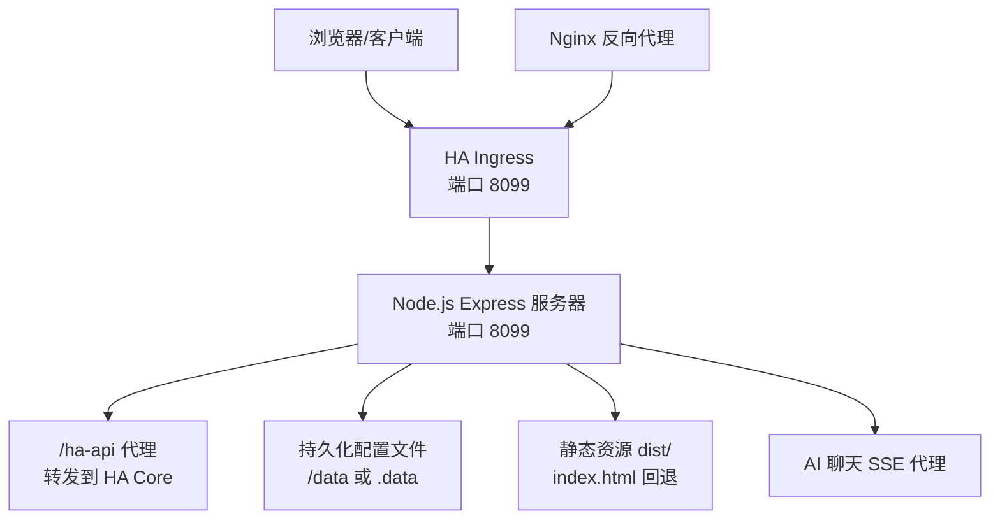
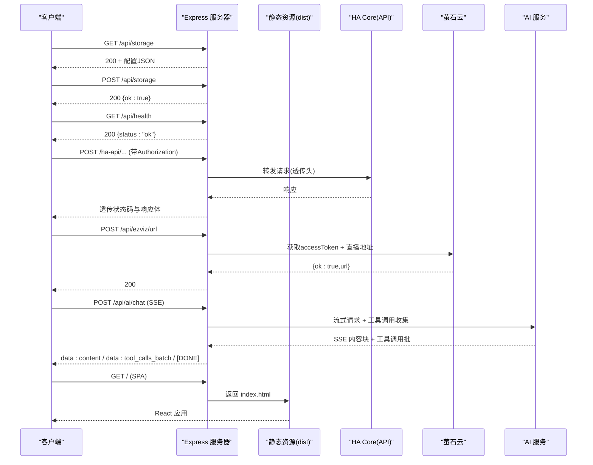
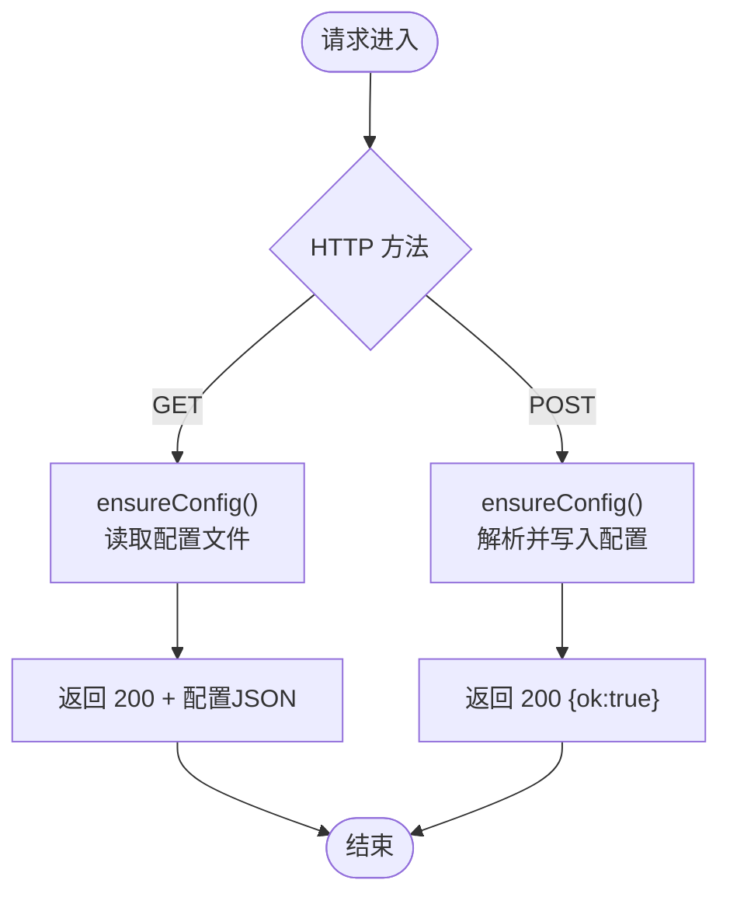
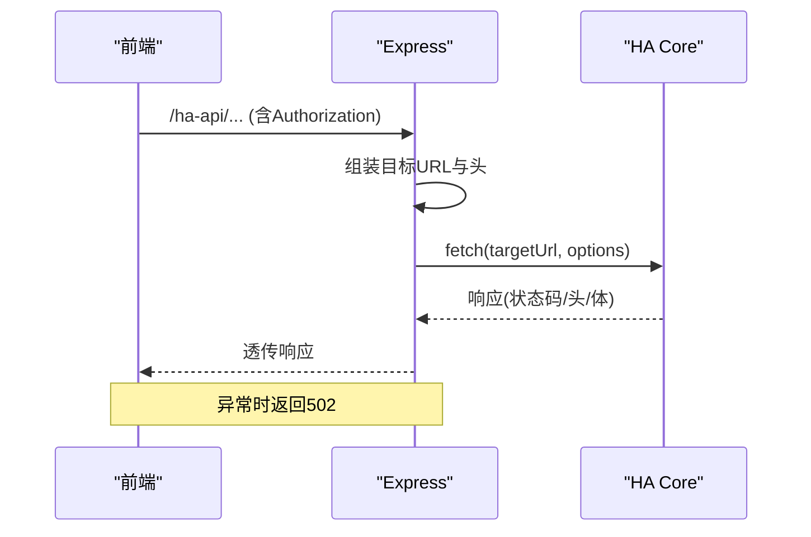
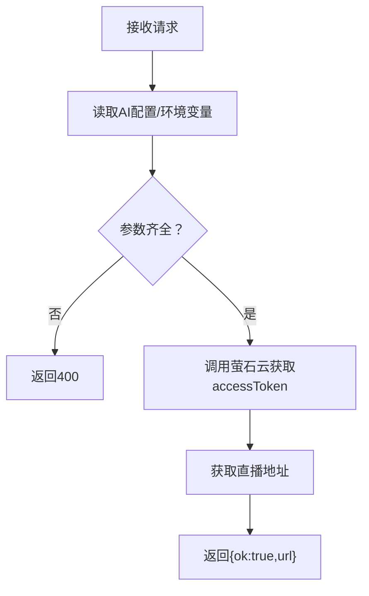
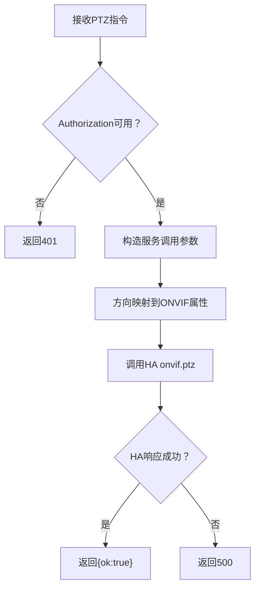
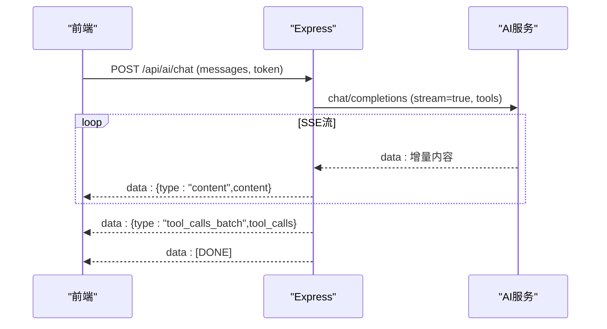
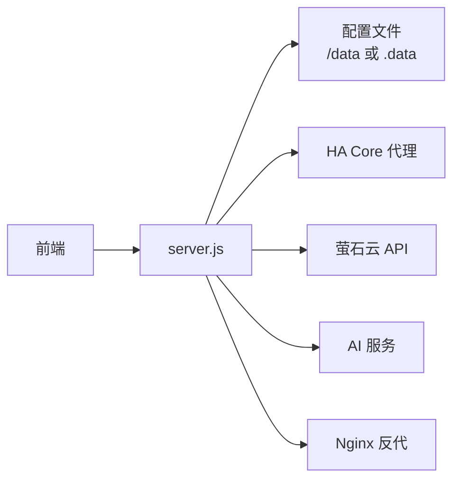

# 后端同步服务

<cite>
**本文引用的文件**
- [server.js](file://addon/server.js)
- [Dockerfile](file://addon/Dockerfile)
- [config.yaml](file://addon/config.yaml)
- [nginx.conf](file://addon/nginx.conf)
- [run.sh](file://addon/run.sh)
- [package.json](file://addon/package.json)
- [package.json](file://package.json)
- [docker-compose.yml](file://docker-compose.yml)
- [configuration.yaml](file://config/configuration.yaml)
- [README.md](file://README.md)
- [useHomeAssistant.ts](file://src/hooks/useHomeAssistant.ts)
- [AiChatWidget.tsx](file://src/app/components/AiChatWidget.tsx)
- [room-inference.worker.ts](file://src/workers/room-inference.worker.ts)
- [security.ts](file://src/utils/security.ts)
- [ha-connection.ts](file://src/utils/ha-connection.ts)
- [log-helper.ts](file://src/utils/log-helper.ts)
- [LogCardAddon.tsx](file://src/app/components/LogCardAddon.tsx)
</cite>

## 目录
1. [简介](#简介)
2. [项目结构](#项目结构)
3. [核心组件](#核心组件)
4. [架构总览](#架构总览)
5. [详细组件分析](#详细组件分析)
6. [依赖关系分析](#依赖关系分析)
7. [性能考量](#性能考量)
8. [故障排查指南](#故障排查指南)
9. [结论](#结论)
10. [附录](#附录)

## 简介
本文件面向后端同步服务的技术文档，聚焦于 Node.js + Express 的实现架构、/api/storage 端点设计与 RESTful 规范、WebSocket 连接与 Home Assistant 的集成、AI 聊天代理与 SSE 实时流、静态资源与 Nginx 反向代理、以及部署与运维监控要点。文档旨在帮助开发者快速理解系统设计、正确扩展与维护服务。

## 项目结构
后端同步服务位于 addon 目录，采用“Express + Nginx + HA Ingress”的组合模式：
- Express 提供 REST API 与静态资源服务，并在 HA Add-on 环境中通过 /ha-api 代理 Home Assistant Core API。
- Nginx 作为反向代理与静态资源加速层，负责缓存与安全头设置。
- HA Ingress 将容器 8099 端口的 /api/* 路由透传至服务，实现外部访问与健康检查。
- 前端构建产物 dist 由 Express 提供静态托管，React Router 采用 HTML5 History Fallback。

图表来源
- [server.js:56-94](file://addon/server.js#L56-L94)
- [server.js:96-120](file://addon/server.js#L96-L120)
- [server.js:505-514](file://addon/server.js#L505-L514)
- [config.yaml:31-33](file://addon/config.yaml#L31-L33)

章节来源
- [server.js:1-521](file://addon/server.js#L1-L521)
- [config.yaml:1-37](file://addon/config.yaml#L1-L37)
- [docker-compose.yml:1-42](file://docker-compose.yml#L1-L42)
- [README.md:1-84](file://README.md#L1-L84)

## 核心组件
- Express 应用与路由
  - /api/storage 读写配置文件（/data/haui_config.json 或 .data/haui_config.json）
  - /ha-api 代理 Home Assistant Core API，支持鉴权头透传
  - /api/ezviz/url 与 /api/ezviz/token 萤石云代理
  - /api/camera/ptz ONVIF PTZ 控制代理
  - /api/ai/chat SSE 实时聊天代理，支持工具调用批处理
  - /api/health 健康检查
  - 静态资源与 React SPA 回退
- Nginx 反向代理
  - Gzip 压缩、缓存头、安全头、静态资源缓存策略
- HA Ingress
  - 暴露端口 8099，透传 /api/* 与静态资源
- 数据持久化
  - 优先使用 /data（HA Add-on 持久卷），本地开发回退到 .data

章节来源
- [server.js:96-120](file://addon/server.js#L96-L120)
- [server.js:48-94](file://addon/server.js#L48-L94)
- [server.js:122-196](file://addon/server.js#L122-L196)
- [server.js:198-227](file://addon/server.js#L198-L227)
- [server.js:229-286](file://addon/server.js#L229-L286)
- [server.js:288-291](file://addon/server.js#L288-L291)
- [server.js:315-503](file://addon/server.js#L315-L503)
- [server.js:505-514](file://addon/server.js#L505-L514)
- [nginx.conf:1-26](file://addon/nginx.conf#L1-L26)
- [config.yaml:31-33](file://addon/config.yaml#L31-L33)

## 架构总览
后端同步服务围绕“配置中心 + 代理层 + 实时能力 + 静态托管”展开，整体流程如下：

图表来源
- [server.js:96-120](file://addon/server.js#L96-L120)
- [server.js:288-291](file://addon/server.js#L288-L291)
- [server.js:48-94](file://addon/server.js#L48-L94)
- [server.js:122-196](file://addon/server.js#L122-L196)
- [server.js:315-503](file://addon/server.js#L315-L503)
- [server.js:505-514](file://addon/server.js#L505-L514)

## 详细组件分析

### /api/storage RESTful 设计与实现
- 设计目标
  - 提供跨设备配置同步的统一入口，支持读取与写入。
- 路由与行为
  - GET /api/storage：读取持久化配置文件，返回纯 JSON。
  - POST /api/storage：接收对象或 JSON 字符串，写入配置文件。
- 数据持久化策略
  - 优先使用 /data（HA Add-on 持久卷），本地开发回退到 .data。
  - 首次访问自动确保目录与空配置存在。
- 错误处理
  - 文件读写异常统一捕获并返回 500 与错误信息。
- 安全与鉴权
  - 该端点未内置鉴权；在 HA Ingress 环境下由 HA 控制访问范围。

图表来源
- [server.js:96-120](file://addon/server.js#L96-L120)
- [server.js:28-33](file://addon/server.js#L28-L33)

章节来源
- [server.js:96-120](file://addon/server.js#L96-L120)
- [server.js:28-33](file://addon/server.js#L28-L33)

### /ha-api 代理与 Home Assistant 集成
- 功能概述
  - 将前端对 /ha-api/* 的请求转发到 HA Core（http://supervisor/core），保留 Content-Type 并透传 Authorization。
- 鉴权策略
  - 优先使用前端传入的 Authorization（用户 Long-Lived Token）。
  - 若缺失，回退使用环境变量 SUPERVISOR_TOKEN。
- 错误处理
  - 代理失败返回 502 与错误信息，便于前端定位问题。

图表来源
- [server.js:48-94](file://addon/server.js#L48-L94)

章节来源
- [server.js:48-94](file://addon/server.js#L48-L94)

### 萤石云代理（/api/ezviz/url 与 /api/ezviz/token）
- 设计目标
  - 隐藏 AppKey/AppSecret，避免前端直接暴露；统一获取 accessToken 与直播地址。
- 参数与流程
  - /api/ezviz/url：接收设备序列号与可选参数，返回 HLS/FLV 地址。
  - /api/ezviz/token：仅返回 accessToken（供 ezuikit-js SDK 使用）。
- 安全策略
  - 从后端 AI 配置或环境变量读取密钥，不在前端暴露。
- 错误处理
  - 对萤石云返回码进行校验，失败时返回 500 与错误信息。

图表来源
- [server.js:122-196](file://addon/server.js#L122-L196)
- [server.js:198-227](file://addon/server.js#L198-L227)

章节来源
- [server.js:122-196](file://addon/server.js#L122-L196)
- [server.js:198-227](file://addon/server.js#L198-L227)

### ONVIF PTZ 云台控制代理（/api/camera/ptz）
- 设计目标
  - 将前端指令映射为 Home Assistant 的 onvif.ptz 服务调用。
- 鉴权与实体映射
  - 优先使用 Authorization 头；支持 entity_id 或基于名称推断。
- 方向映射
  - up/down/left/right/zoomIn/zoomOut 映射到对应 ONVIF 属性。
- 错误处理
  - HA 调用失败时记录日志并返回 500。

图表来源
- [server.js:229-286](file://addon/server.js#L229-L286)

章节来源
- [server.js:229-286](file://addon/server.js#L229-L286)

### AI 聊天代理与 SSE 实时流（/api/ai/chat）
- 设计目标
  - 以 SSE 形式将 LLM 流式响应实时推送给前端，支持工具调用批处理。
- 工具与白名单
  - HA Tools Schema 定义 call_ha_service 与 get_entity_state。
  - 安全白名单限制可控制的 domain。
- 流式消费与工具调用聚合
  - 使用 consumeStream 解析 SSE 数据块，聚合 tool_calls 并按增量推送内容。
- 最大工具轮次
  - MAX_TOOL_ROUNDS 限制工具调用循环次数，防止无限调用。
- 错误处理
  - LLM 失败或连接断开时，发送错误事件并结束流。

图表来源
- [server.js:315-503](file://addon/server.js#L315-L503)
- [server.js:364-420](file://addon/server.js#L364-L420)

章节来源
- [server.js:315-503](file://addon/server.js#L315-L503)
- [server.js:364-420](file://addon/server.js#L364-L420)

### 静态资源与 SPA 回退（/ 与 dist）
- 静态托管
  - Express 使用 express.static 提供 dist 下静态资源，设置缓存与 ETag。
- SPA 回退
  - 未知路径返回 index.html，交由前端路由处理。
- Nginx 辅助
  - 提供 Gzip、缓存头与安全头，提升静态资源加载性能。

章节来源
- [server.js:505-514](file://addon/server.js#L505-L514)
- [nginx.conf:1-26](file://addon/nginx.conf#L1-L26)

### WebSocket 连接与 Home Assistant 集成
- 前端连接策略
  - 通过 useHomeAssistant.ts 建立 WebSocket 连接，支持心跳检测与延迟评估。
  - 自动订阅实体与 state_changed 事件，维护本地状态。
- 连接恢复
  - 断线后定时重连，保持长链稳定。
- REST 与 WS 协同
  - 通过 HA WebSocket 获取实时状态，通过 /ha-api 代理调用 HA REST API。

章节来源
- [useHomeAssistant.ts:37-164](file://src/hooks/useHomeAssistant.ts#L37-L164)

### 会话管理与认证机制
- 会话与令牌
  - 前端配置中支持长期访问令牌（Long-Lived Access Token），并提供加密显示与验证流程。
- 代理层鉴权
  - /ha-api 代理优先使用 Authorization 头，其次使用 SUPERVISOR_TOKEN。
- 安全建议
  - 在生产环境结合 HA Ingress 与网络隔离，避免直接暴露内部接口。

章节来源
- [security.ts:1-26](file://src/utils/security.ts#L1-L26)
- [ha-connection.ts:298-316](file://src/utils/ha-connection.ts#L298-L316)
- [server.js:48-94](file://addon/server.js#L48-L94)

## 依赖关系分析
- 模块耦合
  - server.js 作为单一入口，耦合配置读写、代理与 SSE 逻辑；建议后续拆分中间件与控制器以提升内聚性。
- 外部依赖
  - Express、fetch（Node 18+）、Nginx（静态与反代）、HA Core（代理目标）。
- 环境变量
  - HA_CORE_URL、SUPERVISOR_TOKEN、EZVIZ_*、AI_* 等。

图表来源
- [server.js:1-521](file://addon/server.js#L1-L521)
- [nginx.conf:1-26](file://addon/nginx.conf#L1-L26)

章节来源
- [server.js:1-521](file://addon/server.js#L1-L521)
- [package.json:1-132](file://package.json#L1-L132)
- [addon/package.json:1-17](file://addon/package.json#L1-L17)

## 性能考量
- 静态资源优化
  - Nginx 启用 Gzip 与缓存头，dist 静态资源设置较长缓存；SPA 回退减少重复请求。
- 流式传输
  - SSE 实时推送内容，降低前端轮询成本；工具调用批处理减少消息碎片。
- 并发与内存
  - 当前实现为单进程；建议在生产环境使用 PM2 或容器编排实现多实例与健康检查。
- 日志与可观测性
  - 服务启动日志输出端口与配置路径；建议接入结构化日志与指标采集。

章节来源
- [nginx.conf:1-26](file://addon/nginx.conf#L1-L26)
- [server.js:505-514](file://addon/server.js#L505-L514)
- [server.js:315-503](file://addon/server.js#L315-L503)
- [server.js:516-521](file://addon/server.js#L516-L521)

## 故障排查指南
- /api/storage 读写失败
  - 检查 /data 是否挂载（Add-on）或 .data 目录权限（本地）；确认 JSON 格式正确。
- /ha-api 代理 502
  - 核对 Authorization 头或 SUPERVISOR_TOKEN；确认 HA Core 地址可达。
- 萤石云接口异常
  - 检查 EZVIZ_APP_KEY/APP_SECRET 与设备参数；查看返回码与错误信息。
- PTZ 控制无效
  - 确认 entity_id 或名称映射；检查 HA onvif.ptz 服务可用性。
- AI 聊天无响应
  - 检查 AI API Key、Base URL 与模型名；关注 SSE 连接是否断开。
- 前端连接不稳定
  - 查看 WebSocket 延迟与断线重连日志；确认 HA Ingress 与网络连通性。

章节来源
- [server.js:96-120](file://addon/server.js#L96-L120)
- [server.js:48-94](file://addon/server.js#L48-L94)
- [server.js:122-196](file://addon/server.js#L122-L196)
- [server.js:229-286](file://addon/server.js#L229-L286)
- [server.js:315-503](file://addon/server.js#L315-L503)
- [useHomeAssistant.ts:37-164](file://src/hooks/useHomeAssistant.ts#L37-L164)

## 结论
后端同步服务以 Express 为核心，结合 HA Ingress 与 Nginx 反代，实现了配置同步、HA 代理、萤石云与 AI 聊天的统一接入。通过 SSE 实时流与 SPA 回退，满足现代前端应用的交互需求。建议在生产环境引入多实例、健康检查与日志指标体系，进一步提升稳定性与可观测性。

## 附录

### 部署与运行
- 开发环境
  - 使用 docker-compose 启动 Home Assistant、Mosquitto 与前端开发服务。
- Add-on 部署
  - HA Ingress 暴露 8099 端口，/api/* 与静态资源透传；Nginx 由 run.sh 启动。
- 构建与打包
  - 前端构建产物复制至 dist；Dockerfile 安装生产依赖并暴露 8099。

章节来源
- [docker-compose.yml:1-42](file://docker-compose.yml#L1-L42)
- [run.sh:1-10](file://addon/run.sh#L1-L10)
- [Dockerfile:1-17](file://addon/Dockerfile#L1-L17)
- [config.yaml:31-33](file://addon/config.yaml#L31-L33)

### Nginx 反向代理与缓存策略
- Gzip 压缩、安全头、静态资源缓存与 SPA 回退。
- 可选：手动配置 /ha-api 反代（需根据实际 HA 地址调整）。

章节来源
- [nginx.conf:1-26](file://addon/nginx.conf#L1-L26)

### 日志与告警（前端侧）
- 日志清洗与高亮：对数值与常见英文词组进行本地化清洗与高亮。
- 日志卡片告警：基于关键词阈值与时间窗口的简单告警规则（模拟实现）。

章节来源
- [log-helper.ts:1-32](file://src/utils/log-helper.ts#L1-L32)
- [LogCardAddon.tsx:1-194](file://src/app/components/LogCardAddon.tsx#L1-L194)

### AI 聊天与工具调用批处理（前端协作）
- 前端通过 @microsoft/fetch-event-source 订阅 SSE，实时渲染内容与工具调用。
- 工具调用批处理：后端聚合增量工具调用，前端一次性接收并执行。

章节来源
- [AiChatWidget.tsx:395-433](file://src/app/components/AiChatWidget.tsx#L395-L433)
- [server.js:315-503](file://addon/server.js#L315-L503)

### 房间推理（Web Worker）
- 使用 Web Worker 进行房间推断，避免主线程阻塞，适合大规模设备处理。

章节来源
- [room-inference.worker.ts:1-38](file://src/workers/room-inference.worker.ts#L1-L38)