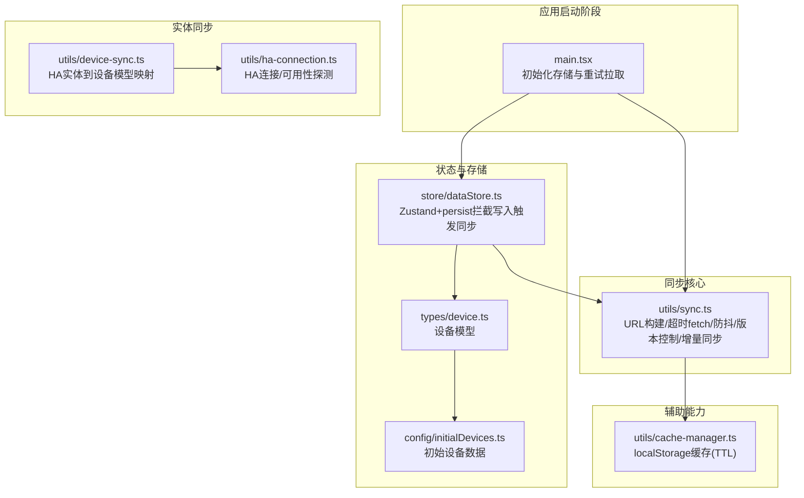
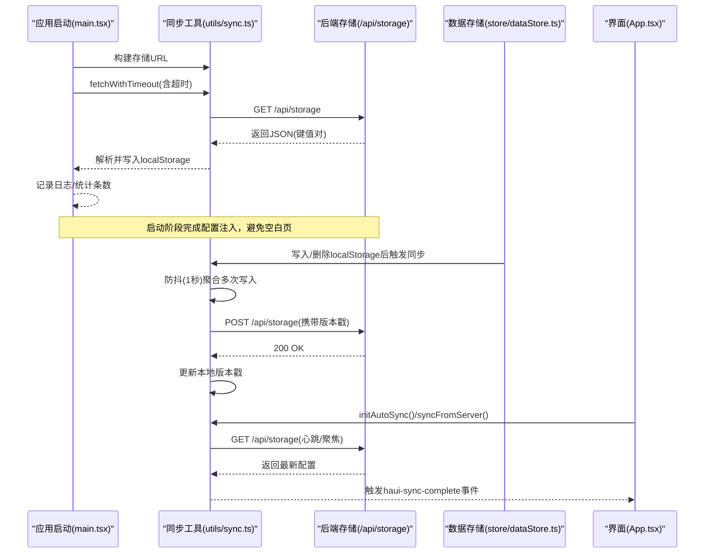
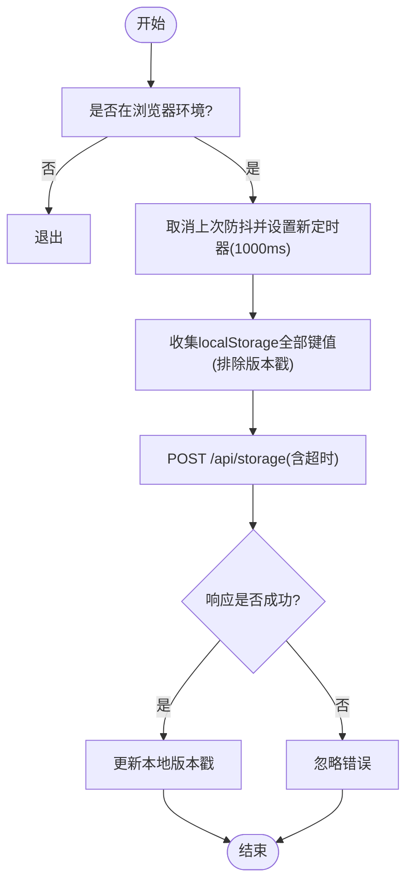
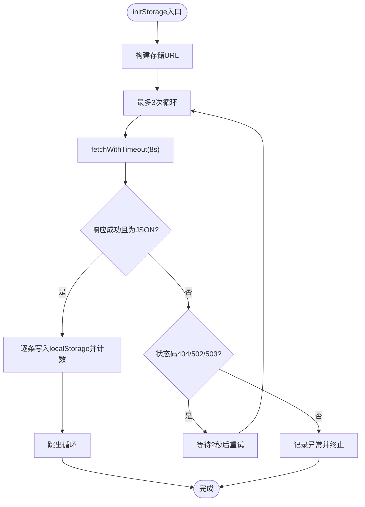
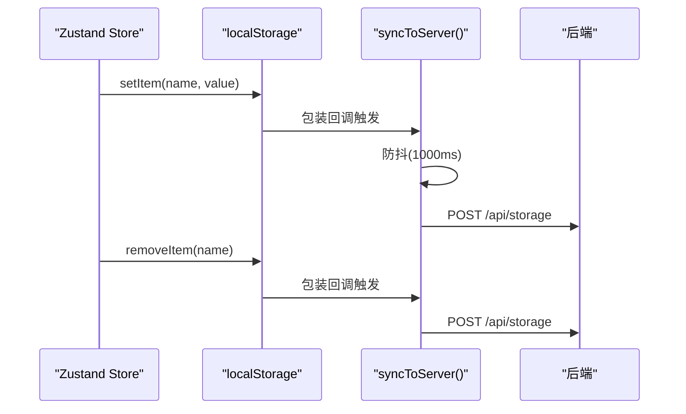
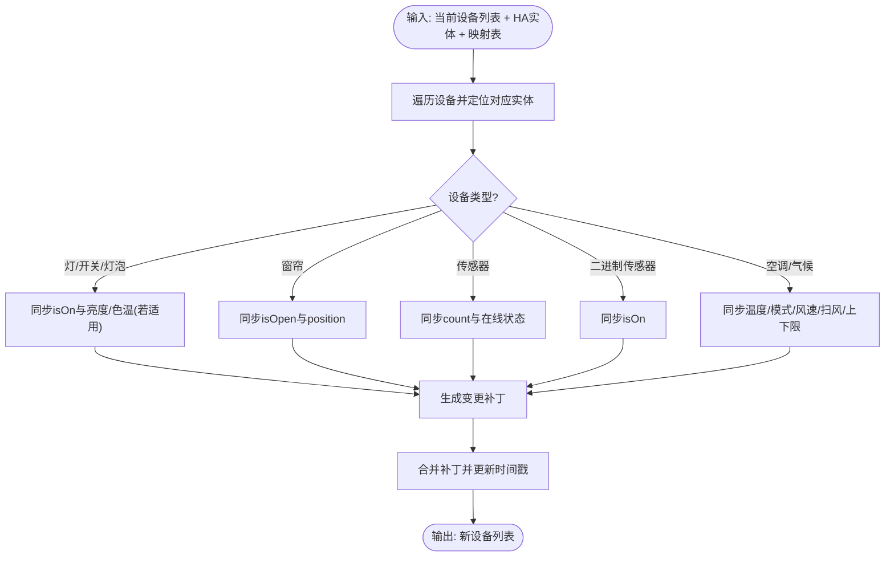
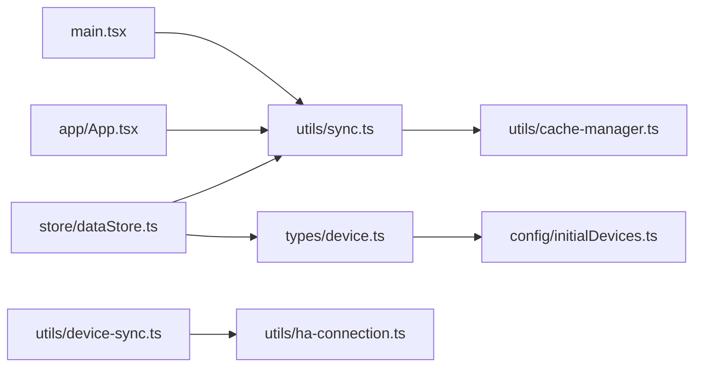

# 客户端同步逻辑

<cite>
**本文档引用的文件**
- [src/utils/sync.ts](file://src/utils/sync.ts)
- [src/main.tsx](file://src/main.tsx)
- [src/store/dataStore.ts](file://src/store/dataStore.ts)
- [src/app/App.tsx](file://src/app/App.tsx)
- [src/utils/device-sync.ts](file://src/utils/device-sync.ts)
- [src/utils/cache-manager.ts](file://src/utils/cache-manager.ts)
- [src/utils/ha-connection.ts](file://src/utils/ha-connection.ts)
- [src/types/device.ts](file://src/types/device.ts)
- [src/config/initialDevices.ts](file://src/config/initialDevices.ts)
</cite>

## 目录
1. [简介](#简介)
2. [项目结构](#项目结构)
3. [核心组件](#核心组件)
4. [架构总览](#架构总览)
5. [详细组件分析](#详细组件分析)
6. [依赖关系分析](#依赖关系分析)
7. [性能考虑](#性能考虑)
8. [故障排查指南](#故障排查指南)
9. [结论](#结论)
10. [附录](#附录)

## 简介
本文件系统性梳理 HAUI 客户端跨设备同步机制，覆盖以下主题：
- localStorage 数据存储策略与持久化范围
- 增量同步算法与版本控制机制
- 防抖、超时与重试策略
- 主动同步与被动同步的触发条件与时机
- 数据一致性保证、冲突检测与解决方案
- 同步事件监听、自定义事件处理与状态更新
- 同步配置选项、调试工具与性能监控方法

## 项目结构
围绕同步逻辑的关键文件与职责如下：
- 同步核心工具：负责 API 构造、带超时请求、防抖上传、版本控制与增量拉取
- 应用启动流程：在首屏渲染前完成配置拉取与注入
- 数据存储层：基于 zustand/persist 的本地持久化，拦截写入以触发同步
- 设备状态同步：将 Home Assistant 实体状态映射到本地设备模型
- 缓存管理：基于 localStorage 的 TTL 缓存封装
- 连接管理：Home Assistant 连接与可用性探测

**图表来源**
- [src/main.tsx:18-67](file://src/main.tsx#L18-L67)
- [src/utils/sync.ts:4-41](file://src/utils/sync.ts#L4-L41)
- [src/store/dataStore.ts:108-127](file://src/store/dataStore.ts#L108-L127)
- [src/utils/device-sync.ts:1-191](file://src/utils/device-sync.ts#L1-L191)
- [src/utils/ha-connection.ts:47-105](file://src/utils/ha-connection.ts#L47-L105)
- [src/utils/cache-manager.ts:1-57](file://src/utils/cache-manager.ts#L1-L57)

**章节来源**
- [src/main.tsx:18-67](file://src/main.tsx#L18-L67)
- [src/utils/sync.ts:4-41](file://src/utils/sync.ts#L4-L41)
- [src/store/dataStore.ts:108-127](file://src/store/dataStore.ts#L108-L127)
- [src/utils/device-sync.ts:1-191](file://src/utils/device-sync.ts#L1-L191)
- [src/utils/ha-connection.ts:47-105](file://src/utils/ha-connection.ts#L47-L105)
- [src/utils/cache-manager.ts:1-57](file://src/utils/cache-manager.ts#L1-L57)

## 核心组件
- 同步工具模块（utils/sync.ts）
  - API URL 构建：支持 Home Assistant Ingress 动态基础路径
  - 带超时 fetch：统一的超时控制与 AbortController
  - 防抖上传：1秒防抖窗口聚合多次写入
  - 版本控制：基于时间戳键的增量同步与对齐
  - 主动/被动同步：手动触发上传与自动心跳/聚焦对齐
- 应用启动同步（main.tsx）
  - 首次启动从后端拉取配置并注入 localStorage
  - 多次重试与超时兜底，避免空白页阻塞
- 存储拦截与联动（store/dataStore.ts）
  - 使用 persist + 自定义 Storage 包装 localStorage
  - 写入/删除时主动触发同步，确保跨设备一致
- 设备状态同步（utils/device-sync.ts）
  - 将 HA 实体状态与属性映射到本地设备模型
  - 支持多类型设备的状态与属性同步
- 缓存管理（utils/cache-manager.ts）
  - 基于 localStorage 的 TTL 缓存，支持严格过期与“过期即弃”
- HA 连接与可用性（utils/ha-connection.ts）
  - 连接建立、断开、错误处理
  - 并行探测本地/公网 URL 可达性，选择最优连接

**章节来源**
- [src/utils/sync.ts:4-161](file://src/utils/sync.ts#L4-L161)
- [src/main.tsx:18-67](file://src/main.tsx#L18-L67)
- [src/store/dataStore.ts:108-127](file://src/store/dataStore.ts#L108-L127)
- [src/utils/device-sync.ts:1-191](file://src/utils/device-sync.ts#L1-L191)
- [src/utils/cache-manager.ts:1-57](file://src/utils/cache-manager.ts#L1-L57)
- [src/utils/ha-connection.ts:47-105](file://src/utils/ha-connection.ts#L47-L105)

## 架构总览
下面的序列图展示了“启动时拉取配置”和“运行时增量同步”的两条主线。

**图表来源**
- [src/main.tsx:18-67](file://src/main.tsx#L18-L67)
- [src/utils/sync.ts:4-41](file://src/utils/sync.ts#L4-L41)
- [src/store/dataStore.ts:108-127](file://src/store/dataStore.ts#L108-L127)
- [src/app/App.tsx:311-325](file://src/app/App.tsx#L311-L325)

## 详细组件分析

### 同步工具模块（utils/sync.ts）
- URL 构建与 Ingress 支持
  - 在 hassio_ingress 场景下自动拼接动态根路径，适配反向代理环境
- 带超时 fetch
  - 使用 AbortController 控制超时，避免长时间挂起
- 防抖上传
  - 通过全局定时器在 1000ms 内合并多次写入，降低网络压力
- 版本控制与增量同步
  - 使用统一的时间戳键记录最后同步时间
  - 仅当远端版本较新或强制同步时才覆盖本地
- 主动/被动同步
  - 主动：手动触发上传
  - 被动：每 30 秒心跳检查与页面聚焦触发对齐
- 自定义事件
  - 对齐成功后派发 haui-sync-complete 事件，驱动 Store 刷新

**图表来源**
- [src/utils/sync.ts:52-93](file://src/utils/sync.ts#L52-L93)

**章节来源**
- [src/utils/sync.ts:4-161](file://src/utils/sync.ts#L4-L161)

### 应用启动同步（main.tsx）
- 首屏渲染前的配置拉取
  - 构建存储 URL，发起带超时的 GET 请求
  - 仅当响应为 JSON 时才注入 localStorage
  - 多次重试与超时兜底，确保应用尽快渲染
- 错误处理
  - 对 404/502/503 等状态进行提示与延迟重试
  - 对 AbortError 进行超时降级处理
  - 非 Add-on 环境下跳过同步，避免干扰

**图表来源**
- [src/main.tsx:18-67](file://src/main.tsx#L18-L67)

**章节来源**
- [src/main.tsx:18-67](file://src/main.tsx#L18-L67)

### 存储拦截与联动（store/dataStore.ts）
- 拦截 localStorage 写入
  - 通过自定义 Storage 的 setItem/removeItem 包装
  - 写入后异步导入同步模块并触发上传
- 持久化字段选择
  - 仅持久化设备、房间、场景、用户、日志等关键字段
- 与同步事件联动
  - 当远端对齐完成后，界面可通过自定义事件刷新状态

**图表来源**
- [src/store/dataStore.ts:108-127](file://src/store/dataStore.ts#L108-L127)
- [src/utils/sync.ts:52-93](file://src/utils/sync.ts#L52-L93)

**章节来源**
- [src/store/dataStore.ts:108-127](file://src/store/dataStore.ts#L108-L127)

### 设备状态同步（utils/device-sync.ts）
- 映射策略
  - 根据设备类型（灯、开关、窗帘、传感器、空调等）同步状态与属性
  - 仅在状态或属性发生变化时生成更新补丁
- 关键字段同步
  - 状态：isOn、position、temperature/current_temperature、mode/fan_mode/swing_mode 等
  - 属性：last_changed/last_updated、deviceClass、online 状态等
- 模式列表与边界
  - hvac_modes/fan_modes/swing_modes 等数组类型属性仅在变化时更新
  - min_temp/max_temp 等数值边界同步

**图表来源**
- [src/utils/device-sync.ts:4-191](file://src/utils/device-sync.ts#L4-L191)

**章节来源**
- [src/utils/device-sync.ts:1-191](file://src/utils/device-sync.ts#L1-L191)
- [src/types/device.ts:1-46](file://src/types/device.ts#L1-L46)
- [src/config/initialDevices.ts:1-68](file://src/config/initialDevices.ts#L1-L68)

### 缓存管理（utils/cache-manager.ts）
- TTL 缓存
  - 30 分钟过期策略，严格过期即丢弃
  - 提供 getStale 获取“过期但可用”的旧值
- 异常安全
  - 写入失败静默告警，不影响主流程

**章节来源**
- [src/utils/cache-manager.ts:1-57](file://src/utils/cache-manager.ts#L1-L57)

### HA 连接与可用性（utils/ha-connection.ts）
- 连接建立
  - 支持长连接与一次性连接
  - 事件监听 ready/disconnected/reconnect-error
- URL 正规化与可达性探测
  - 并行探测本地/公网 URL，优先返回可达实例
  - HTTP 超时与 WebSocket 双通道探测，规避 CORS 限制

**章节来源**
- [src/utils/ha-connection.ts:47-105](file://src/utils/ha-connection.ts#L47-L105)
- [src/utils/ha-connection.ts:193-296](file://src/utils/ha-connection.ts#L193-L296)

## 依赖关系分析
- 启动阶段依赖
  - main.tsx 依赖 sync.ts 的 URL 构建与超时请求
- 运行时依赖
  - dataStore.ts 依赖 sync.ts 的上传与事件派发
  - App.tsx 依赖 sync.ts 的心跳与对齐初始化
  - device-sync.ts 依赖 HA 实体数据与映射表
- 辅助依赖
  - cache-manager.ts 作为 localStorage 缓存层
  - ha-connection.ts 为 HA 连接与可用性探测

**图表来源**
- [src/main.tsx:16-16](file://src/main.tsx#L16-L16)
- [src/store/dataStore.ts:108-127](file://src/store/dataStore.ts#L108-L127)
- [src/app/App.tsx:311-325](file://src/app/App.tsx#L311-L325)
- [src/utils/device-sync.ts:1-191](file://src/utils/device-sync.ts#L1-L191)
- [src/utils/ha-connection.ts:47-105](file://src/utils/ha-connection.ts#L47-L105)
- [src/utils/cache-manager.ts:1-57](file://src/utils/cache-manager.ts#L1-L57)
- [src/types/device.ts:1-46](file://src/types/device.ts#L1-L46)
- [src/config/initialDevices.ts:1-68](file://src/config/initialDevices.ts#L1-L68)

**章节来源**
- [src/main.tsx:16-16](file://src/main.tsx#L16-L16)
- [src/store/dataStore.ts:108-127](file://src/store/dataStore.ts#L108-L127)
- [src/app/App.tsx:311-325](file://src/app/App.tsx#L311-L325)
- [src/utils/device-sync.ts:1-191](file://src/utils/device-sync.ts#L1-L191)
- [src/utils/ha-connection.ts:47-105](file://src/utils/ha-connection.ts#L47-L105)
- [src/utils/cache-manager.ts:1-57](file://src/utils/cache-manager.ts#L1-L57)
- [src/types/device.ts:1-46](file://src/types/device.ts#L1-L46)
- [src/config/initialDevices.ts:1-68](file://src/config/initialDevices.ts#L1-L68)

## 性能考虑
- 防抖与批处理
  - 1 秒防抖窗口减少频繁上传，适合高频交互场景
- 超时与重试
  - 启动阶段 8 秒超时与 3 次重试，避免首屏阻塞
  - 同步上传 5 秒超时，失败静默，保障 UI 流畅
- 增量同步
  - 仅在远端版本较新时覆盖，避免无谓写入
- 心跳频率
  - 30 秒心跳平衡实时性与网络消耗
- 缓存策略
  - TTL 30 分钟，严格过期，避免陈旧数据影响体验

[本节为通用性能建议，无需特定文件分析]

## 故障排查指南
- 启动阶段无法拉取配置
  - 检查后端 /api/storage 是否返回 JSON
  - 观察控制台日志中的状态码与重试提示
  - 确认网络连通与 CORS 设置
- 同步上传失败
  - 查看上传超时与 AbortError 日志
  - 确认浏览器环境与 localStorage 可用
- 对齐不生效
  - 检查自定义事件 haui-sync-complete 是否被监听
  - 确认 initAutoSync 已在连接就绪后初始化
- 设备状态不同步
  - 核对设备类型映射与实体 ID
  - 检查 device-sync 的映射函数是否正确执行

**章节来源**
- [src/main.tsx:54-66](file://src/main.tsx#L54-L66)
- [src/utils/sync.ts:89-91](file://src/utils/sync.ts#L89-L91)
- [src/app/App.tsx:311-325](file://src/app/App.tsx#L311-L325)
- [src/utils/device-sync.ts:1-191](file://src/utils/device-sync.ts#L1-L191)

## 结论
该同步体系通过“启动拉取 + 防抖上传 + 增量对齐 + 心跳与聚焦触发”的组合，在保证跨设备一致性的同时兼顾性能与稳定性。配合严格的超时与重试策略、版本控制与事件驱动刷新，实现了可靠的客户端同步闭环。

[本节为总结性内容，无需特定文件分析]

## 附录

### 同步配置选项
- 启动拉取
  - 最大重试次数：3
  - 单次超时：8 秒
  - 内容类型校验：仅接受 JSON
- 同步上传
  - 防抖窗口：1 秒
  - 单次超时：5 秒
  - 失败静默：不阻塞 UI
- 增量对齐
  - 心跳周期：30 秒
  - 触发条件：页面聚焦或心跳
  - 对齐策略：远端版本较新或强制同步时覆盖

**章节来源**
- [src/main.tsx:22-23](file://src/main.tsx#L22-L23)
- [src/utils/sync.ts:44](file://src/utils/sync.ts#L44)
- [src/utils/sync.ts:139-144](file://src/utils/sync.ts#L139-L144)

### 调试工具与日志
- 控制台日志
  - 启动拉取进度与条数统计
  - 同步上传/对齐成功与失败提示
  - 超时与重试信息
- 自定义事件
  - 对齐完成后派发 haui-sync-complete，用于触发 Store 刷新
- 缓存调试
  - TTL 过期行为与 getStale 读取

**章节来源**
- [src/main.tsx:39](file://src/main.tsx#L39)
- [src/utils/sync.ts:87](file://src/utils/sync.ts#L87)
- [src/utils/sync.ts:120](file://src/utils/sync.ts#L120)
- [src/utils/cache-manager.ts:45-55](file://src/utils/cache-manager.ts#L45-L55)