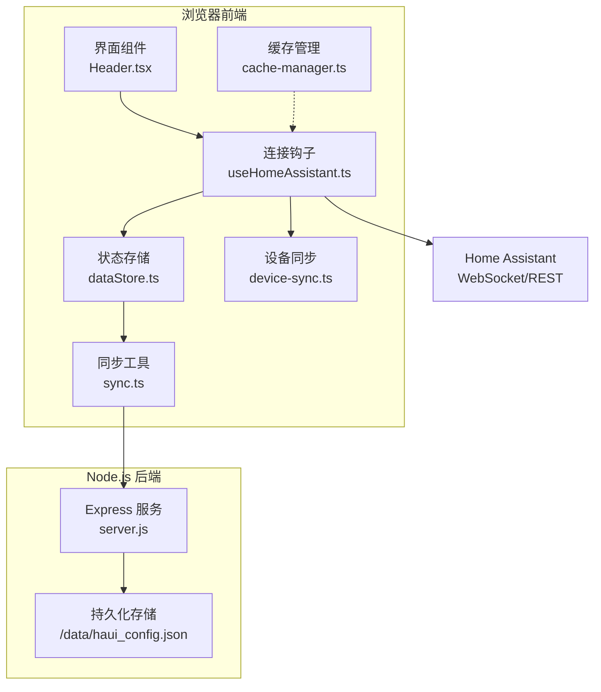
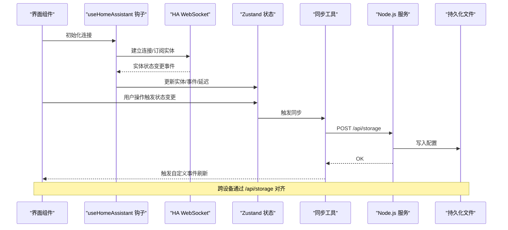
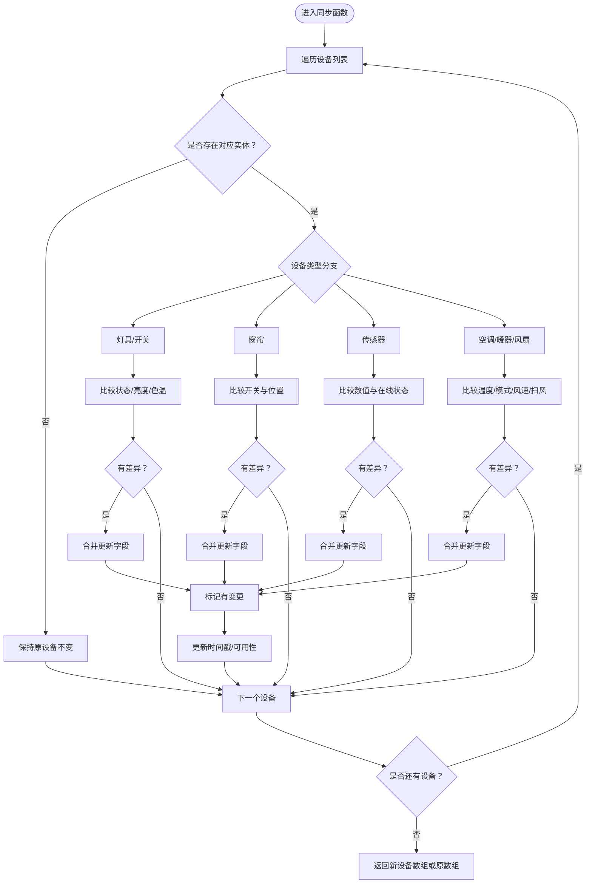
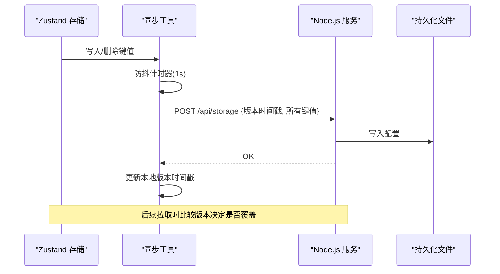
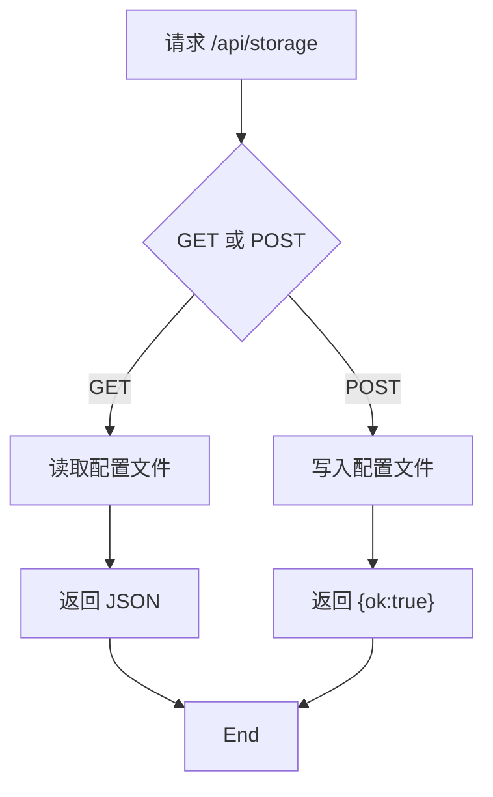
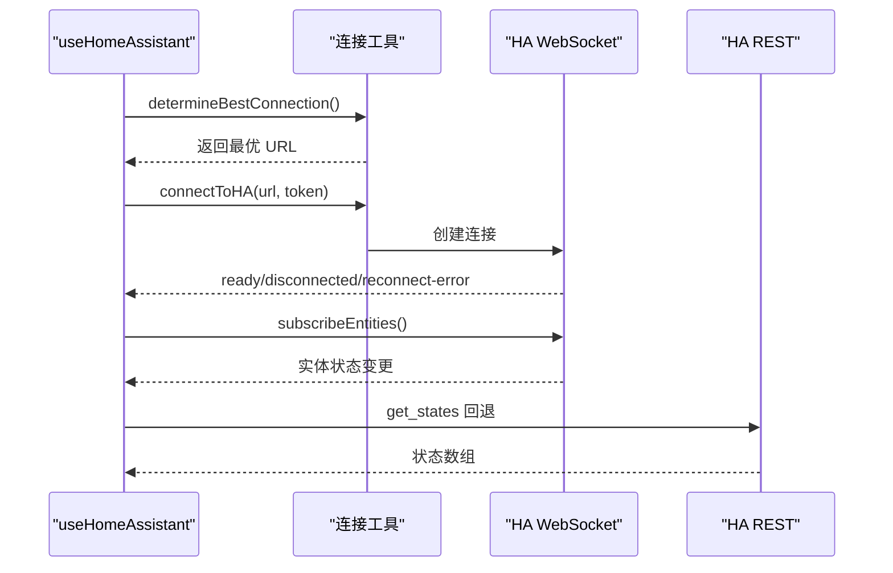
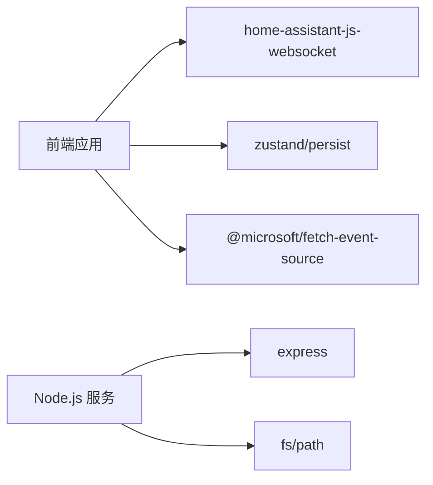

# 跨设备同步机制

<cite>
**本文引用的文件**
- [device-sync.ts](file://src/utils/device-sync.ts)
- [sync.ts](file://src/utils/sync.ts)
- [dataStore.ts](file://src/store/dataStore.ts)
- [server.js](file://addon/server.js)
- [ha-connection.ts](file://src/utils/ha-connection.ts)
- [useHomeAssistant.ts](file://src/hooks/useHomeAssistant.ts)
- [Header.tsx](file://src/app/components/dashboard/Header.tsx)
- [cache-manager.ts](file://src/utils/cache-manager.ts)
- [device.ts](file://src/types/device.ts)
- [initialDevices.ts](file://src/config/initialDevices.ts)
- [README.md](file://README.md)
- [package.json](file://package.json)
</cite>

## 目录
1. [引言](#引言)
2. [项目结构](#项目结构)
3. [核心组件](#核心组件)
4. [架构总览](#架构总览)
5. [详细组件分析](#详细组件分析)
6. [依赖关系分析](#依赖关系分析)
7. [性能考量](#性能考量)
8. [故障排查指南](#故障排查指南)
9. [结论](#结论)
10. [附录](#附录)

## 引言
本文件系统性阐述 HAUI 项目的跨设备同步机制，覆盖同步原理、数据一致性、冲突解决策略、Node.js 后端实现、WebSocket 通信与实时数据传输、客户端同步逻辑与离线缓存、性能优化与网络异常处理、数据完整性校验、配置管理与版本兼容性、迁移策略，以及调试工具、监控指标与故障排除方法。目标是帮助开发者与运维人员快速理解并高效维护该同步体系。

## 项目结构
- 前端使用 React + Zustand 管理本地状态，结合 localStorage 实现持久化与跨设备同步。
- Node.js Add-on 提供 /api/storage 读写接口，作为前端与 Home Assistant 的中间层。
- 通过 home-assistant-js-websocket 建立 WebSocket 连接，订阅实体状态变更，实现近实时同步。
- 通过延迟与防抖策略降低网络压力，结合缓存与增量校验保障一致性。

图表来源
- [useHomeAssistant.ts:1-313](file://src/hooks/useHomeAssistant.ts#L1-L313)
- [dataStore.ts:1-129](file://src/store/dataStore.ts#L1-L129)
- [sync.ts:1-161](file://src/utils/sync.ts#L1-L161)
- [device-sync.ts:1-191](file://src/utils/device-sync.ts#L1-L191)
- [server.js:1-521](file://addon/server.js#L1-L521)
- [cache-manager.ts:1-57](file://src/utils/cache-manager.ts#L1-L57)

章节来源
- [README.md:1-84](file://README.md#L1-L84)
- [package.json:1-132](file://package.json#L1-L132)

## 核心组件
- 设备状态同步器：根据 Home Assistant 实体状态与本地设备模型进行字段映射与差异计算，生成增量更新。
- 本地持久化与同步：Zustand 结合 localStorage，提供 JSON 存储与自动同步；同步工具负责版本时间戳与增量校验。
- Node.js 后端：提供 /api/storage 读写接口，作为前端与 HA 的代理与桥接。
- WebSocket 连接与订阅：建立长连接，订阅实体状态变更与事件，实现近实时更新。
- 缓存与离线策略：本地缓存与 TTL 控制，配合增量校验与心跳检测提升鲁棒性。

章节来源
- [device-sync.ts:1-191](file://src/utils/device-sync.ts#L1-L191)
- [sync.ts:1-161](file://src/utils/sync.ts#L1-L161)
- [dataStore.ts:1-129](file://src/store/dataStore.ts#L1-L129)
- [server.js:96-121](file://addon/server.js#L96-L121)
- [ha-connection.ts:1-317](file://src/utils/ha-connection.ts#L1-L317)
- [useHomeAssistant.ts:1-313](file://src/hooks/useHomeAssistant.ts#L1-L313)
- [cache-manager.ts:1-57](file://src/utils/cache-manager.ts#L1-L57)

## 架构总览
跨设备同步由“前端本地存储 + 后端持久化 + HA 实时订阅”三层构成：
- 前端：Zustand 状态 + localStorage 持久化，自动触发同步；WebSocket 订阅实体状态与事件。
- 后端：/api/storage 读写配置，/ha-api 代理 HA REST 请求，健康检查与 AI 能力扩展。
- HA：WebSocket 提供实体状态变更事件，REST 提供一次性状态查询与服务调用。

图表来源
- [useHomeAssistant.ts:61-189](file://src/hooks/useHomeAssistant.ts#L61-L189)
- [dataStore.ts:108-117](file://src/store/dataStore.ts#L108-L117)
- [sync.ts:52-93](file://src/utils/sync.ts#L52-L93)
- [server.js:96-121](file://addon/server.js#L96-L121)

## 详细组件分析

### 设备状态同步器（device-sync.ts）
职责：将 Home Assistant 实体状态映射到本地设备模型，按设备类型进行字段比对与增量更新，同时记录 HA 可用性与状态变化时间戳。

- 关键流程
  - 输入：当前设备数组、实体集合、设备 ID 到实体 ID 的映射。
  - 处理：逐设备对比实体状态与属性，按类型分支更新 isOn、亮度、色温、位置、温度、模式、可用模式列表等。
  - 输出：若存在差异，返回新设备数组；否则返回原数组。
  - 时间戳：lastUpdated/lastChanged 与 HA 状态/可用性变更联动更新。

- 数据一致性
  - 严格比较：数值型与数组型字段使用 JSON 字符串比较，避免浅比较误判。
  - 可用性判断：依据 HA 状态字符串判定 online/offline。
  - 最小化更新：仅在字段实际变化时生成更新对象，减少渲染与存储压力。

- 冲突解决策略
  - 以 HA 实体为权威源，本地设备状态作为展示与交互载体；当实体状态变化时，优先采纳实体值。
  - 对于属性类字段（如 hvac_modes/fan_modes/swing_modes），仅在变化时更新，避免频繁重绘。

图表来源
- [device-sync.ts:4-190](file://src/utils/device-sync.ts#L4-L190)

章节来源
- [device-sync.ts:1-191](file://src/utils/device-sync.ts#L1-L191)
- [device.ts:1-46](file://src/types/device.ts#L1-L46)

### 本地持久化与同步（sync.ts、dataStore.ts）
职责：将本地状态持久化到 localStorage，并通过 /api/storage 与后端对齐；提供防抖、增量校验与自动同步能力。

- 同步版本控制
  - 使用统一的时间戳键名记录最后一次同步时间，拉取时比较远端与本地版本，仅在远端更新时覆盖。
  - 本地写入后立即触发同步，避免跨设备不同步。

- 自动同步策略
  - 页面聚焦与定时器（每 30 秒）触发对齐，保证长时间后台运行后的数据一致性。
  - 写入 localStorage 时进行防抖（1 秒），合并多次变更，降低网络请求频率。

- API 与安全
  - /api/storage 读写接口，使用 Cookie 凭据（credentials: include）确保在 HA Ingress 环境下正常工作。
  - 超时控制与错误吞吐，避免阻塞应用启动。

图表来源
- [sync.ts:52-131](file://src/utils/sync.ts#L52-L131)
- [dataStore.ts:108-117](file://src/store/dataStore.ts#L108-L117)
- [server.js:110-121](file://addon/server.js#L110-L121)

章节来源
- [sync.ts:1-161](file://src/utils/sync.ts#L1-L161)
- [dataStore.ts:1-129](file://src/store/dataStore.ts#L1-L129)

### Node.js 后端服务（server.js）
职责：提供 /api/storage 读写、/ha-api 代理 HA REST、健康检查与 AI 能力扩展。

- /api/storage
  - GET：读取持久化配置文件，返回 JSON。
  - POST：写入键值对，包含版本时间戳与所有本地存储项。
  - 错误处理：捕获异常并返回 500。

- /ha-api 代理
  - 将前端请求转发到 HA Core，保留 Content-Type 与 Authorization。
  - 支持 SUPERVISOR_TOKEN 作为备用鉴权。

- 健康检查
  - /api/health 返回服务状态与时钟，用于 HA Ingress 心跳探测。

图表来源
- [server.js:96-121](file://addon/server.js#L96-L121)

章节来源
- [server.js:1-521](file://addon/server.js#L1-L521)

### WebSocket 通信与实时数据传输（ha-connection.ts、useHomeAssistant.ts）
职责：建立与 HA 的 WebSocket 连接，订阅实体状态与事件，提供延迟检测与连接回退策略。

- 连接建立
  - 支持环境变量或显式配置；提供最佳连接选择（本地/公网）与可用性检测。
  - 默认连接失败时回退到 /ha-api 代理路径，确保在受限网络环境下仍可工作。

- 实时订阅
  - 订阅实体状态变更事件，驱动 UI 即时更新。
  - 提供延迟检测（ping）与断线重连逻辑。

- REST 回退
  - WebSocket 失败时回退到 REST 接口获取状态，保证功能可用性。

图表来源
- [useHomeAssistant.ts:61-189](file://src/hooks/useHomeAssistant.ts#L61-L189)
- [ha-connection.ts:193-238](file://src/utils/ha-connection.ts#L193-L238)

章节来源
- [ha-connection.ts:1-317](file://src/utils/ha-connection.ts#L1-L317)
- [useHomeAssistant.ts:1-313](file://src/hooks/useHomeAssistant.ts#L1-L313)
- [Header.tsx:133-150](file://src/app/components/dashboard/Header.tsx#L133-L150)

### 离线缓存与一致性（cache-manager.ts、useHomeAssistant.ts）
职责：提供本地缓存与 TTL 管理，结合增量校验与心跳检测，提升离线与弱网场景下的用户体验。

- 缓存策略
  - TTL 30 分钟，严格过期策略，避免陈旧数据污染。
  - 提供 getStale 读取以支持“过期仍用”的场景（可按需扩展）。

- 心跳与延迟
  - 每 10 秒发送 ping，计算往返延迟并在 UI 上可视化显示。

章节来源
- [cache-manager.ts:1-57](file://src/utils/cache-manager.ts#L1-L57)
- [useHomeAssistant.ts:37-59](file://src/hooks/useHomeAssistant.ts#L37-L59)
- [Header.tsx:133-150](file://src/app/components/dashboard/Header.tsx#L133-L150)

## 依赖关系分析
- 前端依赖
  - home-assistant-js-websocket：WebSocket 连接与订阅。
  - zustand：状态管理与持久化中间件。
  - @microsoft/fetch-event-source：SSE 流式响应（AI 能力相关）。

- 后端依赖
  - express：提供 REST 与静态资源服务。
  - fs/path：持久化配置文件读写。

图表来源
- [package.json:65-96](file://package.json#L65-L96)
- [server.js:1-10](file://addon/server.js#L1-L10)

章节来源
- [package.json:1-132](file://package.json#L1-L132)
- [server.js:1-521](file://addon/server.js#L1-L521)

## 性能考量
- 防抖与批处理：本地写入后 1 秒防抖，合并多次变更，降低网络请求频率。
- 增量校验：版本时间戳比较，仅在远端更新时覆盖，避免不必要的覆盖。
- 缓存与 TTL：30 分钟缓存，减少重复请求；心跳检测与延迟可视化，便于性能诊断。
- 连接回退：WebSocket 失败时自动回退 REST，保证可用性。
- 资源优化：静态资源缓存与 ETag，减少带宽占用。

## 故障排查指南
- 连接失败
  - 检查 VITE_HA_URL 与 VITE_HA_TOKEN 是否正确配置。
  - 使用可用性检测函数验证本地/公网 URL 可达性。
  - 若默认连接失败，确认 /ha-api 代理是否可用。

- 同步异常
  - 查看 /api/storage 返回状态与错误日志。
  - 确认 credentials: include 与 HA Ingress 环境下的 Cookie 传递。
  - 检查本地版本时间戳是否更新成功。

- 实时同步延迟
  - 查看 UI 延迟指示器，关注 WebSocket ping 延迟。
  - 检查网络质量与 HA 服务器负载。

- 缓存问题
  - 清除 TTL 过期缓存，重新拉取最新数据。
  - 检查缓存键是否正确，避免误用过期数据。

章节来源
- [useHomeAssistant.ts:81-203](file://src/hooks/useHomeAssistant.ts#L81-L203)
- [sync.ts:98-131](file://src/utils/sync.ts#L98-L131)
- [server.js:96-121](file://addon/server.js#L96-L121)
- [Header.tsx:133-150](file://src/app/components/dashboard/Header.tsx#L133-L150)

## 结论
该同步机制通过“前端本地持久化 + 后端统一存储 + HA 实时订阅”的组合，实现了跨设备配置与状态的高一致性与低延迟同步。借助版本时间戳、增量校验、防抖与缓存策略，系统在弱网与离线场景下仍能保持稳定与可用。建议在生产环境中结合监控指标（延迟、错误率、同步成功率）持续优化，并完善冲突策略与迁移方案以应对复杂业务场景。

## 附录

### 同步配置管理与版本兼容性
- 版本控制：统一使用时间戳键名记录同步版本，远端更新时才覆盖本地。
- 兼容性：新增字段时采用条件判断与默认值，避免老版本读取新字段报错。
- 迁移策略：在初始化阶段读取旧格式并转换为新格式，写入时统一为新格式。

章节来源
- [sync.ts:46-131](file://src/utils/sync.ts#L46-L131)
- [dataStore.ts:49-56](file://src/store/dataStore.ts#L49-L56)
- [initialDevices.ts:1-68](file://src/config/initialDevices.ts#L1-L68)

### 调试工具与监控指标
- 调试工具
  - 浏览器控制台：查看连接状态、延迟、同步事件。
  - localStorage：设置调试开关（如图标加载调试）。
- 监控指标
  - WebSocket 延迟（ms）、连接状态、实体变更速率、同步成功率、错误率。

章节来源
- [Header.tsx:133-150](file://src/app/components/dashboard/Header.tsx#L133-L150)
- [useHomeAssistant.ts:37-59](file://src/hooks/useHomeAssistant.ts#L37-L59)
- [README.md:79-83](file://README.md#L79-L83)