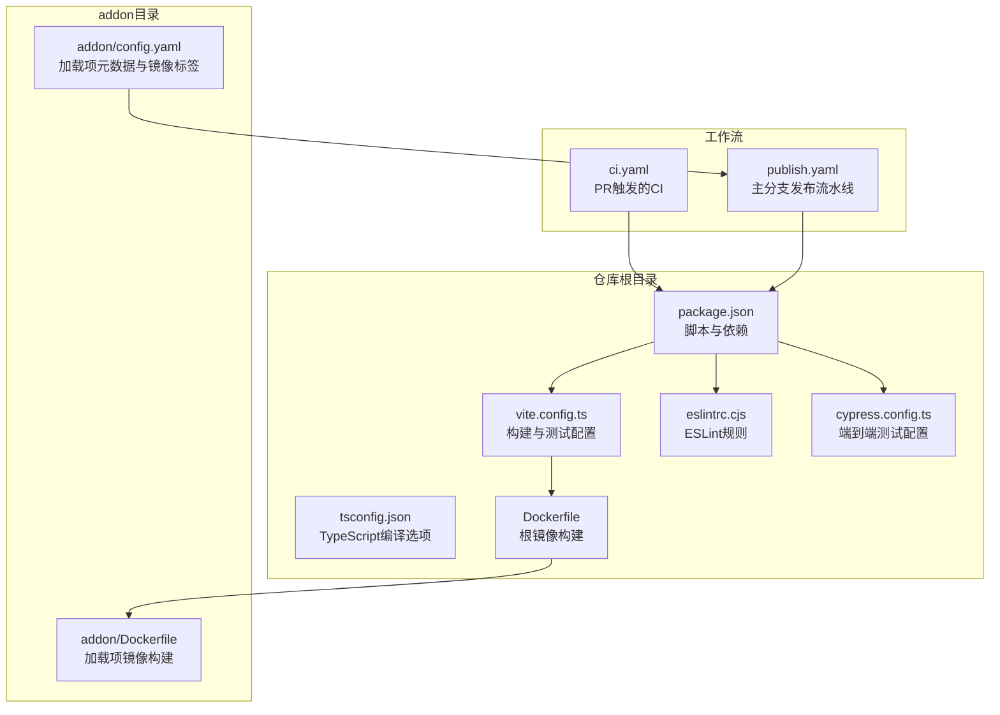
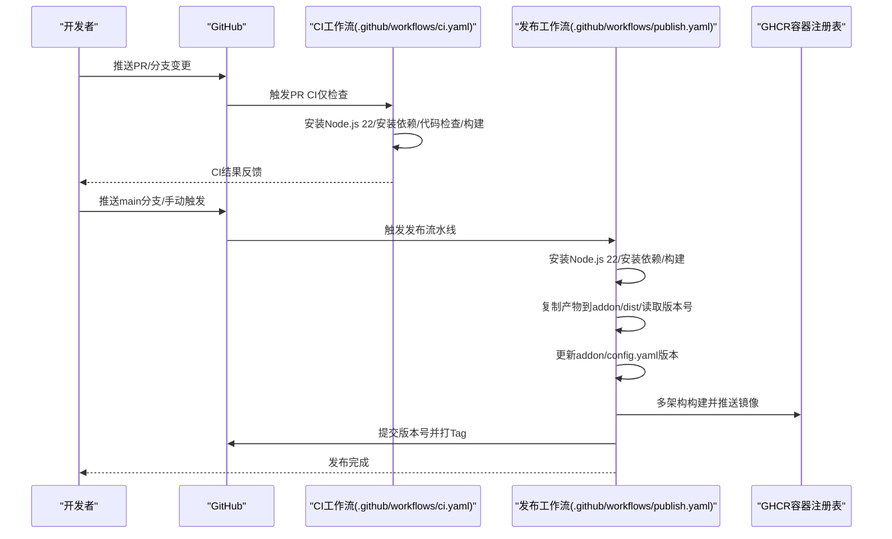
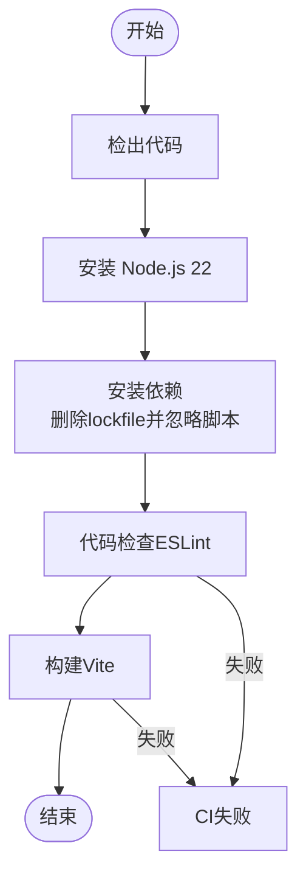
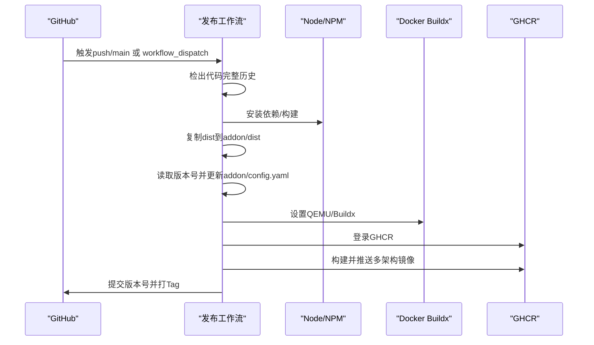
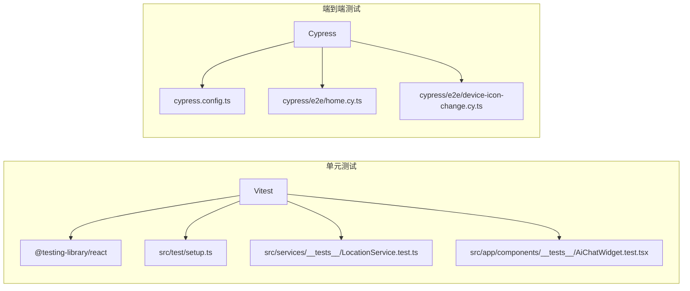
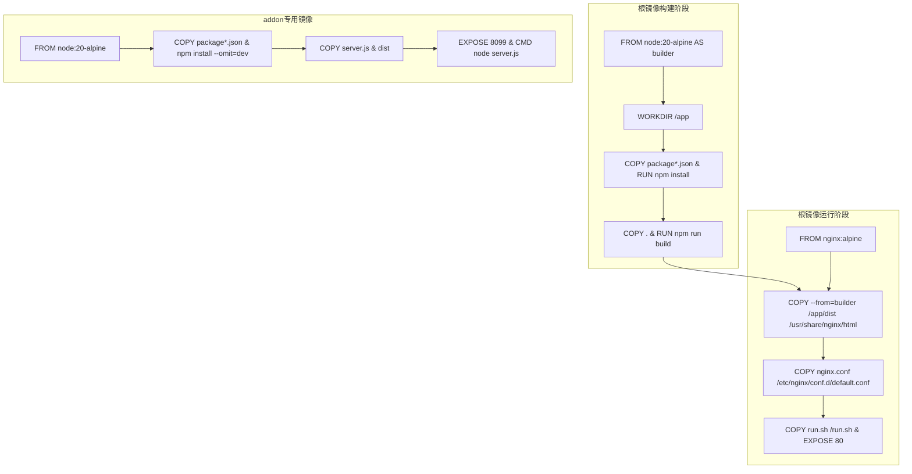
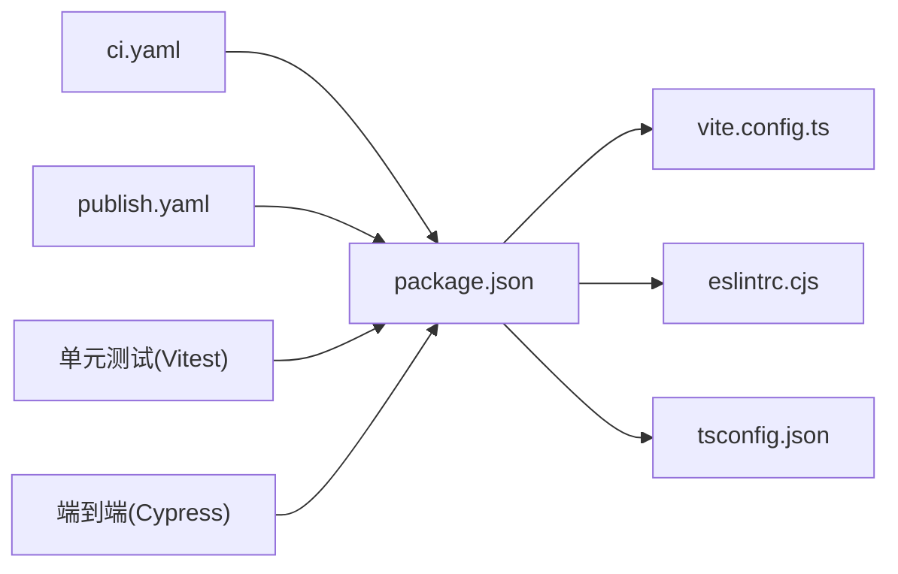

# CI/CD流水线

<cite>
**本文引用的文件**
- [.github/workflows/ci.yaml](file://.github/workflows/ci.yaml)
- [.github/workflows/publish.yaml](file://.github/workflows/publish.yaml)
- [package.json](file://package.json)
- [vite.config.ts](file://vite.config.ts)
- [tsconfig.json](file://tsconfig.json)
- [.eslintrc.cjs](file://.eslintrc.cjs)
- [Dockerfile](file://Dockerfile)
- [addon/Dockerfile](file://addon/Dockerfile)
- [addon/config.yaml](file://addon/config.yaml)
- [cypress.config.ts](file://cypress.config.ts)
- [cypress/e2e/home.cy.ts](file://cypress/e2e/home.cy.ts)
- [cypress/e2e/device-icon-change.cy.ts](file://cypress/e2e/device-icon-change.cy.ts)
- [src/test/setup.ts](file://src/test/setup.ts)
- [src/services/__tests__/LocationService.test.ts](file://src/services/__tests__/LocationService.test.ts)
- [src/app/components/__tests__/AiChatWidget.test.tsx](file://src/app/components/__tests__/AiChatWidget.test.tsx)
</cite>

## 目录
1. [简介](#简介)
2. [项目结构](#项目结构)
3. [核心组件](#核心组件)
4. [架构总览](#架构总览)
5. [详细组件分析](#详细组件分析)
6. [依赖关系分析](#依赖关系分析)
7. [性能考虑](#性能考虑)
8. [故障排除指南](#故障排除指南)
9. [结论](#结论)
10. [附录](#附录)

## 简介
本文件面向HAUI项目的CI/CD流水线，系统性梳理GitHub Actions工作流配置、代码质量检查、自动化测试与构建流程、发布流水线的版本管理与制品打包策略，并给出分支保护、代码审查与发布规范的配置建议。同时提供性能优化、缓存策略与并行执行的最佳实践，帮助团队建立稳定高效的持续交付体系。

## 项目结构
本项目采用“前端应用 + Home Assistant 加载项”的双层产物结构：
- 前端应用：Vite构建，产物输出至dist目录，供Nginx服务
- 加载项：包含独立的addon目录，内含Dockerfile与配置文件，用于打包HA加载项镜像

图表来源
- [package.json:1-132](file://package.json#L1-L132)
- [vite.config.ts:1-53](file://vite.config.ts#L1-L53)
- [tsconfig.json:1-30](file://tsconfig.json#L1-L30)
- [.eslintrc.cjs:1-19](file://.eslintrc.cjs#L1-L19)
- [Dockerfile:1-37](file://Dockerfile#L1-L37)
- [addon/Dockerfile:1-17](file://addon/Dockerfile#L1-L17)
- [addon/config.yaml:1-37](file://addon/config.yaml#L1-L37)
- [.github/workflows/ci.yaml:1-29](file://.github/workflows/ci.yaml#L1-L29)
- [.github/workflows/publish.yaml:1-145](file://.github/workflows/publish.yaml#L1-L145)
- [cypress.config.ts:1-11](file://cypress.config.ts#L1-L11)

章节来源
- [.github/workflows/ci.yaml:1-29](file://.github/workflows/ci.yaml#L1-L29)
- [.github/workflows/publish.yaml:1-145](file://.github/workflows/publish.yaml#L1-L145)
- [package.json:1-132](file://package.json#L1-L132)
- [vite.config.ts:1-53](file://vite.config.ts#L1-L53)
- [tsconfig.json:1-30](file://tsconfig.json#L1-L30)
- [.eslintrc.cjs:1-19](file://.eslintrc.cjs#L1-L19)
- [Dockerfile:1-37](file://Dockerfile#L1-L37)
- [addon/Dockerfile:1-17](file://addon/Dockerfile#L1-L17)
- [addon/config.yaml:1-37](file://addon/config.yaml#L1-L37)
- [cypress.config.ts:1-11](file://cypress.config.ts#L1-L11)

## 核心组件
- CI工作流（PR触发）
  - 触发条件：针对main分支的pull_request事件
  - 步骤：检出代码、安装Node.js 22、安装依赖（忽略脚本）、代码检查、构建
- 发布工作流（主分支推送/手动触发）
  - 触发条件：main分支push或workflow_dispatch；仅当特定路径发生变更时触发
  - 权限：contents: write, packages: write
  - 步骤：检出完整历史、安装Node.js 22、安装依赖、前端构建、复制产物到addon/dist、读取版本号、更新addon/config.yaml版本、设置QEMU与Buildx、登录GHCR、多架构构建并推送镜像、提交版本号更新并打Tag

章节来源
- [.github/workflows/ci.yaml:1-29](file://.github/workflows/ci.yaml#L1-L29)
- [.github/workflows/publish.yaml:1-145](file://.github/workflows/publish.yaml#L1-L145)

## 架构总览
下图展示CI/CD流水线在不同阶段的职责与交互：

图表来源
- [.github/workflows/ci.yaml:1-29](file://.github/workflows/ci.yaml#L1-L29)
- [.github/workflows/publish.yaml:1-145](file://.github/workflows/publish.yaml#L1-L145)

## 详细组件分析

### CI工作流（代码质量与构建）
- 触发条件
  - 事件类型：pull_request
  - 分支：main
- 执行步骤
  - 检出代码
  - 安装Node.js 22
  - 安装依赖（删除Windows生成的package-lock.json，使用--legacy-peer-deps，忽略脚本）
  - 代码检查（ESLint）
  - 构建（Vite）
- 失败处理
  - 任一步骤失败即终止后续步骤，返回失败状态
- 性能优化建议
  - 启用npm/yarn/pnpm缓存（见“性能考虑”）
  - 在PR中按需并行执行多个检查任务（见“性能考虑”）

图表来源
- [.github/workflows/ci.yaml:1-29](file://.github/workflows/ci.yaml#L1-L29)

章节来源
- [.github/workflows/ci.yaml:1-29](file://.github/workflows/ci.yaml#L1-L29)
- [package.json:6-12](file://package.json#L6-L12)
- [.eslintrc.cjs:1-19](file://.eslintrc.cjs#L1-L19)
- [vite.config.ts:20-30](file://vite.config.ts#L20-L30)

### 发布工作流（版本管理、制品打包与部署）
- 触发条件
  - push到main分支
  - 仅当以下路径发生变更时触发：addon/**、src/**、public/**、index.html、package.json、vite.config.ts、.github/workflows/**
  - 支持workflow_dispatch手动触发
- 权限
  - contents: write（提交与打Tag）
  - packages: write（推送镜像）
- 执行步骤
  - 检出代码（fetch-depth: 0以获取完整历史）
  - 安装Node.js 22并安装依赖
  - 前端构建
  - 将dist复制到addon/dist
  - 从package.json读取版本号并更新addon/config.yaml
  - 设置QEMU与Docker Buildx
  - 登录GHCR
  - 多架构构建并推送镜像（amd64/aarch64/armv7）
  - 提交版本号更新并打Tag
- 失败处理
  - 任一步骤失败即终止，避免错误制品进入生产环境
- 版本管理
  - 版本号来源于package.json，发布后同步更新addon/config.yaml并创建对应Git Tag

图表来源
- [.github/workflows/publish.yaml:1-145](file://.github/workflows/publish.yaml#L1-L145)
- [addon/config.yaml:1-37](file://addon/config.yaml#L1-L37)
- [package.json:4-4](file://package.json#L4-L4)

章节来源
- [.github/workflows/publish.yaml:1-145](file://.github/workflows/publish.yaml#L1-L145)
- [addon/config.yaml:1-37](file://addon/config.yaml#L1-L37)
- [package.json:4-4](file://package.json#L4-L4)

### 自动化测试集成
- 单元测试
  - 测试框架：Vitest + @testing-library/react
  - 环境：jsdom
  - 配置：vite.config.ts中的test字段，全局setup文件位于src/test/setup.ts
  - 示例测试：
    - 服务层测试：src/services/__tests__/LocationService.test.ts
    - 组件测试：src/app/components/__tests__/AiChatWidget.test.tsx
- 端到端测试
  - 测试框架：Cypress
  - 配置：cypress.config.ts
  - 示例测试：
    - 基础加载：cypress/e2e/home.cy.ts
    - 设备图标变更：cypress/e2e/device-icon-change.cy.ts
- 测试执行
  - package.json中定义了test:e2e脚本，可在本地或CI中运行
  - 当前CI工作流未包含测试步骤，建议在CI中增加测试执行以提升质量门禁

图表来源
- [vite.config.ts:46-50](file://vite.config.ts#L46-L50)
- [src/test/setup.ts:1-46](file://src/test/setup.ts#L1-L46)
- [src/services/__tests__/LocationService.test.ts:1-107](file://src/services/__tests__/LocationService.test.ts#L1-L107)
- [src/app/components/__tests__/AiChatWidget.test.tsx:1-131](file://src/app/components/__tests__/AiChatWidget.test.tsx#L1-L131)
- [cypress.config.ts:1-11](file://cypress.config.ts#L1-L11)
- [cypress/e2e/home.cy.ts:1-10](file://cypress/e2e/home.cy.ts#L1-L10)
- [cypress/e2e/device-icon-change.cy.ts:1-67](file://cypress/e2e/device-icon-change.cy.ts#L1-L67)

章节来源
- [vite.config.ts:46-50](file://vite.config.ts#L46-L50)
- [src/test/setup.ts:1-46](file://src/test/setup.ts#L1-L46)
- [src/services/__tests__/LocationService.test.ts:1-107](file://src/services/__tests__/LocationService.test.ts#L1-L107)
- [src/app/components/__tests__/AiChatWidget.test.tsx:1-131](file://src/app/components/__tests__/AiChatWidget.test.tsx#L1-L131)
- [cypress.config.ts:1-11](file://cypress.config.ts#L1-L11)
- [cypress/e2e/home.cy.ts:1-10](file://cypress/e2e/home.cy.ts#L1-L10)
- [cypress/e2e/device-icon-change.cy.ts:1-67](file://cypress/e2e/device-icon-change.cy.ts#L1-L67)
- [package.json:6-12](file://package.json#L6-L12)

### 构建与镜像打包
- 前端构建
  - 使用Vite进行构建，产物位于dist目录
  - 构建配置包含相对路径基础路径、外部化ezuikit-js等
- 加载项镜像
  - 根镜像：node:20-alpine（构建阶段），nginx:alpine（运行阶段）
  - 构建阶段：安装依赖并构建前端
  - 运行阶段：将dist拷贝至Nginx HTML目录，应用自定义nginx.conf，启动/run.sh
- addon专用镜像
  - 独立Dockerfile，仅安装生产依赖，运行server.js提供静态资源
  - 与根镜像分离，便于HA加载项独立分发

图表来源
- [Dockerfile:1-37](file://Dockerfile#L1-L37)
- [addon/Dockerfile:1-17](file://addon/Dockerfile#L1-L17)

章节来源
- [Dockerfile:1-37](file://Dockerfile#L1-L37)
- [addon/Dockerfile:1-17](file://addon/Dockerfile#L1-L17)
- [vite.config.ts:20-30](file://vite.config.ts#L20-L30)

## 依赖关系分析
- 脚本与工具链
  - package.json定义了构建、测试、代码检查脚本
  - vite.config.ts提供构建、代理、测试环境配置
  - tsconfig.json与.eslintrc.cjs分别约束TypeScript编译与ESLint规则
- 工作流对工具链的依赖
  - CI/Publish均依赖Node.js 22与npm
  - 发布流程依赖Docker、QEMU、Buildx与GHCR登录
- 测试依赖
  - Vitest与@testing-library/react用于单元测试
  - Cypress用于端到端测试

图表来源
- [package.json:1-132](file://package.json#L1-L132)
- [vite.config.ts:1-53](file://vite.config.ts#L1-L53)
- [tsconfig.json:1-30](file://tsconfig.json#L1-L30)
- [.eslintrc.cjs:1-19](file://.eslintrc.cjs#L1-L19)
- [.github/workflows/ci.yaml:1-29](file://.github/workflows/ci.yaml#L1-L29)
- [.github/workflows/publish.yaml:1-145](file://.github/workflows/publish.yaml#L1-L145)

章节来源
- [package.json:1-132](file://package.json#L1-L132)
- [vite.config.ts:1-53](file://vite.config.ts#L1-L53)
- [tsconfig.json:1-30](file://tsconfig.json#L1-L30)
- [.eslintrc.cjs:1-19](file://.eslintrc.cjs#L1-L19)
- [.github/workflows/ci.yaml:1-29](file://.github/workflows/ci.yaml#L1-L29)
- [.github/workflows/publish.yaml:1-145](file://.github/workflows/publish.yaml#L1-L145)

## 性能考虑
- 缓存策略
  - 使用actions/cache或类似缓存机制缓存Node模块目录，减少重复安装时间
  - 对于Windows/Linux混合环境，建议在安装依赖前清理lockfile并使用--legacy-peer-deps，避免跨平台缓存污染
- 并行执行
  - 将代码检查、构建、测试拆分为独立job并行执行，缩短总耗时
  - 对于大型项目，可按功能模块划分测试套件并行运行
- 依赖与构建优化
  - 使用生产依赖安装（--omit=dev）以减小镜像体积
  - 在Dockerfile中合理分层，利用缓存命中率
- CI中的测试建议
  - 在CI工作流中增加单元测试与端到端测试步骤，确保质量门禁
  - 使用测试报告与覆盖率工具（如Jest/Coverage或Vitest报告）辅助质量评估

[本节为通用性能指导，无需特定文件引用]

## 故障排除指南
- CI工作流失败
  - 检查Node.js版本是否匹配（当前使用22），确认依赖安装与构建命令正确
  - 若ESLint失败，根据规则调整代码或在CI中修复
- 发布工作流失败
  - 确认package.json版本号正确，addon/config.yaml版本同步更新
  - 检查GHCR登录凭据与网络连通性
  - 若多架构构建失败，检查QEMU与Buildx设置
- 测试失败
  - 单元测试：检查setup文件与mock配置，确保环境一致
  - 端到端测试：确认Cypress配置与本地访问地址一致

章节来源
- [.github/workflows/ci.yaml:1-29](file://.github/workflows/ci.yaml#L1-L29)
- [.github/workflows/publish.yaml:1-145](file://.github/workflows/publish.yaml#L1-L145)
- [src/test/setup.ts:1-46](file://src/test/setup.ts#L1-L46)
- [cypress.config.ts:1-11](file://cypress.config.ts#L1-L11)

## 结论
HAUI的CI/CD流水线以简洁高效为目标：PR阶段聚焦代码质量与构建验证，主分支发布阶段实现多架构镜像构建与版本管理。建议在CI中补充测试执行，并结合缓存与并行策略进一步提升效率。配合严格的分支保护与发布规范，可有效保障交付质量与稳定性。

[本节为总结性内容，无需特定文件引用]

## 附录

### 分支保护规则与代码审查流程（配置建议）
- 分支保护
  - 主分支（main）必须启用保护，禁止直接推送，强制通过Pull Request
  - 强制要求CI工作流通过，方可合并
- 代码审查
  - PR至少需要一名维护者批准
  - 合并前确保所有评论得到回复或解决
- 合并策略
  - 使用squash merge统一提交历史，保持清晰的版本记录

[本节为通用流程建议，无需特定文件引用]

### 发布规范（版本管理与标签）
- 版本号来源
  - 以package.json中的version为准
- 发布步骤
  - 发布前更新addon/config.yaml中的version字段
  - 提交版本号更新并创建对应Git Tag（如vX.Y.Z）
- 镜像命名
  - 使用GHCR，镜像名与addon/config.yaml中的image字段保持一致
  - 多架构镜像分别推送并保留latest标签

章节来源
- [.github/workflows/publish.yaml:60-76](file://.github/workflows/publish.yaml#L60-L76)
- [addon/config.yaml:2-11](file://addon/config.yaml#L2-L11)
- [package.json:4-4](file://package.json#L4-L4)