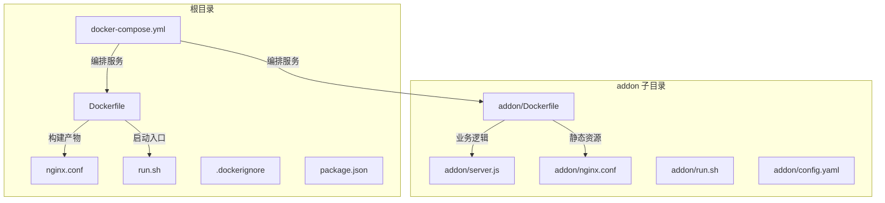
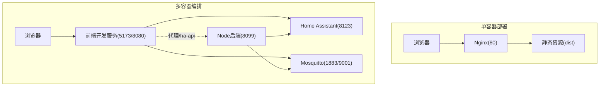
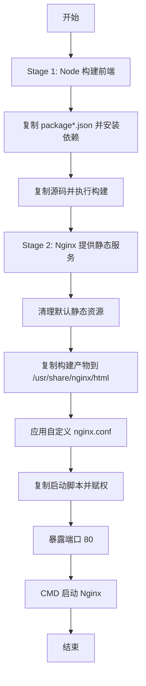
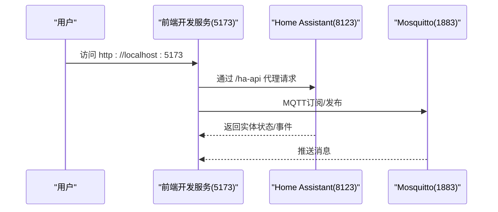
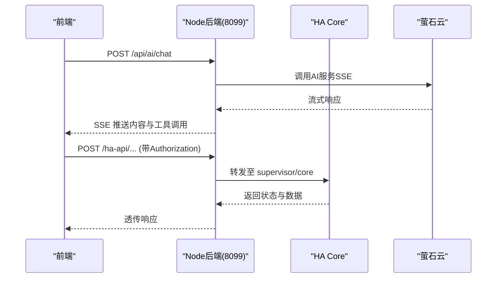
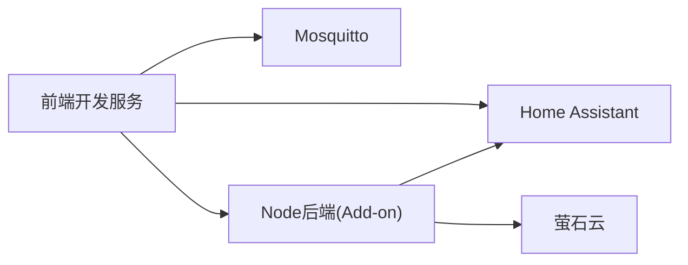

# 容器化部署

<cite>
**本文引用的文件**
- [Dockerfile](file://Dockerfile)
- [docker-compose.yml](file://docker-compose.yml)
- [.dockerignore](file://.dockerignore)
- [nginx.conf](file://nginx.conf)
- [run.sh](file://run.sh)
- [package.json](file://package.json)
- [addon/Dockerfile](file://addon/Dockerfile)
- [addon/server.js](file://addon/server.js)
- [addon/nginx.conf](file://addon/nginx.conf)
- [addon/run.sh](file://addon/run.sh)
- [addon/config.yaml](file://addon/config.yaml)
- [mosquitto/config/mosquitto.conf](file://mosquitto/config/mosquitto.conf)
</cite>

## 目录
1. [简介](#简介)
2. [项目结构](#项目结构)
3. [核心组件](#核心组件)
4. [架构总览](#架构总览)
5. [详细组件分析](#详细组件分析)
6. [依赖关系分析](#依赖关系分析)
7. [性能考量](#性能考量)
8. [故障排查指南](#故障排查指南)
9. [结论](#结论)
10. [附录](#附录)

## 简介
本技术文档面向HAUI项目的容器化部署，系统性阐述两种部署模式：单容器部署与多容器编排，并围绕以下主题展开：
- 单容器部署：基于多阶段构建的Nginx静态站点镜像，结合启动脚本与安全加固配置。
- 多容器编排：通过docker-compose编排Home Assistant、Mosquitto与前端开发服务，实现前后端协同与MQTT通信。
- 镜像优化与安全：最小基础镜像、分层缓存、Gzip压缩、安全头部与只读挂载。
- 编排细节：网络、数据卷、环境变量、依赖顺序与端口映射。
- 运行最佳实践：资源限制、健康检查、日志与调试。

## 项目结构
HAUI的容器化相关文件主要分布在根目录与addon子目录：
- 根镜像与编排：Dockerfile、docker-compose.yml、nginx.conf、run.sh、.dockerignore、package.json
- HA Add-on镜像：addon/Dockerfile、addon/server.js、addon/nginx.conf、addon/run.sh、addon/config.yaml

图表来源
- [Dockerfile:1-37](file://Dockerfile#L1-L37)
- [docker-compose.yml:1-42](file://docker-compose.yml#L1-L42)
- [addon/Dockerfile:1-17](file://addon/Dockerfile#L1-L17)

章节来源
- [Dockerfile:1-37](file://Dockerfile#L1-L37)
- [docker-compose.yml:1-42](file://docker-compose.yml#L1-L42)
- [.dockerignore:1-13](file://.dockerignore#L1-L13)
- [package.json:1-132](file://package.json#L1-L132)

## 核心组件
- 单容器镜像（根Dockerfile）
  - 多阶段构建：Node构建前端产物，Nginx提供静态服务。
  - 启动脚本：统一入口，便于后续注入配置。
  - 安全与性能：Gzip压缩、安全头部、缓存策略。
- 多容器编排（docker-compose.yml）
  - Home Assistant：官方镜像，持久化配置与组件。
  - Mosquitto：MQTT代理，持久化数据与日志。
  - 前端开发服务：Node开发服务器，热更新与端口映射。
- HA Add-on镜像（addon子目录）
  - Node生产镜像，Express后端提供API代理与静态资源。
  - Supervisor集成：配置文件、Ingress与架构适配。

章节来源
- [Dockerfile:1-37](file://Dockerfile#L1-L37)
- [docker-compose.yml:1-42](file://docker-compose.yml#L1-L42)
- [addon/Dockerfile:1-17](file://addon/Dockerfile#L1-L17)
- [addon/server.js:1-521](file://addon/server.js#L1-L521)

## 架构总览
下图展示两种部署模式的总体架构与交互：

图表来源
- [Dockerfile:16-37](file://Dockerfile#L16-L37)
- [docker-compose.yml:3-42](file://docker-compose.yml#L3-L42)
- [addon/server.js:48-94](file://addon/server.js#L48-L94)

## 详细组件分析

### 单容器镜像（多阶段构建与Nginx服务）
- 构建阶段（builder）
  - 基础镜像：node:20-alpine
  - 工作目录：/app
  - 依赖安装：复制package*.json后执行安装
  - 源码复制与构建：复制项目源码并执行构建脚本
- 服务阶段（nginx）
  - 基础镜像：nginx:alpine
  - 清理默认静态资源，复制构建产物至/usr/share/nginx/html
  - 应用自定义Nginx配置与启动脚本
  - 暴露端口80，CMD启动Nginx

图表来源
- [Dockerfile:1-37](file://Dockerfile#L1-L37)

章节来源
- [Dockerfile:1-37](file://Dockerfile#L1-L37)
- [nginx.conf:1-37](file://nginx.conf#L1-L37)
- [run.sh:1-11](file://run.sh#L1-L11)

### 多容器编排（docker-compose.yml）
- 服务定义
  - homeassistant：官方镜像，映射8123端口；挂载配置目录、组件目录与本地时间；重启策略unless-stopped
  - mosquitto：eclipse-mosquitto镜像，映射1883/9001端口；挂载配置、数据与日志目录
  - haui-frontend：node:20-alpine开发服务，工作目录/app；挂载源码；映射5173/8080端口；命令执行npm install与npm run dev -- --host；设置TZ与VITE_HA_URL环境变量；依赖homeassistant
- 网络与端口
  - Home Assistant: 8123
  - Mosquitto: 1883/9001
  - 前端开发: 5173/8080
- 数据卷
  - Home Assistant: config、custom_components、/etc/localtime
  - Mosquitto: config、data、log
- 环境变量
  - TZ=Asia/Shanghai
  - VITE_HA_URL=http://homeassistant:8123

图表来源
- [docker-compose.yml:27-42](file://docker-compose.yml#L27-L42)
- [addon/server.js:48-94](file://addon/server.js#L48-L94)

章节来源
- [docker-compose.yml:1-42](file://docker-compose.yml#L1-L42)

### HA Add-on镜像（Node + Express + Nginx）
- 镜像构建
  - 基础镜像：node:20-alpine
  - 环境：NODE_ENV=production
  - 依赖安装：仅生产依赖
  - 暴露端口：8099
  - CMD：node server.js
- 后端能力
  - /ha-api 代理：将前端REST请求转发至HA Core API，支持Authorization与SUPERVISOR_TOKEN
  - /api/storage：读写持久化配置文件（/data或本地）
  - /api/ezviz/url：萤石云直播地址代理，隐藏AppKey/AppSecret
  - /api/ezviz/token：获取AccessToken
  - /api/camera/ptz：ONVIF PTZ控制代理
  - /api/health：健康检查
  - /api/ai/config：AI配置读写
  - /api/ai/chat：AI对话与工具调用（SSE流式输出）
  - 静态资源：/dist目录，支持缓存与回退到index.html
- Nginx配置
  - Gzip压缩、安全头部、静态资源缓存策略
- 启动脚本
  - Supervisor兼容入口，启动Nginx

图表来源
- [addon/server.js:422-503](file://addon/server.js#L422-L503)
- [addon/server.js:48-94](file://addon/server.js#L48-L94)

章节来源
- [addon/Dockerfile:1-17](file://addon/Dockerfile#L1-L17)
- [addon/server.js:1-521](file://addon/server.js#L1-L521)
- [addon/nginx.conf:1-26](file://addon/nginx.conf#L1-L26)
- [addon/run.sh:1-10](file://addon/run.sh#L1-L10)
- [addon/config.yaml:1-37](file://addon/config.yaml#L1-L37)

### Mosquitto配置
- 持久化：启用持久化并将数据目录指向/mosquitto/data
- 日志：日志文件输出到/mosquitto/log/mosquitto.log
- 监听：监听1883端口
- 匿名访问：允许匿名连接

章节来源
- [mosquitto/config/mosquitto.conf:1-6](file://mosquitto/config/mosquitto.conf#L1-L6)

## 依赖关系分析
- 组件耦合
  - 前端开发服务依赖Home Assistant与Mosquitto，通过环境变量与代理接口进行通信
  - Add-on后端作为中间层，集中处理HA与第三方服务的代理与安全控制
- 外部依赖
  - Home Assistant官方镜像
  - eclipse-mosquitto镜像
  - Node与Nginx官方镜像
- 可能的循环依赖
  - docker-compose中通过depends_on声明依赖顺序，避免前端在HA未就绪时发起请求

图表来源
- [docker-compose.yml:3-42](file://docker-compose.yml#L3-L42)
- [addon/server.js:48-94](file://addon/server.js#L48-L94)

章节来源
- [docker-compose.yml:1-42](file://docker-compose.yml#L1-L42)

## 性能考量
- 镜像体积与层数
  - 使用alpine基础镜像减少体积
  - 多阶段构建分离构建与运行时环境
  - 生产镜像仅安装必要依赖
- 构建缓存
  - 优先复制package*.json以利用层缓存
  - 分离依赖安装与源码复制步骤
- 静态资源优化
  - Nginx启用Gzip压缩与缓存策略
  - 静态资源长期缓存与版本化建议（当前未见哈希后缀）
- 网络与I/O
  - 持久化数据卷分离配置、数据与日志
  - 只读挂载/etc/localtime避免不必要的写操作

章节来源
- [Dockerfile:1-37](file://Dockerfile#L1-L37)
- [addon/Dockerfile:1-17](file://addon/Dockerfile#L1-L17)
- [nginx.conf:7-27](file://nginx.conf#L7-L27)
- [addon/nginx.conf:8-24](file://addon/nginx.conf#L8-L24)

## 故障排查指南
- 容器无法启动
  - 检查启动脚本权限与入口命令
  - 查看Nginx错误日志与容器标准输出
- 端口冲突
  - 确认宿主机端口占用情况（8123、1883、9001、5173、8080）
- 代理失败
  - Add-on后端的/ha-api代理需正确传递Authorization头
  - 确认HA Core可达性与SUPERVISOR_TOKEN配置
- MQTT连接问题
  - 检查Mosquitto配置与数据卷挂载
  - 确认防火墙与端口映射
- 日志管理
  - Home Assistant：查看/config/configuration.yaml与日志
  - Mosquitto：查看/mosquitto/log/mosquitto.log
  - Add-on：查看Nginx与Node后端日志输出

章节来源
- [run.sh:1-11](file://run.sh#L1-L11)
- [addon/run.sh:1-10](file://addon/run.sh#L1-L10)
- [addon/server.js:48-94](file://addon/server.js#L48-L94)
- [mosquitto/config/mosquitto.conf:1-6](file://mosquitto/config/mosquitto.conf#L1-L6)

## 结论
HAUI提供了两套容器化方案：单容器用于生产静态站点交付，多容器用于开发与集成测试。通过多阶段构建、Nginx优化与安全加固，结合docker-compose的编排能力，能够快速搭建稳定的开发与运行环境。Add-on镜像进一步将HA集成、MQTT与AI代理整合到单一服务中，便于在Supervisor环境下部署。

## 附录
- 单容器部署要点
  - 使用多阶段构建与alpine基础镜像
  - 启动脚本集中管理，便于扩展配置注入
  - Nginx配置包含Gzip与安全头部
- 多容器编排要点
  - 明确服务间依赖与端口映射
  - 数据卷分离配置、数据与日志
  - 环境变量统一管理（如VITE_HA_URL）
- Add-on部署要点
  - 生产镜像仅含必要依赖
  - Supervisor集成配置与Ingress端口
  - 静态资源与API代理统一由Nginx与Express协作