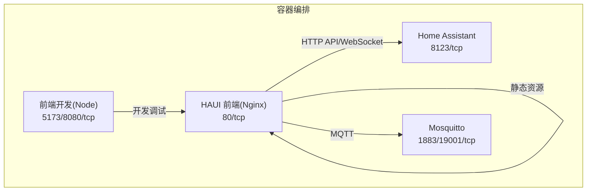
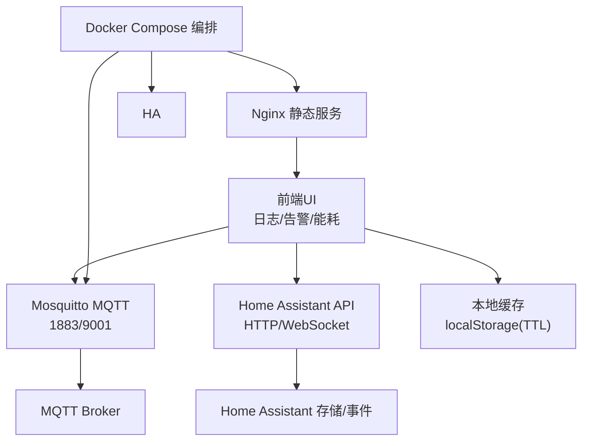
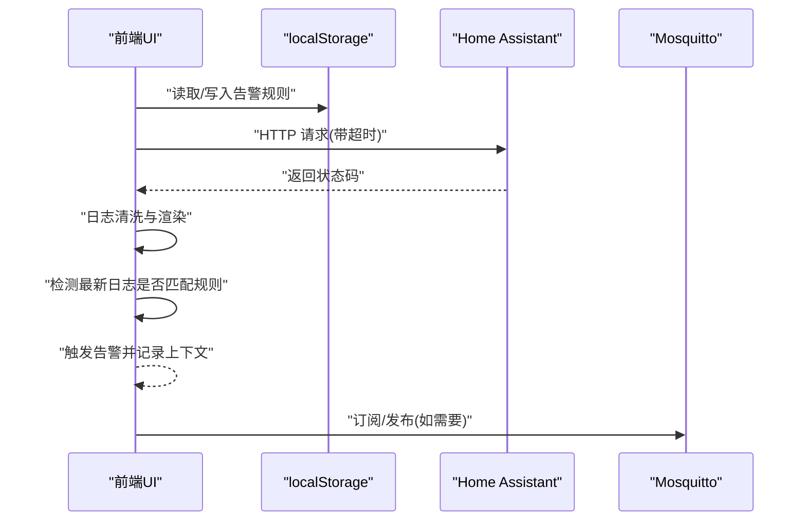
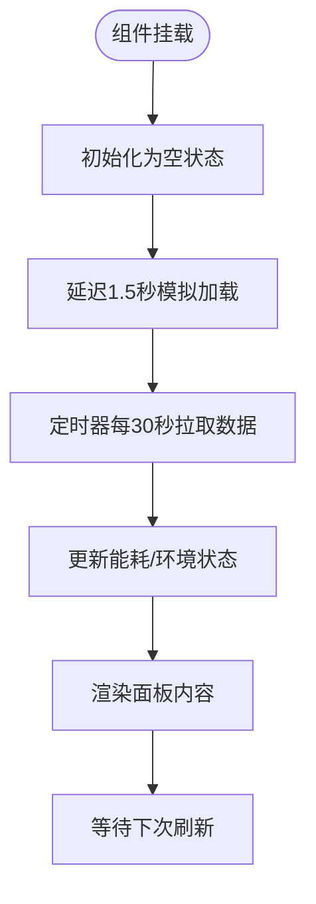
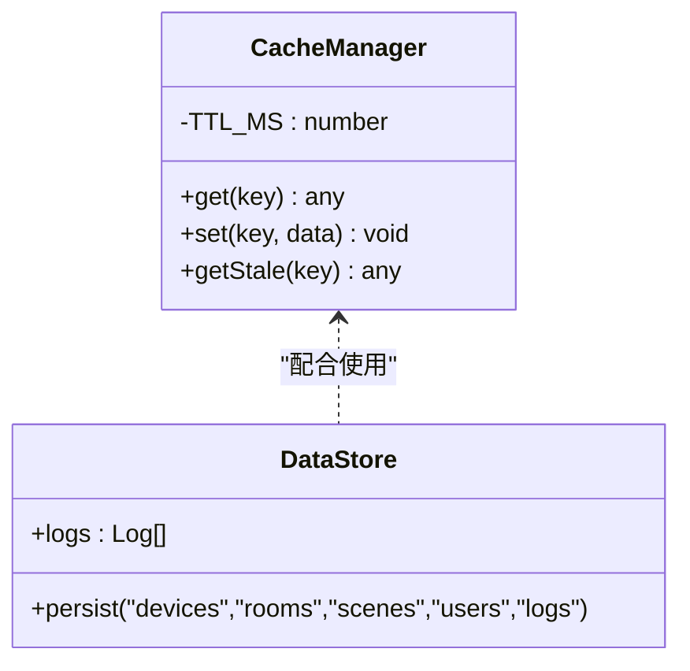
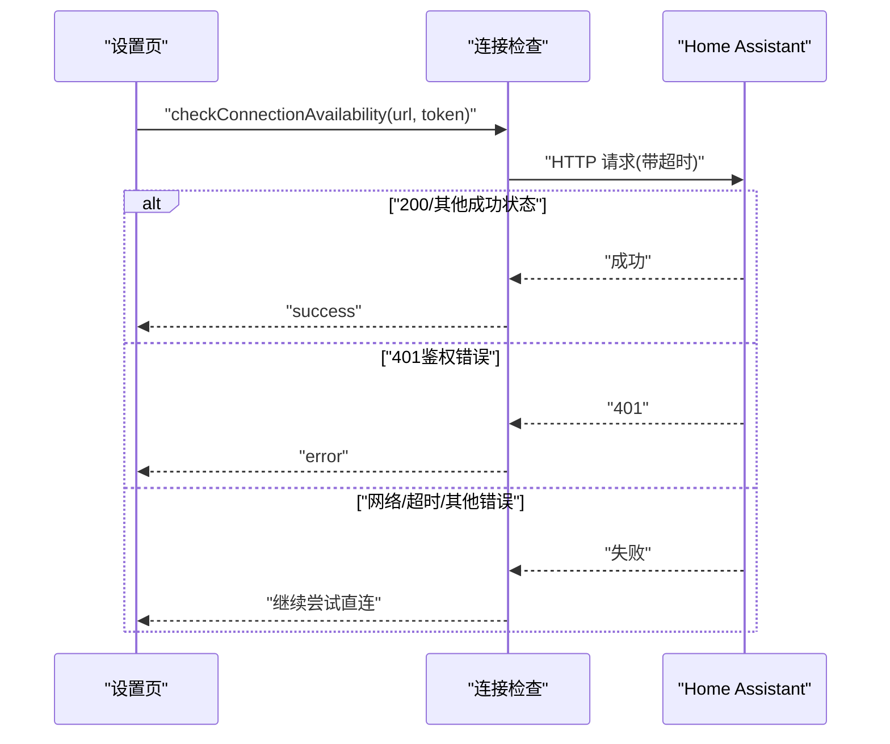
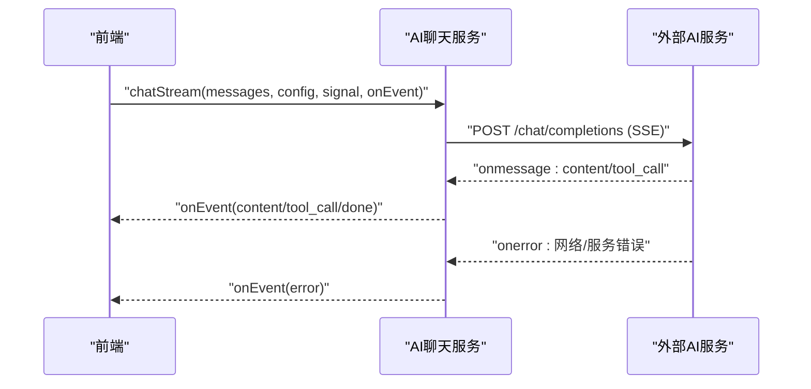
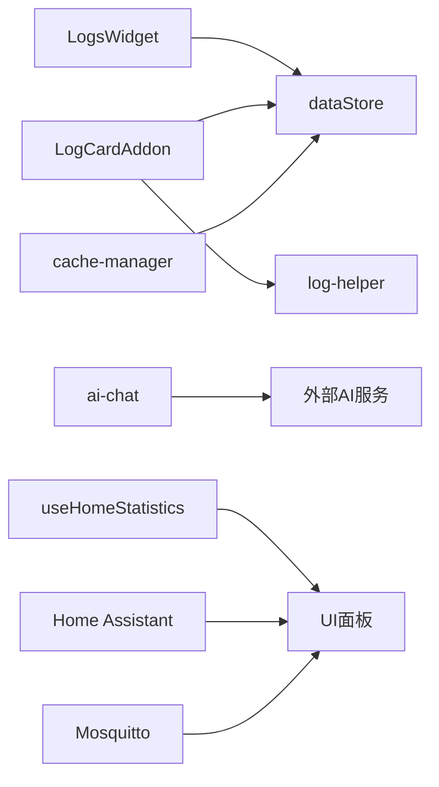

# 生产环境监控

<cite>
**本文引用的文件**
- [Dockerfile](file://Dockerfile)
- [docker-compose.yml](file://docker-compose.yml)
- [run.sh](file://addon/run.sh)
- [configuration.yaml](file://config/configuration.yaml)
- [nginx.conf](file://nginx.conf)
- [LogsWidget.tsx](file://src/app/components/dashboard/widgets/LogsWidget.tsx)
- [LogCardAddon.tsx](file://src/app/components/LogCardAddon.tsx)
- [log-helper.ts](file://src/utils/log-helper.ts)
- [dataStore.ts](file://src/store/dataStore.ts)
- [cache-manager.ts](file://src/utils/cache-manager.ts)
- [useHomeStatistics.ts](file://src/hooks/useHomeStatistics.ts)
- [ai-chat.ts](file://src/services/ai-chat.ts)
- [ha-connection.ts](file://src/utils/ha-connection.ts)
- [SettingsModal.tsx](file://src/app/components/SettingsModal.tsx)
</cite>

## 目录
1. [简介](#简介)
2. [项目结构](#项目结构)
3. [核心组件](#核心组件)
4. [架构总览](#架构总览)
5. [详细组件分析](#详细组件分析)
6. [依赖关系分析](#依赖关系分析)
7. [性能考量](#性能考量)
8. [故障排查指南](#故障排查指南)
9. [结论](#结论)
10. [附录](#附录)

## 简介
本文件面向HAUI项目的生产环境监控，聚焦以下目标：
- 应用性能监控（APM）：覆盖前端性能、后端服务与数据库（Home Assistant/MQTT）的可观测性。
- 日志系统：结构化日志、错误追踪与审计日志管理。
- 健康检查与可用性监控：服务可达性、超时与鉴权校验。
- 告警机制：基于关键词的实时告警与规则持久化。
- 关键性能指标（KPI）：响应时间、吞吐量与错误率的定义与阈值建议。
- 监控仪表板与可视化：日志面板、能耗面板与告警视图。
- 存储策略与合规：本地持久化、缓存过期与日志保留。

## 项目结构
HAUI采用前后端分离与容器化部署：
- 前端构建产物由Nginx提供静态服务，使用多阶段Docker镜像打包。
- 开发与演示使用docker-compose编排Home Assistant、Mosquitto与前端开发服务。
- 插件模式支持在特定运行环境中通过Nginx启动脚本注入配置。

**图表来源**
- [docker-compose.yml:1-42](file://docker-compose.yml#L1-L42)
- [Dockerfile:1-37](file://Dockerfile#L1-L37)

**章节来源**
- [Dockerfile:1-37](file://Dockerfile#L1-L37)
- [docker-compose.yml:1-42](file://docker-compose.yml#L1-L42)
- [configuration.yaml:1-24](file://config/configuration.yaml#L1-L24)

## 核心组件
- 日志采集与展示
  - 实时日志小部件：用于在仪表板中展示最新日志条目，并支持清空与弹窗查看。
  - 日志增强工具：对日志消息进行数值格式化与常用英文词组翻译，提升可读性。
  - 日志告警插件：基于关键词规则的实时告警，支持规则持久化与告警上下文快照。
- 性能与可用性
  - 连接可用性检测：对Home Assistant实例进行可达性检查，带超时控制。
  - 能耗面板：展示今日/当月用电与功率，模拟数据更新周期。
  - 缓存管理：基于localStorage的带TTL缓存，控制本地数据新鲜度。
- 配置与部署
  - Nginx配置：静态资源服务与默认站点配置。
  - 启动脚本：在插件模式下启动Nginx并输出运行日志。
  - Home Assistant配置：允许CORS与加载自定义组件。

**章节来源**
- [LogsWidget.tsx:1-67](file://src/app/components/dashboard/widgets/LogsWidget.tsx#L1-L67)
- [LogCardAddon.tsx:1-271](file://src/app/components/LogCardAddon.tsx#L1-L271)
- [log-helper.ts:1-33](file://src/utils/log-helper.ts#L1-L33)
- [dataStore.ts:58-128](file://src/store/dataStore.ts#L58-L128)
- [cache-manager.ts:1-56](file://src/utils/cache-manager.ts#L1-L56)
- [useHomeStatistics.ts:1-48](file://src/hooks/useHomeStatistics.ts#L1-L48)
- [ha-connection.ts:240-260](file://src/utils/ha-connection.ts#L240-L260)
- [nginx.conf](file://nginx.conf)
- [run.sh:1-9](file://addon/run.sh#L1-L9)
- [configuration.yaml:1-24](file://config/configuration.yaml#L1-L24)

## 架构总览
HAUI生产监控涉及“前端观测—后端服务—消息中间件”的全链路：
- 前端负责日志采集、渲染与告警；通过HTTP与WebSocket访问Home Assistant API。
- Home Assistant提供设备状态、自动化与事件；Mosquitto提供MQTT消息通道。
- Nginx提供静态资源服务与反向代理能力；Docker Compose统一编排。

**图表来源**
- [docker-compose.yml:1-42](file://docker-compose.yml#L1-L42)
- [Dockerfile:1-37](file://Dockerfile#L1-L37)
- [LogsWidget.tsx:1-67](file://src/app/components/dashboard/widgets/LogsWidget.tsx#L1-L67)
- [LogCardAddon.tsx:1-271](file://src/app/components/LogCardAddon.tsx#L1-L271)
- [cache-manager.ts:1-56](file://src/utils/cache-manager.ts#L1-L56)

## 详细组件分析

### 日志系统与告警
- 结构化日志
  - 日志条目包含时间戳与消息字段，前端通过小部件展示最新日志。
  - 日志消息清洗：对数值保留两位小数、常见英文词组本地化，便于中文用户理解。
- 错误追踪
  - 前端通过fetch与SSE处理AI对话流，异常时抛出错误事件，便于定位上游服务问题。
- 审计日志
  - 日志告警规则持久化于localStorage，支持新增、删除与启用/禁用。
  - 触发告警时进入告警视图，展示最近若干条上下文日志，便于回溯。
- 健康检查
  - 对Home Assistant进行可达性检查，带超时控制，区分网络错误与鉴权错误。

**图表来源**
- [LogCardAddon.tsx:1-271](file://src/app/components/LogCardAddon.tsx#L1-L271)
- [log-helper.ts:1-33](file://src/utils/log-helper.ts#L1-L33)
- [LogsWidget.tsx:1-67](file://src/app/components/dashboard/widgets/LogsWidget.tsx#L1-L67)
- [ha-connection.ts:240-260](file://src/utils/ha-connection.ts#L240-L260)

**章节来源**
- [LogsWidget.tsx:1-67](file://src/app/components/dashboard/widgets/LogsWidget.tsx#L1-L67)
- [LogCardAddon.tsx:1-271](file://src/app/components/LogCardAddon.tsx#L1-L271)
- [log-helper.ts:1-33](file://src/utils/log-helper.ts#L1-L33)
- [dataStore.ts:58-128](file://src/store/dataStore.ts#L58-L128)
- [ha-connection.ts:240-260](file://src/utils/ha-connection.ts#L240-L260)

### 能耗与环境面板
- 能耗面板展示今日用电、当月用电与功率，使用占位符数据模拟，定时刷新。
- 环境面板接口定义了温度、湿度、CO2、PM2.5、TVOC、噪声等指标类型，便于后续接入真实数据源。

**图表来源**
- [useHomeStatistics.ts:1-48](file://src/hooks/useHomeStatistics.ts#L1-L48)

**章节来源**
- [useHomeStatistics.ts:1-48](file://src/hooks/useHomeStatistics.ts#L1-L48)

### 缓存与持久化
- 本地缓存
  - TTL为30分钟，过期则丢弃；支持获取过期数据（stale）以满足弱一致性场景。
- 持久化
  - 使用持久化存储选择性保存设备、房间、场景、用户与日志等关键数据，减少重复加载。

**图表来源**
- [cache-manager.ts:1-56](file://src/utils/cache-manager.ts#L1-L56)
- [dataStore.ts:58-128](file://src/store/dataStore.ts#L58-L128)

**章节来源**
- [cache-manager.ts:1-56](file://src/utils/cache-manager.ts#L1-L56)
- [dataStore.ts:58-128](file://src/store/dataStore.ts#L58-L128)

### 健康检查与可用性
- Home Assistant可达性检查
  - 使用AbortController设置短超时，区分网络错误与鉴权错误，避免阻塞UI。
- 设置页集成
  - 在设置页中对代理与直连地址分别进行验证，提升配置诊断效率。

**图表来源**
- [ha-connection.ts:240-260](file://src/utils/ha-connection.ts#L240-L260)
- [SettingsModal.tsx:112-153](file://src/app/components/SettingsModal.tsx#L112-L153)

**章节来源**
- [ha-connection.ts:240-260](file://src/utils/ha-connection.ts#L240-L260)
- [SettingsModal.tsx:112-153](file://src/app/components/SettingsModal.tsx#L112-L153)

### 前端性能与SSE流
- AI聊天流
  - 直接对接外部OpenAI兼容接口，使用SSE流式传输，支持工具调用与错误事件。
  - 异常时抛出错误事件，便于前端统一处理与上报。

**图表来源**
- [ai-chat.ts:1-153](file://src/services/ai-chat.ts#L1-L153)

**章节来源**
- [ai-chat.ts:1-153](file://src/services/ai-chat.ts#L1-L153)

## 依赖关系分析
- 组件耦合
  - 日志小部件与告警插件共享日志数据源；告警规则依赖localStorage持久化。
  - 能耗与环境钩子独立于UI，通过定时器驱动更新。
  - 缓存管理与数据存储相互补充，前者解决短期新鲜度，后者解决跨会话持久化。
- 外部依赖
  - Home Assistant API与Mosquitto为关键外部服务，前端通过HTTP与WebSocket访问。
  - Nginx提供静态资源服务，Docker Compose统一编排。

**图表来源**
- [LogsWidget.tsx:1-67](file://src/app/components/dashboard/widgets/LogsWidget.tsx#L1-L67)
- [LogCardAddon.tsx:1-271](file://src/app/components/LogCardAddon.tsx#L1-L271)
- [log-helper.ts:1-33](file://src/utils/log-helper.ts#L1-L33)
- [dataStore.ts:58-128](file://src/store/dataStore.ts#L58-L128)
- [cache-manager.ts:1-56](file://src/utils/cache-manager.ts#L1-L56)
- [useHomeStatistics.ts:1-48](file://src/hooks/useHomeStatistics.ts#L1-L48)
- [ai-chat.ts:1-153](file://src/services/ai-chat.ts#L1-L153)

**章节来源**
- [LogsWidget.tsx:1-67](file://src/app/components/dashboard/widgets/LogsWidget.tsx#L1-L67)
- [LogCardAddon.tsx:1-271](file://src/app/components/LogCardAddon.tsx#L1-L271)
- [log-helper.ts:1-33](file://src/utils/log-helper.ts#L1-L33)
- [dataStore.ts:58-128](file://src/store/dataStore.ts#L58-L128)
- [cache-manager.ts:1-56](file://src/utils/cache-manager.ts#L1-L56)
- [useHomeStatistics.ts:1-48](file://src/hooks/useHomeStatistics.ts#L1-L48)
- [ai-chat.ts:1-153](file://src/services/ai-chat.ts#L1-L153)

## 性能考量
- 前端性能
  - 日志渲染采用虚拟滚动与按需高亮，避免大量DOM节点导致卡顿。
  - 告警检测仅针对最新日志，降低复杂度；规则持久化使用localStorage，避免频繁网络请求。
- 后端与数据库
  - Home Assistant作为核心数据源，建议开启本地缓存与合理的轮询间隔，避免频繁查询。
  - MQTT消息应按主题分区与限流，防止风暴。
- 缓存策略
  - TTL为30分钟，适合短期新鲜度需求；对于关键指标可考虑“过期即弃”策略，确保数据一致性。
- 可用性
  - 连接检查设置合理超时，区分网络错误与鉴权错误，提升诊断效率。

[本节为通用指导，无需列出具体文件来源]

## 故障排查指南
- 日志无法显示或告警不触发
  - 检查日志小部件是否正确接收日志数据；确认告警规则已启用且关键词匹配。
  - 查看localStorage中的规则是否存在；必要时清理并重新配置。
- Home Assistant不可达
  - 使用设置页的连接检查功能，确认代理与直连地址均可访问。
  - 检查鉴权头是否正确传递；关注超时与网络错误提示。
- 前端SSE异常
  - 关注错误事件回调，定位上游服务问题；检查外部AI服务的URL与API Key配置。
- 能耗/环境面板空白
  - 确认定时器是否正常执行；检查useHomeStatistics钩子的数据更新逻辑。

**章节来源**
- [LogCardAddon.tsx:1-271](file://src/app/components/LogCardAddon.tsx#L1-L271)
- [LogsWidget.tsx:1-67](file://src/app/components/dashboard/widgets/LogsWidget.tsx#L1-L67)
- [SettingsModal.tsx:112-153](file://src/app/components/SettingsModal.tsx#L112-L153)
- [ha-connection.ts:240-260](file://src/utils/ha-connection.ts#L240-L260)
- [ai-chat.ts:1-153](file://src/services/ai-chat.ts#L1-L153)
- [useHomeStatistics.ts:1-48](file://src/hooks/useHomeStatistics.ts#L1-L48)

## 结论
HAUI的生产监控以“前端可观测+后端服务健康+消息通道稳定”为核心，结合本地缓存与持久化策略，形成闭环的监控与告警体系。建议在现有基础上扩展：
- 增加统一的日志采集与上报通道，支持结构化日志与错误追踪。
- 引入APM工具（如浏览器性能API与后端指标采集），完善KPI定义与阈值。
- 建立监控仪表板与告警规则中心，实现可视化与自动化处置。

[本节为总结性内容，无需列出具体文件来源]

## 附录

### 监控仪表板与可视化
- 日志面板
  - 提供实时日志展示、清空与弹窗查看，适合作为监控入口。
- 能耗面板
  - 展示今日/当月用电与功率，建议接入真实数据源后增加趋势图。
- 告警视图
  - 触发告警后进入告警模式，展示最近若干条上下文日志，便于快速定位。

**章节来源**
- [LogsWidget.tsx:1-67](file://src/app/components/dashboard/widgets/LogsWidget.tsx#L1-L67)
- [LogCardAddon.tsx:226-244](file://src/app/components/LogCardAddon.tsx#L226-L244)

### KPI定义与阈值建议
- 响应时间
  - 前端页面首屏与交互响应：建议阈值为首次内容绘制<3s、交互响应<1s。
  - Home Assistant API：建议95分位<2s，99分位<5s。
- 吞吐量
  - 日志刷新频率：建议每30s一次，避免过度刷新影响性能。
  - SSE流：确保每秒消息数稳定，异常时触发告警。
- 错误率
  - 前端SSE错误率：建议<1%/天；HTTP鉴权错误率<0.1%/天。
  - 日志告警触发率：根据业务设定阈值，避免误报与漏报。

[本节为通用指导，无需列出具体文件来源]

### 存储策略、保留周期与合规
- 本地存储
  - 告警规则与日志：使用localStorage持久化，建议定期清理过期规则与历史日志。
  - 缓存：TTL为30分钟，过期即弃，避免长期占用空间。
- 日志保留
  - 建议按7-14天保留，超出周期自动清理，满足合规与性能平衡。
- 合规要求
  - 如涉及个人数据，遵循最小化原则与数据主体权利；日志中避免记录敏感信息。

[本节为通用指导，无需列出具体文件来源]