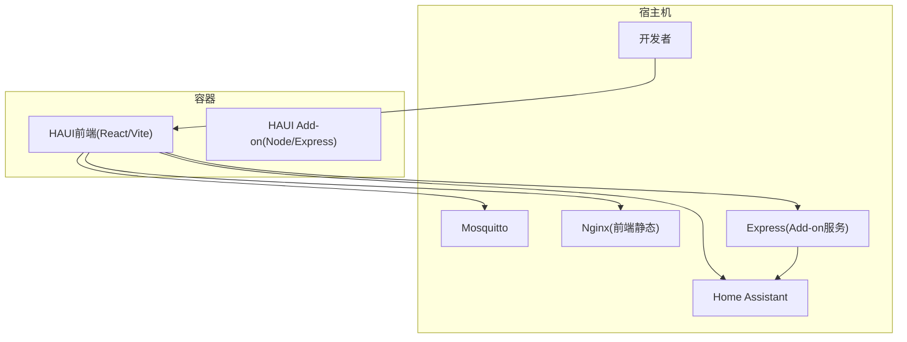
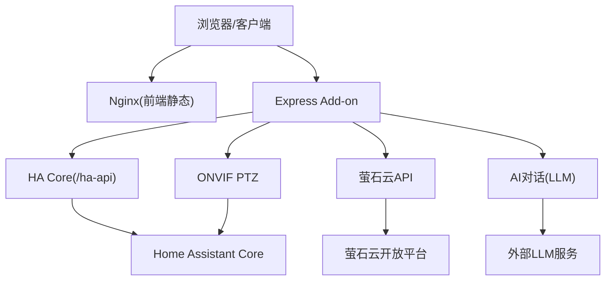
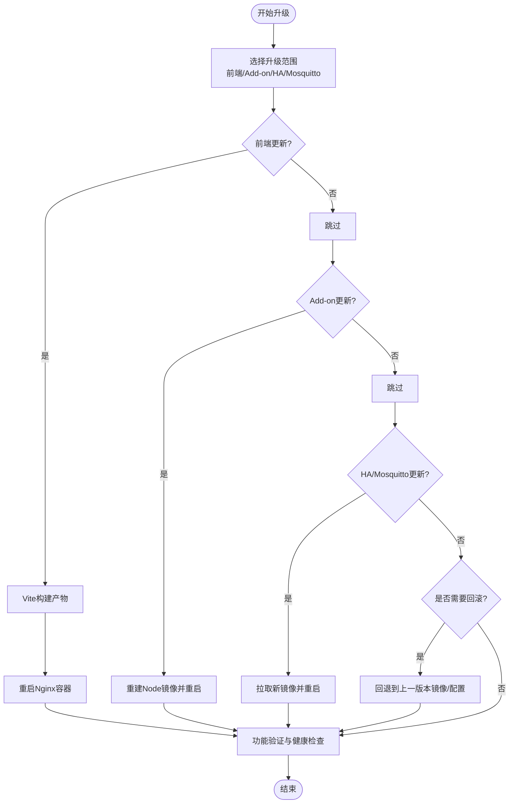
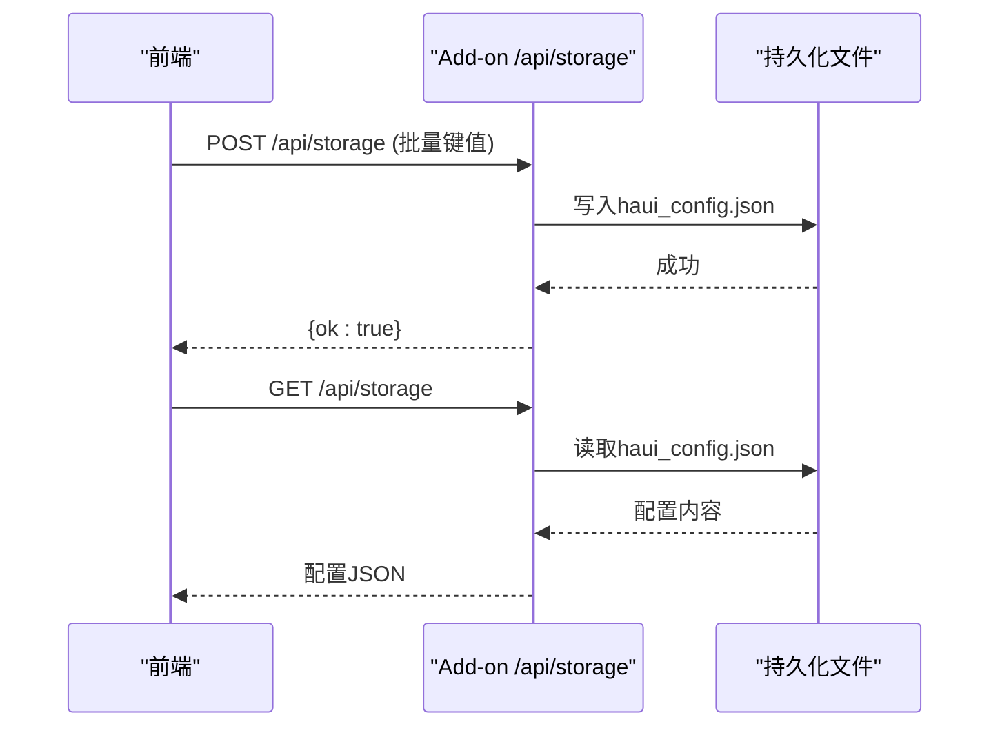
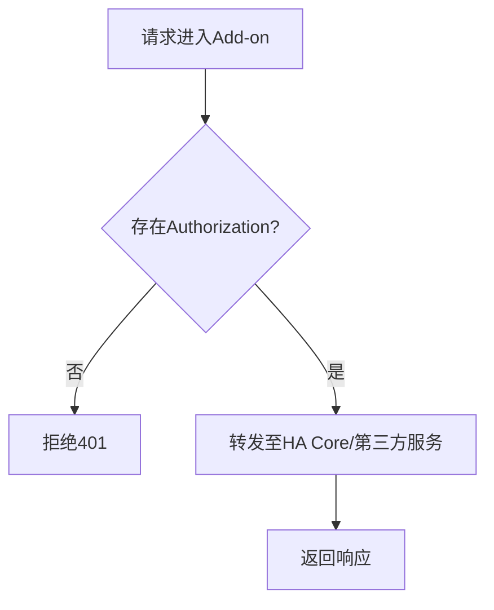
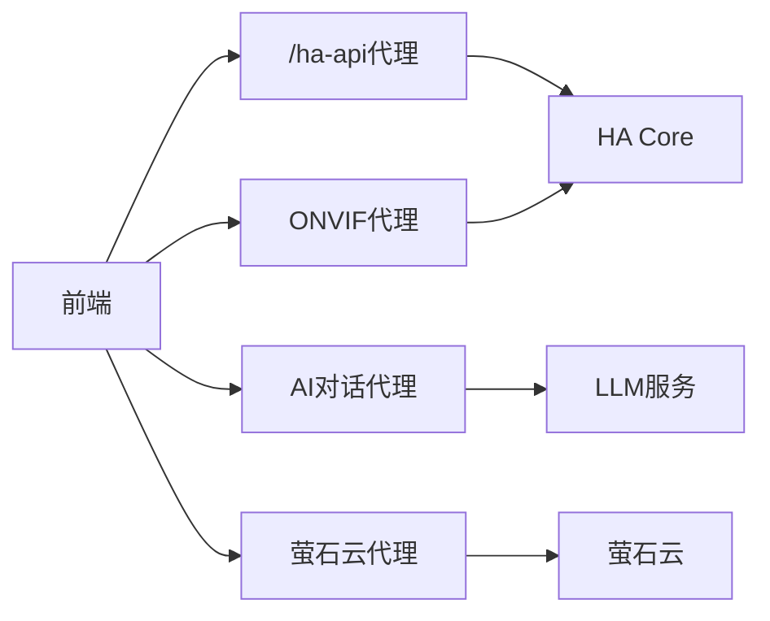

# 维护运维

<cite>
**本文引用的文件**
- [README.md](file://README.md)
- [package.json](file://package.json)
- [Dockerfile](file://Dockerfile)
- [docker-compose.yml](file://docker-compose.yml)
- [run.sh](file://run.sh)
- [nginx.conf](file://nginx.conf)
- [config/configuration.yaml](file://config/configuration.yaml)
- [addon/config.yaml](file://addon/config.yaml)
- [addon/Dockerfile](file://addon/Dockerfile)
- [addon/run.sh](file://addon/run.sh)
- [addon/server.js](file://addon/server.js)
- [repository.yaml](file://repository.yaml)
- [skills/install-superpowers-codex/agents/openai.yaml](file://skills/install-superpowers-codex/agents/openai.yaml)
- [scripts/generate-mdi-meta.js](file://scripts/generate-mdi-meta.js)
- [src/main.tsx](file://src/main.tsx)
- [src/utils/sync.ts](file://src/utils/sync.ts)
- [src/app/components/settings/CameraManagementTab.tsx](file://src/app/components/settings/CameraManagementTab.tsx)
</cite>

## 目录
1. [简介](#简介)
2. [项目结构](#项目结构)
3. [核心组件](#核心组件)
4. [架构总览](#架构总览)
5. [详细组件分析](#详细组件分析)
6. [依赖关系分析](#依赖关系分析)
7. [性能考虑](#性能考虑)
8. [故障排查指南](#故障排查指南)
9. [结论](#结论)
10. [附录](#附录)

## 简介
本指南面向HAUI项目的日常维护与运维，围绕系统更新与升级、依赖包管理、配置迁移与回滚、备份与恢复、安全维护、性能调优、故障诊断与应急响应等方面，提供可操作的步骤与最佳实践。文档结合项目实际代码与配置文件，确保内容可追溯、可落地。

## 项目结构
HAUI是一个由前端React应用、Nginx静态服务、Home Assistant与Mosquitto容器组成的全栈系统，支持通过Docker与Home Assistant Add-on两种方式部署。关键结构如下：
- 前端构建与发布：Vite打包，Nginx提供静态资源服务
- 运行时服务：Express提供API代理、AI对话、萤石云与ONVIF代理、健康检查
- 配置与持久化：Home Assistant配置、Add-on持久化目录、前端本地存储同步
- 开发与测试：Docker Compose一键启动，Cypress端到端测试

图表来源
- [docker-compose.yml:1-42](file://docker-compose.yml#L1-L42)
- [Dockerfile:1-37](file://Dockerfile#L1-L37)
- [addon/Dockerfile:1-17](file://addon/Dockerfile#L1-L17)
- [nginx.conf:1-37](file://nginx.conf#L1-L37)
- [addon/server.js:1-521](file://addon/server.js#L1-L521)

章节来源
- [README.md:13-35](file://README.md#L13-L35)
- [docker-compose.yml:1-42](file://docker-compose.yml#L1-L42)
- [Dockerfile:1-37](file://Dockerfile#L1-L37)
- [addon/Dockerfile:1-17](file://addon/Dockerfile#L1-L17)
- [nginx.conf:1-37](file://nginx.conf#L1-L37)
- [addon/server.js:1-521](file://addon/server.js#L1-L521)

## 核心组件
- 前端静态服务（Nginx）：提供gzip压缩、安全头部、静态资源缓存与SPA回退
- Add-on服务（Express）：提供配置持久化API、HA代理、萤石云与ONVIF代理、AI对话接口
- Home Assistant：核心智能中枢，提供实体状态与服务调用
- Mosquitto：MQTT消息代理，支持摄像头与设备通信
- 开发环境（Vite）：热重载开发体验，映射HA与Mosquitto端口

章节来源
- [nginx.conf:1-37](file://nginx.conf#L1-L37)
- [addon/server.js:96-121](file://addon/server.js#L96-L121)
- [addon/server.js:48-94](file://addon/server.js#L48-L94)
- [addon/server.js:122-227](file://addon/server.js#L122-L227)
- [addon/server.js:288-291](file://addon/server.js#L288-L291)
- [docker-compose.yml:4-42](file://docker-compose.yml#L4-L42)

## 架构总览
HAUI的运维架构由“容器层”和“服务层”组成。容器层负责运行前端静态与Add-on服务；服务层负责与HA核心、MQTT、第三方AI服务交互，并提供统一的API代理与配置持久化能力。

图表来源
- [addon/server.js:48-94](file://addon/server.js#L48-L94)
- [addon/server.js:122-227](file://addon/server.js#L122-L227)
- [addon/server.js:315-503](file://addon/server.js#L315-L503)
- [docker-compose.yml:4-42](file://docker-compose.yml#L4-L42)

## 详细组件分析

### 1) 系统更新与升级流程
- 前端更新
  - 通过Vite构建并由Nginx提供静态资源。升级时重新构建并重启Nginx容器即可生效。
  - 若使用Add-on模式，需重新构建Node镜像并重启容器。
- Add-on服务升级
  - 更新AI模型、API密钥、萤石云参数等，通过Add-on配置界面或持久化配置文件进行变更。
  - 升级后验证健康检查端点与各代理接口可用性。
- HA核心与Mosquitto升级
  - 通过docker-compose指定新镜像版本，重启对应服务。
- 回滚策略
  - 前端：回退到上一版本的Nginx镜像或静态资源。
  - Add-on：回退到上一版本镜像；若配置变更导致异常，删除持久化配置文件后重启服务以恢复默认。
  - HA/Mosquitto：回退到上一稳定版本镜像。

章节来源
- [Dockerfile:1-37](file://Dockerfile#L1-L37)
- [addon/Dockerfile:1-17](file://addon/Dockerfile#L1-L17)
- [docker-compose.yml:1-42](file://docker-compose.yml#L1-L42)
- [addon/server.js:288-291](file://addon/server.js#L288-L291)

### 2) 依赖包管理与版本控制
- 前端依赖与脚本定义在package.json中，建议使用锁定文件进行版本固化。
- Add-on生产环境仅安装必要依赖，减少攻击面。
- 建议定期扫描依赖漏洞并更新至安全版本。

章节来源
- [package.json:1-132](file://package.json#L1-L132)
- [addon/Dockerfile:8-9](file://addon/Dockerfile#L8-L9)

### 3) 配置迁移与回滚
- Add-on持久化配置
  - 配置文件位于/data/haui_config.json（Add-on）或本地.data/haui_config.json（开发），AI配置位于/data/haui_ai_config.json或本地同路径。
  - 迁移时备份上述文件，变更前保留快照，异常时恢复。
- 前端本地存储同步
  - 前端通过同步逻辑将localStorage键值对上传至服务端，支持跨设备配置同步与回滚。
- HA配置迁移
  - 通过config目录挂载实现持久化，迁移时备份config目录。

图表来源
- [addon/server.js:96-121](file://addon/server.js#L96-L121)
- [src/utils/sync.ts:52-88](file://src/utils/sync.ts#L52-L88)
- [src/main.tsx:31-61](file://src/main.tsx#L31-L61)

章节来源
- [addon/server.js:19-33](file://addon/server.js#L19-L33)
- [addon/server.js:96-121](file://addon/server.js#L96-L121)
- [src/utils/sync.ts:45-88](file://src/utils/sync.ts#L45-L88)
- [src/main.tsx:31-61](file://src/main.tsx#L31-L61)
- [config/configuration.yaml:1-24](file://config/configuration.yaml#L1-L24)

### 4) 备份与恢复机制
- 数据库与配置
  - HA配置目录（config）与Add-on持久化目录（/data）为关键备份对象。
  - 建议定期归档config与/data目录，包含haui_config.json与haui_ai_config.json。
- 增量备份策略
  - 以天为粒度生成差异快照，保留最近7-30天的增量备份。
  - 对大体量配置（如摄像头布局、AI模型参数）单独归档。
- 恢复流程
  - 停止相关容器，恢复备份文件，重启容器并验证服务。

章节来源
- [docker-compose.yml:7-10](file://docker-compose.yml#L7-L10)
- [addon/server.js:9-26](file://addon/server.js#L9-L26)

### 5) 安全维护操作
- 漏洞扫描与补丁管理
  - 使用镜像扫描工具对Nginx与Node镜像进行漏洞扫描，按需更新基础镜像版本。
  - 前端依赖定期更新，修复高危漏洞。
- 访问控制与鉴权
  - Add-on代理严格校验Authorization头，缺失时拒绝请求。
  - HA侧启用CORS白名单与登录阈值限制。
- 配置安全
  - 萤石云参数通过后端读取，避免前端泄露。
  - 建议使用长期访问令牌并通过HTTPS传输。

图表来源
- [addon/server.js:235-241](file://addon/server.js#L235-L241)
- [config/configuration.yaml:5-11](file://config/configuration.yaml#L5-L11)

章节来源
- [addon/server.js:235-241](file://addon/server.js#L235-L241)
- [config/configuration.yaml:5-11](file://config/configuration.yaml#L5-L11)
- [src/app/components/settings/CameraManagementTab.tsx:113-125](file://src/app/components/settings/CameraManagementTab.tsx#L113-L125)

### 6) 性能调优
- 前端性能
  - 使用Vite构建，Nginx开启gzip与静态资源缓存，提升首屏与资源加载速度。
  - 前端本地存储同步具备重试与超时控制，避免阻塞启动。
- Add-on性能
  - 限制请求体大小以适配摄像头配置与布局信息。
  - SSE流式响应AI对话，降低前端等待时间。
- 存储空间清理
  - 定期清理Nginx与Add-on日志，回收/data目录中不再使用的临时文件。

章节来源
- [nginx.conf:7-27](file://nginx.conf#L7-L27)
- [src/main.tsx:31-61](file://src/main.tsx#L31-L61)
- [addon/server.js:45-46](file://addon/server.js#L45-L46)
- [addon/server.js:469-492](file://addon/server.js#L469-L492)

### 7) 故障诊断工具与方法
- 日志分析
  - Add-on服务输出标准错误日志，定位代理失败与AI调用异常。
  - Nginx提供访问与错误日志，结合请求路径定位问题。
- 网络诊断
  - 使用curl或浏览器开发者工具检查/ha-api代理连通性与鉴权头。
  - 检查HA与Mosquitto容器端口映射与防火墙规则。
- 性能分析
  - 使用浏览器性能面板观察前端渲染与事件流。
  - 对比不同模型与缓存策略对响应时间的影响。

章节来源
- [addon/server.js:90-94](file://addon/server.js#L90-L94)
- [addon/server.js:494-503](file://addon/server.js#L494-L503)
- [docker-compose.yml:12-25](file://docker-compose.yml#L12-L25)

### 8) 运维脚本与自动化任务
- 前端资源生成脚本
  - 通过脚本抓取Material Design图标元数据并写入本地，便于离线构建与一致性校验。
- 自动化构建与发布
  - 结合CI/CD流水线，自动执行构建、测试与镜像推送。
- 健康检查
  - Add-on提供/health端点，用于HA Ingress心跳探测与容器编排健康判断。

章节来源
- [scripts/generate-mdi-meta.js:1-45](file://scripts/generate-mdi-meta.js#L1-L45)
- [addon/server.js:288-291](file://addon/server.js#L288-L291)

### 9) 应急响应流程
- 立即隔离
  - 停止异常容器，阻断对外服务。
- 快速回滚
  - 恢复上一版本镜像与配置文件，验证服务可用性。
- 根因分析
  - 查看Add-on与Nginx日志，定位失败请求与错误堆栈。
- 修复与验证
  - 修复配置或依赖后，执行端到端测试与健康检查。
- 复盘与改进
  - 补充监控告警与自动化巡检，完善变更评审流程。

章节来源
- [addon/server.js:90-94](file://addon/server.js#L90-L94)
- [addon/server.js:494-503](file://addon/server.js#L494-L503)

## 依赖关系分析
- 组件耦合
  - 前端通过/ha-api代理访问HA Core，耦合度低但依赖网络连通性。
  - Add-on服务集中管理AI与第三方API，作为统一入口降低前端复杂度。
- 外部依赖
  - HA Core、Mosquitto、第三方AI服务与萤石云开放平台。
- 循环依赖
  - 未发现直接循环依赖，建议持续关注新增模块的导入关系。

图表来源
- [addon/server.js:48-94](file://addon/server.js#L48-L94)
- [addon/server.js:315-503](file://addon/server.js#L315-L503)
- [addon/server.js:122-227](file://addon/server.js#L122-L227)

章节来源
- [addon/server.js:48-94](file://addon/server.js#L48-L94)
- [addon/server.js:122-227](file://addon/server.js#L122-L227)
- [addon/server.js:315-503](file://addon/server.js#L315-L503)

## 性能考虑
- 前端
  - 使用Vite热重载与Nginx缓存，减少重复下载。
  - 前端同步具备超时与重试，避免启动阻塞。
- Add-on
  - SSE流式响应与工具调用批处理，降低前端等待与解析成本。
- 存储
  - 清理日志与临时文件，释放/data与容器磁盘空间。

章节来源
- [nginx.conf:7-27](file://nginx.conf#L7-L27)
- [src/main.tsx:31-61](file://src/main.tsx#L31-L61)
- [addon/server.js:469-492](file://addon/server.js#L469-L492)

## 故障排查指南
- 常见问题
  - 代理失败：检查Authorization头与HA Core可达性。
  - AI对话异常：确认AI配置与API密钥、模型参数正确。
  - 萤石云无法播放：核对AppKey/AppSecret与设备序列号。
- 排查步骤
  - 查看Add-on日志与错误响应。
  - 使用curl验证/ha-api与/health端点。
  - 检查Nginx与容器网络连通性。

章节来源
- [addon/server.js:90-94](file://addon/server.js#L90-L94)
- [addon/server.js:494-503](file://addon/server.js#L494-L503)
- [addon/server.js:288-291](file://addon/server.js#L288-L291)

## 结论
通过明确的更新流程、严格的配置管理与备份策略、完善的安全与性能措施，以及标准化的故障诊断与应急响应，HAUI项目能够在生产环境中保持稳定与高效。建议持续引入自动化与监控，将运维流程固化为可审计、可回溯的标准操作程序。

## 附录
- 开发与测试
  - 开发环境一键启动与端到端测试命令参考README。
- 仓库与维护者信息
  - 仓库地址与维护者信息见repository.yaml。
- 技能与Agent
  - 与Codex相关的技能与Agent配置位于skills目录。

章节来源
- [README.md:13-35](file://README.md#L13-L35)
- [repository.yaml:1-4](file://repository.yaml#L1-L4)
- [skills/install-superpowers-codex/agents/openai.yaml:1-5](file://skills/install-superpowers-codex/agents/openai.yaml#L1-L5)