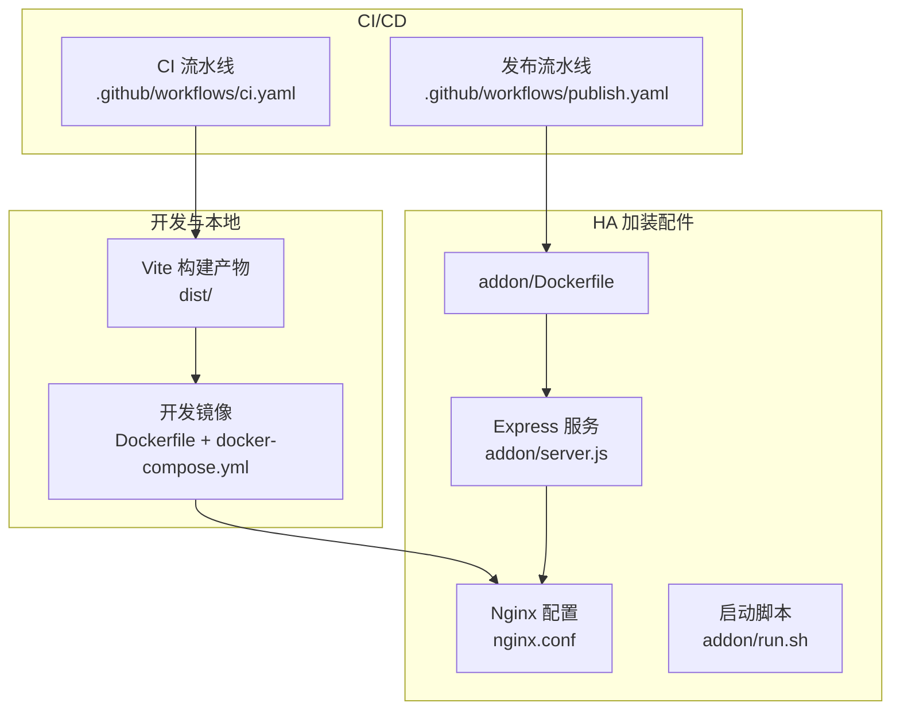
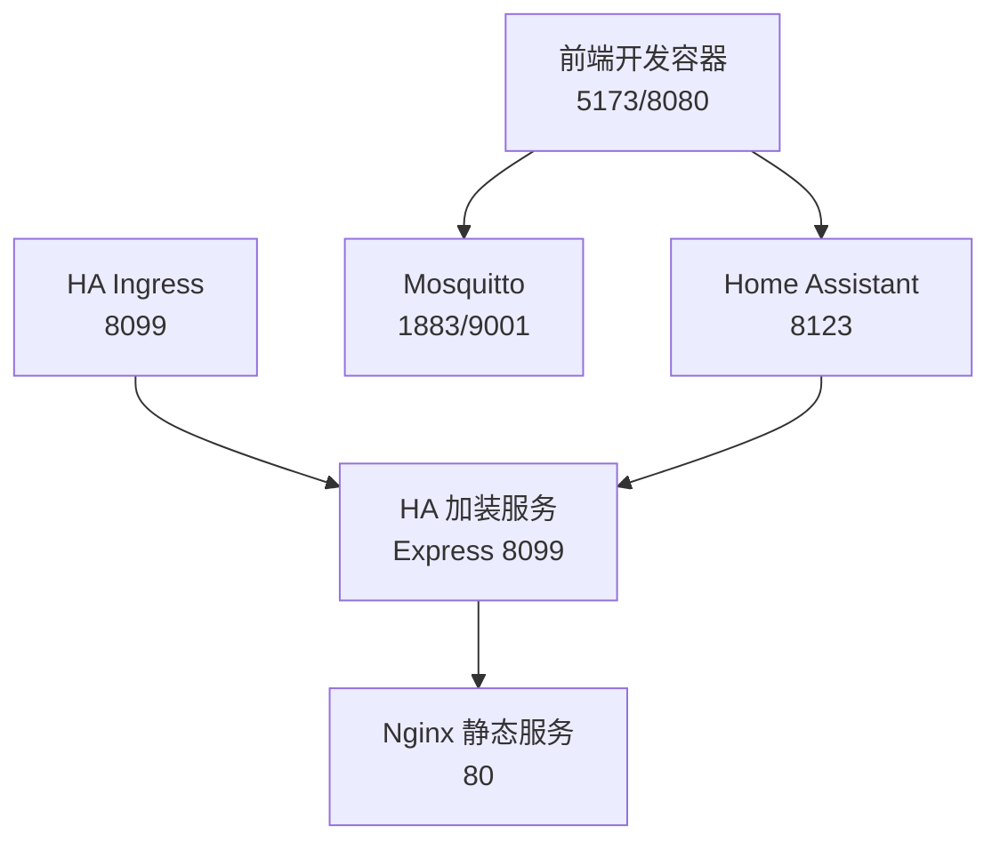
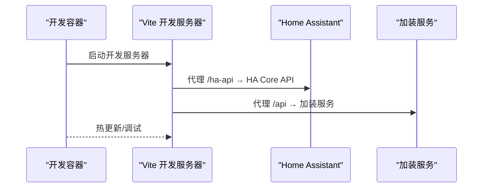
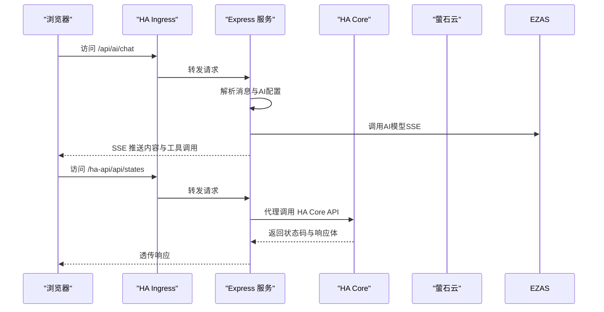
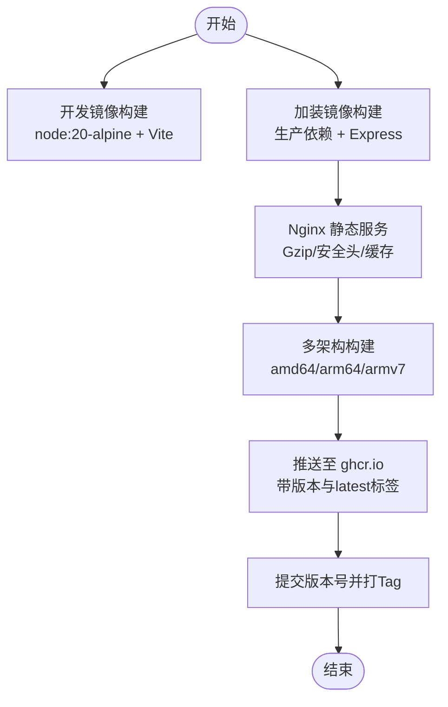
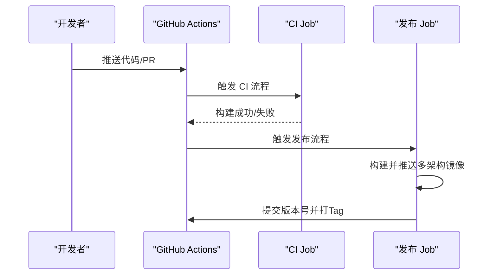
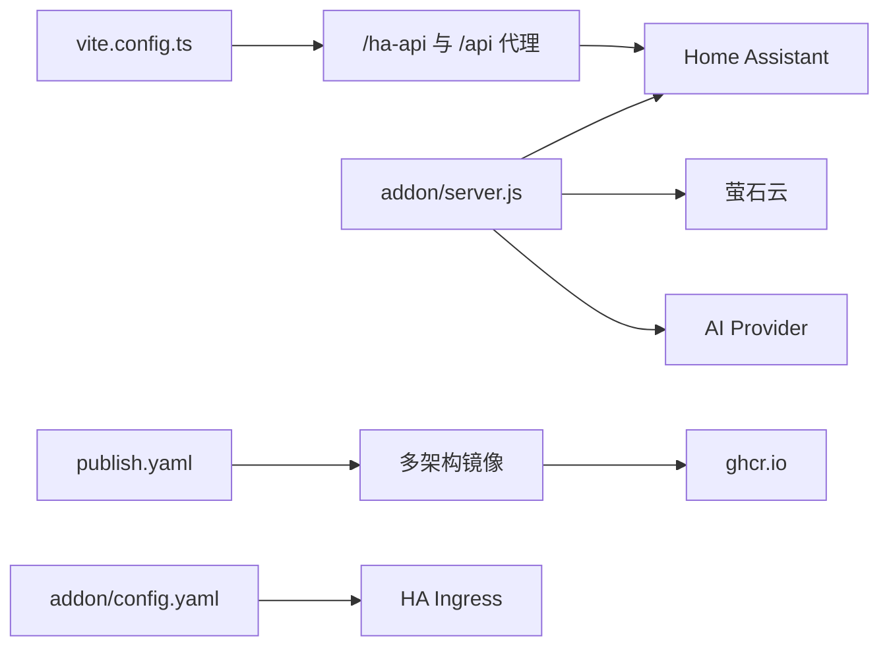

# 部署运维

<cite>
**本文引用的文件**
- [Dockerfile](file://Dockerfile)
- [docker-compose.yml](file://docker-compose.yml)
- [.github/workflows/ci.yaml](file://.github/workflows/ci.yaml)
- [.github/workflows/publish.yaml](file://.github/workflows/publish.yaml)
- [addon/Dockerfile](file://addon/Dockerfile)
- [addon/server.js](file://addon/server.js)
- [addon/config.yaml](file://addon/config.yaml)
- [addon/run.sh](file://addon/run.sh)
- [nginx.conf](file://nginx.conf)
- [run.sh](file://run.sh)
- [config/configuration.yaml](file://config/configuration.yaml)
- [package.json](file://package.json)
- [vite.config.ts](file://vite.config.ts)
- [cypress.config.ts](file://cypress.config.ts)
- [scripts/generate-mdi-meta.js](file://scripts/generate-mdi-meta.js)
</cite>

## 目录
1. [简介](#简介)
2. [项目结构](#项目结构)
3. [核心组件](#核心组件)
4. [架构总览](#架构总览)
5. [详细组件分析](#详细组件分析)
6. [依赖关系分析](#依赖关系分析)
7. [性能考虑](#性能考虑)
8. [故障排查指南](#故障排查指南)
9. [结论](#结论)
10. [附录](#附录)

## 简介
本文件面向HAUI项目的部署与运维，系统性阐述容器化部署、多阶段构建与镜像优化策略；CI/CD流水线配置、自动化测试与发布流程；生产环境配置管理、监控告警与日志收集机制；负载均衡与高可用、灾难恢复方案；以及部署最佳实践、安全加固与性能调优建议，并提供运维监控、故障排查与应急响应的实操指导。

## 项目结构
- 前端工程位于根目录，采用Vite构建，产物输出至dist。
- 顶层Dockerfile用于开发环境镜像（Node Alpine + 开发服务器），配合docker-compose进行本地联调。
- addon目录为Home Assistant加装配件，包含独立的Dockerfile、Express服务、Nginx静态资源与入口脚本。
- .github/workflows定义CI与发布流水线，实现多架构镜像构建与版本标签管理。
- 配置文件涵盖Home Assistant、Vite、Cypress等运行期配置。

图表来源
- [Dockerfile:1-37](file://Dockerfile#L1-L37)
- [docker-compose.yml:1-42](file://docker-compose.yml#L1-L42)
- [addon/Dockerfile:1-17](file://addon/Dockerfile#L1-L17)
- [addon/server.js:1-521](file://addon/server.js#L1-L521)
- [nginx.conf:1-37](file://nginx.conf#L1-L37)
- [.github/workflows/ci.yaml:1-29](file://.github/workflows/ci.yaml#L1-L29)
- [.github/workflows/publish.yaml:1-145](file://.github/workflows/publish.yaml#L1-L145)

章节来源
- [Dockerfile:1-37](file://Dockerfile#L1-L37)
- [docker-compose.yml:1-42](file://docker-compose.yml#L1-L42)
- [addon/Dockerfile:1-17](file://addon/Dockerfile#L1-L17)
- [addon/server.js:1-521](file://addon/server.js#L1-L521)
- [nginx.conf:1-37](file://nginx.conf#L1-L37)
- [.github/workflows/ci.yaml:1-29](file://.github/workflows/ci.yaml#L1-L29)
- [.github/workflows/publish.yaml:1-145](file://.github/workflows/publish.yaml#L1-L145)

## 核心组件
- 开发容器与本地联调
  - 顶层Dockerfile定义开发镜像，结合docker-compose挂载源码、端口映射与环境变量，便于与Home Assistant、Mosquitto联调。
- HA加装配件
  - addon/Dockerfile：生产专用镜像，仅安装生产依赖，暴露8099端口，运行Express服务。
  - addon/server.js：提供静态资源服务、/ha-api代理、萤石云与ONVIF代理、健康检查、AI配置与聊天接口。
  - addon/config.yaml：HA加装配置，声明镜像、架构、入口、持久化映射与Ingress参数。
  - addon/run.sh：加装启动脚本，注入配置并启动Nginx。
- 生产静态服务
  - nginx.conf：启用Gzip压缩、安全头、静态资源缓存、路由回退至index.html等。
  - run.sh：通用启动脚本，启动Nginx。
- CI/CD与发布
  - .github/workflows/ci.yaml：PR触发，安装Node、依赖、代码检查与构建。
  - .github/workflows/publish.yaml：主分支推送触发，多架构构建并推送至ghcr.io，更新addon/config.yaml版本号并打Tag。
- 运行期配置
  - config/configuration.yaml：Home Assistant CORS、TTS、自定义组件加载等。
  - vite.config.ts：相对路径基础、代理规则、外部化SDK、测试环境。
  - cypress.config.ts：E2E测试基地址。

章节来源
- [Dockerfile:1-37](file://Dockerfile#L1-L37)
- [docker-compose.yml:1-42](file://docker-compose.yml#L1-L42)
- [addon/Dockerfile:1-17](file://addon/Dockerfile#L1-L17)
- [addon/server.js:1-521](file://addon/server.js#L1-L521)
- [addon/config.yaml:1-37](file://addon/config.yaml#L1-L37)
- [addon/run.sh:1-10](file://addon/run.sh#L1-L10)
- [nginx.conf:1-37](file://nginx.conf#L1-L37)
- [run.sh:1-11](file://run.sh#L1-L11)
- [.github/workflows/ci.yaml:1-29](file://.github/workflows/ci.yaml#L1-L29)
- [.github/workflows/publish.yaml:1-145](file://.github/workflows/publish.yaml#L1-L145)
- [config/configuration.yaml:1-24](file://config/configuration.yaml#L1-L24)
- [vite.config.ts:1-53](file://vite.config.ts#L1-L53)
- [cypress.config.ts:1-11](file://cypress.config.ts#L1-L11)

## 架构总览
HAUI在开发阶段通过docker-compose将Home Assistant、Mosquitto与前端开发环境串联；生产阶段HA加装配件以Express+Nginx提供静态资源与API代理能力，HA Supervisor负责调度与Ingress接入。

图表来源
- [docker-compose.yml:1-42](file://docker-compose.yml#L1-L42)
- [addon/server.js:1-521](file://addon/server.js#L1-L521)
- [addon/config.yaml:1-37](file://addon/config.yaml#L1-L37)

## 详细组件分析

### 开发容器与本地联调
- 组件职责
  - 提供Node开发环境，自动安装依赖并启动Vite开发服务器，支持热更新与代理。
  - 通过环境变量VITE_HA_URL指向Home Assistant，VITE_API_URL指向加装服务。
- 关键点
  - 端口映射：5173（开发）、8080（备用）。
  - 挂载源码与自定义组件目录，便于调试。
  - 依赖安装使用--legacy-peer-deps兼容历史锁文件。
- 适用场景
  - 本地联调、快速迭代、与HA/MQTT联调。

图表来源
- [docker-compose.yml:27-42](file://docker-compose.yml#L27-L42)
- [vite.config.ts:32-45](file://vite.config.ts#L32-L45)
- [addon/server.js:48-94](file://addon/server.js#L48-L94)

章节来源
- [docker-compose.yml:1-42](file://docker-compose.yml#L1-L42)
- [vite.config.ts:1-53](file://vite.config.ts#L1-L53)

### HA加装配件（Express + Nginx）
- 组件职责
  - Express提供静态资源、/ha-api代理、萤石云与ONVIF代理、健康检查、AI配置与聊天接口。
  - Nginx提供静态资源服务与安全头、压缩、缓存策略。
  - HA Supervisor通过Ingress将8099端口流量转发至容器。
- 关键点
  - 静态资源：dist目录，支持缓存与ETag。
  - /ha-api代理：转发前端REST请求至HA Core，鉴权支持用户Token与Supervisor Token。
  - AI聊天：SSE流式返回，支持工具调用批处理。
  - 持久化：/data目录写入配置文件，兼容本地开发目录。
  - Ingress：开启stream，面板标题与图标配置于config.yaml。

图表来源
- [addon/server.js:422-503](file://addon/server.js#L422-L503)
- [addon/server.js:48-94](file://addon/server.js#L48-L94)
- [addon/config.yaml:31-33](file://addon/config.yaml#L31-L33)

章节来源
- [addon/server.js:1-521](file://addon/server.js#L1-L521)
- [addon/config.yaml:1-37](file://addon/config.yaml#L1-L37)
- [nginx.conf:1-37](file://nginx.conf#L1-L37)

### 镜像构建与优化
- 多阶段构建
  - 开发镜像：基于node:20-alpine，安装依赖并启动Vite。
  - 加装镜像：基于node:20-alpine，仅安装生产依赖，运行Express。
- 镜像优化
  - 仅安装生产依赖，减少镜像体积。
  - Nginx静态服务，移除默认静态资产，仅拷贝构建产物。
  - 启用Gzip压缩与安全头，提升安全性与传输效率。
- 多架构发布
  - 发布流水线按linux/amd64、linux/arm64、linux/arm/v7分别构建并推送。
  - 自动更新addon/config.yaml版本号并打Tag。

图表来源
- [Dockerfile:1-37](file://Dockerfile#L1-L37)
- [addon/Dockerfile:1-17](file://addon/Dockerfile#L1-L17)
- [nginx.conf:1-37](file://nginx.conf#L1-L37)
- [.github/workflows/publish.yaml:93-124](file://.github/workflows/publish.yaml#L93-L124)

章节来源
- [Dockerfile:1-37](file://Dockerfile#L1-L37)
- [addon/Dockerfile:1-17](file://addon/Dockerfile#L1-L17)
- [.github/workflows/publish.yaml:1-145](file://.github/workflows/publish.yaml#L1-L145)

### CI/CD流水线与自动化测试
- CI流水线
  - 触发条件：PR进入main分支。
  - 步骤：安装Node 22、清理并安装依赖、代码检查、构建。
- 发布流水线
  - 触发条件：main分支推送或手动触发，限定路径变更。
  - 步骤：安装Node 20/22、构建前端、复制dist到addon、读取版本号、更新config.yaml、多架构构建与推送、提交版本号并打Tag。
- 自动化测试
  - package.json定义了E2E与单元测试脚本，Cypress配置了E2E基地址。
  - 建议在CI中增加E2E与单元测试步骤，确保质量门禁。

图表来源
- [.github/workflows/ci.yaml:1-29](file://.github/workflows/ci.yaml#L1-L29)
- [.github/workflows/publish.yaml:1-145](file://.github/workflows/publish.yaml#L1-L145)
- [package.json:6-12](file://package.json#L6-L12)
- [cypress.config.ts:1-11](file://cypress.config.ts#L1-L11)

章节来源
- [.github/workflows/ci.yaml:1-29](file://.github/workflows/ci.yaml#L1-L29)
- [.github/workflows/publish.yaml:1-145](file://.github/workflows/publish.yaml#L1-L145)
- [package.json:1-132](file://package.json#L1-L132)
- [cypress.config.ts:1-11](file://cypress.config.ts#L1-L11)

### 配置管理、监控告警与日志收集
- 配置管理
  - Home Assistant：CORS、TTS、自定义组件加载等。
  - Vite：相对路径、代理、外部化SDK、测试环境。
  - HA加装：Ingress开关、持久化映射、面板标题与图标、AI Provider/Model/BaseURL等。
- 监控告警
  - 健康检查：/api/health返回时间戳与状态。
  - 建议：结合HA Supervisor日志与Ingress指标，配置告警阈值。
- 日志收集
  - Express服务输出错误与调试日志。
  - Nginx访问与错误日志可通过挂载卷收集。
  - 建议：集中化日志采集（如rsyslog/Fluent Bit）并接入监控平台。

章节来源
- [config/configuration.yaml:1-24](file://config/configuration.yaml#L1-L24)
- [vite.config.ts:1-53](file://vite.config.ts#L1-L53)
- [addon/config.yaml:1-37](file://addon/config.yaml#L1-L37)
- [addon/server.js:288-291](file://addon/server.js#L288-L291)
- [nginx.conf:1-37](file://nginx.conf#L1-L37)

### 负载均衡、高可用与灾难恢复
- 负载均衡
  - HA Ingress统一入口，转发至容器8099端口。
  - 建议：在HA外层使用反向代理（如Nginx/HAProxy）实现多实例分发。
- 高可用
  - 多副本部署：同一镜像多实例运行，结合健康检查与重启策略。
  - 数据持久化：/data目录映射为持久卷，保障配置与AI配置不丢失。
- 灾难恢复
  - 镜像与配置分离：镜像从ghcr.io拉取，配置在/data卷。
  - 回滚策略：按Tag回滚，快速恢复至上一个稳定版本。

章节来源
- [addon/config.yaml:1-37](file://addon/config.yaml#L1-L37)
- [addon/server.js:9-26](file://addon/server.js#L9-L26)
- [.github/workflows/publish.yaml:125-143](file://.github/workflows/publish.yaml#L125-L143)

### 安全加固与性能调优
- 安全加固
  - Nginx安全头：X-Frame-Options、X-XSS-Protection、X-Content-Type-Options。
  - Gzip压缩：降低传输体积。
  - CORS限制：仅允许必要来源。
  - 鉴权：/ha-api代理支持用户Token与Supervisor Token。
- 性能调优
  - 静态资源缓存：长期缓存与ETag。
  - 外部化SDK：避免bundle过大。
  - SSE流式响应：提升AI聊天体验。
  - 多架构镜像：适配不同硬件平台，提升部署灵活性。

章节来源
- [nginx.conf:1-37](file://nginx.conf#L1-L37)
- [config/configuration.yaml:4-11](file://config/configuration.yaml#L4-L11)
- [addon/server.js:48-94](file://addon/server.js#L48-L94)
- [vite.config.ts:20-30](file://vite.config.ts#L20-L30)
- [.github/workflows/publish.yaml:93-124](file://.github/workflows/publish.yaml#L93-L124)

## 依赖关系分析
- 组件耦合
  - 前端开发依赖Vite与代理配置，与HA Core通过/ha-api通信。
  - 加装服务依赖HA Core与第三方AI服务，提供静态资源与代理能力。
  - 发布流水线依赖GitHub Actions与ghcr.io，实现多架构镜像分发。
- 外部依赖
  - Home Assistant Core、Mosquitto、第三方AI服务（如SiliconFlow）。
  - Nginx、Express、Node.js生态。

图表来源
- [vite.config.ts:32-45](file://vite.config.ts#L32-L45)
- [addon/server.js:48-94](file://addon/server.js#L48-L94)
- [addon/config.yaml:31-33](file://addon/config.yaml#L31-L33)
- [.github/workflows/publish.yaml:93-124](file://.github/workflows/publish.yaml#L93-L124)

章节来源
- [vite.config.ts:1-53](file://vite.config.ts#L1-L53)
- [addon/server.js:1-521](file://addon/server.js#L1-L521)
- [addon/config.yaml:1-37](file://addon/config.yaml#L1-L37)
- [.github/workflows/publish.yaml:1-145](file://.github/workflows/publish.yaml#L1-L145)

## 性能考虑
- 构建与镜像
  - 多阶段构建与仅生产依赖，显著降低镜像体积与攻击面。
  - 多架构构建提升部署灵活性，减少平台适配成本。
- 运行期
  - Nginx静态资源缓存与Gzip压缩，降低带宽与延迟。
  - SSE流式响应与外部化SDK，优化前端加载与交互体验。
- 监控与容量规划
  - 建议结合HA Ingress指标与容器资源使用情况，制定扩容与限流策略。

## 故障排查指南
- 健康检查
  - 访问/api/health确认服务状态与时间戳。
- 日志定位
  - Express错误日志与Nginx访问/错误日志，定位请求失败与静态资源问题。
- 代理链路
  - /ha-api代理：确认Authorization头、Supervisor Token与HA Core可达性。
  - 萤石云与ONVIF：确认AI配置与网络连通性。
- 配置文件
  - 确认/data下的持久化配置文件存在且格式正确。
- 发布回滚
  - 若升级异常，使用对应Tag回滚镜像版本。

章节来源
- [addon/server.js:288-291](file://addon/server.js#L288-L291)
- [addon/server.js:48-94](file://addon/server.js#L48-L94)
- [addon/server.js:122-196](file://addon/server.js#L122-L196)
- [addon/server.js:229-286](file://addon/server.js#L229-L286)
- [addon/server.js:9-26](file://addon/server.js#L9-L26)
- [.github/workflows/publish.yaml:125-143](file://.github/workflows/publish.yaml#L125-L143)

## 结论
HAUI通过清晰的开发容器、HA加装配件与CI/CD流水线，实现了从开发到生产的高效闭环。结合多架构镜像、静态资源优化与安全加固，可在不同硬件平台上稳定运行。建议在生产环境中完善监控告警、集中化日志与灾备演练，持续提升可靠性与可维护性。

## 附录
- 开发与本地联调
  - 使用docker-compose启动Home Assistant、Mosquitto与前端开发环境。
  - 通过VITE_HA_URL与VITE_API_URL配置代理目标。
- 配置生成与维护
  - 使用scripts/generate-mdi-meta.js生成图标元数据，便于前端检索与展示。
- 测试与质量门禁
  - 在CI中增加E2E与单元测试步骤，确保功能稳定性。

章节来源
- [docker-compose.yml:1-42](file://docker-compose.yml#L1-L42)
- [vite.config.ts:1-53](file://vite.config.ts#L1-L53)
- [scripts/generate-mdi-meta.js:1-45](file://scripts/generate-mdi-meta.js#L1-L45)
- [package.json:6-12](file://package.json#L6-L12)
- [cypress.config.ts:1-11](file://cypress.config.ts#L1-L11)