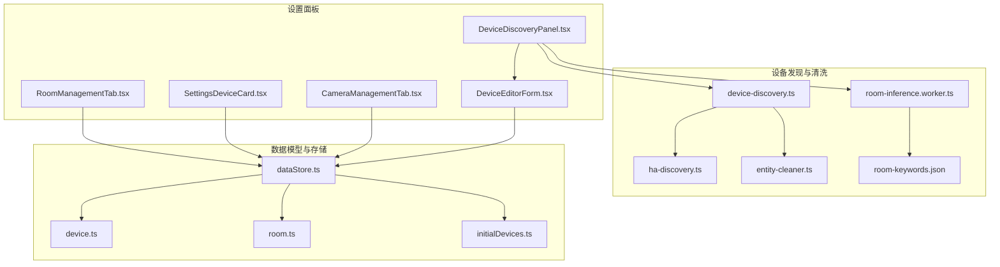
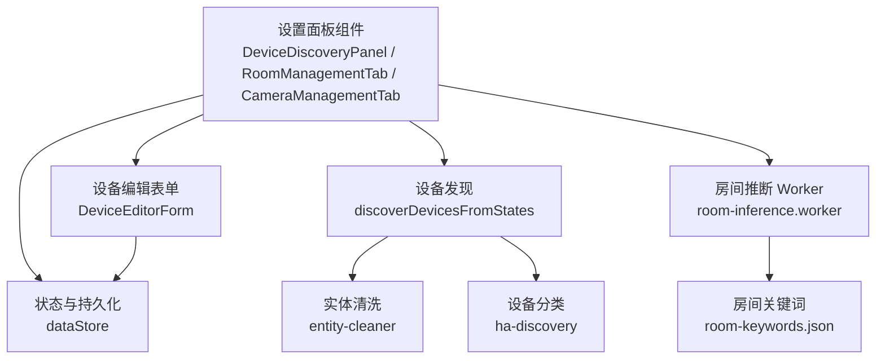
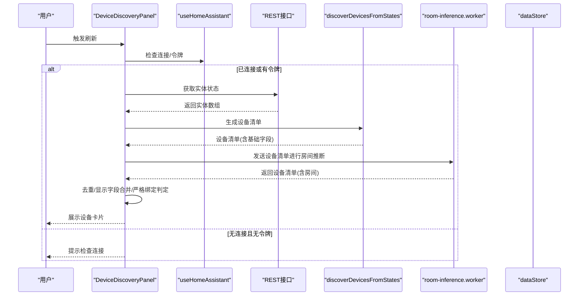
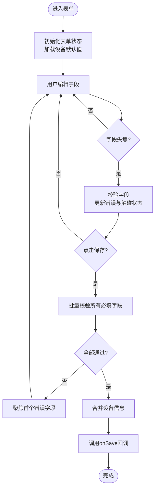
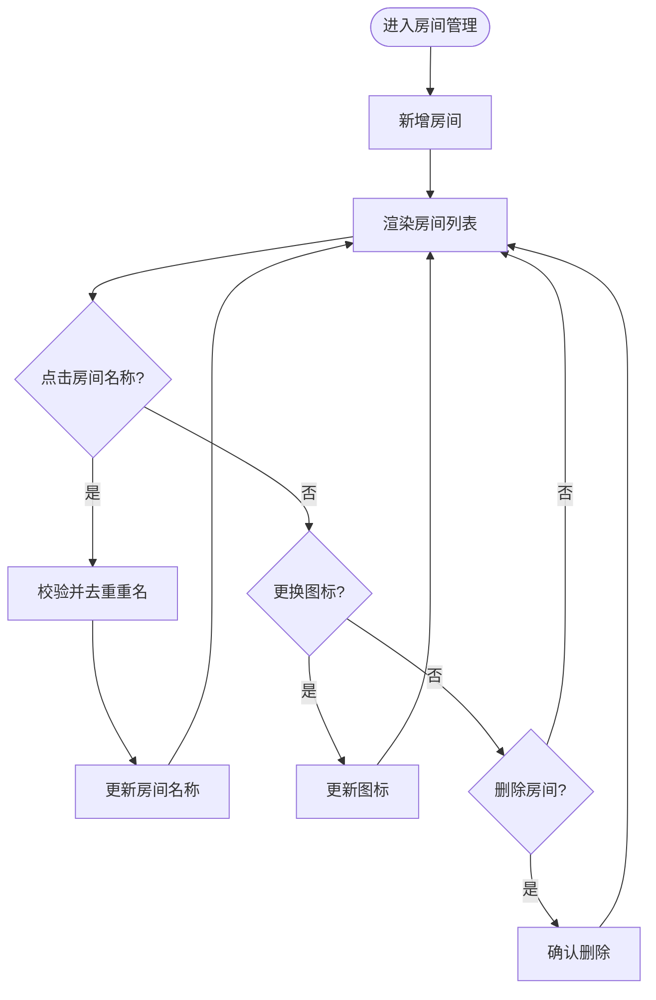
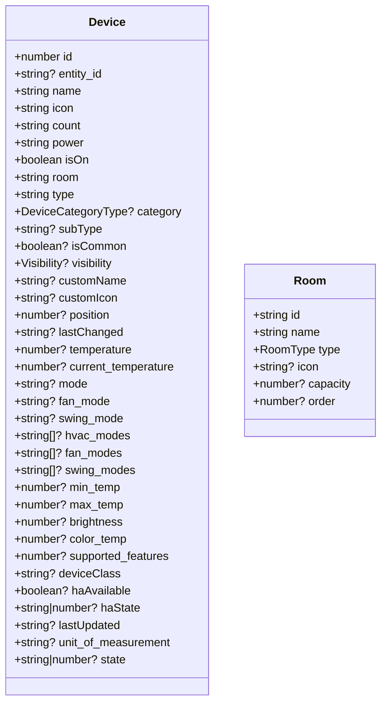
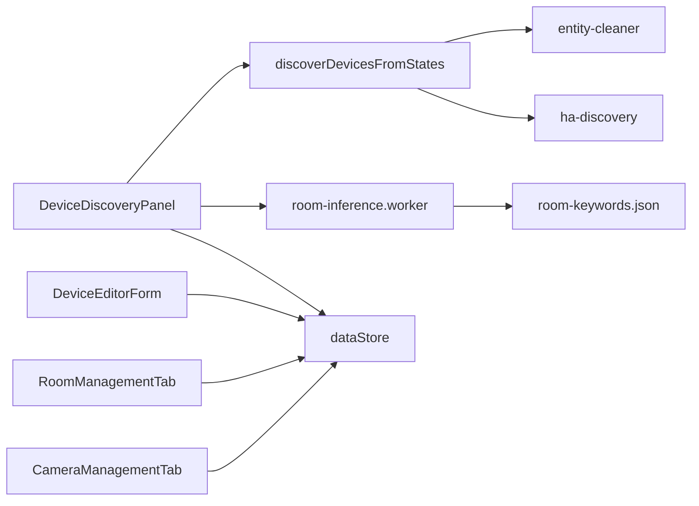

# 应用设置管理

<cite>
**本文引用的文件**
- [DeviceEditorForm.tsx](file://src/app/components/settings/DeviceEditorForm.tsx)
- [DeviceDiscoveryPanel.tsx](file://src/app/components/settings/DeviceDiscoveryPanel.tsx)
- [RoomManagementTab.tsx](file://src/app/components/settings/RoomManagementTab.tsx)
- [SettingsDeviceCard.tsx](file://src/app/components/settings/SettingsDeviceCard.tsx)
- [device-discovery.ts](file://src/utils/device-discovery.ts)
- [ha-discovery.ts](file://src/utils/ha-discovery.ts)
- [entity-cleaner.ts](file://src/utils/entity-cleaner.ts)
- [room-inference.worker.ts](file://src/workers/room-inference.worker.ts)
- [room-keywords.json](file://src/config/room-keywords.json)
- [initialDevices.ts](file://src/config/initialDevices.ts)
- [dataStore.ts](file://src/store/dataStore.ts)
- [device.ts](file://src/types/device.ts)
- [room.ts](file://src/types/room.ts)
- [CameraManagementTab.tsx](file://src/app/components/settings/CameraManagementTab.tsx)
</cite>

## 目录
1. [简介](#简介)
2. [项目结构](#项目结构)
3. [核心组件](#核心组件)
4. [架构总览](#架构总览)
5. [详细组件分析](#详细组件分析)
6. [依赖关系分析](#依赖关系分析)
7. [性能考量](#性能考量)
8. [故障排查指南](#故障排查指南)
9. [结论](#结论)
10. [附录](#附录)

## 简介
本技术文档围绕应用设置管理展开，系统性阐述设备级别的配置选项、设备发现机制与设备编辑表单的实现；深入解析设备配置的数据模型、验证规则与持久化策略；详解设置面板的组件架构、表单状态管理与实时验证机制；分析设备类型识别、自动发现流程与手动配置选项；并提供默认值管理、配置迁移与兼容性处理方案，以及设置扩展、自定义配置项与批量配置的开发指南。

## 项目结构
设置管理相关模块主要分布在以下路径：
- 设置面板与表单：src/app/components/settings/
- 设备发现与清洗：src/utils/device-discovery.ts、src/utils/ha-discovery.ts、src/utils/entity-cleaner.ts
- 房间推断与关键词：src/workers/room-inference.worker.ts、src/config/room-keywords.json
- 数据模型与默认值：src/types/device.ts、src/types/room.ts、src/config/initialDevices.ts
- 状态与持久化：src/store/dataStore.ts
- 摄像头管理：src/app/components/settings/CameraManagementTab.tsx

**图表来源**
- [DeviceDiscoveryPanel.tsx:1-515](file://src/app/components/settings/DeviceDiscoveryPanel.tsx#L1-L515)
- [DeviceEditorForm.tsx:1-574](file://src/app/components/settings/DeviceEditorForm.tsx#L1-L574)
- [RoomManagementTab.tsx:1-195](file://src/app/components/settings/RoomManagementTab.tsx#L1-L195)
- [SettingsDeviceCard.tsx:1-136](file://src/app/components/settings/SettingsDeviceCard.tsx#L1-L136)
- [device-discovery.ts:1-161](file://src/utils/device-discovery.ts#L1-L161)
- [ha-discovery.ts:1-167](file://src/utils/ha-discovery.ts#L1-L167)
- [entity-cleaner.ts:1-381](file://src/utils/entity-cleaner.ts#L1-L381)
- [room-inference.worker.ts:1-73](file://src/workers/room-inference.worker.ts#L1-L73)
- [room-keywords.json:1-34](file://src/config/room-keywords.json#L1-L34)
- [device.ts:1-46](file://src/types/device.ts#L1-L46)
- [room.ts:1-33](file://src/types/room.ts#L1-L33)
- [initialDevices.ts:1-68](file://src/config/initialDevices.ts#L1-L68)
- [dataStore.ts:1-129](file://src/store/dataStore.ts#L1-L129)

**章节来源**
- [DeviceDiscoveryPanel.tsx:1-515](file://src/app/components/settings/DeviceDiscoveryPanel.tsx#L1-L515)
- [DeviceEditorForm.tsx:1-574](file://src/app/components/settings/DeviceEditorForm.tsx#L1-L574)
- [RoomManagementTab.tsx:1-195](file://src/app/components/settings/RoomManagementTab.tsx#L1-L195)
- [SettingsDeviceCard.tsx:1-136](file://src/app/components/settings/SettingsDeviceCard.tsx#L1-L136)
- [device-discovery.ts:1-161](file://src/utils/device-discovery.ts#L1-L161)
- [ha-discovery.ts:1-167](file://src/utils/ha-discovery.ts#L1-L167)
- [entity-cleaner.ts:1-381](file://src/utils/entity-cleaner.ts#L1-L381)
- [room-inference.worker.ts:1-73](file://src/workers/room-inference.worker.ts#L1-L73)
- [room-keywords.json:1-34](file://src/config/room-keywords.json#L1-L34)
- [device.ts:1-46](file://src/types/device.ts#L1-L46)
- [room.ts:1-33](file://src/types/room.ts#L1-L33)
- [initialDevices.ts:1-68](file://src/config/initialDevices.ts#L1-L68)
- [dataStore.ts:1-129](file://src/store/dataStore.ts#L1-L129)

## 核心组件
- 设备发现面板：负责扫描 Home Assistant 实体、去重合并、房间推断、过滤筛选与批量绑定。
- 设备编辑表单：提供实体选择、名称校验、图标选择、房间与类型选择、分类与保存。
- 房间管理页签：提供房间增删改查、图标更换与名称冲突处理。
- 摄像头管理页签：提供摄像头类型、URL 与令牌配置。
- 数据模型与默认值：统一设备与房间的数据结构与初始数据。
- 状态与持久化：基于 Zustand 的本地存储与同步。

**章节来源**
- [DeviceDiscoveryPanel.tsx:1-515](file://src/app/components/settings/DeviceDiscoveryPanel.tsx#L1-L515)
- [DeviceEditorForm.tsx:1-574](file://src/app/components/settings/DeviceEditorForm.tsx#L1-L574)
- [RoomManagementTab.tsx:1-195](file://src/app/components/settings/RoomManagementTab.tsx#L1-L195)
- [CameraManagementTab.tsx:1-188](file://src/app/components/settings/CameraManagementTab.tsx#L1-L188)
- [device.ts:1-46](file://src/types/device.ts#L1-L46)
- [room.ts:1-33](file://src/types/room.ts#L1-L33)
- [initialDevices.ts:1-68](file://src/config/initialDevices.ts#L1-L68)
- [dataStore.ts:1-129](file://src/store/dataStore.ts#L1-L129)

## 架构总览
设置管理采用“面板-表单-发现-清洗-存储”的分层架构：
- 面板层：DeviceDiscoveryPanel、RoomManagementTab、CameraManagementTab 负责用户交互与业务编排。
- 发现与清洗层：device-discovery.ts、entity-cleaner.ts、ha-discovery.ts、room-inference.worker.ts 负责实体发现、类型与房间推断、参数提取与异步房间推断。
- 存储层：dataStore.ts 负责设备、房间、场景、用户、日志的本地持久化与同步。

**图表来源**
- [DeviceDiscoveryPanel.tsx:1-515](file://src/app/components/settings/DeviceDiscoveryPanel.tsx#L1-L515)
- [DeviceEditorForm.tsx:1-574](file://src/app/components/settings/DeviceEditorForm.tsx#L1-L574)
- [device-discovery.ts:1-161](file://src/utils/device-discovery.ts#L1-L161)
- [entity-cleaner.ts:1-381](file://src/utils/entity-cleaner.ts#L1-L381)
- [ha-discovery.ts:1-167](file://src/utils/ha-discovery.ts#L1-L167)
- [room-inference.worker.ts:1-73](file://src/workers/room-inference.worker.ts#L1-L73)
- [room-keywords.json:1-34](file://src/config/room-keywords.json#L1-L34)
- [dataStore.ts:1-129](file://src/store/dataStore.ts#L1-L129)

## 详细组件分析

### 设备发现面板（DeviceDiscoveryPanel）
职责与流程：
- 连接 Home Assistant，延迟自动扫描，避免 WebSocket 未就绪导致的错误。
- 通过 REST 获取实体状态，转换为对象后交由 discoverDevicesFromStates 生成设备清单。
- 将设备清单交给 Web Worker 进行房间推断，回传结果后进行去重与显示字段合并。
- 支持搜索、分类筛选、单个绑定、批量绑定、解绑与删除。
- 严格绑定判定：仅当设备存在于持久化列表且房间非“未分配”才视为已绑定，过滤“幽灵设备”。

**图表来源**
- [DeviceDiscoveryPanel.tsx:74-121](file://src/app/components/settings/DeviceDiscoveryPanel.tsx#L74-L121)
- [device-discovery.ts:12-161](file://src/utils/device-discovery.ts#L12-L161)
- [room-inference.worker.ts:24-73](file://src/workers/room-inference.worker.ts#L24-L73)

**章节来源**
- [DeviceDiscoveryPanel.tsx:1-515](file://src/app/components/settings/DeviceDiscoveryPanel.tsx#L1-L515)
- [device-discovery.ts:1-161](file://src/utils/device-discovery.ts#L1-L161)
- [room-inference.worker.ts:1-73](file://src/workers/room-inference.worker.ts#L1-L73)

### 设备编辑表单（DeviceEditorForm）
职责与特性：
- 表单状态：内部维护 formData、errors、touched 与删除确认状态。
- 实时验证：字段失焦触发校验，支持名称唯一性、实体占用、必填项等。
- 交互体验：桌面端使用 Popover，移动端使用 Drawer；支持命令式搜索与选择。
- 类型与图标推断：根据实体 domain/device_class 自动推断类型与图标；类型变更时联动推荐分类。
- 保存策略：校验通过后调用 onSave，合并更新设备信息并写入持久化。

**图表来源**
- [DeviceEditorForm.tsx:120-188](file://src/app/components/settings/DeviceEditorForm.tsx#L120-L188)

**章节来源**
- [DeviceEditorForm.tsx:1-574](file://src/app/components/settings/DeviceEditorForm.tsx#L1-L574)

### 房间管理页签（RoomManagementTab）
职责与特性：
- 房间增删改查：新增房间、点击名称编辑、图标更换、删除确认。
- 名称冲突处理：编辑时检测重名并追加序号避免冲突。
- 与设置面板联动：设备卡片显示房间与类型标签，编辑按钮触发表单。

**图表来源**
- [RoomManagementTab.tsx:17-63](file://src/app/components/settings/RoomManagementTab.tsx#L17-L63)

**章节来源**
- [RoomManagementTab.tsx:1-195](file://src/app/components/settings/RoomManagementTab.tsx#L1-L195)
- [SettingsDeviceCard.tsx:1-136](file://src/app/components/settings/SettingsDeviceCard.tsx#L1-L136)

### 摄像头管理页签（CameraManagementTab）
职责与特性：
- 支持 HA HLS 与 Ezviz 两种类型，分别配置 URL 与访问令牌。
- 提供新增、编辑、删除与提示信息卡片。

**章节来源**
- [CameraManagementTab.tsx:1-188](file://src/app/components/settings/CameraManagementTab.tsx#L1-L188)

### 数据模型与默认值
- 设备模型（Device）：包含实体 ID、名称、图标、房间、类型、分类、可见性、自定义显示、状态与属性等字段。
- 房间模型（Room）：包含 id、name、type、icon、capacity、order 等字段。
- 初始设备（INITIAL_DEVICES）：提供示例设备集合，确保默认遥控器存在。

**图表来源**
- [device.ts:1-46](file://src/types/device.ts#L1-L46)
- [room.ts:1-33](file://src/types/room.ts#L1-L33)
- [initialDevices.ts:1-68](file://src/config/initialDevices.ts#L1-L68)

**章节来源**
- [device.ts:1-46](file://src/types/device.ts#L1-L46)
- [room.ts:1-33](file://src/types/room.ts#L1-L33)
- [initialDevices.ts:1-68](file://src/config/initialDevices.ts#L1-L68)

### 状态与持久化（dataStore）
- 使用 Zustand + persist，将设备、房间、场景、用户、日志持久化至 localStorage。
- 自动同步：storage hook 中在setItem/removeItem后触发同步。
- 默认远程设备：若不存在遥控器类型设备则自动补齐。

**章节来源**
- [dataStore.ts:1-129](file://src/store/dataStore.ts#L1-L129)

## 依赖关系分析
- 设备发现依赖清洗与分类工具：discoverDevicesFromStates 依赖 entity-cleaner 的房间与类型推断、参数提取，以及 ha-discovery 的分类逻辑。
- 房间推断通过 Web Worker 异步执行，避免阻塞主线程。
- 设置面板与表单依赖 dataStore 进行读写；表单保存时触发同步。

**图表来源**
- [DeviceDiscoveryPanel.tsx:1-515](file://src/app/components/settings/DeviceDiscoveryPanel.tsx#L1-L515)
- [device-discovery.ts:1-161](file://src/utils/device-discovery.ts#L1-L161)
- [entity-cleaner.ts:1-381](file://src/utils/entity-cleaner.ts#L1-L381)
- [ha-discovery.ts:1-167](file://src/utils/ha-discovery.ts#L1-L167)
- [room-inference.worker.ts:1-73](file://src/workers/room-inference.worker.ts#L1-L73)
- [room-keywords.json:1-34](file://src/config/room-keywords.json#L1-L34)
- [DeviceEditorForm.tsx:1-574](file://src/app/components/settings/DeviceEditorForm.tsx#L1-L574)
- [dataStore.ts:1-129](file://src/store/dataStore.ts#L1-L129)

**章节来源**
- [DeviceDiscoveryPanel.tsx:1-515](file://src/app/components/settings/DeviceDiscoveryPanel.tsx#L1-L515)
- [device-discovery.ts:1-161](file://src/utils/device-discovery.ts#L1-L161)
- [entity-cleaner.ts:1-381](file://src/utils/entity-cleaner.ts#L1-L381)
- [ha-discovery.ts:1-167](file://src/utils/ha-discovery.ts#L1-L167)
- [room-inference.worker.ts:1-73](file://src/workers/room-inference.worker.ts#L1-L73)
- [room-keywords.json:1-34](file://src/config/room-keywords.json#L1-L34)
- [DeviceEditorForm.tsx:1-574](file://src/app/components/settings/DeviceEditorForm.tsx#L1-L574)
- [dataStore.ts:1-129](file://src/store/dataStore.ts#L1-L129)

## 性能考量
- 异步房间推断：使用 Web Worker 处理设备房间推断，避免主线程阻塞。
- 延迟自动扫描：等待 WebSocket 建连稳定后再触发首次扫描，减少错误与降级请求。
- 去重与合并：对扫描结果与已绑定设备进行去重与显示字段合并，降低渲染压力。
- 本地存储：Zustand 持久化仅选择必要字段，减少存储体积与序列化成本。

[本节为通用性能建议，不直接分析具体文件]

## 故障排查指南
- 连接问题：若无 Home Assistant 令牌或连接不可用，自动扫描将被跳过并提示检查连接。
- 扫描失败：捕获异常并弹出错误提示，建议检查 HA 服务状态与网络。
- 幽灵设备：严格绑定判定仅当房间非“未分配”才视为已绑定，避免历史遗留数据污染。
- 实体占用：表单校验会阻止将已绑定的实体再次绑定到其他设备。
- 名称冲突：房间名称编辑时自动去重，避免重复名称导致的界面混乱。

**章节来源**
- [DeviceDiscoveryPanel.tsx:74-121](file://src/app/components/settings/DeviceDiscoveryPanel.tsx#L74-L121)
- [DeviceEditorForm.tsx:130-157](file://src/app/components/settings/DeviceEditorForm.tsx#L130-L157)

## 结论
本设置管理模块通过清晰的分层设计与完善的验证机制，实现了从设备自动发现、类型与房间推断，到手动编辑、批量绑定与持久化的完整闭环。借助 Web Worker 与本地存储，兼顾了性能与用户体验。后续可在扩展性方面进一步增强配置项的可插拔性与迁移兼容能力。

[本节为总结性内容，不直接分析具体文件]

## 附录

### 设备类型识别与分类
- 基于 domain 与 device_class 的传统分类（legacy）与基于中文名推断的新分类（new）并存，最终以新分类为主。
- 具体映射参考 ha-discovery 的 categorizeDevice 与 inferDeviceType。

**章节来源**
- [ha-discovery.ts:89-166](file://src/utils/ha-discovery.ts#L89-L166)

### 设备参数提取
- 针对不同 domain（如 climate、light、cover、fan、sensor、binary_sensor）提取关键属性，用于设备展示与控制。

**章节来源**
- [entity-cleaner.ts:336-380](file://src/utils/entity-cleaner.ts#L336-L380)

### 房间关键词与优先级
- 通过 room-keywords.json 定义房间关键词与优先级，Worker 按优先级匹配推断房间。

**章节来源**
- [room-keywords.json:1-34](file://src/config/room-keywords.json#L1-L34)
- [room-inference.worker.ts:24-73](file://src/workers/room-inference.worker.ts#L24-L73)

### 默认值与兼容性
- 初始设备集合确保基本功能可用；Zustand 持久化时对旧数据进行兼容加载与默认值补齐。

**章节来源**
- [initialDevices.ts:1-68](file://src/config/initialDevices.ts#L1-L68)
- [dataStore.ts:30-47](file://src/store/dataStore.ts#L30-L47)

### 扩展与开发指南
- 扩展设置项：在对应 Tab 组件中增加输入项，通过 onUpdate 回调更新 dataStore 对应状态。
- 自定义配置项：在 dataStore 中新增字段与默认值，确保持久化键名稳定。
- 批量配置：利用 DeviceDiscoveryPanel 的批量绑定逻辑，遍历选中设备并一次性写入映射。

**章节来源**
- [DeviceDiscoveryPanel.tsx:277-320](file://src/app/components/settings/DeviceDiscoveryPanel.tsx#L277-L320)
- [dataStore.ts:1-129](file://src/store/dataStore.ts#L1-L129)