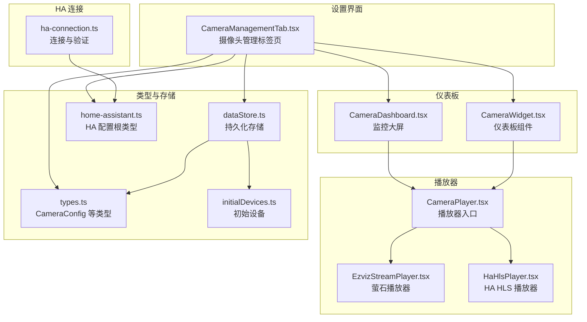
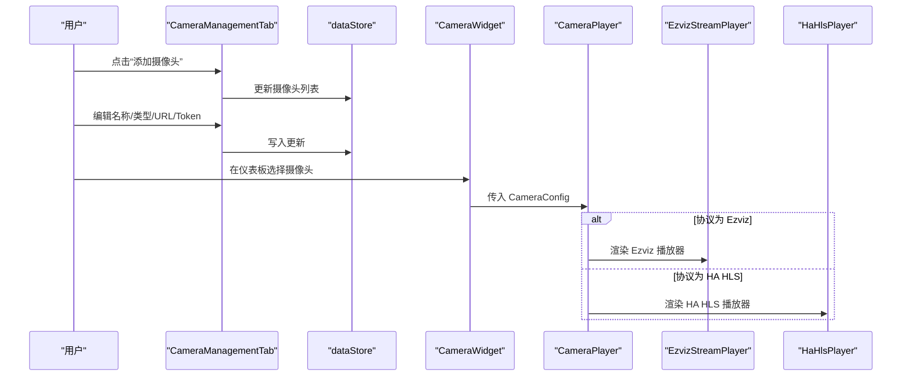
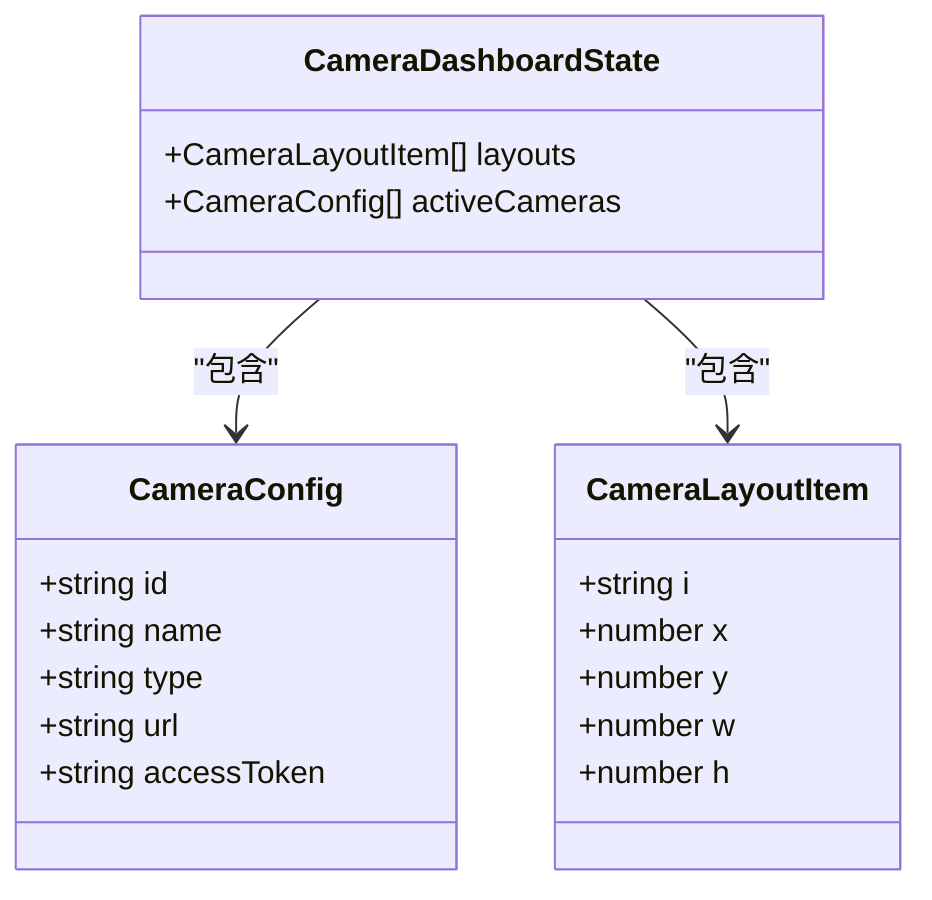
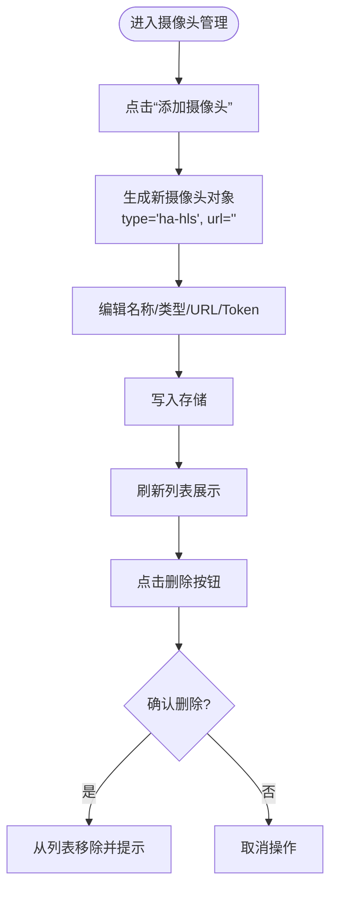
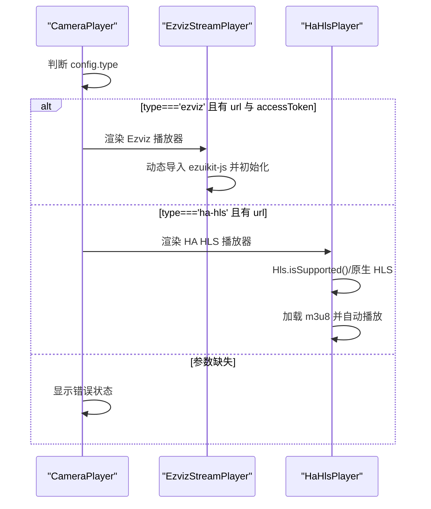
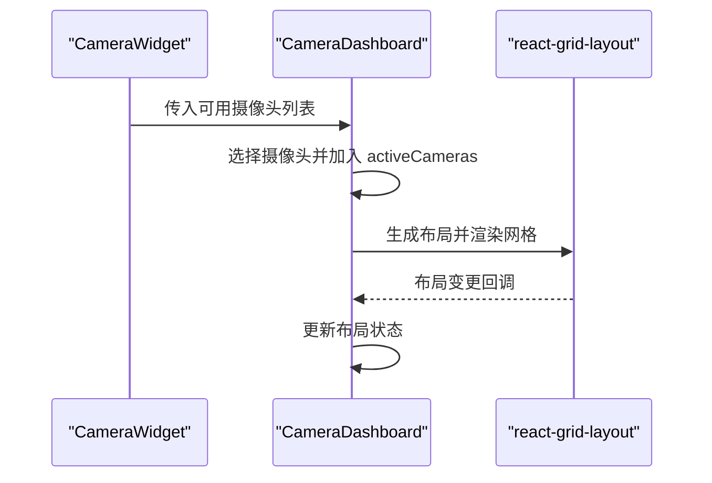
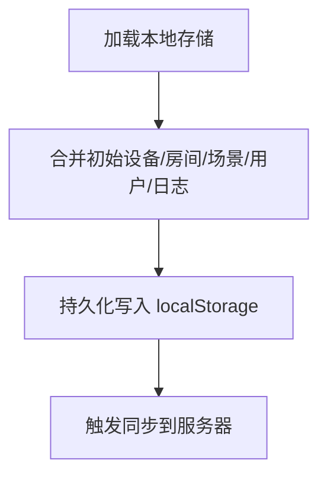
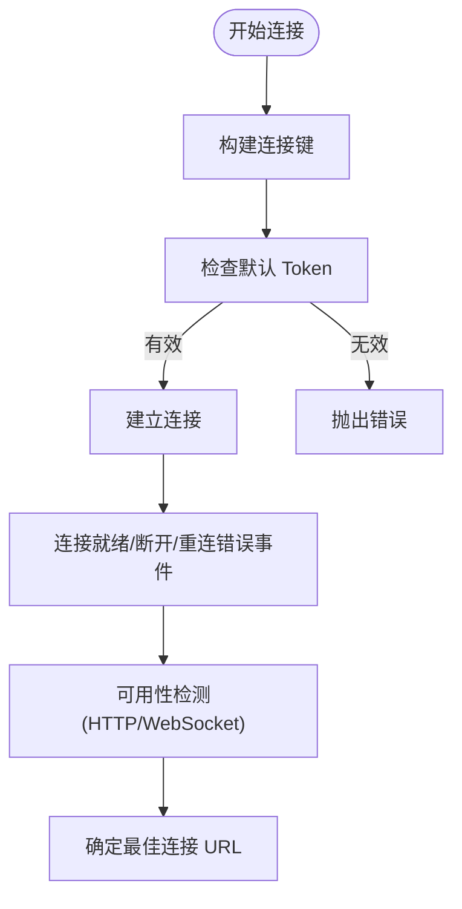
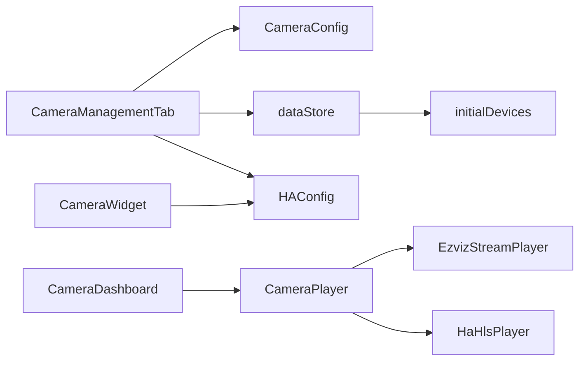

# 摄像头配置管理

<cite>
**本文引用的文件**   
- [CameraManagementTab.tsx](file://src/app/components/settings/CameraManagementTab.tsx)
- [types.ts](file://src/components/camera/types.ts)
- [CameraPlayer.tsx](file://src/components/camera/CameraPlayer.tsx)
- [EzvizStreamPlayer.tsx](file://src/components/camera/EzvizStreamPlayer.tsx)
- [HaHlsPlayer.tsx](file://src/components/camera/HaHlsPlayer.tsx)
- [CameraDashboard.tsx](file://src/components/camera/CameraDashboard.tsx)
- [CameraWidget.tsx](file://src/app/components/dashboard/widgets/CameraWidget.tsx)
- [ha-connection.ts](file://src/utils/ha-connection.ts)
- [dataStore.ts](file://src/store/dataStore.ts)
- [initialDevices.ts](file://src/config/initialDevices.ts)
- [home-assistant.ts](file://src/types/home-assistant.ts)
- [device.ts](file://src/types/device.ts)
- [room.ts](file://src/types/room.ts)
- [useDashboardLayout.ts](file://src/hooks/useDashboardLayout.ts)
</cite>

## 目录
1. [简介](#简介)
2. [项目结构](#项目结构)
3. [核心组件](#核心组件)
4. [架构总览](#架构总览)
5. [详细组件分析](#详细组件分析)
6. [依赖关系分析](#依赖关系分析)
7. [性能考量](#性能考量)
8. [故障排查指南](#故障排查指南)
9. [结论](#结论)
10. [附录](#附录)

## 简介
本技术文档围绕摄像头配置管理展开，覆盖配置模型、连接参数与流媒体设置；详述摄像头管理标签页的组件实现、设备列表管理与配置表单；阐述 HA HLS 与萤石 Ezviz 两种协议支持、认证机制与连接测试能力；分析参数校验规则、默认值与配置模板；并提供摄像头添加向导、批量配置与设备健康检查的实践方法，最后给出协议扩展、自定义参数与配置导入导出的开发指南。

## 项目结构
摄像头相关代码主要分布在以下模块：
- 设置界面：摄像头管理标签页负责新增、编辑、删除摄像头配置
- 播放器：根据协议类型选择播放器，分别对接 Ezviz 与 HA HLS
- 仪表板：摄像头组件与监控大屏，支持布局与全屏
- 存储与类型：定义摄像头配置类型、持久化存储与初始设备
- HA 连接：提供连接、验证与注册表查询能力

**图表来源**
- [CameraManagementTab.tsx:1-188](file://src/app/components/settings/CameraManagementTab.tsx#L1-L188)
- [types.ts:1-22](file://src/components/camera/types.ts#L1-L22)
- [CameraPlayer.tsx:1-88](file://src/components/camera/CameraPlayer.tsx#L1-L88)
- [EzvizStreamPlayer.tsx:1-80](file://src/components/camera/EzvizStreamPlayer.tsx#L1-L80)
- [HaHlsPlayer.tsx:1-100](file://src/components/camera/HaHlsPlayer.tsx#L1-L100)
- [CameraDashboard.tsx:1-154](file://src/components/camera/CameraDashboard.tsx#L1-L154)
- [CameraWidget.tsx:1-95](file://src/app/components/dashboard/widgets/CameraWidget.tsx#L1-L95)
- [dataStore.ts:1-129](file://src/store/dataStore.ts#L1-L129)
- [initialDevices.ts:1-68](file://src/config/initialDevices.ts#L1-L68)
- [home-assistant.ts:1-11](file://src/types/home-assistant.ts#L1-L11)
- [ha-connection.ts:1-317](file://src/utils/ha-connection.ts#L1-L317)

**章节来源**
- [CameraManagementTab.tsx:1-188](file://src/app/components/settings/CameraManagementTab.tsx#L1-L188)
- [types.ts:1-22](file://src/components/camera/types.ts#L1-L22)
- [CameraPlayer.tsx:1-88](file://src/components/camera/CameraPlayer.tsx#L1-L88)
- [EzvizStreamPlayer.tsx:1-80](file://src/components/camera/EzvizStreamPlayer.tsx#L1-L80)
- [HaHlsPlayer.tsx:1-100](file://src/components/camera/HaHlsPlayer.tsx#L1-L100)
- [CameraDashboard.tsx:1-154](file://src/components/camera/CameraDashboard.tsx#L1-L154)
- [CameraWidget.tsx:1-95](file://src/app/components/dashboard/widgets/CameraWidget.tsx#L1-L95)
- [dataStore.ts:1-129](file://src/store/dataStore.ts#L1-L129)
- [initialDevices.ts:1-68](file://src/config/initialDevices.ts#L1-L68)
- [home-assistant.ts:1-11](file://src/types/home-assistant.ts#L1-L11)
- [ha-connection.ts:1-317](file://src/utils/ha-connection.ts#L1-L317)

## 核心组件
- 摄像头配置模型
  - 类型定义：包含摄像头唯一标识、名称、协议类型、URL、访问令牌等字段
  - 默认值：新增摄像头时默认类型为 HA HLS，URL 留空
- 播放器组件
  - 根据类型选择 Ezviz 或 HA HLS 播放器
  - 提供全屏、移除等交互
- 仪表板组件
  - 支持在仪表板卡片中选择摄像头并播放
  - 支持监控大屏多画面布局与全屏
- 存储与初始化
  - 使用持久化存储保存摄像头配置
  - 提供初始设备与房间数据

**章节来源**
- [types.ts:10-21](file://src/components/camera/types.ts#L10-L21)
- [CameraManagementTab.tsx:14-23](file://src/app/components/settings/CameraManagementTab.tsx#L14-L23)
- [CameraPlayer.tsx:69-75](file://src/components/camera/CameraPlayer.tsx#L69-L75)
- [CameraWidget.tsx:16-31](file://src/app/components/dashboard/widgets/CameraWidget.tsx#L16-L31)
- [dataStore.ts:58-129](file://src/store/dataStore.ts#L58-L129)
- [initialDevices.ts:1-68](file://src/config/initialDevices.ts#L1-L68)

## 架构总览
摄像头配置管理采用“设置-存储-播放-仪表板”的分层架构：
- 设置层：提供摄像头管理标签页，负责配置的增删改与提示
- 存储层：通过持久化存储维护摄像头配置集合
- 播放层：根据协议类型动态加载对应播放器
- 仪表板层：提供卡片与大屏两种展示形态

**图表来源**
- [CameraManagementTab.tsx:14-36](file://src/app/components/settings/CameraManagementTab.tsx#L14-L36)
- [dataStore.ts:67-73](file://src/store/dataStore.ts#L67-L73)
- [CameraWidget.tsx:16-31](file://src/app/components/dashboard/widgets/CameraWidget.tsx#L16-L31)
- [CameraPlayer.tsx:69-75](file://src/components/camera/CameraPlayer.tsx#L69-L75)
- [EzvizStreamPlayer.tsx:34-42](file://src/components/camera/EzvizStreamPlayer.tsx#L34-L42)
- [HaHlsPlayer.tsx:30-39](file://src/components/camera/HaHlsPlayer.tsx#L30-L39)

## 详细组件分析

### 摄像头配置模型与类型
- 字段说明
  - id：摄像头唯一标识
  - name：显示名称
  - type：协议类型，支持 'ezviz' 与 'ha-hls'
  - url：流媒体地址，HA HLS 通常为 /api/hls/xxx.m3u8；Ezviz 使用 ezopen:// 协议
  - accessToken：萤石云访问令牌，仅 Ezviz 需要
- 默认值
  - 新增摄像头默认类型为 HA HLS，URL 留空，便于后续填写

**图表来源**
- [types.ts:10-21](file://src/components/camera/types.ts#L10-L21)

**章节来源**
- [types.ts:10-21](file://src/components/camera/types.ts#L10-L21)

### 摄像头管理标签页
- 功能要点
  - 新增摄像头：生成随机 id，设置默认类型与空 URL
  - 编辑摄像头：支持名称、类型、URL、Token 的即时更新
  - 删除摄像头：二次确认，移除后提示
  - 占位提示：无摄像头时显示引导卡片
- 用户体验
  - 类型切换：下拉框快速切换协议
  - 占位符提示：根据协议类型提示 URL 格式
  - 成功提示：添加/删除后通过 toast 提示

**图表来源**
- [CameraManagementTab.tsx:14-36](file://src/app/components/settings/CameraManagementTab.tsx#L14-L36)

**章节来源**
- [CameraManagementTab.tsx:1-188](file://src/app/components/settings/CameraManagementTab.tsx#L1-L188)

### 播放器组件与协议支持
- 播放器入口
  - 根据类型渲染 Ezviz 或 HA HLS 播放器
  - 提供全屏与移除控制
- Ezviz 播放器
  - 动态加载 ezuikit-js，构造播放器实例
  - 生命周期内进行销毁与停止，避免内存泄漏
- HA HLS 播放器
  - 使用 hls.js 低延迟模式播放 m3u8
  - 原生 HLS 兼容处理与错误恢复

**图表来源**
- [CameraPlayer.tsx:69-84](file://src/components/camera/CameraPlayer.tsx#L69-L84)
- [EzvizStreamPlayer.tsx:14-71](file://src/components/camera/EzvizStreamPlayer.tsx#L14-L71)
- [HaHlsPlayer.tsx:24-87](file://src/components/camera/HaHlsPlayer.tsx#L24-L87)

**章节来源**
- [CameraPlayer.tsx:1-88](file://src/components/camera/CameraPlayer.tsx#L1-L88)
- [EzvizStreamPlayer.tsx:1-80](file://src/components/camera/EzvizStreamPlayer.tsx#L1-L80)
- [HaHlsPlayer.tsx:1-100](file://src/components/camera/HaHlsPlayer.tsx#L1-L100)

### 仪表板与监控大屏
- 仪表板组件
  - 从 HA 配置读取摄像头列表，支持在卡片中切换摄像头
- 监控大屏
  - 支持添加多个摄像头，使用 react-grid-layout 进行布局
  - 提供单屏放大与四宫格布局预设
  - 支持拖拽调整位置与尺寸

**图表来源**
- [CameraWidget.tsx:16-31](file://src/app/components/dashboard/widgets/CameraWidget.tsx#L16-L31)
- [CameraDashboard.tsx:37-65](file://src/components/camera/CameraDashboard.tsx#L37-L65)
- [useDashboardLayout.ts:18-25](file://src/hooks/useDashboardLayout.ts#L18-L25)

**章节来源**
- [CameraWidget.tsx:1-95](file://src/app/components/dashboard/widgets/CameraWidget.tsx#L1-L95)
- [CameraDashboard.tsx:1-154](file://src/components/camera/CameraDashboard.tsx#L1-L154)
- [useDashboardLayout.ts:1-25](file://src/hooks/useDashboardLayout.ts#L1-L25)

### 存储与初始数据
- 持久化存储
  - 使用 Zustand + persist 将设备、房间、场景、用户、日志等数据持久化
  - 写入时触发同步至服务器
- 初始设备
  - 包含空调、灯具、窗帘、传感器、遥控等常见设备
  - 摄像头配置作为独立集合维护

**图表来源**
- [dataStore.ts:58-129](file://src/store/dataStore.ts#L58-L129)
- [initialDevices.ts:3-67](file://src/config/initialDevices.ts#L3-L67)

**章节来源**
- [dataStore.ts:1-129](file://src/store/dataStore.ts#L1-L129)
- [initialDevices.ts:1-68](file://src/config/initialDevices.ts#L1-L68)

### HA 连接与验证
- 连接建立
  - 支持长连接令牌认证，提供连接状态事件监听
- 连接验证
  - 提供一次性连接与可用性检测（HTTP 与 WebSocket 双通道）
  - 支持本地/公网 URL 自动判定最佳连接方式
- 注册表查询
  - 提供区域、设备、实体注册表查询接口

**图表来源**
- [ha-connection.ts:47-105](file://src/utils/ha-connection.ts#L47-L105)
- [ha-connection.ts:193-238](file://src/utils/ha-connection.ts#L193-L238)
- [ha-connection.ts:244-296](file://src/utils/ha-connection.ts#L244-L296)
- [ha-connection.ts:303-316](file://src/utils/ha-connection.ts#L303-L316)

**章节来源**
- [ha-connection.ts:1-317](file://src/utils/ha-connection.ts#L1-L317)

## 依赖关系分析
- 组件耦合
  - CameraManagementTab 依赖 CameraConfig 类型与 dataStore
  - CameraPlayer 依赖 EzvizStreamPlayer 与 HaHlsPlayer
  - CameraWidget 与 CameraDashboard 依赖 HA 配置中的摄像头列表
- 外部依赖
  - hls.js：HLS 播放
  - ezuikit-js：萤石播放
  - react-grid-layout：监控大屏布局

**图表来源**
- [CameraManagementTab.tsx:1-10](file://src/app/components/settings/CameraManagementTab.tsx#L1-L10)
- [types.ts:10-21](file://src/components/camera/types.ts#L10-L21)
- [dataStore.ts:58-129](file://src/store/dataStore.ts#L58-L129)
- [home-assistant.ts:3-10](file://src/types/home-assistant.ts#L3-L10)
- [CameraWidget.tsx:7-14](file://src/app/components/dashboard/widgets/CameraWidget.tsx#L7-L14)
- [CameraDashboard.tsx:1-9](file://src/components/camera/CameraDashboard.tsx#L1-L9)
- [CameraPlayer.tsx:1-6](file://src/components/camera/CameraPlayer.tsx#L1-L6)
- [EzvizStreamPlayer.tsx:1-7](file://src/components/camera/EzvizStreamPlayer.tsx#L1-L7)
- [HaHlsPlayer.tsx:1-2](file://src/components/camera/HaHlsPlayer.tsx#L1-L2)

**章节来源**
- [CameraManagementTab.tsx:1-10](file://src/app/components/settings/CameraManagementTab.tsx#L1-L10)
- [types.ts:10-21](file://src/components/camera/types.ts#L10-L21)
- [dataStore.ts:58-129](file://src/store/dataStore.ts#L58-L129)
- [home-assistant.ts:1-11](file://src/types/home-assistant.ts#L1-L11)
- [CameraWidget.tsx:1-14](file://src/app/components/dashboard/widgets/CameraWidget.tsx#L1-L14)
- [CameraDashboard.tsx:1-9](file://src/components/camera/CameraDashboard.tsx#L1-L9)
- [CameraPlayer.tsx:1-6](file://src/components/camera/CameraPlayer.tsx#L1-L6)
- [EzvizStreamPlayer.tsx:1-7](file://src/components/camera/EzvizStreamPlayer.tsx#L1-L7)
- [HaHlsPlayer.tsx:1-2](file://src/components/camera/HaHlsPlayer.tsx#L1-L2)

## 性能考量
- 播放器生命周期
  - Ezviz 播放器在组件卸载时执行 stop/destroy，避免资源泄漏
  - HA HLS 播放器在卸载时销毁 Hls 实例并清空 video 源
- 延迟与兼容
  - HA HLS 启用低延迟模式与 liveSyncDurationCount，提升实时性
  - 原生 HLS 与 hls.js 双通道兼容，增强跨平台播放稳定性
- 布局与渲染
  - 监控大屏使用 react-grid-layout，合理设置列数与行高，减少重排
  - 拖拽句柄限定在标题栏，避免影响播放器交互

[本节为通用性能建议，无需列出具体文件来源]

## 故障排查指南
- 连接问题
  - 检查 HA URL 与 Token 是否正确配置，避免默认 Token 提示
  - 使用连接可用性检测与 WebSocket 验证辅助定位
- 播放问题
  - Ezviz：确认 ezuikit-js 已正确引入或全局可用
  - HA HLS：检查 m3u8 地址是否可访问，浏览器自动播放策略（需 muted）
- 参数缺失
  - 播放器会在缺少必要参数时显示错误状态，检查摄像头配置的 URL 与 Token

**章节来源**
- [ha-connection.ts:51-104](file://src/utils/ha-connection.ts#L51-L104)
- [ha-connection.ts:244-296](file://src/utils/ha-connection.ts#L244-L296)
- [EzvizStreamPlayer.tsx:28-46](file://src/components/camera/EzvizStreamPlayer.tsx#L28-L46)
- [HaHlsPlayer.tsx:46-62](file://src/components/camera/HaHlsPlayer.tsx#L46-L62)
- [CameraPlayer.tsx:78-83](file://src/components/camera/CameraPlayer.tsx#L78-L83)

## 结论
本摄像头配置管理方案以清晰的类型模型为基础，结合设置界面、播放器与仪表板，实现了从配置到展示的完整闭环。通过 HA HLS 与 Ezviz 双协议支持、完善的生命周期管理与连接验证，满足家庭与小型商业场景的监控需求。建议在生产环境中进一步完善批量配置、模板导入导出与健康检查能力，持续优化播放性能与用户体验。

[本节为总结性内容，无需列出具体文件来源]

## 附录

### 参数验证规则与默认值
- 摄像头管理标签页
  - 新增摄像头默认类型为 HA HLS，URL 留空
  - 类型切换：'ha-hls'/'ezviz'
  - Ezviz 专属：accessToken 密码输入框
- 播放器参数
  - Ezviz：需要 url 与 accessToken
  - HA HLS：需要 url
  - 参数缺失时显示错误状态

**章节来源**
- [CameraManagementTab.tsx:14-23](file://src/app/components/settings/CameraManagementTab.tsx#L14-L23)
- [CameraManagementTab.tsx:110-124](file://src/app/components/settings/CameraManagementTab.tsx#L110-L124)
- [CameraPlayer.tsx:69-83](file://src/components/camera/CameraPlayer.tsx#L69-L83)

### 配置模板与批量配置
- 配置模板
  - 可基于现有摄像头配置复制生成新模板，统一协议与 URL 前缀
- 批量配置
  - 通过管理标签页逐项编辑或导入外部配置文件（建议扩展）

[本节为实践建议，无需列出具体文件来源]

### 协议扩展与自定义参数
- 扩展步骤
  - 在类型定义中增加新协议枚举值
  - 新增对应播放器组件并接入播放器入口
  - 在管理标签页中增加相应输入项与占位提示
- 自定义参数
  - 在 CameraConfig 中扩展字段并在 UI 中暴露
  - 在播放器中读取并应用自定义参数

**章节来源**
- [types.ts:13-16](file://src/components/camera/types.ts#L13-L16)
- [CameraPlayer.tsx:69-75](file://src/components/camera/CameraPlayer.tsx#L69-L75)
- [CameraManagementTab.tsx:96-124](file://src/app/components/settings/CameraManagementTab.tsx#L96-L124)

### 配置导入导出与健康检查
- 导入导出
  - 建议提供 JSON 格式的摄像头配置导入导出功能，便于迁移与备份
- 健康检查
  - 增加连接测试按钮，对每个摄像头执行可用性检测
  - 记录最近一次检查时间与结果，便于运维与告警

[本节为开发建议，无需列出具体文件来源]