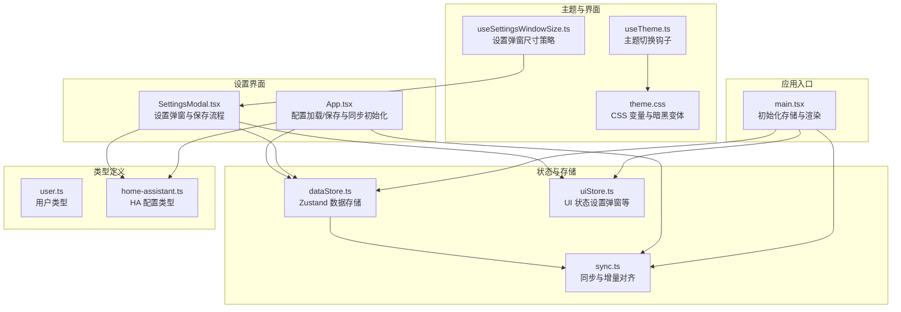
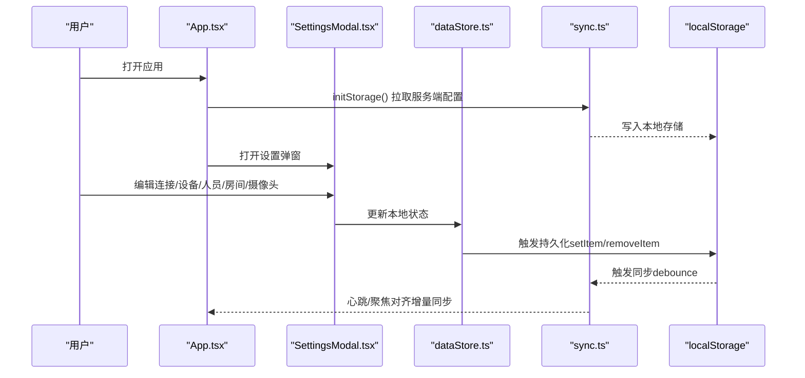
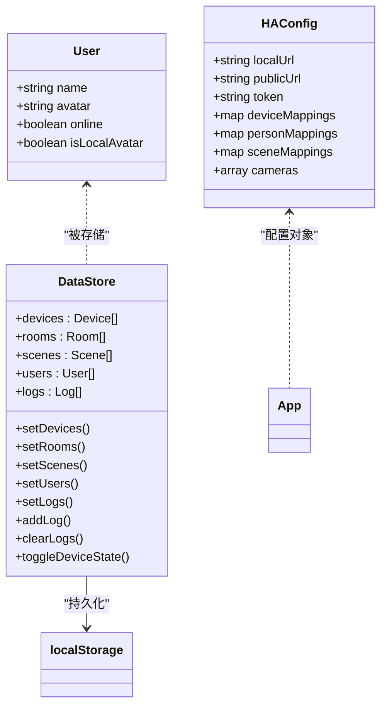
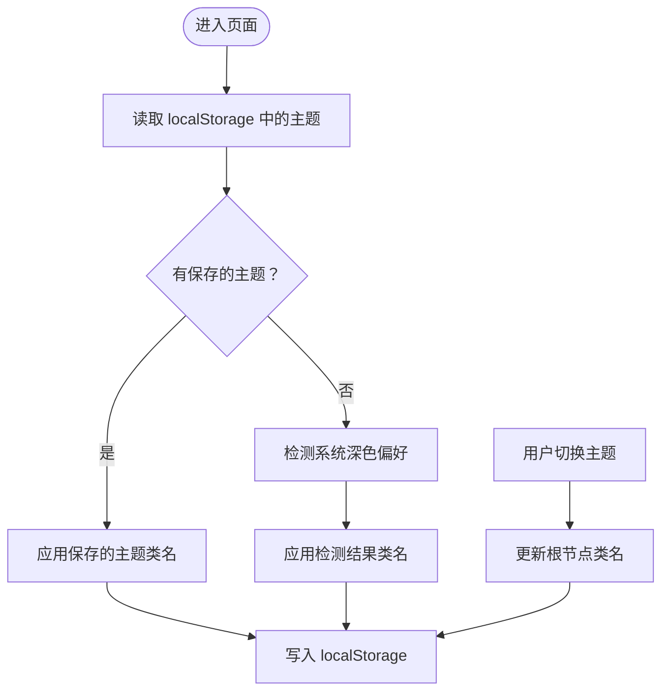
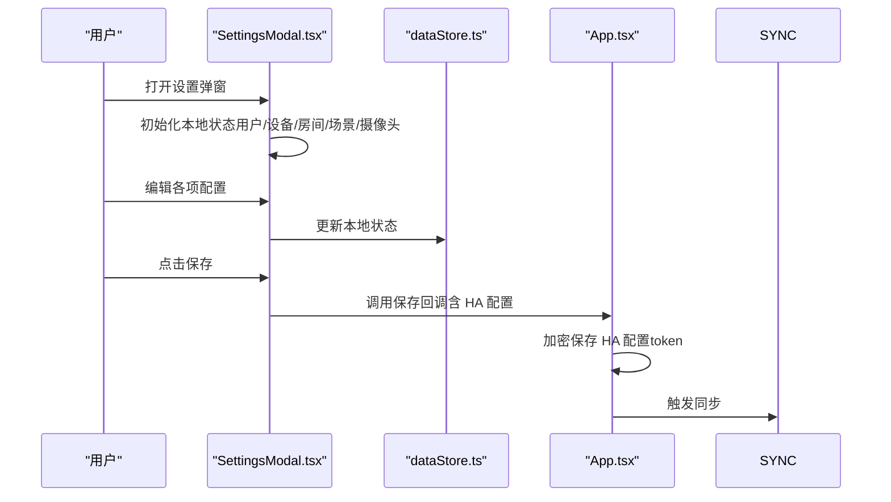
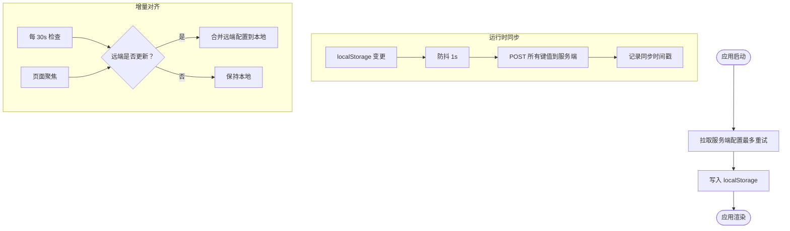
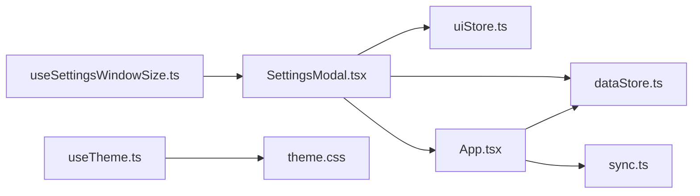

# 用户偏好设置

<cite>
**本文引用的文件**
- [src/store/dataStore.ts](file://src/store/dataStore.ts)
- [src/store/uiStore.ts](file://src/store/uiStore.ts)
- [src/hooks/useTheme.ts](file://src/hooks/useTheme.ts)
- [src/styles/theme.css](file://src/styles/theme.css)
- [src/hooks/useSettingsWindowSize.ts](file://src/hooks/useSettingsWindowSize.ts)
- [src/app/components/SettingsModal.tsx](file://src/app/components/SettingsModal.tsx)
- [src/utils/sync.ts](file://src/utils/sync.ts)
- [src/main.tsx](file://src/main.tsx)
- [src/app/App.tsx](file://src/app/App.tsx)
- [src/types/user.ts](file://src/types/user.ts)
- [src/types/home-assistant.ts](file://src/types/home-assistant.ts)
</cite>

## 目录
1. [简介](#简介)
2. [项目结构](#项目结构)
3. [核心组件](#核心组件)
4. [架构总览](#架构总览)
5. [详细组件分析](#详细组件分析)
6. [依赖关系分析](#依赖关系分析)
7. [性能考量](#性能考量)
8. [故障排查指南](#故障排查指南)
9. [结论](#结论)
10. [附录](#附录)

## 简介
本技术文档围绕用户偏好设置展开，系统性阐述以下方面：
- 用户配置的数据模型与存储策略
- 主题切换机制与暗黑模式支持
- 语言本地化支持现状与扩展建议
- 偏好数据的同步机制与跨设备一致性
- 个性化定制能力与导入导出、备份恢复思路
- 自定义主题、语言扩展与偏好扩展的开发指南

## 项目结构
用户偏好设置涉及的模块主要分布在以下层次：
- 存储层：Zustand 状态与本地持久化（localStorage）
- UI 层：设置弹窗、主题钩子、窗口尺寸钩子
- 同步层：跨设备同步与增量对齐
- 类型层：用户与 Home Assistant 配置的数据契约

**图表来源**
- [src/main.tsx:18-67](file://src/main.tsx#L18-L67)
- [src/store/dataStore.ts:58-128](file://src/store/dataStore.ts#L58-L128)
- [src/store/uiStore.ts:31-55](file://src/store/uiStore.ts#L31-L55)
- [src/utils/sync.ts:52-131](file://src/utils/sync.ts#L52-L131)
- [src/hooks/useTheme.ts:3-25](file://src/hooks/useTheme.ts#L3-L25)
- [src/styles/theme.css:1-120](file://src/styles/theme.css#L1-L120)
- [src/hooks/useSettingsWindowSize.ts:12-56](file://src/hooks/useSettingsWindowSize.ts#L12-L56)
- [src/app/components/SettingsModal.tsx:33-191](file://src/app/components/SettingsModal.tsx#L33-L191)
- [src/app/App.tsx:228-263](file://src/app/App.tsx#L228-L263)
- [src/types/user.ts:1-7](file://src/types/user.ts#L1-L7)
- [src/types/home-assistant.ts:3-11](file://src/types/home-assistant.ts#L3-L11)

**章节来源**
- [src/main.tsx:18-67](file://src/main.tsx#L18-L67)
- [src/store/dataStore.ts:58-128](file://src/store/dataStore.ts#L58-L128)
- [src/store/uiStore.ts:31-55](file://src/store/uiStore.ts#L31-L55)
- [src/utils/sync.ts:52-131](file://src/utils/sync.ts#L52-L131)
- [src/hooks/useTheme.ts:3-25](file://src/hooks/useTheme.ts#L3-L25)
- [src/styles/theme.css:1-120](file://src/styles/theme.css#L1-L120)
- [src/hooks/useSettingsWindowSize.ts:12-56](file://src/hooks/useSettingsWindowSize.ts#L12-L56)
- [src/app/components/SettingsModal.tsx:33-191](file://src/app/components/SettingsModal.tsx#L33-L191)
- [src/app/App.tsx:228-263](file://src/app/App.tsx#L228-L263)
- [src/types/user.ts:1-7](file://src/types/user.ts#L1-L7)
- [src/types/home-assistant.ts:3-11](file://src/types/home-assistant.ts#L3-L11)

## 核心组件
- 数据存储与持久化：基于 Zustand 的 dataStore，采用 localStorage 持久化，并通过中间件实现选择性持久化字段与手动触发同步。
- 设置弹窗：集中管理连接配置、设备管理、人员管理、房间管理与摄像头配置，支持一键保存与验证。
- 主题系统：useTheme 钩子与 CSS 变量配合，支持明暗主题切换与持久化。
- 同步机制：initStorage 在应用启动时从服务端拉取配置，随后以 localStorage 变更触发同步；同时提供心跳与聚焦对齐。
- 类型模型：用户类型与 HA 配置类型明确字段边界，便于扩展与校验。

**章节来源**
- [src/store/dataStore.ts:58-128](file://src/store/dataStore.ts#L58-L128)
- [src/app/components/SettingsModal.tsx:33-191](file://src/app/components/SettingsModal.tsx#L33-L191)
- [src/hooks/useTheme.ts:3-25](file://src/hooks/useTheme.ts#L3-L25)
- [src/styles/theme.css:1-120](file://src/styles/theme.css#L1-L120)
- [src/utils/sync.ts:52-131](file://src/utils/sync.ts#L52-L131)
- [src/app/App.tsx:228-263](file://src/app/App.tsx#L228-L263)
- [src/types/user.ts:1-7](file://src/types/user.ts#L1-L7)
- [src/types/home-assistant.ts:3-11](file://src/types/home-assistant.ts#L3-L11)

## 架构总览
用户偏好设置的端到端流程包括：应用启动时从服务端拉取配置、本地持久化与主题初始化、设置弹窗的交互与保存、以及变更后的跨设备同步。

**图表来源**
- [src/main.tsx:18-67](file://src/main.tsx#L18-L67)
- [src/app/App.tsx:311-325](file://src/app/App.tsx#L311-L325)
- [src/app/components/SettingsModal.tsx:172-185](file://src/app/components/SettingsModal.tsx#L172-L185)
- [src/store/dataStore.ts:108-116](file://src/store/dataStore.ts#L108-L116)
- [src/utils/sync.ts:52-93](file://src/utils/sync.ts#L52-L93)

## 详细组件分析

### 数据模型与存储策略
- 用户类型：包含姓名、头像、在线状态与本地头像标记，用于区分本地上传头像与 HA 同步头像。
- HA 配置类型：包含本地/公网地址、长期访问令牌、设备/人员/场景映射及摄像头配置。
- 数据存储：Zustand store 通过 persist 中间件选择性持久化设备、房间、场景、用户与日志；localStorage 作为最终落盘介质。
- 加密存储：应用侧对 HA 配置中的令牌进行加密存储，读取时解密，降低泄露风险。
- 同步触发：localStorage 的 setItem/removeItem 会手动触发同步，避免劫持监听带来的副作用。

**图表来源**
- [src/types/user.ts:1-7](file://src/types/user.ts#L1-L7)
- [src/types/home-assistant.ts:3-11](file://src/types/home-assistant.ts#L3-L11)
- [src/store/dataStore.ts:9-28](file://src/store/dataStore.ts#L9-L28)
- [src/app/App.tsx:228-263](file://src/app/App.tsx#L228-L263)

**章节来源**
- [src/types/user.ts:1-7](file://src/types/user.ts#L1-L7)
- [src/types/home-assistant.ts:3-11](file://src/types/home-assistant.ts#L3-L11)
- [src/store/dataStore.ts:58-128](file://src/store/dataStore.ts#L58-L128)
- [src/app/App.tsx:228-263](file://src/app/App.tsx#L228-L263)

### 主题切换机制与暗黑模式
- 主题钩子：useTheme 优先读取 localStorage 中的主题值，若不存在则根据系统偏好检测；切换时更新根节点类名并持久化。
- CSS 变量：theme.css 定义明/暗两套变量，并通过自定义变体选择器实现暗黑模式切换。
- 设计模式：采用“类名驱动 + CSS 变量”的轻量级主题系统，无需额外运行时计算，性能友好。

**图表来源**
- [src/hooks/useTheme.ts:3-25](file://src/hooks/useTheme.ts#L3-L25)
- [src/styles/theme.css:1-120](file://src/styles/theme.css#L1-L120)

**章节来源**
- [src/hooks/useTheme.ts:3-25](file://src/hooks/useTheme.ts#L3-L25)
- [src/styles/theme.css:1-120](file://src/styles/theme.css#L1-L120)

### 语言本地化支持
- 当前仓库未发现 i18n 相关依赖与实现，因此语言本地化尚未启用。
- 建议：引入 i18n 框架并在应用启动时按系统语言或用户偏好加载对应资源包，结合回退策略保证稳定性。

[本节为概念性说明，不直接分析具体文件，故不附“章节来源”]

### 设置弹窗与个性化定制
- 设置弹窗：集中展示连接配置、设备管理、人员管理、房间管理与摄像头配置，支持标签页切换与一键保存。
- 人员管理：支持本地头像上传、头像清除与人员增删，本地头像标记避免被 HA 同步覆盖。
- 设备/房间/场景：支持在设置中维护与 Home Assistant 的映射关系，便于后续自动化与状态同步。
- 窗口尺寸策略：首次打开时根据屏幕分辨率计算并持久化弹窗尺寸，锁定尺寸以提升体验一致性。

**图表来源**
- [src/app/components/SettingsModal.tsx:33-191](file://src/app/components/SettingsModal.tsx#L33-L191)
- [src/store/dataStore.ts:67-102](file://src/store/dataStore.ts#L67-L102)
- [src/app/App.tsx:253-263](file://src/app/App.tsx#L253-L263)

**章节来源**
- [src/app/components/SettingsModal.tsx:33-191](file://src/app/components/SettingsModal.tsx#L33-L191)
- [src/hooks/useSettingsWindowSize.ts:12-56](file://src/hooks/useSettingsWindowSize.ts#L12-L56)
- [src/types/user.ts:1-7](file://src/types/user.ts#L1-L7)

### 同步机制与跨设备一致性
- 启动同步：应用启动时通过 initStorage 从服务端拉取配置，最多重试三次，超时与异常均有兜底。
- 变更同步：localStorage 变更后以防抖方式触发同步，将所有键值对上传至服务端存储。
- 增量对齐：心跳每 30 秒检查远端版本，页面聚焦时也触发对齐；仅在远端版本较新时才更新本地。
- 事件通知：对齐完成后触发自定义事件，通知 Store 刷新。

**图表来源**
- [src/main.tsx:18-67](file://src/main.tsx#L18-L67)
- [src/utils/sync.ts:52-131](file://src/utils/sync.ts#L52-L131)

**章节来源**
- [src/main.tsx:18-67](file://src/main.tsx#L18-L67)
- [src/utils/sync.ts:52-131](file://src/utils/sync.ts#L52-L131)

## 依赖关系分析
- 组件耦合：SettingsModal 依赖 dataStore 与 uiStore，同时与 App 的配置保存流程耦合。
- 外部依赖：同步层依赖 fetchWithTimeout 与 getStorageUrl；主题层依赖 CSS 变量与类名切换。
- 潜在循环：当前未见明显循环依赖；主题与样式为纯 UI 表现层，不依赖业务状态。

**图表来源**
- [src/app/components/SettingsModal.tsx:33-191](file://src/app/components/SettingsModal.tsx#L33-L191)
- [src/store/dataStore.ts:58-128](file://src/store/dataStore.ts#L58-L128)
- [src/store/uiStore.ts:31-55](file://src/store/uiStore.ts#L31-L55)
- [src/app/App.tsx:228-263](file://src/app/App.tsx#L228-L263)
- [src/utils/sync.ts:4-24](file://src/utils/sync.ts#L4-L24)
- [src/hooks/useTheme.ts:3-25](file://src/hooks/useTheme.ts#L3-L25)
- [src/styles/theme.css:1-120](file://src/styles/theme.css#L1-L120)
- [src/hooks/useSettingsWindowSize.ts:12-56](file://src/hooks/useSettingsWindowSize.ts#L12-L56)

**章节来源**
- [src/app/components/SettingsModal.tsx:33-191](file://src/app/components/SettingsModal.tsx#L33-L191)
- [src/store/dataStore.ts:58-128](file://src/store/dataStore.ts#L58-L128)
- [src/store/uiStore.ts:31-55](file://src/store/uiStore.ts#L31-L55)
- [src/app/App.tsx:228-263](file://src/app/App.tsx#L228-L263)
- [src/utils/sync.ts:4-24](file://src/utils/sync.ts#L4-L24)
- [src/hooks/useTheme.ts:3-25](file://src/hooks/useTheme.ts#L3-L25)
- [src/styles/theme.css:1-120](file://src/styles/theme.css#L1-L120)
- [src/hooks/useSettingsWindowSize.ts:12-56](file://src/hooks/useSettingsWindowSize.ts#L12-L56)

## 性能考量
- 同步防抖：localStorage 变更后 1s 防抖，减少频繁网络请求。
- 心跳与对齐：30s 心跳与聚焦触发，兼顾实时性与性能。
- 主题切换：类名切换 + CSS 变量，避免重排与重绘成本。
- 首屏加载：initStorage 带超时与重试，确保首屏不阻塞。

[本节为通用指导，不直接分析具体文件，故不附“章节来源”]

## 故障排查指南
- 同步失败
  - 现象：保存后跨设备不同步或版本不一致。
  - 排查：确认 getStorageUrl 是否正确、网络是否可达、服务端返回状态码。
  - 参考
    - [src/utils/sync.ts:4-24](file://src/utils/sync.ts#L4-L24)
    - [src/utils/sync.ts:74-93](file://src/utils/sync.ts#L74-L93)
    - [src/utils/sync.ts:102-131](file://src/utils/sync.ts#L102-L131)
- 配置拉取失败
  - 现象：应用启动后配置未加载。
  - 排查：检查 initStorage 的重试次数与超时设置，确认服务端返回 JSON。
  - 参考
    - [src/main.tsx:18-67](file://src/main.tsx#L18-L67)
- 主题切换异常
  - 现象：切换主题后未生效或刷新后丢失。
  - 排查：确认 useTheme 是否正确写入 localStorage，CSS 变量是否在根节点生效。
  - 参考
    - [src/hooks/useTheme.ts:3-25](file://src/hooks/useTheme.ts#L3-L25)
    - [src/styles/theme.css:1-120](file://src/styles/theme.css#L1-L120)
- 设置弹窗尺寸异常
  - 现象：弹窗尺寸不符合预期或无法保持。
  - 排查：确认 useSettingsWindowSize 的初始化逻辑与 localStorage 写入时机。
  - 参考
    - [src/hooks/useSettingsWindowSize.ts:12-56](file://src/hooks/useSettingsWindowSize.ts#L12-L56)

**章节来源**
- [src/utils/sync.ts:4-24](file://src/utils/sync.ts#L4-L24)
- [src/utils/sync.ts:74-93](file://src/utils/sync.ts#L74-L93)
- [src/utils/sync.ts:102-131](file://src/utils/sync.ts#L102-L131)
- [src/main.tsx:18-67](file://src/main.tsx#L18-L67)
- [src/hooks/useTheme.ts:3-25](file://src/hooks/useTheme.ts#L3-L25)
- [src/styles/theme.css:1-120](file://src/styles/theme.css#L1-L120)
- [src/hooks/useSettingsWindowSize.ts:12-56](file://src/hooks/useSettingsWindowSize.ts#L12-L56)

## 结论
本项目在用户偏好设置方面形成了较为完善的体系：以 Zustand 为核心的状态管理、以 localStorage 为基础的持久化、以 CSS 变量与类名切换为主题系统、以服务端同步实现跨设备一致性。设置弹窗提供了连接配置、设备/人员/房间/摄像头的集中管理能力。未来可在语言本地化、导入导出与备份恢复等方面进一步完善，以满足更广泛的用户需求。

[本节为总结性内容，不直接分析具体文件，故不附“章节来源”]

## 附录

### 导入导出、备份恢复与隐私保护建议
- 导入导出
  - 导出：将 localStorage 中的用户配置与设备/房间/场景/日志等关键键值序列化为 JSON 文件。
  - 导入：从文件读取并逐项写入 localStorage，随后触发增量对齐。
- 备份恢复
  - 定期导出配置作为备份；恢复时先清空或保留冲突键，再执行导入。
- 隐私保护
  - 对敏感字段（如 HA 令牌）进行加密存储；在导出时可选择性剔除或加密。
  - 使用 HTTPS 传输与服务端认证，防止中间人攻击。

[本节为概念性说明，不直接分析具体文件，故不附“章节来源”]

### 自定义主题、语言扩展与偏好扩展开发指南
- 自定义主题
  - 在 theme.css 中新增 CSS 变量与对应明/暗两套值，通过 useTheme 切换类名即可生效。
  - 参考
    - [src/styles/theme.css:1-120](file://src/styles/theme.css#L1-L120)
    - [src/hooks/useTheme.ts:3-25](file://src/hooks/useTheme.ts#L3-L25)
- 语言扩展
  - 引入 i18n 框架，在应用启动时按系统语言或用户偏好加载资源包。
  - 参考
    - [src/main.tsx:18-67](file://src/main.tsx#L18-L67)
- 偏好扩展
  - 在 dataStore 中新增字段与持久化策略，确保只持久化必要键值。
  - 在 SettingsModal 中增加对应面板，提供可视化配置入口。
  - 参考
    - [src/store/dataStore.ts:58-128](file://src/store/dataStore.ts#L58-L128)
    - [src/app/components/SettingsModal.tsx:33-191](file://src/app/components/SettingsModal.tsx#L33-L191)

**章节来源**
- [src/styles/theme.css:1-120](file://src/styles/theme.css#L1-L120)
- [src/hooks/useTheme.ts:3-25](file://src/hooks/useTheme.ts#L3-L25)
- [src/main.tsx:18-67](file://src/main.tsx#L18-L67)
- [src/store/dataStore.ts:58-128](file://src/store/dataStore.ts#L58-L128)
- [src/app/components/SettingsModal.tsx:33-191](file://src/app/components/SettingsModal.tsx#L33-L191)