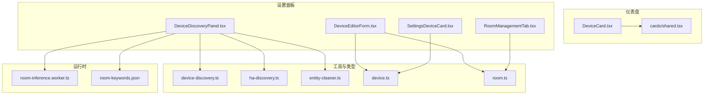
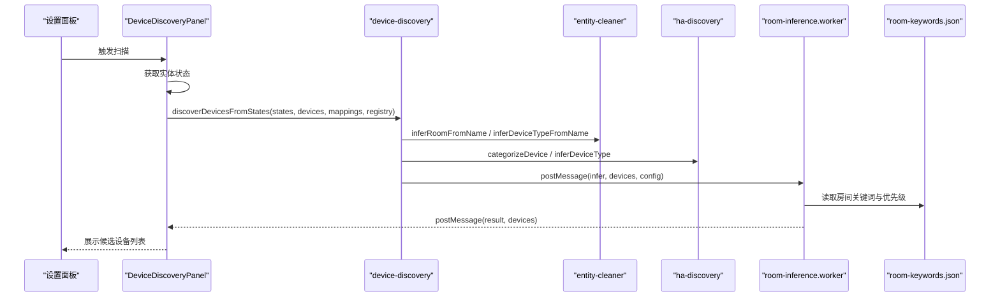
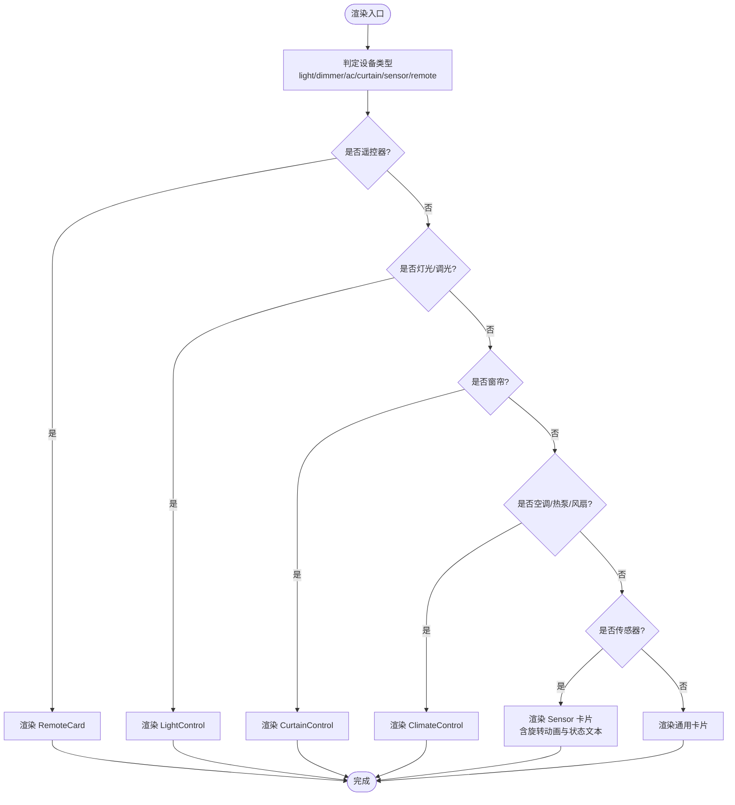
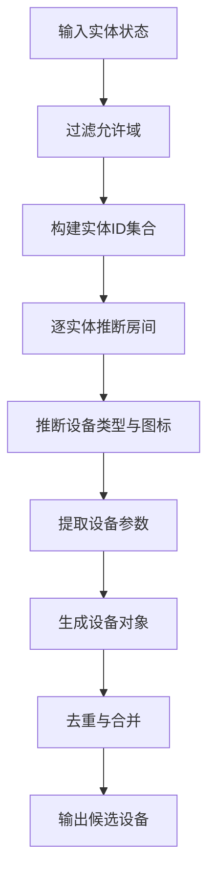
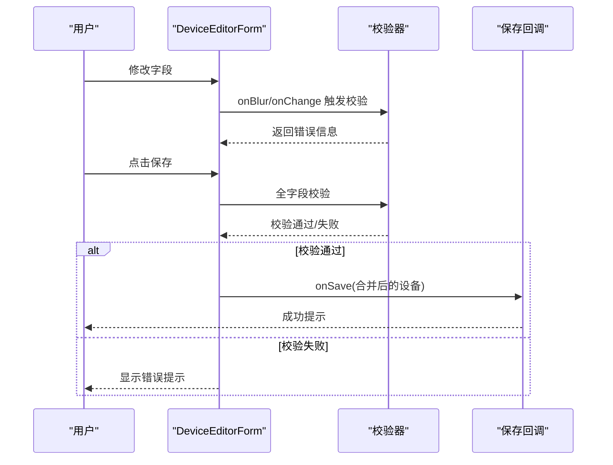
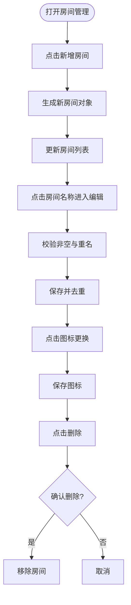
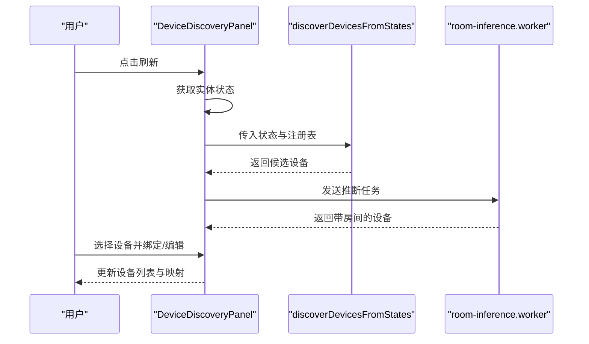
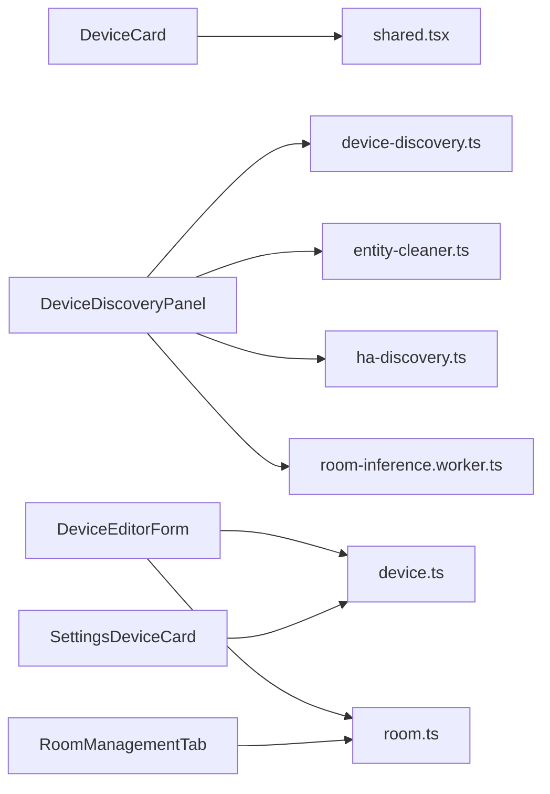

# 设备管理

<cite>
**本文引用的文件**
- [DeviceCard.tsx](file://src/app/components/dashboard/DeviceCard.tsx)
- [device.ts](file://src/types/device.ts)
- [device-discovery.ts](file://src/utils/device-discovery.ts)
- [DeviceEditorForm.tsx](file://src/app/components/settings/DeviceEditorForm.tsx)
- [RoomManagementTab.tsx](file://src/app/components/settings/RoomManagementTab.tsx)
- [DeviceDiscoveryPanel.tsx](file://src/app/components/settings/DeviceDiscoveryPanel.tsx)
- [SettingsDeviceCard.tsx](file://src/app/components/settings/SettingsDeviceCard.tsx)
- [ha-discovery.ts](file://src/utils/ha-discovery.ts)
- [entity-cleaner.ts](file://src/utils/entity-cleaner.ts)
- [room.ts](file://src/types/room.ts)
- [room-inference.worker.ts](file://src/workers/room-inference.worker.ts)
- [room-keywords.json](file://src/config/room-keywords.json)
- [shared.tsx](file://src/app/components/dashboard/cards/shared.tsx)
</cite>

## 目录
1. [简介](#简介)
2. [项目结构](#项目结构)
3. [核心组件](#核心组件)
4. [架构总览](#架构总览)
5. [详细组件分析](#详细组件分析)
6. [依赖关系分析](#依赖关系分析)
7. [性能考量](#性能考量)
8. [故障排查指南](#故障排查指南)
9. [结论](#结论)
10. [附录](#附录)

## 简介
本技术文档围绕设备管理模块进行系统化梳理，重点涵盖：
- 设备卡片组件设计与渲染策略
- 设备状态管理与可见性控制
- 房间组织结构与层级管理
- 设备发现算法与类型分类
- 设备属性配置与编辑流程
- 房间管理的层级结构、设备分配与空间布局
- 设备编辑表单的字段映射、验证逻辑与提交流程
- 设备删除保护、批量操作与设备重命名功能
- 设备类型扩展、自定义属性与设备分组的开发指南

## 项目结构
设备管理模块主要分布在以下目录与文件：
- 仪表盘设备卡片：展示与交互
- 设置面板：设备发现、编辑、房间管理
- 工具与类型：设备发现与清洗、类型定义
- Web Worker：房间推断的异步处理
- 配置：房间关键词优先级

图表来源
- [DeviceCard.tsx:1-293](file://src/app/components/dashboard/DeviceCard.tsx#L1-L293)
- [DeviceDiscoveryPanel.tsx:1-515](file://src/app/components/settings/DeviceDiscoveryPanel.tsx#L1-L515)
- [DeviceEditorForm.tsx:1-574](file://src/app/components/settings/DeviceEditorForm.tsx#L1-L574)
- [RoomManagementTab.tsx:1-195](file://src/app/components/settings/RoomManagementTab.tsx#L1-L195)
- [SettingsDeviceCard.tsx:1-136](file://src/app/components/settings/SettingsDeviceCard.tsx#L1-L136)
- [device-discovery.ts:1-161](file://src/utils/device-discovery.ts#L1-L161)
- [ha-discovery.ts:1-167](file://src/utils/ha-discovery.ts#L1-L167)
- [entity-cleaner.ts:1-381](file://src/utils/entity-cleaner.ts#L1-L381)
- [room-inference.worker.ts:1-73](file://src/workers/room-inference.worker.ts#L1-L73)
- [room-keywords.json:1-34](file://src/config/room-keywords.json#L1-L34)

章节来源
- [DeviceCard.tsx:1-293](file://src/app/components/dashboard/DeviceCard.tsx#L1-L293)
- [DeviceDiscoveryPanel.tsx:1-515](file://src/app/components/settings/DeviceDiscoveryPanel.tsx#L1-L515)
- [DeviceEditorForm.tsx:1-574](file://src/app/components/settings/DeviceEditorForm.tsx#L1-L574)
- [RoomManagementTab.tsx:1-195](file://src/app/components/settings/RoomManagementTab.tsx#L1-L195)
- [SettingsDeviceCard.tsx:1-136](file://src/app/components/settings/SettingsDeviceCard.tsx#L1-L136)
- [device-discovery.ts:1-161](file://src/utils/device-discovery.ts#L1-L161)
- [ha-discovery.ts:1-167](file://src/utils/ha-discovery.ts#L1-L167)
- [entity-cleaner.ts:1-381](file://src/utils/entity-cleaner.ts#L1-L381)
- [room-inference.worker.ts:1-73](file://src/workers/room-inference.worker.ts#L1-L73)
- [room-keywords.json:1-34](file://src/config/room-keywords.json#L1-L34)

## 核心组件
- 设备卡片组件：根据设备类型动态渲染不同卡片，支持编辑态切换与通用设备标记
- 设备发现面板：扫描 Home Assistant 实体，结合房间关键词与分类规则生成候选设备
- 设备编辑表单：字段校验、实体绑定、类型与分类推荐、图标选择与保存
- 房间管理标签页：房间增删改查、图标更换、排序与名称去重
- 设置设备卡片：设置页中的设备概览卡片，支持选择与编辑入口
- 工具与类型：设备发现与清洗、类型分类、实体参数提取、房间推断

章节来源
- [DeviceCard.tsx:26-292](file://src/app/components/dashboard/DeviceCard.tsx#L26-L292)
- [DeviceDiscoveryPanel.tsx:34-514](file://src/app/components/settings/DeviceDiscoveryPanel.tsx#L34-L514)
- [DeviceEditorForm.tsx:96-573](file://src/app/components/settings/DeviceEditorForm.tsx#L96-L573)
- [RoomManagementTab.tsx:12-194](file://src/app/components/settings/RoomManagementTab.tsx#L12-L194)
- [SettingsDeviceCard.tsx:30-135](file://src/app/components/settings/SettingsDeviceCard.tsx#L30-L135)
- [device-discovery.ts:12-160](file://src/utils/device-discovery.ts#L12-L160)
- [ha-discovery.ts:89-166](file://src/utils/ha-discovery.ts#L89-L166)
- [entity-cleaner.ts:171-380](file://src/utils/entity-cleaner.ts#L171-L380)

## 架构总览
设备管理模块采用“发现-清洗-分类-渲染”的流水线架构：
- 发现阶段：从 Home Assistant 获取实体状态，构建候选设备集合
- 清洗阶段：基于实体注册表、领域(domain)与属性(attributes)推断房间、类型与图标
- 分类阶段：按领域与设备类别进行归类，并生成统一的设备模型
- 渲染阶段：仪表盘卡片按类型差异化渲染；设置面板提供编辑与批量操作

图表来源
- [DeviceDiscoveryPanel.tsx:86-121](file://src/app/components/settings/DeviceDiscoveryPanel.tsx#L86-L121)
- [device-discovery.ts:12-160](file://src/utils/device-discovery.ts#L12-L160)
- [entity-cleaner.ts:171-255](file://src/utils/entity-cleaner.ts#L171-L255)
- [ha-discovery.ts:89-166](file://src/utils/ha-discovery.ts#L89-L166)
- [room-inference.worker.ts:24-72](file://src/workers/room-inference.worker.ts#L24-L72)
- [room-keywords.json:1-34](file://src/config/room-keywords.json#L1-L34)

## 详细组件分析

### 设备卡片组件（DeviceCard）
- 设计目标：按设备类型渲染差异化卡片，支持编辑态下的通用设备标记与交互
- 关键特性：
  - 类型判定：灯光(light/dimmer)、空调(ac/climate/heater/fan)、窗帘(curtain)、遥控(remote)、传感器(sensor/binary_sensor等)
  - 传感器状态文本：根据设备类别与图标动态生成状态文案
  - 编辑态：显示通用设备按钮，支持切换 isCommon
  - 性能优化：对传感器类型使用 nowMs 进行时间相关渲染，其他类型忽略时间变化以减少重渲染
- 交互与事件：
  - 点击卡片进入详情/控制
  - 切换开关 onToggle
  - 通用设备标记 onToggleCommon
  - 更新 onUpdate、位置变更 onPositionChange、发送红外码 onSendIR

图表来源
- [DeviceCard.tsx:26-265](file://src/app/components/dashboard/DeviceCard.tsx#L26-L265)
- [shared.tsx:75-140](file://src/app/components/dashboard/cards/shared.tsx#L75-L140)

章节来源
- [DeviceCard.tsx:26-292](file://src/app/components/dashboard/DeviceCard.tsx#L26-L292)
- [shared.tsx:32-250](file://src/app/components/dashboard/cards/shared.tsx#L32-L250)

### 设备发现算法与类型分类
- 发现流程：
  - 输入：Home Assistant 实体状态、现有设备、实体映射、注册表数据
  - 输出：新设备数组、实体映射、新增数量
- 房间推断：
  - 优先级：实体注册表 area → 设备注册表 area → 友好名称关键词 → 默认“未分配”
  - 使用 Web Worker 与房间关键词 JSON 进行高效推断
- 类型推断：
  - 基于友好名称关键词与领域(domain)映射
  - 支持亮度特征区分调光灯与普通灯
  - 二进制传感器与普通传感器细分
- 参数提取：
  - 空调：温度、风速、摆风、模式、上下限
  - 灯：亮度、色温、色温范围、支持色模式
  - 窗帘：当前位置
  - 传感器：单位、设备类别

图表来源
- [device-discovery.ts:12-160](file://src/utils/device-discovery.ts#L12-L160)
- [entity-cleaner.ts:171-380](file://src/utils/entity-cleaner.ts#L171-L380)
- [room-inference.worker.ts:24-72](file://src/workers/room-inference.worker.ts#L24-L72)
- [room-keywords.json:1-34](file://src/config/room-keywords.json#L1-L34)

章节来源
- [device-discovery.ts:12-160](file://src/utils/device-discovery.ts#L12-L160)
- [entity-cleaner.ts:171-380](file://src/utils/entity-cleaner.ts#L171-L380)
- [ha-discovery.ts:89-166](file://src/utils/ha-discovery.ts#L89-L166)
- [room-inference.worker.ts:24-72](file://src/workers/room-inference.worker.ts#L24-L72)
- [room-keywords.json:1-34](file://src/config/room-keywords.json#L1-L34)

### 设备编辑表单（DeviceEditorForm）
- 字段映射：
  - 实体 ID：下拉选择，支持模糊搜索与域名/设备类别提示
  - 设备名称：输入框，长度限制与重名校验
  - 图标：图标选择器，支持自定义图标与 Lucide 图标库
  - 房间：下拉选择，与房间管理同步
  - 设备类型：下拉选择，内置类型选项与推荐分类
  - 分类：根据领域(domain)与类型推断，支持手动调整
- 验证逻辑：
  - 必填项校验：名称、房间、类型、实体ID、分类、图标
  - 名称唯一性：排除当前设备自身
  - 实体ID唯一性：排除已绑定的其他设备
- 提交流程：
  - 校验通过后调用 onSave，合并表单数据与原始设备
  - 删除设备：通过 onDelete 回调触发解绑与删除
- 交互细节：
  - 类型选择联动分类与图标推断
  - 实体选择联动类型、分类、名称与图标
  - 移动端适配：抽屉与弹出层

图表来源
- [DeviceEditorForm.tsx:130-188](file://src/app/components/settings/DeviceEditorForm.tsx#L130-L188)
- [DeviceEditorForm.tsx:253-301](file://src/app/components/settings/DeviceEditorForm.tsx#L253-L301)

章节来源
- [DeviceEditorForm.tsx:96-573](file://src/app/components/settings/DeviceEditorForm.tsx#L96-L573)

### 房间管理（RoomManagementTab）
- 功能点：
  - 新增房间：自动生成唯一ID、默认图标与顺序
  - 重命名：输入框直接编辑，冲突时自动追加序号
  - 图标更换：图标选择器，支持 Lucide 图标库
  - 删除保护：二次确认，防止误删
- 数据结构：
  - 房间类型枚举与默认房间列表
  - 与设备卡片中的房间字段保持一致

图表来源
- [RoomManagementTab.tsx:17-63](file://src/app/components/settings/RoomManagementTab.tsx#L17-L63)
- [room.ts:1-33](file://src/types/room.ts#L1-L33)

章节来源
- [RoomManagementTab.tsx:12-194](file://src/app/components/settings/RoomManagementTab.tsx#L12-L194)
- [room.ts:1-33](file://src/types/room.ts#L1-L33)

### 设备发现面板（DeviceDiscoveryPanel）
- 扫描与刷新：通过 Home Assistant REST API 获取实体状态，触发发现流程
- 列表筛选：支持搜索、分类筛选、批量选择
- 绑定与解绑：将候选设备绑定到本地设备列表，维护实体映射
- 批量操作：选择多个未绑定设备，一次性绑定并覆盖“幽灵设备”
- 编辑入口：进入设备编辑表单，支持删除与保存

图表来源
- [DeviceDiscoveryPanel.tsx:86-121](file://src/app/components/settings/DeviceDiscoveryPanel.tsx#L86-L121)
- [device-discovery.ts:12-160](file://src/utils/device-discovery.ts#L12-L160)
- [room-inference.worker.ts:24-72](file://src/workers/room-inference.worker.ts#L24-L72)

章节来源
- [DeviceDiscoveryPanel.tsx:34-514](file://src/app/components/settings/DeviceDiscoveryPanel.tsx#L34-L514)

### 设置设备卡片（SettingsDeviceCard）
- 展示内容：图标、名称、房间、类型标签、实体ID、在线/离线状态
- 交互能力：点击进入详情、悬停显示编辑按钮、选择模式下的勾选框
- 状态样式：根据在线/离线与开关状态改变颜色与透明度

章节来源
- [SettingsDeviceCard.tsx:30-135](file://src/app/components/settings/SettingsDeviceCard.tsx#L30-L135)

## 依赖关系分析
- 组件耦合：
  - DeviceCard 依赖 shared.tsx 的图标与通用卡片包装
  - DeviceDiscoveryPanel 依赖 device-discovery.ts、entity-cleaner.ts、ha-discovery.ts 与 room-inference.worker.ts
  - DeviceEditorForm 依赖设备类型定义与房间类型
  - RoomManagementTab 依赖房间类型定义
- 外部依赖：
  - Home Assistant 连接与实体注册表
  - Web Worker 用于房间推断的高性能计算
  - 图标库与移动端 UI 组件库

图表来源
- [DeviceCard.tsx:1-11](file://src/app/components/dashboard/DeviceCard.tsx#L1-L11)
- [DeviceDiscoveryPanel.tsx:1-31](file://src/app/components/settings/DeviceDiscoveryPanel.tsx#L1-L31)
- [DeviceEditorForm.tsx:1-12](file://src/app/components/settings/DeviceEditorForm.tsx#L1-L12)
- [RoomManagementTab.tsx:1-6](file://src/app/components/settings/RoomManagementTab.tsx#L1-L6)
- [SettingsDeviceCard.tsx:1-7](file://src/app/components/settings/SettingsDeviceCard.tsx#L1-L7)

章节来源
- [DeviceCard.tsx:1-11](file://src/app/components/dashboard/DeviceCard.tsx#L1-L11)
- [DeviceDiscoveryPanel.tsx:1-31](file://src/app/components/settings/DeviceDiscoveryPanel.tsx#L1-L31)
- [DeviceEditorForm.tsx:1-12](file://src/app/components/settings/DeviceEditorForm.tsx#L1-L12)
- [RoomManagementTab.tsx:1-6](file://src/app/components/settings/RoomManagementTab.tsx#L1-L6)
- [SettingsDeviceCard.tsx:1-7](file://src/app/components/settings/SettingsDeviceCard.tsx#L1-L7)

## 性能考量
- 渲染优化：
  - DeviceCard 对传感器类型使用 nowMs 进行时间相关渲染，其他类型忽略时间变化，避免高频重渲染
- 异步处理：
  - 房间推断通过 Web Worker 异步执行，避免阻塞主线程
- 去重与合并：
  - 设备发现返回的候选设备与已绑定设备进行去重与合并，避免重复渲染
- 批量操作：
  - 批量绑定时一次性生成新 ID 并批量写入映射，减少多次更新成本

章节来源
- [DeviceCard.tsx:277-291](file://src/app/components/dashboard/DeviceCard.tsx#L277-L291)
- [DeviceDiscoveryPanel.tsx:123-174](file://src/app/components/settings/DeviceDiscoveryPanel.tsx#L123-L174)
- [room-inference.worker.ts:24-72](file://src/workers/room-inference.worker.ts#L24-L72)

## 故障排查指南
- 设备未显示或显示为“未分配”房间：
  - 检查实体注册表与友好好名称是否包含房间关键词
  - 确认 room-keywords.json 中的关键词与优先级配置
- 设备类型识别不准确：
  - 检查 entity-cleaner.ts 的关键词映射与领域映射
  - 确认实体 attributes 是否包含正确的 device_class 或 supported_features
- 实体ID冲突：
  - DeviceEditorForm 会校验实体ID唯一性，确保未被其他设备绑定
- 扫描失败：
  - 检查 Home Assistant 连接状态与 token 配置
  - 查看控制台日志与 toast 提示

章节来源
- [DeviceDiscoveryPanel.tsx:115-121](file://src/app/components/settings/DeviceDiscoveryPanel.tsx#L115-L121)
- [DeviceEditorForm.tsx:130-157](file://src/app/components/settings/DeviceEditorForm.tsx#L130-L157)
- [entity-cleaner.ts:171-255](file://src/utils/entity-cleaner.ts#L171-L255)
- [room-keywords.json:1-34](file://src/config/room-keywords.json#L1-L34)

## 结论
设备管理模块通过清晰的发现-清洗-分类-渲染流程，实现了对 Home Assistant 设备的自动化管理与可视化呈现。其组件化设计与严格的验证机制保证了易用性与可靠性，同时通过 Web Worker 与渲染优化提升了性能。房间管理与设备编辑表单提供了灵活的配置能力，满足多样化的家庭自动化场景需求。

## 附录

### 设备类型扩展与自定义属性开发指南
- 扩展设备类型：
  - 在 entity-cleaner.ts 的 DEVICE_TYPE_KEYWORDS 中添加关键词与类型映射
  - 在 DeviceEditorForm 的 DEVICE_TYPE_OPTIONS 中添加类型选项与推荐分类
  - 在 DeviceCard 中增加对应类型的渲染分支
- 自定义属性：
  - 在 entity-cleaner.ts 的 extractEntityParams 中扩展参数提取逻辑
  - 在 device.ts 中扩展 Device 接口字段，确保类型安全
  - 在 DeviceEditorForm 中添加对应的表单项与校验
- 设备分组：
  - 可通过 category 与 type 字段实现分组展示
  - 在设置面板中增加分组筛选与排序功能

章节来源
- [entity-cleaner.ts:62-139](file://src/utils/entity-cleaner.ts#L62-L139)
- [DeviceEditorForm.tsx:46-54](file://src/app/components/settings/DeviceEditorForm.tsx#L46-L54)
- [DeviceCard.tsx:29-36](file://src/app/components/dashboard/DeviceCard.tsx#L29-L36)
- [device.ts:1-46](file://src/types/device.ts#L1-L46)