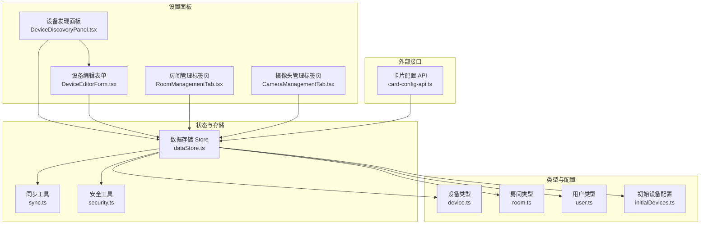
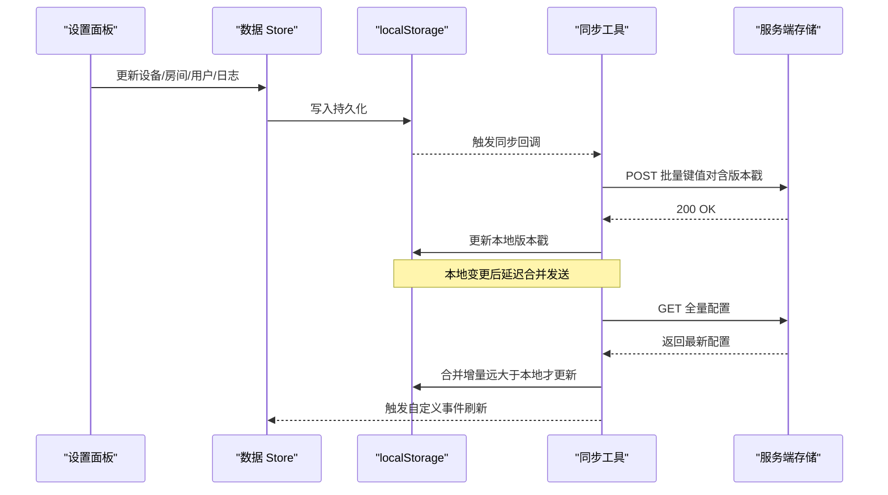
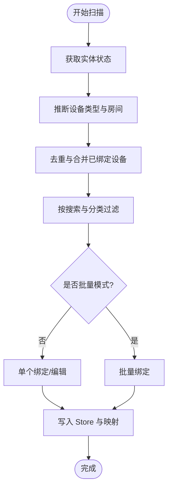
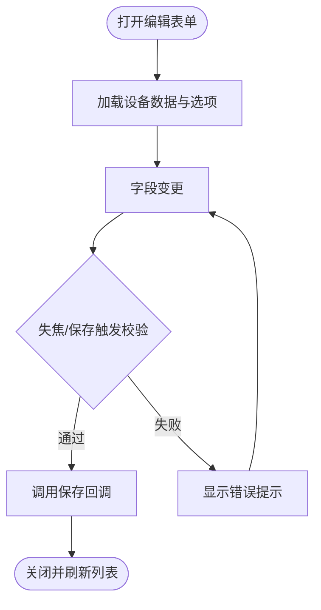
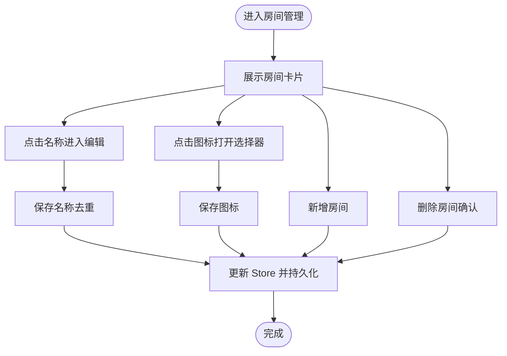
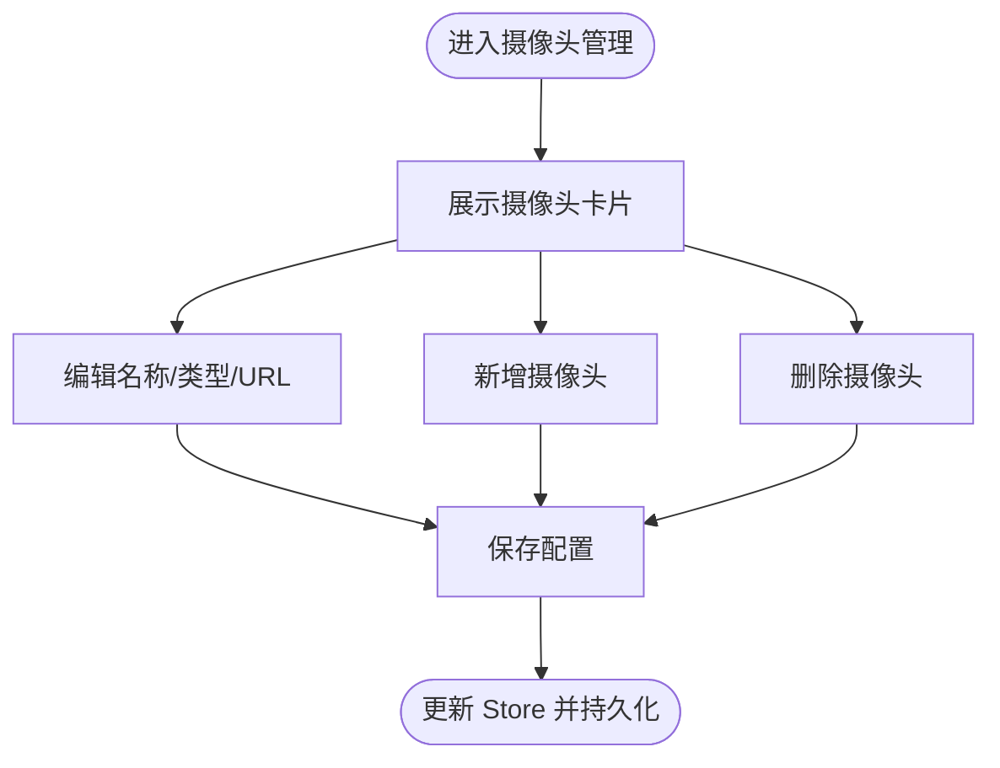
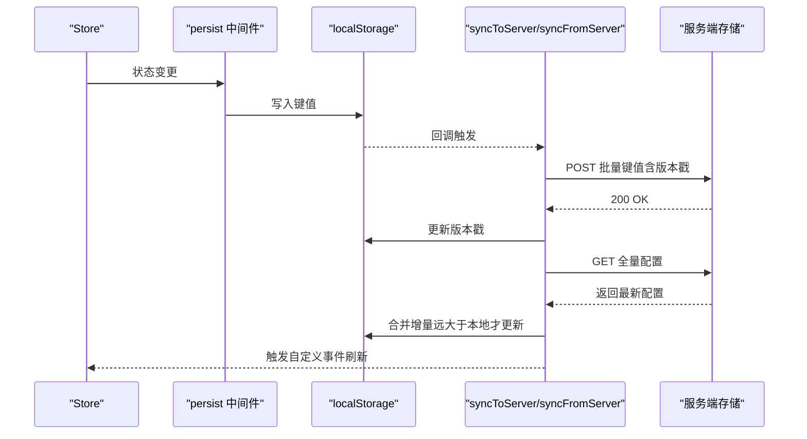
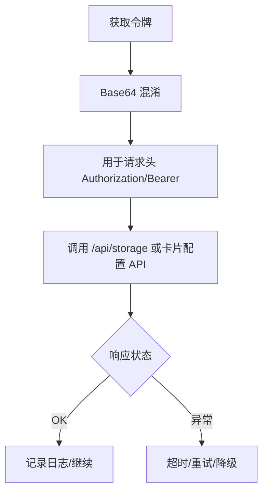
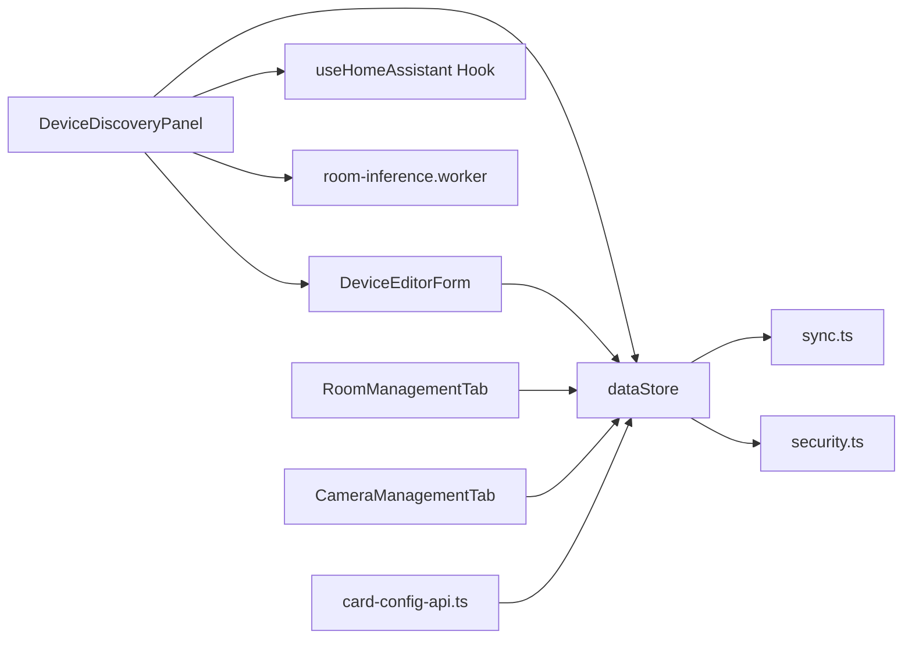

# 配置管理系统

<cite>
**本文引用的文件**   
- [README.md](file://README.md)
- [DeviceEditorForm.tsx](file://src/app/components/settings/DeviceEditorForm.tsx)
- [RoomManagementTab.tsx](file://src/app/components/settings/RoomManagementTab.tsx)
- [DeviceDiscoveryPanel.tsx](file://src/app/components/settings/DeviceDiscoveryPanel.tsx)
- [card-config-api.ts](file://src/services/card-config-api.ts)
- [dataStore.ts](file://src/store/dataStore.ts)
- [sync.ts](file://src/utils/sync.ts)
- [security.ts](file://src/utils/security.ts)
- [device.ts](file://src/types/device.ts)
- [room.ts](file://src/types/room.ts)
- [user.ts](file://src/types/user.ts)
- [initialDevices.ts](file://src/config/initialDevices.ts)
- [CameraManagementTab.tsx](file://src/app/components/settings/CameraManagementTab.tsx)
</cite>

## 目录
1. [简介](#简介)
2. [项目结构](#项目结构)
3. [核心组件](#核心组件)
4. [架构总览](#架构总览)
5. [详细组件分析](#详细组件分析)
6. [依赖关系分析](#依赖关系分析)
7. [性能考量](#性能考量)
8. [故障排查指南](#故障排查指南)
9. [结论](#结论)
10. [附录](#附录)

## 简介
本技术文档围绕配置管理系统展开，系统目标是实现应用设置、设备配置与用户管理的统一架构，提供跨设备的配置持久化与同步、版本控制、权限与安全、以及可扩展的配置面板与批量操作能力。系统特性包括：
- 设备与房间的可视化配置与管理
- 云端同步与版本控制
- 表单验证与实时预览
- 用户与摄像头等扩展配置
- 安全传输与隐私保护

## 项目结构
系统前端采用 React 18 + Vite + Tailwind CSS 构建，配置管理相关代码主要集中在以下模块：
- 设置面板：设备发现、设备编辑、房间管理、摄像头管理
- 存储与同步：Zustand 状态管理 + localStorage + 云端同步
- 类型定义：设备、房间、用户、卡片配置等
- 安全与工具：令牌混淆、网络请求与超时、版本控制

图表来源
- [DeviceDiscoveryPanel.tsx:1-515](file://src/app/components/settings/DeviceDiscoveryPanel.tsx#L1-L515)
- [DeviceEditorForm.tsx:1-574](file://src/app/components/settings/DeviceEditorForm.tsx#L1-L574)
- [RoomManagementTab.tsx:1-195](file://src/app/components/settings/RoomManagementTab.tsx#L1-L195)
- [CameraManagementTab.tsx:1-188](file://src/app/components/settings/CameraManagementTab.tsx#L1-L188)
- [dataStore.ts:1-129](file://src/store/dataStore.ts#L1-L129)
- [sync.ts:1-161](file://src/utils/sync.ts#L1-L161)
- [security.ts:1-27](file://src/utils/security.ts#L1-L27)
- [device.ts:1-46](file://src/types/device.ts#L1-L46)
- [room.ts:1-33](file://src/types/room.ts#L1-L33)
- [user.ts:1-7](file://src/types/user.ts#L1-L7)
- [initialDevices.ts:1-68](file://src/config/initialDevices.ts#L1-L68)
- [card-config-api.ts:1-32](file://src/services/card-config-api.ts#L1-L32)

章节来源
- [README.md:1-84](file://README.md#L1-L84)

## 核心组件
- 设备发现与绑定：通过 Home Assistant 实体状态扫描，结合关键词推断房间，支持单个与批量绑定、去重与严格绑定校验。
- 设备编辑表单：提供实体选择、名称、图标、房间、类型、分类等字段的表单校验与实时反馈。
- 房间管理：支持房间图标与名称的在线编辑、新增与删除。
- 摄像头管理：支持 HA HLS 与 Ezviz 两种流媒体类型，提供 URL 与访问令牌配置。
- 数据存储与同步：Zustand + localStorage + 云端同步，带版本戳与增量对齐。
- 安全与隐私：令牌混淆（Base64），网络请求超时与凭据携带策略。

章节来源
- [DeviceDiscoveryPanel.tsx:1-515](file://src/app/components/settings/DeviceDiscoveryPanel.tsx#L1-L515)
- [DeviceEditorForm.tsx:1-574](file://src/app/components/settings/DeviceEditorForm.tsx#L1-L574)
- [RoomManagementTab.tsx:1-195](file://src/app/components/settings/RoomManagementTab.tsx#L1-L195)
- [CameraManagementTab.tsx:1-188](file://src/app/components/settings/CameraManagementTab.tsx#L1-L188)
- [dataStore.ts:1-129](file://src/store/dataStore.ts#L1-L129)
- [sync.ts:1-161](file://src/utils/sync.ts#L1-L161)
- [security.ts:1-27](file://src/utils/security.ts#L1-L27)

## 架构总览
系统采用“本地状态 + 云端持久化”的双层架构：
- 本地层：Zustand Store 管理设备、房间、场景、用户、日志等；localStorage 作为持久化介质。
- 同步层：通过同步工具将 localStorage 中的键值对提交到服务端存储接口，同时周期性从服务端拉取增量更新。
- 配置面板层：以组件化形式提供设备发现、设备编辑、房间与摄像头管理等 UI。

图表来源
- [dataStore.ts:106-127](file://src/store/dataStore.ts#L106-L127)
- [sync.ts:52-131](file://src/utils/sync.ts#L52-L131)

## 详细组件分析

### 设备发现与绑定流程
- 输入：Home Assistant 连接配置（含令牌）、已绑定设备映射、房间关键词配置。
- 处理：扫描实体状态，推断设备类型与房间，去重与严格绑定校验，支持批量选择与一键绑定。
- 输出：生成待绑定设备列表，支持编辑与保存为持久化设备。

图表来源
- [DeviceDiscoveryPanel.tsx:86-320](file://src/app/components/settings/DeviceDiscoveryPanel.tsx#L86-L320)

章节来源
- [DeviceDiscoveryPanel.tsx:1-515](file://src/app/components/settings/DeviceDiscoveryPanel.tsx#L1-L515)

### 设备编辑表单与验证
- 字段：实体 ID、名称、图标、房间、类型、分类。
- 校验规则：必填、长度限制、唯一性、实体占用校验、推荐类型与分类联动。
- 交互：桌面端使用 Popover，移动端使用 Drawer；支持即时错误提示与保存按钮状态联动。

图表来源
- [DeviceEditorForm.tsx:120-188](file://src/app/components/settings/DeviceEditorForm.tsx#L120-L188)

章节来源
- [DeviceEditorForm.tsx:1-574](file://src/app/components/settings/DeviceEditorForm.tsx#L1-L574)

### 房间管理与图标选择
- 支持在线编辑房间名称（含去重冲突处理）、图标更换、新增与删除。
- 使用图标选择弹窗组件，提供一致的交互体验。

图表来源
- [RoomManagementTab.tsx:17-63](file://src/app/components/settings/RoomManagementTab.tsx#L17-L63)

章节来源
- [RoomManagementTab.tsx:1-195](file://src/app/components/settings/RoomManagementTab.tsx#L1-L195)

### 摄像头管理与配置
- 支持 HA HLS 与 Ezviz 两种类型，分别填写流地址与访问令牌。
- 提供新增、编辑、删除与操作提示。

图表来源
- [CameraManagementTab.tsx:14-36](file://src/app/components/settings/CameraManagementTab.tsx#L14-L36)

章节来源
- [CameraManagementTab.tsx:1-188](file://src/app/components/settings/CameraManagementTab.tsx#L1-L188)

### 数据存储与同步机制
- Store 层：Zustand + persist，选择性持久化设备、房间、场景、用户、日志。
- 同步策略：localStorage 变更触发延迟合并发送，服务端返回后更新本地版本戳；周期性轮询与页面聚焦对齐。
- 版本控制：使用统一的版本戳键进行远小于本地则忽略更新的策略。

图表来源
- [dataStore.ts:106-127](file://src/store/dataStore.ts#L106-L127)
- [sync.ts:52-131](file://src/utils/sync.ts#L52-L131)

章节来源
- [dataStore.ts:1-129](file://src/store/dataStore.ts#L1-L129)
- [sync.ts:1-161](file://src/utils/sync.ts#L1-L161)

### 权限与安全
- 令牌混淆：前端对令牌进行 Base64 混淆，便于避免屏幕截图泄露，但不提供强加密。
- 请求凭据：同步与卡片配置 API 使用携带 Cookie 的请求头，确保在嵌入式环境下正确鉴权。
- 网络超时：统一的超时控制与重试策略，提升弱网稳定性。

图表来源
- [security.ts:1-27](file://src/utils/security.ts#L1-L27)
- [sync.ts:29-41](file://src/utils/sync.ts#L29-L41)
- [card-config-api.ts:3-14](file://src/services/card-config-api.ts#L3-L14)

章节来源
- [security.ts:1-27](file://src/utils/security.ts#L1-L27)
- [card-config-api.ts:1-32](file://src/services/card-config-api.ts#L1-L32)
- [sync.ts:1-161](file://src/utils/sync.ts#L1-L161)

### 配置导入导出与备份恢复
- 导入：通过同步工具从服务端拉取全量配置，合并到本地存储。
- 导出：将 localStorage 中的键值对批量提交到服务端存储。
- 备份：利用版本戳与增量对齐，避免覆盖本地最新变更。
- 恢复：在新设备或新浏览器中首次启动时，自动尝试拉取服务端配置。

章节来源
- [sync.ts:98-131](file://src/utils/sync.ts#L98-L131)
- [sync.ts:52-93](file://src/utils/sync.ts#L52-L93)

### 扩展与自定义字段
- 卡片配置 API：提供卡片配置的读取与保存，支持按卡片 ID 精确管理。
- 设备类型扩展：设备接口包含丰富的属性（如 hvac_modes、fan_modes、swing_modes、brightness、color_temp 等），便于扩展空调、灯光等设备的高级配置。
- 房间类型扩展：房间接口支持图标、容量、排序等字段，满足不同空间管理需求。
- 用户扩展：用户接口包含头像与在线状态，支持本地头像标记防止被 HA 自动同步覆盖。

章节来源
- [card-config-api.ts:1-32](file://src/services/card-config-api.ts#L1-L32)
- [device.ts:1-46](file://src/types/device.ts#L1-L46)
- [room.ts:1-33](file://src/types/room.ts#L1-L33)
- [user.ts:1-7](file://src/types/user.ts#L1-L7)

### 批量操作开发指南
- 设备批量绑定：在设备发现面板中启用批量模式，勾选多个未绑定设备后一键绑定，内部处理去重与映射更新。
- 房间批量命名：房间管理支持在线编辑名称，自动去重并生成唯一名称。
- 摄像头批量配置：通过表格化卡片进行批量新增与编辑。

章节来源
- [DeviceDiscoveryPanel.tsx:262-320](file://src/app/components/settings/DeviceDiscoveryPanel.tsx#L262-L320)
- [RoomManagementTab.tsx:31-51](file://src/app/components/settings/RoomManagementTab.tsx#L31-L51)
- [CameraManagementTab.tsx:14-36](file://src/app/components/settings/CameraManagementTab.tsx#L14-L36)

## 依赖关系分析
- 组件耦合：设备发现面板依赖设备编辑表单、Home Assistant Hook、房间关键词配置与 Web Worker；房间与摄像头管理独立，依赖 Store 更新。
- 状态依赖：Store 依赖 localStorage 与同步工具；同步工具依赖网络请求与版本戳。
- 外部集成：卡片配置 API 与服务端存储接口对接；Home Assistant 连接通过 Hook 获取状态与注册表。

图表来源
- [DeviceDiscoveryPanel.tsx:1-515](file://src/app/components/settings/DeviceDiscoveryPanel.tsx#L1-L515)
- [DeviceEditorForm.tsx:1-574](file://src/app/components/settings/DeviceEditorForm.tsx#L1-L574)
- [RoomManagementTab.tsx:1-195](file://src/app/components/settings/RoomManagementTab.tsx#L1-L195)
- [CameraManagementTab.tsx:1-188](file://src/app/components/settings/CameraManagementTab.tsx#L1-L188)
- [dataStore.ts:1-129](file://src/store/dataStore.ts#L1-L129)
- [sync.ts:1-161](file://src/utils/sync.ts#L1-L161)
- [security.ts:1-27](file://src/utils/security.ts#L1-L27)
- [card-config-api.ts:1-32](file://src/services/card-config-api.ts#L1-L32)

## 性能考量
- Web Worker：房间推断在 Worker 中执行，避免阻塞主线程。
- 虚拟化与懒加载：图标选择与网格渲染优化，减少 DOM 数量。
- 延迟合并：localStorage 变更后延迟合并发送，降低网络请求频率。
- 超时与重试：统一的超时控制与重试策略，提升弱网稳定性。

章节来源
- [DeviceDiscoveryPanel.tsx:55-69](file://src/app/components/settings/DeviceDiscoveryPanel.tsx#L55-L69)
- [sync.ts:29-41](file://src/utils/sync.ts#L29-L41)
- [README.md:37-83](file://README.md#L37-L83)

## 故障排查指南
- 同步失败：检查网络请求是否超时，确认服务端存储接口可达；查看版本戳是否更新。
- 设备绑定异常：确认实体 ID 未被其他设备占用；检查严格绑定条件（房间非“未分配”）。
- 令牌问题：前端令牌为 Base64 混淆，若出现旧版加密特征，系统会回退为原文本；必要时重新输入 HA Token。
- 页面对齐：页面聚焦或定时器会触发对齐，若长时间未更新，可手动触发同步。

章节来源
- [sync.ts:98-131](file://src/utils/sync.ts#L98-L131)
- [DeviceDiscoveryPanel.tsx:162-173](file://src/app/components/settings/DeviceDiscoveryPanel.tsx#L162-L173)
- [security.ts:13-25](file://src/utils/security.ts#L13-L25)

## 结论
本配置管理系统通过组件化设置面板、Zustand + localStorage + 云端同步的三层架构，实现了设备、房间、摄像头与用户的统一管理。系统具备完善的表单验证、实时预览、批量操作与版本控制能力，并在弱网与多设备场景下提供稳定体验。安全方面采用令牌混淆与超时控制，满足基本隐私保护需求。后续可在卡片配置 API 与设备类型扩展上进一步增强可定制性与兼容性。

## 附录
- 初始设备配置示例：包含空调、灯具、窗帘、传感器与遥控器等常见设备的默认参数。
- 类型定义参考：设备、房间、用户与卡片配置的数据结构，便于扩展与集成。

章节来源
- [initialDevices.ts:1-68](file://src/config/initialDevices.ts#L1-L68)
- [device.ts:1-46](file://src/types/device.ts#L1-L46)
- [room.ts:1-33](file://src/types/room.ts#L1-L33)
- [user.ts:1-7](file://src/types/user.ts#L1-L7)