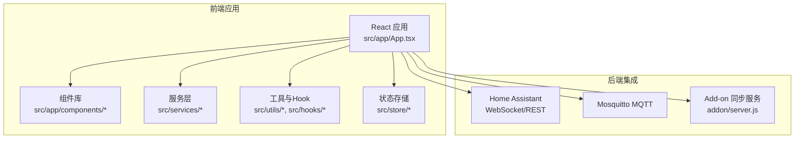
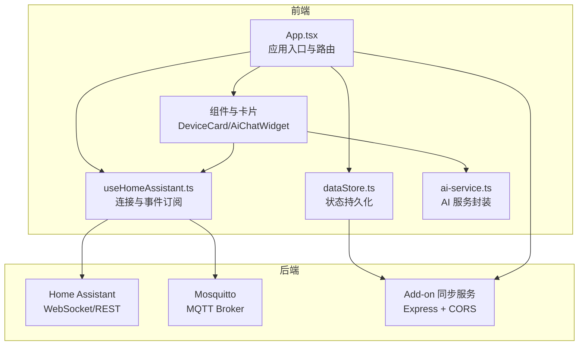
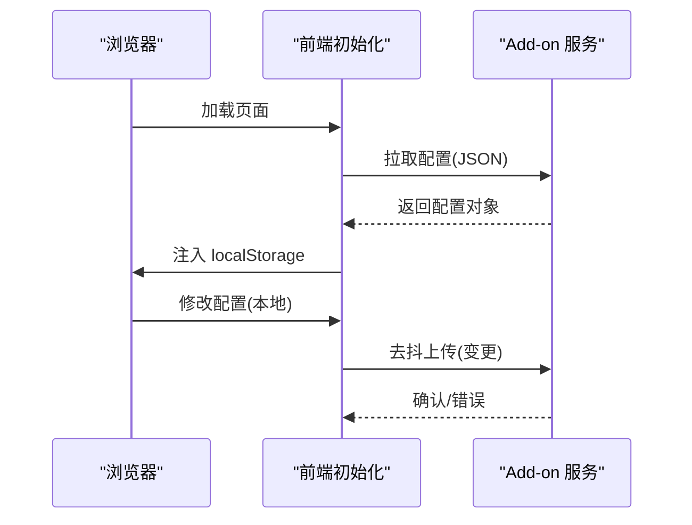
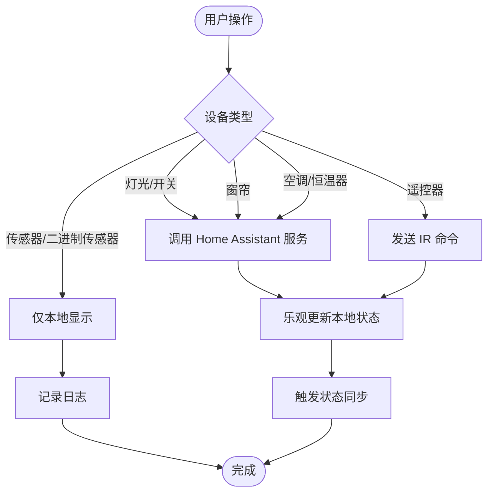
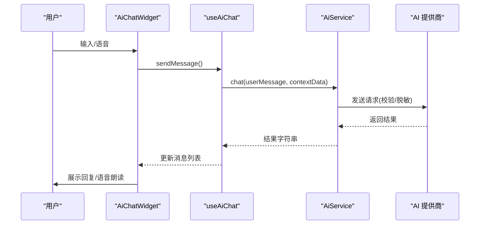
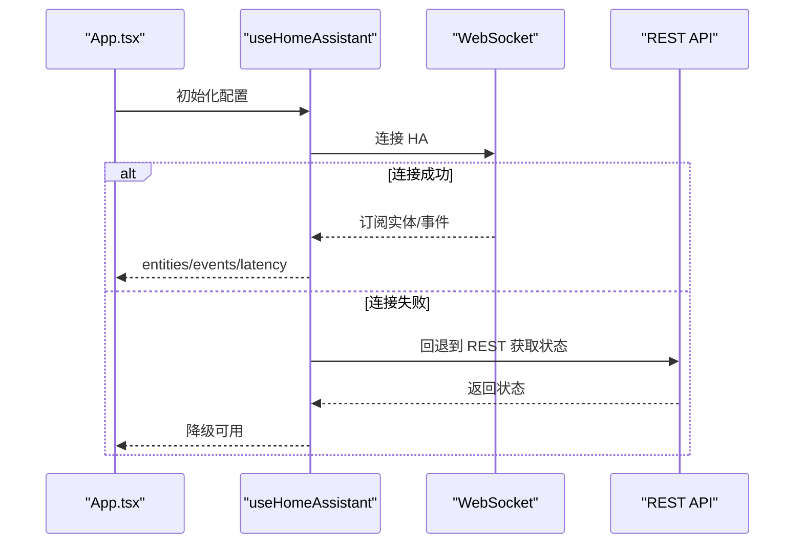
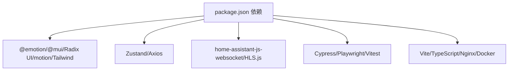

# 项目概述

<cite>
**本文档引用的文件**
- [README.md](file://README.md)
- [package.json](file://package.json)
- [src/main.tsx](file://src/main.tsx)
- [src/app/App.tsx](file://src/app/App.tsx)
- [src/services/ai-service.ts](file://src/services/ai-service.ts)
- [src/utils/device-sync.ts](file://src/utils/device-sync.ts)
- [src/hooks/useHomeAssistant.ts](file://src/hooks/useHomeAssistant.ts)
- [src/store/dataStore.ts](file://src/store/dataStore.ts)
- [src/app/components/dashboard/DeviceCard.tsx](file://src/app/components/dashboard/DeviceCard.tsx)
- [src/app/components/AiChatWidget.tsx](file://src/app/components/AiChatWidget.tsx)
- [src/config/feature-flags.ts](file://src/config/feature-flags.ts)
- [docker-compose.yml](file://docker-compose.yml)
- [Dockerfile](file://Dockerfile)
- [custom_components/yinkun_ui/manifest.json](file://custom_components/yinkun_ui/manifest.json)
- [addon/package.json](file://addon/package.json)
</cite>

## 目录
1. [引言](#引言)
2. [项目结构](#项目结构)
3. [核心组件](#核心组件)
4. [架构总览](#架构总览)
5. [详细组件分析](#详细组件分析)
6. [依赖关系分析](#依赖关系分析)
7. [性能考虑](#性能考虑)
8. [故障排查指南](#故障排查指南)
9. [结论](#结论)
10. [附录](#附录)

## 引言
HAUI 是一款面向 Home Assistant 的专业级智能控制面板，融合 iOS 视觉美学与 React 18 高性能架构，提供全双工语音交互、组件拖拽定制、全监控系统与跨设备配置同步等能力。项目通过现代化前端工程化体系（Vite、TypeScript、Tailwind CSS）与后端集成（Home Assistant WebSocket/REST、Mosquitto MQTT、Node.js Add-on 同步服务），构建出兼具易用性与扩展性的智能家居中枢界面。

项目核心价值主张：
- 以 iOS 风格的视觉与交互体验，降低智能家居操作门槛
- 基于 React 18 的高性能渲染与状态管理，保障复杂场景下的流畅体验
- AI 智能助手：自然语言控制与自动化建议，支持多模型与多提供商
- 全监控系统：多路视频监控（HLS/Ezviz）与实时状态展示
- 跨设备配置同步：通过 Add-on 服务实现云端配置持久化与多端一致

## 项目结构
项目采用“前端 React 应用 + Home Assistant 集成 + 可选 Add-on 同步服务”的分层组织方式。核心目录与职责如下：
- src：前端应用源码，包含页面、组件、服务、Hooks、Store、工具与类型定义
- custom_components/yinkun_ui：Home Assistant 前端集成组件（自定义集成）
- addon：Node.js 同步 Add-on，提供跨设备配置持久化
- config：Home Assistant 配置示例
- docker-compose.yml 与 Dockerfile：一键启动 Home Assistant、Mosquitto 与前端开发环境
- scripts：图标元数据生成、区域坐标与传感器数据生成等工具脚本

**图表来源**
- [src/app/App.tsx:1-1053](file://src/app/App.tsx#L1-L1053)
- [src/main.tsx:1-82](file://src/main.tsx#L1-L82)
- [docker-compose.yml:1-42](file://docker-compose.yml#L1-L42)
- [addon/package.json:1-17](file://addon/package.json#L1-L17)

**章节来源**
- [README.md:1-84](file://README.md#L1-L84)
- [docker-compose.yml:1-42](file://docker-compose.yml#L1-L42)
- [Dockerfile:1-37](file://Dockerfile#L1-L37)

## 核心组件
- 控制面板与设备卡片：统一的设备卡片组件，支持灯光、窗帘、空调、传感器与遥控器等设备类型，提供状态同步、交互与可视化展示
- AI 智能助手：全双工语音交互、消息历史、模型配置与安全净化的 Markdown 渲染
- Home Assistant 集成：WebSocket/REST 连接、实体订阅、事件监听、服务调用与注册表获取
- 跨设备同步：Add-on 服务负责云端配置持久化与多端同步，前端在启动时拉取配置并在本地变更时自动上传
- 状态存储：Zustand + localStorage 持久化，支持部分字段选择性持久化与变更触发同步

**章节来源**
- [src/app/components/dashboard/DeviceCard.tsx:1-293](file://src/app/components/dashboard/DeviceCard.tsx#L1-L293)
- [src/app/components/AiChatWidget.tsx:1-678](file://src/app/components/AiChatWidget.tsx#L1-L678)
- [src/hooks/useHomeAssistant.ts:1-313](file://src/hooks/useHomeAssistant.ts#L1-L313)
- [src/store/dataStore.ts:1-129](file://src/store/dataStore.ts#L1-L129)
- [src/main.tsx:1-82](file://src/main.tsx#L1-L82)

## 架构总览
HAUI 的整体架构围绕“前端 React 应用 + Home Assistant 集成 + 可选 Add-on 同步服务”展开。前端通过 WebSocket/REST 与 Home Assistant 通信，订阅实体状态与事件，调用服务实现设备控制；同时通过 Add-on 服务实现跨设备配置同步。AI 智能助手模块独立于设备控制，但可读取设备状态上下文进行自然语言交互。

**图表来源**
- [src/app/App.tsx:1-1053](file://src/app/App.tsx#L1-L1053)
- [src/hooks/useHomeAssistant.ts:1-313](file://src/hooks/useHomeAssistant.ts#L1-L313)
- [src/store/dataStore.ts:1-129](file://src/store/dataStore.ts#L1-L129)
- [src/services/ai-service.ts:1-201](file://src/services/ai-service.ts#L1-L201)
- [src/main.tsx:1-82](file://src/main.tsx#L1-L82)
- [addon/package.json:1-17](file://addon/package.json#L1-L17)

## 详细组件分析

### 跨设备配置同步（Add-on）
- 启动流程：前端在初始化时向 Add-on 服务发起请求，若返回 JSON 则批量注入 localStorage；随后对 localStorage 的变更进行去抖上传，实现跨设备配置同步
- 容错机制：对超时、404、502/503 等情况进行重试与降级，保证首屏渲染不被阻塞
- 端点与协议：通过 getStorageUrl()/fetchWithTimeout 获取与请求同步端点，遵循 JSON 注入与上传约定

**图表来源**
- [src/main.tsx:18-67](file://src/main.tsx#L18-L67)
- [addon/package.json:1-17](file://addon/package.json#L1-L17)

**章节来源**
- [src/main.tsx:1-82](file://src/main.tsx#L1-L82)

### 设备状态同步与控制
- 设备状态同步：根据 Home Assistant 实体属性与状态，同步灯光亮度、颜色温度、窗帘开合度、传感器数值与在线状态等
- 控制路径：点击/拖拽触发对应更新，优先调用 Home Assistant 服务，同时乐观更新本地状态并记录日志
- 类型覆盖：涵盖灯光、开关、窗帘、传感器、二进制传感器、空调/恒温器、风扇与遥控器等

**图表来源**
- [src/app/App.tsx:488-627](file://src/app/App.tsx#L488-L627)
- [src/utils/device-sync.ts:1-191](file://src/utils/device-sync.ts#L1-L191)

**章节来源**
- [src/app/App.tsx:1-1053](file://src/app/App.tsx#L1-L1053)
- [src/utils/device-sync.ts:1-191](file://src/utils/device-sync.ts#L1-L191)

### AI 智能助手
- 多提供商与模型：内置 SiliconFlow 与阿里云百炼，支持自定义 OpenAI 兼容接口
- 安全与健壮性：Zod Schema 校验、API Key 脱敏、错误分类与用户友好提示、Markdown 内容净化
- 交互体验：全双工语音（监听/思考/朗读）、消息历史、侧边栏/浮窗视图、快捷键与拖拽关闭

**图表来源**
- [src/app/components/AiChatWidget.tsx:1-678](file://src/app/components/AiChatWidget.tsx#L1-L678)
- [src/services/ai-service.ts:1-201](file://src/services/ai-service.ts#L1-L201)

**章节来源**
- [src/app/components/AiChatWidget.tsx:1-678](file://src/app/components/AiChatWidget.tsx#L1-L678)
- [src/services/ai-service.ts:1-201](file://src/services/ai-service.ts#L1-L201)

### Home Assistant 集成
- 连接策略：优先最佳连接（本地/公网），失败时回退代理；支持心跳检测与断线重连
- 数据获取：实体订阅、事件订阅、注册表获取；REST 回退与状态刷新
- 服务调用：统一封装 callService，提供安全与错误处理

**图表来源**
- [src/hooks/useHomeAssistant.ts:1-313](file://src/hooks/useHomeAssistant.ts#L1-L313)

**章节来源**
- [src/hooks/useHomeAssistant.ts:1-313](file://src/hooks/useHomeAssistant.ts#L1-L313)

### 状态存储与持久化
- Zustand + localStorage：选择性持久化设备、房间、场景、用户与日志，变更时触发 Add-on 同步
- 默认值与迁移：加载本地历史数据，确保远程设备卡片默认存在

**章节来源**
- [src/store/dataStore.ts:1-129](file://src/store/dataStore.ts#L1-L129)

## 依赖关系分析
- 前端依赖：React 18、@emotion、@mui、Radix UI、motion、Tailwind CSS、Zustand、Axios、HLS.js、home-assistant-js-websocket、Zod 等
- 开发与测试：Vite、TypeScript、Cypress、Playwright、ESLint、Vitest
- 集成与部署：Docker Compose 一键启动 Home Assistant、Mosquitto 与前端开发服务；Dockerfile 多阶段构建 Nginx 镜像

**图表来源**
- [package.json:1-132](file://package.json#L1-L132)

**章节来源**
- [package.json:1-132](file://package.json#L1-L132)
- [docker-compose.yml:1-42](file://docker-compose.yml#L1-L42)
- [Dockerfile:1-37](file://Dockerfile#L1-L37)

## 性能考虑
- 图标与渲染优化：Web Worker 图标搜索、虚拟列表渲染、CSS mask 渲染 MDI 图标，减少主线程阻塞与重排
- 状态与渲染：设备卡片 memo 化、按需重渲染、时间戳驱动的传感器刷新
- 连接与延迟：心跳检测、断线重连、REST 回退、去抖上传 Add-on

**章节来源**
- [README.md:37-83](file://README.md#L37-L83)
- [src/app/components/dashboard/DeviceCard.tsx:267-293](file://src/app/components/dashboard/DeviceCard.tsx#L267-L293)

## 故障排查指南
- 连接 Home Assistant
  - 检查配置项（本地/公网 URL 与 Token）是否正确
  - 若默认连接失败，确认代理回退是否生效
  - 关注心跳与断线重连日志
- Add-on 同步
  - 若 404/502/503，观察重试与降级行为
  - 确认 localStorage 变更是否触发上传
- AI 服务
  - API Key 校验失败、Base URL/模型名错误、网络异常均有明确提示
  - 生产环境避免泄露内部错误详情
- Docker 环境
  - 确认 Home Assistant、Mosquitto 与前端容器均已启动
  - 检查端口映射与时区配置

**章节来源**
- [src/hooks/useHomeAssistant.ts:67-120](file://src/hooks/useHomeAssistant.ts#L67-L120)
- [src/main.tsx:22-66](file://src/main.tsx#L22-L66)
- [src/services/ai-service.ts:121-157](file://src/services/ai-service.ts#L121-L157)
- [docker-compose.yml:1-42](file://docker-compose.yml#L1-L42)

## 结论
HAUI 将 iOS 视觉风格与 React 18 的高性能特性相结合，通过完善的 Home Assistant 集成与可选 Add-on 同步服务，提供了从设备控制、状态监控到 AI 交互的一体化体验。其模块化架构、安全与健壮性设计以及工程化实践，使其既适合初学者快速上手，也为有经验的开发者提供了良好的扩展空间。

## 附录
- 技术选型要点
  - 前端：React 18 + Vite + Tailwind CSS，强调开发体验与运行时性能
  - 状态：Zustand 简洁高效，localStorage 作为持久化载体
  - 集成：home-assistant-js-websocket 提供 WebSocket/REST 双通道
  - AI：Zod 校验 + OpenAI 兼容接口 + Markdown 净化
  - 部署：Docker Compose 一键环境，Dockerfile 多阶段构建
- 与智能家居系统集成能力
  - 通过 Home Assistant 与 Mosquitto 实现设备控制与消息传递
  - 通过 Add-on 实现跨设备配置同步
  - 通过自定义集成（custom_components/yinkun_ui）增强 HA 前端体验

**章节来源**
- [README.md:1-84](file://README.md#L1-L84)
- [custom_components/yinkun_ui/manifest.json:1-12](file://custom_components/yinkun_ui/manifest.json#L1-L12)
- [src/config/feature-flags.ts:1-7](file://src/config/feature-flags.ts#L1-L7)