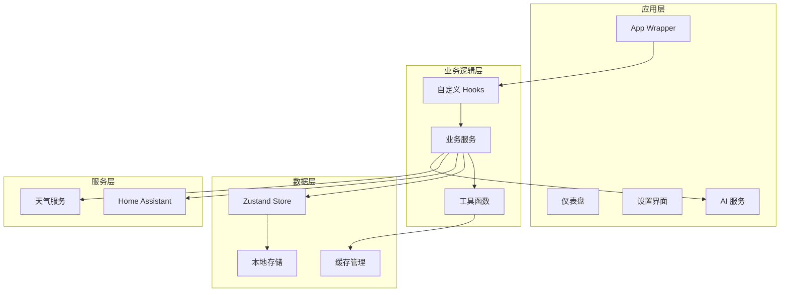
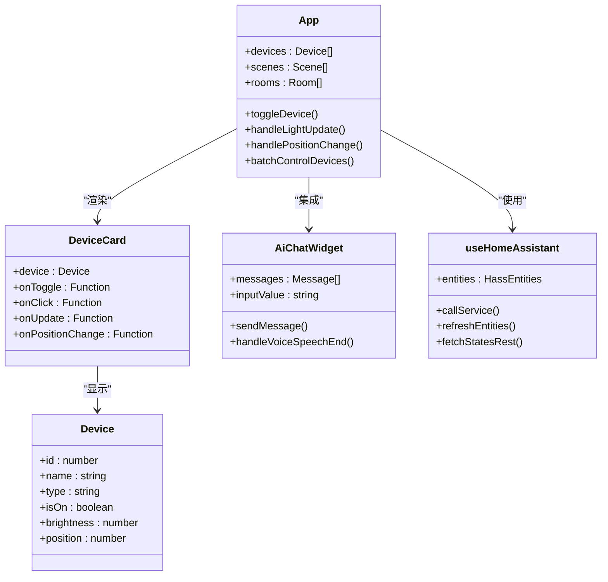
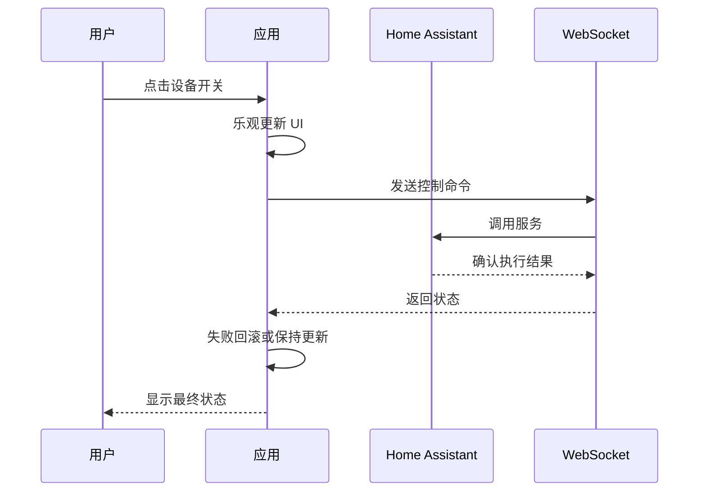

# 用户使用手册

<cite>
**本文档引用的文件**
- [README.md](file://README.md)
- [docs/USER_MANUAL.md](file://docs/USER_MANUAL.md)
- [package.json](file://package.json)
- [src/main.tsx](file://src/main.tsx)
- [src/app/App.tsx](file://src/app/App.tsx)
- [src/app/components/AiChatWidget.tsx](file://src/app/components/AiChatWidget.tsx)
- [src/app/components/dashboard/DeviceCard.tsx](file://src/app/components/dashboard/DeviceCard.tsx)
- [src/app/components/dashboard/Header.tsx](file://src/app/components/dashboard/Header.tsx)
- [src/hooks/useHomeAssistant.ts](file://src/hooks/useHomeAssistant.ts)
- [src/services/weather/weather-factory.ts](file://src/services/weather/weather-factory.ts)
- [src/types/device.ts](file://src/types/device.ts)
- [src/config/initialDevices.ts](file://src/config/initialDevices.ts)
- [src/store/deviceStore.ts](file://src/store/deviceStore.ts)
</cite>

## 目录
1. [简介](#简介)
2. [快速开始](#快速开始)
3. [功能概览](#功能概览)
4. [设备控制](#设备控制)
5. [场景控制](#场景控制)
6. [区域管理](#区域管理)
7. [AI 智能管家](#ai-智能管家)
8. [环境监控](#环境监控)
9. [设置与配置](#设置与配置)
10. [安全功能](#安全功能)
11. [故障排除](#故障排除)
12. [技术架构](#技术架构)
13. [结语](#结语)

## 简介

HAUI Dashboard 是专为 Home Assistant 打造的高性能现代化前端控制面板，融合了 iOS 设计美学与企业级性能。它提供了直观的设备控制界面、强大的 AI 语音助手、实时环境监控以及完善的安全保障机制。

### 核心特性

- **极客视觉体验**：融合 iOS 设计美学，打造丝滑的交互体验
- **AI 原生集成**：内置大语言模型支持，实现自然语言设备控制
- **全平台适配**：从手机到平板，从桌面到电视，完美适配各种屏幕
- **企业级安全**：公网访问安全策略，PIN 码二次确认机制
- **高性能架构**：WebSocket 实时同步，按需加载，防抖节流优化

## 快速开始

### 安装方式

#### 方式一：Home Assistant Add-on（推荐）

1. 在 Home Assistant 中，进入 **设置** → **加载项** → **加载项商店**
2. 添加仓库地址：`https://github.com/skyeyinkun/HAUI`
3. 搜索并安装 **"HAUI - 智能家庭中枢"**
4. 启动加载项，点击 **打开 Web UI**

#### 方式二：独立部署

```bash
# 克隆仓库
git clone https://github.com/skyeyinkun/HAUI.git
cd HAUI

# 安装依赖
npm install

# 构建项目
npm run build

# 启动服务
npm run dev
```

### 首次配置

1. 打开 HAUI Dashboard 界面
2. 点击右下角 **设置** 按钮
3. 在 **Home Assistant 配置** 标签页中填写：
   - **本地地址**: 如 `http://homeassistant.local:8123`
   - **公网地址**（可选）: 如 `https://your-domain.ui.nabu.casa`
   - **访问令牌**: 从 HA 用户资料页面创建长期令牌
4. 点击 **保存配置**

## 功能概览

### 智能仪表盘

HAUI Dashboard 提供了一个美观实用的智能控制界面，支持多种设备类型的统一管理。

#### 设备控制
- **开关控制**: 点击设备卡片即可开关
- **亮度调节**: 支持灯光亮度滑动调节（带防抖优化）
- **色温调节**: 支持冷暖色温调整
- **窗帘控制**: 支持开合度百分比调节

#### 场景模式
- 预设场景一键激活
- 支持自定义场景配置
- 场景执行状态反馈

### AI 智能管家

#### 语音交互
- 点击右下角 AI 图标启动语音对话
- 支持自然语言控制设备
- 支持查询设备状态、天气信息

#### 智能推荐
- 基于使用习惯的设备推荐
- 异常状态智能提醒

### 环境监控

#### 实时数据显示
- 温度、湿度、光照传感器
- 能耗统计与趋势分析
- 天气信息显示

#### 区域管理
- 支持多房间/区域划分
- 区域设备快速筛选
- 常用设备快捷入口

### 万能遥控

#### 红外遥控
- 支持电视、空调、风扇等设备
- 自定义红外码学习
- 遥控面板可视化

#### 气候控制
- 空调温度、模式、风速调节
- 定时开关设置
- 智能温控策略

## 设备控制

### 开关设备

1. 在主界面找到目标设备卡片
2. 点击卡片任意位置即可切换开关状态
3. 开关状态会实时同步到 Home Assistant

### 调节灯光亮度

1. 长按灯光设备卡片进入详情
2. 拖动亮度滑块调节（0-100%）
3. 松开后自动保存（防抖优化，避免频繁请求）

### 控制窗帘

1. 在窗帘卡片上拖动滑块调节开合度
2. 0% = 完全关闭，100% = 完全打开
3. 点击卡片可快速切换全开/全关

### 批量控制

HAUI 支持批量设备控制功能，通过 homeassistant.turn_on/off 服务减少 WebSocket 开销：

- 同时控制多个设备的场景
- 自动分批处理，每批最多 50 个设备
- 并行执行所有批次，提高效率

## 场景控制

### 激活场景

1. 在主界面上方找到场景卡片
2. 点击场景图标即可激活
3. 场景激活后有 3 秒冷却时间

### 编辑场景

1. 进入 **设置** → **场景配置**
2. 添加或修改场景名称
3. 配置场景对应的 HA 实体

## 区域管理

### 切换区域

1. 点击顶部区域标签栏
2. 选择目标区域（客厅、卧室、厨房等）
3. 设备列表会自动筛选该区域设备

### 设置常用设备

1. 长按仪表盘空白处进入编辑模式
2. 点击设备卡片上的星标图标
3. 常用设备会显示在"常用"标签页

## AI 智能管家

### 启动语音助手

1. 点击右下角 AI 图标
2. 允许浏览器使用麦克风权限
3. 听到提示音后说出指令

### 常用语音指令示例
- "打开客厅灯"
- "把卧室空调调到 26 度"
- "关闭所有灯"
- "今天天气怎么样"

### AI 对话功能

AI 智能管家提供完整的对话体验：

- **多模态输入**：支持文本和语音两种输入方式
- **实时状态**：显示 AI 的当前状态（聆听、思考、说话）
- **历史记录**：完整保留对话历史
- **模型配置**：可配置不同的 AI 模型和参数

## 环境监控

### 实时数据显示

系统集成了全面的环境监控功能：

- **传感器数据**：温度、湿度、光照等实时显示
- **能耗统计**：用电量统计与趋势分析
- **天气信息**：实时天气与预报

### 天气配置

1. 进入 **设置** → **天气配置**
2. 选择所在省份、城市、区县
3. 系统会自动获取坐标信息

## 设置与配置

### Home Assistant 连接配置

| 配置项 | 说明 | 示例 |
|--------|------|------|
| 本地地址 | 局域网内 HA 地址 | `http://192.168.1.100:8123` |
| 公网地址 | 外网访问地址（可选） | `https://xxx.ui.nabu.casa` |
| 访问令牌 | HA 长期访问令牌 | `eyJ0eXAiOiJKV1QiLCJhbG...` |

### AI 配置

| 配置项 | 说明 | 默认值 |
|--------|------|--------|
| AI 提供商 | 选择 AI 服务提供商 | SiliconFlow |
| API 密钥 | 服务商提供的 API Key | - |
| 模型 | 使用的 AI 模型 | DeepSeek-V3 |
| 基础 URL | API 服务端点 | `https://api.siliconflow.cn/v1` |

### 设备映射配置

在 **设置** → **设备映射** 中：
- 将 HAUI 设备与 HA 实体进行关联
- 支持自动发现和手动配置
- 支持批量导入导出

## 安全功能

### 公网访问安全

#### PIN 码保护
- 当通过公网地址访问时，高危操作（开锁、解除安防等）需要输入 PIN 码确认
- 首次使用需设置 4-6 位数字 PIN 码
- PIN 码在本地加密存储

#### 高危操作列表
- 门锁控制
- 安防系统解除
- 车库门控制
- 报警器控制

### 数据安全

#### 本地加密
- 访问令牌使用 Base64 混淆存储
- PIN 码加密存储在浏览器本地
- 所有敏感数据不上传云端

#### CSP 安全策略
- 启用内容安全策略防止 XSS 攻击
- 限制外部资源加载
- 仅允许同源脚本执行

## 故障排除

### 无法连接到 Home Assistant

**现象**: 界面显示"未连接到 Home Assistant"

**解决方法**:
1. 检查 HA 地址是否正确
2. 确认访问令牌是否有效
3. 检查网络连接
4. 查看浏览器控制台网络请求

### 设备状态不同步

**现象**: 设备状态与实际不符

**解决方法**:
1. 检查设备映射配置
2. 刷新页面重新连接
3. 检查 HA 实体状态是否正常
4. 查看 WebSocket 连接状态

### AI 语音无响应

**现象**: 点击 AI 图标无反应或无法识别语音

**解决方法**:
1. 检查浏览器麦克风权限
2. 确认 AI API 密钥配置正确
3. 检查网络连接
4. 查看浏览器控制台错误信息

### 场景执行失败

**现象**: 点击场景无反应或部分设备未执行

**解决方法**:
1. 检查场景映射配置
2. 确认 HA 场景实体存在
3. 检查设备是否在线
4. 查看日志输出

### 性能问题

**现象**: 界面卡顿、响应慢

**解决方法**:
1. 启用"减少动画"模式（设置 → 外观）
2. 减少同时显示的设备数量
3. 检查浏览器性能
4. 关闭不必要的浏览器扩展

## 技术架构

### 前端架构

HAUI Dashboard 采用现代化的前端技术栈：



**架构特点**:
- **模块化设计**: 功能按模块组织，便于维护和扩展
- **状态管理**: 使用 Zustand 进行轻量级状态管理
- **实时通信**: 通过 WebSocket 与 Home Assistant 实时同步
- **性能优化**: 防抖节流、代码分割、懒加载等优化策略

### 核心组件关系



### 数据流图



## 结语

HAUI Dashboard 作为 Home Assistant 的现代化前端控制面板，致力于为用户提供最佳的智能家居控制体验。通过简洁直观的界面设计、强大的 AI 助手功能以及完善的安全保障机制，让用户能够轻松管理和控制家中的智能设备。

### 版本信息
- **当前版本**: 3.29.0
- **更新日期**: 2026年3月28日
- **适用平台**: Home Assistant Add-on / 独立部署

### 技术支持
- **GitHub Issues**: https://github.com/skyeyinkun/HAUI/issues
- **文档中心**: https://github.com/skyeyinkun/HAUI/tree/main/docs

如有任何问题或建议，欢迎通过 GitHub Issues 或文档中心获取帮助。